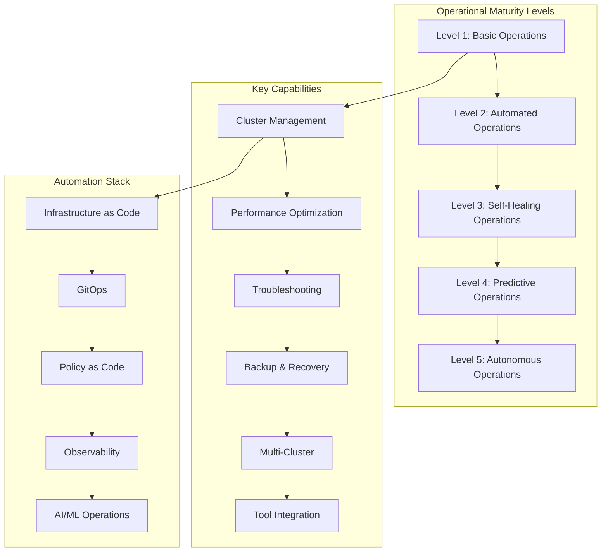

# Session 8: Day 4 종합 정리 및 운영 자동화

## 📍 교과과정에서의 위치
이 세션은 **Week 2 > Day 4 > Session 8**로, 하루 동안 학습한 고급 Kubernetes 운영 기법들을 종합 정리하고 실제 프로덕션 환경에서의 운영 자동화 전략을 심화 분석합니다.

## 학습 목표 (5분)
- **고급 Kubernetes 운영** 기법들의 **통합적 적용** 전략
- **프로덕션 환경** 운영 **모범 사례** 및 **자동화** 구현
- **차세대 Kubernetes 기술** 트렌드와 **미래 발전 방향**

## 1. 종합 정리: 고급 Kubernetes 운영 통합 전략 (15분)

### 운영 성숙도 모델



### 운영 성숙도별 특성 분석

```
Kubernetes 운영 성숙도:

Level 1: 기본 운영 (Basic Operations):
├── 수동 클러스터 관리:
│   ├── 수동 배포 및 업데이트
│   ├── 기본적인 모니터링 설정
│   ├── 반응적 문제 해결
│   ├── 수동 백업 및 복구
│   └── 단일 클러스터 운영
├── 특징:
│   ├── 높은 운영 부담
│   ├── 휴먼 에러 위험
│   ├── 일관성 부족
│   ├── 확장성 제한
│   └── 느린 대응 시간
└── 개선 방향:
    ├── 자동화 도구 도입
    ├── 표준화된 프로세스
    ├── 모니터링 강화
    └── 문서화 체계 구축

Level 2: 자동화된 운영 (Automated Operations):
├── 자동화 구현:
│   ├── CI/CD 파이프라인 구축
│   ├── Infrastructure as Code
│   ├── 자동화된 모니터링 및 알림
│   ├── 스케줄된 백업 시스템
│   └── 기본적인 자동 스케일링
├── 특징:
│   ├── 일관된 배포 프로세스
│   ├── 반복 작업 자동화
│   ├── 표준화된 설정 관리
│   ├── 기본적인 자가 복구
│   └── 운영 효율성 향상
└── 개선 방향:
    ├── 지능형 자동화
    ├── 예측적 분석
    ├── 정책 기반 관리
    └── 멀티 클러스터 확장

Level 3: 자가 치유 운영 (Self-Healing Operations):
├── 지능형 자동화:
│   ├── 자동 장애 감지 및 복구
│   ├── 동적 리소스 최적화
│   ├── 예측적 스케일링
│   ├── 자동 성능 튜닝
│   └── 정책 기반 자동 대응
├── 특징:
│   ├── 최소한의 수동 개입
│   ├── 빠른 장애 복구
│   ├── 지속적인 최적화
│   ├── 높은 시스템 안정성
│   └── 예측 가능한 성능
└── 개선 방향:
    ├── AI/ML 기반 예측
    ├── 완전 자율 운영
    ├── 비즈니스 메트릭 통합
    └── 지속적 학습 시스템

Level 4: 예측적 운영 (Predictive Operations):
├── AI/ML 기반 운영:
│   ├── 장애 예측 및 사전 대응
│   ├── 용량 계획 자동화
│   ├── 성능 이상 사전 감지
│   ├── 비용 최적화 예측
│   └── 보안 위협 사전 차단
├── 특징:
│   ├── 사전 예방적 운영
│   ├── 데이터 기반 의사결정
│   ├── 지속적 학습 및 개선
│   ├── 비즈니스 가치 최적화
│   └── 혁신적 운영 모델
└── 목표:
    ├── 완전 자율 운영 달성
    ├── 비즈니스 연계 강화
    ├── 지속적 혁신 추진
    └── 생태계 통합 완성

Level 5: 자율 운영 (Autonomous Operations):
├── 완전 자율 시스템:
│   ├── 자율적 의사결정
│   ├── 자가 진화 시스템
│   ├── 비즈니스 목표 자동 달성
│   ├── 혁신적 솔루션 자동 발견
│   └── 생태계 자율 최적화
├── 특징:
│   ├── 인간 개입 최소화
│   ├── 지속적 자가 개선
│   ├── 창의적 문제 해결
│   ├── 비즈니스 가치 극대화
│   └── 미래 지향적 운영
└── 비전:
    ├── 완전 무인 운영
    ├── 자율적 혁신 창출
    ├── 생태계 진화 주도
    └── 차세대 플랫폼 구현
```

### 통합 운영 아키텍처

```
엔드-투-엔드 운영 아키텍처:

인프라 계층:
├── 멀티 클라우드 인프라:
│   ├── Terraform을 통한 IaC
│   ├── Cluster API 기반 클러스터 관리
│   ├── 자동 프로비저닝 및 스케일링
│   ├── 비용 최적화 자동화
│   └── 재해 복구 자동화
├── 네트워크 및 보안:
│   ├── 서비스 메시 통합 (Istio/Linkerd)
│   ├── 네트워크 정책 자동화
│   ├── 제로 트러스트 아키텍처
│   ├── 자동 인증서 관리
│   └── 보안 정책 as Code
└── 스토리지 관리:
    ├── 동적 볼륨 프로비저닝
    ├── 자동 백업 및 스냅샷
    ├── 데이터 라이프사이클 관리
    ├── 성능 모니터링 및 최적화
    └── 재해 복구 자동화

플랫폼 계층:
├── GitOps 기반 배포:
│   ├── ArgoCD 멀티 클러스터 관리
│   ├── 자동 동기화 및 드리프트 감지
│   ├── 정책 기반 승인 워크플로우
│   ├── 카나리 및 블루-그린 배포
│   └── 자동 롤백 및 복구
├── 관찰가능성:
│   ├── 통합 모니터링 스택 (Prometheus/Grafana)
│   ├── 분산 추적 (Jaeger/Zipkin)
│   ├── 중앙집중식 로깅 (ELK/EFK)
│   ├── SLI/SLO 기반 알림
│   └── AI 기반 이상 탐지
└── 자동화 엔진:
    ├── 정책 엔진 (OPA/Gatekeeper)
    ├── 워크플로우 자동화 (Argo Workflows)
    ├── 이벤트 기반 자동화 (KEDA)
    ├── 카오스 엔지니어링 (Chaos Mesh)
    └── 자동 복구 시스템

애플리케이션 계층:
├── 마이크로서비스 관리:
│   ├── 서비스 디스커버리 자동화
│   ├── 로드 밸런싱 및 트래픽 관리
│   ├── 서킷 브레이커 및 재시도 정책
│   ├── 분산 추적 및 디버깅
│   └── 성능 최적화 자동화
├── 데이터 관리:
│   ├── 데이터베이스 오퍼레이터
│   ├── 자동 백업 및 복구
│   ├── 데이터 마이그레이션 자동화
│   ├── 성능 모니터링 및 튜닝
│   └── 보안 및 컴플라이언스
└── 비즈니스 로직:
    ├── 기능 플래그 관리
    ├── A/B 테스트 자동화
    ├── 사용자 경험 모니터링
    ├── 비즈니스 메트릭 추적
    └── 자동 최적화 및 개선
```

## 2. 실무 시나리오: 엔터프라이즈 Kubernetes 플랫폼 구축 (20분)

### 대규모 엔터프라이즈 요구사항

```
엔터프라이즈 플랫폼 시나리오:

비즈니스 요구사항:
├── 조직 규모:
│   ├── 개발팀 50개, 개발자 500명
│   ├── 마이크로서비스 200개 이상
│   ├── 일일 배포 1000회 이상
│   ├── 글로벌 5개 지역 서비스
│   └── 연간 매출 10억 달러 이상
├── 기술적 요구사항:
│   ├── 99.99% 가용성 (연간 52분 다운타임)
│   ├── 자동 스케일링 (1-10,000 Pod)
│   ├── 멀티 클라우드 (AWS, Azure, GCP)
│   ├── 하이브리드 클라우드 (온프레미스 + 클라우드)
│   └── 엣지 컴퓨팅 지원 (100+ 엣지 위치)
├── 보안 및 컴플라이언스:
│   ├── SOC 2 Type II 인증
│   ├── ISO 27001 준수
│   ├── GDPR 및 개인정보보호법 준수
│   ├── 금융 규제 대응 (PCI DSS)
│   └── 제로 트러스트 보안 모델
└── 운영 효율성:
    ├── 셀프 서비스 플랫폼
    ├── 자동화된 운영 (95% 이상)
    ├── 비용 최적화 (30% 절감)
    ├── 개발자 생산성 향상 (50%)
    └── 운영팀 효율성 증대 (70%)

플랫폼 아키텍처 설계:
├── 멀티 클러스터 전략:
│   ├── 지역별 프로덕션 클러스터 (5개)
│   ├── 환경별 클러스터 (dev, staging, prod)
│   ├── 팀별 개발 클러스터 (50개)
│   ├── 특수 목적 클러스터 (ML, 배치, 엣지)
│   └── 관리 클러스터 (GitOps, 모니터링)
├── 네트워크 아키텍처:
│   ├── 글로벌 서비스 메시 (Istio)
│   ├── 멀티 클러스터 네트워킹 (Submariner)
│   ├── 글로벌 로드 밸런싱 (Admiral)
│   ├── CDN 통합 (CloudFlare/AWS CloudFront)
│   └── 엣지 컴퓨팅 네트워크
├── 데이터 아키텍처:
│   ├── 분산 데이터베이스 (CockroachDB, MongoDB)
│   ├── 데이터 레이크 (S3, HDFS)
│   ├── 실시간 스트리밍 (Kafka, Pulsar)
│   ├── 캐시 계층 (Redis Cluster)
│   └── 데이터 파이프라인 (Apache Airflow)
└── 보안 아키텍처:
    ├── 제로 트러스트 네트워킹
    ├── 서비스 메시 보안 (mTLS)
    ├── 정책 엔진 (OPA/Gatekeeper)
    ├── 시크릿 관리 (Vault, External Secrets)
    └── 보안 스캔 및 모니터링 (Falco, Twistlock)

자동화 및 운영:
├── GitOps 기반 배포:
│   ├── ArgoCD ApplicationSet
│   ├── 멀티 클러스터 동기화
│   ├── 정책 기반 승인 워크플로우
│   ├── 자동 프로모션 파이프라인
│   └── 카나리 배포 자동화
├── 관찰가능성:
│   ├── 통합 메트릭 (Prometheus Federation)
│   ├── 분산 추적 (Jaeger)
│   ├── 중앙집중식 로깅 (ELK)
│   ├── SLI/SLO 모니터링
│   └── 비즈니스 메트릭 대시보드
├── 자동 복구:
│   ├── 헬스 체크 기반 자동 복구
│   ├── 카오스 엔지니어링 (Chaos Mesh)
│   ├── 자동 스케일링 (HPA/VPA/CA)
│   ├── 장애 격리 및 복구
│   └── 자동 롤백 시스템
└── 비용 최적화:
    ├── 리소스 사용률 모니터링
    ├── 스팟 인스턴스 자동 활용
    ├── 자동 스케일 다운
    ├── 비용 분석 및 청구
    └── 예산 기반 알림
```

### 플랫폼 구현 전략

```yaml
# 엔터프라이즈 플랫폼 구성 (개념 예시)

# 1. 멀티 클러스터 ArgoCD 설정
apiVersion: argoproj.io/v1alpha1
kind: ApplicationSet
metadata:
  name: platform-services
  namespace: argocd
spec:
  generators:
  - clusters:
      selector:
        matchLabels:
          environment: production
  - list:
      elements:
      - cluster: us-west-2
        region: us-west-2
        environment: production
      - cluster: eu-west-1
        region: eu-west-1
        environment: production
      - cluster: ap-southeast-1
        region: ap-southeast-1
        environment: production
  template:
    metadata:
      name: '{{cluster}}-platform'
    spec:
      project: platform
      source:
        repoURL: https://github.com/company/platform-manifests
        targetRevision: HEAD
        path: 'regions/{{region}}/platform'
        helm:
          valueFiles:
          - 'values-{{environment}}.yaml'
          - 'values-{{region}}.yaml'
      destination:
        server: '{{server}}'
        namespace: platform-system
      syncPolicy:
        automated:
          prune: true
          selfHeal: true
        syncOptions:
        - CreateNamespace=true
        - RespectIgnoreDifferences=true

---
# 2. 글로벌 정책 관리
apiVersion: kustomize.config.k8s.io/v1beta1
kind: Kustomization
metadata:
  name: global-policies
resources:
- security-policies/
- network-policies/
- resource-quotas/
- rbac-policies/

patchesStrategicMerge:
- region-overrides.yaml

configMapGenerator:
- name: platform-config
  literals:
  - region={{REGION}}
  - environment={{ENVIRONMENT}}
  - cluster_id={{CLUSTER_ID}}

---
# 3. 자동화된 백업 정책
apiVersion: velero.io/v1
kind: Schedule
metadata:
  name: enterprise-backup
spec:
  schedule: "0 2 * * *"
  template:
    includedNamespaces:
    - production
    - platform-system
    excludedResources:
    - events
    - events.events.k8s.io
    snapshotVolumes: true
    ttl: 2160h0m0s  # 90 days
    storageLocation: primary
    volumeSnapshotLocations:
    - primary
    hooks:
      resources:
      - name: database-backup-hook
        includedNamespaces:
        - production
        labelSelector:
          matchLabels:
            app: database
        pre:
        - exec:
            container: database
            command:
            - /bin/bash
            - -c
            - "pg_dump -h localhost -U postgres mydb > /tmp/backup.sql"
        post:
        - exec:
            container: database
            command:
            - /bin/bash
            - -c
            - "rm -f /tmp/backup.sql"
```

## 3. 차세대 Kubernetes 기술 트렌드 (12분)

### 미래 기술 발전 방향

```
Kubernetes 미래 트렌드:

서버리스 및 이벤트 기반:
├── Knative 서버리스 플랫폼:
│   ├── 자동 스케일링 (0까지 스케일 다운)
│   ├── 이벤트 기반 아키텍처
│   ├── 함수형 워크로드 지원
│   ├── 비용 효율적 리소스 사용
│   └── 개발자 경험 향상
├── KEDA 이벤트 기반 스케일링:
│   ├── 외부 메트릭 기반 스케일링
│   ├── 큐 길이, 메시지 수 등 활용
│   ├── 다양한 이벤트 소스 지원
│   ├── 서버리스 워크로드 최적화
│   └── 비용 최적화 자동화
└── WebAssembly (WASM) 통합:
    ├── 경량화된 런타임 환경
    ├── 다중 언어 지원
    ├── 보안 강화된 샌드박스
    ├── 엣지 컴퓨팅 최적화
    └── 서버리스 함수 실행

엣지 컴퓨팅 및 IoT:
├── K3s/MicroK8s 경량 배포:
│   ├── 리소스 제약 환경 최적화
│   ├── 빠른 부팅 및 배포
│   ├── 최소한의 의존성
│   ├── 엣지 디바이스 지원
│   └── 중앙-엣지 하이브리드 관리
├── KubeEdge 엣지 컴퓨팅:
│   ├── 클라우드-엣지 통합 관리
│   ├── 오프라인 자율 운영
│   ├── 지능형 스케줄링
│   ├── 데이터 로컬 처리
│   └── 실시간 응답 보장
└── 5G 및 네트워크 슬라이싱:
    ├── 초저지연 네트워킹
    ├── 네트워크 기능 가상화 (NFV)
    ├── 동적 네트워크 슬라이싱
    ├── QoS 보장 서비스
    └── 모바일 엣지 컴퓨팅

AI/ML 운영 자동화:
├── AIOps 플랫폼:
│   ├── 이상 탐지 및 예측
│   ├── 자동 근본 원인 분석
│   ├── 지능형 알림 시스템
│   ├── 예측적 스케일링
│   └── 자율적 문제 해결
├── MLOps 통합:
│   ├── 모델 서빙 자동화 (KServe)
│   ├── 모델 파이프라인 (Kubeflow)
│   ├── 실험 관리 및 추적
│   ├── A/B 테스트 자동화
│   └── 모델 드리프트 감지
└── 지능형 리소스 관리:
    ├── 워크로드 패턴 학습
    ├── 예측적 용량 계획
    ├── 자동 성능 튜닝
    ├── 비용 최적화 AI
    └── 자율적 클러스터 관리

지속가능성 및 그린 컴퓨팅:
├── 탄소 발자국 최소화:
│   ├── 에너지 효율적 스케줄링
│   ├── 재생 에너지 활용 최적화
│   ├── 탄소 인식 워크로드 배치
│   ├── 그린 메트릭 모니터링
│   └── 환경 영향 리포팅
├── 리소스 효율성:
│   ├── 지능형 빈 패킹 (Bin Packing)
│   ├── 유휴 리소스 최소화
│   ├── 동적 전력 관리
│   ├── 쿨링 최적화
│   └── 하드웨어 수명 연장
└── 순환 경제 모델:
    ├── 하드웨어 재사용 최적화
    ├── 클라우드 리소스 공유
    ├── 폐기물 최소화
    ├── 지속가능한 공급망
    └── ESG 목표 달성 지원
```

## 4. 운영 자동화 로드맵 (5분)

### 단계별 자동화 구현 계획

```
자동화 로드맵:

Phase 1: 기반 자동화 (0-6개월):
├── Infrastructure as Code 구현
├── CI/CD 파이프라인 구축
├── 기본 모니터링 및 알림
├── 자동 백업 시스템
└── GitOps 기반 배포

Phase 2: 지능형 자동화 (6-12개월):
├── 자동 스케일링 최적화
├── 자가 치유 시스템 구현
├── 예측적 모니터링
├── 정책 기반 자동화
└── 멀티 클러스터 관리

Phase 3: AI 기반 자동화 (12-18개월):
├── 머신러닝 기반 예측
├── 자율적 문제 해결
├── 지능형 리소스 최적화
├── 자동 성능 튜닝
└── 비즈니스 메트릭 연동

Phase 4: 완전 자율 운영 (18-24개월):
├── 자율적 의사결정 시스템
├── 자가 진화 플랫폼
├── 창의적 문제 해결
├── 비즈니스 가치 최적화
└── 생태계 자율 관리
```

## 5. 미래 전망 및 학습 방향 (3분)

### Week 2 전체 과정 완료 및 다음 단계

```
Week 2 학습 성과:
├── Day 1: Docker 심화 아키텍처 및 최적화
├── Day 2: 컨테이너 성능 튜닝 및 운영 관리
├── Day 3: Kubernetes 오케스트레이션 이론
└── Day 4: 고급 Kubernetes 운영 및 자동화

다음 학습 방향:
├── 실무 프로젝트 적용
├── 인증 취득 (CKA, CKAD, CKS)
├── 커뮤니티 참여 및 기여
├── 최신 기술 트렌드 추적
└── 지속적인 실험 및 학습

미래 기술 준비:
├── 서버리스 및 이벤트 기반 아키텍처
├── 엣지 컴퓨팅 및 IoT 플랫폼
├── AI/ML 운영 자동화
├── 지속가능한 컴퓨팅
└── 차세대 클라우드 네이티브 기술
```

## 💡 핵심 키워드
- **운영 성숙도**: 기본 → 자동화 → 자가치유 → 예측 → 자율
- **엔터프라이즈**: 멀티 클러스터, 글로벌 서비스, 보안, 컴플라이언스
- **미래 기술**: 서버리스, 엣지, AI/ML, 지속가능성
- **자동화**: GitOps, 정책 기반, 지능형, 자율 운영

## 📚 추가 학습 자료
- [Kubernetes 운영 가이드](https://kubernetes.io/docs/setup/production-environment/)
- [CNCF 기술 레이더](https://radar.cncf.io/)
- [클라우드 네이티브 성숙도 모델](https://www.cncf.io/blog/2020/10/06/cloud-native-maturity-model/)
