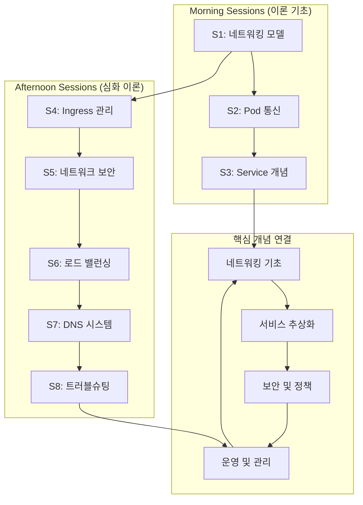

# Week 2 Day 5: Kubernetes 네트워킹 기초와 서비스 디스커버리

## 📅 일정 개요
- **날짜**: Week 2, Day 5
- **주제**: Kubernetes 네트워킹 아키텍처와 서비스 관리
- **학습 방식**: 이론 80% + 개념 예시 20%
- **총 세션**: 8개 세션 (50분 × 8 = 400분)

## 🎯 학습 목표
- **Kubernetes 네트워킹** 모델과 **CNI** 아키텍처 완전 이해
- **Service**와 **Ingress**를 통한 **서비스 디스커버리** 학습
- **네트워크 정책**과 **보안** 메커니즘 파악
- **로드 밸런싱**과 **트래픽 관리** 전략 수립

## 📚 Day 5 세션 구성

### [Session 1: Kubernetes 네트워킹 모델과 CNI](./session_01.md)
**시간**: 09:00 - 09:50 (50분)
**학습 목표**:
- Kubernetes 네트워킹 기본 원리와 요구사항 이해
- CNI(Container Network Interface) 아키텍처 분석
- 다양한 CNI 플러그인 특성과 선택 기준 학습
- 네트워크 주소 할당과 라우팅 메커니즘 파악

**주요 내용**:
- Kubernetes 네트워킹 4대 원칙
- CNI 표준과 구현체 비교
- Pod-to-Pod 통신 메커니즘
- 클러스터 네트워크 토폴로지

### [Session 2: Pod 네트워킹과 통신 메커니즘](./session_02.md)
**시간**: 10:00 - 10:50 (50분)
**학습 목표**:
- Pod 내부 네트워킹 구조와 컨테이너 간 통신 이해
- Pod-to-Pod 통신 경로와 라우팅 분석
- 네트워크 네임스페이스와 격리 메커니즘 학습
- DNS 기반 서비스 디스커버리 원리 파악

**주요 내용**:
- Pod 네트워크 네임스페이스
- 컨테이너 간 localhost 통신
- 클러스터 내 Pod 통신 경로
- kube-dns/CoreDNS 아키텍처

### [Session 3: Service 개념과 타입별 특성](./session_03.md)
**시간**: 11:00 - 11:50 (50분)
**학습 목표**:
- Service 추상화 개념과 필요성 완전 이해
- ClusterIP, NodePort, LoadBalancer 타입별 특성 분석
- Service 선택자와 엔드포인트 관리 메커니즘 학습
- 서비스 디스커버리와 로드 밸런싱 원리 파악

**주요 내용**:
- Service 추상화 레이어
- 서비스 타입별 사용 사례
- kube-proxy 동작 원리
- 엔드포인트 슬라이스 관리

### [Session 4: Ingress와 외부 트래픽 관리](./session_04.md)
**시간**: 13:00 - 13:50 (50분)
**학습 목표**:
- Ingress 리소스와 컨트롤러 아키텍처 이해
- HTTP/HTTPS 라우팅과 SSL 종료 메커니즘 학습
- 다양한 Ingress 컨트롤러 특성과 선택 기준 분석
- 외부 트래픽 관리와 보안 정책 수립

**주요 내용**:
- Ingress vs Service 비교
- 경로 기반 라우팅 규칙
- TLS 인증서 관리
- Ingress 컨트롤러 생태계

### [Session 5: 네트워크 정책과 보안](./session_05.md)
**시간**: 14:00 - 14:50 (50분)
**학습 목표**:
- NetworkPolicy 리소스와 보안 모델 완전 이해
- 마이크로세그멘테이션과 제로 트러스트 네트워킹 학습
- 트래픽 필터링과 접근 제어 정책 설계
- 네트워크 보안 모니터링과 감사 체계 구축

**주요 내용**:
- NetworkPolicy 규칙 설계
- Ingress/Egress 트래픽 제어
- 네임스페이스 기반 격리
- 보안 정책 베스트 프랙티스

### [Session 6: 로드 밸런싱과 트래픽 분산](./session_06.md)
**시간**: 15:00 - 15:50 (50분)
**학습 목표**:
- Kubernetes 로드 밸런싱 메커니즘과 알고리즘 이해
- 세션 어피니티와 트래픽 분산 전략 학습
- 헬스 체크와 장애 조치 메커니즘 분석
- 성능 최적화와 확장성 고려사항 파악

**주요 내용**:
- kube-proxy 로드 밸런싱 모드
- 세션 어피니티 설정
- 헬스 체크 및 Readiness Probe
- 트래픽 가중치 분산

### [Session 7: DNS와 서비스 디스커버리](./session_07.md)
**시간**: 16:00 - 16:50 (50분)
**학습 목표**:
- Kubernetes DNS 시스템 아키텍처와 동작 원리 이해
- 서비스 디스커버리 패턴과 구현 방법 학습
- DNS 기반 로드 밸런싱과 장애 조치 분석
- 외부 서비스 통합과 하이브리드 환경 관리

**주요 내용**:
- CoreDNS 설정과 관리
- DNS 레코드 생성 규칙
- 외부 서비스 연동
- 서비스 메시 통합 준비

### [Session 8: 네트워킹 트러블슈팅과 모니터링](./session_08.md)
**시간**: 17:00 - 17:50 (50분)
**학습 목표**:
- 네트워킹 문제 진단과 해결 방법론 완전 이해
- 네트워크 모니터링과 가시성 확보 전략 학습
- 성능 최적화와 튜닝 기법 분석
- 운영 베스트 프랙티스와 자동화 방안 수립

**주요 내용**:
- 네트워크 문제 진단 도구
- 패킷 추적과 플로우 분석
- 성능 메트릭 수집
- 자동화된 네트워크 테스트

## 🔄 Day 5 학습 흐름

## 📊 학습 성과 측정

### 이해도 평가 기준
- **기본 개념 이해**: Kubernetes 네트워킹 4대 원칙 설명 가능
- **아키텍처 분석**: CNI와 Service 메커니즘 구조적 이해
- **보안 설계**: NetworkPolicy 기반 보안 정책 설계 능력
- **문제 해결**: 네트워킹 문제 진단과 해결 방법론 적용

### 토론 및 사례 연구
- **실무 시나리오**: 대규모 마이크로서비스 네트워킹 설계
- **보안 정책**: 제로 트러스트 네트워킹 구현 전략
- **성능 최적화**: 네트워크 병목 해결 사례
- **운영 자동화**: 네트워크 모니터링 체계 구축

## 🎯 Day 5 완료 후 성취 목표

### 기술적 역량
- Kubernetes 네트워킹 아키텍처 완전 이해
- Service와 Ingress 기반 트래픽 관리 설계 능력
- 네트워크 보안 정책 수립 및 구현 역량
- 네트워킹 문제 진단 및 해결 전문성

### 실무 적용 능력
- 프로덕션 환경 네트워킹 아키텍처 설계
- 마이크로서비스 간 통신 최적화
- 네트워크 보안 및 컴플라이언스 확보
- 네트워킹 운영 자동화 및 모니터링

## 🔗 연계 학습

### 이전 학습과의 연결
- **Day 1-3**: Pod와 워크로드 관리 → 네트워킹 연동
- **Day 4**: 스토리지 관리 → 네트워크 스토리지 통합

### 다음 학습 준비
- **Week 3**: Kubernetes 고급 기능과 운영
- **Service Mesh**: Istio/Linkerd 네트워킹 확장
- **Multi-cluster**: 클러스터 간 네트워킹

---

## 📝 참고 자료

- [Kubernetes Networking Concepts](https://kubernetes.io/docs/concepts/services-networking/)
- [CNI Specification](https://github.com/containernetworking/cni)
- [Kubernetes Network Policies](https://kubernetes.io/docs/concepts/services-networking/network-policies/)
- [Ingress Controllers](https://kubernetes.io/docs/concepts/services-networking/ingress-controllers/)
- [CoreDNS Documentation](https://coredns.io/manual/toc/)

---
*Day 5는 Kubernetes 네트워킹의 핵심 개념부터 실무 운영까지 체계적으로 학습하여, 클라우드 네이티브 환경에서의 네트워킹 전문성을 완성하는 것을 목표로 합니다.*