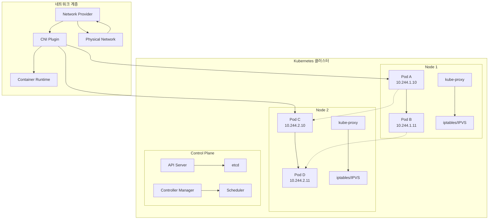
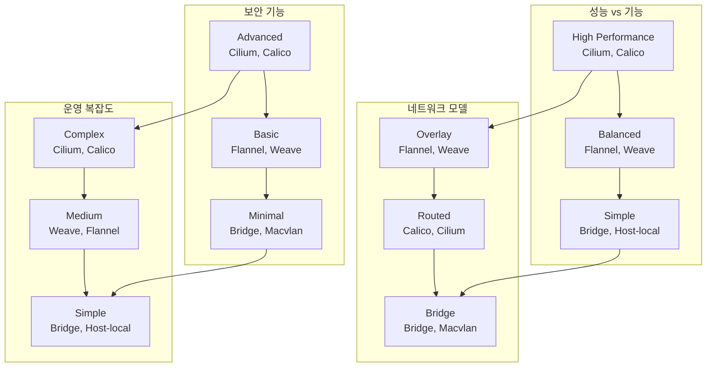
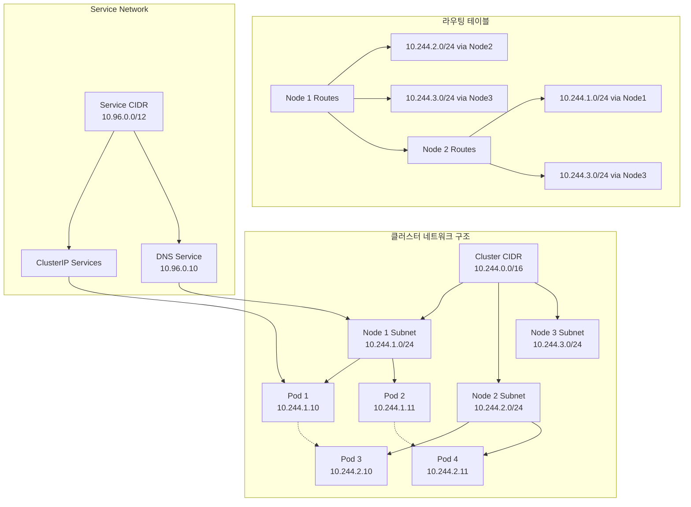

# Session 1: Kubernetes 네트워킹 모델과 CNI

## 📍 교과과정에서의 위치
이 세션은 **Week 2 > Day 5 > Session 1**으로, Week 2의 마지막 날 첫 번째 세션입니다. 지금까지 학습한 Pod, 워크로드, 스토리지를 바탕으로 Kubernetes 네트워킹의 핵심 개념과 CNI 아키텍처를 학습합니다.

## 학습 목표 (5분)
- **Kubernetes 네트워킹** 4대 원칙과 **기본 요구사항** 완전 이해
- **CNI(Container Network Interface)** 표준과 **아키텍처** 분석
- **다양한 CNI 플러그인** 특성과 **선택 기준** 학습
- **네트워크 주소 할당**과 **라우팅 메커니즘** 파악

## 1. Kubernetes 네트워킹 4대 원칙과 기본 요구사항 (15분)

### Kubernetes 네트워킹 아키텍처



### Kubernetes 네트워킹 원칙 상세 분석
```
Kubernetes 네트워킹 4대 원칙:

1. Pod-to-Pod 직접 통신 원칙:
├── 기본 개념:
│   ├── 모든 Pod는 NAT 없이 직접 통신 가능
│   ├── Pod는 자신이 보는 IP와 다른 Pod가 보는 IP가 동일
│   ├── 클러스터 내 모든 Pod는 단일 플랫 네트워크
│   ├── 네트워크 주소 변환(NAT) 불필요
│   ├── 복잡한 포트 매핑 불필요
│   └── 전통적인 네트워킹과 유사한 모델
├── 구현 요구사항:
│   ├── 클러스터 전체에서 유니크한 Pod IP 할당
│   ├── Pod 간 라우팅 경로 자동 설정
│   ├── 네트워크 분할 및 격리 지원
│   ├── 동적 IP 할당 및 회수
│   ├── 멀티 노드 환경에서 일관된 네트워킹
│   └── 네트워크 정책 기반 접근 제어
├── 장점:
│   ├── 단순하고 직관적인 네트워킹 모델
│   ├── 기존 애플리케이션 마이그레이션 용이
│   ├── 서비스 디스커버리 단순화
│   ├── 로드 밸런싱 구현 용이
│   ├── 네트워크 디버깅 단순화
│   └── 마이크로서비스 아키텍처 최적화
└── 구현 과제:
    ├── IP 주소 공간 관리
    ├── 라우팅 테이블 관리
    ├── 네트워크 성능 최적화
    ├── 보안 정책 구현
    ├── 멀티 클라우드 환경 지원
    └── 네트워크 장애 복구

2. Node-to-Pod 통신 원칙:
├── 기본 개념:
│   ├── 노드는 NAT 없이 모든 Pod와 통신 가능
│   ├── 노드의 에이전트(kubelet, kube-proxy)가 Pod 접근
│   ├── 시스템 데몬이 Pod 서비스 이용 가능
│   ├── 모니터링 및 로깅 시스템 통합
│   ├── 네트워크 정책에 따른 접근 제어
│   └── 호스트 네트워크와 Pod 네트워크 연동
├── 구현 메커니즘:
│   ├── 브리지 네트워크를 통한 연결
│   ├── 라우팅 테이블 자동 업데이트
│   ├── iptables 규칙 자동 생성
│   ├── 네트워크 네임스페이스 관리
│   ├── 가상 이더넷 페어 생성
│   └── CNI 플러그인을 통한 추상화
├── 사용 사례:
│   ├── kubelet의 헬스 체크
│   ├── kube-proxy의 서비스 프록시
│   ├── 모니터링 에이전트 데이터 수집
│   ├── 로깅 에이전트 로그 수집
│   ├── 보안 스캐너 취약점 검사
│   └── 백업 에이전트 데이터 백업
└── 보안 고려사항:
    ├── 노드 권한 최소화
    ├── Pod 접근 권한 제한
    ├── 네트워크 정책 적용
    ├── 감사 로깅 활성화
    ├── 암호화 통신 적용
    └── 접근 패턴 모니터링

3. 외부-to-Service 통신 원칙:
├── 기본 개념:
│   ├── 클러스터 외부에서 서비스 접근 가능
│   ├── Service 추상화를 통한 Pod 그룹 노출
│   ├── 로드 밸런싱 및 서비스 디스커버리
│   ├── 다양한 서비스 타입 지원
│   ├── 외부 트래픽 정책 적용
│   └── SSL/TLS 종료 및 보안 적용
├── 서비스 타입별 특성:
│   ├── ClusterIP: 클러스터 내부 전용
│   ├── NodePort: 노드 포트를 통한 외부 노출
│   ├── LoadBalancer: 클라우드 로드 밸런서 연동
│   ├── ExternalName: 외부 서비스 별칭
│   ├── Headless Service: 직접 Pod IP 반환
│   └── ExternalIPs: 특정 외부 IP 바인딩
├── 트래픽 라우팅:
│   ├── kube-proxy를 통한 트래픽 분산
│   ├── iptables/IPVS 기반 로드 밸런싱
│   ├── 세션 어피니티 지원
│   ├── 헬스 체크 기반 엔드포인트 관리
│   ├── 가중치 기반 트래픽 분산
│   └── 장애 조치 및 복구
└── 보안 및 정책:
    ├── 네트워크 정책 적용
    ├── Ingress 컨트롤러 보안
    ├── TLS 인증서 관리
    ├── 접근 제어 및 인증
    ├── DDoS 보호 및 레이트 리미팅
    └── 트래픽 모니터링 및 분석

4. 컨테이너-to-컨테이너 통신 원칙:
├── 기본 개념:
│   ├── 동일 Pod 내 컨테이너는 localhost 통신
│   ├── 공유 네트워크 네임스페이스 사용
│   ├── 공유 볼륨을 통한 파일 기반 통신
│   ├── IPC(Inter-Process Communication) 지원
│   ├── 공유 프로세스 네임스페이스 옵션
│   └── 사이드카 패턴 구현 기반
├── 네트워크 네임스페이스 공유:
│   ├── 동일한 IP 주소 공유
│   ├── 동일한 포트 공간 공유
│   ├── 루프백 인터페이스 공유
│   ├── 네트워크 인터페이스 공유
│   ├── 라우팅 테이블 공유
│   └── 네트워크 설정 공유
├── 통신 메커니즘:
│   ├── TCP/UDP 소켓 통신
│   ├── Unix 도메인 소켓
│   ├── 공유 메모리
│   ├── 파이프 및 FIFO
│   ├── 시그널 기반 통신
│   └── 파일 시스템 기반 통신
└── 설계 패턴:
    ├── 사이드카 패턴: 보조 기능 컨테이너
    ├── 앰배서더 패턴: 프록시 컨테이너
    ├── 어댑터 패턴: 인터페이스 변환
    ├── 이니셜라이저 패턴: 초기화 컨테이너
    ├── 워커 패턴: 작업 분산 처리
    └── 모니터링 패턴: 메트릭 수집

네트워킹 요구사항 및 제약사항:
├── 성능 요구사항:
│   ├── 낮은 지연 시간 (Low Latency)
│   ├── 높은 처리량 (High Throughput)
│   ├── 확장성 (Scalability)
│   ├── 효율적인 리소스 사용
│   ├── 네트워크 오버헤드 최소화
│   └── 동적 확장 지원
├── 보안 요구사항:
│   ├── 네트워크 격리 및 분할
│   ├── 트래픽 암호화
│   ├── 접근 제어 및 인증
│   ├── 감사 및 로깅
│   ├── 침입 탐지 및 방지
│   └── 컴플라이언스 준수
├── 운영 요구사항:
│   ├── 자동화된 네트워크 관리
│   ├── 모니터링 및 가시성
│   ├── 장애 진단 및 복구
│   ├── 용량 계획 및 관리
│   ├── 업그레이드 및 유지보수
│   └── 멀티 클라우드 지원
└── 호환성 요구사항:
    ├── 다양한 CNI 플러그인 지원
    ├── 클라우드 제공업체 통합
    ├── 기존 네트워크 인프라 연동
    ├── 표준 프로토콜 준수
    ├── 오픈소스 생태계 호환
    └── 벤더 중립성 유지
```

## 2. CNI(Container Network Interface) 표준과 아키텍처 (12분)

### CNI 아키텍처 구조

```mermaid
graph TB
    subgraph "CNI 생태계"
        A[Container Runtime<br/>(containerd, CRI-O)] --> B[CNI Runtime]
        B --> C[CNI Plugin]
        
        subgraph "CNI Plugin Types"
            D[Main Plugin<br/>(bridge, macvlan, ipvlan)]
            E[IPAM Plugin<br/>(host-local, dhcp)]
            F[Meta Plugin<br/>(flannel, calico, weave)]
        end
        
        C --> D
        C --> E
        C --> F
    end
    
    subgraph "Network Implementation"
        G[Linux Bridge] --> H[Virtual Ethernet]
        I[Overlay Network] --> J[VXLAN/GRE]
        K[BGP Routing] --> L[Physical Network]
    end
    
    subgraph "Kubernetes Integration"
        M[kubelet] --> N[CNI Config]
        O[Network Policy] --> P[CNI Plugin]
    end
    
    D --> G
    F --> I
    F --> K
    M --> B
    O --> C
```

### CNI 표준 상세 분석
```
CNI(Container Network Interface) 표준:

CNI 기본 개념:
├── CNI 정의 및 목적:
│   ├── 컨테이너 네트워킹을 위한 표준 인터페이스
│   ├── 컨테이너 런타임과 네트워크 플러그인 간 추상화
│   ├── 플러그인 기반 확장 가능한 아키텍처
│   ├── 벤더 중립적 네트워킹 솔루션
│   ├── 단순하고 최소한의 API 제공
│   └── 클라우드 네이티브 생태계 표준
├── CNI 사양 구성요소:
│   ├── 네트워크 설정 형식 (JSON)
│   ├── 플러그인 실행 프로토콜
│   ├── 플러그인 결과 형식
│   ├── IP 주소 관리 (IPAM) 인터페이스
│   ├── 네트워크 네임스페이스 관리
│   └── 오류 처리 및 로깅
├── CNI 동작 원리:
│   ├── ADD: 컨테이너를 네트워크에 추가
│   ├── DEL: 컨테이너를 네트워크에서 제거
│   ├── CHECK: 네트워크 연결 상태 확인
│   ├── VERSION: 플러그인 버전 정보 조회
│   ├── 환경 변수를 통한 매개변수 전달
│   └── 표준 입출력을 통한 결과 반환
└── CNI 설정 관리:
    ├── 네트워크 설정 파일 (/etc/cni/net.d/)
    ├── 플러그인 바이너리 (/opt/cni/bin/)
    ├── 설정 우선순위 및 체이닝
    ├── 동적 설정 업데이트
    ├── 설정 검증 및 오류 처리
    └── 로깅 및 디버깅 지원

CNI 플러그인 분류:
├── Main 플러그인 (네트워크 인터페이스 생성):
│   ├── bridge:
│   │   ├── Linux 브리지 기반 네트워킹
│   │   ├── 단일 노드 내 Pod 통신
│   │   ├── VLAN 태깅 지원
│   │   ├── 간단한 설정 및 관리
│   │   ├── 높은 성능과 안정성
│   │   └── 기본적인 네트워크 격리
│   ├── macvlan:
│   │   ├── MAC 주소 기반 가상 인터페이스
│   │   ├── 물리 네트워크 직접 연결
│   │   ├── 높은 네트워크 성능
│   │   ├── VLAN 지원
│   │   ├── 브로드캐스트 도메인 공유
│   │   └── 스위치 MAC 테이블 제한 고려
│   ├── ipvlan:
│   │   ├── IP 주소 기반 가상 인터페이스
│   │   ├── MAC 주소 공유로 테이블 절약
│   │   ├── L2/L3 모드 지원
│   │   ├── 컨테이너 간 격리
│   │   ├── 브로드캐스트 트래픽 제어
│   │   └── 클라우드 환경 최적화
│   ├── ptp (point-to-point):
│   │   ├── 직접 연결 기반 네트워킹
│   │   ├── 최소한의 오버헤드
│   │   ├── 단순한 토폴로지
│   │   ├── 높은 보안성
│   │   ├── 제한된 확장성
│   │   └── 특수 용도 네트워킹
│   └── host-device:
│       ├── 물리 네트워크 디바이스 직접 할당
│       ├── SR-IOV 지원
│       ├── 최고 성능 달성
│       ├── 하드웨어 종속성
│       ├── 제한된 디바이스 수
│       └── 고성능 컴퓨팅 환경
├── IPAM 플러그인 (IP 주소 관리):
│   ├── host-local:
│   │   ├── 로컬 파일 기반 IP 관리
│   │   ├── 노드별 독립적 IP 할당
│   │   ├── 간단한 설정 및 관리
│   │   ├── 빠른 IP 할당/해제
│   │   ├── 서브넷 분할 지원
│   │   └── 클러스터 전체 조정 불필요
│   ├── dhcp:
│   │   ├── DHCP 서버 기반 IP 할당
│   │   ├── 기존 네트워크 인프라 활용
│   │   ├── 중앙화된 IP 관리
│   │   ├── 동적 IP 할당
│   │   ├── 네트워크 설정 자동화
│   │   └── DHCP 서버 의존성
│   ├── static:
│   │   ├── 정적 IP 주소 할당
│   │   ├── 예측 가능한 네트워킹
│   │   ├── 수동 IP 관리
│   │   ├── 충돌 방지 책임
│   │   ├── 특수 요구사항 대응
│   │   └── 제한된 확장성
│   └── whereabouts:
│       ├── 분산 IP 주소 관리
│       ├── etcd 기반 상태 저장
│       ├── 클러스터 전체 IP 조정
│       ├── 동적 서브넷 할당
│       ├── IP 충돌 방지
│       └── 고가용성 지원
├── Meta 플러그인 (고급 네트워킹 기능):
│   ├── flannel:
│   │   ├── 오버레이 네트워크 구현
│   │   ├── VXLAN/UDP 백엔드 지원
│   │   ├── 간단한 설정 및 관리
│   │   ├── etcd 기반 설정 저장
│   │   ├── 크로스 노드 Pod 통신
│   │   └── 네트워크 정책 제한적 지원
│   ├── calico:
│   │   ├── BGP 기반 라우팅
│   │   ├── 네트워크 정책 완전 지원
│   │   ├── 확장성 및 성능 우수
│   │   ├── 다양한 데이터 플레인 지원
│   │   ├── 서비스 메시 통합
│   │   └── 엔터프라이즈 기능 제공
│   ├── weave:
│   │   ├── 메시 네트워크 토폴로지
│   │   ├── 자동 네트워크 발견
│   │   ├── 암호화 통신 지원
│   │   ├── 네트워크 분할 복구
│   │   ├── 간단한 설치 및 관리
│   │   └── 멀티 클라우드 지원
│   └── cilium:
│       ├── eBPF 기반 고성능 네트워킹
│       ├── L3-L7 네트워크 정책
│       ├── 서비스 메시 기능 내장
│       ├── 관찰 가능성 및 보안
│       ├── 클러스터 메시 지원
│       └── 최신 커널 기능 활용
└── 체이닝 및 확장:
    ├── 플러그인 체이닝:
    │   ├── 여러 플러그인 순차 실행
    │   ├── 기능별 플러그인 조합
    │   ├── 유연한 네트워크 구성
    │   ├── 모듈화된 아키텍처
    │   ├── 재사용 가능한 컴포넌트
    │   └── 복잡성 관리 필요
    ├── 커스텀 플러그인:
    │   ├── 특수 요구사항 대응
    │   ├── 기업 내부 네트워크 통합
    │   ├── 성능 최적화
    │   ├── 보안 강화
    │   ├── 규정 준수
    │   └── 유지보수 책임
    └── 플러그인 개발:
        ├── CNI 사양 준수
        ├── 표준 인터페이스 구현
        ├── 오류 처리 및 로깅
        ├── 테스트 및 검증
        ├── 문서화 및 지원
        └── 커뮤니티 기여
```

## 3. 다양한 CNI 플러그인 특성과 선택 기준 (10분)

### CNI 플러그인 비교 매트릭스



### CNI 플러그인 선택 기준 상세 분석
```
CNI 플러그인 선택 기준 및 비교:

주요 CNI 플러그인 특성 비교:
├── Flannel:
│   ├── 장점:
│   │   ├── 간단한 설치 및 설정
│   │   ├── 안정적이고 검증된 솔루션
│   │   ├── 다양한 백엔드 지원 (VXLAN, UDP, host-gw)
│   │   ├── 최소한의 의존성
│   │   ├── 광범위한 플랫폼 지원
│   │   └── 활발한 커뮤니티 지원
│   ├── 단점:
│   │   ├── 네트워크 정책 미지원
│   │   ├── 제한적인 고급 기능
│   │   ├── 오버레이 네트워크 오버헤드
│   │   ├── 확장성 제한
│   │   ├── 보안 기능 부족
│   │   └── 성능 최적화 제한
│   ├── 적합한 환경:
│   │   ├── 소규모 클러스터
│   │   ├── 단순한 네트워킹 요구사항
│   │   ├── 빠른 프로토타이핑
│   │   ├── 학습 및 테스트 환경
│   │   ├── 레거시 시스템 통합
│   │   └── 최소한의 운영 복잡도 요구
│   └── 설정 예시:
│       ├── VXLAN 백엔드 설정
│       ├── 서브넷 구성
│       ├── etcd 연동 설정
│       ├── 방화벽 규칙 설정
│       ├── 모니터링 설정
│       └── 트러블슈팅 가이드
├── Calico:
│   ├── 장점:
│   │   ├── 뛰어난 성능 및 확장성
│   │   ├── 완전한 네트워크 정책 지원
│   │   ├── BGP 기반 라우팅
│   │   ├── 다양한 데이터 플레인 지원
│   │   ├── 엔터프라이즈 기능 제공
│   │   └── 서비스 메시 통합
│   ├── 단점:
│   │   ├── 복잡한 설정 및 관리
│   │   ├── BGP 네트워킹 지식 필요
│   │   ├── 높은 학습 곡선
│   │   ├── 리소스 사용량 높음
│   │   ├── 네트워크 인프라 의존성
│   │   └── 디버깅 복잡성
│   ├── 적합한 환경:
│   │   ├── 대규모 프로덕션 환경
│   │   ├── 높은 보안 요구사항
│   │   ├── 네트워크 정책 필수
│   │   ├── 고성능 요구사항
│   │   ├── 멀티 클라우드 환경
│   │   └── 엔터프라이즈 환경
│   └── 고급 기능:
│       ├── Typha 컴포넌트 (확장성)
│       ├── Felix 에이전트 (정책 적용)
│       ├── BIRD BGP 데몬
│       ├── calicoctl 관리 도구
│       ├── Calico Enterprise 기능
│       └── Istio 통합 지원
├── Cilium:
│   ├── 장점:
│   │   ├── eBPF 기반 최고 성능
│   │   ├── L3-L7 네트워크 정책
│   │   ├── 서비스 메시 기능 내장
│   │   ├── 고급 관찰 가능성
│   │   ├── 클러스터 메시 지원
│   │   └── 최신 기술 활용
│   ├── 단점:
│   │   ├── 최신 커널 요구사항
│   │   ├── 높은 복잡성
│   │   ├── 제한적인 플랫폼 지원
│   │   ├── 상대적으로 새로운 기술
│   │   ├── 전문 지식 필요
│   │   └── 디버깅 도구 제한
│   ├── 적합한 환경:
│   │   ├── 최신 인프라 환경
│   │   ├── 고성능 요구사항
│   │   ├── 고급 보안 정책 필요
│   │   ├── 서비스 메시 통합
│   │   ├── 클라우드 네이티브 환경
│   │   └── 혁신적 기술 도입
│   └── 핵심 기능:
│       ├── Hubble 관찰 가능성
│       ├── Envoy 프록시 통합
│       ├── 클러스터 메시
│       ├── 네트워크 정책 엔진
│       ├── 로드 밸런싱
│       └── 보안 정책 적용
├── Weave Net:
│   ├── 장점:
│   │   ├── 간단한 설치 및 관리
│   │   ├── 자동 네트워크 발견
│   │   ├── 암호화 통신 지원
│   │   ├── 네트워크 분할 복구
│   │   ├── 멀티 클라우드 지원
│   │   └── 시각화 도구 제공
│   ├── 단점:
│   │   ├── 성능 오버헤드
│   │   ├── 확장성 제한
│   │   ├── 메모리 사용량 높음
│   │   ├── 복잡한 네트워크 토폴로지
│   │   ├── 디버깅 어려움
│   │   └── 상업적 지원 제한
│   ├── 적합한 환경:
│   │   ├── 중소규모 클러스터
│   │   ├── 멀티 클라우드 환경
│   │   ├── 네트워크 분할 우려
│   │   ├── 암호화 요구사항
│   │   ├── 간단한 관리 선호
│   │   └── 시각화 도구 필요
│   └── 특별 기능:
│       ├── Weave Scope 모니터링
│       ├── 자동 IP 할당
│       ├── 네트워크 암호화
│       ├── 분할 복구 메커니즘
│       ├── 다중 네트워크 지원
│       └── 컨테이너 간 통신 최적화
└── Amazon VPC CNI:
    ├── 장점:
    │   ├── AWS 네이티브 통합
    │   ├── VPC 네트워킹 직접 활용
    │   ├── 높은 성능
    │   ├── AWS 서비스 통합
    │   ├── 보안 그룹 지원
    │   └── ENI 기반 네트워킹
    ├── 단점:
    │   ├── AWS 전용 솔루션
    │   ├── IP 주소 제한
    │   ├── 복잡한 설정
    │   ├── 비용 고려사항
    │   ├── 벤더 종속성
    │   └── 제한적인 커스터마이징
    ├── 적합한 환경:
    │   ├── AWS EKS 환경
    │   ├── VPC 네이티브 요구사항
    │   ├── AWS 서비스 통합 필요
    │   ├── 높은 성능 요구
    │   ├── 보안 그룹 활용
    │   └── AWS 생태계 중심
    └── 고급 기능:
        ├── Secondary IP 할당
        ├── 보안 그룹 정책
        ├── VPC Flow Logs 통합
        ├── AWS Load Balancer 통합
        ├── Fargate 지원
        └── 네트워크 인사이트

선택 기준 매트릭스:
├── 성능 요구사항:
│   ├── 높은 처리량: Cilium, Calico
│   ├── 낮은 지연 시간: Cilium, AWS VPC CNI
│   ├── 확장성: Calico, Cilium
│   ├── 리소스 효율성: Flannel, Bridge
│   └── 네트워크 오버헤드 최소화: Calico, Cilium
├── 기능 요구사항:
│   ├── 네트워크 정책: Calico, Cilium
│   ├── 서비스 메시: Cilium, Istio 통합
│   ├── 암호화: Weave, Cilium
│   ├── 관찰 가능성: Cilium, Calico
│   └── 멀티 클라우드: Weave, Calico
├── 운영 요구사항:
│   ├── 간단한 관리: Flannel, Weave
│   ├── 자동화 지원: Calico, Cilium
│   ├── 모니터링: Cilium, Weave
│   ├── 트러블슈팅: Flannel, Calico
│   └── 업그레이드 용이성: Flannel, Calico
├── 환경 요구사항:
│   ├── 클라우드 네이티브: Cilium, Calico
│   ├── 온프레미스: Calico, Flannel
│   ├── 하이브리드: Weave, Calico
│   ├── 엣지 컴퓨팅: Flannel, K3s CNI
│   └── 레거시 통합: Flannel, Bridge
└── 비즈니스 요구사항:
    ├── 비용 효율성: Flannel, Open Source
    ├── 상업적 지원: Calico Enterprise, Cilium Enterprise
    ├── 컴플라이언스: Calico, Cilium
    ├── 보안 인증: Calico, Cilium
    └── 벤더 중립성: Calico, Cilium
```

## 4. 네트워크 주소 할당과 라우팅 메커니즘 (8분)

### IP 주소 할당 및 라우팅 구조



### 네트워크 주소 할당 상세 분석
```
Kubernetes 네트워크 주소 할당 및 라우팅:

IP 주소 공간 설계:
├── 클러스터 CIDR 계획:
│   ├── Pod 네트워크 CIDR:
│   │   ├── 기본값: 10.244.0.0/16 (65,536개 IP)
│   │   ├── 대규모 클러스터: 10.0.0.0/8 (16,777,216개 IP)
│   │   ├── 중간 규모: 172.16.0.0/12 (1,048,576개 IP)
│   │   ├── 소규모: 192.168.0.0/16 (65,536개 IP)
│   │   ├── 노드별 서브넷 분할
│   │   └── 확장성 고려한 여유 공간
│   ├── 서비스 CIDR 계획:
│   │   ├── 기본값: 10.96.0.0/12 (1,048,576개 IP)
│   │   ├── DNS 서비스: 10.96.0.10
│   │   ├── Kubernetes API: 10.96.0.1
│   │   ├── 서비스별 고정 IP 할당
│   │   ├── 로드 밸런서 IP 풀
│   │   └── 외부 서비스 매핑
│   ├── 노드 네트워크 CIDR:
│   │   ├── 물리/가상 네트워크 주소
│   │   ├── 관리 네트워크 분리
│   │   ├── 스토리지 네트워크 분리
│   │   ├── 백업 네트워크 분리
│   │   ├── 모니터링 네트워크
│   │   └── 보안 네트워크 세그멘테이션
│   └── IP 주소 충돌 방지:
│       ├── 네트워크 세그먼트 분리
│       ├── VLAN 기반 격리
│       ├── 라우팅 정책 설정
│       ├── 방화벽 규칙 적용
│       ├── NAT 게이트웨이 설정
│       └── 네트워크 오버레이 사용
├── IPAM (IP Address Management):
│   ├── 정적 IP 할당:
│   │   ├── 수동 IP 주소 지정
│   │   ├── 예측 가능한 네트워킹
│   │   ├── 고정 서비스 엔드포인트
│   │   ├── 레거시 시스템 통합
│   │   ├── 보안 정책 적용 용이
│   │   └── 관리 복잡도 증가
│   ├── 동적 IP 할당:
│   │   ├── 자동 IP 주소 할당
│   │   ├── 효율적인 IP 사용
│   │   ├── 확장성 및 유연성
│   │   ├── 충돌 방지 메커니즘
│   │   ├── 임대 시간 관리
│   │   └── 상태 추적 및 복구
│   ├── IP 풀 관리:
│   │   ├── 사용 가능한 IP 추적
│   │   ├── IP 할당 및 해제
│   │   ├── 풀 확장 및 축소
│   │   ├── 다중 풀 지원
│   │   ├── 우선순위 기반 할당
│   │   └── 장애 조치 및 복구
│   └── IP 주소 재사용:
│       ├── 삭제된 Pod IP 회수
│       ├── 유예 기간 설정
│       ├── 상태 정리 및 검증
│       ├── 메모리 누수 방지
│       ├── 데이터베이스 정리
│       └── 모니터링 및 알림
├── 라우팅 메커니즘:
│   ├── 클러스터 내부 라우팅:
│   │   ├── Pod-to-Pod 직접 라우팅
│   │   ├── 노드 간 라우팅 테이블
│   │   ├── 브리지 네트워크 라우팅
│   │   ├── 오버레이 네트워크 터널링
│   │   ├── BGP 기반 라우팅
│   │   └── 정적 라우팅 설정
│   ├── 외부 네트워크 라우팅:
│   │   ├── 기본 게이트웨이 설정
│   │   ├── NAT 게이트웨이 구성
│   │   ├── 로드 밸런서 연동
│   │   ├── VPN 터널 설정
│   │   ├── 방화벽 규칙 적용
│   │   └── 트래픽 정책 관리
│   ├── 동적 라우팅 프로토콜:
│   │   ├── BGP (Border Gateway Protocol)
│   │   ├── OSPF (Open Shortest Path First)
│   │   ├── RIP (Routing Information Protocol)
│   │   ├── 라우팅 메트릭 최적화
│   │   ├── 경로 선택 알고리즘
│   │   └── 장애 조치 및 복구
│   └── 라우팅 테이블 관리:
│       ├── 자동 라우팅 업데이트
│       ├── 라우팅 규칙 검증
│       ├── 경로 우선순위 관리
│       ├── 라우팅 루프 방지
│       ├── 성능 모니터링
│       └── 트러블슈팅 지원
└── 네트워크 토폴로지:
    ├── 플랫 네트워크:
    │   ├── 단일 브로드캐스트 도메인
    │   ├── 간단한 라우팅 구조
    │   ├── 높은 성능
    │   ├── 제한된 확장성
    │   ├── 보안 격리 어려움
    │   └── 브로드캐스트 스톰 위험
    ├── 계층적 네트워크:
    │   ├── 다층 네트워크 구조
    │   ├── 확장성 및 관리성
    │   ├── 보안 경계 설정
    │   ├── 트래픽 격리
    │   ├── 복잡한 라우팅
    │   └── 지연 시간 증가
    ├── 메시 네트워크:
    │   ├── 모든 노드 간 연결
    │   ├── 높은 가용성
    │   ├── 자동 경로 복구
    │   ├── 복잡한 관리
    │   ├── 높은 비용
    │   └── 확장성 제한
    └── 하이브리드 토폴로지:
        ├── 다양한 토폴로지 조합
        ├── 요구사항별 최적화
        ├── 유연한 네트워크 설계
        ├── 복잡한 관리
        ├── 높은 전문성 요구
        └── 맞춤형 솔루션
```

## 실습 과제 (5분)

### 과제 1: CNI 플러그인 비교 분석
```yaml
# 다음 시나리오에 적합한 CNI 플러그인을 선택하고 근거를 제시하세요:

# 시나리오 1: 스타트업 개발 환경
# - 10개 노드, 100개 Pod
# - 빠른 설정과 간단한 관리 필요
# - 네트워크 정책 불필요
# - 비용 최소화

# 시나리오 2: 금융 서비스 프로덕션
# - 100개 노드, 1000개 Pod
# - 높은 보안 요구사항
# - 네트워크 정책 필수
# - 컴플라이언스 준수

# 시나리오 3: 고성능 컴퓨팅
# - 50개 노드, 500개 Pod
# - 최고 네트워크 성능 필요
# - 최신 기술 활용 가능
# - 전문 운영팀 보유

# 각 시나리오별로 추천 CNI와 이유를 작성하세요.
```

### 과제 2: 네트워크 주소 계획 수립
```yaml
# 다음 요구사항에 맞는 네트워크 주소 계획을 수립하세요:

# 클러스터 규모:
# - 3개 마스터 노드
# - 20개 워커 노드
# - 최대 1000개 Pod 동시 실행
# - 100개 서비스 예상

# 요구사항:
# - 향후 2배 확장 가능
# - 개발/스테이징/프로덕션 환경 분리
# - 관리 네트워크 별도 구성
# - 기존 네트워크(192.168.0.0/16)와 충돌 방지

# 설계 결과물:
# 1. Pod CIDR 설계
# 2. Service CIDR 설계
# 3. 노드별 서브넷 할당
# 4. 네트워크 세그멘테이션 계획
```

## 토론 주제 (5분)

1. **CNI 플러그인 선택의 트레이드오프**
   - 성능 vs 기능 vs 복잡성의 균형점
   - 조직의 성숙도에 따른 선택 기준

2. **네트워크 보안과 성능의 균형**
   - 오버레이 네트워크의 성능 오버헤드
   - 보안 강화가 성능에 미치는 영향

3. **클라우드 네이티브 네트워킹의 미래**
   - eBPF 기술의 발전 방향
   - 서비스 메시와 CNI의 통합

## 다음 세션 예고 (2분)

다음 세션에서는 **"Pod 네트워킹과 통신 메커니즘"**을 다룹니다:
- Pod 내부 네트워킹 구조
- 컨테이너 간 통신 방법
- Pod-to-Pod 통신 경로
- DNS 기반 서비스 디스커버리

---

## 📚 참고 자료

- [Kubernetes Networking Model](https://kubernetes.io/docs/concepts/services-networking/)
- [CNI Specification](https://github.com/containernetworking/cni/blob/master/SPEC.md)
- [Flannel Documentation](https://github.com/flannel-io/flannel)
- [Calico Documentation](https://docs.projectcalico.org/)
- [Cilium Documentation](https://docs.cilium.io/)
- [Weave Net Documentation](https://www.weave.works/docs/net/latest/overview/)

---
*본 세션은 Kubernetes 네트워킹의 기초 개념부터 CNI 플러그인 선택까지 체계적으로 학습하여, 클라우드 네이티브 환경에서의 네트워킹 전문성을 구축하는 것을 목표로 합니다.*