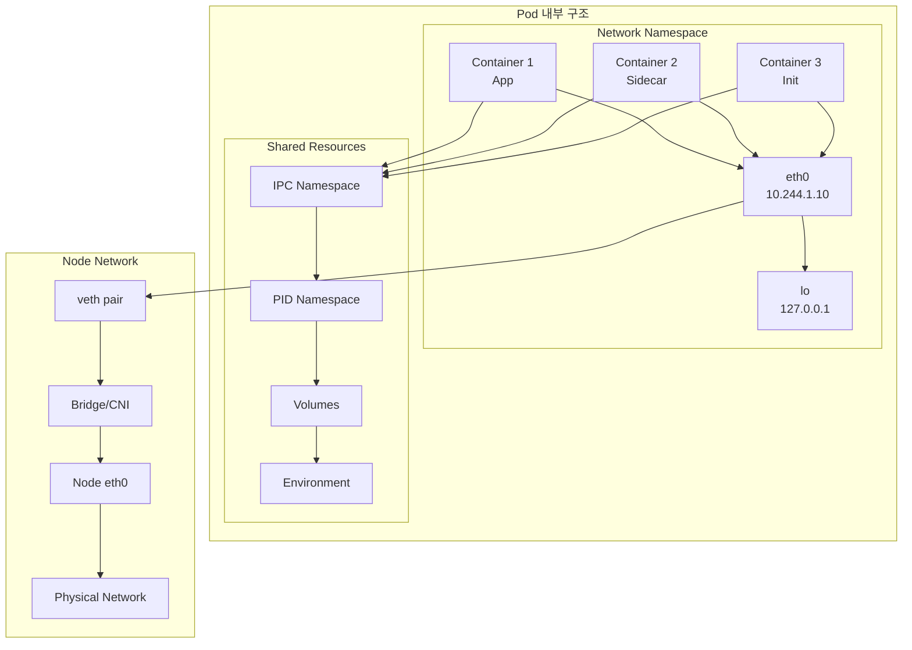
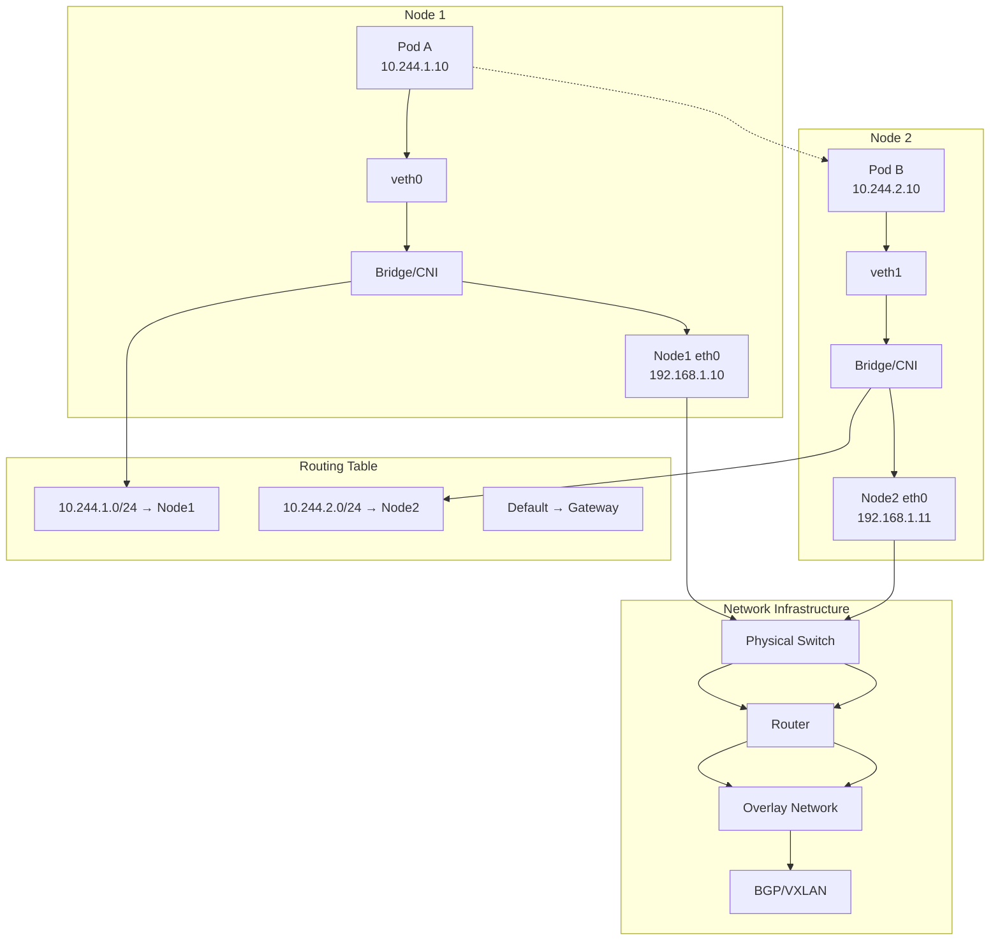
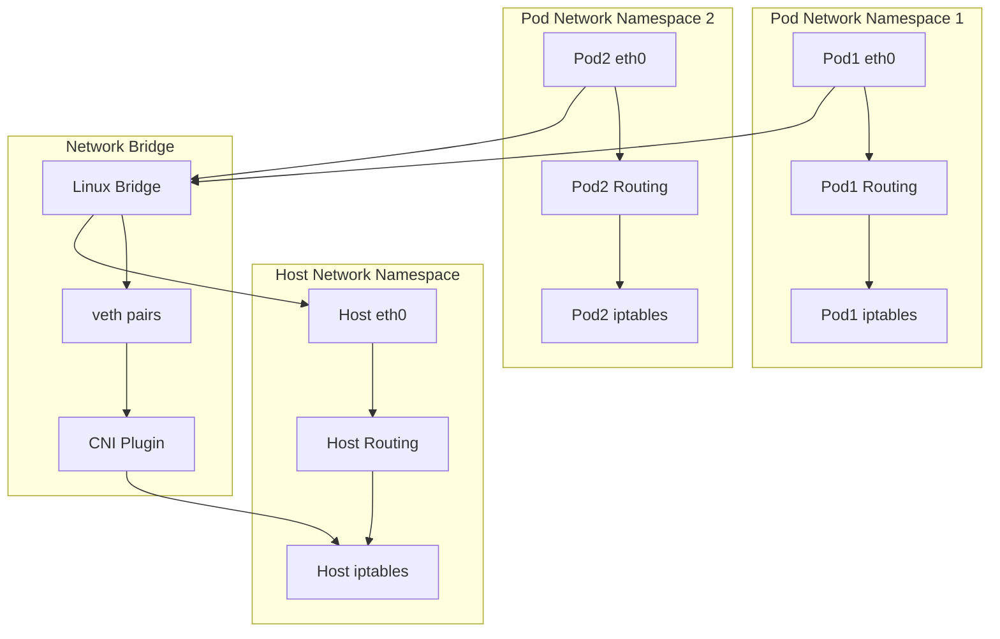
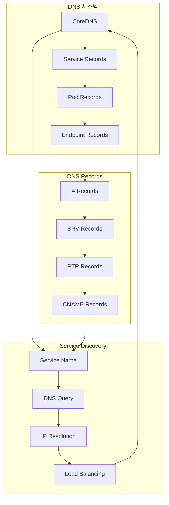

# Session 2: Pod 네트워킹과 통신 메커니즘

## 📍 교과과정에서의 위치
이 세션은 **Week 2 > Day 5 > Session 2**로, Session 1에서 학습한 Kubernetes 네트워킹 모델과 CNI를 바탕으로 Pod 수준의 네트워킹 구조와 통신 메커니즘을 상세히 학습합니다.

## 학습 목표 (5분)
- **Pod 내부 네트워킹** 구조와 **컨테이너 간 통신** 완전 이해
- **Pod-to-Pod 통신** 경로와 **라우팅 메커니즘** 분석
- **네트워크 네임스페이스**와 **격리 메커니즘** 학습
- **DNS 기반 서비스 디스커버리** 원리와 **구현 방법** 파악

## 1. Pod 내부 네트워킹 구조와 컨테이너 간 통신 (15분)

### Pod 네트워킹 아키텍처



### Pod 네트워킹 상세 분석
```
Pod 내부 네트워킹 구조:

네트워크 네임스페이스 공유:
   🔹 기본 개념:
      • Pod 내 모든 컨테이너는 동일한 네트워크 네임스페이스 공유
      • 단일 IP 주소와 포트 공간 공유
      • 네트워크 인터페이스 공유 (eth0, lo)
      • 라우팅 테이블 및 네트워크 설정 공유
      • iptables 규칙 공유
      • 네트워크 통계 및 메트릭 공유
   🔹 네트워크 인터페이스:
      • eth0 (Primary Interface):
         • Pod의 주 네트워크 인터페이스
         • 클러스터 내 유니크한 IP 주소 할당
         • CNI 플러그인에 의해 생성 및 관리
         • veth pair를 통해 노드 네트워크 연결
         • 외부 통신을 위한 기본 경로
         • 트래픽 모니터링 및 제어 지점
      • lo (Loopback Interface):
         • 로컬 루프백 인터페이스 (127.0.0.1)
         • Pod 내 컨테이너 간 localhost 통신
         • 자기 자신과의 통신
         • 로컬 서비스 바인딩
         • 테스트 및 디버깅 용도
         • 높은 성능의 내부 통신
      • 추가 인터페이스:
      • 멀티 네트워크 CNI 지원
      • SR-IOV 네트워크 인터페이스
      • 호스트 네트워크 인터페이스
      • 브리지 네트워크 인터페이스
      • 터널 인터페이스
      • 가상 네트워크 인터페이스
   🔹 포트 공간 관리:
      • 포트 충돌 방지:
         • 컨테이너 간 포트 번호 조정 필요
         • 동일 포트 사용 시 바인딩 실패
         • 포트 할당 전략 수립
         • 환경 변수를 통한 포트 설정
         • 설정 파일 기반 포트 관리
         • 동적 포트 할당 메커니즘
      • 포트 바인딩 패턴:
         • 0.0.0.0:port - 모든 인터페이스 바인딩
         • 127.0.0.1:port - 로컬 전용 바인딩
         • Pod IP:port - 특정 IP 바인딩
         • Unix 소켓 사용
         • 명명된 파이프 사용
         • 공유 메모리 사용
      • 포트 관리 모범 사례:
      • 표준 포트 사용 (HTTP: 80, HTTPS: 443)
      • 환경별 포트 분리
      • 포트 문서화 및 관리
      • 포트 스캔 및 모니터링
      • 보안 포트 정책 적용
      • 포트 사용량 최적화
   🔹 컨테이너 간 통신 메커니즘:
   🔹 TCP/UDP 소켓 통신:
      • 표준 네트워크 프로토콜 사용
      • localhost (127.0.0.1) 주소 사용
      • 높은 호환성 및 이식성
      • 방화벽 및 보안 정책 적용 가능
      • 네트워크 모니터링 도구 지원
      • 성능 오버헤드 최소
   🔹 Unix 도메인 소켓:
      • 파일시스템 기반 소켓
      • 높은 성능 (커널 복사 없음)
      • 로컬 통신 전용
      • 파일 권한 기반 접근 제어
      • 바이너리 데이터 전송 최적화
      • 공유 볼륨을 통한 소켓 파일 공유
   🔹 공유 볼륨 통신:
      • 파일 기반 데이터 교환
      • 대용량 데이터 전송 적합
      • 비동기 통신 지원
      • 영구 데이터 저장
      • 파일 잠금 메커니즘 활용
      • 로그 및 설정 파일 공유
   🔹 환경 변수 및 설정:
      • 정적 설정 정보 공유
      • 런타임 설정 전달
      • 서비스 디스커버리 정보
      • 인증 정보 및 시크릿
      • 기능 플래그 및 옵션
      • 디버깅 및 로깅 설정
   🔹 프로세스 간 통신 (IPC):
   🔹 공유 메모리 세그먼트
   🔹 세마포어 및 뮤텍스
   🔹 메시지 큐
   🔹 시그널 기반 통신
   🔹 파이프 및 FIFO
   🔹 메모리 매핑 파일

Pod 생명주기와 네트워킹:
   🔹 Pod 생성 과정:
      • 1. 스케줄러가 노드 선택
      • 2. kubelet이 Pod 생성 시작
      • 3. 컨테이너 런타임이 네트워크 네임스페이스 생성
      • 4. CNI 플러그인 호출 (ADD 명령)
      • 5. IP 주소 할당 및 네트워크 인터페이스 생성
      • 6. 라우팅 테이블 설정
      • 7. 컨테이너 시작 및 네트워크 네임스페이스 연결
      • 8. 네트워크 연결 검증 및 상태 업데이트
   🔹 Pod 실행 중 네트워크 관리:
      • 네트워크 연결 상태 모니터링
      • 트래픽 통계 수집
      • 네트워크 정책 적용
      • 보안 규칙 검증
      • 성능 메트릭 수집
      • 장애 탐지 및 복구
      • 네트워크 설정 업데이트
      • 로그 및 이벤트 기록
   🔹 Pod 종료 과정:
      • 1. 종료 신호 전송 (SIGTERM)
      • 2. 그레이스풀 셧다운 대기
      • 3. 네트워크 연결 정리
      • 4. CNI 플러그인 호출 (DEL 명령)
      • 5. IP 주소 해제
      • 6. 네트워크 인터페이스 제거
      • 7. 라우팅 테이블 정리
      • 8. 네트워크 네임스페이스 삭제
   🔹 네트워크 장애 처리:
   🔹 네트워크 연결 실패 감지
   🔹 자동 재시도 메커니즘
   🔹 장애 조치 및 복구
   🔹 대체 경로 탐색
   🔹 네트워크 격리 및 복구
   🔹 로그 및 알림 생성
   🔹 상태 보고 및 업데이트
   🔹 수동 개입 지점 제공
```

## 2. Pod-to-Pod 통신 경로와 라우팅 메커니즘 (12분)

### Pod 간 통신 경로


### Pod 간 통신 상세 분석
```
Pod-to-Pod 통신 메커니즘:

동일 노드 내 Pod 통신:
   🔹 직접 브리지 통신:
      • 통신 경로:
         • Pod A → veth pair → Linux Bridge → veth pair → Pod B
         • 커널 네트워크 스택 통과
         • 물리 네트워크 불필요
         • 최소 지연 시간
         • 최대 처리량
         • 네트워크 오버헤드 최소
      • 브리지 네트워크 특성:
         • L2 스위칭 기능
         • MAC 주소 학습
         • 브로드캐스트 도메인 형성
         • VLAN 태깅 지원
         • STP (Spanning Tree Protocol) 지원
         • 포트 미러링 및 모니터링
      • 성능 특성:
      • 지연 시간: < 0.1ms
      • 처리량: 10Gbps+ (하드웨어 의존)
      • CPU 오버헤드: 최소
      • 메모리 사용량: 낮음
      • 확장성: 노드 내 제한
      • 안정성: 매우 높음
   🔹 CNI 플러그인별 구현:
      • Bridge CNI:
         • 표준 Linux 브리지 사용
         • iptables 기반 NAT 및 필터링
         • 간단한 설정 및 관리
         • 높은 호환성
         • 제한적인 고급 기능
         • 소규모 환경 적합
      • Calico (노드 내):
         • 직접 라우팅 모드
         • iptables 기반 정책 적용
         • 높은 성능
         • 네트워크 정책 지원
         • 확장성 우수
         • 엔터프라이즈 기능
      • Cilium (노드 내):
      • eBPF 기반 데이터 플레인
      • 커널 바이패스 최적화
      • L3-L7 정책 지원
      • 최고 성능
      • 고급 관찰 가능성
      • 서비스 메시 통합
   🔹 모니터링 및 디버깅:
   🔹 네트워크 인터페이스 통계
   🔹 브리지 포트 상태
   🔹 ARP 테이블 확인
   🔹 라우팅 테이블 검증
   🔹 iptables 규칙 분석
   🔹 패킷 캡처 및 분석

노드 간 Pod 통신:
   🔹 오버레이 네트워크:
      • VXLAN 터널링:
         • L2 over L3 캡슐화
         • 24비트 VNI (VXLAN Network Identifier)
         • UDP 포트 4789 사용
         • 멀티캐스트 또는 유니캐스트 모드
         • VTEP (VXLAN Tunnel Endpoint) 관리
         • 네트워크 가상화 지원
      • GRE 터널링:
         • Generic Routing Encapsulation
         • IP over IP 캡슐화
         • 프로토콜 47 사용
         • 간단한 구현
         • 낮은 오버헤드
         • 방화벽 통과 어려움
      • IPSec 터널:
         • 암호화된 터널링
         • 높은 보안성
         • 인증 및 무결성 보장
         • 성능 오버헤드 존재
         • 복잡한 키 관리
         • 규정 준수 환경 적합
      • 성능 고려사항:
      • 캡슐화 오버헤드 (50-100 bytes)
      • CPU 사용량 증가
      • 지연 시간 증가 (1-5ms)
      • 처리량 감소 (10-30%)
      • MTU 크기 조정 필요
      • 네트워크 장비 호환성
   🔹 라우팅 기반 네트워크:
      • BGP 라우팅:
         • Border Gateway Protocol 사용
         • 동적 라우팅 테이블 관리
         • 경로 선택 알고리즘
         • 장애 조치 및 복구
         • 확장성 우수
         • 네트워크 전문 지식 필요
      • 정적 라우팅:
         • 수동 라우팅 테이블 설정
         • 예측 가능한 경로
         • 간단한 구현
         • 제한된 확장성
         • 수동 장애 처리
         • 소규모 환경 적합
      • 하이브리드 접근:
      • 오버레이 + 라우팅 조합
      • 환경별 최적화
      • 점진적 마이그레이션
      • 복잡성 관리
      • 성능 최적화
      • 유연한 네트워크 설계
   🔹 네트워크 정책 적용:
   🔹 소스 기반 필터링
   🔹 대상 기반 필터링
   🔹 포트 기반 필터링
   🔹 프로토콜 기반 필터링
   🔹 네임스페이스 기반 격리
   🔹 레이블 기반 정책

라우팅 테이블 관리:
   🔹 자동 라우팅 업데이트:
      • CNI 플러그인 기반 관리:
         • 플러그인별 라우팅 전략
         • 동적 경로 추가/삭제
         • 경로 우선순위 관리
         • 메트릭 기반 경로 선택
         • 장애 감지 및 우회
         • 로드 밸런싱 지원
      • 컨트롤러 기반 관리:
         • 중앙화된 라우팅 제어
         • 클러스터 전체 가시성
         • 정책 기반 라우팅
         • 자동화된 설정 배포
         • 일관성 보장
         • 감사 및 추적
      • 에이전트 기반 관리:
      • 노드별 라우팅 에이전트
      • 로컬 라우팅 테이블 관리
      • 중앙 컨트롤러와 동기화
      • 빠른 로컬 결정
      • 네트워크 분할 대응
      • 확장성 및 성능
   🔹 라우팅 프로토콜:
      • OSPF (Open Shortest Path First):
         • 링크 상태 라우팅 프로토콜
         • 빠른 수렴 시간
         • 계층적 네트워크 지원
         • 로드 밸런싱 지원
         • 복잡한 설정
         • 중간 규모 네트워크 적합
      • BGP (Border Gateway Protocol):
         • 경로 벡터 라우팅 프로토콜
         • 대규모 네트워크 지원
         • 정책 기반 라우팅
         • 느린 수렴 시간
         • 복잡한 설정
         • 인터넷 규모 라우팅
      • RIP (Routing Information Protocol):
      • 거리 벡터 라우팅 프로토콜
      • 간단한 구현
      • 제한된 홉 수 (15홉)
      • 느린 수렴 시간
      • 소규모 네트워크 적합
      • 레거시 환경 지원
   🔹 라우팅 최적화:
   🔹 경로 집약 (Route Aggregation)
   🔹 로드 밸런싱 (ECMP)
   🔹 트래픽 엔지니어링
   🔹 QoS 기반 라우팅
   🔹 지연 시간 최적화
   🔹 대역폭 최적화
```

## 3. 네트워크 네임스페이스와 격리 메커니즘 (10분)

### 네트워크 격리 구조



### 네트워크 격리 상세 분석
```
네트워크 네임스페이스와 격리:

네트워크 네임스페이스 기본 개념:
   🔹 Linux 네트워크 네임스페이스:
      • 네트워크 스택 격리:
         • 독립적인 네트워크 인터페이스
         • 별도의 라우팅 테이블
         • 독립적인 ARP 테이블
         • 별도의 iptables 규칙
         • 독립적인 네트워크 통계
         • 격리된 소켓 바인딩
      • 네임스페이스 생성 및 관리:
         • ip netns 명령어 사용
         • 컨테이너 런타임 자동 생성
         • CNI 플러그인 연동
         • 생명주기 관리
         • 리소스 정리
         • 오류 처리 및 복구
      • 네임스페이스 간 통신:
      • veth pair 연결
      • 브리지 네트워크
      • 라우팅 기반 연결
      • 터널링 기반 연결
      • 소켓 기반 통신
      • 공유 볼륨 통신
   🔹 Pod 네트워크 격리:
      • Pod별 독립 네트워크:
         • 고유한 IP 주소 할당
         • 독립적인 포트 공간
         • 격리된 네트워크 설정
         • 별도의 보안 정책
         • 독립적인 모니터링
         • 장애 격리 효과
      • 컨테이너 간 네트워크 공유:
         • 동일 Pod 내 컨테이너 공유
         • localhost 통신 가능
         • 포트 충돌 주의 필요
         • 네트워크 설정 공유
         • 보안 정책 공유
         • 모니터링 데이터 공유
      • 네트워크 정책 적용:
      • Ingress 트래픽 제어
      • Egress 트래픽 제어
      • 포트 기반 필터링
      • 프로토콜 기반 필터링
      • 소스/대상 기반 필터링
      • 네임스페이스 기반 격리
   🔹 보안 격리 메커니즘:
   🔹 네트워크 세그멘테이션:
      • VLAN 기반 격리
      • 서브넷 기반 분리
      • 방화벽 규칙 적용
      • 접근 제어 목록 (ACL)
      • 트래픽 필터링
      • 침입 탐지 시스템 (IDS)
   🔹 마이크로세그멘테이션:
      • Pod 단위 보안 정책
      • 애플리케이션 기반 격리
      • 제로 트러스트 네트워킹
      • 최소 권한 원칙
      • 동적 보안 정책
      • 행동 기반 분석
   🔹 암호화 및 인증:
   🔹 TLS/SSL 암호화
   🔹 IPSec 터널링
   🔹 상호 TLS (mTLS)
   🔹 인증서 기반 인증
   🔹 토큰 기반 인증
   🔹 키 관리 시스템
```

## 4. DNS 기반 서비스 디스커버리 원리와 구현 방법 (8분)

### DNS 서비스 디스커버리 아키텍처



### DNS 서비스 디스커버리 상세 분석
```
Kubernetes DNS 시스템:

CoreDNS 아키텍처:
   🔹 CoreDNS 기본 구성:
      • DNS 서버 역할:
         • 클러스터 내 DNS 쿼리 처리
         • 서비스 이름 해석
         • Pod 이름 해석
         • 외부 DNS 포워딩
         • DNS 캐싱
         • 로드 밸런싱 지원
      • 플러그인 아키텍처:
         • kubernetes 플러그인: K8s 리소스 연동
         • forward 플러그인: 외부 DNS 포워딩
         • cache 플러그인: DNS 응답 캐싱
         • health 플러그인: 헬스 체크
         • ready 플러그인: 준비 상태 확인
         • log 플러그인: 로깅 및 디버깅
      • 고가용성 구성:
      • 다중 CoreDNS 인스턴스
      • 로드 밸런싱 설정
      • 장애 조치 메커니즘
      • 자동 복구 기능
      • 모니터링 및 알림
      • 백업 및 복원
   🔹 DNS 레코드 생성 규칙:
      • 서비스 DNS 레코드:
         • 일반 서비스: <service>.<namespace>.svc.cluster.local
         • Headless 서비스: <pod>.<service>.<namespace>.svc.cluster.local
         • 포트별 SRV 레코드: _<port>._<protocol>.<service>.<namespace>.svc.cluster.local
         • 네임스페이스 생략: <service>.svc.cluster.local (동일 네임스페이스)
         • 클러스터 도메인 생략: <service> (동일 네임스페이스)
         • 외부 서비스 매핑
      • Pod DNS 레코드:
         • Pod IP 기반: <pod-ip>.<namespace>.pod.cluster.local
         • Hostname 기반: <hostname>.<subdomain>.<namespace>.svc.cluster.local
         • StatefulSet Pod: <pod>-<ordinal>.<service>.<namespace>.svc.cluster.local
         • 역방향 DNS: PTR 레코드 지원
         • IPv6 지원
      • 특수 DNS 레코드:
      • 클러스터 도메인: cluster.local
      • 네임스페이스 도메인: <namespace>.svc.cluster.local
      • 서비스 도메인: svc.cluster.local
      • Pod 도메인: pod.cluster.local
      • 커스텀 도메인 지원
   🔹 DNS 정책 및 설정:
   🔹 Pod DNS 정책:
      • ClusterFirst (기본값):
         • 클러스터 DNS 우선 사용
         • 클러스터 도메인 쿼리는 CoreDNS
         • 외부 도메인은 업스트림 DNS
         • 일반적인 사용 사례
         • 성능 최적화
      • ClusterFirstWithHostNet:
         • 호스트 네트워크 사용 Pod용
         • 클러스터 DNS 우선
         • 호스트 DNS 설정 상속
         • 특수 네트워킹 요구사항
         • 시스템 Pod에 적합
      • Default:
         • 노드 DNS 설정 상속
         • /etc/resolv.conf 사용
         • 클러스터 DNS 미사용
         • 레거시 애플리케이션
         • 특수 DNS 요구사항
      • None:
      • 빈 DNS 설정
      • 수동 DNS 설정 필요
      • 완전한 제어
      • 커스텀 DNS 구성
      • 고급 사용 사례
   🔹 DNS 설정 커스터마이징:
      • dnsConfig 필드 사용
      • nameservers 설정
      • searches 도메인 설정
      • options 플래그 설정
      • 타임아웃 및 재시도 설정
      • 우선순위 설정
   🔹 DNS 성능 최적화:
   🔹 DNS 캐싱 전략
   🔹 TTL 값 최적화
   🔹 쿼리 패턴 분석
   🔹 네트워크 지연 최소화
   🔹 로드 밸런싱 최적화
   🔹 모니터링 및 튜닝
```

## 실습 과제 (5분)

### 과제 1: Pod 네트워킹 구조 분석
```yaml
# 다음 Pod 구성에서 네트워킹 구조를 분석하세요:

apiVersion: v1
kind: Pod
metadata:
  name: multi-container-pod
spec:
  containers:
  - name: web-server
    image: nginx
    ports:
    - containerPort: 80
  - name: log-collector
    image: fluentd
    ports:
    - containerPort: 24224
  - name: metrics-exporter
    image: prometheus/node-exporter
    ports:
    - containerPort: 9100

# 분석 항목:
# 1. 네트워크 네임스페이스 공유 방식
# 2. 컨테이너 간 통신 방법
# 3. 포트 충돌 가능성 분석
# 4. 외부 접근 방법
# 5. 보안 고려사항
```

### 과제 2: DNS 서비스 디스커버리 설계
```yaml
# 다음 마이크로서비스 아키텍처에 대한 DNS 기반 서비스 디스커버리를 설계하세요:

# 서비스 구성:
# - frontend (Namespace: web)
# - backend-api (Namespace: api)
# - database (Namespace: data)
# - cache (Namespace: cache)

# 요구사항:
# 1. 각 서비스의 DNS 이름 정의
# 2. 네임스페이스 간 통신 방법
# 3. 로드 밸런싱 전략
# 4. 장애 조치 방안
# 5. 보안 정책 적용

# 설계 결과물:
# - DNS 이름 체계
# - 서비스 디스커버리 패턴
# - 네트워크 정책 설정
# - 모니터링 방안
```

## 토론 주제 (5분)

1. **Pod 내 컨테이너 간 통신 최적화**
   - localhost vs Unix socket vs 공유 볼륨
   - 성능과 보안의 트레이드오프

2. **네트워크 격리와 통신 효율성**
   - 마이크로세그멘테이션의 성능 영향
   - 보안 강화와 네트워크 복잡성

3. **DNS 기반 서비스 디스커버리의 한계**
   - DNS 캐싱과 서비스 변경 감지
   - 대안적 서비스 디스커버리 방법

## 다음 세션 예고 (2분)

다음 세션에서는 **"Service 개념과 타입별 특성"**을 다룹니다:
- Service 추상화 개념
- ClusterIP, NodePort, LoadBalancer 타입
- kube-proxy 동작 원리
- 엔드포인트 관리 메커니즘

---

## 📚 참고 자료

- [Pod Networking](https://kubernetes.io/docs/concepts/workloads/pods/networking/)
- [Network Namespaces](https://man7.org/linux/man-pages/man7/network_namespaces.7.html)
- [CoreDNS Documentation](https://coredns.io/manual/toc/)
- [Kubernetes DNS](https://kubernetes.io/docs/concepts/services-networking/dns-pod-service/)
- [Container Network Interface](https://github.com/containernetworking/cni)

---
*본 세션은 Pod 수준의 네트워킹 구조와 통신 메커니즘을 상세히 이해하여, Kubernetes 네트워킹의 기초를 완성하는 것을 목표로 합니다.*