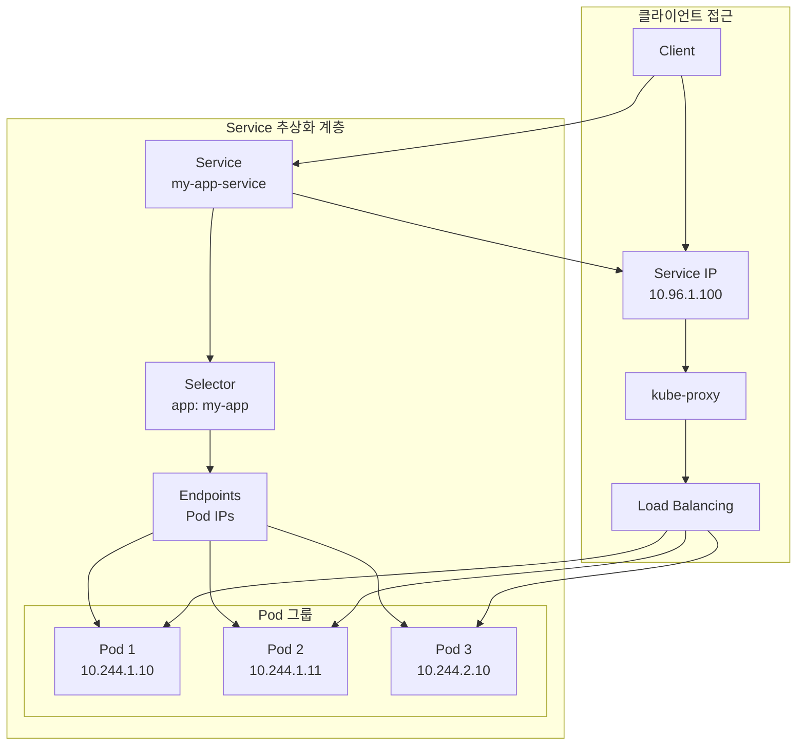
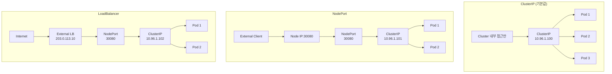
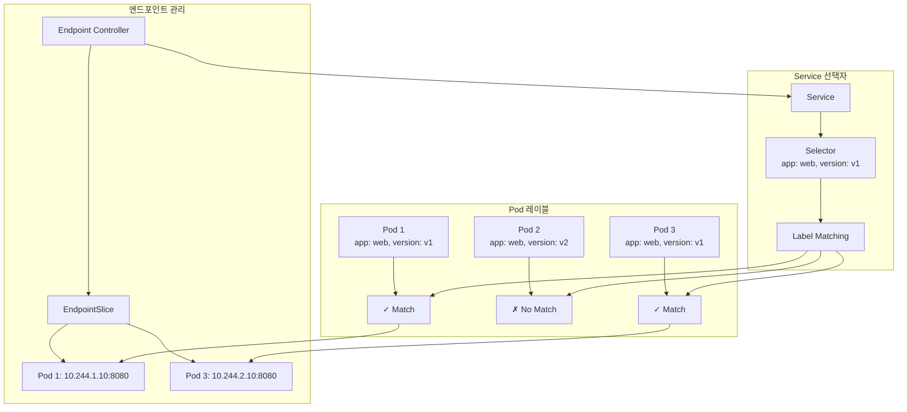

# Session 3: Service 개념과 타입별 특성

## 📍 교과과정에서의 위치
이 세션은 **Week 2 > Day 5 > Session 3**으로, Session 1-2에서 학습한 네트워킹 기초와 Pod 통신을 바탕으로 Kubernetes Service의 추상화 개념과 다양한 서비스 타입의 특성을 학습합니다.

## 학습 목표 (5분)
- **Service 추상화** 개념과 **필요성** 완전 이해
- **ClusterIP, NodePort, LoadBalancer** 타입별 **특성과 사용 사례** 분석
- **Service 선택자**와 **엔드포인트 관리** 메커니즘 학습
- **kube-proxy** 동작 원리와 **로드 밸런싱** 구현 파악

## 1. Service 추상화 개념과 필요성 (15분)

### Service 아키텍처 개요



### Service 추상화 상세 분석
```
Kubernetes Service 추상화 개념:

Service의 필요성과 역할:
├── Pod의 한계와 문제점:
│   ├── 동적 IP 주소:
│   │   ├── Pod 재시작 시 IP 변경
│   │   ├── 스케일링 시 새로운 IP 할당
│   │   ├── 노드 장애 시 다른 노드로 이동
│   │   ├── 업데이트 시 IP 변경
│   │   ├── 클라이언트가 IP 추적 어려움
│   │   └── 하드코딩된 IP 사용 불가
│   ├── 생명주기 불일치:
│   │   ├── Pod는 일시적(ephemeral) 리소스
│   │   ├── 클라이언트는 지속적 연결 필요
│   │   ├── Pod 장애 시 서비스 중단
│   │   ├── 롤링 업데이트 시 연결 끊김
│   │   ├── 오토스케일링 시 연결 불안정
│   │   └── 서비스 디스커버리 복잡성
│   └── 로드 밸런싱 부재:
│       ├── 클라이언트가 직접 Pod 선택
│       ├── 트래픽 분산 불균형
│       ├── 장애 Pod 자동 제외 불가
│       ├── 헬스 체크 메커니즘 부재
│       ├── 세션 어피니티 지원 부족
│       └── 성능 최적화 어려움
├── Service 추상화의 해결책:
│   ├── 안정적인 네트워크 엔드포인트:
│   │   ├── 고정된 ClusterIP 제공
│   │   ├── 일관된 DNS 이름 제공
│   │   ├── 포트 추상화 및 매핑
│   │   ├── 프로토콜 지원 (TCP, UDP, SCTP)
│   │   ├── 다중 포트 서비스 지원
│   │   └── 외부 서비스 통합 지원
│   ├── 동적 엔드포인트 관리:
│   │   ├── 레이블 셀렉터 기반 Pod 선택
│   │   ├── 자동 엔드포인트 업데이트
│   │   ├── Pod 상태 기반 트래픽 라우팅
│   │   ├── 헬스 체크 통합
│   │   ├── 그레이스풀 종료 지원
│   │   └── 실시간 엔드포인트 동기화
│   └── 내장 로드 밸런싱:
│       ├── 다양한 로드 밸런싱 알고리즘
│       ├── 세션 어피니티 지원
│       ├── 가중치 기반 분산
│       ├── 헬스 체크 기반 제외
│       ├── 연결 드레이닝
│       └── 성능 메트릭 수집
├── Service 디스커버리 메커니즘:
│   ├── DNS 기반 디스커버리:
│   │   ├── 서비스 이름 기반 해석
│   │   ├── 네임스페이스 스코프 지원
│   │   ├── SRV 레코드 지원
│   │   ├── 자동 DNS 레코드 생성
│   │   ├── TTL 기반 캐싱
│   │   └── 외부 DNS 통합
│   ├── 환경 변수 기반:
│   │   ├── 서비스 정보 자동 주입
│   │   ├── 호스트 및 포트 정보 제공
│   │   ├── 레거시 애플리케이션 지원
│   │   ├── 컨테이너 시작 시 설정
│   │   ├── 정적 설정 방식
│   │   └── 제한된 동적 업데이트
│   └── API 기반 디스커버리:
│       ├── Kubernetes API 직접 조회
│       ├── 실시간 엔드포인트 정보
│       ├── 고급 필터링 및 선택
│       ├── 커스텀 로직 구현 가능
│       ├── 프로그래매틱 접근
│       └── 높은 유연성 제공
└── Service 메시 통합 준비:
    ├── 표준 서비스 인터페이스:
    │   ├── 일관된 서비스 추상화
    │   ├── 메타데이터 기반 정책
    │   ├── 트래픽 관리 통합점
    │   ├── 보안 정책 적용점
    │   ├── 관찰 가능성 통합
    │   └── 확장 가능한 아키텍처
    ├── 트래픽 정책 적용:
    │   ├── 라우팅 규칙 정의
    │   ├── 로드 밸런싱 정책
    │   ├── 재시도 및 타임아웃
    │   ├── 회로 차단기 패턴
    │   ├── 카나리 배포 지원
    │   └── A/B 테스트 지원
    └── 고급 네트워킹 기능:
        ├── 트래픽 분할 및 미러링
        ├── 지연 시간 기반 라우팅
        ├── 지리적 라우팅
        ├── 가중치 기반 라우팅
        ├── 헤더 기반 라우팅
        └── 커스텀 로드 밸런서

Service 작동 원리:
├── 서비스 생성 과정:
│   ├── 1. Service 리소스 생성 (kubectl apply)
│   ├── 2. API 서버가 Service 검증 및 저장
│   ├── 3. 컨트롤러가 Service 변경 감지
│   ├── 4. ClusterIP 할당 (서비스 타입에 따라)
│   ├── 5. DNS 레코드 생성 (CoreDNS)
│   ├── 6. kube-proxy가 규칙 업데이트
│   ├── 7. 엔드포인트 컨트롤러가 Pod 매칭
│   └── 8. 엔드포인트 슬라이스 생성 및 업데이트
├── 엔드포인트 관리:
│   ├── 레이블 셀렉터 매칭:
│   │   ├── 서비스 셀렉터와 Pod 레이블 비교
│   │   ├── 동적 Pod 추가/제거 감지
│   │   ├── 네임스페이스 스코프 적용
│   │   ├── 다중 레이블 조건 지원
│   │   ├── 실시간 매칭 업데이트
│   │   └── 셀렉터 변경 시 재매칭
│   ├── 엔드포인트 슬라이스:
│   │   ├── 확장 가능한 엔드포인트 관리
│   │   ├── 대규모 서비스 지원
│   │   ├── 네트워크 토폴로지 인식
│   │   ├── 효율적인 업데이트 전파
│   │   ├── 조건부 업데이트 지원
│   │   └── 미러링 및 복제 지원
│   └── 헬스 체크 통합:
│       ├── Readiness Probe 기반 제외
│       ├── Liveness Probe 연동
│       ├── 커스텀 헬스 체크 지원
│       ├── 그레이스풀 종료 처리
│       ├── 장애 감지 및 복구
│       └── 헬스 상태 메트릭 수집
└── 트래픽 라우팅:
    ├── kube-proxy 구현:
    │   ├── iptables 모드 (기본값)
    │   ├── IPVS 모드 (고성능)
    │   ├── userspace 모드 (레거시)
    │   ├── kernelspace 모드 (실험적)
    │   ├── eBPF 모드 (최신)
    │   └── 하이브리드 모드
    ├── 로드 밸런싱 알고리즘:
    │   ├── Round Robin (기본값)
    │   ├── Least Connections
    │   ├── Random
    │   ├── Weighted Round Robin
    │   ├── IP Hash
    │   └── 커스텀 알고리즘
    └── 세션 관리:
        ├── 세션 어피니티 (ClientIP)
        ├── 쿠키 기반 세션
        ├── 헤더 기반 라우팅
        ├── 연결 지속성
        ├── 타임아웃 관리
        └── 연결 드레이닝
```

## 2. ClusterIP, NodePort, LoadBalancer 타입별 특성과 사용 사례 (12분)

### Service 타입별 아키텍처


### Service 타입별 상세 분석
```
Kubernetes Service 타입별 특성:

ClusterIP 서비스:
├── 기본 특성:
│   ├── 클러스터 내부 전용 IP 할당
│   ├── 기본 서비스 타입 (type 미지정 시)
│   ├── 외부에서 직접 접근 불가
│   ├── 클러스터 DNS를 통한 이름 해석
│   ├── kube-proxy를 통한 로드 밸런싱
│   └── 가장 가벼운 서비스 타입
├── 사용 사례:
│   ├── 마이크로서비스 간 내부 통신
│   ├── 데이터베이스 서비스 노출
│   ├── 캐시 서비스 (Redis, Memcached)
│   ├── 메시징 시스템 (RabbitMQ, Kafka)
│   ├── 내부 API 서비스
│   └── 백엔드 서비스 추상화
├── 장점:
│   ├── 높은 보안성 (외부 노출 없음)
│   ├── 낮은 리소스 오버헤드
│   ├── 간단한 설정 및 관리
│   ├── 빠른 내부 통신
│   ├── 네트워크 정책 적용 용이
│   └── 서비스 메시 통합 최적화
├── 제한사항:
│   ├── 외부 접근 불가
│   ├── 클러스터 내부에서만 사용
│   ├── 개발/테스트 시 접근 어려움
│   ├── 외부 모니터링 도구 연동 제한
│   ├── 로드 밸런서 기능 제한
│   └── 고급 라우팅 기능 부족
└── 설정 예시:
    ├── selector 기반 Pod 매칭
    ├── 다중 포트 지원
    ├── 세션 어피니티 설정
    ├── 헬스 체크 통합
    ├── 메타데이터 및 어노테이션
    └── 네트워크 정책 연동

NodePort 서비스:
├── 기본 특성:
│   ├── ClusterIP + 노드 포트 할당
│   ├── 모든 노드에서 동일 포트 오픈
│   ├── 외부에서 노드 IP:포트로 접근
│   ├── 포트 범위: 30000-32767 (기본값)
│   ├── 자동 포트 할당 또는 수동 지정
│   └── 클러스터 외부 접근 가능
├── 사용 사례:
│   ├── 개발 및 테스트 환경 노출
│   ├── 간단한 외부 서비스 노출
│   ├── 로드 밸런서 없는 환경
│   ├── 온프레미스 환경 서비스 노출
│   ├── 임시 외부 접근 제공
│   └── 레거시 시스템 통합
├── 장점:
│   ├── 외부 접근 가능
│   ├── 로드 밸런서 불필요
│   ├── 간단한 설정
│   ├── 모든 환경에서 지원
│   ├── 비용 효율적
│   └── 빠른 프로토타이핑
├── 제한사항:
│   ├── 높은 포트 번호 사용
│   ├── 노드 장애 시 접근 불가
│   ├── 보안 위험 증가
│   ├── 포트 관리 복잡성
│   ├── 방화벽 설정 필요
│   └── 프로덕션 환경 부적합
└── 고급 설정:
    ├── 특정 포트 지정
    ├── 외부 트래픽 정책
    ├── 소스 IP 보존
    ├── 헬스 체크 노드 포트
    ├── 로드 밸런서 소스 범위
    └── 세션 어피니티

LoadBalancer 서비스:
├── 기본 특성:
│   ├── NodePort + 외부 로드 밸런서
│   ├── 클라우드 제공업체 로드 밸런서 연동
│   ├── 외부 IP 자동 할당
│   ├── 고가용성 및 확장성
│   ├── 자동 헬스 체크
│   └── 프로덕션 환경 최적화
├── 클라우드별 구현:
│   ├── AWS ELB/ALB/NLB:
│   │   ├── Elastic Load Balancer 통합
│   │   ├── Application Load Balancer (L7)
│   │   ├── Network Load Balancer (L4)
│   │   ├── 자동 스케일링
│   │   ├── SSL 종료 지원
│   │   └── WAF 통합
│   ├── Google Cloud Load Balancer:
│   │   ├── Global Load Balancer
│   │   ├── Regional Load Balancer
│   │   ├── HTTP(S) Load Balancer
│   │   ├── TCP/UDP Load Balancer
│   │   ├── 글로벌 애니캐스트 IP
│   │   └── Cloud CDN 통합
│   ├── Azure Load Balancer:
│   │   ├── Standard Load Balancer
│   │   ├── Application Gateway
│   │   ├── Traffic Manager
│   │   ├── 가용성 영역 지원
│   │   ├── 아웃바운드 규칙
│   │   └── DDoS 보호
│   └── 온프레미스 구현:
│       ├── MetalLB
│       ├── HAProxy
│       ├── NGINX Load Balancer
│       ├── F5 BIG-IP
│       ├── Citrix ADC
│       └── 커스텀 구현
├── 장점:
│   ├── 프로덕션 환경 적합
│   ├── 고가용성 보장
│   ├── 자동 확장 및 축소
│   ├── 고급 로드 밸런싱
│   ├── SSL/TLS 종료
│   └── 모니터링 및 로깅
├── 제한사항:
│   ├── 클라우드 종속성
│   ├── 추가 비용 발생
│   ├── 설정 복잡성
│   ├── 프로비저닝 시간
│   ├── 벤더 락인
│   └── 온프레미스 제한
└── 고급 기능:
    ├── 헬스 체크 설정
    ├── 트래픽 분산 정책
    ├── SSL 인증서 관리
    ├── 접근 로그 및 메트릭
    ├── DDoS 보호
    └── 지리적 라우팅

ExternalName 서비스:
├── 기본 특성:
│   ├── 외부 서비스를 클러스터 내부 이름으로 매핑
│   ├── CNAME 레코드 생성
│   ├── 실제 Pod 없이 DNS 별칭 제공
│   ├── 외부 서비스 추상화
│   ├── 마이그레이션 지원
│   └── 서비스 디스커버리 통합
├── 사용 사례:
│   ├── 외부 데이터베이스 연동
│   ├── 외부 API 서비스 추상화
│   ├── 레거시 시스템 통합
│   ├── 서비스 마이그레이션
│   ├── 개발/프로덕션 환경 분리
│   └── 서드파티 서비스 통합
├── 장점:
│   ├── 외부 서비스 추상화
│   ├── 설정 변경 없는 마이그레이션
│   ├── 일관된 서비스 디스커버리
│   ├── 네임스페이스 스코프 적용
│   ├── DNS 기반 라우팅
│   └── 간단한 설정
└── 제한사항:
    ├── DNS 해석 의존성
    ├── 로드 밸런싱 불가
    ├── 헬스 체크 불가
    ├── 포트 매핑 제한
    ├── 프로토콜 제한
    └── 보안 정책 적용 어려움

Headless 서비스:
├── 기본 특성:
│   ├── ClusterIP: None 설정
│   ├── 로드 밸런싱 없음
│   ├── 개별 Pod IP 직접 반환
│   ├── DNS A 레코드로 모든 Pod IP 제공
│   ├── StatefulSet과 주로 사용
│   └── 서비스 디스커버리 특화
├── 사용 사례:
│   ├── StatefulSet Pod 개별 접근
│   ├── 데이터베이스 클러스터 (MySQL, MongoDB)
│   ├── 분산 시스템 (Kafka, Elasticsearch)
│   ├── 피어 투 피어 통신
│   ├── 커스텀 로드 밸런싱
│   └── 서비스 메시 통합
├── 장점:
│   ├── 개별 Pod 직접 접근
│   ├── 커스텀 로드 밸런싱 가능
│   ├── 상태 유지 애플리케이션 지원
│   ├── 피어 디스커버리 지원
│   ├── 클러스터 멤버십 관리
│   └── 고급 라우팅 제어
└── 제한사항:
    ├── 내장 로드 밸런싱 없음
    ├── 복잡한 클라이언트 로직 필요
    ├── 장애 처리 복잡성
    ├── 연결 관리 어려움
    ├── 성능 최적화 어려움
    └── 디버깅 복잡성
```

## 3. Service 선택자와 엔드포인트 관리 메커니즘 (10분)

### 엔드포인트 관리 아키텍처


### 엔드포인트 관리 상세 분석
```
Service 선택자와 엔드포인트 관리:

레이블 셀렉터 메커니즘:
├── 셀렉터 유형:
│   ├── Equality-based 셀렉터:
│   │   ├── 기본 문법: key=value, key!=value
│   │   ├── 정확한 일치 조건
│   │   ├── 간단한 매칭 로직
│   │   ├── 성능 최적화
│   │   ├── 대부분의 사용 사례 커버
│   │   └── Service에서 주로 사용
│   ├── Set-based 셀렉터:
│   │   ├── 고급 문법: key in (value1, value2)
│   │   ├── 복잡한 조건 표현
│   │   ├── 다중 값 매칭
│   │   ├── 유연한 선택 조건
│   │   ├── ReplicaSet, Deployment에서 사용
│   │   └── 고급 스케줄링 지원
│   └── 혼합 셀렉터:
│       ├── 여러 조건 조합
│       ├── AND 연산자 적용
│       ├── 복잡한 매칭 규칙
│       ├── 세밀한 제어 가능
│       ├── 성능 고려 필요
│       └── 디버깅 복잡성 증가
├── 동적 엔드포인트 업데이트:
│   ├── Pod 생명주기 추적:
│   │   ├── Pod 생성 시 엔드포인트 추가
│   │   ├── Pod 삭제 시 엔드포인트 제거
│   │   ├── Pod 상태 변경 시 업데이트
│   │   ├── 레이블 변경 시 재평가
│   │   ├── 네임스페이스 이동 시 처리
│   │   └── 실시간 동기화 보장
│   ├── 헬스 체크 통합:
│   │   ├── Readiness Probe 기반 제어
│   │   ├── 준비되지 않은 Pod 제외
│   │   ├── 헬스 체크 실패 시 제거
│   │   ├── 복구 시 자동 추가
│   │   ├── 그레이스풀 종료 처리
│   │   └── 헬스 상태 메트릭 연동
│   └── 네트워크 토폴로지 인식:
│       ├── 노드 위치 기반 그룹핑
│       ├── 가용 영역 인식
│       ├── 지역 기반 우선순위
│       ├── 네트워크 지연 고려
│       ├── 대역폭 최적화
│       └── 장애 도메인 분산
└── 엔드포인트 슬라이스:
    ├── 확장성 개선:
    │   ├── 대규모 서비스 지원 (1000+ Pod)
    │   ├── 효율적인 업데이트 전파
    │   ├── 네트워크 대역폭 절약
    │   ├── API 서버 부하 감소
    │   ├── 메모리 사용량 최적화
    │   └── 성능 향상
    ├── 고급 기능:
    │   ├── 조건부 업데이트
    │   ├── 부분 업데이트 지원
    │   ├── 미러링 및 복제
    │   ├── 커스텀 엔드포인트
    │   ├── 외부 엔드포인트 통합
    │   └── 다중 프로토콜 지원
    └── 호환성:
        ├── 기존 Endpoints API 호환
        ├── 점진적 마이그레이션 지원
        ├── 레거시 클라이언트 지원
        ├── API 버전 관리
        ├── 기능 플래그 제어
        └── 하위 호환성 보장

수동 엔드포인트 관리:
├── 셀렉터 없는 서비스:
│   ├── 수동 엔드포인트 정의
│   ├── 외부 서비스 연동
│   ├── 레거시 시스템 통합
│   ├── 커스텀 로드 밸런싱
│   ├── 다중 클러스터 연동
│   └── 하이브리드 환경 지원
├── 외부 서비스 통합:
│   ├── 외부 데이터베이스
│   ├── 외부 API 서비스
│   ├── 온프레미스 서비스
│   ├── 클라우드 서비스
│   ├── 서드파티 서비스
│   └── 마이그레이션 지원
└── 고급 사용 사례:
    ├── 블루-그린 배포
    ├── 카나리 배포
    ├── A/B 테스트
    ├── 트래픽 분할
    ├── 지역별 라우팅
    └── 커스텀 로드 밸런서
```

## 4. kube-proxy 동작 원리와 로드 밸런싱 구현 (8분)

### kube-proxy 아키텍처

```mermaid
graph TB
    subgraph "kube-proxy 모드"
        A[iptables 모드<br/>(기본값)] --> B[IPVS 모드<br/>(고성능)]
        B --> C[userspace 모드<br/>(레거시)]
    end
    
    subgraph "트래픽 흐름"
        D[Client Request] --> E[Service IP:Port]
        E --> F[kube-proxy Rules]
        F --> G[Load Balancing]
        G --> H[Pod Selection]
        H --> I[Pod IP:Port]
    end
    
    subgraph "구현 방식"
        J[iptables Rules] --> K[DNAT 변환]
        L[IPVS Rules] --> M[커널 로드 밸런서]
        N[userspace Proxy] --> O[사용자 공간 처리]
    end
    
    A --> J
    B --> L
    C --> N
    F --> J
    F --> L
    F --> N
```

### kube-proxy 상세 분석
```
kube-proxy 동작 원리:

kube-proxy 모드별 특성:
├── iptables 모드 (기본값):
│   ├── 동작 원리:
│   │   ├── iptables 규칙 기반 트래픽 처리
│   │   ├── DNAT (Destination NAT) 사용
│   │   ├── 커널 공간에서 패킷 처리
│   │   ├── 랜덤 기반 로드 밸런싱
│   │   ├── 연결 추적 (conntrack) 활용
│   │   └── 세션 어피니티 지원
│   ├── 장점:
│   │   ├── 안정성 및 성숙도
│   │   ├── 낮은 CPU 오버헤드
│   │   ├── 커널 최적화 활용
│   │   ├── 광범위한 플랫폼 지원
│   │   ├── 디버깅 도구 풍부
│   │   └── 네트워크 정책 통합
│   ├── 제한사항:
│   │   ├── 대규모 서비스 시 성능 저하
│   │   ├── 규칙 업데이트 시 지연
│   │   ├── 로드 밸런싱 알고리즘 제한
│   │   ├── 세밀한 트래픽 제어 어려움
│   │   ├── 메트릭 수집 제한
│   │   └── 고급 기능 부족
│   └── 적합한 환경:
│       ├── 일반적인 프로덕션 환경
│       ├── 중소규모 클러스터
│       ├── 안정성 우선 환경
│       ├── 표준 로드 밸런싱 요구
│       ├── 리소스 제약 환경
│       └── 레거시 시스템 통합
├── IPVS 모드 (고성능):
│   ├── 동작 원리:
│   │   ├── Linux IPVS (IP Virtual Server) 활용
│   │   ├── 커널 레벨 로드 밸런서
│   │   ├── 해시 테이블 기반 룩업
│   │   ├── 다양한 로드 밸런싱 알고리즘
│   │   ├── 연결 기반 세션 추적
│   │   └── 고성능 패킷 처리
│   ├── 로드 밸런싱 알고리즘:
│   │   ├── Round Robin (rr)
│   │   ├── Least Connection (lc)
│   │   ├── Destination Hashing (dh)
│   │   ├── Source Hashing (sh)
│   │   ├── Shortest Expected Delay (sed)
│   │   ├── Never Queue (nq)
│   │   ├── Weighted Round Robin (wrr)
│   │   └── Weighted Least Connection (wlc)
│   ├── 장점:
│   │   ├── 높은 성능 및 확장성
│   │   ├── 다양한 로드 밸런싱 알고리즘
│   │   ├── 실시간 메트릭 수집
│   │   ├── 세밀한 트래픽 제어
│   │   ├── 대규모 서비스 지원
│   │   └── 고급 기능 제공
│   ├── 제한사항:
│   │   ├── 커널 모듈 의존성
│   │   ├── 플랫폼 호환성 제한
│   │   ├── 복잡한 설정 및 디버깅
│   │   ├── 추가 리소스 요구
│   │   ├── 네트워크 정책 통합 복잡
│   │   └── 학습 곡선 존재
│   └── 적합한 환경:
│       ├── 대규모 프로덕션 환경
│       ├── 고성능 요구사항
│       ├── 복잡한 로드 밸런싱 필요
│       ├── 실시간 메트릭 중요
│       ├── 트래픽 제어 고도화
│       └── 성능 최적화 우선
├── userspace 모드 (레거시):
│   ├── 동작 원리:
│   │   ├── 사용자 공간 프록시 프로세스
│   │   ├── kube-proxy가 직접 트래픽 처리
│   │   ├── 라운드 로빈 로드 밸런싱
│   │   ├── 연결 기반 세션 추적
│   │   ├── 포트 포워딩 방식
│   │   └── 단순한 구현
│   ├── 장점:
│   │   ├── 플랫폼 독립성
│   │   ├── 단순한 구현
│   │   ├── 디버깅 용이
│   │   ├── 커널 의존성 없음
│   │   ├── 호환성 우수
│   │   └── 안정성 검증
│   ├── 제한사항:
│   │   ├── 낮은 성능
│   │   ├── 높은 지연 시간
│   │   ├── 사용자-커널 공간 전환 오버헤드
│   │   ├── 확장성 제한
│   │   ├── 단일 장애점
│   │   └── 리소스 사용량 높음
│   └── 사용 권장 사항:
│       ├── 레거시 환경 지원
│       ├── 개발 및 테스트 환경
│       ├── 특수한 네트워크 환경
│       ├── 디버깅 및 문제 해결
│       ├── 호환성 테스트
│       └── 마이그레이션 과정
└── 새로운 모드 (실험적):
    ├── eBPF 모드:
    │   ├── 커널 내 프로그래밍
    │   ├── 최고 성능
    │   ├── 유연한 로직
    │   ├── 실시간 메트릭
    │   ├── 고급 트래픽 제어
    │   └── 최신 커널 요구
    ├── 하이브리드 모드:
    │   ├── 상황별 최적 모드 선택
    │   ├── 동적 모드 전환
    │   ├── 성능 최적화
    │   ├── 유연성 제공
    │   ├── 복잡성 관리
    │   └── 지능형 선택
    └── 클라우드 네이티브 모드:
        ├── 클라우드 로드 밸런서 통합
        ├── 서비스 메시 연동
        ├── 고급 트래픽 관리
        ├── 관찰 가능성 강화
        ├── 보안 정책 통합
        └── 자동화 및 최적화

로드 밸런싱 구현:
├── 세션 어피니티:
│   ├── ClientIP 기반:
│   │   ├── 클라이언트 IP 해시
│   │   ├── 동일 클라이언트 → 동일 Pod
│   │   ├── 세션 상태 유지
│   │   ├── 캐시 효율성 향상
│   │   ├── 로드 불균형 가능성
│   │   └── NAT 환경 제한
│   ├── 쿠키 기반 (Ingress):
│   │   ├── HTTP 쿠키 활용
│   │   ├── 애플리케이션 레벨 세션
│   │   ├── 세밀한 제어
│   │   ├── 브라우저 의존성
│   │   ├── 보안 고려사항
│   │   └── 복잡한 구현
│   └── 헤더 기반 (고급):
│       ├── HTTP 헤더 활용
│       ├── 커스텀 라우팅 로직
│       ├── 유연한 정책
│       ├── 애플리케이션 통합
│       ├── 복잡한 설정
│       └── 디버깅 어려움
├── 헬스 체크 통합:
│   ├── Readiness Probe:
│   │   ├── 트래픽 라우팅 제어
│   │   ├── 준비 상태 확인
│   │   ├── 자동 엔드포인트 제외
│   │   ├── 그레이스풀 시작
│   │   ├── 로드 밸런서 통합
│   │   └── 서비스 품질 보장
│   ├── Liveness Probe:
│   │   ├── Pod 생존 상태 확인
│   │   ├── 자동 재시작 트리거
│   │   ├── 장애 감지 및 복구
│   │   ├── 서비스 가용성 향상
│   │   ├── 모니터링 통합
│   │   └── 알림 및 로깅
│   └── 커스텀 헬스 체크:
│       ├── 애플리케이션별 로직
│       ├── 비즈니스 로직 검증
│       ├── 외부 의존성 확인
│       ├── 성능 기반 판단
│       ├── 복합 조건 평가
│       └── 고급 장애 처리
└── 성능 최적화:
    ├── 연결 풀링:
    │   ├── 연결 재사용
    │   ├── 오버헤드 감소
    │   ├── 지연 시간 단축
    │   ├── 리소스 효율성
    │   ├── 확장성 향상
    │   └── 메모리 관리
    ├── 캐싱 전략:
    │   ├── DNS 캐싱
    │   ├── 연결 캐싱
    │   ├── 라우팅 캐시
    │   ├── 메타데이터 캐시
    │   ├── TTL 관리
    │   └── 무효화 전략
    └── 모니터링 및 튜닝:
        ├── 성능 메트릭 수집
        ├── 병목 지점 식별
        ├── 자동 튜닝
        ├── 알림 및 대응
        ├── 용량 계획
        └── 지속적 최적화
```

## 실습 과제 (5분)

### 과제 1: Service 타입별 설계
```yaml
# 다음 시나리오에 적합한 Service 타입을 선택하고 설정하세요:

# 시나리오 1: 내부 데이터베이스 서비스
# - MySQL 데이터베이스
# - 클러스터 내부에서만 접근
# - 3개 Pod로 구성된 읽기 전용 복제본

# 시나리오 2: 웹 애플리케이션 외부 노출
# - React 프론트엔드 애플리케이션
# - 인터넷에서 접근 가능해야 함
# - AWS EKS 환경에서 운영

# 시나리오 3: 마이크로서비스 간 통신
# - 주문 서비스 → 결제 서비스 호출
# - 네임스페이스 간 통신
# - 로드 밸런싱 필요

# 각 시나리오별로 적절한 Service 타입과 설정을 제시하세요.
```

### 과제 2: 엔드포인트 관리 전략
```yaml
# 다음 요구사항을 만족하는 엔드포인트 관리 전략을 수립하세요:

# 애플리케이션: 전자상거래 API 서버
# 구성: 5개 Pod (3개는 v1.0, 2개는 v1.1)
# 요구사항:
# - 90% 트래픽은 v1.0으로, 10%는 v1.1로 분산
# - v1.1 Pod에 문제 발생 시 자동으로 v1.0으로 전환
# - 헬스 체크 기반 자동 엔드포인트 관리
# - 세션 어피니티 적용

# 설계 결과물:
# 1. Service 및 엔드포인트 설정
# 2. 레이블 전략
# 3. 헬스 체크 설정
# 4. 트래픽 분산 방법
```

## 토론 주제 (5분)

1. **Service 타입 선택 기준**
   - 환경별 최적 Service 타입 선택
   - 비용과 성능의 트레이드오프

2. **kube-proxy 모드의 선택**
   - iptables vs IPVS 모드 비교
   - 대규모 환경에서의 성능 고려사항

3. **서비스 디스커버리의 진화**
   - DNS 기반 vs API 기반 디스커버리
   - 서비스 메시와의 통합 방향

## 다음 세션 예고 (2분)

다음 세션에서는 **"Ingress와 외부 트래픽 관리"**를 다룹니다:
- Ingress 리소스와 컨트롤러
- HTTP/HTTPS 라우팅 규칙
- SSL 종료와 인증서 관리
- 다양한 Ingress 컨트롤러 비교

---

## 📚 참고 자료

- [Kubernetes Services](https://kubernetes.io/docs/concepts/services-networking/service/)
- [Service Types](https://kubernetes.io/docs/concepts/services-networking/service/#publishing-services-service-types)
- [EndpointSlices](https://kubernetes.io/docs/concepts/services-networking/endpoint-slices/)
- [kube-proxy](https://kubernetes.io/docs/reference/command-line-tools-reference/kube-proxy/)
- [IPVS-Based In-Cluster Load Balancing](https://kubernetes.io/blog/2018/07/09/ipvs-based-in-cluster-load-balancing-deep-dive/)

---
*본 세션은 Kubernetes Service의 추상화 개념부터 실제 구현까지 체계적으로 학습하여, 클라우드 네이티브 환경에서의 서비스 관리 전문성을 구축하는 것을 목표로 합니다.*