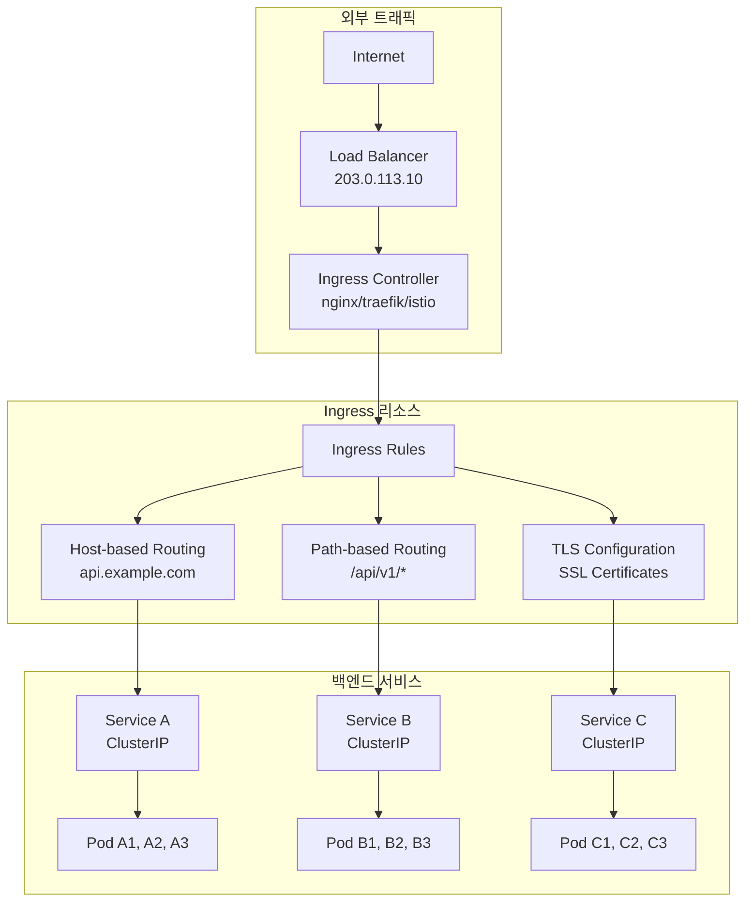
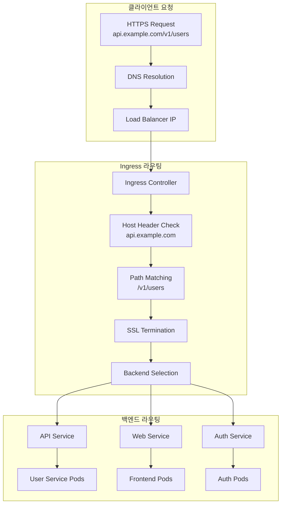
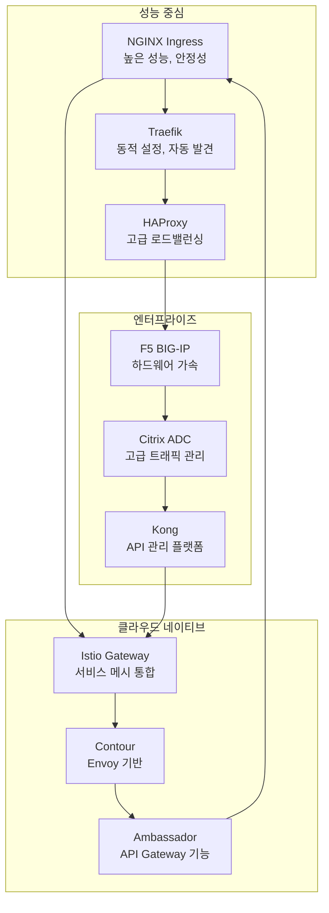
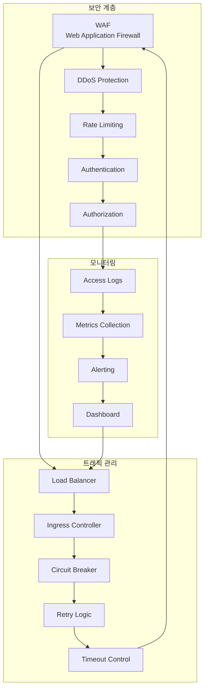

# Session 4: Ingress와 외부 트래픽 관리

## 📍 교과과정에서의 위치
이 세션은 **Week 2 > Day 5 > Session 4**로, Session 1-3에서 학습한 네트워킹 기초와 Service를 바탕으로 Ingress를 통한 외부 트래픽 관리와 HTTP/HTTPS 라우팅 메커니즘을 학습합니다.

## 학습 목표 (5분)
- **Ingress 리소스**와 **컨트롤러** 아키텍처 완전 이해
- **HTTP/HTTPS 라우팅**과 **SSL 종료** 메커니즘 학습
- **다양한 Ingress 컨트롤러** 특성과 **선택 기준** 분석
- **외부 트래픽 관리**와 **보안 정책** 수립 방법 파악

## 1. Ingress 리소스와 컨트롤러 아키텍처 (15분)

### Ingress 아키텍처 개요



### Ingress 아키텍처 상세 분석
```
Kubernetes Ingress 아키텍처:

Ingress vs Service 비교:
   🔹 Service의 한계:
      • L4 로드 밸런싱만 지원:
         • TCP/UDP 프로토콜 수준 처리
         • IP 주소와 포트 기반 라우팅
         • HTTP 헤더 인식 불가
         • 경로 기반 라우팅 불가
         • SSL 종료 기능 부족
         • 고급 라우팅 규칙 제한
      • 외부 노출의 제약:
         • NodePort: 높은 포트 번호, 보안 위험
         • LoadBalancer: 서비스당 별도 LB 필요
         • 비용 증가 (서비스별 LB)
         • IP 주소 낭비
         • 관리 복잡성 증가
         • 확장성 제한
      • 고급 기능 부족:
      • URL 기반 라우팅 불가
      • 호스트 기반 라우팅 불가
      • SSL/TLS 종료 불가
      • 인증 및 권한 부여 제한
      • 레이트 리미팅 불가
      • 고급 로드 밸런싱 제한
   🔹 Ingress의 해결책:
      • L7 로드 밸런싱:
         • HTTP/HTTPS 프로토콜 인식
         • 헤더 기반 라우팅
         • 쿠키 기반 세션 관리
         • 사용자 에이전트 기반 분기
         • 지리적 위치 기반 라우팅
         • 콘텐츠 기반 라우팅
      • 고급 라우팅 기능:
         • 호스트 기반 라우팅 (Virtual Host)
         • 경로 기반 라우팅 (Path-based)
         • 정규 표현식 지원
         • 리다이렉션 및 재작성
         • 가중치 기반 트래픽 분할
         • 카나리 배포 지원
      • 통합 외부 접근:
      • 단일 진입점 (Single Entry Point)
      • 여러 서비스 통합 노출
      • 비용 효율적 (단일 LB)
      • 중앙화된 관리
      • 일관된 보안 정책
      • 확장성 및 유연성
   🔹 Ingress 구성 요소:
   🔹 Ingress 리소스:
      • 라우팅 규칙 정의
      • TLS 설정
      • 백엔드 서비스 매핑
      • 어노테이션 기반 설정
      • 네임스페이스 스코프
      • YAML 기반 선언적 설정
   🔹 Ingress 컨트롤러:
      • 실제 트래픽 처리
      • 라우팅 규칙 구현
      • 로드 밸런싱 수행
      • SSL/TLS 종료
      • 모니터링 및 로깅
      • 고급 기능 제공
   🔹 백엔드 서비스:
   🔹 ClusterIP 서비스 연결
   🔹 Pod 그룹 추상화
   🔹 헬스 체크 통합
   🔹 동적 엔드포인트 관리
   🔹 서비스 디스커버리
   🔹 로드 밸런싱

Ingress 컨트롤러 아키텍처:
   🔹 컨트롤러 동작 원리:
      • Watch API 패턴:
         • Kubernetes API 서버 모니터링
         • Ingress 리소스 변경 감지
         • Service 및 Endpoint 변경 추적
         • ConfigMap 및 Secret 변경 감지
         • 실시간 설정 업데이트
         • 이벤트 기반 반응형 처리
      • 설정 생성 및 적용:
         • Ingress 규칙 파싱
         • 백엔드 서비스 해석
         • 로드 밸런서 설정 생성
         • SSL 인증서 관리
         • 설정 검증 및 테스트
         • 무중단 설정 적용
      • 트래픽 처리:
      • HTTP/HTTPS 요청 수신
      • 라우팅 규칙 적용
      • 백엔드 서비스 선택
      • 로드 밸런싱 수행
      • 응답 처리 및 전달
      • 연결 관리 및 최적화
   🔹 컨트롤러 배포 패턴:
      • DaemonSet 배포:
         • 모든 노드에 컨트롤러 배치
         • 노드별 트래픽 처리
         • 높은 가용성
         • 지연 시간 최소화
         • 리소스 분산
         • 노드 장애 격리
      • Deployment 배포:
         • 특정 노드에 컨트롤러 배치
         • 중앙화된 트래픽 처리
         • 리소스 집중
         • 관리 단순화
         • 확장성 제어
         • 비용 최적화
      • 하이브리드 배포:
      • 환경별 최적 배포 방식
      • 트래픽 패턴 기반 선택
      • 성능 요구사항 고려
      • 비용 효율성 평가
      • 운영 복잡도 관리
      • 확장성 및 유연성
   🔹 고가용성 설계:
   🔹 다중 컨트롤러 배포:
      • Active-Active 구성
      • Active-Passive 구성
      • 로드 밸런서 앞단 배치
      • 헬스 체크 및 장애 조치
      • 세션 공유 및 동기화
      • 무중단 업데이트
   🔹 지역별 분산:
      • 다중 가용 영역 배포
      • 지리적 분산
      • 지연 시간 최적화
      • 재해 복구 지원
      • 트래픽 분산
      • 규정 준수
   🔹 모니터링 및 알림:
   🔹 컨트롤러 상태 모니터링
   🔹 트래픽 메트릭 수집
   🔹 오류율 및 지연 시간 추적
   🔹 리소스 사용량 모니터링
   🔹 자동 알림 및 에스컬레이션
   🔹 대시보드 및 시각화

Ingress 클래스와 다중 컨트롤러:
   🔹 IngressClass 리소스:
      • 컨트롤러 식별 및 분류
      • 기본 Ingress 클래스 설정
      • 컨트롤러별 매개변수 설정
      • 네임스페이스 스코프 제어
      • 어노테이션 기반 선택
      • 버전 관리 및 마이그레이션
   🔹 다중 컨트롤러 관리:
      • 컨트롤러별 역할 분담:
         • 내부 트래픽: nginx-internal
         • 외부 트래픽: nginx-external
         • API 트래픽: traefik-api
         • 웹 트래픽: nginx-web
         • 마이크로서비스: istio-gateway
         • 레거시: haproxy-legacy
      • 환경별 분리:
         • 개발 환경: dev-ingress
         • 스테이징 환경: staging-ingress
         • 프로덕션 환경: prod-ingress
         • 테스트 환경: test-ingress
         • 데모 환경: demo-ingress
         • 샌드박스: sandbox-ingress
      • 기능별 특화:
      • 고성능: nginx-plus
      • 보안 강화: f5-bigip
      • 서비스 메시: istio-gateway
      • API 관리: kong-ingress
      • 엣지 컴퓨팅: traefik-edge
      • 클라우드 네이티브: contour
   🔹 컨트롤러 선택 전략:
   🔹 성능 요구사항:
      • 처리량 (RPS, 대역폭)
      • 지연 시간 (P95, P99)
      • 동시 연결 수
      • SSL/TLS 성능
      • 리소스 효율성
      • 확장성
   🔹 기능 요구사항:
      • 라우팅 복잡도
      • 인증 및 권한 부여
      • 레이트 리미팅
      • 캐싱 기능
      • 압축 및 최적화
      • 모니터링 및 로깅
   🔹 운영 요구사항:
   🔹 설정 복잡도
   🔹 디버깅 및 트러블슈팅
   🔹 업데이트 및 유지보수
   🔹 커뮤니티 지원
   🔹 상업적 지원
   🔹 생태계 통합
```

## 2. HTTP/HTTPS 라우팅과 SSL 종료 메커니즘 (12분)

### HTTP/HTTPS 라우팅 구조


### HTTP/HTTPS 라우팅 상세 분석
```
Ingress HTTP/HTTPS 라우팅 메커니즘:

호스트 기반 라우팅 (Virtual Host):
   🔹 기본 개념:
      • HTTP Host 헤더 기반 분기
      • 단일 IP에서 다중 도메인 서비스
      • 가상 호스트 개념 적용
      • DNS 기반 서비스 식별
      • 도메인별 독립적 관리
      • 확장 가능한 멀티 테넌트 지원
   🔹 구현 방식:
      • 정확한 호스트 매칭:
         • api.example.com → API 서비스
         • web.example.com → 웹 서비스
         • admin.example.com → 관리 서비스
         • 대소문자 구분 없음
         • 포트 번호 무시
         • 높은 우선순위
      • 와일드카드 호스트 매칭:
         • *.example.com → 서브도메인 서비스
         • *.api.example.com → API 버전별 서비스
         • 유연한 서브도메인 처리
         • 동적 서비스 생성 지원
         • 낮은 우선순위
         • 기본 라우팅 역할
      • 기본 호스트 처리:
      • 호스트 헤더 없는 요청 처리
      • IP 직접 접근 처리
      • 잘못된 호스트 헤더 처리
      • 기본 백엔드 서비스 연결
      • 오류 페이지 제공
      • 보안 정책 적용
   🔹 고급 호스트 라우팅:
      • 정규 표현식 지원:
         • 복잡한 패턴 매칭
         • 동적 호스트 생성
         • 조건부 라우팅
         • 파라미터 추출
         • 유연한 규칙 정의
         • 성능 고려 필요
      • 지리적 라우팅:
         • 국가별 도메인 처리
         • 지역별 서비스 분기
         • CDN 통합
         • 지연 시간 최적화
         • 규정 준수 지원
         • 다국어 지원
      • 환경별 라우팅:
      • dev.api.example.com → 개발 환경
      • staging.api.example.com → 스테이징
      • api.example.com → 프로덕션
      • 환경 격리 보장
      • 배포 파이프라인 통합
      • 테스트 자동화 지원
   🔹 호스트 라우팅 모범 사례:
   🔹 DNS 관리 전략
   🔹 인증서 관리 자동화
   🔹 서브도메인 정책 수립
   🔹 보안 헤더 설정
   🔹 모니터링 및 로깅
   🔹 장애 조치 계획

경로 기반 라우팅 (Path-based):
   🔹 기본 개념:
      • URL 경로 기반 분기
      • 마이크로서비스 아키텍처 지원
      • API 버전 관리
      • 기능별 서비스 분리
      • 점진적 마이그레이션 지원
      • 세밀한 트래픽 제어
   🔹 경로 매칭 방식:
      • 정확한 경로 매칭:
         • /api/v1/users → 사용자 서비스
         • /api/v1/orders → 주문 서비스
         • /health → 헬스 체크 서비스
         • 높은 우선순위
         • 빠른 매칭 성능
         • 명확한 라우팅 규칙
      • 접두사 매칭:
         • /api/v1/* → API v1 서비스
         • /api/v2/* → API v2 서비스
         • /static/* → 정적 파일 서비스
         • 유연한 하위 경로 처리
         • 계층적 서비스 구조
         • 확장 가능한 설계
      • 정규 표현식 매칭:
         • /api/v[0-9]+/* → API 버전 처리
         • /users/[0-9]+/profile → 사용자 프로필
         • 복잡한 패턴 지원
         • 동적 파라미터 추출
         • 유연한 라우팅 로직
         • 성능 오버헤드 고려
      • 기본 경로 처리:
      • / → 기본 웹 서비스
      • 매칭되지 않는 경로 처리
      • 404 오류 페이지
      • 리다이렉션 규칙
      • 보안 정책 적용
      • 로깅 및 모니터링
   🔹 고급 경로 라우팅:
      • 경로 재작성:
         • /old-api/* → /api/v1/*
         • 레거시 URL 지원
         • API 버전 마이그레이션
         • SEO 친화적 URL
         • 사용자 경험 개선
         • 하위 호환성 유지
      • 조건부 라우팅:
         • 헤더 기반 분기
         • 쿼리 파라미터 기반
         • 사용자 에이전트 기반
         • 지리적 위치 기반
         • 시간 기반 라우팅
         • A/B 테스트 지원
      • 가중치 기반 분산:
      • 카나리 배포 (5% → 새 버전)
      • 블루-그린 배포 지원
      • 점진적 트래픽 이동
      • 위험 최소화
      • 성능 모니터링
      • 자동 롤백 지원
   🔹 경로 라우팅 최적화:
   🔹 경로 우선순위 관리
   🔹 매칭 성능 최적화
   🔹 캐싱 전략 적용
   🔹 압축 및 최적화
   🔹 보안 정책 통합
   🔹 모니터링 및 분석

SSL/TLS 종료 메커니즘:
   🔹 SSL 종료 개념:
      • 클라이언트-Ingress 간 암호화:
         • HTTPS 연결 수신
         • SSL/TLS 핸드셰이크 처리
         • 인증서 검증 및 제시
         • 암호화 통신 복호화
         • 성능 최적화 (하드웨어 가속)
         • 보안 정책 적용
      • Ingress-백엔드 간 통신:
         • 일반적으로 HTTP 사용
         • 클러스터 내부 네트워크 신뢰
         • 성능 최적화 (암호화 오버헤드 제거)
         • 간단한 백엔드 구현
         • 네트워크 정책으로 보안 보완
         • 선택적 백엔드 암호화 지원
      • End-to-End 암호화:
      • 클라이언트-백엔드 간 완전 암호화
      • 높은 보안 요구사항 환경
      • 규정 준수 요구사항
      • 성능 오버헤드 증가
      • 복잡한 인증서 관리
      • 디버깅 복잡성 증가
   🔹 인증서 관리:
      • 수동 인증서 관리:
         • Secret 리소스에 인증서 저장
         • 수동 갱신 및 배포
         • 인증서 만료 모니터링
         • 보안 키 관리
         • 백업 및 복구
         • 감사 및 추적
      • 자동 인증서 관리:
         • cert-manager 통합
         • Let's Encrypt 자동 발급
         • 자동 갱신 및 배포
         • DNS 챌린지 지원
         • HTTP 챌린지 지원
         • 다중 CA 지원
      • 고급 인증서 기능:
      • 와일드카드 인증서
      • SAN (Subject Alternative Name)
      • EV (Extended Validation) 인증서
      • 클라이언트 인증서 검증
      • OCSP (Online Certificate Status Protocol)
      • 인증서 투명성 로그
   🔹 SSL/TLS 보안 설정:
   🔹 프로토콜 버전 제어:
      • TLS 1.3 우선 사용
      • TLS 1.2 호환성 유지
      • SSL 3.0/TLS 1.0/1.1 비활성화
      • 프로토콜 협상 최적화
      • 보안 취약점 대응
      • 성능 최적화
   🔹 암호화 스위트 설정:
      • 강력한 암호화 알고리즘 선택
      • 약한 암호화 비활성화
      • Perfect Forward Secrecy 지원
      • AEAD 암호화 우선
      • 성능 최적화 고려
      • 호환성 균형
   🔹 보안 헤더 설정:
   🔹 HSTS (HTTP Strict Transport Security)
   🔹 HPKP (HTTP Public Key Pinning)
   🔹 CSP (Content Security Policy)
   🔹 X-Frame-Options
   🔹 X-Content-Type-Options
   🔹 Referrer-Policy
```

## 3. 다양한 Ingress 컨트롤러 특성과 선택 기준 (10분)

### Ingress 컨트롤러 비교


### Ingress 컨트롤러 상세 비교
```
주요 Ingress 컨트롤러 특성 분석:

NGINX Ingress Controller:
   🔹 기본 특성:
      • 가장 널리 사용되는 컨트롤러
      • 높은 성능과 안정성
      • 풍부한 기능과 설정 옵션
      • 활발한 커뮤니티 지원
      • 상업적 지원 (NGINX Plus)
      • 광범위한 문서화
   🔹 주요 기능:
      • 고성능 HTTP/HTTPS 처리
      • 다양한 로드 밸런싱 알고리즘
      • SSL/TLS 종료 및 최적화
      • 레이트 리미팅 및 DDoS 보호
      • 인증 및 권한 부여
      • 캐싱 및 압축
      • 웹소켓 지원
      • 모니터링 및 로깅
   🔹 장점:
      • 검증된 안정성과 성능
      • 풍부한 기능과 유연성
      • 광범위한 커뮤니티 지원
      • 상세한 문서와 예제
      • 다양한 플랫폼 지원
      • 엔터프라이즈 기능 (Plus)
   🔹 제한사항:
      • 복잡한 설정 및 관리
      • 동적 설정 변경 제한
      • 메모리 사용량 높음
      • 학습 곡선 존재
      • 일부 고급 기능 유료
   🔹 적합한 환경:
   🔹 프로덕션 환경
   🔹 고성능 요구사항
   🔹 안정성 우선 환경
   🔹 복잡한 라우팅 규칙
   🔹 엔터프라이즈 환경

Traefik:
   🔹 기본 특성:
      • 클라우드 네이티브 설계
      • 동적 서비스 발견
      • 자동 설정 및 관리
      • 현대적 아키텍처
      • 마이크로서비스 최적화
      • 사용자 친화적 인터페이스
   🔹 주요 기능:
      • 자동 서비스 발견
      • 동적 설정 업데이트
      • Let's Encrypt 자동 통합
      • 미들웨어 기반 확장
      • 메트릭 및 추적 내장
      • 다중 백엔드 지원
      • 웹 UI 대시보드
      • API 기반 관리
   🔹 장점:
      • 간단한 설정 및 관리
      • 자동화된 인증서 관리
      • 실시간 설정 업데이트
      • 직관적인 웹 인터페이스
      • 마이크로서비스 친화적
      • 빠른 학습 곡선
   🔹 제한사항:
      • 상대적으로 새로운 기술
      • 엔터프라이즈 기능 제한
      • 대규모 환경 검증 부족
      • 커뮤니티 규모 작음
      • 고급 기능 유료
   🔹 적합한 환경:
   🔹 마이크로서비스 아키텍처
   🔹 클라우드 네이티브 환경
   🔹 개발 및 테스트 환경
   🔹 자동화 우선 환경
   🔹 중소규모 프로젝트

Istio Gateway:
   🔹 기본 특성:
      • 서비스 메시 통합
      • Envoy 프록시 기반
      • 고급 트래픽 관리
      • 보안 정책 통합
      • 관찰 가능성 내장
      • 클라우드 네이티브 설계
   🔹 주요 기능:
      • L7 트래픽 관리
      • mTLS 자동 적용
      • 정책 기반 접근 제어
      • 분산 추적
      • 메트릭 수집
      • 장애 주입
      • 회로 차단기
      • 카나리 배포
   🔹 장점:
      • 서비스 메시 완전 통합
      • 고급 보안 기능
      • 풍부한 관찰 가능성
      • 정책 기반 관리
      • 엔터프라이즈 기능
      • Google 지원
   🔹 제한사항:
      • 높은 복잡성
      • 리소스 사용량 높음
      • 학습 곡선 가파름
      • 오버엔지니어링 위험
      • 운영 복잡도 증가
   🔹 적합한 환경:
   🔹 대규모 마이크로서비스
   🔹 높은 보안 요구사항
   🔹 복잡한 트래픽 관리
   🔹 관찰 가능성 중요
   🔹 엔터프라이즈 환경

HAProxy Ingress:
   🔹 기본 특성:
      • 검증된 로드 밸런서
      • 고성능 및 안정성
      • 고급 로드 밸런싱
      • 세밀한 트래픽 제어
      • 엔터프라이즈 기능
      • 오픈소스 기반
   🔹 주요 기능:
      • 고급 로드 밸런싱 알고리즘
      • 헬스 체크 및 장애 조치
      • 세션 지속성
      • 트래픽 분석
      • ACL 기반 접근 제어
      • 압축 및 캐싱
      • 통계 및 모니터링
      • 동적 설정 업데이트
   🔹 장점:
      • 검증된 성능과 안정성
      • 고급 로드 밸런싱 기능
      • 세밀한 트래픽 제어
      • 낮은 리소스 사용량
      • 엔터프라이즈 지원
      • 풍부한 통계 정보
   🔹 제한사항:
      • 복잡한 설정
      • 학습 곡선 존재
      • 제한적인 HTTP/2 지원
      • 웹 인터페이스 부족
      • 커뮤니티 규모 작음
   🔹 적합한 환경:
   🔹 고성능 요구사항
   🔹 복잡한 로드 밸런싱
   🔹 레거시 시스템 통합
   🔹 엔터프라이즈 환경
   🔹 세밀한 제어 필요

Kong Ingress:
   🔹 기본 특성:
      • API Gateway 플랫폼
      • 플러그인 기반 확장
      • 마이크로서비스 최적화
      • 개발자 친화적
      • 상업적 지원
      • 클라우드 네이티브
   🔹 주요 기능:
      • API 관리 및 보안
      • 인증 및 권한 부여
      • 레이트 리미팅
      • 요청/응답 변환
      • 로깅 및 모니터링
      • 개발자 포털
      • 플러그인 생태계
      • 서비스 메시 통합
   🔹 장점:
      • 풍부한 API 관리 기능
      • 확장 가능한 플러그인
      • 개발자 경험 우수
      • 상업적 지원
      • 클라우드 네이티브 설계
      • 활발한 생태계
   🔹 제한사항:
      • 복잡한 라이선스 모델
      • 높은 비용 (Enterprise)
      • 리소스 사용량 높음
      • 학습 곡선 존재
      • 벤더 종속성
   🔹 적합한 환경:
   🔹 API 중심 아키텍처
   🔹 마이크로서비스 환경
   🔹 개발자 플랫폼
   🔹 엔터프라이즈 환경
   🔹 API 관리 중요

선택 기준 매트릭스:
   🔹 성능 요구사항:
      • 높은 처리량: NGINX, HAProxy
      • 낮은 지연 시간: NGINX, Envoy 기반
      • 동시 연결: HAProxy, NGINX
      • 리소스 효율성: HAProxy, NGINX
      • 확장성: Istio, NGINX
   🔹 기능 요구사항:
      • 고급 라우팅: Istio, Kong
      • API 관리: Kong, Ambassador
      • 보안 기능: Istio, Kong
      • 자동화: Traefik, Istio
      • 모니터링: Istio, Kong
   🔹 운영 요구사항:
      • 간단한 관리: Traefik
      • 안정성: NGINX, HAProxy
      • 커뮤니티 지원: NGINX, Traefik
      • 상업적 지원: NGINX Plus, Kong
      • 문서화: NGINX, Istio
   🔹 환경별 권장사항:
   🔹 소규모 프로젝트: Traefik
   🔹 중간 규모: NGINX
   🔹 대규모 엔터프라이즈: Istio, Kong
   🔹 API 중심: Kong, Ambassador
   🔹 서비스 메시: Istio Gateway
```

## 4. 외부 트래픽 관리와 보안 정책 수립 (8분)

### 외부 트래픽 보안 아키텍처



### 외부 트래픽 보안 상세 분석
```
외부 트래픽 관리 및 보안:

트래픽 보안 정책:
   🔹 웹 애플리케이션 방화벽 (WAF):
      • OWASP Top 10 보호:
         • SQL 인젝션 방지
         • XSS (Cross-Site Scripting) 차단
         • CSRF (Cross-Site Request Forgery) 보호
         • 파일 업로드 검증
         • 명령 인젝션 방지
         • 보안 헤더 강제 적용
      • 트래픽 분석 및 필터링:
         • 악성 IP 차단
         • 지리적 차단 (Geo-blocking)
         • 사용자 에이전트 필터링
         • 요청 크기 제한
         • 파일 타입 제한
         • 콘텐츠 검사
      • 적응형 보안:
      • 머신러닝 기반 탐지
      • 행동 분석
      • 이상 탐지
      • 자동 규칙 업데이트
      • 위협 인텔리전스 통합
      • 실시간 대응
   🔹 DDoS 보호:
      • 볼륨 기반 공격 방어:
         • UDP 플러드 차단
         • ICMP 플러드 방지
         • 대역폭 제한
         • 패킷 속도 제한
         • 연결 수 제한
         • 자동 스케일링
      • 프로토콜 기반 공격 방어:
         • SYN 플러드 방지
         • TCP 연결 제한
         • HTTP 플러드 차단
         • Slowloris 공격 방지
         • 프로토콜 검증
         • 상태 추적
      • 애플리케이션 계층 보호:
      • HTTP 요청 속도 제한
      • 세션 기반 제한
      • CAPTCHA 통합
      • 챌린지-응답 메커니즘
      • 트래픽 셰이핑
      • 우선순위 기반 처리
   🔹 레이트 리미팅:
      • 클라이언트 기반 제한:
         • IP 주소별 제한
         • 사용자별 제한
         • API 키별 제한
         • 세션별 제한
         • 지리적 위치별 제한
         • 디바이스별 제한
      • 리소스 기반 제한:
         • 엔드포인트별 제한
         • 메서드별 제한
         • 경로별 제한
         • 콘텐츠 타입별 제한
         • 파일 크기별 제한
         • 대역폭별 제한
      • 동적 제한:
      • 시간대별 제한 조정
      • 부하 기반 제한
      • 서비스 상태 기반
      • 사용자 등급별 제한
      • 구독 플랜별 제한
      • 이벤트 기반 조정
   🔹 접근 제어:
   🔹 인증 (Authentication):
      • 기본 인증 (Basic Auth)
      • OAuth 2.0 / OpenID Connect
      • JWT (JSON Web Token)
      • SAML 2.0
      • 다중 인증 (MFA)
      • 인증서 기반 인증
   🔹 권한 부여 (Authorization):
      • RBAC (Role-Based Access Control)
      • ABAC (Attribute-Based Access Control)
      • ACL (Access Control List)
      • 정책 기반 접근 제어
      • 동적 권한 부여
      • 컨텍스트 기반 접근
   🔹 세션 관리:
   🔹 세션 타임아웃
   🔹 동시 세션 제한
   🔹 세션 고정 방지
   🔹 안전한 세션 저장
   🔹 세션 무효화
   🔹 세션 모니터링

트래픽 관리 전략:
   🔹 로드 밸런싱 최적화:
      • 알고리즘 선택:
         • 라운드 로빈 (균등 분산)
         • 가중 라운드 로빈 (용량 기반)
         • 최소 연결 (부하 기반)
         • IP 해시 (세션 유지)
         • 지리적 근접성
         • 응답 시간 기반
      • 헬스 체크:
         • HTTP 헬스 체크
         • TCP 연결 체크
         • 커스텀 헬스 체크
         • 다층 헬스 체크
         • 의존성 체크
         • 성능 기반 체크
      • 장애 조치:
      • 자동 장애 감지
      • 트래픽 우회
      • 백업 서비스 활성화
      • 그레이스풀 복구
      • 알림 및 에스컬레이션
      • 수동 개입 지점
   🔹 트래픽 셰이핑:
      • 대역폭 관리:
         • 서비스별 대역폭 할당
         • 사용자별 대역폭 제한
         • 우선순위 기반 할당
         • 동적 대역폭 조정
         • 버스트 트래픽 처리
         • 공정성 보장
      • 큐 관리:
         • 우선순위 큐
         • 가중 공정 큐
         • 클래스 기반 큐
         • 적응형 큐 크기
         • 드롭 정책
         • 백프레셔 처리
      • QoS (Quality of Service):
      • 서비스 등급 정의
      • SLA 기반 우선순위
      • 지연 시간 보장
      • 처리량 보장
      • 가용성 보장
      • 성능 모니터링
   🔹 캐싱 전략:
   🔹 콘텐츠 캐싱:
      • 정적 콘텐츠 캐싱
      • 동적 콘텐츠 캐싱
      • API 응답 캐싱
      • 데이터베이스 쿼리 캐싱
      • 세션 캐싱
      • 메타데이터 캐싱
   🔹 캐시 정책:
      • TTL (Time To Live) 설정
      • 캐시 무효화 전략
      • 조건부 캐싱
      • 사용자별 캐싱
      • 지역별 캐싱
      • 캐시 워밍
   🔹 캐시 최적화:
   🔹 캐시 히트율 최적화
   🔹 캐시 크기 관리
   🔹 캐시 분산 전략
   🔹 캐시 압축
   🔹 캐시 모니터링
   🔹 성능 튜닝
```

## 실습 과제 (5분)

### 과제 1: Ingress 라우팅 규칙 설계
```yaml
# 다음 요구사항을 만족하는 Ingress 설정을 작성하세요:

# 도메인 구조:
# - api.company.com → API 서비스
# - web.company.com → 웹 서비스  
# - admin.company.com → 관리 서비스

# 경로 라우팅:
# - /api/v1/* → API v1 서비스
# - /api/v2/* → API v2 서비스
# - /health → 헬스 체크 서비스
# - /static/* → 정적 파일 서비스

# 보안 요구사항:
# - 모든 트래픽 HTTPS 강제
# - Let's Encrypt 자동 인증서
# - 관리 서비스는 특정 IP만 접근 허용
# - API 서비스는 레이트 리미팅 적용

# 설계 결과물:
# 1. Ingress 리소스 YAML
# 2. 필요한 어노테이션 설명
# 3. 보안 정책 구현 방법
```

### 과제 2: Ingress 컨트롤러 선택 및 설계
```yaml
# 다음 시나리오에 적합한 Ingress 컨트롤러를 선택하고 설계하세요:

# 시나리오: 대규모 전자상거래 플랫폼
# - 일일 트래픽: 1억 요청
# - 마이크로서비스: 50개 서비스
# - 지역: 아시아, 유럽, 북미
# - 보안: PCI-DSS 준수 필요
# - 가용성: 99.99% SLA

# 요구사항:
# - 고성능 및 확장성
# - 고급 보안 기능
# - 글로벌 로드 밸런싱
# - 실시간 모니터링
# - 자동 장애 조치

# 설계 결과물:
# 1. 추천 Ingress 컨트롤러와 선택 이유
# 2. 아키텍처 설계도
# 3. 보안 정책 설계
# 4. 모니터링 전략
# 5. 장애 복구 계획
```

## 토론 주제 (5분)

1. **Ingress vs Service Mesh Gateway**
   - 각각의 장단점과 사용 시나리오
   - 마이그레이션 전략과 고려사항

2. **SSL/TLS 종료 위치의 선택**
   - Ingress에서 종료 vs End-to-End 암호화
   - 보안과 성능의 트레이드오프

3. **다중 Ingress 컨트롤러 운영**
   - 컨트롤러별 역할 분담 전략
   - 관리 복잡성과 운영 효율성

## 다음 세션 예고 (2분)

다음 세션에서는 **"네트워크 정책과 보안"**을 다룹니다:
- NetworkPolicy 리소스와 보안 모델
- 마이크로세그멘테이션 구현
- 트래픽 필터링과 접근 제어
- 제로 트러스트 네트워킹

---

## 📚 참고 자료

- [Kubernetes Ingress](https://kubernetes.io/docs/concepts/services-networking/ingress/)
- [Ingress Controllers](https://kubernetes.io/docs/concepts/services-networking/ingress-controllers/)
- [NGINX Ingress Controller](https://kubernetes.github.io/ingress-nginx/)
- [Traefik Documentation](https://doc.traefik.io/traefik/)
- [Istio Gateway](https://istio.io/latest/docs/reference/config/networking/gateway/)
- [cert-manager](https://cert-manager.io/docs/)

---
*본 세션은 Ingress를 통한 외부 트래픽 관리와 HTTP/HTTPS 라우팅을 체계적으로 학습하여, 프로덕션 환경에서의 트래픽 관리 전문성을 구축하는 것을 목표로 합니다.*