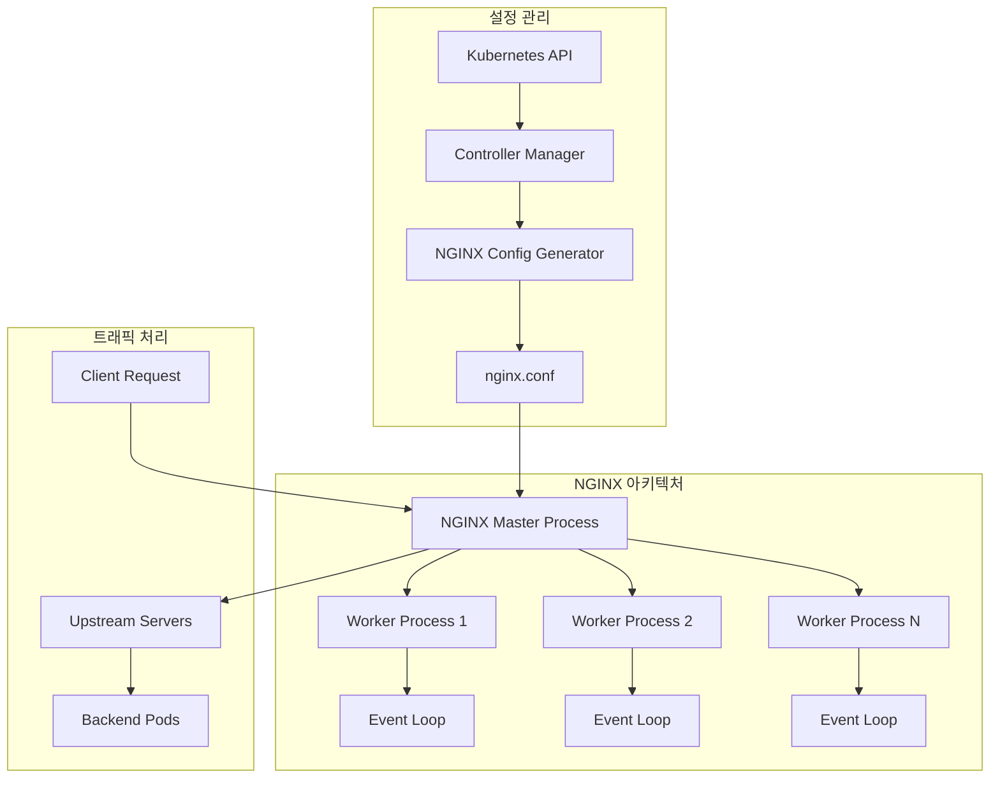
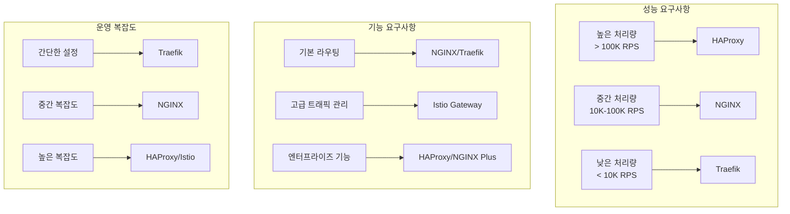

# Session 5: Ingress 컨트롤러 비교 및 선택

## 📍 교과과정에서의 위치
이 세션은 **Week 2 > Day 5 > Session 5**로, Session 4에서 학습한 Ingress 기본 개념을 바탕으로 다양한 Ingress 컨트롤러의 특성과 선택 기준을 분석합니다.

## 학습 목표 (5분)
- **주요 Ingress 컨트롤러** 특성과 **차이점** 완전 이해
- **성능, 기능, 운영** 관점에서 **컨트롤러 비교** 분석
- **환경별 최적 컨트롤러** 선택 기준 수립
- **마이그레이션 전략**과 **운영 고려사항** 파악

## 1. 주요 Ingress 컨트롤러 비교 (20분)

### NGINX Ingress Controller



### 컨트롤러 상세 비교 분석
```
주요 Ingress 컨트롤러 특성 비교:

NGINX Ingress Controller:
   🔹 기본 특성:
      • 가장 널리 사용되는 컨트롤러
      • 높은 성능과 안정성
      • 풍부한 기능과 확장성
      • 강력한 커뮤니티 지원
      • 상업적 지원 (NGINX Plus)
      • 클라우드 네이티브 최적화
   🔹 성능 특성:
      • 높은 처리량 (100K+ RPS)
      • 낮은 지연 시간 (< 1ms)
      • 효율적인 메모리 사용
      • 비동기 이벤트 기반 처리
      • 연결 풀링 및 재사용
      • 동적 업스트림 관리
   🔹 주요 기능:
      • 고급 로드 밸런싱:
         • Round Robin, Least Connections
         • IP Hash, Generic Hash
         • 가중치 기반 분산
         • 헬스 체크 통합
         • 세션 어피니티
         • 장애 조치 자동화
      • SSL/TLS 관리:
         • 자동 인증서 관리
         • Let's Encrypt 통합
         • SNI (Server Name Indication)
         • OCSP Stapling
         • HTTP/2 및 HTTP/3 지원
         • 보안 헤더 자동 설정
      • 고급 라우팅:
      • 정규 표현식 지원
      • 경로 재작성 및 리다이렉션
      • 헤더 기반 라우팅
      • 쿠키 기반 라우팅
      • 지리적 위치 기반 분기
      • A/B 테스트 지원
   🔹 운영 특성:
   🔹 설정 복잡도: 중간
   🔹 디버깅 용이성: 높음
   🔹 모니터링 지원: 우수
   🔹 로깅 기능: 상세
   🔹 업데이트 안정성: 높음
   🔹 문서화 수준: 매우 우수

Traefik Ingress Controller:
   🔹 기본 특성:
      • 클라우드 네이티브 설계
      • 자동 서비스 디스커버리
      • 동적 설정 관리
      • 마이크로서비스 최적화
      • 현대적 아키텍처 패턴
      • 개발자 친화적 인터페이스
   🔹 성능 특성:
      • 중간 수준 처리량 (50K RPS)
      • 낮은 리소스 사용량
      • 빠른 설정 적용
      • 동적 라우팅 최적화
      • 효율적인 메모리 관리
      • Go 언어 기반 성능
   🔹 주요 기능:
      • 자동 서비스 디스커버리:
         • Kubernetes 네이티브 통합
         • 실시간 서비스 감지
         • 동적 엔드포인트 관리
         • 자동 로드 밸런싱
         • 헬스 체크 자동화
         • 장애 서비스 격리
      • 미들웨어 시스템:
         • 인증 및 권한 부여
         • 레이트 리미팅
         • 압축 및 캐싱
         • 요청/응답 변환
         • 보안 헤더 추가
         • 커스텀 미들웨어 지원
      • 대시보드 및 모니터링:
      • 실시간 웹 대시보드
      • 트래픽 시각화
      • 서비스 상태 모니터링
      • 메트릭 수집 및 분석
      • 알림 및 경고 시스템
      • API 기반 관리
   🔹 운영 특성:
   🔹 설정 복잡도: 낮음
   🔹 디버깅 용이성: 높음
   🔹 모니터링 지원: 우수
   🔹 로깅 기능: 상세
   🔹 업데이트 안정성: 높음
   🔹 문서화 수준: 우수

HAProxy Ingress Controller:
   🔹 기본 특성:
      • 엔터프라이즈급 안정성
      • 고성능 로드 밸런싱
      • 정교한 트래픽 제어
      • 금융권 검증된 솔루션
      • 상업적 지원 강화
      • 레거시 시스템 통합
   🔹 성능 특성:
      • 최고 수준 처리량 (200K+ RPS)
      • 극도로 낮은 지연 시간
      • 최적화된 메모리 사용
      • CPU 효율성 극대화
      • 대용량 트래픽 처리
      • 고가용성 보장
   🔹 주요 기능:
      • 고급 로드 밸런싱:
         • 20+ 로드 밸런싱 알고리즘
         • 정교한 헬스 체크
         • 스틱키 세션 관리
         • 서버 가중치 동적 조정
         • 장애 조치 자동화
         • 트래픽 쉐이핑
      • 보안 기능:
         • DDoS 보호
         • 레이트 리미팅
         • IP 화이트리스트/블랙리스트
         • SSL/TLS 최적화
         • 보안 헤더 강화
         • 취약점 보호
      • 모니터링 및 분석:
      • 실시간 통계
      • 상세한 로깅
      • 성능 메트릭
      • 트래픽 분석
      • 용량 계획 지원
      • SLA 모니터링
   🔹 운영 특성:
   🔹 설정 복잡도: 높음
   🔹 디버깅 용이성: 중간
   🔹 모니터링 지원: 매우 우수
   🔹 로깅 기능: 매우 상세
   🔹 업데이트 안정성: 매우 높음
   🔹 문서화 수준: 우수

Istio Gateway:
   🔹 기본 특성:
      • 서비스 메시 통합
      • 마이크로서비스 최적화
      • 고급 트래픽 관리
      • 보안 정책 통합
      • 관찰 가능성 강화
      • 클라우드 네이티브 설계
   🔹 성능 특성:
      • 중간 수준 처리량 (30K RPS)
      • 높은 리소스 사용량
      • 복잡한 설정 오버헤드
      • Envoy 프록시 기반
      • 사이드카 패턴 적용
      • 분산 아키텍처
   🔹 주요 기능:
      • 고급 트래픽 관리:
         • 카나리 배포
         • 블루-그린 배포
         • 트래픽 미러링
         • 서킷 브레이커
         • 재시도 정책
         • 타임아웃 관리
      • 보안 통합:
         • mTLS 자동화
         • 인증 정책
         • 권한 부여 규칙
         • 보안 정책 적용
         • 암호화 통신
         • 감사 로깅
      • 관찰 가능성:
      • 분산 추적
      • 메트릭 수집
      • 로깅 통합
      • 서비스 토폴로지
      • 성능 분석
      • 장애 진단
   🔹 운영 특성:
   🔹 설정 복잡도: 매우 높음
   🔹 디버깅 용이성: 낮음
   🔹 모니터링 지원: 매우 우수
   🔹 로깅 기능: 매우 상세
   🔹 업데이트 안정성: 중간
   🔹 문서화 수준: 우수
```

## 2. 환경별 컨트롤러 선택 기준 (15분)

### 선택 기준 매트릭스



### 컨트롤러 선택 상세 분석
```
Ingress 컨트롤러 선택 기준 매트릭스:

성능 기반 선택:
   🔹 초고성능 요구사항 (> 200K RPS):
      • HAProxy Ingress Controller:
         • 최적화된 C 언어 구현
         • 이벤트 기반 아키텍처
         • 메모리 효율성 극대화
         • CPU 사용률 최소화
         • 대용량 동시 연결 처리
         • 금융권 검증된 안정성
         • 엔터프라이즈 지원 강화
         • 상세한 성능 메트릭 제공
      • NGINX Plus (상용 버전):
         • 상업적 지원 및 보증
         • 고급 로드 밸런싱 알고리즘
         • 실시간 설정 변경
         • 고급 헬스 체크
         • JWT 인증 내장
         • API 게이트웨이 기능
         • 상세한 모니터링 대시보드
         • 24/7 기술 지원
      • 적용 시나리오:
      • 대규모 전자상거래 플랫폼
      • 금융 거래 시스템
      • 실시간 스트리밍 서비스
      • 게임 서버 로드 밸런싱
      • CDN 엣지 서버
      • 미션 크리티컬 애플리케이션
   🔹 고성능 요구사항 (50K-200K RPS):
      • NGINX Ingress Controller:
         • 검증된 안정성과 성능
         • 풍부한 커뮤니티 지원
         • 광범위한 기능 지원
         • 클라우드 네이티브 최적화
         • 자동 SSL 인증서 관리
         • 고급 라우팅 규칙
         • 캐싱 및 압축 지원
         • 상세한 로깅 및 메트릭
      • Envoy Proxy (Istio Gateway):
         • 현대적 프록시 아키텍처
         • HTTP/2 및 gRPC 최적화
         • 고급 트래픽 관리
         • 서비스 메시 통합
         • 관찰 가능성 강화
         • 동적 설정 업데이트
         • 확장 가능한 필터 체인
         • 클라우드 네이티브 설계
      • 적용 시나리오:
      • 마이크로서비스 아키텍처
      • API 게이트웨이
      • 콘텐츠 전송 네트워크
      • 모바일 백엔드 서비스
      • SaaS 플랫폼
      • 클라우드 네이티브 애플리케이션
   🔹 중간 성능 요구사항 (10K-50K RPS):
      • Traefik Ingress Controller:
         • 자동 서비스 디스커버리
         • 동적 설정 관리
         • 직관적인 웹 대시보드
         • Let's Encrypt 자동 통합
         • 미들웨어 기반 확장
         • 클라우드 네이티브 설계
         • 개발자 친화적 설정
         • 빠른 배포 및 설정
      • Kong Ingress Controller:
         • API 게이트웨이 특화
         • 플러그인 생태계
         • 인증 및 권한 부여
         • 레이트 리미팅
         • API 분석 및 모니터링
         • 개발자 포털
         • 상업적 지원
         • 엔터프라이즈 기능
      • 적용 시나리오:
      • 중소규모 웹 애플리케이션
      • 개발 및 테스트 환경
      • 스타트업 서비스
      • API 중심 애플리케이션
      • 프로토타입 및 MVP
      • 교육 및 학습 환경
   🔹 저성능 요구사항 (< 10K RPS):
   🔹 경량 컨트롤러 옵션:
      • Traefik (최소 설정)
      • NGINX (기본 설정)
      • Contour (Envoy 기반)
      • Ambassador (개발자 중심)
      • Gloo (API 게이트웨이)
   🔹 적용 시나리오:
      • 개인 프로젝트
      • 내부 도구 및 대시보드
      • 개발 환경
      • 데모 및 프로토타입
      • 학습 및 실험 환경
   🔹 선택 기준:
   🔹 설정 단순성
   🔹 리소스 사용량
   🔹 학습 곡선
   🔹 커뮤니티 지원
   🔹 문서화 수준

기능 기반 선택:
   🔹 기본 HTTP/HTTPS 라우팅:
      • 모든 컨트롤러 지원
      • 호스트 기반 라우팅
      • 경로 기반 라우팅
      • SSL/TLS 종료
      • 기본 로드 밸런싱
      • 헬스 체크
   🔹 고급 트래픽 관리:
      • Istio Gateway:
         • 카나리 배포
         • 블루-그린 배포
         • 트래픽 미러링
         • 서킷 브레이커
         • 재시도 정책
         • 타임아웃 관리
         • 장애 주입
         • A/B 테스트
      • NGINX Plus:
         • 고급 로드 밸런싱
         • 세션 지속성
         • 동적 업스트림
         • 실시간 설정 변경
         • JWT 인증
         • 레이트 리미팅
         • 캐싱 최적화
         • API 게이트웨이
      • HAProxy:
      • 20+ 로드 밸런싱 알고리즘
      • 정교한 헬스 체크
      • 스틱키 세션
      • 트래픽 쉐이핑
      • 고급 ACL 규칙
      • 실시간 통계
      • 동적 서버 관리
      • 고가용성 설정
   🔹 API 게이트웨이 기능:
      • Kong Ingress:
         • API 키 관리
         • OAuth 2.0 / JWT
         • 레이트 리미팅
         • 요청/응답 변환
         • API 분석
         • 개발자 포털
         • 플러그인 생태계
         • 상업적 지원
      • Ambassador:
         • 개발자 중심 설계
         • 자동 TLS
         • 카나리 배포
         • 레이트 리미팅
         • 인증 통합
         • 분산 추적
         • 그래픽 설정 도구
         • 엣지 스택 통합
      • Gloo:
      • 함수 수준 라우팅
      • GraphQL 지원
      • 서버리스 통합
      • 변환 및 검증
      • 보안 정책
      • 관찰 가능성
      • 하이브리드 클라우드
      • 엔터프라이즈 기능
   🔹 서비스 메시 통합:
   🔹 Istio Gateway:
      • Envoy 프록시 기반
      • mTLS 자동화
      • 트래픽 정책
      • 보안 정책
      • 관찰 가능성
      • 분산 추적
      • 메트릭 수집
      • 로깅 통합
   🔹 Linkerd:
      • 경량 서비스 메시
      • 자동 mTLS
      • 트래픽 분할
      • 실시간 메트릭
      • 간단한 설정
      • 높은 성능
      • 보안 중심
      • 운영 단순성
   🔹 Consul Connect:
   🔹 HashiCorp 생태계
   🔹 서비스 디스커버리
   🔹 설정 관리
   🔹 보안 정책
   🔹 다중 클라우드
   🔹 레거시 통합
   🔹 엔터프라이즈 지원
   🔹 하이브리드 환경

운영 복잡도 기반 선택:
   🔹 낮은 복잡도 (초보자 친화적):
      • Traefik:
         • 자동 서비스 디스커버리
         • 직관적인 라벨 기반 설정
         • 웹 대시보드 제공
         • 자동 SSL 인증서
         • 실시간 설정 업데이트
         • 최소한의 설정 파일
         • 풍부한 문서
         • 활발한 커뮤니티
      • 장점:
         • 빠른 학습 곡선
         • 즉시 사용 가능
         • 자동화된 설정
         • 시각적 모니터링
         • 개발자 친화적
         • 클라우드 네이티브
         • 마이크로서비스 최적화
         • 현대적 아키텍처
      • 단점:
      • 성능 제한
      • 엔터프라이즈 기능 부족
      • 고급 설정 제한
      • 대규모 환경 부적합
      • 상업적 지원 제한
      • 레거시 통합 어려움
   🔹 중간 복잡도 (일반적 선택):
      • NGINX Ingress:
         • 균형잡힌 기능과 성능
         • 풍부한 설정 옵션
         • 어노테이션 기반 설정
         • ConfigMap 활용
         • 모듈식 아키텍처
         • 확장 가능한 설정
         • 커뮤니티 지원
         • 상업적 옵션 제공
      • 장점:
         • 검증된 안정성
         • 광범위한 기능
         • 유연한 설정
         • 좋은 성능
         • 풍부한 문서
         • 대규모 커뮤니티
         • 클라우드 지원
         • 엔터프라이즈 옵션
      • 단점:
      • 설정 복잡성
      • 학습 곡선 존재
      • 디버깅 어려움
      • 설정 파일 관리
      • 업데이트 복잡성
      • 리소스 사용량
   🔹 높은 복잡도 (전문가 수준):
   🔹 HAProxy:
      • 매우 상세한 설정 옵션
      • 복잡한 설정 문법
      • 고급 로드 밸런싱
      • 정교한 헬스 체크
      • 상세한 로깅
      • 실시간 통계
      • 동적 설정 변경
      • 엔터프라이즈 기능
   🔹 Istio Gateway:
      • 서비스 메시 복잡성
      • 다중 컴포넌트 관리
      • 복잡한 설정 구조
      • 높은 리소스 요구사항
      • 전문적 운영 지식 필요
      • 디버깅 복잡성
      • 업그레이드 복잡성
      • 성능 튜닝 어려움
   🔹 장점:
      • 최고 수준 성능
      • 엔터프라이즈 기능
      • 고급 트래픽 관리
      • 상세한 제어
      • 확장성
      • 안정성
      • 상업적 지원
      • 규정 준수
   🔹 단점:
   🔹 높은 학습 곡선
   🔹 복잡한 설정
   🔹 전문 인력 필요
   🔹 높은 운영 비용
   🔹 디버깅 어려움
   🔹 업데이트 위험
   🔹 리소스 집약적
   🔹 벤더 종속성
```

## 3. 실제 환경별 컨트롤러 선택 사례 (8분)

### 환경별 선택 사례 분석
```
실제 환경별 Ingress 컨트롤러 선택 사례:

스타트업 환경:
   🔹 선택: Traefik
   🔹 이유:
      • 빠른 설정 및 배포
      • 자동 서비스 디스커버리
      • 최소한의 운영 오버헤드
      • 무료 SSL 인증서
      • 직관적인 웹 대시보드
      • 개발자 친화적 설정
   🔹 트래픽 특성:
      • 낮은 트래픽 (< 10K RPS)
      • 간단한 라우팅 규칙
      • 빠른 기능 개발 필요
      • 제한된 운영 리소스
   🔹 성공 요인:
   🔹 빠른 MVP 출시
   🔹 운영 비용 절감
   🔹 개발 생산성 향상
   🔹 확장성 확보

중견기업 환경:
   🔹 선택: NGINX Ingress
   🔹 이유:
      • 검증된 안정성
      • 균형잡힌 성능
      • 풍부한 기능
      • 커뮤니티 지원
      • 클라우드 호환성
      • 확장 가능성
   🔹 트래픽 특성:
      • 중간 트래픽 (10K-50K RPS)
      • 복잡한 라우팅 규칙
      • 다중 환경 관리
      • 보안 요구사항
   🔹 성공 요인:
   🔹 안정적인 서비스 제공
   🔹 효율적인 리소스 활용
   🔹 확장성 확보
   🔹 운영 효율성 향상

대기업 환경:
   🔹 선택: HAProxy + NGINX Plus
   🔹 이유:
      • 최고 수준 성능
      • 엔터프라이즈 지원
      • 상세한 제어 기능
      • 규정 준수 지원
      • 24/7 기술 지원
      • SLA 보장
   🔹 트래픽 특성:
      • 높은 트래픽 (> 100K RPS)
      • 복잡한 비즈니스 로직
      • 미션 크리티컬 서비스
      • 글로벌 서비스
   🔹 성공 요인:
   🔹 고가용성 달성
   🔹 성능 최적화
   🔹 보안 강화
   🔹 컴플라이언스 준수

금융권 환경:
   🔹 선택: HAProxy (전용)
   🔹 이유:
      • 금융권 검증된 솔루션
      • 최고 수준 보안
      • 상세한 감사 로깅
      • 규정 준수 지원
      • 상업적 지원
      • 고가용성 보장
   🔹 트래픽 특성:
      • 거래 트래픽 (고신뢰성)
      • 실시간 처리 요구
      • 보안 중요도 최고
      • 규제 준수 필수
   🔹 성공 요인:
   🔹 무중단 서비스
   🔹 보안 사고 방지
   🔹 규제 준수
   🔹 고객 신뢰 확보

마이크로서비스 환경:
   🔹 선택: Istio Gateway
   🔹 이유:
      • 서비스 메시 통합
      • 고급 트래픽 관리
      • 관찰 가능성
      • 보안 정책 통합
      • 카나리 배포 지원
      • 분산 추적
   🔹 트래픽 특성:
      • 복잡한 서비스 간 통신
      • 동적 서비스 토폴로지
      • 빈번한 배포
      • 다양한 프로토콜
   🔹 성공 요인:
   🔹 서비스 간 통신 최적화
   🔹 운영 가시성 확보
   🔹 보안 강화
   🔹 개발 생산성 향상
```

## 4. 마이그레이션 전략 및 운영 고려사항 (7분)

### 컨트롤러 마이그레이션 전략
```
Ingress 컨트롤러 마이그레이션 전략:

사전 평가 단계:
   🔹 현재 상태 분석:
      • 트래픽 패턴 분석:
         • 피크 시간대 트래픽 측정
         • 평균 응답 시간 분석
         • 오류율 및 가용성 측정
         • 동시 연결 수 분석
         • 대역폭 사용량 측정
         • 지역별 트래픽 분포
      • 현재 설정 분석:
         • 라우팅 규칙 복잡도
         • SSL/TLS 설정 현황
         • 로드 밸런싱 알고리즘
         • 헬스 체크 설정
         • 보안 정책 현황
         • 모니터링 설정
      • 성능 벤치마크:
         • 처리량 (RPS) 측정
         • 지연 시간 (P95, P99) 측정
         • 리소스 사용량 분석
         • 확장성 테스트
         • 장애 복구 시간 측정
         • 메모리 및 CPU 사용률
      • 비즈니스 요구사항:
      • SLA 요구사항 정의
      • 보안 요구사항 분석
      • 컴플라이언스 요구사항
      • 예산 및 비용 제약
      • 운영 팀 역량 평가
      • 마이그레이션 일정 제약
   🔹 목표 컨트롤러 선정:
      • 후보 컨트롤러 목록 작성
      • 기능 비교 매트릭스 작성
      • 성능 벤치마크 비교
      • 비용 분석 (TCO)
      • 위험 평가 매트릭스
      • 최종 선정 및 승인
   🔹 마이그레이션 계획 수립:
   🔹 상세 일정 계획
   🔹 리소스 할당 계획
   🔹 위험 완화 계획
   🔹 롤백 계획 수립
   🔹 테스트 계획 작성
   🔹 커뮤니케이션 계획

실행 단계:
   🔹 1단계: 환경 준비 (1-2주):
      • 테스트 환경 구축:
         • 별도 클러스터 또는 네임스페이스
         • 프로덕션과 동일한 설정
         • 모니터링 도구 설치
         • 로깅 시스템 구성
         • 백업 시스템 준비
         • 네트워크 설정 복제
      • 새 컨트롤러 설치:
         • Helm 차트 또는 매니페스트 준비
         • 설정 파일 변환
         • 인증서 및 시크릿 마이그레이션
         • RBAC 권한 설정
         • 네트워크 정책 적용
         • 초기 설정 검증
      • 도구 및 스크립트 준비:
      • 설정 변환 스크립트
      • 트래픽 전환 스크립트
      • 모니터링 대시보드
      • 자동화 테스트 스크립트
      • 롤백 스크립트
      • 헬스 체크 스크립트
   🔹 2단계: 기능 검증 (1-2주):
      • 기본 기능 테스트:
         • HTTP/HTTPS 라우팅 테스트
         • 호스트 기반 라우팅 검증
         • 경로 기반 라우팅 검증
         • SSL/TLS 종료 테스트
         • 로드 밸런싱 동작 확인
         • 헬스 체크 동작 검증
      • 고급 기능 테스트:
         • 인증 및 권한 부여
         • 레이트 리미팅
         • 캐싱 기능
         • 압축 기능
         • 리다이렉션 규칙
         • 커스텀 헤더 처리
      • 성능 테스트:
         • 부하 테스트 (정상 트래픽)
         • 스트레스 테스트 (피크 트래픽)
         • 지연 시간 측정
         • 처리량 측정
         • 리소스 사용량 모니터링
         • 확장성 테스트
      • 장애 시나리오 테스트:
      • 백엔드 서비스 장애
      • 컨트롤러 Pod 장애
      • 노드 장애
      • 네트워크 분할
      • 설정 오류 시나리오
      • 복구 시간 측정
   🔹 3단계: 점진적 전환 (2-4주):
      • 카나리 배포 (5% 트래픽):
         • DNS 가중치 조정
         • 로드 밸런서 설정 변경
         • 실시간 모니터링
         • 오류율 및 지연시간 추적
         • 사용자 피드백 수집
         • 24시간 안정성 확인
      • 단계적 트래픽 증가:
         • 10% → 25% → 50% → 75% → 100%
         • 각 단계별 24-48시간 모니터링
         • 성능 메트릭 비교 분석
         • 오류 로그 분석
         • 사용자 경험 모니터링
         • 비즈니스 메트릭 추적
      • 실시간 모니터링:
         • 응답 시간 모니터링
         • 오류율 추적
         • 처리량 모니터링
         • 리소스 사용량 추적
         • 알림 시스템 활성화
         • 대시보드 실시간 확인
      • 문제 발생 시 대응:
      • 즉시 롤백 절차
      • 근본 원인 분석
      • 문제 해결 및 재시도
      • 이해관계자 커뮤니케이션
      • 사후 분석 보고서
      • 개선 계획 수립
   🔹 4단계: 완료 및 최적화 (1-2주):
   🔹 기존 시스템 정리:
      • 기존 컨트롤러 제거
      • 불필요한 설정 정리
      • 리소스 회수
      • DNS 설정 정리
      • 모니터링 설정 업데이트
      • 백업 데이터 정리
   🔹 성능 최적화:
      • 설정 튜닝
      • 리소스 할당 최적화
      • 캐싱 설정 최적화
      • 로드 밸런싱 알고리즘 조정
      • 헬스 체크 간격 조정
      • 타임아웃 설정 최적화
   🔹 운영 체계 구축:
      • 모니터링 대시보드 구축
      • 알림 규칙 설정
      • 로그 수집 및 분석
      • 백업 및 복구 절차
      • 장애 대응 절차
      • 정기 점검 계획
   🔹 문서화 및 교육:
      • 운영 매뉴얼 작성
      • 트러블슈팅 가이드
      • 설정 변경 절차
      • 팀 교육 실시
      • 지식 공유 세션
      • 베스트 프랙티스 문서화
   🔹 사후 평가:
   🔹 마이그레이션 성과 평가
   🔹 비용 효과 분석
   🔹 성능 개선 측정
   🔹 팀 만족도 조사
   🔹 교훈 정리
   🔹 향후 개선 계획

위험 관리 및 롤백 전략:
   🔹 위험 요소 식별:
      • 기술적 위험:
         • 호환성 문제
         • 성능 저하
         • 기능 누락
         • 설정 오류
         • 보안 취약점
         • 안정성 문제
      • 운영적 위험:
         • 서비스 중단
         • 데이터 손실
         • 사용자 영향
         • 비즈니스 영향
         • 팀 역량 부족
         • 일정 지연
      • 비즈니스 위험:
      • 매출 손실
      • 고객 이탈
      • 브랜드 이미지 손상
      • 규정 위반
      • 경쟁력 저하
      • 투자 손실
   🔹 위험 완화 전략:
      • 기술적 완화:
         • 충분한 테스트
         • 단계적 배포
         • 실시간 모니터링
         • 자동화된 롤백
         • 백업 시스템
         • 전문가 지원
      • 운영적 완화:
         • 상세한 계획 수립
         • 팀 교육 강화
         • 커뮤니케이션 강화
         • 24/7 모니터링
         • 빠른 대응 체계
         • 예비 인력 확보
      • 비즈니스 완화:
      • 이해관계자 사전 동의
      • 비즈니스 연속성 계획
      • 고객 커뮤니케이션
      • 보험 및 보상 계획
      • 대안 시나리오 준비
      • 위기 관리 계획
   🔹 롤백 전략:
   🔹 롤백 트리거 조건:
      • 오류율 임계값 초과
      • 응답 시간 급증
      • 가용성 저하
      • 보안 사고 발생
      • 비즈니스 메트릭 악화
      • 사용자 불만 급증
   🔹 롤백 절차:
      • 즉시 트래픽 전환
      • DNS 설정 복원
      • 로드 밸런서 설정 복원
      • 모니터링 확인
      • 서비스 정상화 확인
      • 이해관계자 통보
   🔹 롤백 후 조치:
      • 근본 원인 분석
      • 문제 해결 계획 수립
      • 재시도 일정 계획
      • 팀 회고 세션
      • 프로세스 개선
      • 문서 업데이트
   🔹 롤백 테스트:
   🔹 정기적 롤백 훈련
   🔹 자동화된 롤백 테스트
   🔹 롤백 시간 측정
   🔹 롤백 절차 검증
   🔹 팀 역량 평가
   🔹 개선 사항 도출
```

## 5. 토론 및 정리 (2분)

### 핵심 키워드
- 컨트롤러 비교: NGINX, Traefik, HAProxy, Istio 특성 분석
- 선택 기준: 성능, 기능, 운영 복잡도 고려
- 마이그레이션: 단계적 전환 전략
- 운영 고려사항: 모니터링, 유지보수, 확장성

### 다음 세션 예고
Session 6에서는 **Kubernetes 스토리지 아키텍처**를 학습하여 **Volume, PV, PVC**의 관계와 **스토리지 클래스** 설계 원칙을 다룹니다.