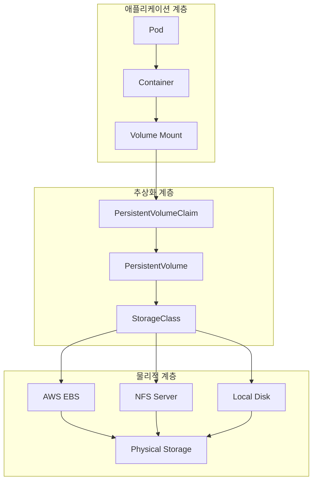
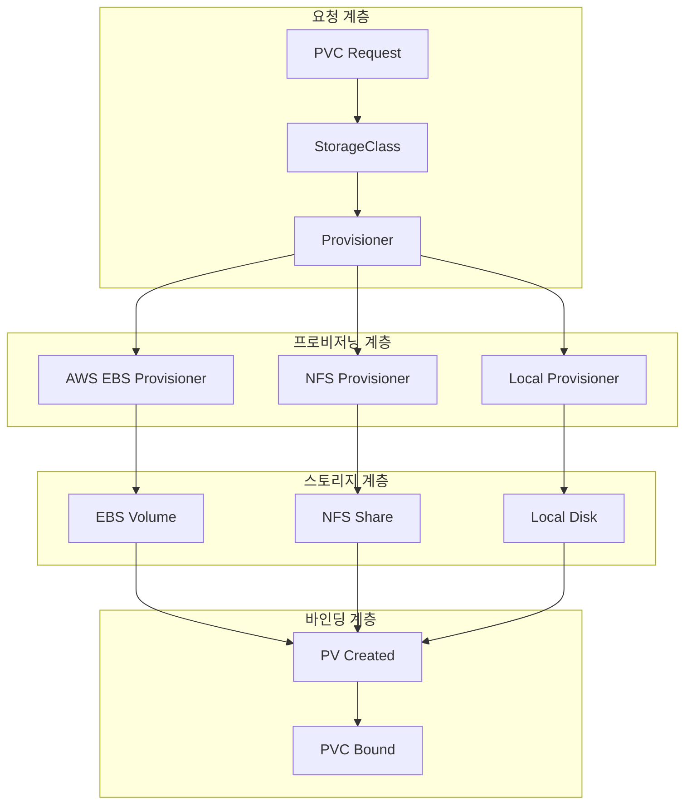

# Session 6: Kubernetes 스토리지 아키텍처

## 📍 교과과정에서의 위치
이 세션은 **Week 2 > Day 5 > Session 6**으로, 네트워킹 학습을 마치고 Kubernetes의 또 다른 핵심 영역인 **스토리지 아키텍처**와 **데이터 영속성** 관리를 학습합니다.

## 학습 목표 (5분)
- **Volume, PV, PVC** 관계와 **스토리지 추상화** 완전 이해
- **스토리지 클래스**와 **동적 프로비저닝** 메커니즘 분석
- **다양한 스토리지 타입**과 **성능 특성** 비교
- **데이터 영속성**과 **백업 전략** 수립 방법 파악

## 1. Volume과 스토리지 추상화 (15분)

### Kubernetes 스토리지 아키텍처



### 스토리지 추상화 상세 분석
```
Kubernetes 스토리지 아키텍처:

Volume 기본 개념:
   🔹 컨테이너 스토리지 한계:
      • 임시적 파일 시스템
      • 컨테이너 재시작 시 데이터 손실
      • 컨테이너 간 데이터 공유 불가
      • 호스트 의존적 스토리지
      • 확장성 및 이식성 제한
      • 백업 및 복구 어려움
   🔹 Volume의 해결책:
      • 데이터 영속성 보장
      • 컨테이너 간 데이터 공유
      • 호스트 독립적 스토리지
      • 다양한 스토리지 백엔드 지원
      • 동적 스토리지 관리
      • 백업 및 복구 지원
   🔹 Volume 타입 분류:
   🔹 임시 Volume:
      • emptyDir: 임시 디렉토리
      • Pod 생명주기와 동일
      • 컨테이너 간 데이터 공유
      • 메모리 기반 옵션
      • 빠른 I/O 성능
      • 캐시 및 임시 파일용
   🔹 호스트 기반 Volume:
      • hostPath: 호스트 디렉토리 마운트
      • 노드별 로컬 스토리지
      • 시스템 파일 접근
      • 로그 수집 용도
      • 보안 위험 존재
      • 이식성 제한
   🔹 네트워크 기반 Volume:
   🔹 NFS, iSCSI, Ceph
   🔹 클라우드 스토리지 (EBS, GCE PD)
   🔹 분산 파일 시스템
   🔹 높은 가용성
   🔹 확장성 및 이식성
   🔹 네트워크 의존성

PersistentVolume (PV) 아키텍처:
   🔹 PV 기본 개념:
      • 클러스터 수준 스토리지 리소스
      • 관리자가 사전 프로비저닝
      • Pod 생명주기와 독립적
      • 재사용 가능한 스토리지
      • 다양한 백엔드 지원
      • 정책 기반 관리
   🔹 PV 생명주기:
      • Available: 사용 가능 상태
      • Bound: PVC에 바인딩됨
      • Released: PVC 삭제됨
      • Failed: 자동 회수 실패
      • Reclaim Policy 적용
      • 상태 전환 자동화
   🔹 PV 속성:
      • Capacity: 스토리지 용량
      • Access Modes: 접근 모드
         • ReadWriteOnce (RWO)
         • ReadOnlyMany (ROX)
         • ReadWriteMany (RWX)
         • ReadWriteOncePod (RWOP)
      • Reclaim Policy:
         • Retain: 수동 회수
         • Delete: 자동 삭제
         • Recycle: 데이터 삭제 후 재사용
      • Storage Class: 스토리지 클래스
      • Mount Options: 마운트 옵션
      • Node Affinity: 노드 선호도
   🔹 PV 타입별 특성:
   🔹 로컬 스토리지:
      • 높은 성능 (낮은 지연시간)
      • 노드 종속성
      • 가용성 제한
      • 백업 복잡성
      • 비용 효율성
   🔹 네트워크 스토리지:
      • 높은 가용성
      • 확장성
      • 이식성
      • 네트워크 지연시간
      • 비용 고려
   🔹 클라우드 스토리지:
   🔹 관리형 서비스
   🔹 자동 백업
   🔹 확장성
   🔹 고가용성
   🔹 클라우드 종속성

PersistentVolumeClaim (PVC) 메커니즘:
   🔹 PVC 기본 개념:
      • 사용자의 스토리지 요청
      • 네임스페이스 스코프
      • Pod에서 Volume으로 사용
      • 추상화된 스토리지 인터페이스
      • 동적 프로비저닝 지원
      • 리소스 할당량 관리
   🔹 PVC 바인딩 과정:
      • PVC 생성 및 요청
      • 적합한 PV 검색
      • 용량 및 접근 모드 매칭
      • 스토리지 클래스 확인
      • 바인딩 수행
      • Pod에서 사용 가능
   🔹 동적 프로비저닝:
      • StorageClass 기반 자동 생성
      • 요청 시점 PV 생성
      • 클라우드 API 연동
      • 자동 설정 적용
      • 비용 최적화
      • 운영 효율성 향상
   🔹 PVC 사용 패턴:
   🔹 단일 Pod 전용 (RWO)
   🔹 다중 Pod 읽기 전용 (ROX)
   🔹 다중 Pod 읽기/쓰기 (RWX)
   🔹 단일 Pod 독점 (RWOP)
   🔹 임시 스토리지 (ephemeral)
   🔹 스냅샷 및 복제
```

## 2. StorageClass와 동적 프로비저닝 (12분)

### StorageClass 아키텍처



### StorageClass 상세 분석
```
StorageClass 동적 프로비저닝 아키텍처:

StorageClass 핵심 개념:
   🔹 스토리지 추상화 템플릿:
      • 스토리지 타입 정의
      • 성능 특성 명시
      • 프로비저너 지정
      • 매개변수 설정
      • 회수 정책 정의
      • 볼륨 바인딩 모드
   🔹 동적 프로비저닝 워크플로우:
      • PVC 생성 요청 수신
      • StorageClass 매칭
      • 프로비저너 호출
      • 백엔드 스토리지 생성
      • PV 객체 생성
      • PVC-PV 바인딩
      • Pod에서 사용 가능
   🔹 정적 vs 동적 프로비저닝:
      • 정적 프로비저닝:
         • 관리자가 사전에 PV 생성
         • 고정된 스토리지 풀
         • 수동 관리 필요
         • 리소스 낭비 가능성
         • 확장성 제한
         • 운영 오버헤드 증가
      • 동적 프로비저닝:
      • 요청 시점에 자동 생성
      • 필요한 만큼만 할당
      • 자동화된 관리
      • 리소스 효율성
      • 무제한 확장성
      • 운영 효율성 향상
   🔹 StorageClass 매개변수:
   🔹 공통 매개변수:
      • provisioner: 프로비저너 지정
      • parameters: 백엔드별 설정
      • reclaimPolicy: 회수 정책
      • allowVolumeExpansion: 볼륨 확장 허용
      • mountOptions: 마운트 옵션
      • volumeBindingMode: 바인딩 모드
   🔹 볼륨 바인딩 모드:
      • Immediate: 즉시 바인딩
         • PVC 생성 즉시 PV 생성
         • 빠른 바인딩
         • 노드 위치 고려 안함
         • 스케줄링 제약 가능
         • 기본 모드
      • WaitForFirstConsumer: 지연 바인딩
      • Pod 스케줄링 후 PV 생성
      • 노드 위치 고려
      • 최적 배치 보장
      • 로컬 스토리지 최적화
      • 토폴로지 인식
   🔹 회수 정책:
   🔹 Delete (기본값):
      • PVC 삭제 시 PV도 삭제
      • 백엔드 스토리지도 삭제
      • 데이터 완전 제거
      • 비용 절약
      • 데이터 손실 위험
   🔹 Retain:
      • PVC 삭제 시 PV 유지
      • 백엔드 스토리지 유지
      • 수동 정리 필요
      • 데이터 보호
      • 비용 지속 발생
   🔹 Recycle (deprecated):
   🔹 데이터 삭제 후 재사용
   🔹 보안 위험 존재
   🔹 사용 권장 안함
   🔹 Delete 사용 권장

프로비저너별 상세 분석:
   🔹 클라우드 네이티브 프로비저너:
      • AWS EBS CSI Driver:
         • 지원 볼륨 타입:
│   │   │   ├── gp3 (General Purpose SSD v3)
│   │   │   ├── gp2 (General Purpose SSD v2)
│   │   │   ├── io1/io2 (Provisioned IOPS SSD)
│   │   │   ├── st1 (Throughput Optimized HDD)
│   │   │   ├── sc1 (Cold HDD)
│   │   │   └── standard (Magnetic)
         • 주요 매개변수:
│   │   │   ├── type: 볼륨 타입 지정
│   │   │   ├── iops: IOPS 설정 (io1/io2)
│   │   │   ├── throughput: 처리량 설정 (gp3)
│   │   │   ├── encrypted: 암호화 설정
│   │   │   ├── kmsKeyId: KMS 키 지정
│   │   │   └── fsType: 파일시스템 타입
         • 성능 특성:
│   │   │   ├── gp3: 3,000-16,000 IOPS, 125-1,000 MB/s
│   │   │   ├── io2: 최대 64,000 IOPS, 1,000 MB/s
│   │   │   ├── 99.999% 가용성 (io2)
│   │   │   ├── 자동 백업 지원
│   │   │   └── 스냅샷 기능
         • 고급 기능:
│   │   │   ├── 볼륨 확장 지원
│   │   │   ├── 스냅샷 및 복원
│   │   │   ├── 암호화 at Rest
│   │   │   ├── 다중 AZ 지원
│   │   │   ├── 태깅 지원
│   │   │   └── 모니터링 통합
         • 사용 사례:
         • 데이터베이스 워크로드
         • 파일 시스템
         • 로그 저장소
         • 백업 스토리지
         • 일반적인 애플리케이션
      • Azure Disk CSI Driver:
         • 지원 디스크 타입:
│   │   │   ├── Premium SSD (P4-P80)
│   │   │   ├── Standard SSD (E4-E80)
│   │   │   ├── Standard HDD (S4-S80)
│   │   │   └── Ultra Disk
         • 주요 매개변수:
│   │   │   ├── skuName: 디스크 타입
│   │   │   ├── cachingMode: 캐싱 모드
│   │   │   ├── diskEncryptionSetID: 암호화 설정
│   │   │   ├── networkAccessPolicy: 네트워크 접근 정책
│   │   │   └── diskAccessID: 디스크 접근 ID
         • 성능 특성:
│   │   │   ├── Premium SSD: 최대 20,000 IOPS
│   │   │   ├── Ultra Disk: 최대 160,000 IOPS
│   │   │   ├── 지역별 복제 지원
│   │   │   └── 자동 백업
         • 고급 기능:
         • 디스크 암호화
         • 스냅샷 관리
         • 지역 간 복제
         • 공유 디스크 지원
         • 성능 계층 조정
      • GCE Persistent Disk CSI:
      • 지원 디스크 타입:
         • pd-standard (HDD)
         • pd-ssd (SSD)
         • pd-balanced (Balanced SSD)
         • pd-extreme (Extreme SSD)
      • 주요 매개변수:
         • type: 디스크 타입
         • replication-type: 복제 타입
         • provisioned-iops-on-create: IOPS 설정
         • disk-encryption-key: 암호화 키
      • 성능 특성:
         • pd-extreme: 최대 100,000 IOPS
         • 지역 영구 디스크 지원
         • 자동 암호화
         • 스냅샷 스케줄링
      • 고급 기능:
      • 리전 영구 디스크
      • 스냅샷 체인 관리
      • 암호화 키 관리
      • 성능 모니터링
      • 자동 백업
   🔹 네트워크 스토리지 프로비저너:
      • NFS Subdir External Provisioner:
         • 기본 개념:
│   │   │   ├── 기존 NFS 서버 활용
│   │   │   ├── 서브디렉토리 기반 PV 생성
│   │   │   ├── 경제적인 스토리지 솔루션
│   │   │   ├── 간단한 설정
│   │   │   └── 레거시 시스템 통합
         • 주요 매개변수:
│   │   │   ├── server: NFS 서버 주소
│   │   │   ├── path: 기본 경로
│   │   │   ├── onDelete: 삭제 정책
│   │   │   ├── pathPattern: 경로 패턴
│   │   │   └── accessModes: 접근 모드
         • 장점:
│   │   │   ├── ReadWriteMany 지원
│   │   │   ├── 다중 Pod 동시 접근
│   │   │   ├── 기존 인프라 활용
│   │   │   ├── 비용 효율적
│   │   │   ├── 간단한 백업
│   │   │   └── 확장성
         • 단점:
│   │   │   ├── 네트워크 의존성
│   │   │   ├── 성능 제한
│   │   │   ├── 단일 장애점
│   │   │   ├── 보안 고려사항
│   │   │   └── 일관성 문제 가능
         • 사용 사례:
         • 공유 파일 시스템
         • 로그 수집
         • 설정 파일 공유
         • 미디어 파일 저장
         • 개발 환경
      • Ceph RBD Provisioner:
         • 기본 개념:
│   │   │   ├── 분산 블록 스토리지
│   │   │   ├── 고가용성 보장
│   │   │   ├── 자동 복제
│   │   │   ├── 확장성
│   │   │   └── 오픈소스 솔루션
         • 주요 매개변수:
│   │   │   ├── monitors: Ceph 모니터 주소
│   │   │   ├── pool: 스토리지 풀
│   │   │   ├── imageFormat: 이미지 포맷
│   │   │   ├── imageFeatures: 이미지 기능
│   │   │   └── fsType: 파일시스템 타입
         • 고급 기능:
│   │   │   ├── 스냅샷 지원
│   │   │   ├── 클론 기능
│   │   │   ├── 씬 프로비저닝
│   │   │   ├── 압축 지원
│   │   │   ├── 암호화 지원
│   │   │   └── QoS 제어
         • 성능 특성:
         • 높은 IOPS
         • 낮은 지연시간
         • 선형 확장성
         • 자동 복구
         • 로드 밸런싱
      • GlusterFS Provisioner:
      • 기본 개념:
         • 분산 파일 시스템
         • 스케일아웃 아키텍처
         • 고가용성
         • 자동 복제
         • POSIX 호환
      • 볼륨 타입:
         • Distributed: 분산 볼륨
         • Replicated: 복제 볼륨
         • Striped: 스트라이프 볼륨
         • Distributed-Replicated: 분산-복제
      • 주요 매개변수:
         • resturl: REST API URL
         • restuser: 인증 사용자
         • secretName: 인증 시크릿
         • secretNamespace: 시크릿 네임스페이스
         • volumetype: 볼륨 타입
      • 사용 사례:
      • 빅데이터 분석
      • 미디어 스트리밍
      • 백업 스토리지
      • 아카이브 시스템
      • 콘텐츠 배포
   🔹 로컬 스토리지 프로비저너:
   🔹 Local Path Provisioner:
      • 기본 개념:
         • 노드 로컬 디스크 활용
         • 높은 성능
         • 낮은 지연시간
         • 비용 효율적
         • 간단한 설정
      • 주요 매개변수:
         • nodePath: 노드 경로
         • nodePathMap: 노드별 경로 매핑
         • storageClass: 스토리지 클래스
      • 장점:
         • 최고 성능
         • 네트워크 독립적
         • 비용 효율적
         • 간단한 관리
         • 빠른 I/O
      • 단점:
         • 노드 종속성
         • 가용성 제한
         • 백업 복잡성
         • 확장성 제한
         • 데이터 이동 어려움
      • 사용 사례:
      • 데이터베이스 (고성능)
      • 캐시 시스템
      • 임시 데이터 처리
      • 로그 수집
      • 개발/테스트 환경
   🔹 OpenEBS LocalPV:
      • 기본 개념:
         • 클라우드 네이티브 스토리지
         • 컨테이너 네이티브
         • 다양한 백엔드 지원
         • 고급 기능 제공
         • 엔터프라이즈 기능
      • 지원 백엔드:
         • Hostpath: 호스트 경로
         • Device: 블록 디바이스
         • ZFS: ZFS 파일시스템
         • LVM: LVM 볼륨
         • Rawfile: 원시 파일
      • 고급 기능:
         • 스냅샷 지원
         • 클론 기능
         • 백업 및 복원
         • 모니터링 통합
         • 성능 분석
         • 자동 프로비저닝
      • 엔터프라이즈 기능:
      • 데이터 보호
      • 재해 복구
      • 성능 최적화
      • 용량 관리
      • 정책 기반 관리
      • 멀티 클라우드 지원
   🔹 Longhorn:
   🔹 기본 개념:
      • 분산 블록 스토리지
      • 클라우드 네이티브
      • 고가용성
      • 자동 백업
      • 웹 UI 제공
   🔹 주요 기능:
      • 자동 복제
      • 스냅샷 관리
      • 백업 스케줄링
      • 재해 복구
      • 볼륨 확장
      • 성능 모니터링
   🔹 아키텍처:
      • Longhorn Manager: 관리 컴포넌트
      • Longhorn Engine: 볼륨 엔진
      • Longhorn Instance Manager: 인스턴스 관리
      • Longhorn Share Manager: 공유 관리
      • Longhorn UI: 웹 인터페이스
   🔹 사용 사례:
   🔹 스테이트풀 애플리케이션
   🔹 데이터베이스
   🔹 파일 서버
   🔹 백업 시스템
   🔹 개발 환경
```

## 3. 스토리지 성능 및 최적화 (10분)

### 성능 특성 비교
```
스토리지 타입별 성능 및 비용 분석:

로컬 스토리지 성능 분석:
   🔹 성능 메트릭:
      • IOPS: 100K-1M+ (디스크 타입에 따라)
         • NVMe SSD: 500K-1M IOPS
         • SATA SSD: 100K-200K IOPS
         • NVMe M.2: 800K-1.2M IOPS
         • HDD: 100-200 IOPS
      • 지연시간: 0.1-1ms
         • NVMe: 0.1-0.2ms
         • SATA SSD: 0.5-1ms
         • M.2 NVMe: 0.05-0.1ms
         • HDD: 5-10ms
      • 대역폭: 1-7 GB/s
         • NVMe Gen4: 7 GB/s
         • NVMe Gen3: 3.5 GB/s
         • SATA SSD: 600 MB/s
         • HDD: 150-250 MB/s
      • 동시 연결: 제한 없음
   🔹 장점:
      • 최고 성능 달성
      • 네트워크 독립성
      • 예측 가능한 성능
      • 낮은 비용 (CAPEX)
      • 직접 하드웨어 제어
      • 지연시간 최소화
   🔹 단점:
      • 단일 장애점 (SPOF)
      • 노드 종속성
      • 백업 복잡성
      • 재해 복구 어려움
      • 확장성 제한
      • 데이터 이동 어려움
   🔹 사용 사례:
      • 고성능 데이터베이스
      • 인메모리 캐시 (Redis)
      • 실시간 분석 시스템
      • 로그 수집 및 처리
      • 비디오/오디오 편집
      • 게임 서버
      • 비디오 스트리밍
      • 고빈도 거래 시스템
   🔹 비용 구조:
   🔹 초기 투자: 높음 (CAPEX)
   🔹 운영 비용: 낮음 (OPEX)
   🔹 전력 비용: 중간
   🔹 냉각 비용: 중간
   🔹 유지보수: 낮음
   🔹 교체 비용: 예측 가능

네트워크 스토리지 성능 분석:
   🔹 성능 메트릭:
      • IOPS: 10K-100K (네트워크 및 백엔드에 따라)
         • 10GbE NFS: 50K-80K IOPS
         • 25GbE NFS: 100K-150K IOPS
         • iSCSI SAN: 80K-120K IOPS
         • Ceph RBD: 30K-60K IOPS
         • GlusterFS: 20K-40K IOPS
      • 지연시간: 1-10ms
         • 로컬 네트워크: 1-3ms
         • 데이터센터 내: 2-5ms
         • 지역 간: 5-10ms
         • 인터넷: 10-50ms
         • 네트워크 혼잡: +20-100ms
      • 대역폭: 100MB/s - 10GB/s
         • 1GbE: 100-120 MB/s
         • 10GbE: 1-1.2 GB/s
         • 25GbE: 2.5-3 GB/s
         • 40GbE: 4-5 GB/s
         • 100GbE: 10-12 GB/s
      • 동시 연결: 네트워크 대역폭에 따라 제한
   🔹 장점:
      • 고가용성 (분산 아키텍처)
      • 확장성 (수평 확장)
      • 데이터 공유 (RWX 지원)
      • 중앙화된 관리
      • 자동 백업
      • 스냅샷 기능
      • 재해 복구 지원
      • 지역 간 복제
   🔹 단점:
      • 네트워크 의존성
      • 네트워크 지연시간
      • 대역폭 제한
      • 복잡한 설정
      • 네트워크 장애 영향
      • 보안 고려사항
      • 성능 예측 어려움
   🔹 사용 사례:
      • 공유 파일 시스템
      • 콘텐츠 관리 시스템
      • 백업 및 아카이브
      • 빅데이터 분석
      • 미디어 스트리밍
      • 개발 환경
      • CI/CD 파이프라인
      • 로그 수집 시스템
   🔹 비용 구조:
   🔹 초기 투자: 중간 (CAPEX)
   🔹 운영 비용: 중간 (OPEX)
   🔹 네트워크 비용: 높음
   🔹 전력 비용: 높음
   🔹 유지보수: 중간
   🔹 전문 인력: 필요

클라우드 스토리지 성능 분석:
   🔹 AWS EBS 성능:
      • gp3: 3,000-16,000 IOPS, 125-1,000 MB/s
      • io2: 100-64,000 IOPS, 1,000 MB/s
      • io2 Block Express: 256,000 IOPS, 4,000 MB/s
      • st1: 500 IOPS, 500 MB/s
      • sc1: 250 IOPS, 250 MB/s
      • 지연시간: 5-20ms (네트워크 + 서비스)
   🔹 Azure Disk 성능:
      • Premium SSD: 120-20,000 IOPS, 25-900 MB/s
      • Ultra Disk: 300-160,000 IOPS, 2,000 MB/s
      • Standard SSD: 120-6,000 IOPS, 25-750 MB/s
      • Standard HDD: 60-2,000 IOPS, 60-500 MB/s
      • 지연시간: 3-15ms
   🔹 GCP Persistent Disk 성능:
      • pd-extreme: 100,000 IOPS, 2,400 MB/s
      • pd-ssd: 30,000 IOPS, 1,200 MB/s
      • pd-balanced: 15,000 IOPS, 1,200 MB/s
      • pd-standard: 7,500 IOPS, 1,200 MB/s
      • 지연시간: 2-10ms
   🔹 장점:
      • 관리형 서비스
      • 자동 백업
      • 스냅샷 기능
      • 암호화 지원
      • 지역 간 복제
      • 성능 조정 가능
      • 모니터링 통합
      • SLA 보장
      • 전역 가용성
   🔹 단점:
      • 높은 비용
      • 벤더 종속성
      • 데이터 주권 문제
      • 네트워크 지연시간
      • 지역별 제한
      • 비용 예측 어려움
      • 서비스 종료 위험
   🔹 사용 사례:
      • 엔터프라이즈 애플리케이션
      • 데이터베이스 워크로드
      • 빅데이터 분석
      • 웹 애플리케이션
      • 모바일 백엔드
      • IoT 데이터 수집
      • 맨신러닝 워크로드
      • 콘텐츠 전송 네트워크
   🔹 비용 구조:
   🔹 초기 투자: 낮음 (CAPEX)
   🔹 운영 비용: 높음 (OPEX)
   🔹 사용량 기반 과금
   🔹 데이터 전송 비용
   🔹 예비 용량 비용
   🔹 스냅샷 저장 비용
   🔹 지역 간 복제 비용

성능 최적화 전략:
   🔹 워크로드 분석 기반 선택:
      • OLTP 워크로드:
         • 높은 IOPS 요구
         • 낮은 지연시간 필수
         • 예측 가능한 성능
         • 추천: 로컬 SSD, io2
         • 비추천: 네트워크 스토리지
      • OLAP 워크로드:
         • 높은 대역폭 요구
         • 순차 읽기 성능
         • 대용량 저장소
         • 추천: st1, pd-standard
         • 비추천: 고가 SSD
      • 스트리밍 워크로드:
         • 지속적인 대역폭
         • 낮은 지연시간 변동
         • 높은 가용성
         • 추천: 네트워크 스토리지
         • 비추천: 로컬 스토리지
      • 백업 워크로드:
      • 비용 효율성
      • 대용량 저장
      • 낮은 성능 요구
      • 추천: sc1, Standard HDD
      • 비추천: 고성능 SSD
   🔹 성능 벤치마크 및 테스트:
      • 성능 측정 도구:
         • fio: 유연한 I/O 테스트
         • dd: 간단한 순차 테스트
         • iozone: 종합 성능 테스트
         • sysbench: 데이터베이스 테스트
         • Kubernetes 내장 메트릭
      • 테스트 시나리오:
         • 랜덤 읽기/쓰기 (4K 블록)
         • 순차 읽기/쓰기 (1M 블록)
         • 혼합 워크로드 (70% 읽기)
         • 동시 연결 테스트
         • 지연시간 측정
         • 장시간 안정성 테스트
      • 성능 모니터링:
      • Prometheus + Grafana
      • 클라우드 네이티브 모니터링
      • 실시간 성능 대시보드
      • 알림 및 임계값 설정
      • 성능 동향 분석
      • 용량 계획 지원
   🔹 비용 최적화 전략:
   🔹 스토리지 계층화:
      • Hot Data: 고성능 SSD
      • Warm Data: 일반 SSD
      • Cold Data: HDD 또는 아카이브
      • 자동 계층 이동
      • 생명주기 기반 관리
   🔹 동적 프로비저닝 활용:
      • 요청 시점 할당
      • 사용량 기반 스케일링
      • 자동 정리 정책
      • 리소스 풀링
   🔹 압축 및 중복 제거:
      • 데이터 압축 알고리즘
      • 중복 데이터 제거
      • 씬 프로비저닝
      • 인라인 압축
   🔹 예약 인스턴스 활용:
   🔹 예측 가능한 워크로드
   🔹 장기 약정 할인
   🔹 스팟 인스턴스 활용
   🔹 비용 모니터링 및 최적화
```

## 4. 데이터 백업 및 복구 전략 (8분)

### 백업 전략
```
Kubernetes 스토리지 백업 및 복구 전략:

볼륨 스냅샷 기반 백업:
   🔹 CSI 스냅샷 아키텍처:
      • VolumeSnapshot 리소스:
         • 스냅샷 생성 요청
         • 소스 PVC 지정
         • VolumeSnapshotClass 연결
         • 스냅샷 메타데이터
         • 상태 추적 및 관리
      • VolumeSnapshotClass:
         • 스냅샷 정책 정의
         • CSI 드라이버 지정
         • 스냅샷 매개변수
         • 보존 정책
         • 암호화 설정
         • 스케줄링 정책
      • VolumeSnapshotContent:
         • 실제 스냅샷 데이터
         • 백엔드 스토리지 연결
         • 스냅샷 핸들 관리
         • 용량 정보
         • 생성 시간 기록
         • 소스 볼륨 정보
      • 스냅샷 복원 프로세스:
      • 스냅샷에서 PVC 생성
      • 데이터 복원 및 검증
      • 애플리케이션 재시작
      • 일관성 검사
      • 성능 검증
      • 비즈니스 연속성 확인
   🔹 스냅샷 전략 및 정책:
      • 스케줄링 전략:
         • 시간 기반 스케줄링:
│   │   │   ├── 일일 스냅샷 (24시간 주기)
│   │   │   ├── 주간 스냅샷 (7일 주기)
│   │   │   ├── 월간 스냅샷 (30일 주기)
│   │   │   ├── 연간 스냅샷 (365일 주기)
│   │   │   └── 이벤트 기반 스냅샷
         • 보존 정책:
│   │   │   ├── 3-2-1 백업 규칙
│   │   │   ├── 지역별 복제
│   │   │   ├── 오프라인 백업
│   │   │   ├── 암호화 저장
│   │   │   └── 수명주기 관리
         • 자동화 도구:
         • CronJob 기반 스케줄링
         • Kubernetes Operators
         • Helm Charts 활용
         • GitOps 워크플로우
         • 모니터링 및 알림
      • 성능 최적화:
         • 증분 스냅샷:
│   │   │   ├── 변경된 블록만 백업
│   │   │   ├── 저장 공간 효율성
│   │   │   ├── 빠른 백업 속도
│   │   │   ├── 네트워크 대역폭 절약
│   │   │   └── 비용 절감
         • 압축 및 중복제거:
│   │   │   ├── 데이터 압축 알고리즘
│   │   │   ├── 중복 데이터 제거
│   │   │   ├── 저장 공간 최적화
│   │   │   └── 전송 속도 향상
         • 병렬 처리:
         • 다중 스냅샷 동시 생성
         • 네트워크 대역폭 활용
         • I/O 병목 현상 방지
         • 리소스 최적 활용
      • 보안 및 암호화:
      • 전송 중 암호화:
         • TLS/SSL 프로토콜
         • VPN 터널링
         • 인증서 기반 보안
         • 네트워크 세분화
      • 저장 중 암호화:
         • AES-256 암호화
         • 키 관리 시스템 (KMS)
         • 하드웨어 보안 모듈
         • 암호화 키 순환
      • 접근 제어:
      • RBAC 기반 권한 관리
      • 네트워크 정책 적용
      • 감사 로깅
      • 이상 행위 탐지
      • 정기적 보안 검토
   🔹 클러스터 수준 백업 도구:
   🔹 Velero (VMware Tanzu):
      • 기본 기능:
         • 전체 클러스터 백업
         • 네임스페이스 단위 백업
         • 리소스 선택적 백업
         • 스케줄링 백업
         • 증분 백업
         • 재해 복구
      • 지원 스토리지:
         • AWS S3
         • Azure Blob Storage
         • Google Cloud Storage
         • MinIO
         • 로컬 파일시스템
         • NFS
      • 고급 기능:
         • 훅 및 플러그인 시스템
         • 애플리케이션 일관성 보장
         • 다중 클러스터 복원
         • 암호화 지원
         • 압축 및 중복제거
         • 복원 검증
      • 사용 사례:
      • 재해 복구 계획
      • 클러스터 마이그레이션
      • 개발/테스트 환경 복제
      • 컴플라이언스 백업
      • 데이터 보호 및 보안
   🔹 Kasten K10 (Veeam):
      • 기본 기능:
         • 엔터프라이즈급 백업
         • 애플리케이션 중심 백업
         • 정책 기반 자동화
         • 데이터 이동성 보장
         • 실시간 모니터링
         • 웹 UI 및 API
      • 고급 기능:
         • 데이터 변환 및 마이그레이션
         • 다중 클라우드 지원
         • 재해 복구 오케스트레이션
         • 성능 최적화
         • 보안 및 컴플라이언스
         • 비용 최적화
      • 사용 사례:
      • 엔터프라이즈 데이터 보호
      • 규제 준수 백업
      • 데이터베이스 복원
      • 애플리케이션 마이그레이션
      • 비즈니스 연속성 계획
   🔹 Portworx PX-Backup:
      • 기본 기능:
         • 컨테이너 네이티브 백업
         • 스토리지 인식 백업
         • 애플리케이션 일관성
         • 자동 스케줄링
         • 증분 백업
         • 지역 간 복제
      • Portworx 통합:
         • 네이티브 스토리지 통합
         • 고성능 스냅샷
         • 자동 스토리지 관리
         • 데이터 지역성 보장
         • 성능 최적화
      • 사용 사례:
      • 스테이트풀 애플리케이션
      • 데이터베이스 클러스터
      • 고성능 워크로드
      • 엣지 컴퓨팅
      • 하이브리드 클라우드
   🔹 백업 전략 선택 가이드:
   🔹 비즈니스 요구사항 기반:
      • RTO (Recovery Time Objective)
      • RPO (Recovery Point Objective)
      • 데이터 중요도 분류
      • 컴플라이언스 요구사항
      • 비용 예산
   🔹 기술적 요구사항:
      • 데이터 용량 및 성장률
      • 네트워크 대역폭
      • 스토리지 성능
      • 보안 요구사항
      • 통합 복잡도
   🔹 운영 요구사항:
      • 자동화 수준
      • 모니터링 및 알림
      • 운영 팀 역량
      • 지원 체계
      • 문서화 수준
   🔹 비용 고려사항:
   🔹 초기 구축 비용
   🔹 운영 비용 (OPEX)
   🔹 스토리지 비용
   🔹 네트워크 비용
   🔹 라이선스 비용
   🔹 전문 인력 비용
```

## 5. 토론 및 정리 (2분)

### 핵심 키워드
- **스토리지 추상화**: Volume, PV, PVC 관계
- **동적 프로비저닝**: StorageClass 기반 자동화
- **성능 최적화**: 스토리지 타입별 특성 활용
- **데이터 보호**: 백업 및 복구 전략

### 다음 세션 예고
Session 7에서는 **ConfigMap과 Secret 관리**를 학습하여 **설정 데이터**와 **민감 정보** 관리 방법을 다룹니다.