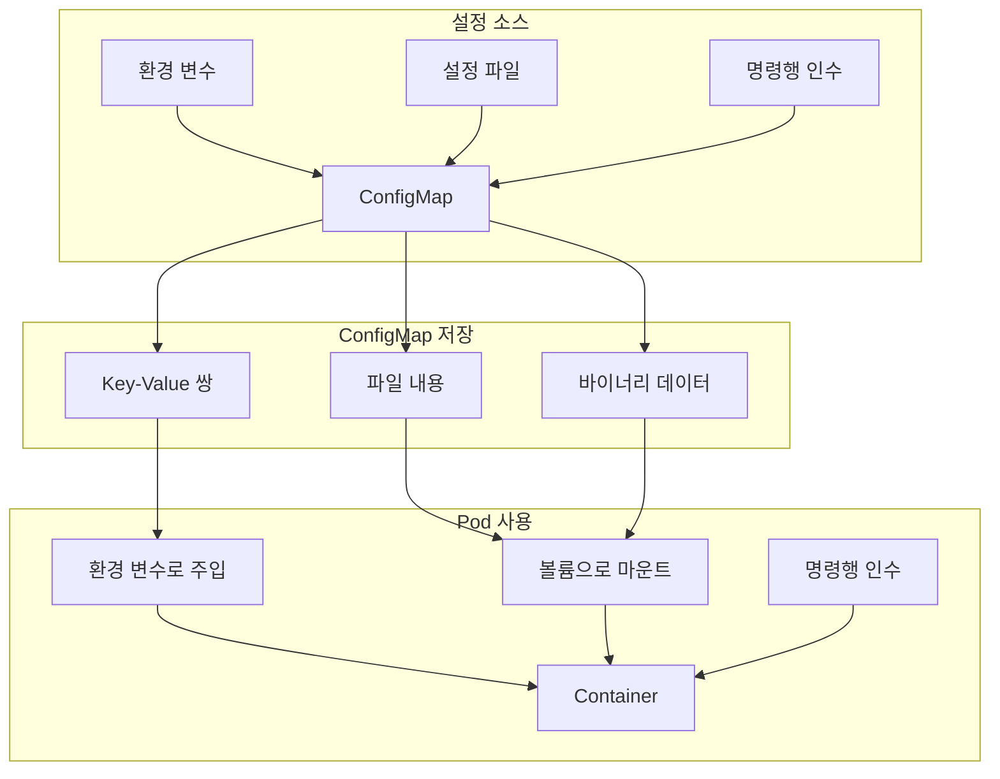
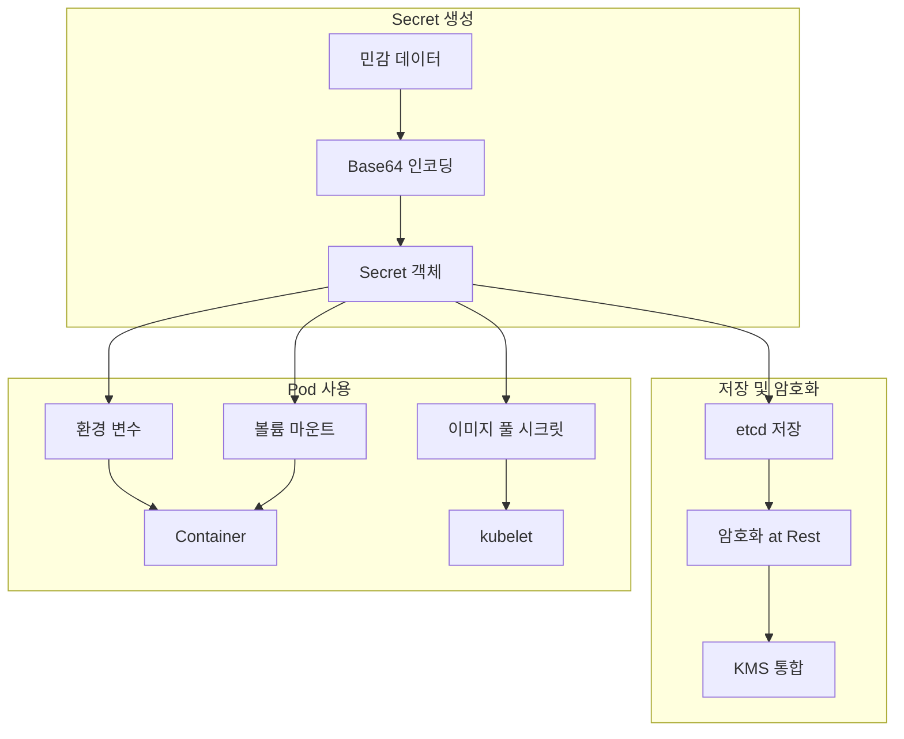
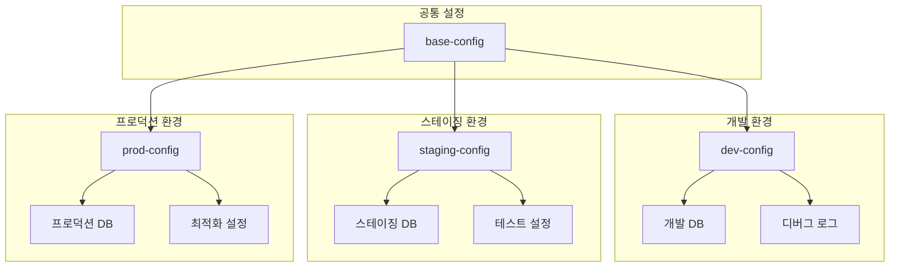

# Session 7: ConfigMap과 Secret 관리

## 📍 교과과정에서의 위치
이 세션은 **Week 2 > Day 5 > Session 7**로, 스토리지 학습 후 애플리케이션 **설정 관리**와 **민감 정보 보호**를 위한 ConfigMap과 Secret 활용 방법을 학습합니다.

## 학습 목표 (5분)
- **ConfigMap**과 **Secret**의 **차이점**과 **사용 목적** 완전 이해
- **설정 데이터 분리**와 **12-Factor App** 원칙 적용
- **민감 정보 보안**과 **암호화** 메커니즘 분석
- **설정 관리 모범 사례**와 **운영 전략** 수립

## 1. ConfigMap 아키텍처와 활용 (15분)

### ConfigMap 구조와 사용 패턴



### ConfigMap 상세 분석
```
ConfigMap 설정 관리 아키텍처:

ConfigMap 기본 개념:
├── 설정 데이터와 코드 분리
├── 12-Factor App 원칙 준수
├── 환경별 설정 관리
├── 런타임 설정 변경
├── 네임스페이스 스코프
└── 키-값 쌍 저장

ConfigMap 데이터 타입:
├── 단순 키-값 쌍:
│   ├── 환경 변수 형태
│   ├── 애플리케이션 매개변수
│   ├── 기능 플래그
│   ├── API 엔드포인트
│   ├── 타임아웃 설정
│   └── 로그 레벨 설정
├── 설정 파일:
│   ├── application.properties
│   ├── config.yaml
│   ├── nginx.conf
│   ├── database.ini
│   ├── logging.xml
│   └── 커스텀 설정 파일
└── 바이너리 데이터:
    ├── 인증서 파일
    ├── 키 파일
    ├── 이미지 파일
    ├── 압축 파일
    └── 실행 파일

ConfigMap 사용 패턴 및 베스트 프랙티스:
├── 환경 변수 주입 패턴:
│   ├── 전체 ConfigMap 주입 (envFrom):
│   │   ├── 모든 키-값 쌍을 환경변수로 노출
│   │   ├── 대량 설정 일괄 적용
│   │   ├── 설정 네임스페이스 분리
│   │   ├── 자동 업데이트 지원
│   │   ├── 이름 충돌 방지 전략
│   │   └── 성능 최적화 고려
│   ├── 선택적 키 주입 (env):
│   │   ├── 필요한 설정만 선택적 노출
│   │   ├── 보안 강화 (민감 정보 제외)
│   │   ├── 이름 매핑 및 변환
│   │   ├── 기본값 설정 지원
│   │   ├── 조건부 설정 적용
│   │   └── 유효성 검증 지원
│   ├── 환경별 오버라이드 전략:
│   │   ├── 기본 설정 + 환경별 오버라이드
│   │   ├── 우선순위 기반 설정 병합
│   │   ├── 조건부 설정 적용
│   │   ├── 프로파일 기반 설정
│   │   ├── 다단계 상속 구조
│   │   └── 동적 환경 감지
│   ├── 설정 검증 및 기본값:
│   │   ├── 스키마 기반 설정 검증
│   │   ├── 필수 설정 강제 검사
│   │   ├── 데이터 타입 및 범위 검증
│   │   ├── 기본값 자동 설정
│   │   ├── 설정 상호 의존성 검사
│   │   └── 오류 처리 및 로깅
│   └── 동적 설정 업데이트:
│       ├── ConfigMap 변경 감지
│       ├── 애플리케이션 재시작 전략
│       ├── 무중단 설정 업데이트
│       ├── 설정 새로고침 신호
│       ├── 롤링 업데이트 지원
│       └── 설정 변경 알림
├── 볼륨 마운트 패턴:
│   ├── 전체 파일 마운트:
│   │   ├── ConfigMap의 모든 키를 파일로 마운트
│   │   ├── 디렉토리 구조 자동 생성
│   │   ├── 파일 권한 자동 설정
│   │   ├── 심볼릭 링크 지원
│   │   ├── 실시간 업데이트 반영
│   │   └── 대용량 설정 파일 지원
│   ├── 선택적 파일 마운트:
│   │   ├── 특정 키만 파일로 마운트
│   │   ├── 파일 이름 커스터마이징
│   │   ├── 경로 지정 및 매핑
│   │   ├── 권한 세밀 제어
│   │   ├── 중복 파일 방지
│   │   └── 조건부 마운트
│   ├── subPath 활용 패턴:
│   │   ├── 기존 디렉토리 내 파일 추가
│   │   ├── 설정 파일 부분 업데이트
│   │   ├── 다중 ConfigMap 병합
│   │   ├── 레거시 시스템 통합
│   │   ├── 점진적 마이그레이션
│   │   └── 설정 충돌 해결
│   ├── 읽기 전용 마운트:
│   │   ├── 보안 강화 (수정 방지)
│   │   ├── 실수로 인한 설정 변경 방지
│   │   ├── 성능 최적화 (캐시 활용)
│   │   ├── 다중 컨테이너 공유
│   │   └── 일관성 보장
│   └── 마운트 옵션 최적화:
│       ├── 파일 권한 세밀 설정
│       ├── 소유자 및 그룹 설정
│       ├── 심볼릭 링크 정책
│       ├── 업데이트 전파 설정
│       └── 캐시 및 성능 옵션
└── 명령행 인수 및 스크립트 활용:
    ├── 컨테이너 시작 인수 (args):
    │   ├── 동적 인수 생성
    │   ├── 환경변수 참조 활용
    │   ├── 복잡한 인수 구성
    │   ├── 스크립트 매개변수 전달
    │   └── 조건부 인수 설정
    ├── 애플리케이션 옵션 전달:
    │   ├── 기능 플래그 전달
    │   ├── 디버그 모드 설정
    │   ├── 로그 레벨 조정
    │   ├── 성능 프로파일링
    │   └── 사용자 정의 옵션
    ├── 스크립트 기반 설정:
    │   ├── 초기화 스크립트 실행
    │   ├── 설정 전처리 스크립트
    │   ├── 동적 설정 생성
    │   ├── 환경별 설정 선택
    │   └── 설정 검증 및 정리
    └── 런타임 설정 관리:
        ├── 애플리케이션 시작 시 설정 로드
        ├── 설정 변경 감지 및 업데이트
        ├── 핫 리로드 기능 지원
        ├── 설정 캐시 및 최적화
        └── 오류 처리 및 복구

ConfigMap 생성 방법:
├── 명령형 생성:
│   ├── kubectl create configmap
│   ├── --from-literal 옵션
│   ├── --from-file 옵션
│   ├── --from-env-file 옵션
│   ├── 빠른 프로토타이핑
│   └── 임시 설정 생성
├── 선언형 생성:
│   ├── YAML 매니페스트
│   ├── 버전 관리 가능
│   ├── GitOps 워크플로우
│   ├── 코드 리뷰 프로세스
│   ├── 자동화 파이프라인
│   └── 재현 가능한 배포
└── Kustomize 활용:
    ├── 환경별 설정 오버레이
    ├── 공통 설정 베이스
    ├── 패치 기반 커스터마이징
    ├── 설정 템플릿화
    └── 복잡한 설정 관리

ConfigMap 업데이트 전략:
├── 롤링 업데이트:
│   ├── ConfigMap 변경 감지
│   ├── Pod 재시작 트리거
│   ├── 점진적 설정 적용
│   ├── 무중단 업데이트
│   ├── 롤백 지원
│   └── 헬스 체크 통합
├── 불변 ConfigMap:
│   ├── immutable 필드 설정
│   ├── 설정 변경 방지
│   ├── 캐시 효율성 향상
│   ├── 예측 가능한 동작
│   ├── 보안 강화
│   └── 성능 최적화
└── 버전 관리:
    ├── ConfigMap 이름에 버전 포함
    ├── 블루-그린 배포 지원
    ├── 카나리 배포 활용
    ├── A/B 테스트 지원
    └── 빠른 롤백 가능
```

## 2. Secret 보안 관리 (12분)

### Secret 암호화 아키텍처



### Secret 상세 분석
```
Secret 보안 관리 아키텍처:

Secret 기본 개념:
├── 민감 정보 보호
├── Base64 인코딩 저장
├── 네임스페이스 스코프
├── RBAC 기반 접근 제어
├── 암호화 at Rest
└── 감사 로깅 지원

Secret 타입별 분류:
├── Opaque (기본 타입):
│   ├── 일반적인 민감 데이터
│   ├── 데이터베이스 비밀번호
│   ├── API 키 및 토큰
│   ├── 암호화 키
│   ├── 인증서 개인 키
│   └── 사용자 정의 데이터
├── kubernetes.io/service-account-token:
│   ├── 서비스 어카운트 토큰
│   ├── API 서버 인증
│   ├── 자동 생성 및 마운트
│   ├── 토큰 순환 지원
│   ├── RBAC 권한 연동
│   └── 만료 시간 관리
├── kubernetes.io/dockercfg:
│   ├── Docker 레지스트리 인증
│   ├── 이미지 풀 시크릿
│   ├── 프라이빗 레지스트리 접근
│   ├── 다중 레지스트리 지원
│   ├── 자동 인증 처리
│   └── 네임스페이스별 관리
├── kubernetes.io/tls:
│   ├── TLS 인증서 및 키
│   ├── HTTPS 서비스 보안
│   ├── Ingress TLS 종료
│   ├── 서비스 간 mTLS
│   ├── 인증서 자동 갱신
│   └── CA 인증서 체인
└── kubernetes.io/ssh-auth:
    ├── SSH 개인 키
    ├── Git 저장소 접근
    ├── 원격 서버 인증
    ├── CI/CD 파이프라인
    └── 자동화 스크립트

Secret 보안 메커니즘:
├── 암호화 at Rest:
│   ├── etcd 데이터 암호화
│   ├── 암호화 키 관리
│   ├── KMS 통합 지원
│   ├── 키 순환 정책
│   ├── 하드웨어 보안 모듈
│   └── 규정 준수 지원
├── 암호화 in Transit:
│   ├── TLS 통신 보장
│   ├── API 서버 보안
│   ├── kubelet 통신 암호화
│   ├── 네트워크 정책 적용
│   ├── 서비스 메시 통합
│   └── 종단 간 암호화
├── 접근 제어:
│   ├── RBAC 권한 관리
│   ├── 네임스페이스 격리
│   ├── 서비스 어카운트 제한
│   ├── 최소 권한 원칙
│   ├── 감사 로깅
│   └── 정책 기반 제어
└── 런타임 보안:
    ├── 메모리 내 보호
    ├── 임시 파일 시스템
    ├── 프로세스 격리
    ├── 컨테이너 보안
    └── 노드 보안 강화

Secret 사용 모범 사례:
├── 생성 및 관리:
│   ├── 외부 시크릿 관리 도구 사용
│   ├── HashiCorp Vault 통합
│   ├── AWS Secrets Manager 연동
│   ├── Azure Key Vault 활용
│   ├── 자동화된 시크릿 순환
│   └── 중앙화된 시크릿 관리
├── 배포 및 사용:
│   ├── 환경별 시크릿 분리
│   ├── 최소 권한 접근
│   ├── 시크릿 스코프 제한
│   ├── 임시 시크릿 사용
│   ├── 감사 및 모니터링
│   └── 정기적 시크릿 검토
└── 보안 강화:
    ├── 시크릿 암호화 강화
    ├── 네트워크 정책 적용
    ├── Pod 보안 정책
    ├── 컨테이너 이미지 스캔
    ├── 런타임 보안 모니터링
    └── 침입 탐지 시스템
```

## 3. 설정 관리 모범 사례 (10분)

### 환경별 설정 전략



### 설정 관리 전략
```
설정 관리 모범 사례:

환경별 분리 전략:
├── 베이스 설정 + 오버레이
├── 환경별 네임스페이스
├── Kustomize 활용
├── Helm 차트 템플릿
└── GitOps 워크플로우

보안 고려사항:
├── 민감 정보 Secret 사용
├── 일반 설정 ConfigMap 사용
├── 접근 권한 최소화
├── 정기적 시크릿 순환
└── 감사 로깅 활성화

운영 효율성:
├── 자동화된 설정 배포
├── 설정 변경 추적
├── 롤백 전략 수립
├── 모니터링 및 알림
└── 문서화 및 표준화
```

## 4. 외부 시크릿 관리 도구 통합 (6분)

### 외부 도구 통합 아키텍처
```
외부 시크릿 관리 도구 통합:

HashiCorp Vault:
├── 동적 시크릿 생성
├── 시크릿 순환 자동화
├── 정책 기반 접근 제어
├── 감사 로깅
└── 다중 인증 방법

AWS Secrets Manager:
├── 관리형 시크릿 서비스
├── 자동 순환 지원
├── IAM 통합
├── 암호화 키 관리
└── 비용 효율적

External Secrets Operator:
├── 외부 시크릿 동기화
├── 다중 백엔드 지원
├── 자동 갱신
├── 네이티브 Kubernetes 통합
└── GitOps 친화적
```

## 5. 토론 및 정리 (2분)

### 핵심 키워드
- **설정 분리**: ConfigMap을 통한 코드-설정 분리
- **보안 관리**: Secret을 통한 민감 정보 보호
- **환경별 관리**: 환경별 설정 분리 전략
- **외부 통합**: 외부 시크릿 관리 도구 활용

### 다음 세션 예고
Session 8에서는 **Kubernetes 보안 기초**를 학습하여 **RBAC, 네트워크 정책, Pod 보안**을 다룹니다.