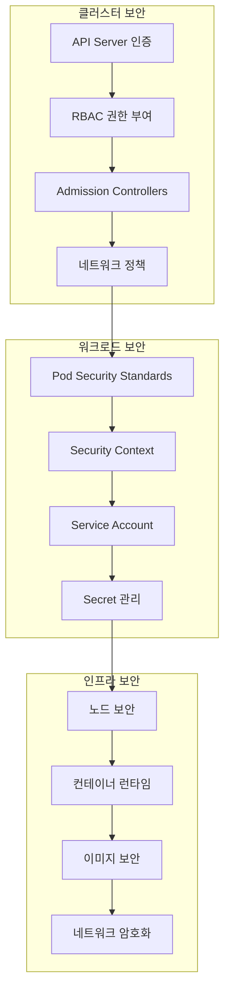
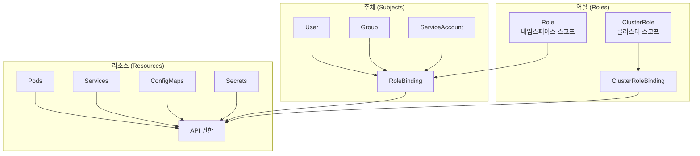

# Session 8: Kubernetes 보안 기초

## 📍 교과과정에서의 위치
이 세션은 **Week 2 > Day 5 > Session 8**로, Week 2의 마지막 세션으로서 Kubernetes의 **보안 아키텍처**와 **보안 정책** 수립을 통해 안전한 클러스터 운영 방법을 학습합니다.

## 학습 목표 (5분)
- **Kubernetes 보안 모델**과 **다층 보안** 아키텍처 완전 이해
- **RBAC 권한 관리**와 **최소 권한 원칙** 적용 방법 학습
- **네트워크 정책**과 **Pod 보안 표준** 구현 전략 분석
- **보안 모니터링**과 **컴플라이언스** 관리 방법 파악

## 1. Kubernetes 보안 아키텍처 (15분)

### 다층 보안 모델



### 보안 아키텍처 상세 분석
```
Kubernetes 다층 보안 아키텍처:

클러스터 수준 보안 (제어 평면):
   🔹 API 서버 보안 아키텍처:
      • 인증 (Authentication) 메커니즘:
         • X.509 클라이언트 인증서:
│   │   │   ├── PKI 기반 인증 체계
│   │   │   ├── CA (Certificate Authority) 계층 구조
│   │   │   ├── 인증서 순환 및 갱신
│   │   │   ├── 인증서 폐지 목록 (CRL)
│   │   │   ├── 상호 TLS 인증 (mTLS)
│   │   │   ├── 인증서 기반 사용자 식별
│   │   │   └── 자동화된 인증서 관리
         • 서비스 어카운트 토큰:
│   │   │   ├── JWT (JSON Web Token) 기반
│   │   │   ├── 자동 생성 및 마운트
│   │   │   ├── 토큰 순환 및 만료 관리
│   │   │   ├── 네임스페이스 범위 제한
│   │   │   ├── RBAC 권한 연동
│   │   │   ├── 토큰 투영 (Token Projection)
│   │   │   └── 보안 감사 로깅
         • OpenID Connect (OIDC) 통합:
│   │   │   ├── 외부 ID 제공자 연동
│   │   │   ├── Azure AD, Google, AWS IAM 지원
│   │   │   ├── 다중 인증 제공자 지원
│   │   │   ├── 그룹 멤버십 매핑
│   │   │   ├── 사용자 속성 기반 인증
│   │   │   ├── SSO (Single Sign-On) 지원
│   │   │   └── 세션 관리 및 로그아웃
         • Webhook 토큰 인증:
│   │   │   ├── 커스텀 인증 서비스 연동
│   │   │   ├── 외부 인증 시스템 통합
│   │   │   ├── 동적 인증 및 검증
│   │   │   ├── 인증 결과 캐싱
│   │   │   ├── 인증 실패 처리
│   │   │   └── 보안 이벤트 로깅
         • 프록시 인증 (Proxy Authentication):
│   │   │   ├── 리버스 프록시 기반 인증
│   │   │   ├── HTTP 헤더 기반 사용자 식별
│   │   │   ├── 네트워크 수준 인증
│   │   │   ├── 로드 밸런서 통합
│   │   │   └── 엔터프라이즈 보안 게이트웨이
         • 다중 인증 방법 지원:
         • 인증 체인 및 폴백
         • 우선순위 기반 인증 선택
         • 인증 결과 병합
         • 인증 실패 전파
         • 인증 메타데이터 관리
      • 권한 부여 (Authorization) 시스템:
         • RBAC (Role-Based Access Control):
│   │   │   ├── 역할 기반 접근 제어 모델
│   │   │   ├── 최소 권한 원칙 적용
│   │   │   ├── 역할 계층 구조 설계
│   │   │   ├── 네임스페이스 및 클러스터 스코프
│   │   │   ├── 동적 권한 부여 및 해지
│   │   │   ├── 권한 상속 및 위임
│   │   │   └── 권한 감사 및 모니터링
         • ABAC (Attribute-Based Access Control):
│   │   │   ├── 속성 기반 세밀한 접근 제어
│   │   │   ├── 사용자, 리소스, 환경 속성
│   │   │   ├── 조건부 접근 제어
│   │   │   ├── 시간 및 위치 기반 제어
│   │   │   ├── 복잡한 비즈니스 로직 지원
│   │   │   └── 정책 엔진 통합
         • Node Authorization:
│   │   │   ├── kubelet 전용 권한 제어
│   │   │   ├── 노드별 리소스 접근 제한
│   │   │   ├── Pod 및 Secret 접근 제어
│   │   │   ├── 노드 신원 및 인증
│   │   │   └── 네트워크 수준 보안
         • Webhook Authorization:
│   │   │   ├── 외부 권한 부여 서비스
│   │   │   ├── 커스텀 비즈니스 로직
│   │   │   ├── 실시간 권한 결정
│   │   │   ├── 외부 시스템 통합
│   │   │   └── 고성능 권한 검사
         • 권한 부여 전략:
         • 최소 권한 원칙 (Principle of Least Privilege)
         • 네임스페이스 기반 격리
         • 역할 기반 사용자 그룹화
         • 임시 권한 부여 및 해지
         • 권한 상속 및 위임 체계
         • 권한 감사 및 보고
      • 승인 제어 (Admission Control) 시스템:
      • ValidatingAdmissionWebhook:
         • 리소스 생성 전 검증
         • 비즈니스 로직 기반 검증
         • 보안 정책 준수 검사
         • 리소스 규격 및 제약 검증
         • 외부 시스템 연동 검증
         • 커스텀 유효성 검사
      • MutatingAdmissionWebhook:
         • 리소스 생성 시 자동 수정
         • 보안 설정 자동 주입
         • 리소스 라벨 및 어노테이션 추가
         • 기본값 설정 및 정규화
         • 사이드카 컨테이너 주입
         • 설정 템플릿 적용
      • Pod Security Standards:
         • Privileged, Baseline, Restricted 수준
         • 네임스페이스별 정책 적용
         • 점진적 보안 강화
         • 정책 위반 감지 및 차단
         • 보안 컴플라이언스 보고
         • 예외 처리 및 승인 프로세스
      • Resource Quotas 및 Limit Ranges:
         • 리소스 사용량 제한
         • DoS 공격 방지
         • 비용 제어 및 관리
         • 리소스 공정성 보장
         • 용량 계획 및 예측
      • 커스텀 정책 엔진:
      • OPA (Open Policy Agent) 통합
      • Gatekeeper 정책 프레임워크
      • Rego 언어 기반 정책 작성
      • 정책 템플릿 및 라이브러리
      • 정책 위반 보고 및 알림
      • 정책 테스트 및 검증
   🔹 etcd 보안 아키텍처:
      • 저장 데이터 암호화 (Encryption at Rest):
         • AES-256 암호화 알고리즘
         • 암호화 키 관리 시스템 (KMS)
         • 하드웨어 보안 모듈 (HSM)
         • 암호화 키 순환 정책
         • 다중 암호화 계층
         • 암호화 성능 최적화
      • 네트워크 통신 보안:
         • TLS 1.3 암호화 프로토콜
         • 상호 TLS 인증 (mTLS)
         • 인증서 기반 클라이언트 인증
         • 네트워크 세분화 및 격리
         • 트래픽 암호화 및 무결성 검증
         • 네트워크 모니터링 및 침입 탐지
      • 접근 제어 및 감사:
         • RBAC 기반 etcd 접근 제어
         • 세밀한 권한 부여 및 관리
         • 접근 로그 및 감사 추적
         • 비정상 접근 패턴 탐지
         • 실시간 보안 알림
         • 컴플라이언스 보고 자동화
      • 백업 및 복구 보안:
      • 암호화된 백업 저장
      • 백업 무결성 검증
      • 안전한 백업 전송 및 저장
      • 재해 복구 시나리오 테스트
      • 백업 접근 권한 관리
      • 백업 보존 정책 및 수명주기
   🔹 네트워크 보안 아키텍처:
   🔹 종단 간 암호화 (End-to-End Encryption):
      • TLS 1.3 프로토콜 전체 적용
      • 서비스 간 통신 암호화
      • 데이터 전송 계층 보안
      • 암호화 터널링 (VPN, IPSec)
      • 서비스 메시 보안 통합
      • 제로 트러스트 네트워크 아키텍처
   🔹 네트워크 정책 및 마이크로세그먼테이션:
      • 네트워크 정책 기반 트래픽 제어
      • 마이크로세그먼테이션 전략
      • 제로 트러스트 네트워크 모델
      • 네트워크 세분화 및 격리
      • 동적 네트워크 정책 업데이트
      • 네트워크 보안 모니터링
   🔹 서비스 메시 보안 통합:
      • Istio, Linkerd 보안 기능
      • 자동 mTLS 인증 및 암호화
      • 서비스 간 인증 및 권한 부여
      • 트래픽 암호화 및 무결성 검증
      • 보안 정책 자동 적용
      • 보안 이벤트 모니터링
   🔹 방화벽 및 네트워크 보안:
      • 네트워크 수준 방화벽 규칙
      • 애플리케이션 수준 방화벽
      • DDoS 공격 방지 및 완화
      • 침입 탐지 시스템 (IDS/IPS)
      • 네트워크 트래픽 분석
      • 비정상 트래픽 패턴 탐지
   🔹 VPN 및 원격 접근 보안:
   🔹 사이트 간 VPN (Site-to-Site)
   🔹 원격 접근 VPN (Remote Access)
   🔹 제로 트러스트 네트워크 액세스
   🔹 다중 인증 (MFA) 통합
   🔹 세션 관리 및 모니터링
   🔹 접근 로그 및 감사

워크로드 수준 보안:
   🔹 Pod 보안:
      • Pod Security Standards:
         • Privileged: 제한 없음
         • Baseline: 기본 보안 정책
         • Restricted: 강화된 보안
         • 네임스페이스별 적용
         • 정책 위반 감지
         • 점진적 적용 지원
      • Security Context:
         • 사용자 및 그룹 ID 설정
         • 권한 상승 방지
         • 읽기 전용 루트 파일시스템
         • 특권 컨테이너 제한
         • Capabilities 제한
         • SELinux/AppArmor 통합
      • 리소스 제한:
      • CPU 및 메모리 제한
      • 스토리지 제한
      • 네트워크 대역폭 제한
      • 프로세스 수 제한
      • 파일 디스크립터 제한
      • DoS 공격 방지
   🔹 컨테이너 보안:
      • 이미지 보안:
         • 이미지 스캔 및 취약점 분석
         • 서명된 이미지 사용
         • 프라이빗 레지스트리 활용
         • 최소 베이스 이미지 사용
         • 정기적 이미지 업데이트
         • 이미지 정책 적용
      • 런타임 보안:
         • 컨테이너 런타임 보안
         • 프로세스 격리
         • 파일시스템 격리
         • 네트워크 격리
         • 리소스 격리
         • 시스템 콜 필터링
      • 시크릿 관리:
      • 환경 변수 보안
      • 볼륨 마운트 보안
      • 시크릿 순환
      • 접근 로깅
      • 암호화 키 관리
   🔹 서비스 보안:
   🔹 서비스 어카운트:
      • 최소 권한 부여
      • 토큰 자동 마운트 제어
      • 토큰 만료 시간 설정
      • 네임스페이스별 격리
      • RBAC 통합
   🔹 네트워크 정책:
      • Ingress 트래픽 제어
      • Egress 트래픽 제어
      • 포트 및 프로토콜 제한
      • 네임스페이스 간 격리
      • 라벨 기반 선택
      • 기본 거부 정책
   🔹 서비스 메시 보안:
   🔹 mTLS 자동화
   🔹 트래픽 암호화
   🔹 인증 정책
   🔹 권한 부여 정책
   🔹 보안 감사

인프라 수준 보안:
   🔹 노드 보안:
      • 운영체제 강화
      • 커널 보안 모듈
      • 파일시스템 암호화
      • 네트워크 보안
      • 로그 관리
      • 침입 탐지 시스템
   🔹 클러스터 네트워크:
      • CNI 보안 설정
      • 네트워크 세분화
      • 트래픽 암호화
      • 방화벽 규칙
      • 네트워크 모니터링
   🔹 데이터 보안:
   🔹 저장 데이터 암호화
   🔹 전송 데이터 암호화
   🔹 백업 암호화
   🔹 키 관리 시스템
   🔹 데이터 분류 및 보호
```

## 2. RBAC 권한 관리 (12분)

### RBAC 아키텍처



### RBAC 상세 분석
```
RBAC 권한 관리 시스템 심화 분석:

RBAC 구성 요소 및 관계:
   🔹 주체 (Subjects) 상세 분석:
      • User (사용자) 관리:
         • 외부 사용자 인증 시스템:
│   │   │   ├── LDAP/Active Directory 통합
│   │   │   ├── SAML 2.0 기반 SSO
│   │   │   ├── OAuth 2.0/OpenID Connect
│   │   │   ├── 다중 인증 제공자 지원
│   │   │   ├── 사용자 속성 매핑
│   │   │   └── 세션 관리 및 만료
         • 인증서 기반 사용자 관리:
│   │   │   ├── X.509 클라이언트 인증서
│   │   │   ├── 인증서 생명주기 관리
│   │   │   ├── 인증서 폐지 및 갱신
│   │   │   ├── CA 계층 구조 관리
│   │   │   ├── 인증서 기반 사용자 식별
│   │   │   └── 자동화된 인증서 배포
         • 사용자 계정 유형:
│   │   │   ├── 개발자 계정 (Developer)
│   │   │   ├── 운영자 계정 (Operator)
│   │   │   ├── 관리자 계정 (Administrator)
│   │   │   ├── 읽기 전용 계정 (Viewer)
│   │   │   ├── 감사자 계정 (Auditor)
│   │   │   └── 서비스 계정 (Service)
         • 사용자 생명주기 관리:
         • 계정 생성 및 프로비저닝
         • 권한 부여 및 변경
         • 계정 비활성화 및 삭제
         • 정기적 접근 검토
         • 비활성 계정 관리
         • 계정 감사 및 보고
      • Group (그룹) 관리 전략:
         • 조직 구조 기반 그룹화:
│   │   │   ├── 부서별 그룹 (Engineering, Operations)
│   │   │   ├── 팀별 그룹 (Frontend, Backend, DevOps)
│   │   │   ├── 프로젝트별 그룹 (Project-A, Project-B)
│   │   │   ├── 지역별 그룹 (US-East, EU-West)
│   │   │   ├── 계약자 그룹 (Contractors, Vendors)
│   │   │   └── 임시 그룹 (Interns, Consultants)
         • 역할 기반 그룹화:
│   │   │   ├── 기능별 역할 그룹
│   │   │   ├── 권한 수준별 그룹
│   │   │   ├── 환경별 접근 그룹
│   │   │   ├── 애플리케이션별 그룹
│   │   │   ├── 데이터 접근 그룹
│   │   │   └── 관리 기능 그룹
         • 동적 그룹 관리:
│   │   │   ├── 속성 기반 그룹 멤버십
│   │   │   ├── 자동 그룹 할당
│   │   │   ├── 조건부 그룹 멤버십
│   │   │   ├── 시간 기반 그룹 접근
│   │   │   ├── 프로젝트 기반 임시 그룹
│   │   │   └── 워크플로우 기반 그룹 변경
         • 그룹 계층 구조:
         • 상위-하위 그룹 관계
         • 권한 상속 메커니즘
         • 그룹 간 권한 위임
         • 중첩 그룹 멤버십
         • 그룹 우선순위 관리
         • 그룹 충돌 해결
      • ServiceAccount (서비스 계정) 고급 관리:
      • 서비스 계정 설계 패턴:
         • 애플리케이션별 서비스 계정
         • 마이크로서비스별 격리
         • 환경별 서비스 계정
         • 기능별 서비스 계정
         • 임시 작업용 서비스 계정
         • 시스템 서비스 계정
      • 토큰 관리 및 보안:
         • JWT 토큰 구조 및 검증
         • 토큰 만료 시간 관리
         • 토큰 순환 정책
         • 토큰 범위 제한
         • 토큰 바인딩 및 검증
         • 토큰 감사 및 모니터링
      • 자동 마운트 제어:
         • 선택적 토큰 마운트
         • 토큰 볼륨 보안 설정
         • 토큰 파일 권한 관리
         • 토큰 접근 로깅
         • 토큰 사용 추적
         • 토큰 오남용 방지
      • 서비스 계정 생명주기:
      • 자동 생성 및 프로비저닝
      • 권한 할당 및 검증
      • 사용량 모니터링
      • 정기적 권한 검토
      • 미사용 계정 정리
      • 보안 이벤트 대응
   🔹 역할 (Roles) 설계 및 관리:
      • Role (네임스페이스 역할) 설계:
         • 세밀한 권한 제어 전략:
│   │   │   ├── 리소스별 세분화된 권한
│   │   │   ├── 동작별 권한 분리
│   │   │   ├── 조건부 권한 부여
│   │   │   ├── 시간 기반 권한 제한
│   │   │   ├── 컨텍스트 기반 권한
│   │   │   └── 동적 권한 조정
         • 개발팀별 권한 분리:
│   │   │   ├── 팀별 네임스페이스 격리
│   │   │   ├── 프로젝트별 리소스 접근
│   │   │   ├── 개발 단계별 권한
│   │   │   ├── 코드 리뷰 기반 권한
│   │   │   ├── 배포 권한 분리
│   │   │   └── 모니터링 권한 관리
         • 환경별 권한 관리:
│   │   │   ├── 개발 환경 전체 권한
│   │   │   ├── 스테이징 환경 제한 권한
│   │   │   ├── 프로덕션 환경 최소 권한
│   │   │   ├── 환경 간 권한 격리
│   │   │   ├── 환경별 승인 프로세스
│   │   │   └── 환경 전환 권한 관리
         • 애플리케이션별 권한:
         • 애플리케이션 생명주기 권한
         • 데이터 접근 권한
         • 설정 관리 권한
         • 로그 접근 권한
         • 메트릭 수집 권한
         • 디버깅 권한
      • ClusterRole (클러스터 역할) 관리:
      • 시스템 수준 권한 관리:
         • 노드 관리 및 모니터링
         • 클러스터 리소스 관리
         • 네트워크 정책 관리
         • 보안 정책 관리
         • 스토리지 클래스 관리
         • 클러스터 설정 관리
      • 네임스페이스 관리 권한:
         • 네임스페이스 생성 및 삭제
         • 네임스페이스 정책 설정
         • 리소스 할당량 관리
         • 네임스페이스 모니터링
         • 네임스페이스 백업
         • 네임스페이스 복구
      • CRD 및 확장 관리:
         • 커스텀 리소스 정의
         • 오퍼레이터 관리
         • API 확장 관리
         • 웹훅 관리
         • 어드미션 컨트롤러
         • 플러그인 관리
      • 글로벌 권한 관리:
      • 클러스터 전체 읽기 권한
      • 글로벌 모니터링 권한
      • 클러스터 백업 권한
      • 재해 복구 권한
      • 보안 감사 권한
      • 컴플라이언스 검사 권한
   🔹 바인딩 (Bindings) 전략 및 관리:
      • RoleBinding 관리 전략:
         • 세밀한 권한 부여 패턴:
│   │   │   ├── 최소 권한 원칙 적용
│   │   │   ├── 작업별 권한 분리
│   │   │   ├── 시간 제한 권한
│   │   │   ├── 조건부 권한 부여
│   │   │   ├── 승인 기반 권한
│   │   │   └── 감사 추적 권한
         • 환경별 권한 분리:
│   │   │   ├── 개발-스테이징-프로덕션 격리
│   │   │   ├── 환경별 승인 프로세스
│   │   │   ├── 환경 간 권한 상속 제한
│   │   │   ├── 환경별 모니터링
│   │   │   ├── 환경별 백업 권한
│   │   │   └── 환경별 복구 권한
         • 임시 권한 부여:
│   │   │   ├── 시간 기반 권한 만료
│   │   │   ├── 작업 완료 시 자동 해제
│   │   │   ├── 승인자 기반 권한 부여
│   │   │   ├── 임시 권한 모니터링
│   │   │   ├── 권한 사용 추적
│   │   │   └── 자동 권한 회수
         • 동적 권한 관리:
         • 워크플로우 기반 권한
         • 이벤트 기반 권한 변경
         • 조건부 권한 활성화
         • 컨텍스트 인식 권한
         • 적응형 권한 조정
         • 지능형 권한 추천
      • ClusterRoleBinding 관리:
      • 관리자 권한 부여 전략:
         • 다중 관리자 체계
         • 권한 분산 및 견제
         • 긴급 접근 권한
         • 관리자 권한 순환
         • 관리자 활동 감사
         • 관리자 권한 위임
      • 시스템 컴포넌트 권한:
         • 컨트롤러 매니저 권한
         • 스케줄러 권한
         • kubelet 권한
         • kube-proxy 권한
         • DNS 서비스 권한
         • 모니터링 시스템 권한
      • 전역 권한 관리:
      • 클러스터 전체 읽기 권한
      • 글로벌 모니터링 권한
      • 보안 정책 관리 권한
      • 백업 및 복구 권한
      • 네트워크 정책 권한
      • 컴플라이언스 권한
   🔹 권한 (Permissions) 세부 관리:
   🔹 동사 (Verbs) 세분화:
      • 읽기 권한 (Read Permissions):
         • get: 특정 리소스 조회
         • list: 리소스 목록 조회
         • watch: 리소스 변경 모니터링
         • 조건부 읽기 권한
         • 필드별 읽기 제한
         • 시간 기반 읽기 권한
      • 쓰기 권한 (Write Permissions):
         • create: 새 리소스 생성
         • update: 기존 리소스 수정
         • patch: 부분 리소스 수정
         • 승인 기반 쓰기 권한
         • 검증 기반 쓰기 권한
         • 감사 추적 쓰기 권한
      • 삭제 권한 (Delete Permissions):
         • delete: 개별 리소스 삭제
         • deletecollection: 다중 리소스 삭제
         • 안전 삭제 정책
         • 삭제 승인 프로세스
         • 삭제 백업 및 복구
         • 삭제 감사 및 로깅
      • 특수 권한 (Special Permissions):
      • * (모든 권한): 최고 관리자용
      • 커스텀 동사: 애플리케이션별
      • 조건부 권한: 컨텍스트 기반
      • 위임 권한: 권한 전달
      • 임시 권한: 시간 제한
      • 감사 권한: 모니터링 전용
   🔹 리소스 (Resources) 분류 및 관리:
      • 핵심 리소스 (Core Resources):
         • pods, services, configmaps
         • secrets, persistentvolumes
         • namespaces, nodes
         • events, endpoints
         • serviceaccounts
         • resourcequotas
      • 애플리케이션 리소스 (Apps Resources):
         • deployments, replicasets
         • daemonsets, statefulsets
         • jobs, cronjobs
         • horizontalpodautoscalers
         • ingresses
         • networkpolicies
      • 확장 리소스 (Extension Resources):
         • customresourcedefinitions
         • mutatingwebhookconfigurations
         • validatingwebhookconfigurations
         • apiservices
         • priorityclasses
         • podsecuritypolicies
      • 커스텀 리소스 (Custom Resources):
      • 애플리케이션별 CRD
      • 오퍼레이터 리소스
      • 설정 관리 리소스
      • 모니터링 리소스
      • 보안 정책 리소스
      • 워크플로우 리소스
   🔹 리소스 이름 (ResourceNames) 세부 제어:
   🔹 특정 리소스 인스턴스 제어:
      • 개별 Pod 접근 제한
      • 특정 Secret 접근 제어
      • 지정된 ConfigMap만 접근
      • 특정 Service 관리 권한
      • 개별 PV 접근 제어
      • 특정 Namespace 제한
   🔹 패턴 기반 리소스 제어:
      • 접두사 기반 리소스 매칭
      • 정규식 기반 리소스 선택
      • 태그 기반 리소스 필터링
      • 라벨 기반 리소스 그룹화
      • 어노테이션 기반 제어
      • 메타데이터 기반 필터링
   🔹 동적 리소스 제어:
      • 시간 기반 리소스 접근
      • 조건부 리소스 접근
      • 컨텍스트 기반 리소스 제어
      • 워크플로우 기반 접근
      • 이벤트 기반 권한 변경
      • 적응형 리소스 제어
   🔹 보안 강화 리소스 제어:
   🔹 민감 리소스 접근 제한
   🔹 보안 정책 리소스 보호
   🔹 시스템 리소스 접근 제한
   🔹 백업 리소스 보호
   🔹 감사 로그 리소스 보호
   🔹 인증서 리소스 보호
```

## 3. 네트워크 정책과 Pod 보안 (10분)

### 네트워크 정책 구조
```
네트워크 정책 (Network Policy) 심화 분석:

네트워크 정책 기본 개념 및 아키텍처:
   🔹 네트워크 수준 방화벽 규칙:
      • OSI 3-4계층 트래픽 제어
      • IP 주소 및 포트 기반 필터링
      • 프로토콜별 트래픽 제어 (TCP, UDP, SCTP)
      • 라벨 셀렉터 기반 동적 규칙
      • 네임스페이스 기반 논리적 격리
      • CNI 플러그인 의존적 구현
   🔹 정책 적용 메커니즘:
      • Pod 라벨 기반 대상 선택
      • 네임스페이스 스코프 정책
      • 정책 우선순위 및 병합
      • 기본 허용/거부 정책
      • 점진적 정책 적용
      • 정책 충돌 해결
   🔹 CNI 플러그인 지원:
      • Calico: 고급 네트워크 정책 지원
      • Cilium: eBPF 기반 고성능 정책
      • Weave Net: 간단한 정책 구현
      • Flannel: 기본 정책 지원 제한
      • Antrea: VMware 기반 정책 엔진
      • Kube-router: 경량 정책 구현
   🔹 정책 설계 원칙:
   🔹 기본 거부 (Default Deny) 원칙
   🔹 최소 권한 네트워크 접근
   🔹 마이크로세그멘테이션 전략
   🔹 계층적 보안 모델
   🔹 감사 및 모니터링 통합
   🔹 성능 영향 최소화

Ingress 정책 (들어오는 트래픽 제어):
   🔹 소스 기반 트래픽 제어:
      • Pod 셀렉터 기반 소스 지정:
         • 라벨 기반 Pod 선택
         • 네임스페이스 내 Pod 필터링
         • 다중 라벨 조건 지원
         • 동적 Pod 그룹 관리
         • 애플리케이션 계층별 분리
         • 마이크로서비스 간 통신 제어
      • 네임스페이스 셀렉터 기반:
         • 네임스페이스 라벨 기반 선택
         • 환경별 네임스페이스 격리
         • 팀별 네임스페이스 분리
         • 프로젝트별 격리
         • 테넌트별 분리
         • 규정 준수 기반 격리
      • IP 블록 기반 제어:
      • 외부 IP 범위 지정
      • 내부 네트워크 세그먼트
      • 클라우드 서비스 IP 범위
      • 온프레미스 네트워크 통합
      • VPN 연결 네트워크
      • 파트너 네트워크 접근
   🔹 포트 및 프로토콜 제어:
      • 특정 포트 허용/차단
      • 포트 범위 지정
      • 프로토콜별 정책 (TCP/UDP/SCTP)
      • 명명된 포트 활용
      • 동적 포트 할당 지원
      • 서비스 포트 매핑
   🔹 고급 Ingress 정책:
      • 시간 기반 접근 제어
      • 지리적 위치 기반 제어
      • 트래픽 패턴 기반 제어
      • 로드 밸런싱 통합
      • 서비스 메시 통합
      • 보안 정책 자동화
   🔹 Ingress 정책 모범 사례:
   🔹 화이트리스트 기반 접근
   🔹 최소 필요 포트만 허용
   🔹 정기적 정책 검토
   🔹 정책 테스트 및 검증
   🔹 모니터링 및 알림
   🔹 문서화 및 표준화

Egress 정책 (나가는 트래픽 제어):
   🔹 대상 기반 트래픽 제어:
      • 내부 서비스 접근 제어:
         • 데이터베이스 서비스 접근
         • 캐시 서비스 접근
         • 메시징 서비스 접근
         • 파일 스토리지 접근
         • 모니터링 서비스 접근
         • 로깅 서비스 접근
      • 외부 서비스 접근 제어:
         • 외부 API 서비스 접근
         • 클라우드 서비스 접근
         • 써드파티 서비스 통합
         • CDN 서비스 접근
         • 결제 게이트웨이 접근
         • 소셜 미디어 API 접근
      • 인터넷 접근 제어:
      • 일반 인터넷 접근 차단
      • 허용된 도메인만 접근
      • 보안 업데이트 서버 접근
      • 패키지 저장소 접근
      • 컨테이너 레지스트리 접근
      • 모니터링 서비스 접근
   🔹 DNS 쿼리 제어:
      • 내부 DNS 서버만 허용
      • 외부 DNS 쿼리 차단
      • 도메인별 DNS 필터링
      • DNS over HTTPS 제어
      • DNS 캐시 정책
      • DNS 보안 강화
   🔹 고급 Egress 정책:
      • 애플리케이션 계층 제어
      • 사용자 기반 접근 제어
      • 시간 기반 접근 제어
      • 데이터 분류 기반 제어
      • 컴플라이언스 기반 제어
      • 위험 기반 동적 제어
   🔹 Egress 정책 모범 사례:
   🔹 기본 거부 후 필요한 것만 허용
   🔹 외부 의존성 최소화
   🔹 정기적 외부 접근 검토
   🔹 데이터 유출 방지 정책
   🔹 모니터링 및 알림
   🔹 사고 대응 계획

Pod 보안 표준 (Pod Security Standards) 심화:
   🔹 Privileged 수준:
      • 보안 제한 없음:
         • 모든 Linux capabilities 허용
         • 특권 컨테이너 실행 허용
         • 호스트 네트워크 접근 허용
         • 호스트 PID/IPC 네임스페이스 접근
         • 호스트 경로 마운트 허용
         • 모든 볼륨 타입 허용
         • 임의 사용자 ID 실행
         • SELinux/AppArmor 제한 없음
      • 사용 사례:
         • 시스템 데몬 (kube-proxy, CNI)
         • 모니터링 에이전트
         • 로그 수집기
         • 보안 스캐너
         • 백업 에이전트
         • 시스템 유지보수 도구
      • 보안 고려사항:
      • 최소한의 Pod만 허용
      • 강화된 모니터링
      • 정기적 보안 검토
      • 접근 로그 강화
      • 사고 대응 계획
   🔹 Baseline 수준:
      • 기본 보안 제한:
         • 특권 컨테이너 금지
         • 호스트 네트워크 접근 금지
         • 호스트 PID/IPC 접근 금지
         • 위험한 capabilities 제한
         • 호스트 경로 마운트 제한
         • 위험한 볼륨 타입 금지
         • 권한 상승 방지
         • 기본 SELinux/AppArmor 적용
      • 허용되는 기능:
         • 일반적인 애플리케이션 실행
         • 네트워크 서비스 제공
         • 파일 시스템 접근
         • 환경 변수 사용
         • 기본 볼륨 마운트
         • 표준 포트 바인딩
      • 사용 사례:
         • 웹 애플리케이션
         • API 서버
         • 데이터베이스
         • 메시징 시스템
         • 캐시 서비스
         • 일반적인 비즈니스 애플리케이션
      • 보안 강화 방안:
      • 추가 보안 컨텍스트 설정
      • 네트워크 정책 적용
      • 리소스 제한 설정
      • 모니터링 강화
      • 정기적 보안 스캔
   🔹 Restricted 수준:
   🔹 강화된 보안 제한:
      • 모든 Baseline 제한 포함
      • 루트 사용자 실행 금지
      • 읽기 전용 루트 파일시스템
      • 모든 capabilities 제거
      • seccomp 프로필 강제 적용
      • 허용된 볼륨 타입만 사용
      • 네트워크 접근 최소화
      • 강화된 SELinux/AppArmor
   🔹 보안 컨텍스트 강화:
      • runAsNonRoot: true 강제
      • runAsUser: 1000+ 강제
      • readOnlyRootFilesystem: true
      • allowPrivilegeEscalation: false
      • capabilities: drop ALL
      • seccompProfile: RuntimeDefault
      • seLinuxOptions 강제 설정
      • 추가 보안 모듈 적용
   🔹 사용 사례:
      • 금융 서비스 애플리케이션
      • 의료 정보 시스템
      • 개인정보 처리 시스템
      • 정부 기관 시스템
      • 보안 중요 API 서비스
      • 규제 준수 애플리케이션
   🔹 추가 보안 조치:
      • 이미지 스캔 강화
      • 런타임 보안 모니터링
      • 이상 행위 탐지
      • 네트워크 트래픽 분석
      • 파일 무결성 모니터링
      • 보안 사고 대응 자동화
   🔹 성능 및 운영 고려사항:
   🔹 애플리케이션 호환성 검증
   🔹 성능 영향 평가
   🔹 개발 워크플로우 조정
   🔹 디버깅 도구 제한 대응
   🔹 로그 수집 방식 조정
   🔹 모니터링 전략 수정

네트워크 정책 고급 패턴:
   🔹 마이크로세그멘테이션 전략:
      • 애플리케이션 계층별 분리:
         • 프레젠테이션 계층 격리
         • 비즈니스 로직 계층 보호
         • 데이터 계층 강화 보안
         • 캐시 계층 접근 제어
         • 메시징 계층 격리
         • 모니터링 계층 분리
      • 데이터 민감도 기반 분리:
         • 공개 데이터 서비스
         • 내부 데이터 서비스
         • 민감 데이터 서비스
         • 개인정보 처리 서비스
         • 금융 데이터 서비스
         • 규제 데이터 서비스
      • 신뢰 경계 설정:
      • 신뢰 구역 (Trusted Zone)
      • DMZ 구역 (Demilitarized Zone)
      • 격리 구역 (Isolated Zone)
      • 관리 구역 (Management Zone)
      • 모니터링 구역
      • 백업 구역
   🔹 제로 트러스트 네트워크 모델:
      • 기본 거부 정책 (Default Deny All)
      • 명시적 허용 정책만 적용
      • 모든 통신 암호화 강제
      • 지속적인 인증 및 권한 부여
      • 실시간 위험 평가
      • 동적 정책 조정
      • 행위 기반 이상 탐지
      • 자동화된 사고 대응
   🔹 환경별 네트워크 정책:
      • 개발 환경:
         • 상대적으로 관대한 정책
         • 디버깅 도구 접근 허용
         • 외부 서비스 테스트 허용
         • 개발자 도구 접근
         • 실험적 기능 허용
      • 스테이징 환경:
         • 프로덕션 유사 정책
         • 테스트 도구 접근 허용
         • 모니터링 강화
         • 성능 테스트 지원
         • 보안 테스트 지원
      • 프로덕션 환경:
      • 최고 수준 보안 정책
      • 최소 필요 접근만 허용
      • 강화된 모니터링
      • 실시간 위협 탐지
      • 자동화된 대응
      • 컴플라이언스 준수
   🔹 정책 관리 및 운영:
   🔹 정책 생명주기 관리:
      • 정책 설계 및 검토
      • 정책 테스트 및 검증
      • 점진적 정책 배포
      • 정책 모니터링 및 조정
      • 정책 업데이트 및 패치
      • 정책 폐기 및 정리
   🔹 정책 자동화:
      • GitOps 기반 정책 관리
      • CI/CD 파이프라인 통합
      • 정책 템플릿 활용
      • 자동 정책 생성
      • 정책 검증 자동화
      • 정책 배포 자동화
   🔹 정책 모니터링:
      • 정책 위반 탐지
      • 트래픽 패턴 분석
      • 정책 효과성 측정
      • 성능 영향 모니터링
      • 보안 이벤트 추적
      • 컴플라이언스 보고
   🔹 문제 해결 및 최적화:
   🔹 정책 충돌 해결
   🔹 성능 최적화
   🔹 정책 단순화
   🔹 예외 처리 관리
   🔹 긴급 접근 절차
   🔹 정책 롤백 전략
```

## 4. 보안 모니터링 및 컴플라이언스 (6분)

### 보안 모니터링 아키텍처
```
보안 모니터링 및 컴플라이언스:

감사 로깅:
   🔹 API 서버 감사
   🔹 모든 API 요청 기록
   🔹 사용자 활동 추적
   🔹 리소스 변경 기록
   🔹 보안 이벤트 감지

보안 스캔:
   🔹 이미지 취약점 스캔
   🔹 설정 보안 검사
   🔹 런타임 보안 모니터링
   🔹 네트워크 트래픽 분석
   🔹 이상 행위 탐지

컴플라이언스:
   🔹 CIS Kubernetes Benchmark
   🔹 NIST 보안 프레임워크
   🔹 SOC 2 컴플라이언스
   🔹 GDPR 데이터 보호
   🔹 업계별 규정 준수

보안 도구 통합:
   🔹 Falco (런타임 보안)
   🔹 OPA Gatekeeper (정책 엔진)
   🔹 Twistlock/Prisma Cloud
   🔹 Aqua Security
   🔹 Sysdig Secure
```

## 5. 토론 및 정리 (2분)

### 핵심 키워드
- 다층 보안: 클러스터, 워크로드, 인프라 보안
- RBAC: 역할 기반 접근 제어
- 네트워크 정책: 트래픽 제어 및 격리
- 보안 모니터링: 감사, 스캔, 컴플라이언스

### Week 2 전체 정리
Week 2에서는 **Kubernetes 아키텍처**부터 **보안**까지 핵심 개념을 학습했습니다. Week 3에서는 **CI/CD 파이프라인**과 **자동화**를 다룰 예정입니다.