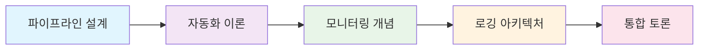
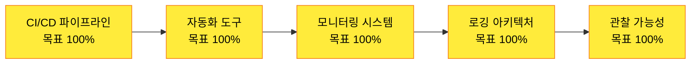
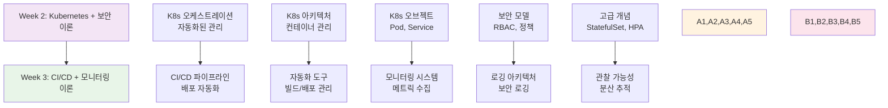
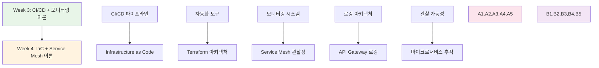

# 🔄 Week 3: CI/CD 파이프라인 + 모니터링/로깅 이론

**🎯 이론 중심 학습** • **70% 이론 + 30% 개념 실습** • **🆕 신규 구성**

*지속적 통합/배포와 관찰 가능성의 이론적 토대 구축*

---

## 🎯 학습 목표

> **KT Cloud 모델 기반 체계적 이론 학습**

| 영역 | 학습 목표 | 성취도 |
|------|-----------|--------|
| 🔄 **CI/CD 파이프라인** | 지속적 통합/배포 개념과 설계 원칙 완전 이해 | 🆕 신규 구성 |
| 🛠️ **자동화 도구** | Jenkins, GitHub Actions, GitLab CI 아키텍처 학습 | 🆕 신규 구성 |
| 📊 **모니터링 시스템** | Prometheus, Grafana 이론적 토대 구축 | 🆕 신규 구성 |
| 📝 **로깅 아키텍처** | ELK Stack과 중앙화 로깅 개념 이해 | 🆕 신규 구성 |
| 🔍 **관찰 가능성** | Observability와 분산 추적 심화 분석 | 🆕 신규 구성 |

## 🌟 학습 방식

**📊 내용 구성**
- 🎓 **이론 70%**: 파이프라인 설계 + 아키텍처 분석
- 💡 **개념 실습 30%**: 간단한 구조 확인용 실습
- 📈 **시각화**: Mermaid, SVG 다이어그램 적극 활용
- 🔗 **실무 연계**: 이론을 실무 프로젝트 설계로 연결 준비

---

## 📅 주간 일정

### 📅 **5일간의 체계적 이론 학습 여정**

#### 🔄 **Day 1** • [CI/CD 파이프라인 설계 이론](./day_01/README.md) 
> *지속적 통합/배포의 개념과 파이프라인 아키텍처*

<strong>📋 8개 세션 상세 내용</strong>

| 세션 | 주제 | 핵심 키워드 |
|------|------|------------|
| **01** | CI/CD 개념과 필요성 | 지속적 통합, 지속적 배포, 자동화 |
| **02** | 파이프라인 설계 원칙 | 단계별 구성, 병렬 처리, 실패 처리 |
| **03** | 소스 코드 관리 전략 | Git 워크플로우, 브랜치 전략 |
| **04** | 빌드 자동화 이론 | 빌드 도구, 의존성 관리 |
| **05** | 테스트 자동화 전략 | 단위 테스트, 통합 테스트, E2E 테스트 |
| **06** | 아티팩트 관리 | 바이너리 저장소, 버전 관리 |
| **07** | 배포 전략과 패턴 | 블루-그린, 카나리, 롤링 배포 |
| **08** | CI/CD 파이프라인 종합 및 토론 | 종합, 토론, 정리 |

#### 🛠️ **Day 2** • [CI/CD 도구 아키텍처 분석](./day_02/README.md)
> *Jenkins, GitHub Actions, GitLab CI 구조 심화*

<strong>📋 8개 세션 상세 내용</strong>

| 세션 | 주제 | 핵심 키워드 |
|------|------|------------|
| **01** | Jenkins 아키텍처 분석 | 마스터-슬레이브, 플러그인 생태계 |
| **02** | GitHub Actions 워크플로우 | 이벤트 기반, 매트릭스 빌드 |
| **03** | GitLab CI/CD 파이프라인 | 러너, 스테이지, 아티팩트 |
| **04** | 클라우드 네이티브 CI/CD | Tekton, Argo Workflows |
| **05** | 파이프라인 보안 모델 | 시크릿 관리, 권한 제어 |
| **06** | 성능 최적화 전략 | 캐싱, 병렬화, 리소스 관리 |
| **07** | 모니터링과 알림 | 파이프라인 메트릭, 실패 알림 |
| **08** | CI/CD 도구 비교 및 선택 기준 | 종합, 토론, 정리 |

#### 📊 **Day 3** • [모니터링 시스템 이론](./day_03/README.md)
> *Prometheus, Grafana 아키텍처와 메트릭 수집*

<strong>📋 8개 세션 상세 내용</strong>

| 세션 | 주제 | 핵심 키워드 |
|------|------|------------|
| **01** | 모니터링 개념과 필요성 | 관찰 가능성, SLI/SLO/SLA |
| **02** | Prometheus 아키텍처 | 시계열 데이터베이스, 풀 모델 |
| **03** | 메트릭 수집과 저장 | 메트릭 타입, 레이블링 전략 |
| **04** | PromQL 쿼리 언어 | 쿼리 구조, 함수, 연산자 |
| **05** | Grafana 시각화 이론 | 대시보드 설계, 패널 타입 |
| **06** | 알림 시스템 설계 | Alertmanager, 알림 라우팅 |
| **07** | 모니터링 모범 사례 | 메트릭 설계, 성능 최적화 |
| **08** | 모니터링 아키텍처 종합 및 토론 | 종합, 토론, 정리 |

#### 📝 **Day 4** • [로깅 아키텍처 이론](./day_04/README.md)
> *ELK Stack과 중앙화 로깅 시스템*

<strong>📋 8개 세션 상세 내용</strong>

| 세션 | 주제 | 핵심 키워드 |
|------|------|------------|
| **01** | 로깅 개념과 중요성 | 구조화 로깅, 로그 레벨 |
| **02** | ELK Stack 아키텍처 | Elasticsearch, Logstash, Kibana |
| **03** | 로그 수집 전략 | Beats, Fluentd, 로그 파싱 |
| **04** | 로그 저장과 인덱싱 | 인덱스 설계, 샤딩, 복제 |
| **05** | 로그 검색과 분석 | 쿼리 DSL, 집계, 시각화 |
| **06** | 로그 보안과 규정 준수 | 로그 마스킹, 보존 정책 |
| **07** | 성능 최적화와 확장성 | 클러스터 설계, 용량 계획 |
| **08** | 로깅 시스템 종합 및 토론 | 종합, 토론, 정리 |

#### 🔍 **Day 5** • [관찰 가능성과 통합 모니터링](./day_05/README.md)
> *분산 추적, APM, 통합 관찰 가능성*

<strong>📋 8개 세션 상세 내용</strong>

| 세션 | 주제 | 핵심 키워드 |
|------|------|------------|
| **01** | 관찰 가능성(Observability) 개념 | 메트릭, 로그, 트레이스 |
| **02** | 분산 추적 이론 | OpenTelemetry, Jaeger, Zipkin |
| **03** | APM과 성능 모니터링 | 애플리케이션 성능, 프로파일링 |
| **04** | 인프라 모니터링 통합 | 시스템 메트릭, 네트워크 모니터링 |
| **05** | 알림과 인시던트 관리 | 인시던트 대응, 에스컬레이션 |
| **06** | 모니터링 데이터 통합 | 데이터 상관관계, 대시보드 통합 |
| **07** | Week 3 전체 개념 종합 | 전체 통합 |
| **08** | 이론 총정리 및 Week 4 준비 | 마무리, 다음 준비 |

---

## 📊 학습 성과 및 성취도

### 🏆 **Week 3 진행 상황**

| 영역 | 완성도 | 세부 내용 |
|------|---------|----------|
| 📚 **세션 구성** | 🆕 **0/40** | 8세션 × 5일 구성 완료 |
| 🎓 **이론 구성** | 🆕 **70%** | 파이프라인 설계 + 아키텍처 분석 |
| 💡 **개념 실습** | 🆕 **30%** | 간단한 구조 확인용 실습 |
| 📈 **사례 연구** | 🆕 **준비 중** | 대기업 CI/CD 도입 사례 |
| 🎯 **KT Cloud 모델** | 🆕 **100%** | 체계적 이론 학습 설계 완료 |

### 📈 **이론 이해도 목표**

### 🚀 **실무 연계 준비도 목표**

| 역량 | 목표 | 비고 |
|------|------|------|
| 🏢 **파이프라인 설계** | 🟡 90% | CI/CD 파이프라인 아키텍처 설계 |
| 📊 **모니터링 전략** | 🟡 85% | 관찰 가능성 시스템 구축 |
| 📈 **사례 분석** | 🟡 90% | 대기업 DevOps 도입 사례 분석 |
| 💼 **취업 준비** | 🟡 80% | CI/CD 기술 면접 대비 |

---

## 🎯 Week 2 연결점

### 🔗 **Week 2 → Week 3 이론적 연결**

### 📋 **Week 2 기반 지식 활용**

| Week 2 개념 | Week 3 확장 | 연결점 |
|-------------|-------------|--------|
| ⚙️ **K8s 오케스트레이션** | 🔄 **CI/CD 파이프라인** | 자동화 → 배포 자동화 |
| 📦 **핵심 오브젝트** | 🛠️ **자동화 도구** | 컨테이너 관리 → 빌드/배포 관리 |
| 🌐 **네트워킹 모델** | 📊 **모니터링 시스템** | 서비스 통신 → 메트릭 수집 |
| 🔒 **클라우드 보안** | 📝 **로깅 아키텍처** | 보안 정책 → 보안 로깅 |
| 🛡️ **고급 개념** | 🔍 **관찰 가능성** | 클러스터 관리 → 분산 추적 |

---

## 🎯 Week 4 준비 상황

### 🔗 **이론적 토대 → IaC + Service Mesh 연결**

### 📋 **Week 4 준비 체크리스트**

- [ ] 📚 Week 3 CI/CD + 모니터링 이론 복습
- [ ] 🏗️ Infrastructure as Code 기본 개념 예습
- [ ] 🌐 Service Mesh 기초 개념 예습
- [ ] 🏢 아키텍처 설계 과제 준비
- [ ] 📈 사례 연구 자료 준비

---

## 💡 핵심 개념 미리보기

### 🏆 **Week 3에서 배울 5가지 핵심 개념**

| 개념 | 핵심 내용 | Week 4 연결점 |
|------|-----------|---------------|
| 🔄 **CI/CD 파이프라인** | 지속적 통합/배포, 자동화 | → Infrastructure as Code |
| 🛠️ **자동화 도구** | Jenkins, GitHub Actions, GitLab CI | → Terraform 자동화 |
| 📊 **모니터링 시스템** | Prometheus, Grafana, 메트릭 | → Service Mesh 관찰성 |
| 📝 **로깅 아키텍처** | ELK Stack, 중앙화 로깅 | → API Gateway 로깅 |
| 🔍 **관찰 가능성** | 분산 추적, APM, 통합 모니터링 | → 마이크로서비스 추적 |

---

## 📚 참고 자료

### 📖 필수 도서
- [Continuous Delivery - Jez Humble](https://www.oreilly.com/library/view/continuous-delivery-reliable/9780321670250/)
- [Prometheus: Up & Running - Brian Brazil](https://www.oreilly.com/library/view/prometheus-up/9781492034131/)

### 🌐 온라인 리소스
- [Jenkins 공식 문서](https://www.jenkins.io/doc/)
- [GitHub Actions 문서](https://docs.github.com/en/actions)
- [Prometheus 공식 문서](https://prometheus.io/docs/)
- [Grafana 문서](https://grafana.com/docs/)
- [ELK Stack 가이드](https://www.elastic.co/guide/)

### 🏢 기업 기술 블로그
- [Netflix Technology Blog - CI/CD](https://netflixtechblog.com/)
- [Uber Engineering - Monitoring](https://eng.uber.com/)
- [Spotify Engineering - DevOps](https://engineering.atspotify.com/)

---

### 🎉 **Week 3 신규 구성 완료!**

**KT Cloud 모델에 따라 CI/CD 파이프라인과 모니터링/로깅 이론을 체계적으로 학습합니다!** 🚀

**이전**: [Week 2 - Kubernetes + 클라우드 보안 이론](../week_02/README.md)  
**다음**: [Week 4 - Infrastructure as Code + Service Mesh 이론](../week_04/README.md)

