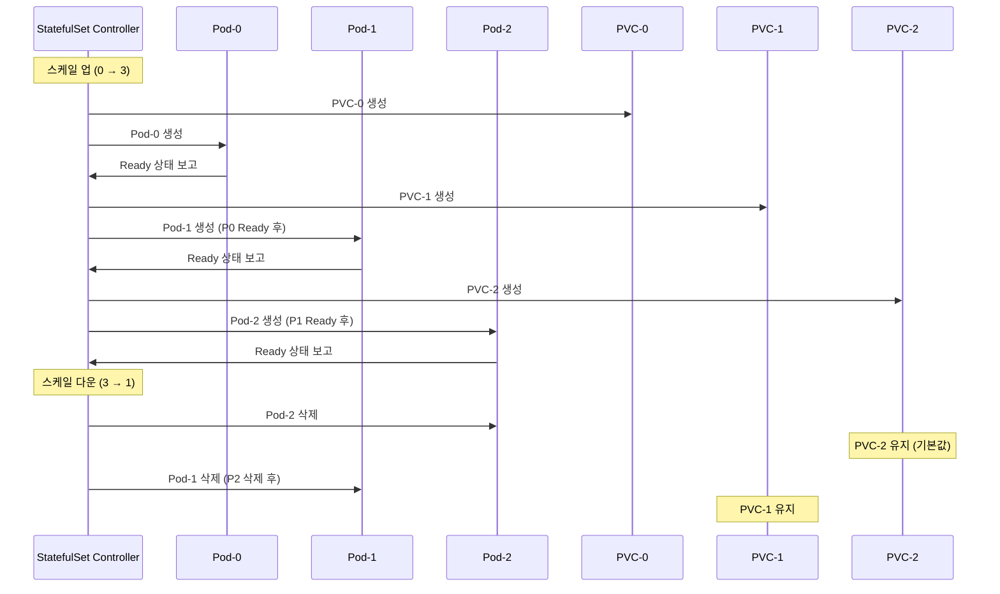
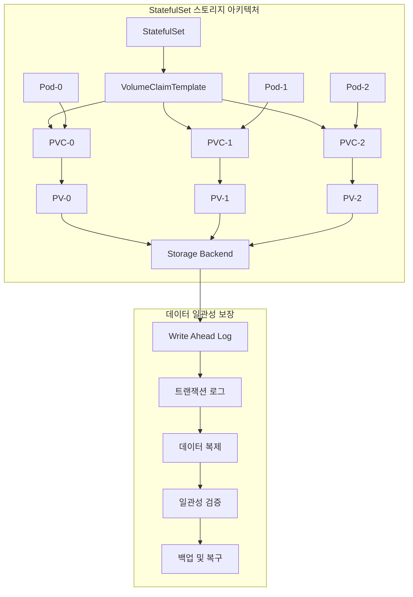
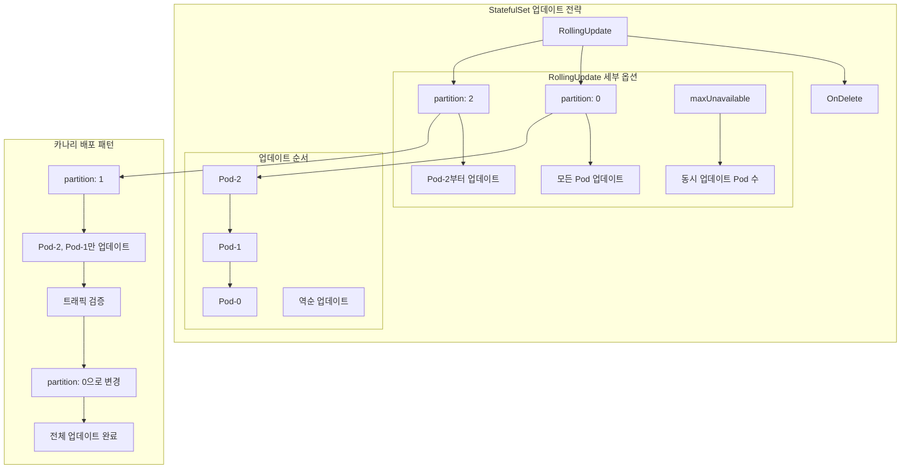

# Session 1: StatefulSet과 상태 관리 패턴

## 📍 교과과정에서의 위치
이 세션은 **Week 3 > Day 1 > Session 1**로, Kubernetes의 고급 워크로드 관리 중 상태 저장 애플리케이션을 위한 StatefulSet을 학습합니다. Week 2에서 학습한 Deployment의 무상태 특성과 대비하여 상태 관리의 복잡성과 해결 방안을 이해합니다.

## 학습 목표 (5분)
- **StatefulSet** 아키텍처와 **Deployment**와의 차이점 완전 이해
- **순서 보장**과 **안정적인 네트워크 ID** 메커니즘 학습
- **영구 스토리지** 연동과 **데이터 일관성** 보장 방법 파악
- **상태 저장 애플리케이션** 배포 패턴과 **운영 전략** 이해

## 1. StatefulSet 아키텍처와 설계 원칙 (15분)

### StatefulSet vs Deployment 비교

```mermaid
graph TB
    subgraph "Deployment (무상태)"
        A[Pod-1 random-abc] --> B[임시 스토리지]
        C[Pod-2 random-def] --> D[임시 스토리지]
        E[Pod-3 random-ghi] --> F[임시 스토리지]
        
        G[Service] --> A
        G --> C
        G --> E
    end
    
    subgraph "StatefulSet (상태 저장)"
        H[Pod-0 `(app-0)`] --> I[PVC-0 → PV-0]
        J[Pod-1 `(app-1)`] --> K[PVC-1 → PV-1]
        L[Pod-2 `(app-2)`] --> M[PVC-2 → PV-2]
        
        N[Headless Service] --> H
        N --> J
        N --> L
        
        O[app-0.service.ns.svc.cluster.local] --> H
        P[app-1.service.ns.svc.cluster.local] --> J
        Q[app-2.service.ns.svc.cluster.local] --> L
    end
    
    style H fill:#e8f5e8,stroke:#4caf50
    style J fill:#e8f5e8,stroke:#4caf50
    style L fill:#e8f5e8,stroke:#4caf50
    style I fill:#fff3e0,stroke:#ff9800
    style K fill:#fff3e0,stroke:#ff9800
    style M fill:#fff3e0,stroke:#ff9800
```

### StatefulSet 핵심 특성 분석
```
StatefulSet 설계 원칙:

1. 안정적인 네트워크 ID:
├── 예측 가능한 Pod 이름: {StatefulSet명}-{순서번호}
├── 고정된 DNS 이름: {Pod명}.{Service명}.{Namespace}.svc.cluster.local
├── 순서 기반 생성/삭제: 0, 1, 2... 순서로 생성
├── 역순 삭제: 2, 1, 0... 순서로 삭제
├── Headless Service 필수: ClusterIP가 None
└── 개별 Pod 직접 접근 가능

2. 안정적인 영구 스토리지:
├── Pod별 전용 PVC 자동 생성
├── Pod 재시작 시에도 동일한 PVC 연결
├── 스토리지 생명주기 독립 관리
├── 데이터 영속성 보장
├── 볼륨 클레임 템플릿 사용
└── 스토리지 확장 지원

3. 순서 보장 배포:
├── 순차적 Pod 생성 (0 → 1 → 2)
├── 이전 Pod가 Ready 상태가 되어야 다음 Pod 생성
├── 롤링 업데이트 시 역순 처리 (2 → 1 → 0)
├── 병렬 배포 옵션 (Parallel 정책)
├── 파티션 기반 부분 업데이트
└── 안전한 스케일링 보장

4. 고유한 Pod 식별:
├── 서수 인덱스 기반 식별 (0, 1, 2...)
├── 재시작 시에도 동일한 식별자 유지
├── 클러스터 멤버십 관리 용이
├── 리더 선출 및 샤딩 지원
├── 데이터 분산 및 복제 최적화
└── 상태 동기화 메커니즘 구현

StatefulSet 사용 사례:
├── 데이터베이스 클러스터:
│   ├── MySQL, PostgreSQL 마스터-슬레이브
│   ├── MongoDB 레플리카 세트
│   ├── Cassandra, ScyllaDB 클러스터
│   ├── Redis 클러스터 모드
│   └── InfluxDB, TimescaleDB
├── 메시징 시스템:
│   ├── Apache Kafka 브로커
│   ├── RabbitMQ 클러스터
│   ├── Apache Pulsar
│   ├── NATS Streaming
│   └── Apache ActiveMQ
├── 분산 스토리지:
│   ├── Ceph 클러스터
│   ├── GlusterFS
│   ├── MinIO 분산 모드
│   ├── Rook 오퍼레이터
│   └── Longhorn 스토리지
├── 분석 및 검색:
│   ├── Elasticsearch 클러스터
│   ├── Apache Solr
│   ├── ClickHouse 클러스터
│   ├── Apache Druid
│   └── Prometheus (장기 저장)
└── 상태 저장 애플리케이션:
    ├── 게임 서버 (세션 유지)
    ├── 실시간 분석 엔진
    ├── 블록체인 노드
    ├── 머신러닝 모델 서빙
    └── IoT 데이터 수집기
```

## 2. 순서 보장과 안정적인 네트워크 ID (12분)

### Pod 생성 및 삭제 순서 메커니즘



### 네트워크 ID와 DNS 해결 패턴
```
StatefulSet 네트워킹 구조:

Headless Service 특성:
├── ClusterIP: None (IP 할당 없음)
├── DNS 레코드: 개별 Pod IP 직접 반환
├── 로드 밸런싱 없음: 클라이언트가 직접 선택
├── 서비스 디스커버리: DNS 기반 Pod 발견
├── 포트 정의: Pod 포트 직접 노출
└── 셀렉터: StatefulSet Pod 선택

DNS 이름 구조:
├── 개별 Pod DNS:
│   ├── 형식: {pod-name}.{service-name}.{namespace}.svc.cluster.local
│   ├── 예시: mysql-0.mysql-service.default.svc.cluster.local
│   ├── 안정성: Pod 재시작 시에도 동일한 이름
│   ├── 해결: 해당 Pod의 실제 IP 반환
│   └── 용도: 특정 Pod 직접 접근
├── 서비스 DNS:
│   ├── 형식: {service-name}.{namespace}.svc.cluster.local
│   ├── 예시: mysql-service.default.svc.cluster.local
│   ├── 해결: 모든 Ready Pod IP 반환 (A 레코드 다중)
│   ├── 라운드 로빈: DNS 레벨에서 분산
│   └── 용도: 클러스터 전체 접근

클러스터 멤버십 관리:
├── 부트스트랩 프로세스:
│   ├── Pod-0이 클러스터 초기화
│   ├── 후속 Pod들이 기존 클러스터 조인
│   ├── DNS를 통한 피어 발견
│   ├── 클러스터 상태 동기화
│   └── 리더 선출 및 역할 분담
├── 동적 멤버십:
│   ├── 새 Pod 추가 시 자동 조인
│   ├── Pod 제거 시 우아한 탈퇴
│   ├── 네트워크 분할 복구
│   ├── 스플릿 브레인 방지
│   └── 쿼럼 기반 의사결정
├── 상태 동기화:
│   ├── 데이터 복제 및 동기화
│   ├── 설정 변경 전파
│   ├── 백업 및 복구 조정
│   ├── 모니터링 메트릭 수집
│   └── 로그 집계 및 분석

실무 적용 패턴:
├── 데이터베이스 클러스터:
│   ├── 마스터-슬레이브 구성
│   ├── 읽기 전용 복제본 확장
│   ├── 자동 페일오버 구현
│   ├── 백업 스케줄링
│   └── 성능 모니터링
├── 메시징 시스템:
│   ├── 브로커 클러스터 구성
│   ├── 파티션 분산 관리
│   ├── 복제 팩터 설정
│   ├── 컨슈머 그룹 관리
│   └── 메시지 순서 보장
└── 분산 캐시:
    ├── 샤딩 전략 구현
    ├── 일관성 해싱
    ├── 복제 및 백업
    ├── 캐시 무효화
    └── 성능 최적화
```

## 3. 영구 스토리지와 데이터 일관성 보장 (10분)

### 볼륨 클레임 템플릿과 스토리지 관리



### 스토리지 관리 전략
```
StatefulSet 스토리지 관리:

볼륨 클레임 템플릿:
├── 템플릿 기반 PVC 생성:
│   ├── Pod별 고유한 PVC 자동 생성
│   ├── 동일한 스토리지 클래스 사용
│   ├── 일관된 용량 및 접근 모드
│   ├── 라벨 및 어노테이션 상속
│   └── 생명주기 독립 관리
├── 스토리지 확장:
│   ├── PVC 용량 동적 확장 지원
│   ├── 파일시스템 자동 확장
│   ├── 다운타임 없는 확장
│   ├── 백업 전 확장 권장
│   └── 모니터링 및 알림 설정
├── 백업 전략:
│   ├── 스냅샷 기반 백업
│   ├── 일관된 백업 시점 보장
│   ├── 증분 백업 지원
│   ├── 크로스 리전 복제
│   └── 자동화된 백업 스케줄
└── 복구 절차:
    ├── 포인트 인 타임 복구
    ├── 개별 Pod 데이터 복구
    ├── 전체 클러스터 복구
    ├── 재해 복구 계획
    └── 복구 테스트 및 검증

데이터 일관성 패턴:
├── 강한 일관성 (Strong Consistency):
│   ├── 동기식 복제
│   ├── 쿼럼 기반 쓰기
│   ├── 트랜잭션 보장
│   ├── ACID 속성 유지
│   └── 성능 트레이드오프
├── 최종 일관성 (Eventual Consistency):
│   ├── 비동기식 복제
│   ├── 높은 가용성 우선
│   ├── 충돌 해결 메커니즘
│   ├── 벡터 클록 사용
│   └── CAP 정리 고려
├── 인과 일관성 (Causal Consistency):
│   ├── 인과 관계 보존
│   ├── 부분 순서 보장
│   ├── 세션 일관성
│   ├── 읽기 후 쓰기 일관성
│   └── 단조 읽기 보장
└── 세션 일관성 (Session Consistency):
    ├── 클라이언트별 일관성
    ├── 세션 내 순서 보장
    ├── 스티키 세션 구현
    ├── 클라이언트 캐싱
    └── 성능 최적화

실무 구현 사례:
├── MySQL 클러스터:
│   ├── 마스터-슬레이브 복제
│   ├── 바이너리 로그 기반 복제
│   ├── GTID 기반 일관성
│   ├── 자동 페일오버
│   └── 백업 및 복구 자동화
├── MongoDB 레플리카 세트:
│   ├── 프라이머리-세컨더리 구조
│   ├── Oplog 기반 복제
│   ├── 읽기 선호도 설정
│   ├── 쓰기 관심사 설정
│   └── 샤딩 클러스터 지원
├── Elasticsearch 클러스터:
│   ├── 마스터-데이터 노드 분리
│   ├── 샤드 및 복제본 관리
│   ├── 클러스터 상태 관리
│   ├── 인덱스 생명주기 관리
│   └── 스냅샷 및 복원
└── Kafka 클러스터:
    ├── 브로커 클러스터 구성
    ├── 토픽 파티션 분산
    ├── 복제 팩터 설정
    ├── 리더 선출 메커니즘
    └── 로그 압축 및 정리
```

## 4. 상태 저장 애플리케이션 배포 패턴 (10분)

### 배포 전략과 업데이트 패턴



### 실무 배포 패턴 분석
```
StatefulSet 배포 및 운영 패턴:

배포 전략:
├── 블루-그린 배포:
│   ├── 새로운 StatefulSet 생성
│   ├── 데이터 마이그레이션 수행
│   ├── 트래픽 점진적 전환
│   ├── 이전 버전 유지 (롤백 대비)
│   └── 검증 완료 후 정리
├── 카나리 배포:
│   ├── partition 매개변수 활용
│   ├── 일부 Pod만 새 버전 배포
│   ├── 메트릭 및 로그 모니터링
│   ├── 점진적 롤아웃 확대
│   └── 문제 시 즉시 롤백
├── A/B 테스트:
│   ├── 트래픽 분할 구현
│   ├── 기능 플래그 활용
│   ├── 성능 메트릭 비교
│   ├── 사용자 피드백 수집
│   └── 데이터 기반 의사결정
└── 롤링 업데이트:
    ├── 순차적 Pod 교체
    ├── 헬스체크 기반 진행
    ├── 자동 롤백 조건 설정
    ├── 업데이트 일시 중지 기능
    └── 진행 상황 모니터링

운영 모범 사례:
├── 초기화 및 부트스트랩:
│   ├── Init Container 활용
│   ├── 설정 파일 준비
│   ├── 의존성 서비스 대기
│   ├── 데이터베이스 스키마 초기화
│   └── 클러스터 멤버십 설정
├── 헬스체크 구성:
│   ├── Liveness Probe: 프로세스 생존 확인
│   ├── Readiness Probe: 트래픽 수신 준비 확인
│   ├── Startup Probe: 초기 시작 시간 고려
│   ├── 적절한 타임아웃 설정
│   └── 실패 임계값 조정
├── 리소스 관리:
│   ├── CPU/메모리 요청 및 제한
│   ├── 스토리지 용량 계획
│   ├── 네트워크 대역폭 고려
│   ├── QoS 클래스 설정
│   └── 리소스 모니터링
├── 보안 설정:
│   ├── Pod Security Context
│   ├── 네트워크 정책 적용
│   ├── 시크릿 관리
│   ├── RBAC 권한 설정
│   └── 이미지 보안 스캔
└── 모니터링 및 로깅:
    ├── 메트릭 수집 설정
    ├── 로그 집계 구성
    ├── 알림 규칙 정의
    ├── 대시보드 구성
    └── 성능 튜닝

문제 해결 및 디버깅:
├── 일반적인 문제:
│   ├── Pod 시작 실패
│   ├── 스토리지 마운트 오류
│   ├── 네트워크 연결 문제
│   ├── 리소스 부족
│   └── 설정 오류
├── 디버깅 도구:
│   ├── kubectl describe
│   ├── kubectl logs
│   ├── kubectl exec
│   ├── 이벤트 모니터링
│   └── 메트릭 분석
├── 복구 절차:
│   ├── Pod 재시작
│   ├── PVC 복구
│   ├── 데이터 복원
│   ├── 클러스터 재구성
│   └── 서비스 복구
└── 예방 조치:
    ├── 정기적인 백업
    ├── 재해 복구 테스트
    ├── 용량 계획
    ├── 성능 모니터링
    └── 보안 업데이트
```

## 💬 그룹 토론: StatefulSet vs Deployment 선택 기준 (8분)

### 토론 주제
**"어떤 상황에서 StatefulSet을 선택해야 하며, Deployment 대신 StatefulSet을 사용할 때의 트레이드오프는 무엇인가?"**

### 토론 가이드라인

#### StatefulSet 선택 기준 (3분)
- **데이터 영속성**: 상태 저장이 필수적인 애플리케이션
- **순서 의존성**: 시작/종료 순서가 중요한 시스템
- **고유 식별**: 각 인스턴스가 고유한 역할을 가지는 경우

#### 트레이드오프 분석 (3분)
- **복잡성 증가**: 관리 및 운영의 복잡성
- **성능 오버헤드**: 순서 보장으로 인한 배포 시간 증가
- **스토리지 비용**: 개별 PVC로 인한 스토리지 비용 증가

#### 실무 적용 시나리오 (2분)
- **데이터베이스**: MySQL, PostgreSQL, MongoDB
- **메시징**: Kafka, RabbitMQ, Redis
- **모니터링**: Prometheus, Elasticsearch

## 💡 핵심 개념 정리
- **StatefulSet**: 상태 저장 애플리케이션을 위한 워크로드 컨트롤러
- **순서 보장**: 예측 가능한 생성/삭제 순서와 안정적인 네트워크 ID
- **영구 스토리지**: 볼륨 클레임 템플릿을 통한 개별 스토리지 관리
- **데이터 일관성**: 다양한 일관성 모델과 복제 전략

## 📚 참고 자료
- [StatefulSets](https://kubernetes.io/docs/concepts/workloads/controllers/statefulset/)
- [Pod Management Policy](https://kubernetes.io/docs/concepts/workloads/controllers/statefulset/#pod-management-policies)
- [Persistent Volumes](https://kubernetes.io/docs/concepts/storage/persistent-volumes/)
- [Headless Services](https://kubernetes.io/docs/concepts/services-networking/service/#headless-services)

## 다음 세션 준비
다음 세션에서는 **DaemonSet과 시스템 서비스 관리**에 대해 학습합니다. 모든 노드에서 실행되어야 하는 시스템 데몬과 인프라 구성 요소의 배포 및 관리 전략을 다룰 예정입니다.