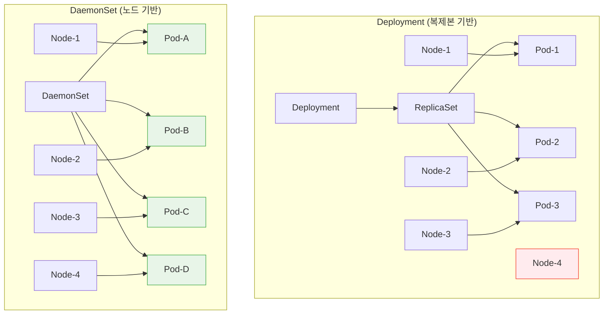
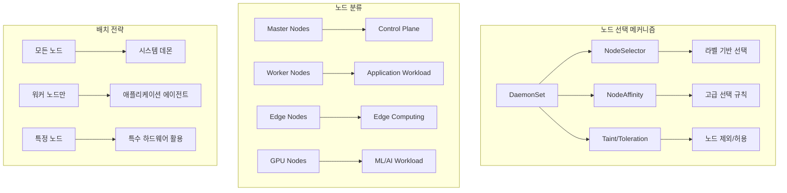
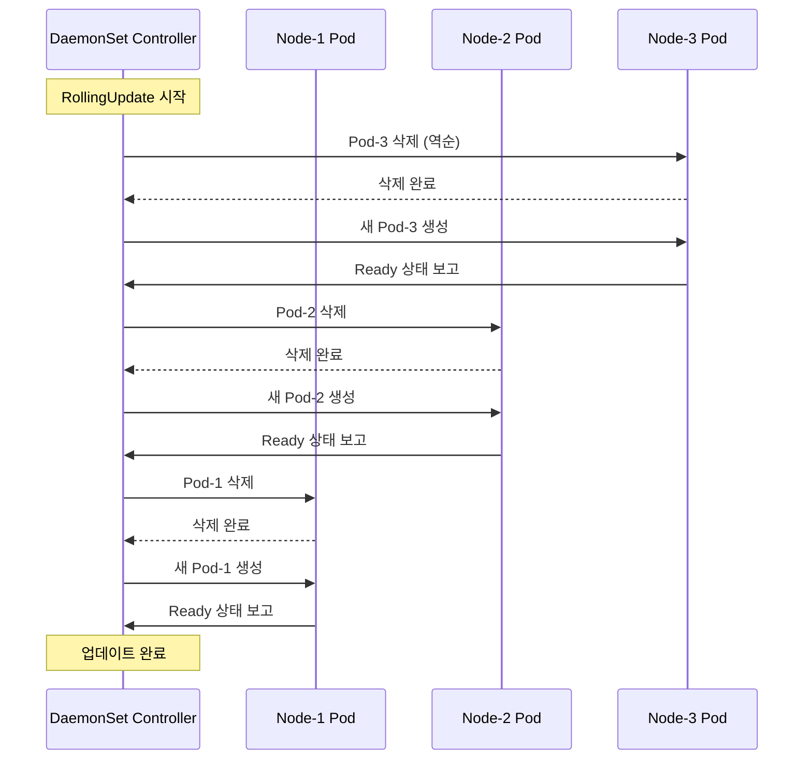

# Session 2: DaemonSet과 시스템 서비스 관리

## 📍 교과과정에서의 위치
이 세션은 **Week 3 > Day 1 > Session 2**로, 모든 노드에서 실행되어야 하는 시스템 서비스와 인프라 구성 요소를 관리하는 DaemonSet을 학습합니다.

## 학습 목표 (5분)
- **DaemonSet** 동작 원리와 **노드별 배포** 메커니즘 이해
- **시스템 데몬**과 **인프라 구성 요소** 관리 패턴 학습
- **노드 셀렉터**와 **Taint/Toleration** 활용 전략 파악
- **업데이트 전략**과 **롤아웃 제어** 방법 이해

## 1. DaemonSet 아키텍처와 동작 원리 (15분)

### DaemonSet vs Deployment 비교



### DaemonSet 핵심 특성 분석
```
DaemonSet 설계 원칙:

1. 노드별 단일 Pod 보장:
├── 각 노드에 정확히 하나의 Pod 실행
├── 새 노드 추가 시 자동으로 Pod 생성
├── 노드 제거 시 해당 Pod 자동 삭제
├── 노드 상태와 Pod 생명주기 연동
├── 스케줄러 우회 직접 배치 가능
└── 리소스 요구사항 기반 배치 제어

2. 시스템 레벨 권한:
├── 호스트 네트워크 접근 (hostNetwork: true)
├── 호스트 PID 네임스페이스 공유
├── 호스트 파일시스템 마운트
├── 특권 컨테이너 실행 지원
├── 시스템 리소스 직접 접근
└── 커널 모듈 로딩 및 관리

3. 노드 선택 및 제외:
├── NodeSelector: 라벨 기반 노드 선택
├── NodeAffinity: 고급 노드 선택 규칙
├── Taint/Toleration: 노드 제외 및 허용
├── 마스터 노드 배치 제어
├── 특정 노드 타입 타겟팅
└── 동적 노드 변경 대응

4. 업데이트 전략:
├── RollingUpdate: 순차적 업데이트
├── OnDelete: 수동 업데이트 제어
├── maxUnavailable: 동시 업데이트 Pod 수
├── 노드별 독립적 업데이트
├── 롤백 및 버전 관리
└── 업데이트 진행 상황 추적

DaemonSet 주요 사용 사례:
├── 로그 수집:
│   ├── Fluentd, Fluent Bit
│   ├── Logstash, Filebeat
│   ├── Vector, Promtail
│   ├── 노드별 로그 파일 수집
│   └── 중앙 로그 시스템 전송
├── 모니터링 에이전트:
│   ├── Node Exporter (Prometheus)
│   ├── cAdvisor (컨테이너 메트릭)
│   ├── Datadog Agent
│   ├── New Relic Infrastructure
│   └── 시스템 메트릭 수집
├── 네트워킹:
│   ├── CNI 플러그인 (Calico, Flannel)
│   ├── kube-proxy 대체
│   ├── 서비스 메시 데이터 플레인
│   ├── 네트워크 정책 에이전트
│   └── 로드 밸런서 구성 요소
├── 스토리지:
│   ├── CSI 드라이버
│   ├── 분산 스토리지 에이전트
│   ├── 백업 에이전트
│   ├── 스토리지 모니터링
│   └── 데이터 복제 서비스
├── 보안:
│   ├── 보안 스캐너
│   ├── 침입 탐지 시스템
│   ├── 컴플라이언스 에이전트
│   ├── 취약점 스캐너
│   └── 보안 정책 에이전트
└── 시스템 관리:
    ├── 노드 정리 도구
    ├── 시스템 업데이트 에이전트
    ├── 하드웨어 모니터링
    ├── 성능 튜닝 도구
    └── 백업 및 복구 에이전트
```

## 2. 노드 선택과 배치 전략 (12분)

### 노드 셀렉터와 어피니티 규칙



### 노드 선택 전략 상세 분석
```
DaemonSet 노드 선택 전략:

NodeSelector 패턴:
├── 기본 라벨 선택:
│   ├── kubernetes.io/os: linux
│   ├── kubernetes.io/arch: amd64
│   ├── node-role.kubernetes.io/worker: ""
│   ├── 커스텀 라벨: environment=production
│   └── 하드웨어 타입: hardware=gpu
├── 노드 역할 기반:
│   ├── 마스터 노드 제외
│   ├── 워커 노드 전용
│   ├── 엣지 노드 타겟팅
│   ├── 특수 목적 노드
│   └── 하이브리드 배치
├── 환경별 분리:
│   ├── 개발/스테이징/프로덕션
│   ├── 지역별 노드 그룹
│   ├── 가용 영역별 분산
│   ├── 클라우드 제공자별
│   └── 비용 최적화 그룹
└── 하드웨어 기반:
    ├── CPU 아키텍처 (x86, ARM)
    ├── GPU 유무 및 타입
    ├── 메모리 용량 기준
    ├── 스토리지 타입
    └── 네트워크 성능

NodeAffinity 고급 규칙:
├── Required 규칙:
│   ├── 필수 조건 (Hard Constraint)
│   ├── 조건 불만족 시 스케줄링 실패
│   ├── 복합 조건 지원 (AND/OR)
│   ├── 값 범위 지정 (In, NotIn)
│   └── 존재 여부 확인 (Exists, DoesNotExist)
├── Preferred 규칙:
│   ├── 선호 조건 (Soft Constraint)
│   ├── 가중치 기반 우선순위
│   ├── 최적 노드 선택
│   ├── 조건 불만족 시에도 배치
│   └── 성능 최적화 고려
├── 동적 조건:
│   ├── 노드 상태 기반 선택
│   ├── 리소스 사용률 고려
│   ├── 네트워크 토폴로지 인식
│   ├── 장애 도메인 분산
│   └── 비용 효율성 고려
└── 시간 기반 규칙:
    ├── 특정 시간대 배치
    ├── 유지보수 윈도우 회피
    ├── 피크 시간 고려
    ├── 배치 스케줄링
    └── 리소스 경합 최소화

Taint/Toleration 메커니즘:
├── Taint 유형:
│   ├── NoSchedule: 새 Pod 스케줄링 금지
│   ├── PreferNoSchedule: 가능하면 스케줄링 회피
│   ├── NoExecute: 기존 Pod 축출
│   ├── 커스텀 Taint: 특수 목적 노드
│   └── 시간 기반 Taint: 임시 제외
├── Toleration 전략:
│   ├── 정확한 매칭: key, value, effect 일치
│   ├── 키만 매칭: value 무시
│   ├── 연산자 사용: Equal, Exists
│   ├── 와일드카드: 모든 Taint 허용
│   └── 시간 제한: tolerationSeconds 설정
├── 실무 적용:
│   ├── 마스터 노드 보호
│   ├── GPU 노드 전용 사용
│   ├── 유지보수 모드 노드
│   ├── 문제 노드 격리
│   └── 특수 워크로드 분리
└── 동적 관리:
    ├── 자동 Taint 추가/제거
    ├── 노드 상태 기반 Taint
    ├── 스케줄러 확장
    ├── 커스텀 컨트롤러
    └── 정책 기반 자동화
```

## 3. 시스템 서비스 관리 패턴 (10분)

### 로그 수집 및 모니터링 아키텍처

```mermaid
graph TB
    subgraph "로그 수집 DaemonSet"
        A[Fluentd DaemonSet] --> B[Node-1 Pod]
        A --> C[Node-2 Pod]
        A --> D[Node-3 Pod]
        
        B --> E[/var/log 마운트]
        C --> F[/var/log 마운트]
        D --> G[/var/log 마운트]
        
        B --> H[Elasticsearch]
        C --> H
        D --> H
    end
    
    subgraph "모니터링 DaemonSet"
        I[Node Exporter] --> J[Node-1 Exporter]
        I --> K[Node-2 Exporter]
        I --> L[Node-3 Exporter]
        
        J --> M[Prometheus]
        K --> M
        L --> M
    end
    
    subgraph "네트워킹 DaemonSet"
        N[CNI Plugin] --> O[Node-1 CNI]
        N --> P[Node-2 CNI]
        N --> Q[Node-3 CNI]
        
        O --> R[Pod Network]
        P --> R
        Q --> R
    end
```

### 시스템 서비스 관리 전략
```
DaemonSet 시스템 서비스 관리:

로그 수집 패턴:
├── Fluentd/Fluent Bit 배포:
│   ├── 호스트 로그 디렉토리 마운트
│   ├── 컨테이너 로그 수집
│   ├── 시스템 로그 파싱
│   ├── 로그 필터링 및 변환
│   └── 중앙 로그 시스템 전송
├── 로그 라우팅:
│   ├── 애플리케이션별 분류
│   ├── 로그 레벨 기반 라우팅
│   ├── 민감 정보 마스킹
│   ├── 압축 및 배치 전송
│   └── 백프레셔 처리
├── 성능 최적화:
│   ├── 메모리 버퍼 관리
│   ├── 디스크 버퍼링
│   ├── 네트워크 배치 처리
│   ├── CPU 사용률 제한
│   └── 백그라운드 처리
└── 고가용성:
    ├── 로그 손실 방지
    ├── 재시작 시 위치 복구
    ├── 중복 제거
    ├── 오류 처리 및 재시도
    └── 모니터링 및 알림

모니터링 에이전트:
├── Node Exporter 배포:
│   ├── 시스템 메트릭 수집
│   ├── 하드웨어 정보 노출
│   ├── 파일시스템 사용률
│   ├── 네트워크 통계
│   └── 프로세스 정보
├── cAdvisor 통합:
│   ├── 컨테이너 메트릭
│   ├── 리소스 사용률
│   ├── 성능 통계
│   ├── 네트워크 I/O
│   └── 스토리지 I/O
├── 커스텀 메트릭:
│   ├── 애플리케이션 메트릭
│   ├── 비즈니스 메트릭
│   ├── SLA 메트릭
│   ├── 보안 메트릭
│   └── 비용 메트릭
└── 알림 통합:
    ├── 임계값 기반 알림
    ├── 이상 탐지
    ├── 예측적 알림
    ├── 에스컬레이션 정책
    └── 알림 피로도 관리

네트워킹 구성 요소:
├── CNI 플러그인:
│   ├── Pod 네트워크 설정
│   ├── IP 주소 할당
│   ├── 라우팅 테이블 관리
│   ├── 네트워크 정책 적용
│   └── 서비스 메시 통합
├── kube-proxy 대체:
│   ├── eBPF 기반 구현
│   ├── IPVS 모드 지원
│   ├── 성능 최적화
│   ├── 로드 밸런싱 개선
│   └── 네트워크 정책 통합
├── 서비스 메시 데이터 플레인:
│   ├── Envoy 프록시 배포
│   ├── 트래픽 인터셉션
│   ├── 보안 정책 적용
│   ├── 관찰 가능성 제공
│   └── 트래픽 관리
└── 네트워크 보안:
    ├── 방화벽 규칙 관리
    ├── 침입 탐지 시스템
    ├── 트래픽 분석
    ├── DDoS 방어
    └── 네트워크 세그멘테이션

스토리지 관리:
├── CSI 드라이버:
│   ├── 볼륨 생성 및 삭제
│   ├── 볼륨 어태치/디태치
│   ├── 볼륨 마운트/언마운트
│   ├── 스냅샷 관리
│   └── 볼륨 확장
├── 분산 스토리지:
│   ├── Ceph, GlusterFS 에이전트
│   ├── 데이터 복제 관리
│   ├── 장애 복구
│   ├── 성능 모니터링
│   └── 용량 관리
├── 백업 에이전트:
│   ├── 자동 백업 스케줄링
│   ├── 증분 백업
│   ├── 압축 및 암호화
│   ├── 원격 저장소 연동
│   └── 복구 테스트
└── 스토리지 최적화:
    ├── 중복 제거
    ├── 압축
    ├── 티어링
    ├── 캐싱
    └── 성능 튜닝
```

## 4. 업데이트 전략과 운영 관리 (10분)

### DaemonSet 업데이트 메커니즘



### 운영 관리 전략
```
DaemonSet 운영 및 관리:

업데이트 전략:
├── RollingUpdate 설정:
│   ├── maxUnavailable: 동시 업데이트 Pod 수
│   ├── 기본값: 1 (한 번에 하나씩)
│   ├── 백분율 지원: 25% (전체의 1/4)
│   ├── 절대값 지원: 3 (최대 3개)
│   └── 0 설정 시 순차 업데이트
├── OnDelete 전략:
│   ├── 수동 업데이트 제어
│   ├── Pod 삭제 시에만 업데이트
│   ├── 점진적 롤아웃 가능
│   ├── 문제 발생 시 중단 가능
│   └── 테스트 및 검증 시간 확보
├── 업데이트 모니터링:
│   ├── 업데이트 진행 상황 추적
│   ├── 실패한 노드 식별
│   ├── 롤백 조건 모니터링
│   ├── 성능 영향 측정
│   └── 서비스 가용성 확인
└── 롤백 전략:
    ├── 자동 롤백 조건 설정
    ├── 수동 롤백 절차
    ├── 이전 버전 보관
    ├── 설정 백업 및 복원
    └── 긴급 복구 계획

성능 최적화:
├── 리소스 관리:
│   ├── CPU/메모리 제한 설정
│   ├── 우선순위 클래스 지정
│   ├── QoS 클래스 최적화
│   ├── 노드 리소스 예약
│   └── 리소스 경합 최소화
├── 스케줄링 최적화:
│   ├── 노드 어피니티 활용
│   ├── Pod 안티 어피니티
│   ├── 토폴로지 분산 제약
│   ├── 우선순위 기반 스케줄링
│   └── 커스텀 스케줄러 사용
├── 네트워크 최적화:
│   ├── 호스트 네트워크 사용
│   ├── 네트워크 정책 최적화
│   ├── 대역폭 제한 설정
│   ├── 트래픽 셰이핑
│   └── 로드 밸런싱 최적화
└── 스토리지 최적화:
    ├── 로컬 스토리지 활용
    ├── 캐시 최적화
    ├── I/O 스케줄링
    ├── 압축 및 중복 제거
    └── 백업 최적화

문제 해결 및 디버깅:
├── 일반적인 문제:
│   ├── Pod 시작 실패
│   ├── 노드 선택 오류
│   ├── 권한 부족
│   ├── 리소스 부족
│   └── 네트워크 연결 문제
├── 디버깅 도구:
│   ├── kubectl describe daemonset
│   ├── kubectl get pods -o wide
│   ├── kubectl logs -f
│   ├── 노드별 상태 확인
│   └── 이벤트 모니터링
├── 모니터링 설정:
│   ├── Pod 상태 모니터링
│   ├── 리소스 사용률 추적
│   ├── 성능 메트릭 수집
│   ├── 로그 집계 및 분석
│   └── 알림 규칙 설정
└── 운영 자동화:
    ├── 자동 복구 메커니즘
    ├── 스케일링 자동화
    ├── 백업 자동화
    ├── 모니터링 자동화
    └── 알림 및 에스컬레이션

보안 고려사항:
├── 권한 관리:
│   ├── 최소 권한 원칙
│   ├── RBAC 설정
│   ├── Pod Security Context
│   ├── 네트워크 정책
│   └── 시크릿 관리
├── 이미지 보안:
│   ├── 이미지 스캔
│   ├── 서명 검증
│   ├── 취약점 관리
│   ├── 베이스 이미지 최적화
│   └── 정기 업데이트
├── 런타임 보안:
│   ├── 컨테이너 격리
│   ├── 시스템 호출 제한
│   ├── 파일시스템 보호
│   ├── 네트워크 격리
│   └── 감사 로깅
└── 컴플라이언스:
    ├── 보안 정책 준수
    ├── 감사 요구사항
    ├── 데이터 보호
    ├── 접근 제어
    └── 로그 보존
```

## 💬 그룹 토론: DaemonSet 운영 시 고려해야 할 핵심 요소 (8분)

### 토론 주제
**"프로덕션 환경에서 DaemonSet을 안전하고 효율적으로 운영하기 위한 핵심 고려사항은 무엇인가?"**

### 토론 가이드라인

#### 운영 안정성 (3분)
- **업데이트 전략**: RollingUpdate vs OnDelete 선택 기준
- **리소스 관리**: 노드 리소스 보호와 성능 최적화
- **장애 대응**: 노드 장애 시 서비스 연속성 보장

#### 보안 및 권한 (3분)
- **권한 최소화**: 시스템 레벨 접근 권한 관리
- **네트워크 보안**: 호스트 네트워크 사용 시 보안 고려사항
- **데이터 보호**: 로그 및 메트릭 데이터 보안

#### 성능 및 확장성 (2분)
- **리소스 효율성**: CPU/메모리 사용량 최적화
- **네트워크 최적화**: 대역폭 사용량 관리
- **스토리지 관리**: 로그 로테이션과 디스크 공간 관리

## 💡 핵심 개념 정리
- **DaemonSet**: 모든 노드에서 단일 Pod 실행을 보장하는 워크로드
- **노드 선택**: NodeSelector, NodeAffinity, Taint/Toleration 활용
- **시스템 서비스**: 로그 수집, 모니터링, 네트워킹 구성 요소 관리
- **업데이트 전략**: RollingUpdate와 OnDelete를 통한 안전한 업데이트

## 📚 참고 자료
- [DaemonSet](https://kubernetes.io/docs/concepts/workloads/controllers/daemonset/)
- [Node Selection](https://kubernetes.io/docs/concepts/scheduling-eviction/assign-pod-node/)
- [Taints and Tolerations](https://kubernetes.io/docs/concepts/scheduling-eviction/taint-and-toleration/)
- [DaemonSet Update Strategy](https://kubernetes.io/docs/tasks/manage-daemon/update-daemon-set/)

## 다음 세션 준비
다음 세션에서는 **Job과 CronJob 배치 처리 패턴**에 대해 학습합니다. 일회성 작업과 스케줄된 작업을 효율적으로 관리하는 방법을 다룰 예정입니다.