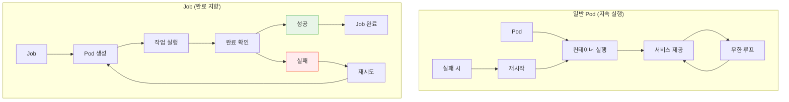
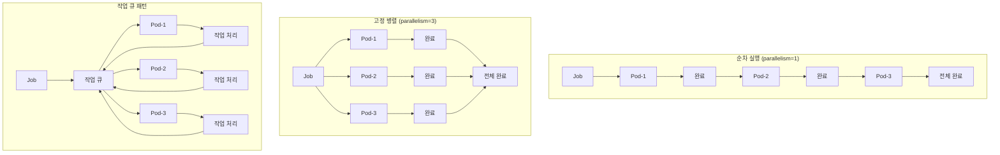
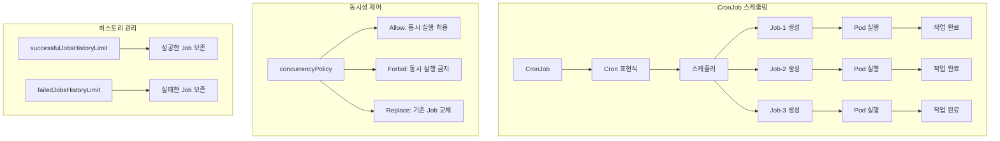
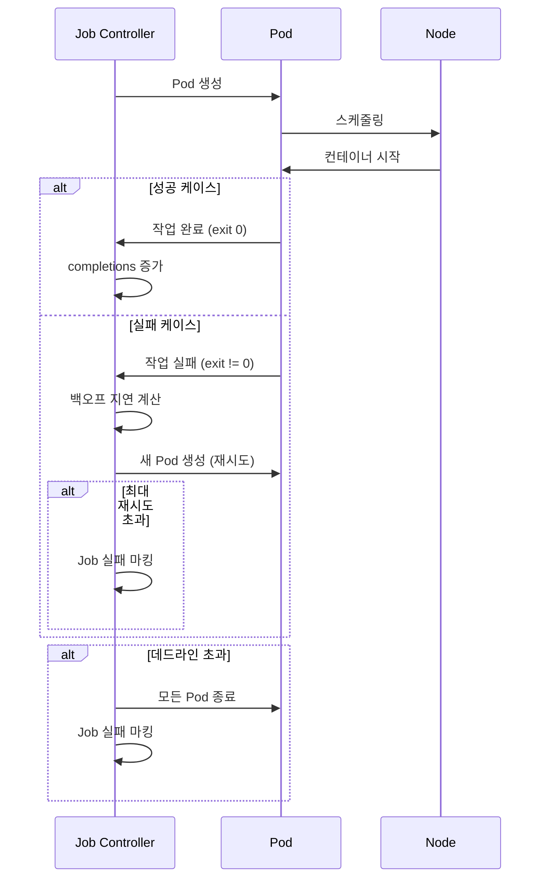

# Session 3: Job과 CronJob 배치 처리 패턴

## 📍 교과과정에서의 위치
이 세션은 **Week 3 > Day 1 > Session 3**로, 일회성 작업과 스케줄된 배치 작업을 관리하는 Job과 CronJob을 학습합니다.

## 학습 목표 (5분)
- **Job**과 **CronJob**의 **배치 처리** 메커니즘 이해
- **병렬 처리**와 **작업 큐** 패턴 학습
- **실패 처리**와 **재시도 전략** 설계 방법 파악
- **배치 워크로드** 최적화와 **리소스 관리** 전략 이해

## 1. Job 아키텍처와 실행 패턴 (15분)

### Job vs 일반 Pod 비교



### Job 실행 패턴 분석
```
Job 핵심 특성:

1. 완료 지향 실행:
├── 작업 완료 시 Pod 종료
├── 성공적인 완료 추적 (completions)
├── 실패 시 재시도 메커니즘
├── 최대 재시도 횟수 제한 (backoffLimit)
├── 활성 기한 설정 (activeDeadlineSeconds)
└── 완료 후 Pod 보존 (ttlSecondsAfterFinished)

2. 병렬 실행 지원:
├── 순차 실행: parallelism=1, completions=N
├── 고정 병렬: parallelism=M, completions=N
├── 작업 큐 패턴: parallelism=M, completions 미설정
├── 인덱스 기반 병렬: completionMode=Indexed
├── 동적 병렬도 조정
└── 리소스 기반 스케일링

3. 실패 처리 전략:
├── Pod 실패 시 재시작
├── 백오프 지연 (exponential backoff)
├── 최대 재시도 제한
├── 실패한 Pod 보존 옵션
├── 부분 실패 허용
└── 데드라인 기반 종료

4. 리소스 관리:
├── Pod 템플릿 기반 리소스 설정
├── 노드 선택 및 어피니티
├── 우선순위 클래스 지정
├── 리소스 쿼터 적용
└── 스팟 인스턴스 활용

Job 사용 사례:
├── 데이터 처리:
│   ├── ETL (Extract, Transform, Load)
│   ├── 데이터 마이그레이션
│   ├── 로그 분석 및 집계
│   ├── 이미지/비디오 처리
│   └── 대용량 파일 변환
├── 머신러닝:
│   ├── 모델 훈련 작업
│   ├── 하이퍼파라미터 튜닝
│   ├── 배치 추론
│   ├── 데이터 전처리
│   └── 모델 평가
├── 백업 및 유지보수:
│   ├── 데이터베이스 백업
│   ├── 로그 아카이빙
│   ├── 시스템 정리 작업
│   ├── 보안 스캔
│   └── 성능 테스트
├── 통합 및 동기화:
│   ├── 시스템 간 데이터 동기화
│   ├── API 데이터 수집
│   ├── 외부 시스템 통합
│   ├── 보고서 생성
│   └── 알림 발송
└── 개발 및 배포:
    ├── 빌드 및 테스트
    ├── 코드 품질 검사
    ├── 보안 스캔
    ├── 문서 생성
    └── 배포 후 검증
```

## 2. 병렬 처리와 작업 큐 패턴 (12분)

### 병렬 실행 모델



### 병렬 처리 전략 상세
```
Job 병렬 처리 패턴:

순차 실행 패턴:
├── 설정: parallelism=1, completions=N
├── 특징:
│   ├── 한 번에 하나의 Pod만 실행
│   ├── 이전 Pod 완료 후 다음 Pod 시작
│   ├── 리소스 사용량 예측 가능
│   ├── 순서 보장 필요한 작업
│   └── 디버깅 및 로그 추적 용이
├── 사용 사례:
│   ├── 데이터베이스 마이그레이션
│   ├── 순차적 데이터 처리
│   ├── 의존성 있는 작업
│   ├── 리소스 제약 환경
│   └── 테스트 및 검증 작업
└── 최적화:
    ├── Pod 시작 시간 최소화
    ├── 이미지 캐싱 활용
    ├── 리소스 요청 최적화
    ├── 노드 어피니티 설정
    └── 스토리지 최적화

고정 병렬 패턴:
├── 설정: parallelism=M, completions=N
├── 특징:
│   ├── 동시에 M개의 Pod 실행
│   ├── 총 N개의 작업 완료 목표
│   ├── 실패한 Pod 자동 재시작
│   ├── 일정한 병렬도 유지
│   └── 예측 가능한 완료 시간
├── 사용 사례:
│   ├── 이미지 처리 배치
│   ├── 로그 분석 작업
│   ├── 데이터 변환 작업
│   ├── 테스트 실행
│   └── 보고서 생성
├── 최적화:
│   ├── 적절한 병렬도 설정
│   ├── 리소스 경합 최소화
│   ├── 네트워크 대역폭 고려
│   ├── 스토리지 I/O 분산
│   └── 메모리 사용량 관리
└── 모니터링:
    ├── 진행률 추적
    ├── 실패율 모니터링
    ├── 리소스 사용률 확인
    ├── 완료 시간 예측
    └── 병목 지점 식별

작업 큐 패턴:
├── 설정: parallelism=M, completions 미설정
├── 특징:
│   ├── 외부 작업 큐 시스템 연동
│   ├── 동적 작업 할당
│   ├── 작업 완료 시 새 작업 처리
│   ├── 큐가 비면 Pod 종료
│   └── 탄력적 워커 관리
├── 구현 방식:
│   ├── Redis 기반 작업 큐
│   ├── RabbitMQ 메시지 큐
│   ├── Apache Kafka 스트림
│   ├── Cloud Pub/Sub
│   └── 커스텀 큐 시스템
├── 사용 사례:
│   ├── 실시간 데이터 처리
│   ├── 이벤트 기반 처리
│   ├── 마이크로서비스 통합
│   ├── 비동기 작업 처리
│   └── 스트림 처리
├── 장점:
│   ├── 동적 스케일링
│   ├── 작업 분산 최적화
│   ├── 실패 작업 재처리
│   ├── 우선순위 기반 처리
│   └── 백프레셔 처리
└── 고려사항:
    ├── 큐 시스템 가용성
    ├── 메시지 중복 처리
    ├── 독성 메시지 처리
    ├── 데드 레터 큐
    └── 모니터링 및 알림

인덱스 기반 병렬:
├── 설정: completionMode=Indexed
├── 특징:
│   ├── 각 Pod에 고유 인덱스 할당
│   ├── JOB_COMPLETION_INDEX 환경변수
│   ├── 인덱스 기반 작업 분할
│   ├── 순서 있는 병렬 처리
│   └── 부분 실패 추적 가능
├── 사용 사례:
│   ├── 배열 기반 데이터 처리
│   ├── 파일 분할 처리
│   ├── 매개변수 스위프
│   ├── 시뮬레이션 실행
│   └── A/B 테스트
├── 구현 패턴:
│   ├── 인덱스 기반 데이터 분할
│   ├── 설정 파일 매핑
│   ├── 결과 파일 명명
│   ├── 진행률 추적
│   └── 부분 결과 수집
└── 최적화:
    ├── 균등한 작업 분할
    ├── 인덱스 기반 캐싱
    ├── 결과 집계 최적화
    ├── 실패 복구 전략
    └── 성능 모니터링
```

## 3. CronJob과 스케줄링 패턴 (10분)

### CronJob 아키텍처



### CronJob 스케줄링 전략
```
CronJob 스케줄링 및 관리:

Cron 표현식 패턴:
├── 기본 형식: "분 시 일 월 요일"
├── 특수 문자:
│   ├── * : 모든 값
│   ├── ? : 특정하지 않음 (일, 요일)
│   ├── - : 범위 (1-5)
│   ├── , : 목록 (1,3,5)
│   ├── / : 간격 (*/5)
│   └── L : 마지막 (월말, 주말)
├── 일반적인 패턴:
│   ├── "0 2 * * *" : 매일 오전 2시
│   ├── "0 */6 * * *" : 6시간마다
│   ├── "0 0 * * 0" : 매주 일요일 자정
│   ├── "0 0 1 * *" : 매월 1일 자정
│   └── "0 0 1 1 *" : 매년 1월 1일 자정
├── 고급 패턴:
│   ├── "0 9-17 * * 1-5" : 평일 업무시간
│   ├── "*/15 * * * *" : 15분마다
│   ├── "0 0 L * *" : 매월 마지막 날
│   ├── "0 0 * * 1#1" : 매월 첫 번째 월요일
│   └── "0 2 1-7 * 1" : 매월 첫 번째 월요일
└── 시간대 고려:
    ├── UTC 기준 스케줄링
    ├── 로컬 시간대 변환
    ├── 일광절약시간 처리
    ├── 다중 시간대 지원
    └── 스케줄 검증 도구

동시성 제어 정책:
├── Allow (기본값):
│   ├── 동시 실행 허용
│   ├── 이전 Job 완료 대기 없음
│   ├── 리소스 사용량 증가 가능
│   ├── 독립적인 작업에 적합
│   └── 모니터링 필수
├── Forbid:
│   ├── 동시 실행 금지
│   ├── 이전 Job 실행 중이면 스킵
│   ├── 리소스 사용량 제한
│   ├── 장시간 실행 작업에 적합
│   └── 스킵된 실행 로깅
├── Replace:
│   ├── 기존 Job 종료 후 새 Job 시작
│   ├── 최신 실행만 유지
│   ├── 리소스 사용량 일정
│   ├── 실시간성 중요한 작업
│   └── 데이터 일관성 고려
└── 커스텀 정책:
    ├── 조건부 실행
    ├── 우선순위 기반
    ├── 리소스 기반 제어
    ├── 외부 시스템 연동
    └── 복합 조건 처리

히스토리 및 정리:
├── 성공한 Job 관리:
│   ├── successfulJobsHistoryLimit
│   ├── 기본값: 3개 보존
│   ├── 0 설정 시 즉시 삭제
│   ├── 디버깅 및 감사 목적
│   └── 스토리지 사용량 고려
├── 실패한 Job 관리:
│   ├── failedJobsHistoryLimit
│   ├── 기본값: 1개 보존
│   ├── 문제 분석 및 디버깅
│   ├── 알림 및 모니터링
│   └── 자동 정리 정책
├── TTL 기반 정리:
│   ├── ttlSecondsAfterFinished
│   ├── 완료 후 자동 삭제
│   ├── 리소스 절약
│   ├── 클러스터 정리
│   └── 규정 준수
└── 수동 정리:
    ├── kubectl delete job
    ├── 라벨 기반 일괄 삭제
    ├── 스크립트 자동화
    ├── 모니터링 연동
    └── 백업 후 삭제

실무 운영 패턴:
├── 백업 작업:
│   ├── 데이터베이스 백업
│   ├── 파일 시스템 백업
│   ├── 설정 백업
│   ├── 로그 아카이빙
│   └── 재해 복구 준비
├── 데이터 처리:
│   ├── 로그 집계 및 분석
│   ├── 보고서 생성
│   ├── 데이터 정리
│   ├── ETL 작업
│   └── 메트릭 계산
├── 시스템 유지보수:
│   ├── 임시 파일 정리
│   ├── 로그 로테이션
│   ├── 캐시 정리
│   ├── 인덱스 재구성
│   └── 성능 최적화
├── 모니터링 및 알림:
│   ├── 헬스체크 실행
│   ├── 성능 메트릭 수집
│   ├── 보안 스캔
│   ├── 컴플라이언스 검사
│   └── 상태 보고서 생성
└── 통합 및 동기화:
    ├── 외부 시스템 동기화
    ├── API 데이터 수집
    ├── 인벤토리 업데이트
    ├── 설정 동기화
    └── 라이선스 확인
```

## 4. 실패 처리와 최적화 전략 (10분)

### 실패 처리 메커니즘



### 최적화 및 모범 사례
```
Job/CronJob 최적화 전략:

실패 처리 최적화:
├── 백오프 전략:
│   ├── 지수 백오프 (exponential backoff)
│   ├── 초기 지연: 10초
│   ├── 최대 지연: 6분
│   ├── 재시도 간격 증가
│   └── 시스템 부하 분산
├── 재시도 제한:
│   ├── backoffLimit 설정
│   ├── 무한 재시도 방지
│   ├── 리소스 낭비 방지
│   ├── 빠른 실패 감지
│   └── 알림 및 에스컬레이션
├── 부분 실패 허용:
│   ├── 일부 Pod 실패 허용
│   ├── 최소 성공 기준 설정
│   ├── 데이터 품질 vs 완전성
│   ├── 비즈니스 요구사항 반영
│   └── 모니터링 및 알림
├── 실패 분석:
│   ├── 실패 원인 분류
│   ├── 로그 집계 및 분석
│   ├── 메트릭 기반 분석
│   ├── 자동 복구 가능성
│   └── 수동 개입 필요성
└── 복구 전략:
    ├── 자동 복구 메커니즘
    ├── 체크포인트 기반 재시작
    ├── 부분 결과 보존
    ├── 상태 복원
    └── 데이터 일관성 보장

성능 최적화:
├── 리소스 최적화:
│   ├── CPU/메모리 요청 최적화
│   ├── 리소스 제한 설정
│   ├── 노드 어피니티 활용
│   ├── 스팟 인스턴스 활용
│   └── 리소스 풀링
├── 스케줄링 최적화:
│   ├── 우선순위 클래스 설정
│   ├── 노드 선택 최적화
│   ├── Pod 안티 어피니티
│   ├── 토폴로지 분산 제약
│   └── 커스텀 스케줄러
├── 스토리지 최적화:
│   ├── 로컬 스토리지 활용
│   ├── 병렬 I/O 최적화
│   ├── 캐시 활용
│   ├── 압축 및 중복 제거
│   └── 네트워크 스토리지 최적화
├── 네트워크 최적화:
│   ├── 데이터 지역성 고려
│   ├── 배치 처리 최적화
│   ├── 압축 전송
│   ├── 연결 풀링
│   └── 대역폭 관리
└── 이미지 최적화:
    ├── 멀티 스테이지 빌드
    ├── 베이스 이미지 최적화
    ├── 레이어 캐싱
    ├── 이미지 압축
    └── 레지스트리 최적화

모니터링 및 관찰성:
├── 메트릭 수집:
│   ├── Job 실행 시간
│   ├── 성공/실패율
│   ├── 리소스 사용률
│   ├── 큐 대기 시간
│   └── 처리량 메트릭
├── 로그 관리:
│   ├── 구조화된 로깅
│   ├── 로그 집계
│   ├── 에러 로그 분석
│   ├── 성능 로그
│   └── 감사 로그
├── 알림 설정:
│   ├── 실패 알림
│   ├── 지연 알림
│   ├── 리소스 부족 알림
│   ├── SLA 위반 알림
│   └── 에스컬레이션 정책
├── 대시보드:
│   ├── 실시간 상태 모니터링
│   ├── 히스토리 트렌드
│   ├── 성능 메트릭
│   ├── 에러율 추적
│   └── 용량 계획
└── 자동화:
    ├── 자동 스케일링
    ├── 자동 복구
    ├── 자동 정리
    ├── 자동 알림
    └── 자동 보고

보안 및 컴플라이언스:
├── 접근 제어:
│   ├── RBAC 설정
│   ├── Pod Security Context
│   ├── 네트워크 정책
│   ├── 시크릿 관리
│   └── 이미지 보안
├── 데이터 보호:
│   ├── 암호화 전송
│   ├── 암호화 저장
│   ├── 데이터 마스킹
│   ├── 접근 로깅
│   └── 데이터 분류
├── 감사 및 컴플라이언스:
│   ├── 실행 로그 보존
│   ├── 변경 추적
│   ├── 접근 기록
│   ├── 규정 준수 확인
│   └── 보고서 생성
└── 취약점 관리:
    ├── 이미지 스캔
    ├── 의존성 검사
    ├── 보안 업데이트
    ├── 취약점 추적
    └── 패치 관리
```

## 💬 그룹 토론: 배치 작업 설계 시 고려해야 할 핵심 요소 (8분)

### 토론 주제
**"대규모 배치 작업을 설계할 때 성능, 안정성, 비용 효율성을 모두 고려한 최적의 전략은 무엇인가?"**

### 토론 가이드라인

#### 성능 최적화 (3분)
- **병렬 처리**: 적절한 병렬도 설정과 리소스 경합 최소화
- **데이터 분할**: 효율적인 작업 분할 전략
- **리소스 활용**: CPU, 메모리, 스토리지 최적화

#### 안정성 보장 (3분)
- **실패 처리**: 재시도 전략과 부분 실패 허용
- **모니터링**: 실시간 상태 추적과 알림 체계
- **복구 전략**: 체크포인트와 상태 복원

#### 비용 효율성 (2분)
- **리소스 관리**: 스팟 인스턴스와 리소스 스케줄링
- **스케일링**: 동적 스케일링과 리소스 풀링
- **최적화**: 실행 시간 단축과 리소스 사용량 최소화

## 💡 핵심 개념 정리
- **Job**: 완료 지향적인 일회성 작업 실행 워크로드
- **CronJob**: 스케줄 기반 반복 작업 실행 관리
- **병렬 처리**: 순차, 고정 병렬, 작업 큐, 인덱스 기반 패턴
- **실패 처리**: 백오프 전략, 재시도 제한, 부분 실패 허용

## 📚 참고 자료
- [Jobs](https://kubernetes.io/docs/concepts/workloads/controllers/job/)
- [CronJob](https://kubernetes.io/docs/concepts/workloads/controllers/cron-jobs/)
- [Parallel Processing](https://kubernetes.io/docs/concepts/workloads/controllers/job/#parallel-jobs)
- [Job Patterns](https://kubernetes.io/docs/concepts/workloads/controllers/job/#job-patterns)

## 다음 세션 준비
다음 세션에서는 **HPA와 VPA 자동 스케일링 이론**에 대해 학습합니다. 메트릭 기반 자동 스케일링과 리소스 최적화 전략을 다룰 예정입니다.