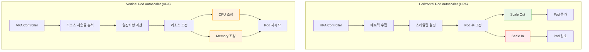
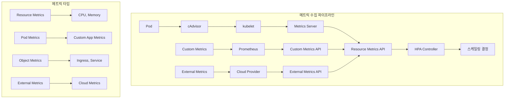
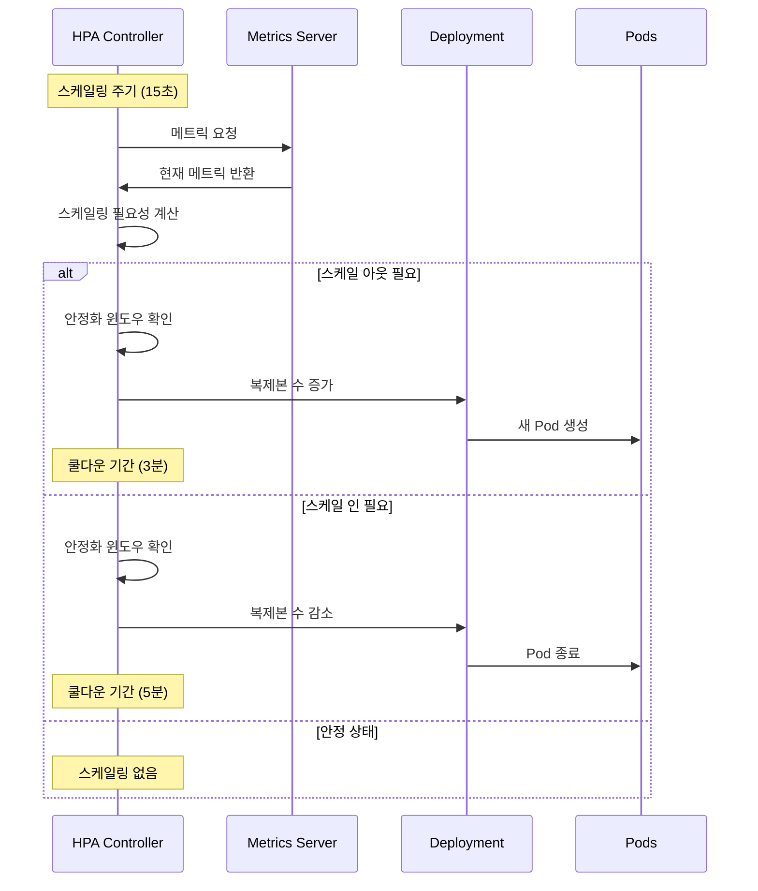
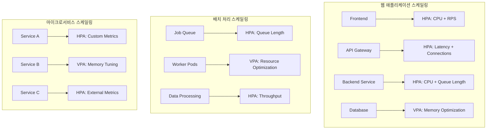

# Session 4: HPA와 VPA 자동 스케일링 이론

## 📍 교과과정에서의 위치
이 세션은 **Week 3 > Day 1 > Session 4**로, Kubernetes의 자동 스케일링 메커니즘인 HPA(Horizontal Pod Autoscaler)와 VPA(Vertical Pod Autoscaler)를 학습합니다.

## 학습 목표 (5분)
- **HPA**와 **VPA**의 **자동 스케일링** 원리와 차이점 이해
- **메트릭 기반** 스케일링과 **커스텀 메트릭** 활용 방법 학습
- **스케일링 정책**과 **안정성 보장** 메커니즘 파악
- **실무 적용** 시나리오와 **성능 최적화** 전략 이해

## 1. 자동 스케일링 개념과 아키텍처 (15분)

### HPA vs VPA 비교



### 자동 스케일링 원리 분석
```
자동 스케일링 핵심 개념:

HPA (Horizontal Pod Autoscaler):
   🔹 동작 원리:
      • 메트릭 기반 Pod 수 조정
      • 현재 메트릭 vs 목표 메트릭 비교
      • 스케일링 비율 계산
      • Deployment/ReplicaSet 조정
      • 점진적 스케일링 적용
   🔹 지원 메트릭:
      • 리소스 메트릭 (CPU, Memory)
      • Pod 메트릭 (커스텀 메트릭)
      • 오브젝트 메트릭 (Ingress, Service)
      • 외부 메트릭 (클라우드 서비스)
      • 복합 메트릭 (여러 메트릭 조합)
   🔹 스케일링 정책:
      • 최소/최대 복제본 수 설정
      • 스케일링 임계값 설정
      • 안정화 윈도우 (stabilization window)
      • 스케일링 속도 제한
      • 쿨다운 기간 설정
   🔹 장점:
      • 트래픽 변화에 빠른 대응
      • 리소스 효율성 향상
      • 가용성 보장
      • 비용 최적화
      • 자동화된 운영
   🔹 제한사항:
   🔹 Pod 시작 시간 고려 필요
   🔹 상태 저장 애플리케이션 제약
   🔹 네트워크/스토리지 병목
   🔹 라이선스 비용 증가
   🔹 복잡한 의존성 관리

VPA (Vertical Pod Autoscaler):
   🔹 동작 원리:
      • 리소스 사용률 히스토리 분석
      • 권장 리소스 요청/제한 계산
      • Pod 재시작을 통한 리소스 조정
      • 지속적인 최적화 수행
      • 리소스 효율성 개선
   🔹 구성 요소:
      • Recommender: 권장사항 계산
      • Updater: Pod 업데이트 수행
      • Admission Controller: 새 Pod 리소스 설정
      • History Storage: 메트릭 히스토리 저장
      • Metrics Provider: 메트릭 수집
   🔹 업데이트 모드:
      • Off: 권장사항만 제공
      • Initial: 새 Pod에만 적용
      • Recreation: Pod 재생성으로 적용
      • Auto: 자동 모드 (권장하지 않음)
      • 커스텀 정책 적용
   🔹 장점:
      • 리소스 사용률 최적화
      • 오버프로비저닝 방지
      • 성능 개선
      • 비용 절약
      • 자동 튜닝
   🔹 제한사항:
   🔹 Pod 재시작 필요
   🔹 상태 손실 가능성
   🔹 서비스 중단 시간
   🔹 복잡한 설정
   🔹 예측 불가능한 동작

스케일링 전략 비교:
   🔹 수평 스케일링 (HPA):
      • 적용 대상: 무상태 애플리케이션
      • 확장 방식: Pod 수 증가/감소
      • 응답 시간: 빠름 (Pod 시작 시간)
      • 리소스 효율: 중간
      • 복잡도: 낮음
      • 비용 영향: 선형 증가
   🔹 수직 스케일링 (VPA):
      • 적용 대상: 상태 저장 애플리케이션
      • 확장 방식: 리소스 크기 조정
      • 응답 시간: 느림 (재시작 필요)
      • 리소스 효율: 높음
      • 복잡도: 높음
      • 비용 영향: 최적화
   🔹 하이브리드 접근:
      • HPA + VPA 조합 사용
      • 워크로드별 최적 전략
      • 시간대별 전략 변경
      • 메트릭 기반 자동 선택
      • 비용 효율성 극대화
   🔹 선택 기준:
   🔹 애플리케이션 특성
   🔹 트래픽 패턴
   🔹 성능 요구사항
   🔹 비용 제약
   🔹 운영 복잡도
```

## 2. 메트릭 기반 스케일링 전략 (12분)

### 메트릭 수집 아키텍처



### 메트릭 기반 스케일링 상세
```
메트릭 기반 스케일링 전략:

리소스 메트릭 스케일링:
   🔹 CPU 기반 스케일링:
      • CPU 사용률 임계값 설정
      • 평균 CPU 사용률 계산
      • 목표 사용률 대비 비교
      • 스케일링 비율 결정
      • Pod 수 조정 실행
   🔹 메모리 기반 스케일링:
      • 메모리 사용률 모니터링
      • 메모리 누수 감지
      • 가비지 컬렉션 고려
      • 버퍼/캐시 사용량 분석
      • OOM 방지 전략
   🔹 복합 리소스 메트릭:
      • CPU + Memory 조합
      • 가중치 기반 계산
      • 우선순위 메트릭 설정
      • 임계값 조합 로직
      • 균형잡힌 스케일링
   🔹 최적화 전략:
      • 베이스라인 성능 측정
      • 피크 시간 패턴 분석
      • 리소스 요청 최적화
      • 임계값 동적 조정
      • 예측적 스케일링
   🔹 모니터링 및 튜닝:
   🔹 스케일링 히스토리 분석
   🔹 성능 영향 측정
   🔹 비용 효율성 평가
   🔹 임계값 최적화
   🔹 알림 및 대시보드

커스텀 메트릭 스케일링:
   🔹 애플리케이션 메트릭:
      • 요청 처리량 (RPS)
      • 응답 시간 (Latency)
      • 에러율 (Error Rate)
      • 큐 길이 (Queue Length)
      • 활성 연결 수
   🔹 비즈니스 메트릭:
      • 주문 처리량
      • 사용자 세션 수
      • 트랜잭션 볼륨
      • 데이터 처리량
      • SLA 메트릭
   🔹 인프라 메트릭:
      • 네트워크 대역폭
      • 디스크 I/O
      • 데이터베이스 연결
      • 캐시 히트율
      • 로드 밸런서 메트릭
   🔹 구현 방식:
      • Prometheus + Custom Metrics API
      • 애플리케이션 메트릭 노출
      • ServiceMonitor 설정
      • HPA 메트릭 쿼리 정의
      • 스케일링 정책 구성
   🔹 고급 패턴:
   🔹 다중 메트릭 조합
   🔹 조건부 스케일링
   🔹 시간 기반 가중치
   🔹 예측적 메트릭
   🔹 머신러닝 기반 예측

외부 메트릭 스케일링:
   🔹 클라우드 서비스 메트릭:
      • AWS CloudWatch
      • Google Cloud Monitoring
      • Azure Monitor
      • 메시지 큐 길이
      • 데이터베이스 성능
   🔹 서드파티 서비스:
      • CDN 메트릭
      • 로드 밸런서 메트릭
      • 외부 API 응답시간
      • 써드파티 SaaS 메트릭
      • 모니터링 서비스
   🔹 통합 방식:
      • External Metrics API
      • 메트릭 어댑터 구현
      • 인증 및 권한 설정
      • 메트릭 쿼리 최적화
      • 캐싱 및 배치 처리
   🔹 실무 사례:
      • SQS 큐 길이 기반 스케일링
      • RDS 연결 수 기반 조정
      • CDN 트래픽 기반 확장
      • 외부 API 지연시간 대응
      • 비즈니스 이벤트 기반 스케일링
   🔹 고려사항:
   🔹 네트워크 지연시간
   🔹 API 호출 비용
   🔹 메트릭 신뢰성
   🔹 장애 시 대체 방안
   🔹 보안 및 인증

스케일링 알고리즘:
   🔹 기본 알고리즘:
      • 현재 메트릭 / 목표 메트릭 비율
      • 올림/내림 처리
      • 최소/최대 복제본 제한
      • 스케일링 비율 제한
      • 안정화 윈도우 적용
   🔹 고급 알고리즘:
      • 지수 이동 평균
      • 예측적 스케일링
      • 머신러닝 기반 예측
      • 시계열 분석
      • 이상 탐지 기반 조정
   🔹 다중 메트릭 처리:
      • 최대값 선택 (max)
      • 평균값 계산 (average)
      • 가중 평균 (weighted)
      • 조건부 로직 (conditional)
      • 커스텀 함수
   🔹 스케일링 정책:
      • 공격적 스케일링 (빠른 대응)
      • 보수적 스케일링 (안정성 우선)
      • 적응적 스케일링 (학습 기반)
      • 시간 기반 스케일링
      • 이벤트 기반 스케일링
   🔹 최적화 기법:
   🔹 메트릭 평활화 (smoothing)
   🔹 노이즈 필터링
   🔹 이상값 제거
   🔹 트렌드 분석
   🔹 계절성 고려
```

## 3. 스케일링 정책과 안정성 보장 (10분)

### 스케일링 안정성 메커니즘



### 스케일링 정책 상세 분석
```
스케일링 정책 및 안정성:

안정화 메커니즘:
   🔹 안정화 윈도우 (Stabilization Window):
      • 스케일 업: 0초 (즉시 반응)
      • 스케일 다운: 300초 (5분 대기)
      • 메트릭 변동성 완화
      • 불필요한 스케일링 방지
      • 시스템 안정성 보장
   🔹 쿨다운 기간:
      • 스케일 업 후 대기: 3분
      • 스케일 다운 후 대기: 5분
      • 연속 스케일링 방지
      • 메트릭 안정화 시간 확보
      • 리소스 낭비 방지
   🔹 스케일링 속도 제한:
      • 최대 스케일 업 비율: 100% (2배)
      • 최대 스케일 다운 비율: 50% (절반)
      • 점진적 스케일링 강제
      • 급격한 변화 방지
      • 서비스 안정성 유지
   🔹 메트릭 평활화:
      • 이동 평균 계산
      • 노이즈 필터링
      • 이상값 제거
      • 트렌드 기반 결정
      • 예측 가능한 동작
   🔹 임계값 히스테리시스:
   🔹 스케일 업 임계값: 80%
   🔹 스케일 다운 임계값: 50%
   🔹 진동 방지
   🔹 명확한 결정 기준
   🔹 안정적인 운영

고급 스케일링 정책:
   🔹 행동 기반 정책 (Behavior):
      • scaleUp/scaleDown 정책 분리
      • 정책별 안정화 윈도우
      • 정책별 스케일링 속도
      • 조건부 정책 적용
      • 시간 기반 정책 변경
   🔹 다단계 스케일링:
      • 1단계: 보수적 스케일링
      • 2단계: 적극적 스케일링
      • 3단계: 긴급 스케일링
      • 메트릭 임계값별 차등 적용
      • 상황별 최적 대응
   🔹 예측적 스케일링:
      • 히스토리 데이터 분석
      • 트래픽 패턴 학습
      • 계절성 고려
      • 이벤트 기반 예측
      • 사전 예방적 스케일링
   🔹 적응적 스케일링:
      • 성능 피드백 기반 조정
      • 자동 임계값 최적화
      • 학습 기반 정책 개선
      • 환경 변화 적응
      • 지속적 최적화
   🔹 하이브리드 정책:
   🔹 시간대별 정책 변경
   🔹 워크로드별 정책 적용
   🔹 메트릭 조합 기반 결정
   🔹 비즈니스 규칙 통합
   🔹 다중 전략 조합

리소스 관리 최적화:
   🔹 리소스 요청 최적화:
      • VPA 권장사항 활용
      • 히스토리 기반 조정
      • 오버프로비저닝 최소화
      • 언더프로비저닝 방지
      • 비용 효율성 극대화
   🔹 노드 리소스 관리:
      • 노드 용량 고려
      • 리소스 단편화 방지
      • 노드 어피니티 활용
      • 스팟 인스턴스 통합
      • 클러스터 오토스케일러 연동
   🔹 스토리지 최적화:
      • 영구 볼륨 관리
      • 스토리지 클래스 최적화
      • 데이터 지역성 고려
      • 백업 및 복구 전략
      • 성능 최적화
   🔹 네트워크 최적화:
      • 서비스 메시 통합
      • 로드 밸런싱 최적화
      • 네트워크 정책 적용
      • 트래픽 분산 전략
      • 대역폭 관리
   🔹 모니터링 통합:
   🔹 실시간 메트릭 수집
   🔹 성능 대시보드
   🔹 알림 및 에스컬레이션
   🔹 용량 계획
   🔹 비용 추적

장애 대응 및 복구:
   🔹 스케일링 실패 처리:
      • 리소스 부족 대응
      • 노드 장애 처리
      • 네트워크 문제 해결
      • 이미지 풀 실패 대응
      • 권한 문제 해결
   🔹 메트릭 수집 장애:
      • 메트릭 서버 장애 대응
      • 대체 메트릭 소스
      • 캐시된 메트릭 활용
      • 수동 스케일링 전환
      • 장애 복구 자동화
   🔹 롤백 및 복구:
      • 이전 상태 복원
      • 설정 백업 활용
      • 점진적 복구
      • 서비스 연속성 보장
      • 근본 원인 분석
   🔹 비상 계획:
      • 수동 스케일링 절차
      • 긴급 연락 체계
      • 에스컬레이션 정책
      • 외부 지원 요청
      • 사후 분석 및 개선
   🔹 테스트 및 검증:
   🔹 카오스 엔지니어링
   🔹 부하 테스트
   🔹 장애 시뮬레이션
   🔹 복구 시간 측정
   🔹 개선 사항 적용
```

## 4. 실무 적용 시나리오와 최적화 (10분)

### 실무 스케일링 패턴



### 실무 최적화 전략
```
실무 스케일링 최적화:

웹 애플리케이션 패턴:
   🔹 프론트엔드 스케일링:
      • CPU 사용률 기반 (70% 임계값)
      • 동시 연결 수 모니터링
      • 응답 시간 기반 조정
      • CDN 캐시 히트율 고려
      • 정적 자원 최적화
   🔹 API 게이트웨이:
      • 요청 처리량 (RPS) 기반
      • 지연시간 임계값 설정
      • 에러율 모니터링
      • 백엔드 서비스 상태 고려
      • 레이트 리미팅 통합
   🔹 백엔드 서비스:
      • 비즈니스 로직 복잡도 고려
      • 데이터베이스 연결 풀 관리
      • 캐시 활용률 최적화
      • 메시지 큐 길이 모니터링
      • 써드파티 API 의존성 관리
   🔹 데이터베이스:
      • VPA를 통한 메모리 최적화
      • 연결 풀 크기 조정
      • 쿼리 성능 모니터링
      • 읽기 전용 복제본 스케일링
      • 샤딩 전략 고려
   🔹 통합 최적화:
   🔹 서비스 간 의존성 고려
   🔹 전체 시스템 성능 모니터링
   🔹 병목 지점 식별 및 해결
   🔹 비용 효율성 분석
   🔹 SLA 준수 확인

배치 처리 최적화:
   🔹 작업 큐 기반 스케일링:
      • 큐 길이 임계값 설정
      • 작업 처리 시간 고려
      • 우선순위 큐 지원
      • 데드 레터 큐 처리
      • 백프레셔 메커니즘
   🔹 워커 Pod 최적화:
      • VPA를 통한 리소스 튜닝
      • 작업별 리소스 요구사항
      • 메모리 누수 방지
      • CPU 집약적 작업 최적화
      • I/O 병목 해결
   🔹 데이터 처리 패턴:
      • 처리량 기반 스케일링
      • 데이터 크기 고려
      • 병렬 처리 최적화
      • 체크포인트 메커니즘
      • 실패 복구 전략
   🔹 스케줄링 최적화:
      • 시간대별 스케일링 정책
      • 리소스 가용성 고려
      • 비용 최적화 스케줄링
      • 우선순위 기반 처리
      • SLA 기반 조정
   🔹 모니터링 및 알림:
   🔹 처리 지연 모니터링
   🔹 실패율 추적
   🔹 리소스 사용률 분석
   🔹 비용 추적
   🔹 성능 트렌드 분석

마이크로서비스 최적화:
   🔹 서비스별 맞춤 전략:
      • 서비스 특성 분석
      • 트래픽 패턴 이해
      • 의존성 관계 고려
      • 데이터 일관성 요구사항
      • 성능 목표 설정
   🔹 서비스 메시 통합:
      • Istio HPA 통합
      • 트래픽 분산 최적화
      • 서킷 브레이커 연동
      • 카나리 배포 지원
      • 관찰 가능성 향상
   🔹 데이터 저장소 최적화:
      • 데이터베이스별 전략
      • 캐시 레이어 최적화
      • 읽기/쓰기 분리
      • 샤딩 및 파티셔닝
      • 백업 및 복구
   🔹 통신 최적화:
      • 동기/비동기 통신 최적화
      • 메시지 큐 활용
      • 이벤트 기반 아키텍처
      • API 게이트웨이 최적화
      • 네트워크 지연 최소화
   🔹 운영 자동화:
   🔹 CI/CD 파이프라인 통합
   🔹 자동 테스트 및 검증
   🔹 카나리 배포 자동화
   🔹 롤백 자동화
   🔹 모니터링 자동화

성능 튜닝 및 최적화:
   🔹 메트릭 최적화:
      • 메트릭 수집 주기 조정
      • 메트릭 정확도 향상
      • 노이즈 필터링
      • 이상값 처리
      • 예측 모델 개선
   🔹 알고리즘 튜닝:
      • 임계값 최적화
      • 안정화 윈도우 조정
      • 스케일링 속도 최적화
      • 쿨다운 기간 조정
      • 커스텀 알고리즘 개발
   🔹 리소스 효율성:
      • 오버프로비저닝 최소화
      • 언더프로비저닝 방지
      • 리소스 활용률 극대화
      • 비용 최적화
      • 성능 vs 비용 균형
   🔹 운영 최적화:
      • 자동화 수준 향상
      • 수동 개입 최소화
      • 장애 대응 자동화
      • 용량 계획 자동화
      • 보고 및 분석 자동화
   🔹 지속적 개선:
   🔹 성능 벤치마킹
   🔹 A/B 테스트
   🔹 카나리 분석
   🔹 피드백 루프 구축
   🔹 베스트 프랙티스 적용
```

## 💬 그룹 토론: 자동 스케일링 전략 선택 기준 (8분)

### 토론 주제
**"다양한 워크로드에 대해 HPA와 VPA 중 어떤 전략을 선택해야 하며, 그 결정 기준은 무엇인가?"**

### 토론 가이드라인

#### 워크로드 특성 분석 (3분)
- **상태 저장 vs 무상태**: 애플리케이션 특성에 따른 스케일링 전략
- **트래픽 패턴**: 예측 가능한 패턴 vs 급변하는 트래픽
- **리소스 사용 패턴**: CPU 집약적 vs 메모리 집약적

#### 비즈니스 요구사항 (3분)
- **가용성 요구사항**: 서비스 중단 허용도
- **성능 목표**: 응답시간, 처리량 요구사항
- **비용 제약**: 예산 한계와 비용 최적화 우선순위

#### 운영 복잡도 (2분)
- **관리 복잡성**: 설정 및 유지보수 복잡도
- **모니터링 요구사항**: 필요한 메트릭과 알림 체계
- **장애 대응**: 문제 발생 시 대응 방안

## 💡 핵심 개념 정리
- **HPA**: 메트릭 기반 수평적 Pod 스케일링으로 트래픽 변화 대응
- **VPA**: 리소스 사용률 분석을 통한 수직적 리소스 최적화
- **메트릭 기반 스케일링**: 리소스, 커스텀, 외부 메트릭 활용 전략
- **안정성 보장**: 안정화 윈도우, 쿨다운, 속도 제한을 통한 안정적 운영

## 📚 참고 자료
- [Horizontal Pod Autoscaler](https://kubernetes.io/docs/tasks/run-application/horizontal-pod-autoscaler/)
- [Vertical Pod Autoscaler](https://github.com/kubernetes/autoscaler/tree/master/vertical-pod-autoscaler)
- [Custom Metrics API](https://kubernetes.io/docs/tasks/run-application/horizontal-pod-autoscaler-walkthrough/#autoscaling-on-multiple-metrics-and-custom-metrics)
- [HPA Algorithm](https://kubernetes.io/docs/tasks/run-application/horizontal-pod-autoscaler/#algorithm-details)

## 다음 세션 준비
다음 세션에서는 **커스텀 리소스와 Operator 패턴**에 대해 학습합니다. Kubernetes 확장성과 도메인 특화 자동화 구현 방법을 다룰 예정입니다.