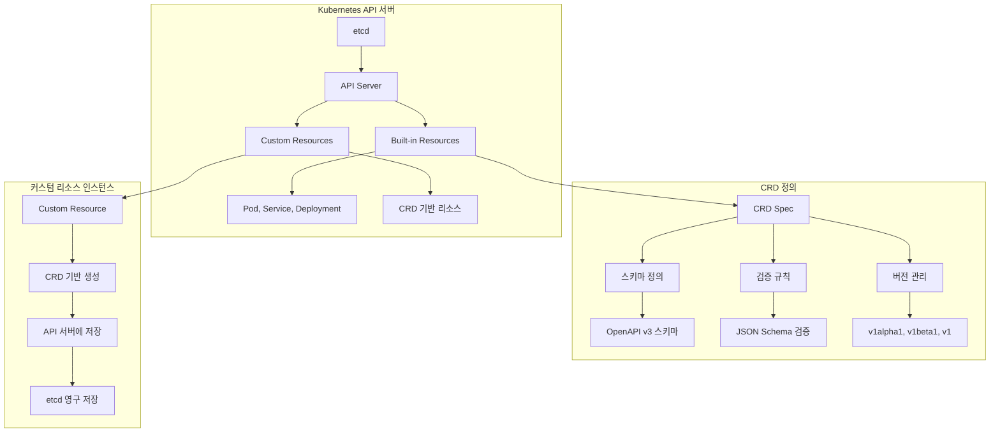
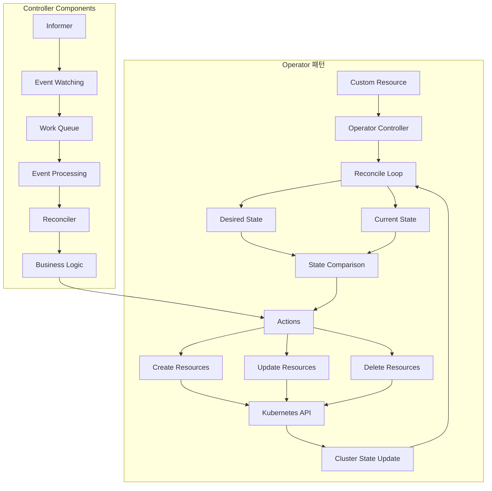
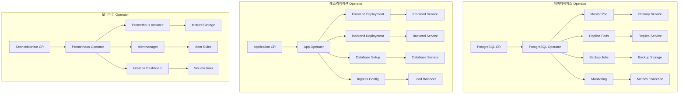
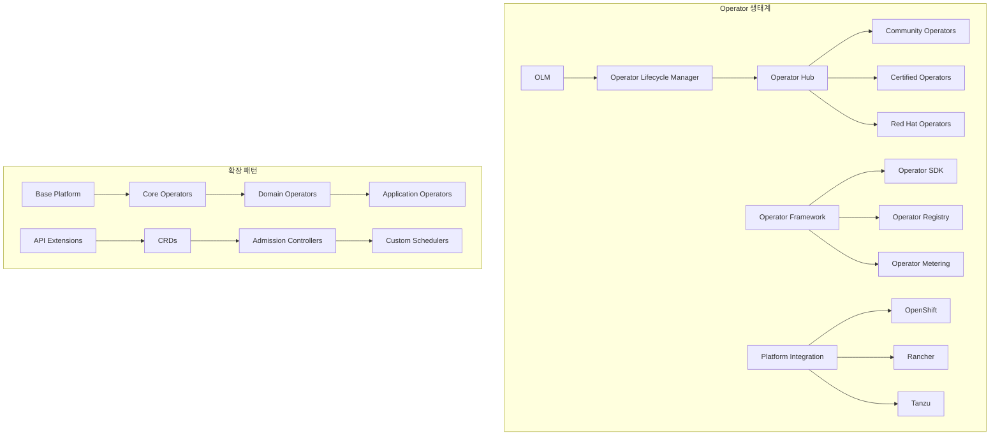

# Session 5: 커스텀 리소스와 Operator 패턴

## 📍 교과과정에서의 위치
이 세션은 **Week 3 > Day 1 > Session 5**로, Kubernetes의 확장성을 활용한 커스텀 리소스와 Operator 패턴을 학습합니다.

## 학습 목표 (5분)
- **CRD**(Custom Resource Definition)와 **커스텀 리소스** 개념 이해
- **Operator 패턴**과 **컨트롤러** 개발 원리 학습
- **도메인 특화 자동화** 구현과 **확장 가능한 플랫폼** 설계 파악
- **실무 Operator** 사례와 **개발 프레임워크** 활용 방법 이해

## 1. 커스텀 리소스와 CRD 개념 (15분)

### Kubernetes API 확장 아키텍처



### CRD와 커스텀 리소스 상세 분석
```
커스텀 리소스 확장 개념:

CRD (Custom Resource Definition):
├── 기본 개념:
│   ├── Kubernetes API 확장 메커니즘
│   ├── 새로운 리소스 타입 정의
│   ├── 기본 리소스와 동일한 API 경험
│   ├── kubectl 명령어 지원
│   └── RBAC 통합 지원
├── 스키마 정의:
│   ├── OpenAPI v3 스키마 사용
│   ├── JSON Schema 기반 검증
│   ├── 필드 타입 및 제약 조건
│   ├── 중첩 객체 지원
│   └── 배열 및 맵 구조 지원
├── 버전 관리:
│   ├── 다중 버전 지원 (v1alpha1, v1beta1, v1)
│   ├── 버전 간 변환 지원
│   ├── 스키마 진화 관리
│   ├── 하위 호환성 보장
│   └── 마이그레이션 전략
├── 검증 및 기본값:
│   ├── 필드 필수/선택 지정
│   ├── 값 범위 및 패턴 검증
│   ├── 기본값 설정
│   ├── 열거형 값 제한
│   └── 커스텀 검증 로직
└── 고급 기능:
    ├── Subresources (status, scale)
    ├── 추가 프린터 컬럼
    ├── 카테고리 및 단축명
    ├── 스코프 설정 (Namespaced/Cluster)
    └── 보존 필드 (preserveUnknownFields)

커스텀 리소스 활용 패턴:
├── 설정 관리:
│   ├── 애플리케이션 설정 추상화
│   ├── 환경별 설정 관리
│   ├── 설정 템플릿 및 상속
│   ├── 동적 설정 업데이트
│   └── 설정 검증 및 기본값
├── 워크로드 추상화:
│   ├── 복잡한 애플리케이션 배포
│   ├── 다중 컴포넌트 조합
│   ├── 의존성 관리
│   ├── 생명주기 관리
│   └── 업그레이드 전략
├── 인프라 리소스:
│   ├── 클라우드 리소스 추상화
│   ├── 네트워크 설정 관리
│   ├── 스토리지 프로비저닝
│   ├── 보안 정책 관리
│   └── 모니터링 설정
├── 비즈니스 도메인:
│   ├── 도메인 특화 개념 모델링
│   ├── 비즈니스 규칙 구현
│   ├── 워크플로우 정의
│   ├── 상태 머신 구현
│   └── 이벤트 기반 처리
└── 통합 및 확장:
    ├── 외부 시스템 통합
    ├── API 게이트웨이 설정
    ├── 서비스 메시 구성
    ├── 모니터링 통합
    └── CI/CD 파이프라인

CRD 설계 원칙:
├── API 설계:
│   ├── RESTful 원칙 준수
│   ├── 직관적인 리소스 명명
│   ├── 일관된 필드 구조
│   ├── 명확한 의미론
│   └── 확장 가능한 스키마
├── 스키마 설계:
│   ├── 최소 필수 필드
│   ├── 합리적인 기본값
│   ├── 명확한 검증 규칙
│   ├── 문서화된 필드
│   └── 예제 제공
├── 버전 관리:
│   ├── 의미론적 버전 관리
│   ├── 하위 호환성 유지
│   ├── 점진적 기능 추가
│   ├── 명확한 마이그레이션 경로
│   └── 지원 중단 정책
├── 보안 고려사항:
│   ├── 최소 권한 원칙
│   ├── 민감 정보 보호
│   ├── 입력 검증 강화
│   ├── 감사 로깅
│   └── 네트워크 정책 통합
└── 성능 최적화:
    ├── 효율적인 스키마 설계
    ├── 인덱싱 고려
    ├── 대용량 데이터 처리
    ├── 캐싱 전략
    └── 리소스 사용량 최적화
```

## 2. Operator 패턴과 컨트롤러 개발 (12분)

### Operator 아키텍처



### Operator 패턴 상세 분석
```
Operator 패턴 핵심 개념:

Operator 정의:
├── 개념:
│   ├── 도메인 특화 지식을 코드로 구현
│   ├── 인간 운영자의 지식과 경험 자동화
│   ├── 애플리케이션 생명주기 관리
│   ├── 복잡한 운영 작업 자동화
│   └── 선언적 API를 통한 관리
├── 구성 요소:
│   ├── Custom Resource Definition (CRD)
│   ├── Controller (Operator 로직)
│   ├── Custom Resource 인스턴스
│   ├── 관련 Kubernetes 리소스
│   └── 외부 시스템 통합
├── 동작 원리:
│   ├── Watch: 리소스 변경 감지
│   ├── Analyze: 현재 상태 vs 원하는 상태
│   ├── Act: 차이를 해결하는 액션 수행
│   ├── Repeat: 지속적인 모니터링 및 조정
│   └── Event-driven: 이벤트 기반 반응형 처리
├── 장점:
│   ├── 도메인 전문 지식 캡슐화
│   ├── 일관된 운영 절차
│   ├── 자동화된 복구 및 확장
│   ├── 선언적 관리 방식
│   └── Kubernetes 네이티브 통합
└── 사용 사례:
    ├── 데이터베이스 클러스터 관리
    ├── 애플리케이션 배포 및 업그레이드
    ├── 백업 및 복구 자동화
    ├── 모니터링 및 알림 설정
    └── 보안 정책 관리

Controller 개발 패턴:
├── Reconcile Loop:
│   ├── 이벤트 기반 트리거
│   ├── 현재 상태 조회
│   ├── 원하는 상태 분석
│   ├── 차이점 식별
│   └── 조정 액션 수행
├── Event Handling:
│   ├── Create 이벤트 처리
│   ├── Update 이벤트 처리
│   ├── Delete 이벤트 처리
│   ├── Status 업데이트
│   └── Error 처리 및 재시도
├── State Management:
│   ├── Spec vs Status 분리
│   ├── 상태 전이 관리
│   ├── 조건부 로직 구현
│   ├── 의존성 관리
│   └── 롤백 및 복구
├── Resource Management:
│   ├── 소유권 관계 설정
│   ├── 가비지 컬렉션 활용
│   ├── 리소스 생명주기 관리
│   ├── 네임스페이스 관리
│   └── 라벨 및 어노테이션 활용
└── Error Handling:
    ├── 재시도 전략 (exponential backoff)
    ├── 에러 분류 및 처리
    ├── 상태 보고 및 이벤트 생성
    ├── 로깅 및 메트릭 수집
    └── 알림 및 에스컬레이션

Operator 성숙도 모델:
├── Level 1 - Basic Install:
│   ├── 자동화된 애플리케이션 프로비저닝
│   ├── 설치 및 설정 자동화
│   ├── 기본 구성 관리
│   ├── 단순한 생명주기 관리
│   └── 수동 업그레이드
├── Level 2 - Seamless Upgrades:
│   ├── 자동화된 업그레이드
│   ├── 패치 관리
│   ├── 마이너 버전 업데이트
│   ├── 설정 마이그레이션
│   └── 롤백 지원
├── Level 3 - Full Lifecycle:
│   ├── 애플리케이션 생명주기 완전 관리
│   ├── 백업 및 복구
│   ├── 장애 감지 및 복구
│   ├── 스케일링 자동화
│   └── 모니터링 통합
├── Level 4 - Deep Insights:
│   ├── 메트릭 및 로그 분석
│   ├── 성능 최적화
│   ├── 용량 계획
│   ├── 이상 탐지
│   └── 예측적 분석
└── Level 5 - Auto Pilot:
    ├── 완전 자율 운영
    ├── 자가 치유 시스템
    ├── 자동 튜닝
    ├── 예측적 스케일링
    └── 지능형 의사결정

개발 프레임워크:
├── Kubebuilder:
│   ├── Go 기반 Operator 개발
│   ├── 코드 생성 및 스캐폴딩
│   ├── 테스트 프레임워크 통합
│   ├── 웹훅 지원
│   └── 베스트 프랙티스 적용
├── Operator SDK:
│   ├── 다중 언어 지원 (Go, Ansible, Helm)
│   ├── 빠른 프로토타이핑
│   ├── 기존 도구 활용
│   ├── 테스트 및 디버깅 도구
│   └── OLM 통합
├── KUDO (Kubernetes Universal Declarative Operator):
│   ├── YAML 기반 Operator 정의
│   ├── 코드 없는 Operator 개발
│   ├── 계획 기반 실행
│   ├── 매개변수화된 배포
│   └── 테스트 프레임워크
├── Metacontroller:
│   ├── 경량 컨트롤러 프레임워크
│   ├── 웹훅 기반 로직
│   ├── 다중 언어 지원
│   ├── 간단한 컨트롤러 구현
│   └── 프로토타이핑 최적화
└── 커스텀 개발:
    ├── client-go 라이브러리 활용
    ├── controller-runtime 사용
    ├── 완전한 제어 및 커스터마이징
    ├── 성능 최적화 가능
    └── 복잡한 비즈니스 로직 구현
```

## 3. 도메인 특화 자동화 구현 (10분)

### 실무 Operator 사례



### 도메인 특화 자동화 패턴
```
도메인 특화 Operator 구현:

데이터베이스 Operator:
├── PostgreSQL Operator:
│   ├── 클러스터 생성 및 관리
│   ├── 마스터-슬레이브 복제 설정
│   ├── 자동 페일오버
│   ├── 백업 및 복구 자동화
│   └── 성능 모니터링 및 튜닝
├── MySQL Operator:
│   ├── InnoDB 클러스터 관리
│   ├── 읽기 전용 복제본 스케일링
│   ├── 백업 스케줄링
│   ├── 업그레이드 자동화
│   └── 보안 설정 관리
├── MongoDB Operator:
│   ├── 레플리카 세트 관리
│   ├── 샤딩 클러스터 구성
│   ├── 인덱스 관리
│   ├── 압축 및 아카이빙
│   └── 성능 최적화
├── Redis Operator:
│   ├── 클러스터 모드 관리
│   ├── 센티넬 구성
│   ├── 메모리 최적화
│   ├── 지속성 설정
│   └── 모니터링 통합
└── 공통 패턴:
    ├── 상태 저장 워크로드 관리
    ├── 데이터 일관성 보장
    ├── 백업 및 복구 전략
    ├── 성능 모니터링
    └── 보안 및 접근 제어

애플리케이션 Operator:
├── 마이크로서비스 Operator:
│   ├── 서비스 간 의존성 관리
│   ├── 설정 관리 및 배포
│   ├── 서비스 메시 통합
│   ├── 카나리 배포 자동화
│   └── 모니터링 및 추적
├── 웹 애플리케이션 Operator:
│   ├── 프론트엔드/백엔드 조합 배포
│   ├── 데이터베이스 연동
│   ├── CDN 설정
│   ├── SSL 인증서 관리
│   └── 로드 밸런싱 구성
├── 배치 처리 Operator:
│   ├── 작업 스케줄링
│   ├── 의존성 기반 실행
│   ├── 리소스 할당 최적화
│   ├── 실패 처리 및 재시도
│   └── 결과 수집 및 보고
├── ML/AI Operator:
│   ├── 모델 훈련 파이프라인
│   ├── 하이퍼파라미터 튜닝
│   ├── 모델 서빙 자동화
│   ├── A/B 테스트 지원
│   └── 모델 버전 관리
└── 통합 패턴:
    ├── GitOps 통합
    ├── CI/CD 파이프라인 연동
    ├── 보안 정책 적용
    ├── 비용 최적화
    └── 컴플라이언스 관리

인프라 Operator:
├── 네트워킹 Operator:
│   ├── CNI 플러그인 관리
│   ├── 네트워크 정책 자동화
│   ├── 로드 밸런서 구성
│   ├── DNS 관리
│   └── 방화벽 규칙 설정
├── 스토리지 Operator:
│   ├── CSI 드라이버 관리
│   ├── 볼륨 프로비저닝
│   ├── 스냅샷 관리
│   ├── 백업 자동화
│   └── 성능 최적화
├── 보안 Operator:
│   ├── 인증서 관리 (cert-manager)
│   ├── 시크릿 로테이션
│   ├── 보안 정책 적용
│   ├── 취약점 스캔
│   └── 컴플라이언스 검사
├── 모니터링 Operator:
│   ├── Prometheus 설정 관리
│   ├── 알림 규칙 자동화
│   ├── 대시보드 생성
│   ├── 로그 수집 설정
│   └── 메트릭 집계
└── 클라우드 통합:
    ├── 클라우드 리소스 프로비저닝
    ├── IAM 역할 관리
    ├── 비용 모니터링
    ├── 리소스 태깅
    └── 정책 적용

개발 모범 사례:
├── 설계 원칙:
│   ├── 단일 책임 원칙
│   ├── 멱등성 보장
│   ├── 상태 기반 조정
│   ├── 이벤트 기반 반응
│   └── 장애 허용성
├── 코드 품질:
│   ├── 단위 테스트 작성
│   ├── 통합 테스트 구현
│   ├── 코드 리뷰 프로세스
│   ├── 정적 분석 도구
│   └── 문서화
├── 운영 고려사항:
│   ├── 로깅 및 메트릭
│   ├── 헬스체크 구현
│   ├── 리소스 사용량 최적화
│   ├── 보안 강화
│   └── 업그레이드 전략
├── 테스트 전략:
│   ├── 단위 테스트
│   ├── 통합 테스트
│   ├── E2E 테스트
│   ├── 카오스 테스트
│   └── 성능 테스트
└── 배포 및 운영:
    ├── 컨테이너 이미지 최적화
    ├── RBAC 설정
    ├── 모니터링 통합
    ├── 알림 설정
    └── 문서화 및 교육
```

## 4. 확장 가능한 플랫폼 아키텍처 (10분)

### Operator 생태계



### 플랫폼 확장 전략
```
확장 가능한 플랫폼 설계:

Operator Lifecycle Manager (OLM):
├── 기능:
│   ├── Operator 설치 및 업그레이드
│   ├── 의존성 관리
│   ├── 권한 관리
│   ├── 버전 호환성 검사
│   └── 자동 업데이트
├── 구성 요소:
│   ├── Catalog Operator: 카탈로그 관리
│   ├── OLM Operator: 생명주기 관리
│   ├── Package Server: 패키지 정보 제공
│   ├── Registry: Operator 저장소
│   └── Subscription: 구독 관리
├── 카탈로그 관리:
│   ├── Community Operators
│   ├── Certified Operators
│   ├── Red Hat Operators
│   ├── Private Catalogs
│   └── Custom Catalogs
├── 설치 및 관리:
│   ├── 선언적 설치
│   ├── 자동 의존성 해결
│   ├── 권한 최소화
│   ├── 네임스페이스 격리
│   └── 업그레이드 전략
└── 모니터링 및 관리:
    ├── 설치 상태 추적
    ├── 업그레이드 진행 상황
    ├── 오류 진단
    ├── 메트릭 수집
    └── 알림 및 로깅

플랫폼 아키텍처 패턴:
├── 계층화 아키텍처:
│   ├── Infrastructure Layer: 기본 인프라
│   ├── Platform Layer: Kubernetes + 확장
│   ├── Service Layer: 공통 서비스
│   ├── Application Layer: 비즈니스 애플리케이션
│   └── User Interface Layer: 사용자 인터페이스
├── 마이크로서비스 아키텍처:
│   ├── 서비스별 독립적 배포
│   ├── API 기반 통신
│   ├── 데이터 격리
│   ├── 장애 격리
│   └── 독립적 스케일링
├── 이벤트 기반 아키텍처:
│   ├── 비동기 통신
│   ├── 이벤트 스트리밍
│   ├── 상태 변경 추적
│   ├── 느슨한 결합
│   └── 확장성 향상
├── 플러그인 아키텍처:
│   ├── 핵심 기능과 확장 분리
│   ├── 동적 플러그인 로딩
│   ├── 표준 인터페이스
│   ├── 버전 호환성
│   └── 써드파티 통합
└── 멀티 테넌트 아키텍처:
    ├── 테넌트 격리
    ├── 리소스 할당
    ├── 보안 경계
    ├── 성능 격리
    └── 비용 추적

확장성 설계 원칙:
├── API 설계:
│   ├── RESTful API 원칙
│   ├── 버전 관리 전략
│   ├── 하위 호환성 보장
│   ├── 확장 가능한 스키마
│   └── 표준 HTTP 상태 코드
├── 데이터 모델:
│   ├── 정규화된 데이터 구조
│   ├── 확장 가능한 스키마
│   ├── 메타데이터 활용
│   ├── 버전 관리
│   └── 마이그레이션 전략
├── 보안 모델:
│   ├── 최소 권한 원칙
│   ├── 역할 기반 접근 제어
│   ├── 네트워크 정책
│   ├── 시크릿 관리
│   └── 감사 로깅
├── 성능 최적화:
│   ├── 캐싱 전략
│   ├── 비동기 처리
│   ├── 배치 처리
│   ├── 리소스 풀링
│   └── 로드 밸런싱
└── 모니터링 및 관찰성:
    ├── 메트릭 수집
    ├── 로그 집계
    ├── 분산 추적
    ├── 헬스체크
    └── 알림 시스템

실무 구현 전략:
├── 점진적 도입:
│   ├── 파일럿 프로젝트
│   ├── 단계별 확장
│   ├── 피드백 수집
│   ├── 지속적 개선
│   └── 교육 및 지원
├── 거버넌스:
│   ├── Operator 승인 프로세스
│   ├── 보안 검토
│   ├── 성능 테스트
│   ├── 문서화 요구사항
│   └── 지원 정책
├── 개발 지원:
│   ├── 개발 가이드라인
│   ├── 템플릿 및 예제
│   ├── 테스트 프레임워크
│   ├── CI/CD 파이프라인
│   └── 코드 리뷰 프로세스
├── 운영 지원:
│   ├── 모니터링 대시보드
│   ├── 알림 및 에스컬레이션
│   ├── 백업 및 복구
│   ├── 성능 튜닝
│   └── 트러블슈팅 가이드
└── 커뮤니티 구축:
    ├── 내부 개발자 커뮤니티
    ├── 지식 공유 플랫폼
    ├── 정기 미팅 및 워크샵
    ├── 베스트 프랙티스 공유
    └── 외부 커뮤니티 참여
```

## 💬 그룹 토론: Operator 도입 시 고려해야 할 핵심 요소 (8분)

### 토론 주제
**"조직에서 Operator 패턴을 도입할 때 기술적, 조직적으로 고려해야 할 핵심 요소는 무엇인가?"**

### 토론 가이드라인

#### 기술적 고려사항 (3분)
- **복잡성 관리**: Operator 개발과 유지보수의 복잡성
- **성능 영향**: 컨트롤러 루프와 API 서버 부하
- **보안 고려사항**: 권한 관리와 보안 모델

#### 조직적 고려사항 (3분)
- **개발 역량**: 필요한 기술 스킬과 학습 곡선
- **운영 모델**: 기존 운영 프로세스와의 통합
- **거버넌스**: Operator 승인과 관리 프로세스

#### 도입 전략 (2분)
- **점진적 도입**: 파일럿 프로젝트와 단계별 확장
- **기존 도구 활용**: Helm, Kustomize 등과의 관계
- **커뮤니티 활용**: 오픈소스 Operator 활용 vs 자체 개발

## 💡 핵심 개념 정리
- **CRD**: Kubernetes API 확장을 통한 커스텀 리소스 정의
- **Operator 패턴**: 도메인 지식을 코드로 구현한 자동화 컨트롤러
- **Reconcile Loop**: 현재 상태와 원하는 상태를 지속적으로 조정
- **확장 가능한 플랫폼**: OLM과 Operator 생태계를 활용한 플랫폼 구축

## 📚 참고 자료
- [Custom Resources](https://kubernetes.io/docs/concepts/extend-kubernetes/api-extension/custom-resources/)
- [Operator Pattern](https://kubernetes.io/docs/concepts/extend-kubernetes/operator/)
- [Kubebuilder](https://kubebuilder.io/)
- [Operator SDK](https://sdk.operatorframework.io/)
- [Operator Lifecycle Manager](https://olm.operatorframework.io/)

## 다음 세션 준비
다음 세션에서는 **Pod 스케줄링과 어피니티 규칙**에 대해 학습합니다. 고급 스케줄링 전략과 워크로드 배치 최적화 방법을 다룰 예정입니다.