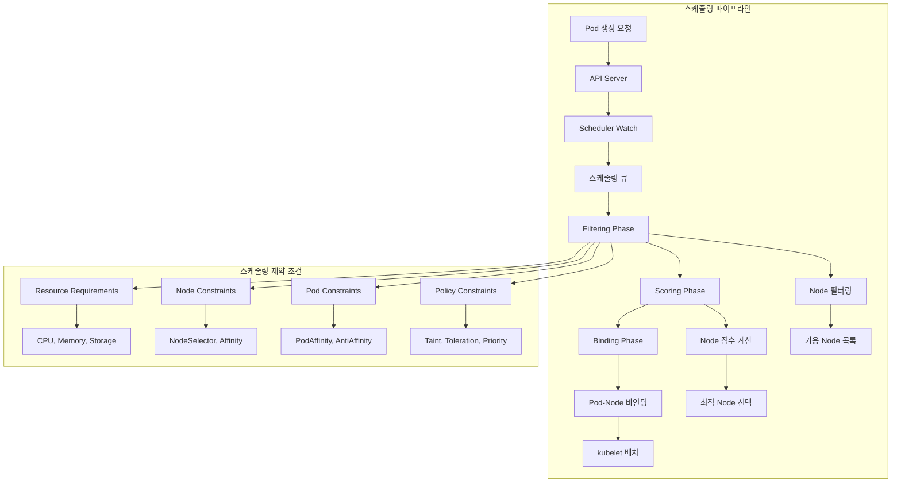
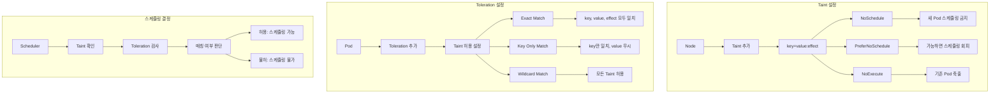
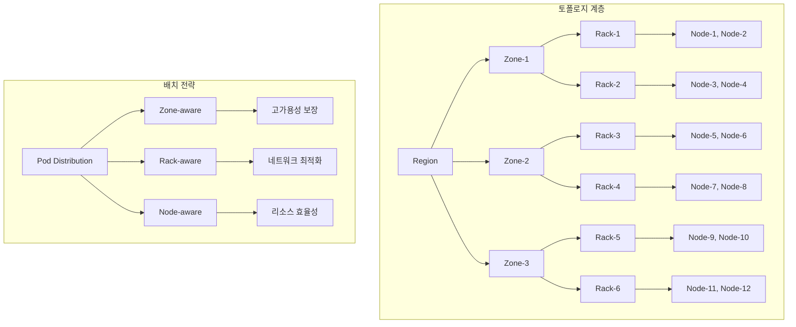

# Session 6: Pod 스케줄링과 어피니티 규칙

## 📍 교과과정에서의 위치
이 세션은 **Week 3 > Day 1 > Session 6**로, Kubernetes의 고급 스케줄링 메커니즘과 워크로드 배치 최적화 전략을 학습합니다.

## 학습 목표 (5분)
- **Kubernetes 스케줄러** 동작 원리와 **스케줄링 단계** 이해
- **NodeAffinity**와 **PodAffinity** 규칙 설계 및 활용 방법 학습
- **Taint/Toleration**을 통한 **노드 격리**와 **전용 배치** 전략 파악
- **토폴로지 인식 스케줄링**과 **성능 최적화** 기법 이해

## 1. Kubernetes 스케줄러 아키텍처 (15분)

### 스케줄링 프로세스



### 스케줄러 동작 원리 분석
```
Kubernetes 스케줄러 핵심 개념:

스케줄링 단계:
   🔹 1. Filtering (필터링):
      • 목적: 배치 불가능한 노드 제외
      • 리소스 요구사항 확인
      • 노드 조건 검사
      • 정책 제약 조건 확인
      • 가용 노드 목록 생성
   🔹 2. Scoring (점수 계산):
      • 목적: 최적 노드 선택
      • 다양한 점수 함수 적용
      • 가중치 기반 계산
      • 노드별 점수 합산
      • 최고 점수 노드 선택
   🔹 3. Binding (바인딩):
      • 목적: Pod-Node 연결
      • API 서버에 바인딩 정보 전송
      • kubelet에 Pod 배치 지시
      • 스케줄링 결과 기록
      • 실패 시 재스케줄링
   🔹 확장 포인트:
   🔹 PreFilter: 사전 필터링
   🔹 Filter: 노드 필터링
   🔹 PostFilter: 후처리 필터링
   🔹 PreScore: 사전 점수 계산
   🔹 Score: 점수 계산
   🔹 Reserve: 리소스 예약
   🔹 Permit: 배치 허가
   🔹 PreBind: 사전 바인딩
   🔹 Bind: 바인딩 실행
   🔹 PostBind: 후처리 바인딩

기본 스케줄링 정책:
   🔹 리소스 기반 스케줄링:
      • CPU 요청량 기반 배치
      • 메모리 요청량 고려
      • 스토리지 요구사항 확인
      • 확장 리소스 (GPU, FPGA) 지원
      • 리소스 오버커밋 방지
   🔹 로드 밸런싱:
      • 노드 간 Pod 분산
      • 리소스 사용률 균형
      • 핫스팟 방지
      • 가용성 향상
      • 성능 최적화
   🔹 지역성 고려:
      • 데이터 지역성 최적화
      • 네트워크 지연 최소화
      • 가용 영역 분산
      • 장애 도메인 고려
      • 비용 최적화
   🔹 우선순위 기반:
      • PriorityClass 활용
      • 중요도 기반 스케줄링
      • 선점(Preemption) 지원
      • 리소스 경합 해결
      • SLA 보장
   🔹 정책 기반:
   🔹 보안 정책 적용
   🔹 컴플라이언스 요구사항
   🔹 비즈니스 규칙 반영
   🔹 거버넌스 정책
   🔹 비용 제약 조건

스케줄링 성능 최적화:
   🔹 스케줄링 처리량:
      • 병렬 스케줄링 지원
      • 스케줄링 큐 최적화
      • 캐시 활용
      • 불필요한 계산 최소화
      • 프로파일링 기반 튜닝
   🔹 지연시간 최소화:
      • 빠른 필터링 알고리즘
      • 효율적인 점수 계산
      • 조기 종료 최적화
      • 메모리 사용량 최적화
      • CPU 사용률 관리
   🔹 확장성:
      • 대규모 클러스터 지원
      • 노드 수 증가 대응
      • Pod 수 증가 처리
      • 메모리 효율성
      • 네트워크 최적화
   🔹 안정성:
      • 스케줄링 실패 처리
      • 재시도 메커니즘
      • 백오프 전략
      • 에러 복구
      • 모니터링 통합
   🔹 커스터마이징:
   🔹 커스텀 스케줄러 개발
   🔹 스케줄링 프레임워크 확장
   🔹 플러그인 개발
   🔹 정책 엔진 통합
   🔹 외부 시스템 연동
```

## 2. NodeAffinity와 PodAffinity 규칙 (12분)

### Affinity 규칙 아키텍처

```mermaid
graph TB
    subgraph "NodeAffinity"
        A[Pod Spec] --> B[NodeAffinity]
        B --> C[RequiredDuringScheduling]
        B --> D[PreferredDuringScheduling]
        
        C --> E[Hard Constraint]
        D --> F[Soft Constraint]
        
        E --> G[Must Match]
        F --> H[Weight-based Preference]
    end
    
    subgraph "PodAffinity"
        I[Pod Spec] --> J[PodAffinity]
        J --> K[RequiredDuringScheduling]
        J --> L[PreferredDuringScheduling]
        
        K --> M[Co-location Required]
        L --> N[Co-location Preferred]
        
        M --> O[Same Topology]
        N --> P[Weighted Preference]
    end
    
    subgraph "PodAntiAffinity"
        Q[Pod Spec] --> R[PodAntiAffinity]
        R --> S[RequiredDuringScheduling]
        R --> T[PreferredDuringScheduling]
        
        S --> U[Separation Required]
        T --> V[Separation Preferred]
        
        U --> W[Different Topology]
        V --> X[Weighted Avoidance]
    end
```



### Affinity 규칙 상세 분석
```
Affinity 규칙 설계 및 활용:

NodeAffinity (노드 친화성):
   🔹 Required 규칙 (필수 조건):
      • 조건 불만족 시 스케줄링 실패
      • 논리 연산자 지원 (AND, OR)
      • 라벨 기반 노드 선택
      • 값 범위 지정 (In, NotIn, Exists, DoesNotExist)
      • 복합 조건 구성 가능
   🔹 Preferred 규칙 (선호 조건):
      • 가중치 기반 우선순위 (1-100)
      • 조건 불만족 시에도 스케줄링 진행
      • 여러 선호 조건 조합 가능
      • 최적 노드 선택에 활용
      • 성능 최적화 목적
   🔹 사용 사례:
      • 특정 하드웨어 요구사항 (GPU, SSD)
      • 지역별 배치 (region, zone)
      • 노드 타입별 분리 (compute, storage)
      • 환경별 격리 (prod, dev, test)
      • 컴플라이언스 요구사항
   🔹 라벨 전략:
      • 표준 라벨 활용:
         • kubernetes.io/arch: amd64, arm64
         • kubernetes.io/os: linux, windows
         • topology.kubernetes.io/zone
         • topology.kubernetes.io/region
         • node.kubernetes.io/instance-type
      • 커스텀 라벨:
         • hardware.example.com/gpu-type
         • environment.example.com/tier
         • workload.example.com/type
         • cost.example.com/tier
         • compliance.example.com/level
      • 라벨 관리:
      • 일관된 명명 규칙
      • 자동 라벨링 도구
      • 라벨 검증 정책
      • 라벨 생명주기 관리
      • 문서화 및 교육
   🔹 최적화 전략:
   🔹 필수 조건 최소화
   🔹 선호 조건 활용 극대화
   🔹 라벨 쿼리 최적화
   🔹 캐시 활용
   🔹 성능 모니터링

PodAffinity (Pod 친화성):
   🔹 동일 위치 배치 (Co-location):
      • 관련 Pod들을 같은 노드/영역에 배치
      • 네트워크 지연 최소화
      • 데이터 지역성 향상
      • 통신 비용 절약
      • 성능 최적화
   🔹 토폴로지 키 활용:
      • kubernetes.io/hostname: 동일 노드
      • topology.kubernetes.io/zone: 동일 가용 영역
      • topology.kubernetes.io/region: 동일 리전
      • 커스텀 토폴로지: 랙, 데이터센터
      • 계층적 토폴로지 지원
   🔹 라벨 셀렉터:
      • matchLabels: 정확한 라벨 매칭
      • matchExpressions: 복잡한 조건
      • 네임스페이스 고려
      • 다중 셀렉터 조합
      • 동적 라벨 업데이트 대응
   🔹 사용 사례:
      • 웹 서버 + 캐시 서버 동일 배치
      • 데이터베이스 + 애플리케이션 근접 배치
      • 마이크로서비스 간 통신 최적화
      • 배치 처리 작업 그룹화
      • 로그 수집기와 애플리케이션 동일 배치
   🔹 성능 고려사항:
   🔹 스케줄링 복잡도 증가
   🔹 리소스 단편화 가능성
   🔹 확장성 제약
   🔹 장애 도메인 집중 위험
   🔹 모니터링 필요성

PodAntiAffinity (Pod 반친화성):
   🔹 분산 배치 (Separation):
      • 관련 Pod들을 다른 노드/영역에 분산
      • 고가용성 보장
      • 장애 격리
      • 리소스 경합 방지
      • 성능 간섭 최소화
   🔹 고가용성 패턴:
      • 마스터-슬레이브 분산 배치
      • 로드 밸런서 인스턴스 분산
      • 데이터베이스 복제본 분산
      • 마이크로서비스 인스턴스 분산
      • 중요 시스템 컴포넌트 분산
   🔹 리소스 최적화:
      • CPU 집약적 워크로드 분산
      • 메모리 집약적 애플리케이션 분산
      • 네트워크 대역폭 분산
      • 스토리지 I/O 분산
      • 전력 소비 분산
   🔹 토폴로지 전략:
      • 노드 레벨 분산
      • 가용 영역 분산
      • 리전 분산
      • 랙 레벨 분산
      • 데이터센터 분산
   🔹 균형 고려:
   🔹 가용성 vs 성능 트레이드오프
   🔹 분산 vs 지역성 균형
   🔹 비용 vs 안정성 고려
   🔹 복잡성 vs 효과 평가
   🔹 운영 편의성 고려

실무 적용 패턴:
   🔹 계층별 배치 전략:
      • 프론트엔드: 지역별 분산
      • API 게이트웨이: 가용 영역 분산
      • 비즈니스 로직: 성능 최적화 배치
      • 데이터베이스: 고가용성 분산
      • 캐시: 애플리케이션과 동일 배치
   🔹 환경별 격리:
      • 프로덕션 전용 노드
      • 개발/테스트 환경 분리
      • 보안 등급별 격리
      • 컴플라이언스 요구사항 반영
      • 비용 최적화 고려
   🔹 워크로드별 최적화:
      • CPU 집약적: 고성능 노드 선호
      • 메모리 집약적: 대용량 메모리 노드
      • I/O 집약적: SSD 스토리지 노드
      • GPU 워크로드: GPU 노드 필수
      • 배치 처리: 스팟 인스턴스 활용
   🔹 모니터링 및 최적화:
   🔹 배치 효율성 측정
   🔹 리소스 활용률 분석
   🔹 성능 메트릭 추적
   🔹 비용 효율성 평가
   🔹 지속적 최적화
```

## 3. Taint와 Toleration 메커니즘 (10분)

### Taint/Toleration 동작 원리



### Taint/Toleration 활용 전략
```
Taint/Toleration 메커니즘:

Taint 효과 유형:
   🔹 NoSchedule:
      • 새로운 Pod 스케줄링 금지
      • 기존 Pod는 영향 없음
      • 노드 유지보수 시 활용
      • 전용 노드 구성
      • 점진적 노드 격리
   🔹 PreferNoSchedule:
      • 가능하면 스케줄링 회피
      • 다른 노드 없으면 허용
      • 소프트 제약 조건
      • 성능 최적화 목적
      • 유연한 배치 정책
   🔹 NoExecute:
      • 새 Pod 스케줄링 금지
      • 기존 Pod 축출 (eviction)
      • 즉시 효과 발생
      • 긴급 노드 격리
      • 장애 노드 처리
   🔹 시간 기반 Toleration:
   🔹 tolerationSeconds 설정
   🔹 일정 시간 후 축출
   🔹 점진적 마이그레이션
   🔹 유예 기간 제공
   🔹 우아한 종료 지원

실무 활용 사례:
   🔹 노드 전용화:
      • GPU 노드 전용 사용
      • 고성능 컴퓨팅 노드
      • 데이터베이스 전용 노드
      • 시스템 서비스 전용
      • 보안 격리 노드
   🔹 환경 분리:
      • 프로덕션 환경 격리
      • 개발/테스트 환경 분리
      • 테넌트별 격리
      • 보안 등급별 분리
      • 컴플라이언스 요구사항
   🔹 유지보수 관리:
      • 노드 드레인 준비
      • 점진적 노드 교체
      • 업그레이드 작업
      • 하드웨어 교체
      • 네트워크 작업
   🔹 장애 대응:
      • 문제 노드 격리
      • 하드웨어 장애 처리
      • 네트워크 문제 격리
      • 성능 저하 노드 제외
      • 보안 사고 대응
   🔹 비용 최적화:
   🔹 스팟 인스턴스 관리
   🔹 예약 인스턴스 활용
   🔹 시간대별 노드 관리
   🔹 리소스 효율성 향상
   🔹 전력 관리

Toleration 설정 패턴:
   🔹 정확한 매칭:
      • key, value, effect 모두 지정
      • 특정 Taint에만 반응
      • 세밀한 제어 가능
      • 보안성 높음
      • 관리 복잡도 증가
   🔹 키 기반 매칭:
      • key와 effect만 지정
      • value 무시 (operator: Exists)
      • 유연한 매칭
      • 관리 편의성
      • 보안 고려 필요
   🔹 와일드카드 매칭:
      • 모든 Taint 허용
      • 특별한 권한 Pod
      • 시스템 서비스
      • 관리 도구
      • 보안 위험 고려
   🔹 시간 제한 Toleration:
      • tolerationSeconds 설정
      • 임시 허용
      • 점진적 마이그레이션
      • 유예 기간 제공
      • 자동 정리
   🔹 조건부 Toleration:
   🔹 특정 조건에서만 활성화
   🔹 동적 Toleration 관리
   🔹 정책 기반 제어
   🔹 자동화 도구 연동
   🔹 복잡한 비즈니스 로직

자동화 및 관리:
   🔹 자동 Taint 관리:
      • 노드 상태 기반 자동 Taint
      • 메트릭 기반 Taint 추가
      • 스케줄 기반 Taint 관리
      • 이벤트 기반 자동화
      • 정책 엔진 통합
   🔹 Toleration 정책:
      • 네임스페이스별 기본 Toleration
      • 서비스 계정별 정책
      • 라벨 기반 자동 적용
      • Admission Controller 활용
      • 정책 검증 및 감사
   🔹 모니터링 및 알림:
      • Taint 변경 추적
      • Pod 축출 모니터링
      • 스케줄링 실패 알림
      • 노드 상태 대시보드
      • 용량 계획 지원
   🔹 문제 해결:
      • 스케줄링 실패 진단
      • Taint/Toleration 불일치 감지
      • 노드 격리 상태 확인
      • Pod 축출 원인 분석
      • 복구 절차 자동화
   🔹 베스트 프랙티스:
   🔹 명확한 Taint 명명 규칙
   🔹 문서화된 정책
   🔹 정기적인 정책 검토
   🔹 교육 및 가이드라인
   🔹 변경 관리 프로세스
```

## 4. 토폴로지 인식 스케줄링과 최적화 (10분)

### 토폴로지 기반 배치 전략



### 토폴로지 최적화 전략
```
토폴로지 인식 스케줄링:

토폴로지 도메인:
   🔹 지리적 토폴로지:
      • Region (리전): 지리적 영역
      • Zone (가용 영역): 독립적 장애 도메인
      • 데이터센터: 물리적 위치
      • 캠퍼스: 여러 데이터센터 그룹
      • 대륙: 글로벌 분산
   🔹 물리적 토폴로지:
      • Rack (랙): 네트워크 스위치 단위
      • Chassis (섀시): 블레이드 서버 단위
      • Node (노드): 개별 서버
      • NUMA: CPU 소켓 단위
      • Core: CPU 코어 단위
   🔹 논리적 토폴로지:
      • 클러스터: Kubernetes 클러스터
      • 네임스페이스: 논리적 격리
      • 노드 풀: 동일 특성 노드 그룹
      • 워커 그룹: 역할별 노드 분류
      • 테넌트: 다중 테넌시 단위
   🔹 네트워크 토폴로지:
      • 서브넷: IP 주소 범위
      • VLAN: 가상 LAN 분할
      • VPC: 가상 프라이빗 클라우드
      • 네트워크 세그먼트: 보안 경계
      • CDN 엣지: 콘텐츠 배포 지점
   🔹 성능 토폴로지:
   🔹 메모리 계층: L1, L2, L3 캐시
   🔹 스토리지 계층: NVMe, SSD, HDD
   🔹 네트워크 계층: 대역폭별 분류
   🔹 컴퓨팅 계층: CPU, GPU, FPGA
   🔹 전력 계층: 전력 공급 단위

토폴로지 분산 제약 (Topology Spread Constraints):
   🔹 기본 개념:
      • Pod 분산 정책 정의
      • 토폴로지 도메인별 균등 분산
      • 최대 편차(maxSkew) 제한
      • 라벨 셀렉터 기반 그룹화
      • 동적 분산 조정
   🔹 분산 전략:
      • DoNotSchedule: 제약 위반 시 스케줄링 금지
      • ScheduleAnyway: 제약 위반해도 스케줄링 진행
      • 가중치 기반: 선호도 점수 조정
      • 하드 제약: 반드시 준수
      • 소프트 제약: 가능하면 준수
   🔹 사용 사례:
      • 고가용성: 가용 영역별 균등 분산
      • 성능 최적화: 네트워크 지연 최소화
      • 비용 최적화: 리전별 비용 고려
      • 컴플라이언스: 데이터 주권 준수
      • 장애 격리: 장애 도메인 분산
   🔹 설정 예시:
      • 가용 영역별 균등 분산
      • 노드별 최대 Pod 수 제한
      • 랙별 분산 배치
      • 리전별 데이터 지역성
      • 성능 계층별 배치
   🔹 모니터링 및 최적화:
   🔹 분산 상태 모니터링
   🔹 편차 측정 및 알림
   🔹 자동 리밸런싱
   🔹 성능 영향 분석
   🔹 비용 효율성 평가

고급 스케줄링 최적화:
   🔹 예측적 스케줄링:
      • 워크로드 패턴 분석
      • 리소스 사용률 예측
      • 트래픽 패턴 학습
      • 계절성 고려
      • 머신러닝 기반 최적화
   🔹 동적 스케줄링:
      • 실시간 메트릭 기반 조정
      • 부하 기반 재배치
      • 성능 저하 감지 및 대응
      • 자동 스케일링 연동
      • 이벤트 기반 최적화
   🔹 멀티 클러스터 스케줄링:
      • 클러스터 간 워크로드 분산
      • 지역별 최적 배치
      • 비용 기반 클러스터 선택
      • 장애 복구 자동화
      • 글로벌 로드 밸런싱
   🔹 에너지 효율 스케줄링:
      • 전력 소비 최적화
      • 탄소 발자국 최소화
      • 재생 에너지 활용
      • 냉각 효율성 고려
      • 그린 컴퓨팅 정책
   🔹 보안 인식 스케줄링:
   🔹 보안 등급별 노드 분리
   🔹 암호화 요구사항 고려
   🔹 컴플라이언스 정책 적용
   🔹 네트워크 보안 경계
   🔹 감사 요구사항 반영

성능 모니터링 및 튜닝:
   🔹 스케줄링 메트릭:
      • 스케줄링 지연시간
      • 스케줄링 처리량
      • 스케줄링 실패율
      • 리소스 활용률
      • 분산 균등성
   🔹 성능 분석:
      • 병목 지점 식별
      • 최적화 기회 발견
      • 비용 효율성 분석
      • SLA 준수 확인
      • 용량 계획 지원
   🔹 자동 튜닝:
      • 매개변수 자동 조정
      • 정책 최적화
      • 임계값 동적 조정
      • 알고리즘 선택
      • 피드백 루프 구축
   🔹 알림 및 대응:
      • 성능 저하 감지
      • 이상 상황 알림
      • 자동 복구 트리거
      • 에스컬레이션 정책
      • 근본 원인 분석
   🔹 지속적 개선:
   🔹 성능 벤치마킹
   🔹 A/B 테스트
   🔹 카나리 배포
   🔹 피드백 수집
   🔹 베스트 프랙티스 적용
```

## 💬 그룹 토론: 스케줄링 전략 설계 시 고려사항 (8분)

### 토론 주제
**"대규모 멀티 테넌트 환경에서 성능, 가용성, 비용을 모두 고려한 최적의 스케줄링 전략은 무엇인가?"**

### 토론 가이드라인

#### 성능 최적화 (3분)
- 지역성 최적화: 데이터 지역성과 네트워크 지연 최소화
- 리소스 효율성: CPU, 메모리, 스토리지 활용률 극대화
- 부하 분산: 핫스팟 방지와 균등한 워크로드 분산

#### 가용성 보장 (3분)
- 장애 도메인 분산: 가용 영역, 랙, 노드 레벨 분산 전략
- 복제본 배치: 중요 서비스의 고가용성 보장
- 장애 복구: 자동 페일오버와 복구 메커니즘

#### 비용 최적화 (2분)
- 리소스 활용: 오버프로비저닝 방지와 리소스 효율성
- 스팟 인스턴스: 비용 절약을 위한 스팟 인스턴스 활용
- 멀티 클라우드: 클라우드 제공자별 비용 최적화

## 💡 핵심 개념 정리
- 스케줄링 파이프라인: Filtering, Scoring, Binding 단계를 통한 최적 노드 선택
- Affinity 규칙: NodeAffinity, PodAffinity, PodAntiAffinity를 통한 배치 제어
- Taint/Toleration: 노드 격리와 전용 배치를 위한 메커니즘
- 토폴로지 인식: 물리적/논리적 토폴로지를 고려한 최적 배치 전략

## 📚 참고 자료
- [Kubernetes Scheduler](https://kubernetes.io/docs/concepts/scheduling-eviction/kube-scheduler/)
- [Assigning Pods to Nodes](https://kubernetes.io/docs/concepts/scheduling-eviction/assign-pod-node/)
- [Taints and Tolerations](https://kubernetes.io/docs/concepts/scheduling-eviction/taint-and-toleration/)
- [Topology Spread Constraints](https://kubernetes.io/docs/concepts/workloads/pods/pod-topology-spread-constraints/)

## 다음 세션 준비
다음 세션에서는 **리소스 관리와 QoS 클래스**에 대해 학습합니다. 리소스 요청/제한 설정과 서비스 품질 보장 메커니즘을 다룰 예정입니다.