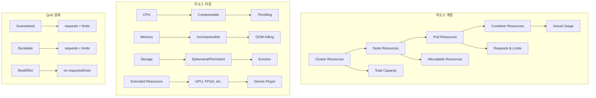
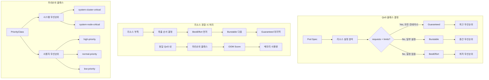
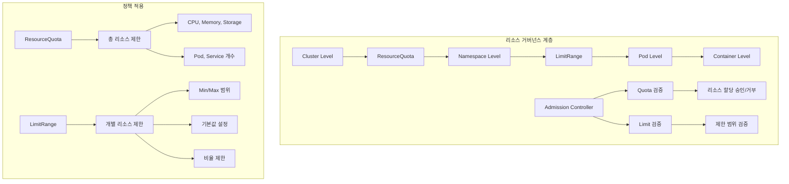
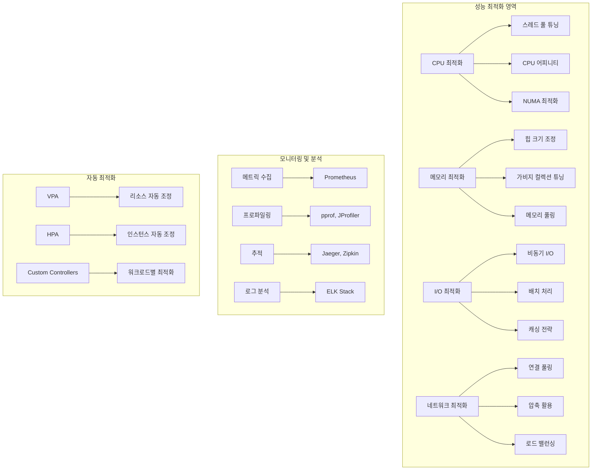

# Session 7: 리소스 관리와 QoS 클래스

## 📍 교과과정에서의 위치
이 세션은 **Week 3 > Day 1 > Session 7**로, Kubernetes의 리소스 관리 메커니즘과 서비스 품질(QoS) 보장 전략을 학습합니다.

## 학습 목표 (5분)
- **리소스 요청**과 **제한** 설정을 통한 **리소스 관리** 전략 이해
- **QoS 클래스** 분류와 **우선순위 기반** 스케줄링 메커니즘 학습
- **리소스 쿼터**와 **LimitRange** 정책을 통한 **거버넌스** 구현 파악
- **성능 최적화**와 **리소스 효율성** 향상 방법 이해

## 1. 리소스 요청과 제한 메커니즘 (15분)

### 리소스 관리 아키텍처



### 리소스 관리 상세 분석
```
Kubernetes 리소스 관리:

리소스 타입 분류:
├── CPU (Compressible Resource):
│   ├── 특성: 압축 가능한 리소스
│   ├── 단위: millicores (m), cores
│   ├── 제한 초과 시: 스로틀링 (throttling)
│   ├── 성능 영향: 응답 시간 증가
│   └── 복구: 자동 (부하 감소 시)
├── Memory (Incompressible Resource):
│   ├── 특성: 압축 불가능한 리소스
│   ├── 단위: bytes (Ki, Mi, Gi, Ti)
│   ├── 제한 초과 시: OOM Kill
│   ├── 성능 영향: 프로세스 종료
│   └── 복구: 수동 (재시작 필요)
├── Storage:
│   ├── Ephemeral Storage: 임시 스토리지
│   ├── Persistent Storage: 영구 스토리지
│   ├── 제한 초과 시: Pod 축출 (eviction)
│   ├── 모니터링: 디스크 사용률 추적
│   └── 정리: 자동 가비지 컬렉션
├── Extended Resources:
│   ├── GPU: 그래픽 처리 장치
│   ├── FPGA: 필드 프로그래머블 게이트 어레이
│   ├── Custom Resources: 사용자 정의 리소스
│   ├── Device Plugin: 디바이스 관리
│   └── 스케줄링: 정수 단위 할당
└── Network Resources:
    ├── Bandwidth: 네트워크 대역폭
    ├── Connections: 연결 수
    ├── Ports: 포트 할당
    ├── Quality of Service: 네트워크 QoS
    └── Traffic Shaping: 트래픽 제어

리소스 요청 (Requests):
├── 정의:
│   ├── 컨테이너가 필요로 하는 최소 리소스
│   ├── 스케줄링 결정의 기준
│   ├── 노드 리소스 예약
│   ├── QoS 클래스 결정 요소
│   └── 비용 계산 기준
├── 스케줄링 영향:
│   ├── 노드 선택 기준
│   ├── 리소스 가용성 확인
│   ├── 배치 가능성 판단
│   ├── 클러스터 오토스케일링 트리거
│   └── 리소스 단편화 고려
├── 설정 전략:
│   ├── 실제 사용량 기반 설정
│   ├── 성능 요구사항 반영
│   ├── 안전 마진 고려
│   ├── 비용 효율성 균형
│   └── 모니터링 데이터 활용
├── 모범 사례:
│   ├── 과소 설정 방지 (under-provisioning)
│   ├── 과다 설정 방지 (over-provisioning)
│   ├── 프로파일링 기반 설정
│   ├── 단계적 조정
│   └── 자동화 도구 활용
└── 모니터링:
    ├── 요청 대비 실제 사용률
    ├── 리소스 활용 효율성
    ├── 스케줄링 실패 원인
    ├── 노드 리소스 단편화
    └── 비용 최적화 기회

리소스 제한 (Limits):
├── 정의:
│   ├── 컨테이너가 사용할 수 있는 최대 리소스
│   ├── 리소스 격리 보장
│   ├── 노이지 네이버 방지
│   ├── 시스템 안정성 보장
│   └── 멀티 테넌시 지원
├── 제한 초과 시 동작:
│   ├── CPU: 스로틀링 (성능 저하)
│   ├── Memory: OOM Kill (프로세스 종료)
│   ├── Storage: Pod 축출
│   ├── Network: 트래픽 제한
│   └── Extended Resources: 할당 거부
├── 설정 전략:
│   ├── 피크 사용량 기반 설정
│   ├── 버스트 허용량 고려
│   ├── 시스템 리소스 보호
│   ├── 공정한 리소스 공유
│   └── 성능 vs 안정성 균형
├── 최적화 기법:
│   ├── 동적 제한 조정
│   ├── 워크로드별 차등 설정
│   ├── 시간대별 제한 변경
│   ├── 우선순위 기반 제한
│   └── 자동 튜닝 도구
└── 문제 해결:
    ├── OOM Kill 분석
    ├── CPU 스로틀링 감지
    ├── 리소스 경합 해결
    ├── 성능 병목 식별
    └── 용량 계획 개선

리소스 관리 패턴:
├── 보수적 설정:
│   ├── 높은 요청, 적절한 제한
│   ├── 안정성 우선
│   ├── 예측 가능한 성능
│   ├── 리소스 효율성 낮음
│   └── 비용 증가 가능성
├── 공격적 설정:
│   ├── 낮은 요청, 높은 제한
│   ├── 효율성 우선
│   ├── 리소스 오버커밋
│   ├── 성능 변동 가능성
│   └── 비용 최적화
├── 균형 설정:
│   ├── 적절한 요청과 제한
│   ├── 성능과 효율성 균형
│   ├── 모니터링 기반 조정
│   ├── 점진적 최적화
│   └── 지속적 개선
├── 동적 설정:
│   ├── 워크로드 패턴 기반
│   ├── 시간대별 조정
│   ├── 자동 스케일링 연동
│   ├── 머신러닝 기반 예측
│   └── 실시간 최적화
└── 계층별 설정:
    ├── 클러스터 레벨 정책
    ├── 네임스페이스 레벨 제한
    ├── 워크로드 레벨 설정
    ├── 컨테이너 레벨 조정
    └── 일관성 있는 정책
```

## 2. QoS 클래스와 우선순위 관리 (12분)

### QoS 클래스 분류 시스템



### QoS 클래스 상세 분석
```
QoS (Quality of Service) 클래스:

Guaranteed QoS:
├── 조건:
│   ├── 모든 컨테이너에 CPU/Memory requests 설정
│   ├── 모든 컨테이너에서 requests = limits
│   ├── 확장 리소스도 동일 조건 적용
│   ├── 사이드카 컨테이너 포함
│   └── Init 컨테이너 제외
├── 특성:
│   ├── 최고 우선순위
│   ├── 리소스 보장
│   ├── 예측 가능한 성능
│   ├── 축출 저항성 최고
│   └── 스케줄링 우선권
├── 사용 사례:
│   ├── 중요한 프로덕션 워크로드
│   ├── 데이터베이스 서비스
│   ├── 실시간 처리 시스템
│   ├── 금융 거래 시스템
│   └── 미션 크리티컬 애플리케이션
├── 장점:
│   ├── 성능 일관성
│   ├── 높은 안정성
│   ├── 예측 가능성
│   ├── SLA 보장 용이
│   └── 장애 복구 우선권
└── 단점:
    ├── 리소스 효율성 낮음
    ├── 비용 증가
    ├── 오버프로비저닝 위험
    ├── 유연성 부족
    └── 스케일링 제약

Burstable QoS:
├── 조건:
│   ├── 최소 하나의 컨테이너에 requests 설정
│   ├── requests ≠ limits (또는 limits 미설정)
│   ├── 일부 컨테이너만 리소스 설정 가능
│   ├── 혼합 설정 허용
│   └── 가장 일반적인 QoS 클래스
├── 특성:
│   ├── 중간 우선순위
│   ├── 기본 리소스 보장 + 버스트 허용
│   ├── 유연한 리소스 사용
│   ├── 조건부 축출 대상
│   └── 성능 변동 가능성
├── 사용 사례:
│   ├── 일반적인 웹 애플리케이션
│   ├── API 서버
│   ├── 마이크로서비스
│   ├── 배치 처리 작업
│   └── 개발/테스트 환경
├── 장점:
│   ├── 리소스 효율성
│   ├── 비용 최적화
│   ├── 유연한 성능
│   ├── 버스트 처리 가능
│   └── 실용적 설정
├── 단점:
│   ├── 성능 변동성
│   ├── 축출 위험
│   ├── 리소스 경합 시 영향
│   ├── 예측 어려움
│   └── 모니터링 복잡성
└── 최적화:
    ├── 적절한 requests 설정
    ├── 합리적인 limits 설정
    ├── 모니터링 기반 조정
    ├── 자동 튜닝 활용
    └── 성능 테스트 수행

BestEffort QoS:
├── 조건:
│   ├── 모든 컨테이너에 requests/limits 미설정
│   ├── 리소스 제약 없음
│   ├── 시스템 여유 리소스 활용
│   ├── 가장 낮은 우선순위
│   └── 축출 1순위 대상
├── 특성:
│   ├── 최저 우선순위
│   ├── 리소스 보장 없음
│   ├── 최대 리소스 활용 가능
│   ├── 높은 축출 위험
│   └── 비용 효율성 최고
├── 사용 사례:
│   ├── 배치 처리 작업
│   ├── 로그 처리
│   ├── 데이터 분석
│   ├── 테스트 워크로드
│   └── 비중요 백그라운드 작업
├── 장점:
│   ├── 최대 리소스 활용
│   ├── 비용 최소화
│   ├── 설정 단순성
│   ├── 유연한 스케일링
│   └── 실험적 워크로드 적합
├── 단점:
│   ├── 성능 예측 불가
│   ├── 높은 축출 위험
│   ├── 안정성 부족
│   ├── SLA 보장 어려움
│   └── 프로덕션 부적합
└── 활용 전략:
    ├── 비중요 워크로드 전용
    ├── 여유 리소스 활용
    ├── 실험 및 개발 용도
    ├── 비용 최적화 목적
    └── 임시 작업 처리

우선순위 클래스 (PriorityClass):
├── 시스템 우선순위:
│   ├── system-cluster-critical (2000000000):
│   │   ├── 클러스터 핵심 컴포넌트
│   │   ├── kube-system 네임스페이스
│   │   ├── DNS, 네트워킹 등
│   │   ├── 절대 축출 금지
│   │   └── 최우선 스케줄링
│   ├── system-node-critical (2000001000):
│   │   ├── 노드 핵심 컴포넌트
│   │   ├── kubelet, kube-proxy
│   │   ├── 노드 기능 필수 요소
│   │   ├── 높은 보호 수준
│   │   └── 노드별 필수 서비스
│   └── 커스텀 시스템 우선순위:
│       ├── 조직별 중요 시스템
│       ├── 모니터링 시스템
│       ├── 보안 에이전트
│       ├── 백업 시스템
│       └── 로깅 인프라
├── 사용자 우선순위:
│   ├── high-priority (1000):
│   │   ├── 중요한 프로덕션 워크로드
│   │   ├── 실시간 처리 시스템
│   │   ├── 고객 대면 서비스
│   │   ├── 매출 직결 애플리케이션
│   │   └── SLA 보장 필요 서비스
│   ├── normal-priority (0, 기본값):
│   │   ├── 일반적인 애플리케이션
│   │   ├── 표준 비즈니스 로직
│   │   ├── 내부 도구
│   │   ├── 관리 시스템
│   │   └── 대부분의 워크로드
│   ├── low-priority (-1000):
│   │   ├── 배치 처리 작업
│   │   ├── 데이터 분석
│   │   ├── 백업 작업
│   │   ├── 로그 처리
│   │   └── 비중요 백그라운드 작업
│   └── 커스텀 우선순위:
│       ├── 비즈니스 중요도 반영
│       ├── 팀별 우선순위
│       ├── 프로젝트별 분류
│       ├── 환경별 차등화
│       └── 동적 우선순위 조정
├── 선점 (Preemption) 메커니즘:
│   ├── 높은 우선순위 Pod 스케줄링 시
│   ├── 낮은 우선순위 Pod 축출
│   ├── 리소스 확보 후 배치
│   ├── 우아한 종료 시간 제공
│   └── 최소 영향 원칙 적용
└── 관리 전략:
    ├── 명확한 우선순위 정책
    ├── 정기적인 정책 검토
    ├── 모니터링 및 분석
    ├── 자동화된 분류
    └── 교육 및 가이드라인
```

## 3. 리소스 쿼터와 LimitRange 정책 (10분)

### 리소스 거버넌스 아키텍처



### 리소스 거버넌스 상세 분석
```
리소스 거버넌스 정책:

ResourceQuota (리소스 쿼터):
├── 기본 개념:
│   ├── 네임스페이스별 리소스 총량 제한
│   ├── 멀티 테넌시 지원
│   ├── 리소스 공정 분배
│   ├── 비용 제어
│   └── 용량 계획 지원
├── 제한 대상:
│   ├── 컴퓨팅 리소스:
│   │   ├── requests.cpu: CPU 요청 총량
│   │   ├── requests.memory: 메모리 요청 총량
│   │   ├── limits.cpu: CPU 제한 총량
│   │   ├── limits.memory: 메모리 제한 총량
│   │   └── requests.nvidia.com/gpu: GPU 요청
│   ├── 스토리지 리소스:
│   │   ├── requests.storage: 스토리지 요청 총량
│   │   ├── persistentvolumeclaims: PVC 개수
│   │   ├── 스토리지 클래스별 제한
│   │   ├── 임시 스토리지 제한
│   │   └── 볼륨 스냅샷 제한
│   ├── 오브젝트 개수:
│   │   ├── pods: Pod 개수 제한
│   │   ├── services: Service 개수 제한
│   │   ├── secrets: Secret 개수 제한
│   │   ├── configmaps: ConfigMap 개수 제한
│   │   └── ingresses: Ingress 개수 제한
│   └── QoS별 제한:
│       ├── count/pods.guaranteed: Guaranteed Pod 개수
│       ├── count/pods.burstable: Burstable Pod 개수
│       ├── count/pods.besteffort: BestEffort Pod 개수
│       ├── requests.cpu.guaranteed: Guaranteed CPU 요청
│       └── requests.memory.burstable: Burstable 메모리 요청
├── 스코프 (Scope):
│   ├── Terminating: 종료 예정 Pod
│   ├── NotTerminating: 지속 실행 Pod
│   ├── BestEffort: BestEffort QoS Pod
│   ├── NotBestEffort: Guaranteed/Burstable Pod
│   └── PriorityClass: 우선순위 클래스별
├── 사용 전략:
│   ├── 팀별 리소스 할당
│   ├── 프로젝트별 예산 관리
│   ├── 환경별 리소스 분리
│   ├── 비용 센터별 관리
│   └── SLA 기반 할당
└── 모니터링:
    ├── 사용률 추적
    ├── 한계 근접 알림
    ├── 트렌드 분석
    ├── 용량 계획
    └── 비용 분석

LimitRange (제한 범위):
├── 기본 개념:
│   ├── 개별 리소스 객체 제한
│   ├── 최소/최대 범위 설정
│   ├── 기본값 자동 적용
│   ├── 비율 제한
│   └── 정책 일관성 보장
├── 제한 타입:
│   ├── Container 제한:
│   │   ├── CPU/Memory min/max
│   │   ├── 기본 requests/limits
│   │   ├── maxLimitRequestRatio
│   │   ├── 확장 리소스 제한
│   │   └── 임시 스토리지 제한
│   ├── Pod 제한:
│   │   ├── 전체 Pod 리소스 합계
│   │   ├── Pod 내 컨테이너 수
│   │   ├── 볼륨 개수 제한
│   │   ├── 네트워크 리소스
│   │   └── 보안 컨텍스트 제한
│   ├── PVC 제한:
│   │   ├── 스토리지 크기 min/max
│   │   ├── 스토리지 클래스별 제한
│   │   ├── 액세스 모드 제한
│   │   ├── 볼륨 모드 제한
│   │   └── 스냅샷 제한
│   └── 이미지 제한:
│       ├── 이미지 크기 제한
│       ├── 레지스트리 제한
│       ├── 태그 정책
│       ├── 보안 스캔 요구
│       └── 서명 검증
├── 기본값 정책:
│   ├── 자동 requests 설정
│   ├── 자동 limits 설정
│   ├── QoS 클래스 유도
│   ├── 일관된 설정 보장
│   └── 개발자 편의성 향상
├── 비율 제한:
│   ├── limits/requests 비율 제한
│   ├── 오버커밋 방지
│   ├── 리소스 효율성 보장
│   ├── 성능 예측성 향상
│   └── 안정성 확보
└── 검증 로직:
    ├── Admission Controller 통합
    ├── 실시간 검증
    ├── 정책 위반 거부
    ├── 에러 메시지 제공
    └── 감사 로깅

거버넌스 구현 전략:
├── 계층적 정책:
│   ├── 클러스터 레벨 기본 정책
│   ├── 네임스페이스별 세부 정책
│   ├── 워크로드별 맞춤 정책
│   ├── 환경별 차등 정책
│   └── 일관성 있는 적용
├── 자동화:
│   ├── 정책 템플릿 활용
│   ├── GitOps 기반 관리
│   ├── 자동 정책 적용
│   ├── 정책 검증 자동화
│   └── 컴플라이언스 체크
├── 모니터링 통합:
│   ├── 정책 위반 감지
│   ├── 리소스 사용률 추적
│   ├── 비용 분석
│   ├── 용량 계획
│   └── 최적화 기회 식별
├── 예외 처리:
│   ├── 긴급 상황 대응
│   ├── 임시 정책 완화
│   ├── 승인 프로세스
│   ├── 감사 추적
│   └── 자동 복원
└── 교육 및 지원:
    ├── 정책 가이드라인
    ├── 베스트 프랙티스
    ├── 도구 및 템플릿
    ├── 교육 프로그램
    └── 지원 채널

실무 적용 패턴:
├── 개발 환경:
│   ├── 관대한 제한 설정
│   ├── 실험 허용
│   ├── 빠른 반복 지원
│   ├── 학습 중심
│   └── 비용 효율성 고려
├── 스테이징 환경:
│   ├── 프로덕션 유사 제한
│   ├── 성능 테스트 지원
│   ├── 부하 테스트 허용
│   ├── 검증 중심
│   └── 안정성 확인
├── 프로덕션 환경:
│   ├── 엄격한 제한 설정
│   ├── 안정성 우선
│   ├── 성능 보장
│   ├── SLA 준수
│   └── 비용 최적화
├── 멀티 테넌트:
│   ├── 테넌트별 격리
│   ├── 공정한 리소스 분배
│   ├── 보안 경계 설정
│   ├── 성능 격리
│   └── 비용 추적
└── 하이브리드 클라우드:
    ├── 클라우드별 정책
    ├── 비용 최적화 정책
    ├── 데이터 주권 고려
    ├── 성능 특성 반영
    └── 일관된 거버넌스
```

## 4. 성능 최적화와 리소스 효율성 (10분)

### 성능 최적화 전략



### 성능 최적화 상세 전략
```
성능 최적화 및 리소스 효율성:

CPU 최적화:
├── 리소스 설정 최적화:
│   ├── 적절한 CPU requests 설정
│   ├── 버스트 허용을 위한 limits 설정
│   ├── CPU 어피니티 활용
│   ├── NUMA 토폴로지 고려
│   └── 하이퍼스레딩 최적화
├── 애플리케이션 최적화:
│   ├── 멀티스레딩 최적화
│   ├── 비동기 처리 활용
│   ├── CPU 집약적 작업 분산
│   ├── 알고리즘 최적화
│   └── 컴파일러 최적화
├── 스케줄링 최적화:
│   ├── CPU 토폴로지 인식 스케줄링
│   ├── 워크로드별 노드 분리
│   ├── CPU 집약적 작업 격리
│   ├── 우선순위 기반 스케줄링
│   └── 실시간 워크로드 지원
├── 모니터링:
│   ├── CPU 사용률 추적
│   ├── 스로틀링 감지
│   ├── 컨텍스트 스위치 모니터링
│   ├── 캐시 미스율 분석
│   └── 성능 카운터 활용
└── 자동 최적화:
    ├── VPA를 통한 자동 조정
    ├── 성능 기반 스케일링
    ├── 동적 CPU 할당
    ├── 워크로드 패턴 학습
    └── 예측적 최적화

메모리 최적화:
├── 메모리 관리:
│   ├── 적절한 메모리 requests/limits
│   ├── 메모리 누수 방지
│   ├── 가비지 컬렉션 튜닝
│   ├── 메모리 풀링 활용
│   └── 메모리 압축 기술
├── 캐싱 전략:
│   ├── 애플리케이션 레벨 캐시
│   ├── 분산 캐시 활용
│   ├── 캐시 계층 구조
│   ├── 캐시 무효화 전략
│   └── 메모리 vs 디스크 캐시
├── 데이터 구조 최적화:
│   ├── 효율적인 데이터 구조 선택
│   ├── 메모리 정렬 최적화
│   ├── 압축 알고리즘 활용
│   ├── 지연 로딩 패턴
│   └── 메모리 매핑 활용
├── OOM 방지:
│   ├── 메모리 사용량 모니터링
│   ├── 조기 경고 시스템
│   ├── 우아한 성능 저하
│   ├── 메모리 압박 시 대응
│   └── 자동 스케일링 연동
└── 최적화 도구:
    ├── 메모리 프로파일러
    ├── 힙 덤프 분석
    ├── 메모리 누수 탐지
    ├── 성능 벤치마킹
    └── 자동 튜닝 도구

스토리지 I/O 최적화:
├── 스토리지 계층:
│   ├── NVMe SSD 활용
│   ├── 메모리 기반 스토리지
│   ├── 네트워크 스토리지 최적화
│   ├── 스토리지 클래스 선택
│   └── 다중 스토리지 활용
├── I/O 패턴 최적화:
│   ├── 순차 I/O vs 랜덤 I/O
│   ├── 배치 I/O 처리
│   ├── 비동기 I/O 활용
│   ├── I/O 큐 깊이 조정
│   └── 읽기/쓰기 분리
├── 파일시스템 최적화:
│   ├── 파일시스템 선택 (ext4, xfs, btrfs)
│   ├── 마운트 옵션 최적화
│   ├── 블록 크기 조정
│   ├── 저널링 설정
│   └── 압축 활용
├── 캐싱 전략:
│   ├── 페이지 캐시 활용
│   ├── 애플리케이션 캐시
│   ├── 분산 캐시 시스템
│   ├── 캐시 워밍 전략
│   └── 캐시 계층 구조
└── 모니터링:
    ├── IOPS 및 처리량 추적
    ├── 지연시간 모니터링
    ├── 큐 깊이 분석
    ├── 에러율 추적
    └── 용량 사용률 모니터링

네트워크 최적화:
├── 네트워크 구성:
│   ├── 고대역폭 네트워크 활용
│   ├── 네트워크 토폴로지 최적화
│   ├── VLAN 및 서브넷 설계
│   ├── 로드 밸런서 최적화
│   └── CDN 활용
├── 프로토콜 최적화:
│   ├── HTTP/2, HTTP/3 활용
│   ├── gRPC 최적화
│   ├── TCP 튜닝
│   ├── 압축 활용
│   └── 연결 풀링
├── 서비스 메시 최적화:
│   ├── 사이드카 프록시 최적화
│   ├── 트래픽 라우팅 최적화
│   ├── 회로 차단기 활용
│   ├── 재시도 정책 최적화
│   └── 타임아웃 설정
├── 데이터 지역성:
│   ├── 지역별 데이터 배치
│   ├── 엣지 캐싱
│   ├── 데이터 복제 전략
│   ├── 지연시간 최소화
│   └── 대역폭 최적화
└── 모니터링:
    ├── 네트워크 처리량 추적
    ├── 지연시간 모니터링
    ├── 패킷 손실률 분석
    ├── 연결 상태 추적
    └── 대역폭 사용률 모니터링

자동 최적화 시스템:
├── 머신러닝 기반 최적화:
│   ├── 워크로드 패턴 학습
│   ├── 성능 예측 모델
│   ├── 자동 파라미터 튜닝
│   ├── 이상 탐지 및 대응
│   └── 지속적 학습 및 개선
├── 피드백 루프:
│   ├── 성능 메트릭 수집
│   ├── 최적화 효과 측정
│   ├── 자동 조정 실행
│   ├── 결과 검증
│   └── 지속적 개선
├── 정책 기반 최적화:
│   ├── 비즈니스 규칙 반영
│   ├── SLA 기반 최적화
│   ├── 비용 제약 고려
│   ├── 보안 요구사항 준수
│   └── 컴플라이언스 보장
├── 통합 최적화:
│   ├── 전체 시스템 관점
│   ├── 컴포넌트 간 상호작용
│   ├── 병목 지점 식별
│   ├── 전역 최적화
│   └── 트레이드오프 관리
└── 실시간 최적화:
    ├── 실시간 메트릭 분석
    ├── 동적 리소스 할당
    ├── 즉시 대응 시스템
    ├── 자동 복구 메커니즘
    └── 예측적 스케일링
```

## 💬 그룹 토론: 리소스 관리 전략의 균형점 찾기 (8분)

### 토론 주제
**"성능, 안정성, 비용 효율성을 모두 고려한 최적의 리소스 관리 전략은 무엇이며, 각 요소 간의 트레이드오프를 어떻게 관리해야 하는가?"**

### 토론 가이드라인

#### 성능 vs 비용 (3분)
- **오버프로비저닝**: 성능 보장을 위한 여유 리소스 vs 비용 증가
- **리소스 효율성**: 높은 활용률 추구 vs 성능 저하 위험
- **동적 조정**: 실시간 최적화 vs 관리 복잡성

#### 안정성 vs 효율성 (3분)
- **QoS 클래스**: Guaranteed vs Burstable 선택 기준
- **리소스 격리**: 안정성 보장 vs 리소스 낭비
- **장애 대응**: 빠른 복구 vs 리소스 예약

#### 거버넌스 vs 유연성 (2분)
- **정책 엄격성**: 엄격한 제한 vs 개발 생산성
- **자동화 수준**: 완전 자동화 vs 수동 제어
- **예외 처리**: 정책 일관성 vs 특수 요구사항 대응

## 💡 핵심 개념 정리
- **리소스 관리**: requests/limits를 통한 리소스 할당과 제한
- **QoS 클래스**: Guaranteed, Burstable, BestEffort 기반 우선순위 관리
- **리소스 거버넌스**: ResourceQuota와 LimitRange를 통한 정책 적용
- **성능 최적화**: CPU, 메모리, I/O, 네트워크 최적화를 통한 효율성 향상

## 📚 참고 자료
- [Resource Management](https://kubernetes.io/docs/concepts/configuration/manage-resources-containers/)
- [Quality of Service](https://kubernetes.io/docs/tasks/configure-pod-container/quality-service-pod/)
- [Resource Quotas](https://kubernetes.io/docs/concepts/policy/resource-quotas/)
- [Limit Ranges](https://kubernetes.io/docs/concepts/policy/limit-range/)

## 다음 세션 준비
다음 세션에서는 **워크로드 패턴 종합 및 설계 원칙**에 대해 학습합니다. Day 1에서 학습한 모든 워크로드 관리 개념을 종합하고 실무 적용 가이드라인을 다룰 예정입니다.