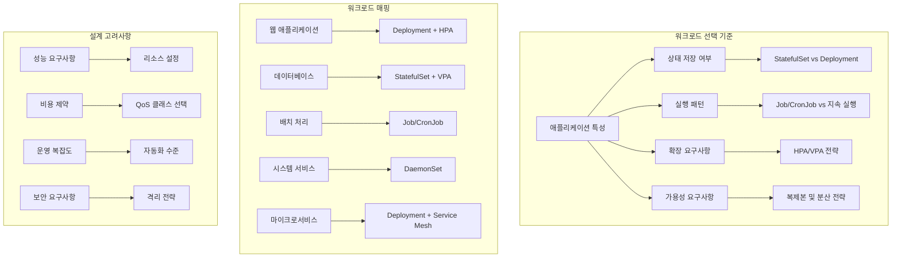
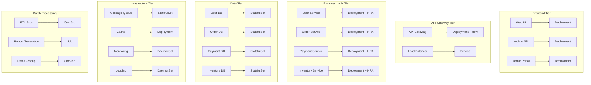
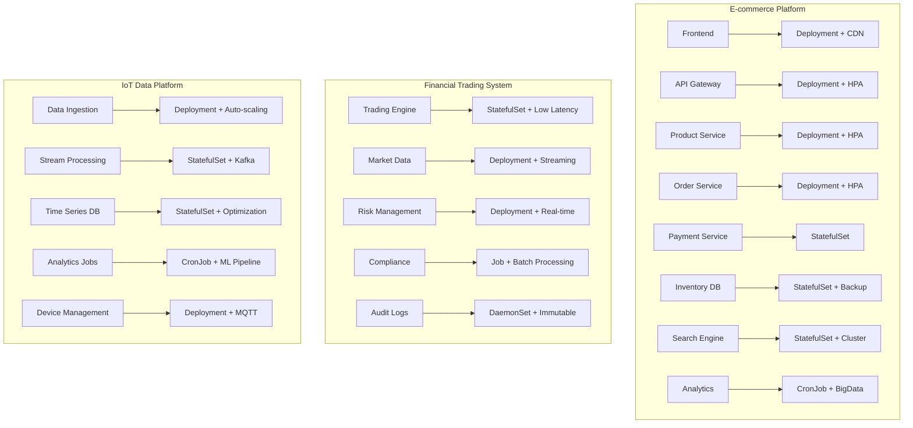
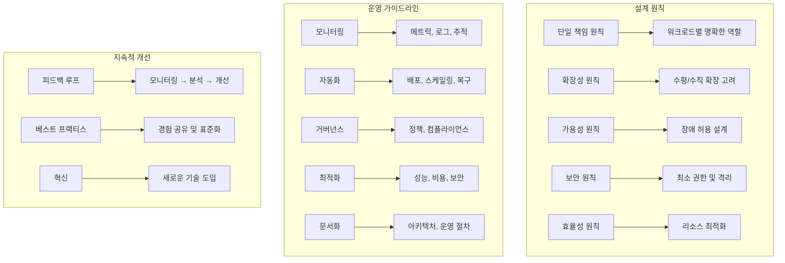

# Session 8: 워크로드 패턴 종합 및 설계 원칙

## 📍 교과과정에서의 위치
이 세션은 **Week 3 > Day 1 > Session 8**로, Day 1에서 학습한 모든 고급 워크로드 관리 개념을 종합하고 실무 적용을 위한 설계 원칙을 학습합니다.

## 학습 목표 (5분)
- **워크로드 타입별** 선택 기준과 **설계 패턴** 종합 이해
- **마이크로서비스 아키텍처**에서의 **워크로드 조합** 전략 학습
- **실무 적용 시나리오**와 **모범 사례** 분석 및 적용 방법 파악
- **워크로드 설계 원칙**과 **운영 가이드라인** 수립 방법 이해

## 1. 워크로드 타입별 선택 기준 (15분)

### 워크로드 결정 매트릭스



### 워크로드 선택 가이드
```
워크로드 타입별 선택 기준:

Deployment 선택 기준:
   🔹 적용 대상:
      • 무상태 애플리케이션
      • 웹 서버 (Nginx, Apache)
      • API 서버 (REST, GraphQL)
      • 마이크로서비스
      • 프론트엔드 애플리케이션
   🔹 특성 요구사항:
      • 수평 확장 가능
      • 인스턴스 간 독립성
      • 로드 밸런싱 지원
      • 롤링 업데이트 필요
      • 빠른 시작/종료
   🔹 설계 고려사항:
      • 복제본 수 결정
      • 업데이트 전략 선택
      • 리소스 요구사항 분석
      • 헬스체크 구성
      • 서비스 디스커버리 연동
   🔹 최적화 전략:
      • HPA 연동으로 자동 스케일링
      • PodDisruptionBudget 설정
      • 안티 어피니티 규칙 적용
      • 리소스 효율성 최적화
      • 모니터링 통합
   🔹 실무 패턴:
   🔹 Blue-Green 배포
   🔹 카나리 배포
   🔹 A/B 테스트 지원
   🔹 다중 환경 관리
   🔹 CI/CD 파이프라인 통합

StatefulSet 선택 기준:
   🔹 적용 대상:
      • 데이터베이스 (MySQL, PostgreSQL, MongoDB)
      • 메시징 시스템 (Kafka, RabbitMQ)
      • 분산 스토리지 (Ceph, GlusterFS)
      • 검색 엔진 (Elasticsearch, Solr)
      • 상태 저장 애플리케이션
   🔹 특성 요구사항:
      • 안정적인 네트워크 ID
      • 영구 스토리지 필요
      • 순서 있는 배포/스케일링
      • 데이터 일관성 보장
      • 클러스터 멤버십 관리
   🔹 설계 고려사항:
      • 스토리지 클래스 선택
      • 백업 및 복구 전략
      • 네트워크 정책 설정
      • 보안 설정 (인증, 암호화)
      • 모니터링 및 알림
   🔹 최적화 전략:
      • VPA를 통한 리소스 최적화
      • 스토리지 성능 튜닝
      • 네트워크 지연 최소화
      • 백업 자동화
      • 장애 복구 자동화
   🔹 운영 패턴:
   🔹 마스터-슬레이브 구성
   🔹 클러스터 확장 전략
   🔹 데이터 마이그레이션
   🔹 업그레이드 절차
   🔹 재해 복구 계획

Job/CronJob 선택 기준:
   🔹 Job 적용 대상:
      • 일회성 데이터 처리
      • 배치 분석 작업
      • 이미지/비디오 처리
      • 머신러닝 훈련
      • 데이터 마이그레이션
   🔹 CronJob 적용 대상:
      • 정기 백업 작업
      • 로그 정리 및 아카이빙
      • 보고서 생성
      • 시스템 유지보수
      • 데이터 동기화
   🔹 설계 고려사항:
      • 병렬 처리 전략
      • 실패 처리 및 재시도
      • 리소스 사용량 예측
      • 완료 조건 정의
      • 결과 데이터 관리
   🔹 최적화 전략:
      • 작업 분할 최적화
      • 리소스 효율성 향상
      • 스팟 인스턴스 활용
      • 큐 시스템 연동
      • 모니터링 및 알림
   🔹 운영 패턴:
   🔹 작업 큐 패턴
   🔹 파이프라인 처리
   🔹 의존성 관리
   🔹 에러 처리 및 복구
   🔹 성능 모니터링

DaemonSet 선택 기준:
   🔹 적용 대상:
      • 로그 수집 에이전트 (Fluentd, Filebeat)
      • 모니터링 에이전트 (Node Exporter)
      • 네트워킹 컴포넌트 (CNI, kube-proxy)
      • 보안 에이전트
      • 스토리지 드라이버
   🔹 특성 요구사항:
      • 모든 노드에서 실행
      • 시스템 레벨 접근
      • 호스트 리소스 활용
      • 노드 생명주기 연동
      • 시스템 서비스 특성
   🔹 설계 고려사항:
      • 노드 선택 전략
      • 리소스 사용량 제한
      • 보안 권한 최소화
      • 업데이트 전략
      • 장애 대응 방안
   🔹 최적화 전략:
      • 리소스 사용량 최적화
      • 네트워크 효율성 향상
      • 스토리지 I/O 최적화
      • CPU 사용률 관리
      • 메모리 효율성
   🔹 운영 패턴:
   🔹 점진적 롤아웃
   🔹 노드별 설정 관리
   🔹 중앙집중식 로그 수집
   🔹 메트릭 집계
   🔹 자동 복구 메커니즘

워크로드 조합 전략:
   🔹 계층별 워크로드:
      • 프레젠테이션 계층: Deployment (웹 서버)
      • 애플리케이션 계층: Deployment (API 서버)
      • 비즈니스 로직 계층: Deployment (마이크로서비스)
      • 데이터 계층: StatefulSet (데이터베이스)
      • 인프라 계층: DaemonSet (시스템 서비스)
   🔹 기능별 워크로드:
      • 실시간 처리: Deployment + HPA
      • 배치 처리: Job/CronJob
      • 스트림 처리: StatefulSet (Kafka) + Deployment (Consumer)
      • 캐싱: Deployment (Redis) 또는 StatefulSet (Redis Cluster)
      • 모니터링: DaemonSet (수집) + Deployment (처리)
   🔹 환경별 워크로드:
      • 개발: 단순한 Deployment 중심
      • 테스트: 프로덕션 유사 구성
      • 스테이징: 완전한 프로덕션 복제
      • 프로덕션: 고가용성 및 성능 최적화
      • DR: 재해 복구 전용 구성
   🔹 스케일링 전략:
   🔹 수평 스케일링: Deployment + HPA
   🔹 수직 스케일링: StatefulSet + VPA
   🔹 혼합 스케일링: 워크로드별 최적 전략
   🔹 예측적 스케일링: 머신러닝 기반
   🔹 이벤트 기반 스케일링: KEDA 활용
```

## 2. 마이크로서비스 아키텍처 워크로드 조합 (12분)

### 마이크로서비스 워크로드 아키텍처



### 마이크로서비스 워크로드 전략
```
마이크로서비스 아키텍처 워크로드 설계:

서비스별 워크로드 전략:
   🔹 API Gateway:
      • 워크로드: Deployment + HPA
      • 특성: 높은 처리량, 낮은 지연시간
      • 스케일링: CPU 및 RPS 기반 HPA
      • 리소스: CPU 집약적, 적당한 메모리
      • 가용성: 다중 AZ 분산, 안티 어피니티
      • 보안: TLS 종료, 인증/인가
      • 모니터링: 요청 메트릭, 에러율, 지연시간
   🔹 비즈니스 서비스:
      • 워크로드: Deployment + HPA
      • 특성: 비즈니스 로직 처리, 상태 없음
      • 스케일링: CPU, 메모리, 커스텀 메트릭 기반
      • 리소스: 서비스별 특성에 따라 차등화
      • 가용성: 서비스 중요도별 복제본 수 조정
      • 통신: 서비스 메시 또는 직접 통신
      • 데이터: 외부 데이터베이스 연동
   🔹 데이터 서비스:
      • 워크로드: StatefulSet + VPA
      • 특성: 상태 저장, 데이터 일관성 중요
      • 스케일링: 수직 스케일링 우선, 필요시 샤딩
      • 리소스: 메모리 집약적, 스토리지 최적화
      • 가용성: 마스터-슬레이브 구성, 백업 전략
      • 보안: 네트워크 정책, 암호화, 접근 제어
      • 모니터링: 성능 메트릭, 연결 수, 쿼리 분석
   🔹 메시징 시스템:
      • 워크로드: StatefulSet (클러스터) 또는 Deployment (단일)
      • 특성: 비동기 통신, 메시지 지속성
      • 스케일링: 토픽/큐 기반 파티셔닝
      • 리소스: 네트워크 I/O 집약적
      • 가용성: 복제 팩터 설정, 다중 브로커
      • 성능: 배치 처리, 압축 활용
      • 모니터링: 메시지 처리량, 지연시간, 큐 길이
   🔹 캐시 시스템:
   🔹 워크로드: Deployment (단일) 또는 StatefulSet (클러스터)
   🔹 특성: 빠른 데이터 접근, 휘발성 데이터
   🔹 스케일링: 메모리 사용률 기반
   🔹 리소스: 메모리 집약적, 네트워크 최적화
   🔹 가용성: 복제본 설정, 장애 허용성
   🔹 성능: 메모리 최적화, 연결 풀링
   🔹 모니터링: 히트율, 메모리 사용률, 연결 수

서비스 간 통신 패턴:
   🔹 동기 통신:
      • HTTP/REST API
      • gRPC
      • GraphQL
      • 서비스 메시 활용
      • 로드 밸런싱 및 서킷 브레이커
   🔹 비동기 통신:
      • 메시지 큐 (RabbitMQ, Apache Kafka)
      • 이벤트 스트리밍
      • Pub/Sub 패턴
      • 이벤트 소싱
      • CQRS 패턴
   🔹 데이터 일관성:
      • 최종 일관성 (Eventual Consistency)
      • Saga 패턴
      • 분산 트랜잭션
      • 이벤트 기반 일관성
      • 보상 트랜잭션
   🔹 서비스 디스커버리:
      • Kubernetes Service
      • 서비스 메시 (Istio, Linkerd)
      • 외부 서비스 레지스트리
      • DNS 기반 디스커버리
      • 클라이언트 사이드 로드 밸런싱
   🔹 보안 및 인증:
   🔹 JWT 토큰 기반 인증
   🔹 OAuth 2.0 / OpenID Connect
   🔹 mTLS (상호 TLS)
   🔹 API 키 관리
   🔹 네트워크 정책 적용

데이터 관리 전략:
   🔹 데이터베이스 패턴:
      • Database per Service
      • Shared Database (안티패턴)
      • 폴리글랏 퍼시스턴스
      • CQRS (Command Query Responsibility Segregation)
      • 이벤트 소싱
   🔹 데이터 동기화:
      • 이벤트 기반 동기화
      • CDC (Change Data Capture)
      • 배치 동기화
      • 실시간 복제
      • 데이터 파이프라인
   🔹 캐싱 전략:
      • 애플리케이션 레벨 캐시
      • 분산 캐시 (Redis, Hazelcast)
      • CDN 캐싱
      • 데이터베이스 쿼리 캐시
      • 캐시 무효화 전략
   🔹 백업 및 복구:
      • 서비스별 백업 전략
      • 크로스 서비스 일관성
      • 포인트 인 타임 복구
      • 재해 복구 계획
      • 데이터 아카이빙
   🔹 데이터 거버넌스:
   🔹 데이터 소유권 정의
   🔹 스키마 진화 관리
   🔹 데이터 품질 관리
   🔹 개인정보 보호
   🔹 컴플라이언스 준수

운영 및 모니터링:
   🔹 관찰 가능성 (Observability):
      • 메트릭 수집 (Prometheus)
      • 로그 집계 (ELK Stack)
      • 분산 추적 (Jaeger, Zipkin)
      • 대시보드 (Grafana)
      • 알림 및 에스컬레이션
   🔹 성능 모니터링:
      • 응답 시간 추적
      • 처리량 모니터링
      • 에러율 분석
      • 리소스 사용률 추적
      • 비즈니스 메트릭 모니터링
   🔹 장애 대응:
      • 서킷 브레이커 패턴
      • 재시도 및 백오프
      • 타임아웃 설정
      • 벌크헤드 패턴
      • 카오스 엔지니어링
   🔹 배포 전략:
      • 블루-그린 배포
      • 카나리 배포
      • 롤링 업데이트
      • A/B 테스트
      • 피처 플래그
   🔹 자동화:
   🔹 CI/CD 파이프라인
   🔹 인프라 자동화
   🔹 테스트 자동화
   🔹 모니터링 자동화
   🔹 복구 자동화
```

## 3. 실무 적용 시나리오와 모범 사례 (10분)

### 실무 시나리오별 워크로드 설계



### 실무 모범 사례
```
실무 적용 시나리오별 모범 사례:

E-commerce 플랫폼:
   🔹 아키텍처 특성:
      • 높은 트래픽 변동성
      • 계절성 패턴 (블랙프라이데이, 크리스마스)
      • 글로벌 사용자 기반
      • 다양한 서비스 조합
      • 높은 가용성 요구사항
   🔹 워크로드 설계:
      • 프론트엔드: Deployment + CDN + 지역별 분산
      • API Gateway: Deployment + HPA (RPS 기반)
      • 상품 서비스: Deployment + HPA + 캐시 연동
      • 주문 서비스: Deployment + HPA + 메시지 큐
      • 결제 서비스: StatefulSet + 높은 보안 + 감사
      • 재고 관리: StatefulSet + 실시간 동기화
      • 검색 엔진: StatefulSet + 클러스터 + 인덱싱
      • 분석 작업: CronJob + 빅데이터 파이프라인
   🔹 스케일링 전략:
      • 예측적 스케일링 (트래픽 패턴 기반)
      • 이벤트 기반 스케일링 (플래시 세일)
      • 지역별 차등 스케일링
      • 서비스별 독립적 스케일링
      • 비용 최적화 스케일링
   🔹 데이터 관리:
      • 마이크로서비스별 전용 데이터베이스
      • 읽기 전용 복제본 활용
      • 캐시 계층 구조 (L1, L2, CDN)
      • 이벤트 기반 데이터 동기화
      • 실시간 재고 관리
   🔹 운영 최적화:
   🔹 다중 리전 배포
   🔹 장애 격리 및 복구
   🔹 성능 모니터링 및 최적화
   🔹 보안 및 컴플라이언스
   🔹 비용 모니터링 및 최적화

금융 거래 시스템:
   🔹 아키텍처 특성:
      • 초저지연 요구사항 (마이크로초 단위)
      • 높은 처리량 (초당 수백만 거래)
      • 강한 일관성 요구
      • 엄격한 규제 준수
      • 24/7 가용성
   🔹 워크로드 설계:
      • 거래 엔진: StatefulSet + 전용 하드웨어 + NUMA 최적화
      • 시장 데이터: Deployment + 스트리밍 + 메모리 최적화
      • 리스크 관리: Deployment + 실시간 계산 + 병렬 처리
      • 컴플라이언스: Job + 배치 처리 + 감사 추적
      • 감사 로그: DaemonSet + 불변 저장소 + 암호화
      • 백업 시스템: CronJob + 증분 백업 + 다중 사이트
      • 모니터링: DaemonSet + 실시간 알림 + 대시보드
   🔹 성능 최적화:
      • CPU 어피니티 및 격리
      • 메모리 최적화 (대용량 페이지)
      • 네트워크 최적화 (SR-IOV, DPDK)
      • 스토리지 최적화 (NVMe, 메모리 매핑)
      • 가비지 컬렉션 튜닝
   🔹 보안 및 컴플라이언스:
      • 네트워크 분할 및 격리
      • 암호화 (전송 중, 저장 중)
      • 접근 제어 및 인증
      • 감사 로깅 및 추적
      • 규제 보고 자동화
   🔹 장애 대응:
   🔹 핫 스탠바이 시스템
   🔹 자동 페일오버
   🔹 데이터 복제 및 동기화
   🔹 재해 복구 계획
   🔹 비즈니스 연속성 보장

IoT 데이터 플랫폼:
   🔹 아키텍처 특성:
      • 대량의 센서 데이터 수집
      • 실시간 스트림 처리
      • 시계열 데이터 저장
      • 머신러닝 기반 분석
      • 엣지-클라우드 하이브리드
   🔹 워크로드 설계:
      • 데이터 수집: Deployment + 오토스케일링 + 로드 밸런싱
      • 스트림 처리: StatefulSet + Kafka + 파티셔닝
      • 시계열 DB: StatefulSet + 압축 + 파티셔닝
      • 분석 작업: CronJob + ML 파이프라인 + GPU 활용
      • 디바이스 관리: Deployment + MQTT + 상태 관리
      • 엣지 처리: DaemonSet + 경량 컨테이너
      • 대시보드: Deployment + 실시간 시각화
   🔹 데이터 처리:
      • 배치 처리 (히스토리 분석)
      • 스트림 처리 (실시간 알림)
      • 복합 이벤트 처리 (CEP)
      • 머신러닝 파이프라인
      • 데이터 아카이빙
   🔹 확장성 설계:
      • 수평적 파티셔닝
      • 지역별 데이터 센터
      • 엣지 컴퓨팅 활용
      • 계층적 스토리지
      • 적응적 스케일링
   🔹 최적화 전략:
   🔹 데이터 압축 및 중복 제거
   🔹 배치 처리 최적화
   🔹 캐시 전략 (핫 데이터)
   🔹 네트워크 대역폭 최적화
   🔹 비용 효율적 스토리지

DevOps 플랫폼:
   🔹 아키텍처 특성:
      • CI/CD 파이프라인 지원
      • 다양한 개발 팀 지원
      • 멀티 테넌트 환경
      • 보안 및 컴플라이언스
      • 자동화 및 셀프 서비스
   🔹 워크로드 설계:
      • CI/CD 엔진: Deployment + 동적 스케일링
      • 아티팩트 저장소: StatefulSet + 고가용성
      • 코드 품질 검사: Job + 병렬 처리
      • 보안 스캔: CronJob + 정책 기반
      • 모니터링 스택: DaemonSet + 중앙집중식
      • 로그 관리: DaemonSet + 집계 + 검색
      • 설정 관리: Deployment + GitOps
   🔹 자동화 전략:
      • 인프라 프로비저닝 자동화
      • 애플리케이션 배포 자동화
      • 테스트 자동화
      • 보안 검사 자동화
      • 모니터링 설정 자동화
   🔹 거버넌스:
      • 정책 기반 배포 제어
      • 리소스 할당 관리
      • 보안 정책 적용
      • 컴플라이언스 검사
      • 비용 추적 및 최적화
   🔹 셀프 서비스:
   🔹 개발자 포털
   🔹 템플릿 기반 프로비저닝
   🔹 자동화된 환경 생성
   🔹 모니터링 대시보드
   🔹 문제 해결 가이드
```

## 4. 워크로드 설계 원칙과 운영 가이드라인 (10분)

### 설계 원칙 프레임워크



### 설계 원칙 및 가이드라인
```
워크로드 설계 원칙 및 운영 가이드라인:

핵심 설계 원칙:
   🔹 단일 책임 원칙 (Single Responsibility):
      • 각 워크로드는 하나의 명확한 책임
      • 마이크로서비스 아키텍처 적용
      • 느슨한 결합, 높은 응집도
      • 독립적 배포 및 확장
      • 장애 격리 및 복구
   🔹 확장성 원칙 (Scalability):
      • 수평 확장 우선 고려
      • 상태 분리 및 외부화
      • 로드 밸런싱 및 분산 처리
      • 캐시 및 CDN 활용
      • 비동기 처리 패턴
   🔹 가용성 원칙 (Availability):
      • 다중 가용 영역 배포
      • 복제본 및 백업 전략
      • 자동 장애 감지 및 복구
      • 서킷 브레이커 패턴
      • 우아한 성능 저하
   🔹 보안 원칙 (Security):
      • 최소 권한 원칙 적용
      • 네트워크 분할 및 격리
      • 암호화 (전송 중, 저장 중)
      • 인증 및 인가 통합
      • 보안 모니터링 및 감사
   🔹 효율성 원칙 (Efficiency):
      • 리소스 사용량 최적화
      • 비용 효율적 아키텍처
      • 성능 모니터링 및 튜닝
      • 자동화를 통한 운영 효율성
      • 지속적 최적화
   🔹 관찰 가능성 원칙 (Observability):
   🔹 포괄적 모니터링 구현
   🔹 구조화된 로깅
   🔹 분산 추적 지원
   🔹 메트릭 기반 알림
   🔹 대시보드 및 시각화

운영 가이드라인:
   🔹 배포 및 릴리스 관리:
      • GitOps 기반 배포
      • 블루-그린 또는 카나리 배포
      • 자동화된 테스트 파이프라인
      • 롤백 계획 및 절차
      • 배포 승인 프로세스
      • 환경별 배포 전략
      • 릴리스 노트 및 문서화
   🔹 모니터링 및 알림:
      • SLI/SLO 정의 및 측정
      • 다층 모니터링 (인프라, 애플리케이션, 비즈니스)
      • 실시간 알림 및 에스컬레이션
      • 대시보드 표준화
      • 로그 집계 및 분석
      • 성능 벤치마킹
      • 용량 계획 및 예측
   🔹 보안 및 컴플라이언스:
      • 보안 정책 정의 및 적용
      • 취약점 스캔 및 관리
      • 접근 제어 및 권한 관리
      • 감사 로깅 및 추적
      • 인시던트 대응 계획
      • 정기적 보안 검토
      • 컴플라이언스 자동화
   🔹 성능 최적화:
      • 정기적 성능 리뷰
      • 병목 지점 식별 및 해결
      • 리소스 사용률 최적화
      • 캐시 전략 최적화
      • 데이터베이스 튜닝
      • 네트워크 최적화
      • 코드 레벨 최적화
   🔹 비용 관리:
      • 리소스 사용량 추적
      • 비용 할당 및 차지백
      • 스팟 인스턴스 활용
      • 자동 스케일링 최적화
      • 리소스 정리 자동화
      • 비용 예산 및 알림
      • ROI 분석 및 최적화
   🔹 재해 복구 및 비즈니스 연속성:
   🔹 백업 전략 및 테스트
   🔹 재해 복구 계획 수립
   🔹 RTO/RPO 목표 설정
   🔹 정기적 DR 테스트
   🔹 다중 리전 전략
   🔹 데이터 복제 및 동기화
   🔹 비즈니스 연속성 계획

지속적 개선 프로세스:
   🔹 피드백 루프 구축:
      • 정기적 성능 리뷰
      • 사용자 피드백 수집
      • 인시던트 사후 분석
      • 메트릭 기반 의사결정
      • 개선 사항 우선순위화
      • 실행 계획 수립
   🔹 베스트 프랙티스 공유:
      • 내부 지식 베이스 구축
      • 정기적 기술 세미나
      • 코드 리뷰 문화
      • 아키텍처 리뷰 보드
      • 외부 커뮤니티 참여
      • 표준화 및 가이드라인
   🔹 기술 혁신 도입:
      • 신기술 평가 프로세스
      • PoC 및 파일럿 프로젝트
      • 점진적 도입 전략
      • 위험 평가 및 관리
      • 교육 및 역량 개발
      • 성과 측정 및 평가
   🔹 조직 역량 강화:
      • 기술 교육 프로그램
      • 인증 및 자격증 지원
      • 멘토링 프로그램
      • 크로스 트레이닝
      • 컨퍼런스 참여 지원
      • 내부 기술 커뮤니티
   🔹 문화 및 프로세스 개선:
   🔹 DevOps 문화 정착
   🔹 자동화 우선 사고
   🔹 실패에서 학습하는 문화
   🔹 지속적 실험 및 개선
   🔹 데이터 기반 의사결정
   🔹 고객 중심 사고

성공 지표 및 측정:
   🔹 기술적 지표:
      • 시스템 가용성 (99.9%+)
      • 평균 응답 시간 (<100ms)
      • 배포 빈도 (일일/주간)
      • 배포 성공률 (95%+)
      • 평균 복구 시간 (MTTR)
      • 리소스 활용률 (70-80%)
   🔹 비즈니스 지표:
      • 비용 효율성 ($/transaction)
      • 개발 생산성 (feature/sprint)
      • 고객 만족도 (NPS)
      • 시장 출시 시간 (TTM)
      • 매출 영향 (revenue impact)
      • 경쟁 우위 (competitive advantage)
   🔹 운영 지표:
      • 인시던트 발생 빈도
      • 평균 해결 시간
      • 변경 실패율
      • 보안 사고 발생률
      • 컴플라이언스 준수율
      • 팀 만족도
   🔹 혁신 지표:
   🔹 신기술 도입률
   🔹 자동화 수준
   🔹 실험 성공률
   🔹 특허 및 논문 발표
   🔹 오픈소스 기여도
   🔹 업계 인정도
```

## 💬 그룹 토론: 워크로드 설계 시 핵심 의사결정 요소 (8분)

### 토론 주제
**"복잡한 비즈니스 요구사항을 만족하는 워크로드 아키텍처를 설계할 때, 가장 중요한 의사결정 요소들과 그 우선순위는 무엇인가?"**

### 토론 가이드라인

#### 비즈니스 요구사항 분석 (3분)
- 성능 요구사항: 응답시간, 처리량, 동시 사용자 수
- 가용성 요구사항: SLA, 다운타임 허용도, 재해 복구
- 확장성 요구사항: 성장 예측, 피크 트래픽 대응

#### 기술적 제약사항 (3분)
- 리소스 제약: 예산, 인프라, 인력
- 기술 스택: 기존 시스템과의 호환성, 팀 역량
- 보안 및 컴플라이언스: 규제 요구사항, 보안 정책

#### 운영 고려사항 (2분)
- 관리 복잡도: 운영 팀 역량, 자동화 수준
- 모니터링 및 디버깅: 관찰 가능성, 문제 해결 용이성
- 미래 확장성: 기술 진화, 비즈니스 변화 대응

## 💡 핵심 개념 정리
- 워크로드 선택: 애플리케이션 특성에 따른 최적 워크로드 타입 결정
- 마이크로서비스 조합: 서비스별 특성을 고려한 워크로드 조합 전략
- 실무 모범 사례: 도메인별 검증된 아키텍처 패턴과 최적화 기법
- 설계 원칙: 확장성, 가용성, 보안, 효율성을 고려한 체계적 설계 접근

## 📚 참고 자료
- [Kubernetes Workloads](https://kubernetes.io/docs/concepts/workloads/)
- [Microservices Patterns](https://microservices.io/patterns/)
- [Cloud Native Patterns](https://www.manning.com/books/cloud-native-patterns)
- [Site Reliability Engineering](https://sre.google/books/)

## Day 1 종합 정리
Day 1에서는 Kubernetes의 고급 워크로드 관리 패턴을 종합적으로 학습했습니다:
- StatefulSet: 상태 저장 애플리케이션 관리
- DaemonSet: 시스템 서비스 배포
- Job/CronJob: 배치 처리 자동화
- HPA/VPA: 자동 스케일링 전략
- Operator: 도메인 특화 자동화
- 스케줄링: 고급 배치 최적화
- 리소스 관리: QoS와 거버넌스
- 설계 원칙: 실무 적용 가이드라인

## 다음 Day 준비
Day 2에서는 **보안 모델과 정책 관리**에 대해 학습합니다. Kubernetes의 보안 아키텍처, RBAC, 네트워크 정책, 컴플라이언스 등 프로덕션 환경에서 필수적인 보안 개념들을 다룰 예정입니다.