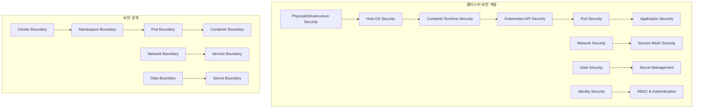
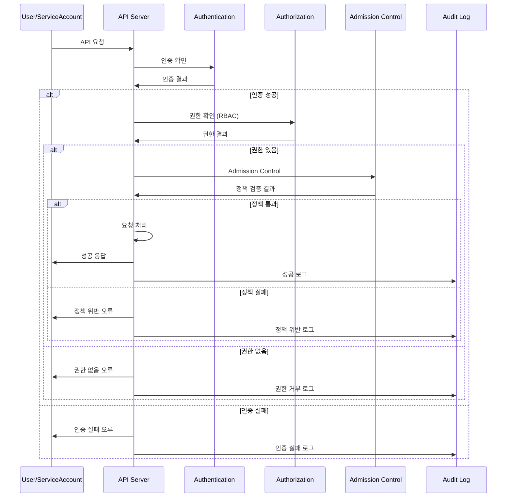
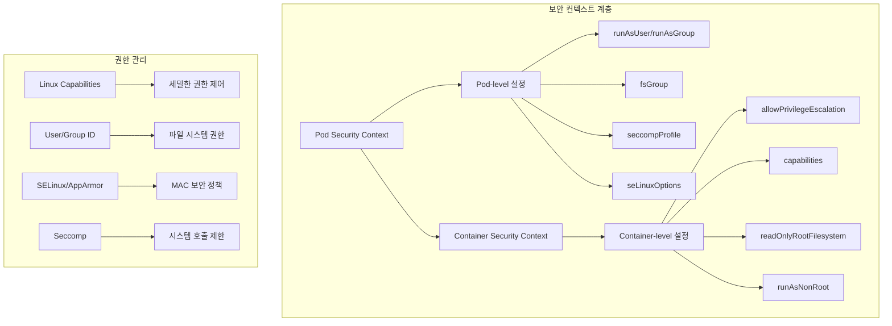
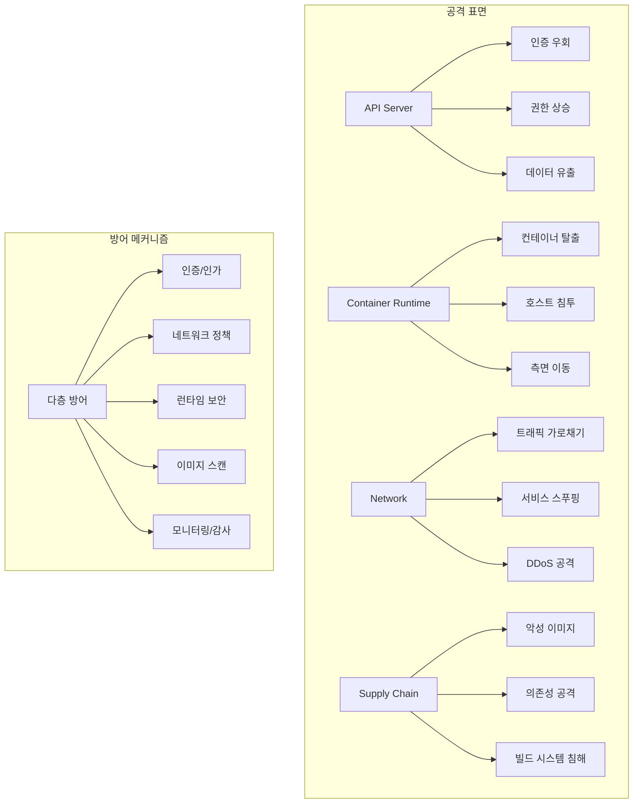

# Session 1: Kubernetes 보안 모델 개요

## 📍 교과과정에서의 위치
이 세션은 **Week 3 > Day 2 > Session 1**로, Kubernetes의 전체적인 보안 모델과 다층 방어 아키텍처를 학습합니다.

## 학습 목표 (5분)
- **다층 보안 아키텍처**와 **보안 경계** 설정 원리 이해
- **인증, 인가, 감사** (AAA) 프레임워크 메커니즘 학습
- **보안 컨텍스트**와 **권한 관리** 체계 파악
- **위협 모델링**과 **공격 벡터** 분석 방법 이해

## 1. 다층 보안 아키텍처 (15분)

### Kubernetes 보안 계층



### 보안 계층 상세 분석
```
Kubernetes 다층 보안 모델:

1. 인프라 보안 계층:
   🔹 물리적 보안:
      • 데이터센터 접근 제어
      • 하드웨어 보안 모듈 (HSM)
      • 물리적 네트워크 분리
      • 전력 및 냉각 시스템 보안
      • 재해 복구 및 백업 시설
   🔹 호스트 OS 보안:
      • OS 하드닝 및 패치 관리
      • 커널 보안 모듈 (SELinux, AppArmor)
      • 파일시스템 암호화
      • 로그 모니터링 및 감사
      • 침입 탐지 시스템 (IDS)
   🔹 컨테이너 런타임 보안:
      • 런타임 격리 (cgroups, namespaces)
      • 보안 프로파일 적용
      • 런타임 모니터링
      • 컨테이너 이미지 검증
      • 런타임 정책 적용
   🔹 네트워크 인프라 보안:
   🔹 네트워크 분할 및 VLAN
   🔹 방화벽 및 라우터 보안
   🔹 VPN 및 암호화 터널
   🔹 DDoS 방어 시스템
   🔹 네트워크 모니터링

2. Kubernetes 플랫폼 보안:
   🔹 API 서버 보안:
      • TLS 암호화 통신
      • 인증서 관리 및 로테이션
      • API 버전 관리
      • 요청 제한 및 스로틀링
      • 감사 로깅
   🔹 etcd 보안:
      • 저장 데이터 암호화
      • 클라이언트 인증서 검증
      • 네트워크 격리
      • 백업 암호화
      • 접근 로그 모니터링
   🔹 컨트롤 플레인 보안:
      • 컴포넌트 간 mTLS
      • 서비스 계정 토큰 관리
      • 권한 최소화
      • 보안 업데이트 관리
      • 고가용성 구성
   🔹 노드 보안:
   🔹 kubelet 보안 설정
   🔹 컨테이너 런타임 보안
   🔹 네트워크 플러그인 보안
   🔹 스토리지 플러그인 보안
   🔹 모니터링 에이전트 보안

3. 워크로드 보안 계층:
   🔹 Pod 보안:
      • Security Context 설정
      • Pod Security Standards
      • 리소스 제한 및 격리
      • 네트워크 정책 적용
      • 런타임 보안 모니터링
   🔹 컨테이너 보안:
      • 이미지 보안 스캔
      • 런타임 권한 제한
      • 파일시스템 보안
      • 프로세스 격리
      • 시스템 호출 제한
   🔹 애플리케이션 보안:
      • 코드 보안 검사
      • 의존성 취약점 관리
      • 설정 보안 검증
      • 런타임 보안 모니터링
      • 보안 테스트 자동화
   🔹 데이터 보안:
   🔹 전송 중 암호화
   🔹 저장 중 암호화
   🔹 키 관리 시스템
   🔹 데이터 분류 및 라벨링
   🔹 접근 제어 및 감사

보안 경계 설정:
   🔹 클러스터 경계:
      • 클러스터 간 네트워크 분리
      • 독립적인 인증 시스템
      • 별도의 관리 권한
      • 리소스 격리
      • 감사 로그 분리
   🔹 네임스페이스 경계:
      • 논리적 격리 단위
      • 리소스 쿼터 적용
      • 네트워크 정책 범위
      • RBAC 권한 범위
      • 보안 정책 적용 범위
   🔹 Pod 경계:
      • 컨테이너 그룹 격리
      • 공유 네트워크 및 스토리지
      • 보안 컨텍스트 공유
      • 생명주기 관리
      • 리소스 공유 제한
   🔹 컨테이너 경계:
   🔹 프로세스 격리
   🔹 파일시스템 격리
   🔹 네트워크 네임스페이스
   🔹 사용자 네임스페이스
   🔹 리소스 제한
```

## 2. 인증, 인가, 감사 (AAA) 프레임워크 (12분)

### AAA 아키텍처



### AAA 프레임워크 상세
```
Kubernetes AAA (Authentication, Authorization, Audit):

인증 (Authentication):
   🔹 인증 방법:
      • X.509 클라이언트 인증서:
         • 클러스터 CA 서명 인증서
         • 사용자 및 그룹 정보 포함
         • 인증서 만료 관리
         • 인증서 폐기 목록 (CRL)
         • 자동 인증서 로테이션
      • 서비스 계정 토큰:
         • JWT 기반 토큰
         • 자동 마운트 및 로테이션
         • 토큰 만료 시간 설정
         • 바운드 서비스 계정 토큰
         • 토큰 프로젝션
      • OpenID Connect (OIDC):
         • 외부 IdP 통합 (Google, Azure AD)
         • JWT 토큰 검증
         • 그룹 클레임 매핑
         • 토큰 갱신 처리
         • 다중 IdP 지원
      • Webhook 토큰 인증:
         • 외부 인증 서비스 연동
         • 커스텀 인증 로직
         • 토큰 검증 API
         • 캐싱 및 성능 최적화
         • 장애 허용성
      • 프록시 인증:
      • 리버스 프록시 기반
      • 헤더 기반 사용자 정보
      • 신뢰할 수 있는 프록시 설정
      • 헤더 검증 및 보안
      • SSO 통합
   🔹 인증 체인:
      • 다중 인증 방법 지원
      • 순차적 인증 시도
      • 첫 번째 성공 시 인증 완료
      • 인증 실패 시 다음 방법 시도
      • 모든 방법 실패 시 거부
   🔹 익명 접근:
      • 익명 사용자 지원
      • 제한된 권한 부여
      • 공개 API 접근
      • 보안 정책 적용
      • 감사 로깅
   🔹 인증 보안:
   🔹 브루트 포스 공격 방지
   🔹 계정 잠금 정책
   🔹 다중 인증 (MFA) 지원
   🔹 세션 관리
   🔹 인증 이벤트 모니터링

인가 (Authorization):
   🔹 RBAC (Role-Based Access Control):
      • Role 및 ClusterRole 정의
      • RoleBinding 및 ClusterRoleBinding
      • 세밀한 권한 제어
      • 네임스페이스 기반 격리
      • 권한 상속 및 집계
   🔹 ABAC (Attribute-Based Access Control):
      • 속성 기반 정책 정의
      • 동적 권한 결정
      • 복잡한 정책 표현
      • 컨텍스트 기반 접근 제어
      • 정책 파일 관리
   🔹 Webhook 인가:
      • 외부 인가 서비스 연동
      • 커스텀 인가 로직
      • 실시간 정책 평가
      • 외부 시스템 통합
      • 성능 및 가용성 고려
   🔹 Node 인가:
      • kubelet 권한 제한
      • 노드별 리소스 접근 제어
      • Pod 스케줄링 권한
      • 시크릿 접근 제한
      • 노드 상태 업데이트 권한
   🔹 인가 체인:
   🔹 다중 인가 모듈 지원
   🔹 순차적 권한 확인
   🔹 첫 번째 허용 시 승인
   🔹 모든 모듈 거부 시 차단
   🔹 인가 결정 로깅

감사 (Audit):
   🔹 감사 정책:
      • 감사 레벨 설정 (None, Metadata, Request, RequestResponse)
      • 리소스별 감사 규칙
      • 네임스페이스별 정책
      • 사용자별 감사 설정
      • 동적 정책 업데이트
   🔹 감사 백엔드:
      • 로그 파일 백엔드
      • Webhook 백엔드
      • 동적 백엔드 설정
      • 백엔드 장애 처리
      • 성능 최적화
   🔹 감사 이벤트:
      • API 요청 및 응답
      • 인증 및 인가 결과
      • 리소스 변경 사항
      • 시스템 이벤트
      • 보안 관련 이벤트
   🔹 로그 관리:
      • 로그 로테이션
      • 압축 및 아카이빙
      • 중앙집중식 로그 수집
      • 로그 검색 및 분석
      • 장기 보존 정책
   🔹 컴플라이언스:
   🔹 규제 요구사항 준수
   🔹 감사 증적 관리
   🔹 보고서 생성
   🔹 데이터 무결성 보장
   🔹 접근 제어 및 보안
```

## 3. 보안 컨텍스트와 권한 관리 (10분)

### 보안 컨텍스트 계층



### 보안 컨텍스트 상세 설정
```
보안 컨텍스트 및 권한 관리:

Pod 보안 컨텍스트:
   🔹 사용자 및 그룹 설정:
      • runAsUser: 실행 사용자 ID
      • runAsGroup: 실행 그룹 ID
      • runAsNonRoot: 루트 사용자 실행 금지
      • fsGroup: 파일시스템 그룹 ID
      • fsGroupChangePolicy: 그룹 변경 정책
   🔹 보안 프로파일:
      • seccompProfile: Seccomp 프로파일 설정
      • seLinuxOptions: SELinux 컨텍스트
      • appArmorProfile: AppArmor 프로파일
      • windowsOptions: Windows 보안 설정
      • supplementalGroups: 추가 그룹 ID
   🔹 시스템 제어:
      • sysctls: 커널 매개변수 설정
      • hostNetwork: 호스트 네트워크 사용
      • hostPID: 호스트 PID 네임스페이스
      • hostIPC: 호스트 IPC 네임스페이스
      • shareProcessNamespace: 프로세스 네임스페이스 공유
   🔹 볼륨 보안:
   🔹 볼륨 마운트 권한
   🔹 읽기 전용 볼륨 설정
   🔹 임시 볼륨 제한
   🔹 호스트 경로 제한
   🔹 볼륨 암호화

컨테이너 보안 컨텍스트:
   🔹 권한 제어:
      • allowPrivilegeEscalation: 권한 상승 방지
      • privileged: 특권 컨테이너 설정
      • readOnlyRootFilesystem: 읽기 전용 루트 파일시스템
      • runAsNonRoot: 비루트 사용자 강제
      • runAsUser/runAsGroup: 사용자/그룹 오버라이드
   🔹 Linux Capabilities:
      • add: 추가할 capability
      • drop: 제거할 capability
      • 기본 capability 세트
      • 최소 권한 원칙 적용
      • 보안 위험 capability 제한
   🔹 보안 모듈:
      • seccompProfile: 컨테이너별 Seccomp
      • seLinuxOptions: 컨테이너별 SELinux
      • appArmorProfile: 컨테이너별 AppArmor
      • 프로파일 상속 및 오버라이드
      • 동적 프로파일 로딩
   🔹 리소스 제한:
   🔹 파일 디스크립터 제한
   🔹 프로세스 수 제한
   🔹 메모리 사용량 제한
   🔹 CPU 사용량 제한
   🔹 네트워크 대역폭 제한

권한 관리 모범 사례:
   🔹 최소 권한 원칙:
      • 필요한 최소 권한만 부여
      • 기본 권한 제거
      • 정기적 권한 검토
      • 권한 사용 모니터링
      • 권한 상승 방지
   🔹 계층적 보안:
      • Pod 레벨 기본 보안
      • 컨테이너별 세부 설정
      • 네임스페이스 정책 적용
      • 클러스터 전역 정책
      • 일관된 보안 기준
   🔹 동적 보안 관리:
      • 런타임 보안 모니터링
      • 이상 행동 탐지
      • 자동 보안 대응
      • 보안 정책 업데이트
      • 위협 인텔리전스 통합
   🔹 컴플라이언스:
   🔹 보안 표준 준수 (CIS, NIST)
   🔹 규제 요구사항 대응
   🔹 감사 준비
   🔹 보안 인증 획득
   🔹 지속적 컴플라이언스 모니터링
```

## 4. 위협 모델링과 공격 벡터 분석 (10분)

### Kubernetes 위협 모델



### 위협 분석 및 대응 전략
```
Kubernetes 위협 모델링 및 공격 벡터:

주요 공격 벡터:
   🔹 API 서버 공격:
      • 인증 우회:
         • 약한 인증 메커니즘 악용
         • 토큰 탈취 및 재사용
         • 인증서 위조
         • 세션 하이재킹
         • 브루트 포스 공격
      • 권한 상승:
         • RBAC 설정 오류 악용
         • 서비스 계정 권한 남용
         • 클러스터 관리자 권한 획득
         • 네임스페이스 경계 우회
         • API 서버 취약점 악용
      • 데이터 유출:
         • etcd 직접 접근
         • 시크릿 정보 탈취
         • 설정 정보 노출
         • 로그 정보 수집
         • 메타데이터 API 악용
      • 서비스 거부 (DoS):
      • API 서버 과부하
      • 리소스 고갈 공격
      • etcd 성능 저하
      • 네트워크 대역폭 소모
      • 스토리지 공간 소모

   🔹 컨테이너 런타임 공격:
      • 컨테이너 탈출:
         • 특권 컨테이너 악용
         • 호스트 네임스페이스 공유
         • 볼륨 마운트 악용
         • 커널 취약점 악용
         • 런타임 취약점 악용
      • 측면 이동:
         • 네트워크 스캔 및 탐지
         • 서비스 간 통신 악용
         • 공유 볼륨 악용
         • 시크릿 정보 수집
         • 다른 컨테이너 침투
      • 리소스 남용:
         • CPU/메모리 고갈
         • 스토리지 공간 소모
         • 네트워크 대역폭 독점
         • 파일 디스크립터 고갈
         • 프로세스 수 초과
      • 데이터 조작:
      • 애플리케이션 데이터 변조
      • 설정 파일 수정
      • 로그 파일 조작
      • 백업 데이터 손상
      • 암호화 키 탈취

   🔹 네트워크 공격:
      • 트래픽 가로채기:
         • 중간자 공격 (MITM)
         • 네트워크 스니핑
         • DNS 스푸핑
         • ARP 스푸핑
         • 라우팅 조작
      • 서비스 공격:
         • 서비스 스푸핑
         • 포트 스캔 및 탐지
         • 서비스 거부 공격
         • 애플리케이션 계층 공격
         • 프로토콜 악용
      • 네트워크 정책 우회:
         • 정책 설정 오류 악용
         • 네트워크 터널링
         • 프록시 서버 악용
         • 사이드카 컨테이너 악용
         • 호스트 네트워크 악용
      • 데이터 유출:
      • 암호화되지 않은 통신
      • 약한 암호화 프로토콜
      • 인증서 검증 우회
      • 세션 토큰 탈취
      • 메타데이터 수집

   🔹 공급망 공격:
   🔹 악성 이미지:
      • 트로이 목마 이미지
      • 백도어 삽입
      • 암호화폐 채굴
      • 데이터 수집 도구
      • 원격 접근 도구
   🔹 의존성 공격:
      • 악성 패키지 삽입
      • 의존성 혼동 공격
      • 타이포스쿼팅
      • 업스트림 침해
      • 라이선스 위반
   🔹 빌드 시스템 침해:
      • CI/CD 파이프라인 조작
      • 빌드 환경 침투
      • 소스 코드 조작
      • 아티팩트 변조
      • 배포 프로세스 조작
   🔹 레지스트리 공격:
   🔹 이미지 변조
   🔹 태그 조작
   🔹 메타데이터 위조
   🔹 접근 권한 탈취
   🔹 서비스 거부 공격

방어 전략:
   🔹 예방적 보안:
      • 보안 설계 원칙 적용
      • 최소 권한 원칙
      • 다층 방어 구조
      • 보안 정책 자동화
      • 지속적 보안 교육
   🔹 탐지 및 모니터링:
      • 실시간 위협 탐지
      • 이상 행동 분석
      • 보안 이벤트 상관 분석
      • 위협 인텔리전스 활용
      • 자동화된 대응 시스템
   🔹 대응 및 복구:
      • 인시던트 대응 계획
      • 자동 격리 및 차단
      • 포렌식 분석 준비
      • 복구 절차 자동화
      • 사후 분석 및 개선
   🔹 지속적 개선:
   🔹 위협 모델 업데이트
   🔹 보안 정책 개선
   🔹 취약점 관리 프로세스
   🔹 보안 테스트 자동화
   🔹 보안 문화 정착
```

## 💬 그룹 토론: Kubernetes 보안 우선순위 설정 (8분)

### 토론 주제
**"제한된 리소스와 시간 내에서 Kubernetes 클러스터의 보안을 강화해야 할 때, 가장 우선적으로 적용해야 할 보안 조치는 무엇인가?"**

### 토론 가이드라인

#### 즉시 적용 가능한 보안 조치 (3분)
- **기본 보안 설정**: RBAC 활성화, 기본 서비스 계정 제한
- **네트워크 보안**: 기본 네트워크 정책, API 서버 접근 제한
- **컨테이너 보안**: 루트 사용자 금지, 읽기 전용 파일시스템

#### 중장기 보안 전략 (3분)
- **모니터링 체계**: 감사 로깅, 보안 이벤트 모니터링
- **자동화 도구**: 보안 스캔, 정책 자동 적용
- **교육 및 프로세스**: 팀 교육, 보안 검토 프로세스

#### 비용 대비 효과 분석 (2분)
- **고효과 저비용**: 설정 변경, 정책 적용
- **투자 대비 효과**: 도구 도입, 전문 인력 확보
- **장기적 ROI**: 보안 사고 예방, 컴플라이언스 준수

## 💡 핵심 개념 정리
- **다층 보안**: 인프라부터 애플리케이션까지 계층별 보안 적용
- **AAA 프레임워크**: 인증, 인가, 감사를 통한 체계적 접근 제어
- **보안 컨텍스트**: Pod와 컨테이너 레벨의 세밀한 권한 제어
- **위협 모델링**: 공격 벡터 분석을 통한 선제적 보안 대응

## 📚 참고 자료
- [Kubernetes Security](https://kubernetes.io/docs/concepts/security/)
- [Kubernetes Security Best Practices](https://kubernetes.io/docs/concepts/security/security-checklist/)
- [NIST Cybersecurity Framework](https://www.nist.gov/cyberframework)
- [CIS Kubernetes Benchmark](https://www.cisecurity.org/benchmark/kubernetes)

## 다음 세션 준비
다음 세션에서는 **RBAC 심화와 권한 설계 패턴**에 대해 학습합니다. Role, ClusterRole, RoleBinding의 세밀한 설계 방법과 최소 권한 원칙 구현을 다룰 예정입니다.