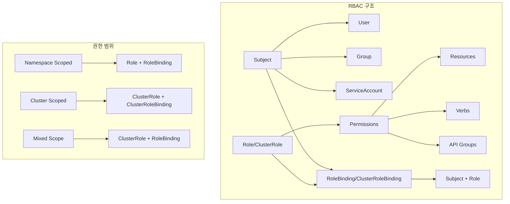
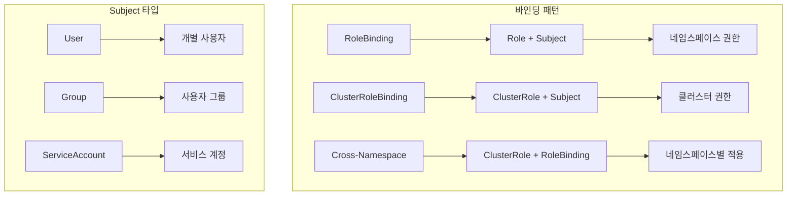
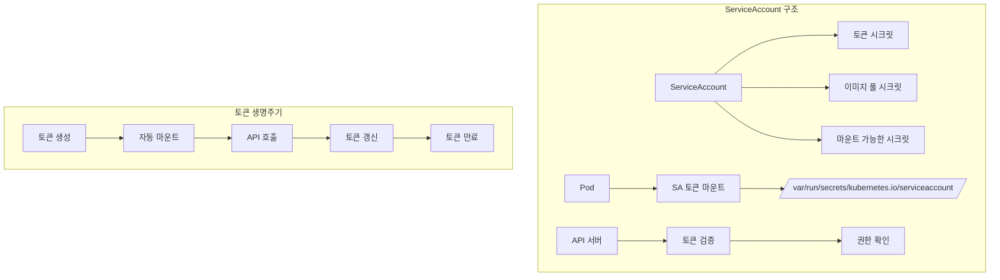
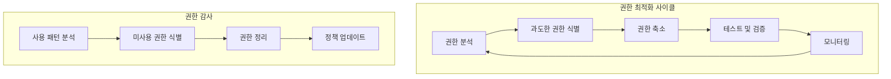

# Session 2: RBAC 심화와 권한 설계 패턴

## 📍 교과과정에서의 위치
이 세션은 **Week 3 > Day 2 > Session 2**로, Kubernetes의 RBAC(Role-Based Access Control) 심화 개념과 세밀한 권한 설계 패턴을 학습합니다.

## 학습 목표 (5분)
- **Role**과 **ClusterRole** 설계 원칙과 **권한 범위** 이해
- **RoleBinding**과 **ClusterRoleBinding** 전략적 활용 방법 학습
- **ServiceAccount** 관리와 **토큰 보안** 메커니즘 파악
- **최소 권한 원칙** 구현과 **권한 감사** 방법 이해

## 1. Role과 ClusterRole 설계 원칙 (15분)

### RBAC 아키텍처



### Role 설계 패턴
```
RBAC 설계 원칙 및 패턴:

Role 설계 원칙:
   🔹 네임스페이스 범위 권한:
      • 특정 네임스페이스 내 리소스만 접근
      • 팀별, 프로젝트별 권한 분리
      • 개발/스테이징/프로덕션 환경 격리
      • 테넌트별 권한 관리
      • 세밀한 리소스 제어
   🔹 권한 정의 구조:
      • apiGroups: API 그룹 지정 ("", "apps", "extensions")
      • resources: 리소스 타입 (pods, services, deployments)
      • verbs: 허용 동작 (get, list, create, update, delete)
      • resourceNames: 특정 리소스 인스턴스
      • nonResourceURLs: 비리소스 URL 경로
   🔹 일반적인 Role 패턴:
      • 읽기 전용 (Reader):
         • verbs: ["get", "list", "watch"]
         • 모든 리소스 조회 가능
         • 변경 권한 없음
         • 모니터링, 디버깅 용도
         • 감사 및 컴플라이언스
      • 개발자 (Developer):
         • verbs: ["get", "list", "watch", "create", "update", "patch"]
         • 애플리케이션 리소스 관리
         • 삭제 권한 제한적
         • 시크릿 접근 제한
         • 네임스페이스 내 작업
      • 운영자 (Operator):
         • verbs: ["*"] (모든 동작)
         • 전체 리소스 관리
         • 시크릿 및 설정 관리
         • 스케일링 및 업데이트
         • 문제 해결 권한
      • 서비스 계정 (Service):
      • 애플리케이션별 최소 권한
      • 자동화된 작업 수행
      • API 호출 권한
      • 특정 리소스만 접근
      • 보안 강화 설정
   🔹 권한 조합 전략:
   🔹 기본 권한 + 추가 권한
   🔹 상속 및 집계 규칙
   🔹 조건부 권한 부여
   🔹 시간 기반 권한
   🔹 동적 권한 관리

ClusterRole 설계 원칙:
   🔹 클러스터 범위 권한:
      • 모든 네임스페이스 접근
      • 클러스터 레벨 리소스 관리
      • 노드, 네임스페이스, PV 등
      • CRD 및 API 확장
      • 시스템 컴포넌트 권한
   🔹 시스템 ClusterRole:
      • system:admin: 클러스터 관리자
      • system:node: 노드 권한
      • system:kube-scheduler: 스케줄러
      • system:kube-controller-manager: 컨트롤러
      • system:kube-proxy: 프록시
   🔹 사용자 정의 ClusterRole:
      • 클러스터 관리자 (Cluster Admin):
         • 모든 리소스 전체 권한
         • 클러스터 설정 관리
         • 사용자 및 권한 관리
         • 보안 정책 설정
         • 시스템 유지보수
      • 네임스페이스 관리자 (Namespace Admin):
         • 네임스페이스 생성/삭제
         • 리소스 쿼터 관리
         • 네트워크 정책 설정
         • RBAC 권한 위임
         • 모니터링 설정
      • 보안 관리자 (Security Admin):
         • 보안 정책 관리
         • 네트워크 정책 설정
         • Pod 보안 표준
         • 시크릿 관리
         • 감사 로그 접근
      • 모니터링 관리자 (Monitoring Admin):
      • 메트릭 수집 권한
      • 로그 접근 권한
      • 대시보드 관리
      • 알림 설정
      • 성능 분석
   🔹 집계 ClusterRole:
   🔹 aggregationRule 사용
   🔹 라벨 기반 권한 집계
   🔹 동적 권한 조합
   🔹 확장 가능한 구조
   🔹 모듈화된 권한 관리
```

## 2. RoleBinding과 ClusterRoleBinding 전략 (12분)

### 바인딩 전략 패턴



### 바인딩 전략 상세
```
RoleBinding 및 ClusterRoleBinding 전략:

RoleBinding 패턴:
   🔹 네임스페이스 내 권한 부여:
      • Role과 Subject 연결
      • 특정 네임스페이스 범위
      • 팀별 권한 분리
      • 프로젝트별 접근 제어
      • 환경별 권한 관리
   🔹 ClusterRole을 RoleBinding으로 사용:
      • 클러스터 권한을 네임스페이스로 제한
      • 표준 ClusterRole 재사용
      • 일관된 권한 정의
      • 관리 효율성 향상
      • 권한 표준화
   🔹 다중 바인딩 전략:
      • 하나의 Role을 여러 Subject에 바인딩
      • 하나의 Subject에 여러 Role 바인딩
      • 권한 조합 및 집계
      • 세밀한 권한 제어
      • 유연한 권한 관리
   🔹 임시 권한 부여:
   🔹 시간 제한 권한
   🔹 조건부 권한
   🔹 승인 기반 권한
   🔹 자동 만료 권한
   🔹 감사 추적

ClusterRoleBinding 패턴:
   🔹 클러스터 전체 권한:
      • 모든 네임스페이스 접근
      • 클러스터 리소스 관리
      • 시스템 컴포넌트 권한
      • 글로벌 정책 적용
      • 관리자 권한 부여
   🔹 시스템 바인딩:
      • 쿠버네티스 시스템 컴포넌트
      • 애드온 및 오퍼레이터
      • 모니터링 시스템
      • 로깅 시스템
      • 보안 도구
   🔹 사용자 그룹 관리:
      • 조직 구조 반영
      • 부서별 권한 그룹
      • 역할별 권한 그룹
      • 프로젝트 팀 그룹
      • 외부 IdP 그룹 매핑
   🔹 서비스 계정 바인딩:
   🔹 크로스 네임스페이스 서비스
   🔹 클러스터 오퍼레이터
   🔹 CI/CD 시스템
   🔹 모니터링 에이전트
   🔹 백업 및 복구 도구

권한 위임 패턴:
   🔹 계층적 권한 구조:
      • 클러스터 관리자 → 네임스페이스 관리자
      • 네임스페이스 관리자 → 팀 리더
      • 팀 리더 → 개발자
      • 권한 범위 제한
      • 책임 분산
   🔹 권한 상속:
      • 상위 권한 자동 상속
      • 추가 권한 부여
      • 권한 제한 및 오버라이드
      • 조건부 상속
      • 동적 권한 조정
   🔹 임시 권한 승격:
      • 긴급 상황 대응
      • 유지보수 작업
      • 문제 해결 권한
      • 시간 제한 설정
      • 승인 프로세스
   🔹 권한 감사:
   🔹 권한 사용 추적
   🔹 불필요한 권한 식별
   🔹 권한 남용 탐지
   🔹 정기적 권한 검토
   🔹 컴플라이언스 보고
```

## 3. ServiceAccount 관리와 토큰 보안 (10분)

### ServiceAccount 아키텍처



### ServiceAccount 관리 전략
```
ServiceAccount 관리 및 토큰 보안:

ServiceAccount 설계:
   🔹 기본 ServiceAccount:
      • 각 네임스페이스마다 default SA 자동 생성
      • 최소 권한 (기본적으로 권한 없음)
      • 토큰 자동 마운트
      • 이미지 풀 시크릿 연결
      • Pod에 자동 할당
   🔹 커스텀 ServiceAccount:
      • 애플리케이션별 전용 SA
      • 특정 권한 집합
      • 보안 정책 적용
      • 감사 추적 용이
      • 세밀한 접근 제어
   🔹 시스템 ServiceAccount:
      • 쿠버네티스 시스템 컴포넌트용
      • 애드온 및 오퍼레이터용
      • 모니터링 시스템용
      • CI/CD 파이프라인용
      • 백업 및 복구 도구용
   🔹 외부 서비스 연동:
   🔹 클라우드 서비스 연동
   🔹 외부 API 접근
   🔹 써드파티 도구 통합
   🔹 레거시 시스템 연결
   🔹 하이브리드 환경 지원

토큰 보안 관리:
   🔹 토큰 생명주기:
      • 자동 토큰 생성
      • 토큰 로테이션
      • 만료 시간 설정
      • 자동 갱신
      • 토큰 폐기
   🔹 Bound Service Account Token:
      • 특정 Pod에 바인딩
      • 시간 제한 토큰
      • 오디언스 제한
      • 보안 강화
      • 토큰 오남용 방지
   🔹 토큰 프로젝션:
      • 볼륨 프로젝션 사용
      • 커스텀 오디언스
      • 만료 시간 설정
      • 자동 갱신
      • 다중 토큰 지원
   🔹 토큰 보안 모범 사례:
      • 자동 마운트 비활성화 (필요시)
      • 최소 권한 원칙
      • 토큰 스코프 제한
      • 정기적 토큰 로테이션
      • 토큰 사용 모니터링
   🔹 토큰 저장 및 전송:
   🔹 메모리 내 저장
   🔹 암호화된 전송
   🔹 로그에 토큰 노출 방지
   🔹 환경 변수 사용 금지
   🔹 시크릿 관리 도구 활용

권한 매핑 전략:
   🔹 1:1 매핑:
      • 하나의 SA에 하나의 Role
      • 명확한 권한 범위
      • 쉬운 관리
      • 감사 용이
      • 보안 강화
   🔹 1:N 매핑:
      • 하나의 SA에 여러 Role
      • 복합 권한 필요시
      • 권한 조합
      • 유연한 접근
      • 관리 복잡도 증가
   🔹 N:1 매핑:
      • 여러 SA에 하나의 Role
      • 공통 권한 집합
      • 표준화된 권한
      • 관리 효율성
      • 권한 일관성
   🔹 동적 매핑:
   🔹 조건부 권한 부여
   🔹 시간 기반 권한
   🔹 컨텍스트 기반 권한
   🔹 자동 권한 조정
   🔹 지능형 권한 관리
```

## 4. 최소 권한 원칙 구현 (10분)

### 권한 최적화 프로세스



### 최소 권한 구현 전략
```
최소 권한 원칙 구현:

권한 분석 및 최적화:
   🔹 현재 권한 분석:
      • 모든 RBAC 규칙 수집
      • 권한 사용 패턴 분석
      • 과도한 권한 식별
      • 미사용 권한 탐지
      • 권한 중복 확인
   🔹 권한 사용 추적:
      • API 호출 로그 분석
      • 권한 사용 빈도 측정
      • 실제 필요 권한 식별
      • 불필요한 권한 제거
      • 권한 효율성 평가
   🔹 점진적 권한 축소:
      • 단계적 권한 제거
      • 영향도 분석
      • 테스트 환경 검증
      • 롤백 계획 수립
      • 모니터링 강화
   🔹 자동화된 권한 관리:
   🔹 권한 분석 도구
   🔹 자동 권한 정리
   🔹 정책 추천 시스템
   🔹 컴플라이언스 체크
   🔹 지속적 최적화

권한 설계 모범 사례:
   🔹 역할 기반 설계:
      • 업무 역할별 권한 그룹
      • 표준화된 권한 템플릿
      • 권한 상속 구조
      • 예외 권한 최소화
      • 정기적 권한 검토
   🔹 네임스페이스 격리:
      • 팀별 네임스페이스 분리
      • 환경별 권한 격리
      • 프로젝트별 접근 제어
      • 크로스 네임스페이스 제한
      • 리소스 쿼터 적용
   🔹 시간 기반 권한:
      • 임시 권한 부여
      • 업무 시간 제한
      • 프로젝트 기간 제한
      • 자동 권한 만료
      • 갱신 프로세스
   🔹 조건부 권한:
      • IP 주소 기반 제한
      • 시간대 기반 제한
      • 디바이스 기반 제한
      • 위치 기반 제한
      • 다중 인증 요구
   🔹 권한 위임 제한:
   🔹 위임 가능 권한 제한
   🔹 위임 깊이 제한
   🔹 위임 승인 프로세스
   🔹 위임 권한 추적
   🔹 자동 위임 해제

권한 감사 및 컴플라이언스:
   🔹 정기적 권한 감사:
      • 월간/분기별 권한 검토
      • 사용자별 권한 분석
      • 역할별 권한 검증
      • 시스템 권한 점검
      • 외부 감사 준비
   🔹 컴플라이언스 관리:
      • 규제 요구사항 매핑
      • 정책 준수 확인
      • 감사 증적 관리
      • 보고서 자동 생성
      • 위반 사항 추적
   🔹 권한 변경 관리:
      • 변경 승인 프로세스
      • 변경 이력 추적
      • 영향도 분석
      • 롤백 절차
      • 변경 알림
   🔹 모니터링 및 알림:
      • 권한 사용 모니터링
      • 이상 행동 탐지
      • 권한 남용 알림
      • 정책 위반 알림
      • 실시간 대응
   🔹 교육 및 인식 제고:
   🔹 보안 교육 프로그램
   🔹 권한 관리 가이드라인
   🔹 모범 사례 공유
   🔹 정기적 보안 세미나
   🔹 인식 제고 캠페인

도구 및 자동화:
   🔹 RBAC 분석 도구:
      • kubectl-who-can
      • rakkess
      • rbac-lookup
      • kube-score
      • Polaris
   🔹 권한 관리 플랫폼:
      • Open Policy Agent (OPA)
      • Falco (런타임 보안)
      • Kustomize (정책 관리)
      • ArgoCD (GitOps)
      • 커스텀 오퍼레이터
   🔹 모니터링 도구:
      • Prometheus (메트릭)
      • Grafana (시각화)
      • ELK Stack (로그 분석)
      • Jaeger (추적)
      • 커스텀 대시보드
   🔹 자동화 스크립트:
   🔹 권한 분석 스크립트
   🔹 정책 생성 도구
   🔹 컴플라이언스 체크
   🔹 보고서 생성
   🔹 알림 시스템
```

## 💬 그룹 토론: RBAC 설계 시 고려해야 할 핵심 요소 (8분)

### 토론 주제
**"대규모 조직에서 RBAC을 설계할 때 보안성, 관리 효율성, 사용자 편의성을 모두 고려한 최적의 전략은 무엇인가?"**

### 토론 가이드라인

#### 보안성 강화 (3분)
- 최소 권한 원칙: 필요한 최소 권한만 부여하는 방법
- 권한 분리: 역할별, 환경별 권한 분리 전략
- 감사 및 모니터링: 권한 사용 추적과 이상 탐지

#### 관리 효율성 (3분)
- 표준화: 권한 템플릿과 표준 역할 정의
- 자동화: 권한 부여/회수 자동화 방안
- 확장성: 조직 성장에 따른 권한 체계 확장

#### 사용자 편의성 (2분)
- 셀프 서비스: 사용자가 필요한 권한을 요청하는 방법
- 투명성: 권한 현황과 변경 사항의 가시성
- 교육: 사용자 교육과 가이드라인 제공

## 💡 핵심 개념 정리
- Role/ClusterRole: 권한 집합 정의와 범위 설정
- RoleBinding/ClusterRoleBinding: 주체와 권한의 연결
- ServiceAccount: 애플리케이션 권한 관리와 토큰 보안
- 최소 권한 원칙: 지속적 권한 분석과 최적화

## 📚 참고 자료
- [RBAC Authorization](https://kubernetes.io/docs/reference/access-authn-authz/rbac/)
- [Service Accounts](https://kubernetes.io/docs/concepts/security/service-accounts/)
- [Managing Service Accounts](https://kubernetes.io/docs/reference/access-authn-authz/service-accounts-admin/)
- [RBAC Good Practices](https://kubernetes.io/docs/concepts/security/rbac-good-practices/)

## 다음 세션 준비
다음 세션에서는 **Pod Security Standards와 정책**에 대해 학습합니다. Pod 보안 컨텍스트와 보안 제약 조건 구현 방법을 다룰 예정입니다.