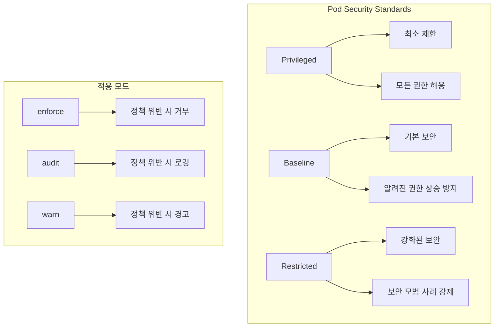
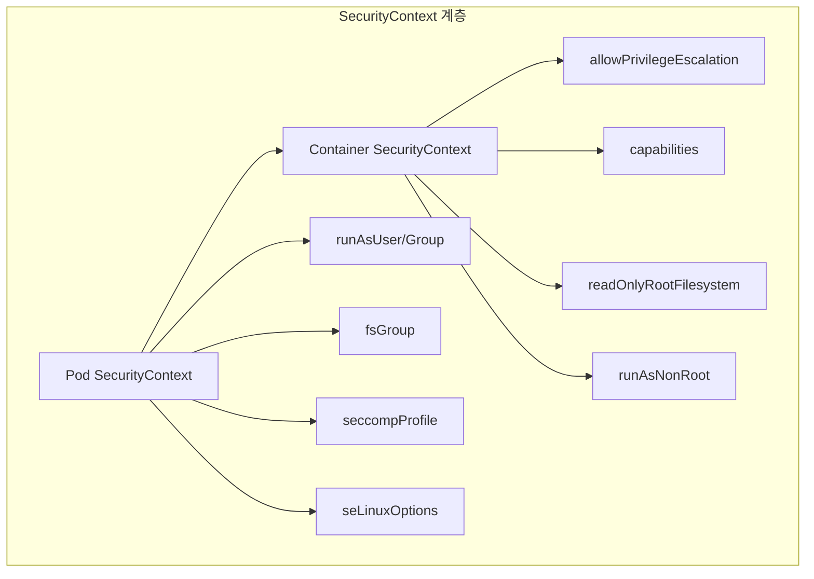
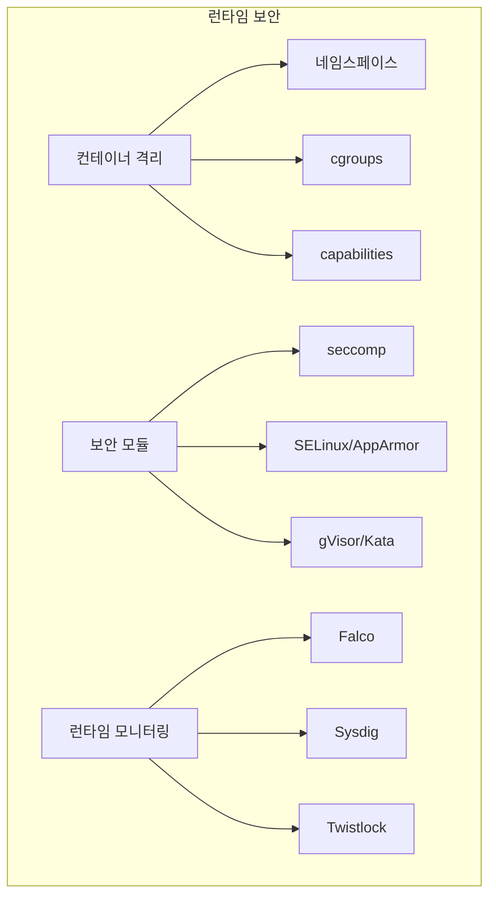
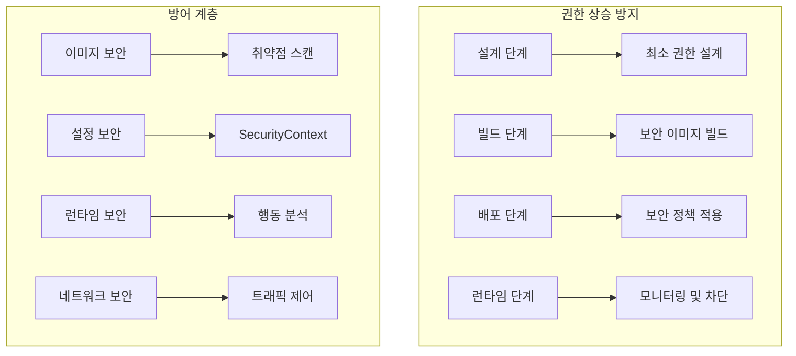

# Session 3: Pod Security Standards와 정책

## 📍 교과과정에서의 위치
이 세션은 **Week 3 > Day 2 > Session 3**로, Kubernetes의 Pod Security Standards와 보안 정책 구현을 학습합니다.

## 학습 목표 (5분)
- **Pod Security Standards** (Restricted, Baseline, Privileged) 이해
- **SecurityContext** 설정과 **보안 제약** 구현 방법 학습
- **컨테이너 런타임 보안**과 **격리** 메커니즘 파악
- **권한 상승 방지**와 **보안 정책** 자동화 방법 이해

## 1. Pod Security Standards 개요 (15분)

### Pod Security Standards 계층



### Pod Security Standards 상세
```
Pod Security Standards 정책 레벨:

Privileged 레벨:
├── 특성: 제한 없는 정책
├── 허용 사항:
│   ├── 모든 권한 허용
│   ├── 호스트 네임스페이스 접근
│   ├── 특권 컨테이너 실행
│   ├── 모든 볼륨 타입 마운트
│   └── 루트 사용자 실행
├── 사용 사례:
│   ├── 시스템 컴포넌트
│   ├── 인프라 도구
│   ├── 특수 권한 필요 애플리케이션
│   ├── 레거시 시스템
│   └── 개발/테스트 환경
└── 보안 고려사항:
    ├── 높은 보안 위험
    ├── 신중한 사용 필요
    ├── 강화된 모니터링
    ├── 접근 제한
    └── 정기적 검토

Baseline 레벨:
├── 특성: 기본적인 보안 제한
├── 제한 사항:
│   ├── 호스트 네임스페이스 금지
│   ├── 특권 컨테이너 금지
│   ├── 호스트 포트 제한
│   ├── 위험한 볼륨 타입 제한
│   └── 알려진 권한 상승 방지
├── 허용 사항:
│   ├── 루트 사용자 실행 (제한적)
│   ├── 기본 Linux capabilities
│   ├── 일반적인 볼륨 타입
│   ├── 표준 seccomp 프로파일
│   └── 기본 SELinux 설정
├── 사용 사례:
│   ├── 일반적인 애플리케이션
│   ├── 웹 서비스
│   ├── 데이터베이스
│   ├── 미들웨어
│   └── 비즈니스 애플리케이션
└── 보안 수준:
    ├── 중간 수준 보안
    ├── 균형잡힌 접근
    ├── 실용적 제한
    ├── 호환성 고려
    └── 점진적 강화 가능

Restricted 레벨:
├── 특성: 강화된 보안 정책
├── 제한 사항:
│   ├── 루트 사용자 금지
│   ├── 권한 상승 금지
│   ├── 읽기 전용 루트 파일시스템
│   ├── 모든 capabilities 제거
│   └── 엄격한 seccomp 프로파일
├── 강제 사항:
│   ├── 비루트 사용자 실행
│   ├── 보안 컨텍스트 설정
│   ├── 리소스 제한 설정
│   ├── 네트워크 정책 적용
│   └── 보안 프로파일 적용
├── 사용 사례:
│   ├── 보안 중요 애플리케이션
│   ├── 금융 서비스
│   ├── 의료 시스템
│   ├── 정부 시스템
│   └── 컴플라이언스 요구 환경
└── 보안 수준:
    ├── 최고 수준 보안
    ├── 엄격한 제한
    ├── 제로 트러스트 접근
    ├── 심층 방어
    └── 지속적 모니터링
```

## 2. SecurityContext 설정과 보안 제약 (12분)

### SecurityContext 구조



### SecurityContext 설정 전략
```
SecurityContext 보안 설정:

Pod 레벨 SecurityContext:
├── 사용자 및 그룹 설정:
│   ├── runAsUser: 실행 사용자 ID
│   ├── runAsGroup: 실행 그룹 ID
│   ├── runAsNonRoot: 루트 사용자 금지
│   ├── fsGroup: 파일시스템 그룹
│   └── fsGroupChangePolicy: 그룹 변경 정책
├── 보안 프로파일:
│   ├── seccompProfile: Seccomp 프로파일
│   ├── seLinuxOptions: SELinux 컨텍스트
│   ├── appArmorProfile: AppArmor 프로파일
│   ├── windowsOptions: Windows 보안
│   └── supplementalGroups: 추가 그룹
├── 시스템 설정:
│   ├── sysctls: 커널 매개변수
│   ├── hostNetwork: 호스트 네트워크
│   ├── hostPID: 호스트 PID 네임스페이스
│   ├── hostIPC: 호스트 IPC 네임스페이스
│   └── shareProcessNamespace: 프로세스 공유
└── 볼륨 보안:
    ├── 볼륨 마운트 권한
    ├── 읽기 전용 설정
    ├── 임시 볼륨 제한
    ├── 호스트 경로 제한
    └── 볼륨 암호화

Container 레벨 SecurityContext:
├── 권한 제어:
│   ├── allowPrivilegeEscalation: false
│   ├── privileged: false
│   ├── readOnlyRootFilesystem: true
│   ├── runAsNonRoot: true
│   └── runAsUser: 특정 사용자 ID
├── Linux Capabilities:
│   ├── add: 필요한 capability 추가
│   ├── drop: 불필요한 capability 제거
│   ├── 기본 제거: ALL
│   ├── 최소 권한 추가
│   └── 보안 위험 capability 금지
├── 보안 모듈:
│   ├── seccompProfile: 컨테이너별 설정
│   ├── seLinuxOptions: 컨테이너별 SELinux
│   ├── appArmorProfile: 컨테이너별 AppArmor
│   ├── 프로파일 상속
│   └── 동적 프로파일 적용
└── 리소스 제한:
    ├── 메모리 사용량 제한
    ├── CPU 사용량 제한
    ├── 파일 디스크립터 제한
    ├── 프로세스 수 제한
    └── 네트워크 연결 제한

보안 제약 구현:
├── 필수 보안 설정:
│   ├── runAsNonRoot: true
│   ├── allowPrivilegeEscalation: false
│   ├── readOnlyRootFilesystem: true
│   ├── capabilities.drop: ["ALL"]
│   └── seccompProfile: RuntimeDefault
├── 권장 보안 설정:
│   ├── runAsUser: 특정 UID (>= 1000)
│   ├── runAsGroup: 특정 GID
│   ├── fsGroup: 적절한 그룹 설정
│   ├── 리소스 제한 설정
│   └── 네트워크 정책 적용
├── 고급 보안 설정:
│   ├── 커스텀 seccomp 프로파일
│   ├── SELinux/AppArmor 정책
│   ├── 암호화된 볼륨 사용
│   ├── 네트워크 암호화
│   └── 감사 로깅 활성화
└── 환경별 설정:
    ├── 개발: 유연한 설정
    ├── 스테이징: 프로덕션 유사
    ├── 프로덕션: 엄격한 설정
    ├── 보안 중요: Restricted 레벨
    └── 레거시: 점진적 강화
```

## 3. 컨테이너 런타임 보안 (10분)

### 런타임 보안 계층



### 런타임 보안 구현
```
컨테이너 런타임 보안:

격리 메커니즘:
├── Linux 네임스페이스:
│   ├── PID: 프로세스 격리
│   ├── Network: 네트워크 격리
│   ├── Mount: 파일시스템 격리
│   ├── UTS: 호스트명 격리
│   ├── IPC: 프로세스 간 통신 격리
│   ├── User: 사용자 격리
│   └── Cgroup: 리소스 격리
├── cgroups 제어:
│   ├── CPU 사용량 제한
│   ├── 메모리 사용량 제한
│   ├── 디스크 I/O 제한
│   ├── 네트워크 대역폭 제한
│   └── 디바이스 접근 제어
├── 파일시스템 격리:
│   ├── 루트 파일시스템 변경
│   ├── 읽기 전용 마운트
│   ├── 임시 파일시스템
│   ├── 볼륨 마운트 제한
│   └── 파일 권한 제어
└── 네트워크 격리:
    ├── 가상 네트워크 인터페이스
    ├── 네트워크 네임스페이스
    ├── 방화벽 규칙
    ├── 트래픽 제어
    └── 포트 바인딩 제한

보안 프로파일:
├── Seccomp (Secure Computing):
│   ├── 시스템 호출 필터링
│   ├── 허용/차단 목록
│   ├── 기본 프로파일 사용
│   ├── 커스텀 프로파일 생성
│   └── 런타임 적용
├── SELinux (Security-Enhanced Linux):
│   ├── 강제 접근 제어 (MAC)
│   ├── 보안 컨텍스트 라벨
│   ├── 정책 기반 제어
│   ├── 다중 레벨 보안
│   └── 감사 로깅
├── AppArmor:
│   ├── 경로 기반 접근 제어
│   ├── 프로파일 기반 보안
│   ├── 학습 모드 지원
│   ├── 강제 모드 적용
│   └── 동적 프로파일 로딩
└── gVisor/Kata Containers:
    ├── 추가 격리 계층
    ├── 사용자 공간 커널
    ├── 하드웨어 가상화
    ├── 강화된 보안
    └── 성능 트레이드오프

런타임 모니터링:
├── 이상 행동 탐지:
│   ├── 비정상적 시스템 호출
│   ├── 권한 상승 시도
│   ├── 파일 시스템 변경
│   ├── 네트워크 활동 모니터링
│   └── 프로세스 실행 추적
├── 보안 이벤트 수집:
│   ├── 커널 이벤트 수집
│   ├── 애플리케이션 로그
│   ├── 네트워크 트래픽
│   ├── 파일 접근 로그
│   └── 시스템 메트릭
├── 실시간 대응:
│   ├── 자동 격리
│   ├── 프로세스 종료
│   ├── 네트워크 차단
│   ├── 알림 발송
│   └── 포렌식 데이터 수집
└── 분석 및 보고:
    ├── 보안 대시보드
    ├── 위협 분석
    ├── 컴플라이언스 보고
    ├── 트렌드 분석
    └── 개선 권장사항
```

## 4. 권한 상승 방지 메커니즘 (10분)

### 권한 상승 방지 전략



### 권한 상승 방지 구현
```
권한 상승 방지 전략:

설계 단계 방지:
├── 최소 권한 원칙:
│   ├── 필요한 최소 권한만 부여
│   ├── 기본 권한 제거
│   ├── 권한 사용 목적 명시
│   ├── 정기적 권한 검토
│   └── 권한 사용 모니터링
├── 보안 아키텍처:
│   ├── 다층 보안 설계
│   ├── 격리 경계 설정
│   ├── 신뢰 경계 정의
│   ├── 공격 표면 최소화
│   └── 방어 심층화
├── 위협 모델링:
│   ├── 공격 벡터 분석
│   ├── 권한 상승 경로 식별
│   ├── 위험도 평가
│   ├── 완화 방안 수립
│   └── 지속적 업데이트
└── 보안 요구사항:
    ├── 기능별 보안 요구사항
    ├── 데이터 분류 및 보호
    ├── 접근 제어 요구사항
    ├── 감사 요구사항
    └── 컴플라이언스 요구사항

빌드 단계 방지:
├── 보안 이미지 빌드:
│   ├── 최소 베이스 이미지 사용
│   ├── 불필요한 패키지 제거
│   ├── 보안 업데이트 적용
│   ├── 취약점 스캔 통합
│   └── 이미지 서명 및 검증
├── 보안 설정:
│   ├── 비루트 사용자 설정
│   ├── 읽기 전용 파일시스템
│   ├── 불필요한 권한 제거
│   ├── 보안 프로파일 적용
│   └── 환경 변수 보안
├── 코드 보안:
│   ├── 정적 코드 분석
│   ├── 의존성 취약점 검사
│   ├── 보안 코딩 가이드라인
│   ├── 코드 리뷰 프로세스
│   └── 보안 테스트 자동화
└── 공급망 보안:
    ├── 신뢰할 수 있는 소스
    ├── 패키지 무결성 검증
    ├── 라이선스 검토
    ├── 업스트림 모니터링
    └── SBOM 생성 및 관리

배포 단계 방지:
├── 정책 적용:
│   ├── Pod Security Standards
│   ├── Network Policies
│   ├── RBAC 정책
│   ├── Admission Controllers
│   └── OPA/Gatekeeper 정책
├── 설정 검증:
│   ├── 보안 설정 검증
│   ├── 정책 준수 확인
│   ├── 취약점 스캔
│   ├── 설정 드리프트 방지
│   └── 자동 수정 적용
├── 환경 격리:
│   ├── 네임스페이스 분리
│   ├── 네트워크 분할
│   ├── 리소스 격리
│   ├── 데이터 격리
│   └── 접근 제어
└── 배포 검증:
    ├── 보안 테스트 실행
    ├── 정책 준수 확인
    ├── 취약점 재검사
    ├── 성능 영향 평가
    └── 롤백 준비

런타임 단계 방지:
├── 실시간 모니터링:
│   ├── 시스템 호출 모니터링
│   ├── 파일 시스템 변경 감지
│   ├── 네트워크 활동 추적
│   ├── 프로세스 실행 모니터링
│   └── 권한 사용 추적
├── 이상 탐지:
│   ├── 행동 기반 분석
│   ├── 머신러닝 기반 탐지
│   ├── 규칙 기반 탐지
│   ├── 통계적 이상 탐지
│   └── 위협 인텔리전스 활용
├── 자동 대응:
│   ├── 프로세스 종료
│   ├── 컨테이너 격리
│   ├── 네트워크 차단
│   ├── 알림 발송
│   └── 포렌식 데이터 수집
└── 지속적 개선:
    ├── 탐지 규칙 업데이트
    ├── 거짓 양성 최소화
    ├── 대응 절차 개선
    ├── 성능 최적화
    └── 새로운 위협 대응
```

## 💬 그룹 토론: Pod 보안 정책 구현 시 고려사항 (8분)

### 토론 주제
**"Pod Security Standards를 프로덕션 환경에 적용할 때 보안성과 운영 효율성을 균형있게 고려하는 방법은?"**

### 토론 가이드라인

#### 보안 수준 선택 (3분)
- **환경별 정책**: 개발/스테이징/프로덕션 환경별 적절한 보안 레벨
- **애플리케이션별 요구사항**: 비즈니스 중요도에 따른 보안 정책 차등화
- **점진적 강화**: 기존 시스템의 단계적 보안 강화 전략

#### 운영 효율성 (3분)
- **자동화**: 보안 정책 적용과 검증의 자동화 방안
- **모니터링**: 정책 위반 탐지와 대응 체계
- **개발자 경험**: 보안 정책이 개발 생산성에 미치는 영향 최소화

#### 실무 적용 (2분)
- **마이그레이션**: 기존 워크로드의 보안 정책 적용 방법
- **예외 처리**: 특수한 요구사항을 가진 애플리케이션 처리
- **교육**: 개발팀과 운영팀의 보안 인식 제고

## 💡 핵심 개념 정리
- **Pod Security Standards**: Privileged, Baseline, Restricted 3단계 보안 레벨
- **SecurityContext**: Pod와 컨테이너 레벨의 세밀한 보안 설정
- **런타임 보안**: 격리, 모니터링, 이상 탐지를 통한 실시간 보안
- **권한 상승 방지**: 설계부터 런타임까지 전 단계 보안 적용

## 📚 참고 자료
- [Pod Security Standards](https://kubernetes.io/docs/concepts/security/pod-security-standards/)
- [Pod Security Context](https://kubernetes.io/docs/tasks/configure-pod-container/security-context/)
- [Container Runtime Security](https://kubernetes.io/docs/concepts/security/runtime-security/)
- [Seccomp](https://kubernetes.io/docs/tutorials/security/seccomp/)

## 다음 세션 준비
다음 세션에서는 **Network Policy와 트래픽 제어**에 대해 학습합니다. 네트워크 분할과 마이크로세그멘테이션 구현 방법을 다룰 예정입니다.