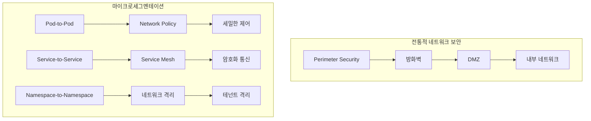
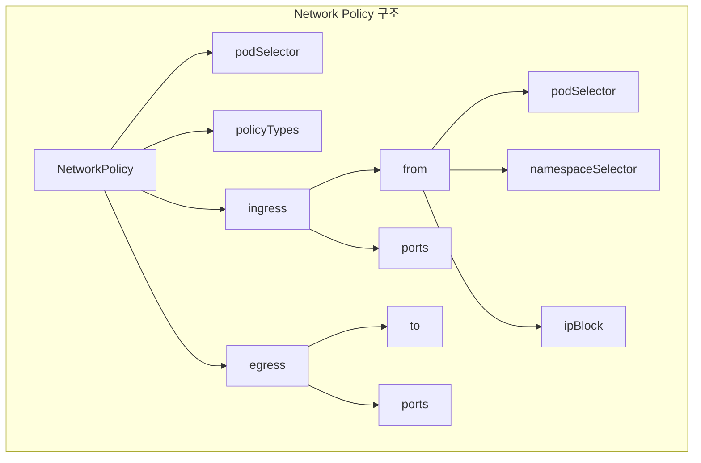
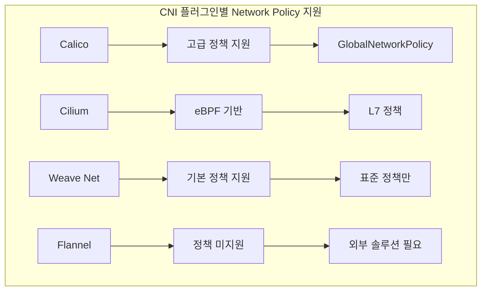
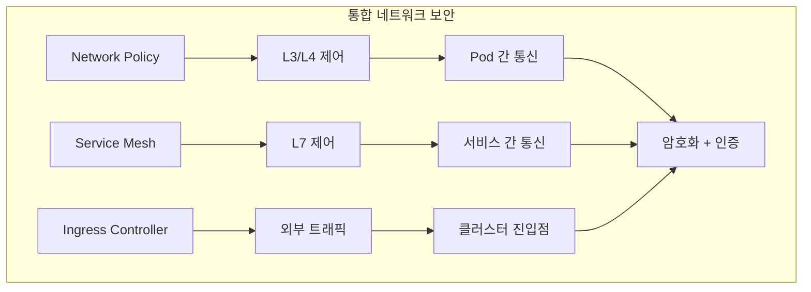

# Session 4: Network Policy와 트래픽 제어

## 📍 교과과정에서의 위치
이 세션은 **Week 3 > Day 2 > Session 4**로, Kubernetes의 네트워크 보안과 트래픽 제어를 위한 Network Policy를 학습합니다.

## 학습 목표 (5분)
- **네트워크 분할**과 **마이크로세그멘테이션** 개념 이해
- **Ingress/Egress** 규칙 설계와 **트래픽 제어** 방법 학습
- **CNI 플러그인**별 네트워크 정책 구현 차이점 파악
- **서비스 메시**와 네트워크 보안 통합 전략 이해

## 1. 네트워크 분할과 마이크로세그멘테이션 (15분)

### 네트워크 보안 아키텍처



### 네트워크 보안 개념
```
네트워크 분할 및 마이크로세그멘테이션:

전통적 네트워크 보안의 한계:
   🔹 경계 기반 보안 (Perimeter Security):
      • 외부 위협에만 집중
      • 내부 네트워크는 신뢰
      • 수평적 이동 취약
      • 세밀한 제어 부족
      • 클라우드 환경 부적합
   🔹 고정적 네트워크 구조:
      • 정적 IP 기반 규칙
      • 하드웨어 의존적
      • 확장성 제한
      • 관리 복잡성
      • 동적 환경 대응 어려움
   🔹 거친 단위 제어:
   🔹 서브넷 단위 제어
   🔹 VLAN 기반 분리
   🔹 애플리케이션 레벨 제어 부족
   🔹 컨테이너 환경 부적합
   🔹 마이크로서비스 지원 한계

마이크로세그멘테이션 개념:
   🔹 정의 및 특징:
      • 네트워크를 작은 단위로 분할
      • 각 세그먼트별 독립적 보안 정책
      • 최소 권한 네트워크 접근
      • 동적 정책 적용
      • 소프트웨어 정의 네트워킹
   🔹 쿠버네티스에서의 구현:
      • Pod 단위 네트워크 격리
      • 네임스페이스 기반 분리
      • 라벨 셀렉터 기반 정책
      • 동적 정책 적용
      • CNI 플러그인 통합
   🔹 보안 이점:
      • 공격 표면 최소화
      • 측면 이동 방지
      • 데이터 유출 제한
      • 컴플라이언스 강화
      • 위협 격리
   🔹 운영 이점:
   🔹 세밀한 트래픽 제어
   🔹 네트워크 가시성 향상
   🔹 문제 격리 및 디버깅
   🔹 성능 최적화
   🔹 자동화된 정책 관리

Network Policy 기본 개념:
   🔹 정책 적용 방식:
      • 기본적으로 모든 트래픽 허용
      • 정책 존재 시 화이트리스트 방식
      • 명시적 허용만 통과
      • 정책 없으면 모든 트래픽 허용
      • 점진적 정책 적용 가능
   🔹 정책 범위:
      • 네임스페이스 범위 리소스
      • 특정 Pod 그룹에 적용
      • 라벨 셀렉터 기반 선택
      • 다중 정책 조합 가능
      • 정책 우선순위 없음 (OR 조건)
   🔹 트래픽 방향:
      • Ingress: 들어오는 트래픽
      • Egress: 나가는 트래픽
      • 양방향 정책 설정 가능
      • 방향별 독립적 규칙
      • 기본값: 모든 방향 허용
   🔹 정책 적용 대상:
   🔹 podSelector: 대상 Pod 선택
   🔹 namespaceSelector: 네임스페이스 선택
   🔹 ipBlock: IP 주소 범위
   🔹 포트 및 프로토콜 지정
   🔹 조합 규칙 적용
```

## 2. Ingress/Egress 규칙 설계 (12분)

### Network Policy 구조



### 규칙 설계 패턴
```
Network Policy 규칙 설계:

Ingress 규칙 설계:
   🔹 기본 구조:
      • from: 트래픽 소스 정의
      • ports: 허용 포트 및 프로토콜
      • 다중 from 규칙 (OR 조건)
      • from 내 다중 조건 (AND 조건)
      • 포트별 세밀한 제어
   🔹 소스 선택 방법:
      • podSelector: 동일 네임스페이스 Pod
      • namespaceSelector: 다른 네임스페이스
      • podSelector + namespaceSelector: 특정 네임스페이스의 특정 Pod
      • ipBlock: 외부 IP 주소 범위
      • 빈 from: 모든 소스 허용
   🔹 일반적인 패턴:
      • 웹 서버 패턴:
         • 로드 밸런서에서 80/443 포트
         • 모니터링에서 메트릭 포트
         • 관리자에서 SSH 포트
         • 내부 서비스 간 통신
      • 데이터베이스 패턴:
         • 애플리케이션에서 DB 포트
         • 백업 시스템에서 접근
         • 모니터링 도구 접근
         • 관리 도구 접근
      • 마이크로서비스 패턴:
         • API 게이트웨이에서 접근
         • 다른 마이크로서비스 접근
         • 서비스 메시 사이드카
         • 헬스체크 엔드포인트
      • 시스템 서비스 패턴:
      • 쿠버네티스 시스템 접근
      • 모니터링 시스템 접근
      • 로깅 시스템 접근
      • 보안 스캔 도구 접근
   🔹 보안 고려사항:
   🔹 최소 권한 원칙 적용
   🔹 불필요한 포트 차단
   🔹 관리 포트 별도 보호
   🔹 임시 접근 제한
   🔹 정기적 규칙 검토

Egress 규칙 설계:
   🔹 기본 구조:
      • to: 트래픽 대상 정의
      • ports: 허용 포트 및 프로토콜
      • 다중 to 규칙 (OR 조건)
      • to 내 다중 조건 (AND 조건)
      • 외부 서비스 접근 제어
   🔹 대상 선택 방법:
      • podSelector: 동일 네임스페이스 Pod
      • namespaceSelector: 다른 네임스페이스
      • podSelector + namespaceSelector: 특정 Pod
      • ipBlock: 외부 서비스 IP
      • 빈 to: 모든 대상 허용
   🔹 일반적인 패턴:
      • 애플리케이션 패턴:
         • 데이터베이스 접근
         • 외부 API 호출
         • 캐시 서버 접근
         • 메시지 큐 접근
         • 파일 스토리지 접근
      • 시스템 패턴:
         • DNS 서버 접근 (53/UDP)
         • NTP 서버 접근 (123/UDP)
         • 패키지 저장소 접근
         • 로그 수집 서버
         • 메트릭 수집 서버
      • 보안 패턴:
         • 인증 서버 접근
         • 인증서 발급 서버
         • 보안 스캔 서버
         • 취약점 DB 접근
         • 위협 인텔리전스 서버
      • 개발 패턴:
      • 소스 코드 저장소
      • 아티팩트 저장소
      • CI/CD 서버
      • 테스트 서버
      • 문서 서버
   🔹 제한 전략:
   🔹 기본 Egress 차단
   🔹 필요한 서비스만 허용
   🔹 시간 기반 접근 제한
   🔹 데이터 유출 방지
   🔹 악성 통신 차단

고급 규칙 패턴:
   🔹 계층적 보안:
      • 프론트엔드 → 백엔드만 허용
      • 백엔드 → 데이터베이스만 허용
      • 관리 네트워크 분리
      • 개발/운영 환경 분리
      • 테넌트별 네트워크 격리
   🔹 시간 기반 정책:
      • 업무 시간 접근 제한
      • 유지보수 시간 특별 규칙
      • 배치 작업 시간 제한
      • 백업 시간 네트워크 개방
      • 긴급 상황 임시 규칙
   🔹 조건부 접근:
      • 인증 상태 기반 접근
      • 보안 등급 기반 제한
      • 지역 기반 접근 제어
      • 디바이스 기반 제한
      • 행동 기반 동적 제어
   🔹 예외 처리:
   🔹 긴급 접근 규칙
   🔹 디버깅 임시 규칙
   🔹 마이그레이션 특별 규칙
   🔹 테스트 환경 규칙
   🔹 레거시 시스템 호환
```

## 3. CNI 플러그인별 구현 차이점 (10분)

### CNI 플러그인 비교



### CNI별 구현 특징
```
CNI 플러그인별 Network Policy 구현:

Calico:
   🔹 특징:
      • 완전한 Network Policy 지원
      • GlobalNetworkPolicy 확장
      • 고성능 eBPF 데이터플레인
      • 풍부한 정책 기능
      • 엔터프라이즈 기능 제공
   🔹 고급 기능:
      • 호스트 엔드포인트 보호
      • 서비스 어카운트 기반 정책
      • 암호화된 통신 (WireGuard)
      • 정책 미리보기 및 시뮬레이션
      • 계층적 정책 구조
   🔹 정책 확장:
      • GlobalNetworkPolicy: 클러스터 전역
      • NetworkSet: IP 주소 그룹
      • HostEndpoint: 호스트 보호
      • 정책 순서 및 우선순위
      • 정책 상속 및 오버라이드
   🔹 운영 도구:
   🔹 calicoctl: CLI 도구
   🔹 Calico Enterprise UI
   🔹 정책 추천 엔진
   🔹 플로우 로그 분석
   🔹 컴플라이언스 보고

Cilium:
   🔹 특징:
      • eBPF 기반 고성능
      • L3/L4/L7 정책 지원
      • API 인식 보안
      • 서비스 메시 통합
      • 클러스터 메시 지원
   🔹 고급 기능:
      • HTTP/gRPC/Kafka 정책
      • DNS 기반 정책
      • 암호화 통신 (IPSec/WireGuard)
      • 로드 밸런싱 통합
      • 멀티 클러스터 네트워킹
   🔹 L7 정책:
      • HTTP 메서드 제어
      • URL 경로 기반 제어
      • 헤더 기반 정책
      • gRPC 서비스 제어
      • Kafka 토픽 제어
   🔹 관찰 가능성:
   🔹 Hubble: 네트워크 관찰
   🔹 플로우 시각화
   🔹 서비스 맵 생성
   🔹 성능 메트릭
   🔹 보안 이벤트 추적

Weave Net:
   🔹 특징:
      • 기본 Network Policy 지원
      • 간단한 설치 및 설정
      • 자동 네트워크 발견
      • 암호화 통신 지원
      • 멀티 클라우드 지원
   🔹 제한사항:
      • 표준 Network Policy만 지원
      • 고급 기능 부족
      • 성능 제한
      • 확장성 한계
      • 엔터프라이즈 기능 부족
   🔹 적용 사례:
      • 소규모 클러스터
      • 개발/테스트 환경
      • 간단한 네트워크 요구사항
      • 빠른 프로토타이핑
      • 교육 목적
   🔹 운영 고려사항:
   🔹 제한된 디버깅 도구
   🔹 성능 모니터링 필요
   🔹 정책 복잡도 제한
   🔹 업그레이드 계획
   🔹 대안 솔루션 검토

Flannel:
   🔹 특징:
      • Network Policy 미지원
      • 단순한 오버레이 네트워크
      • 경량 구현
      • 높은 호환성
      • 안정성 중심
   🔹 보안 한계:
      • 네트워크 분할 불가
      • 트래픽 제어 불가
      • 기본적으로 모든 통신 허용
      • 외부 보안 솔루션 필요
      • 컴플라이언스 요구사항 미충족
   🔹 대안 솔루션:
      • Calico와 조합 사용
      • 외부 방화벽 솔루션
      • 서비스 메시 보안
      • 애플리케이션 레벨 보안
      • 클러스터 레벨 분리
   🔹 마이그레이션 고려:
   🔹 보안 요구사항 증가 시
   🔹 컴플라이언스 필요 시
   🔹 네트워크 정책 필요 시
   🔹 고급 기능 필요 시
   🔹 엔터프라이즈 환경 적용 시

선택 기준:
   🔹 보안 요구사항:
      • 기본 격리: Weave Net
      • 고급 정책: Calico
      • L7 보안: Cilium
      • 최고 성능: Cilium/Calico
      • 엔터프라이즈: Calico Enterprise
   🔹 성능 요구사항:
      • 고성능: Cilium (eBPF)
      • 안정성: Calico
      • 경량: Flannel
      • 균형: Weave Net
      • 확장성: Cilium/Calico
   🔹 운영 복잡도:
      • 단순함: Flannel
      • 중간: Weave Net
      • 복잡: Calico
      • 고급: Cilium
      • 엔터프라이즈: Calico Enterprise
   🔹 생태계 통합:
   🔹 서비스 메시: Cilium
   🔹 모니터링: Calico
   🔹 클라우드: 모든 CNI
   🔹 하이브리드: Calico/Cilium
   🔹 멀티 클러스터: Cilium
```

## 4. 서비스 메시와 네트워크 보안 통합 (10분)

### 통합 보안 아키텍처



### 통합 전략
```
서비스 메시와 네트워크 보안 통합:

통합 아키텍처:
   🔹 계층별 보안:
      • L3/L4: Network Policy
      • L7: Service Mesh Policy
      • 애플리케이션: 코드 레벨 보안
      • 데이터: 암호화 및 접근 제어
      • 인프라: 호스트 및 클러스터 보안
   🔹 보완적 역할:
      • Network Policy: 기본 네트워크 격리
      • Service Mesh: 고급 트래픽 제어
      • 상호 보완적 기능
      • 다층 방어 구조
      • 종합적 보안 커버리지
   🔹 정책 조합:
      • Network Policy로 기본 차단
      • Service Mesh로 세밀한 제어
      • 인증 및 인가 통합
      • 암호화 통신 강제
      • 감사 및 모니터링 통합
   🔹 운영 통합:
   🔹 통합 정책 관리
   🔹 일관된 보안 모델
   🔹 중앙집중식 모니터링
   🔹 자동화된 정책 적용
   🔹 통합 대시보드

Istio와 Network Policy 통합:
   🔹 상호 보완:
      • Network Policy: Pod 레벨 격리
      • Istio: 서비스 레벨 제어
      • mTLS 자동 적용
      • JWT 기반 인증
      • RBAC 통합
   🔹 정책 계층:
      • 1단계: Network Policy 기본 차단
      • 2단계: Istio 인증 및 인가
      • 3단계: 애플리케이션 레벨 제어
      • 각 단계별 독립적 동작
      • 누적 보안 효과
   🔹 설정 예시:
      • Network Policy로 네임스페이스 격리
      • Istio로 서비스 간 mTLS
      • AuthorizationPolicy로 세밀한 제어
      • 트래픽 라우팅 및 제어
      • 관찰 가능성 통합
   🔹 모니터링 통합:
   🔹 네트워크 플로우 추적
   🔹 서비스 간 통신 분석
   🔹 보안 이벤트 상관 분석
   🔹 성능 영향 모니터링
   🔹 컴플라이언스 보고

실무 구현 전략:
   🔹 단계적 도입:
      • 1단계: Network Policy 기본 적용
      • 2단계: 서비스 메시 도입
      • 3단계: 고급 정책 적용
      • 4단계: 자동화 및 최적화
      • 지속적 개선
   🔹 정책 설계:
      • 기본 거부 원칙
      • 최소 권한 네트워크 접근
      • 명시적 허용 규칙
      • 정기적 정책 검토
      • 자동화된 정책 관리
   🔹 모니터링 및 분석:
      • 실시간 트래픽 모니터링
      • 정책 위반 탐지
      • 성능 영향 분석
      • 보안 이벤트 분석
      • 정책 효과성 평가
   🔹 운영 최적화:
   🔹 정책 자동 생성
   🔹 이상 탐지 및 대응
   🔹 성능 최적화
   🔹 정책 시뮬레이션
   🔹 지속적 보안 개선
```

## 💬 그룹 토론: 네트워크 보안 정책 설계 원칙 (8분)

### 토론 주제
**"마이크로서비스 환경에서 Network Policy와 Service Mesh를 조합한 최적의 네트워크 보안 전략은?"**

### 토론 가이드라인

#### 보안 계층 설계 (3분)
- **계층별 역할**: Network Policy vs Service Mesh 역할 분담
- **정책 우선순위**: 충돌 시 정책 적용 순서
- **보안 깊이**: 다층 방어 구조 설계

#### 운영 효율성 (3분)
- **정책 관리**: 통합 정책 관리 방안
- **자동화**: 정책 생성 및 적용 자동화
- **모니터링**: 통합 모니터링 및 분석 체계

#### 성능 고려사항 (2분)
- **성능 영향**: 네트워크 정책이 성능에 미치는 영향
- **최적화**: CNI 선택과 설정 최적화
- **확장성**: 대규모 환경에서의 확장성 고려

## 💡 핵심 개념 정리
- **마이크로세그멘테이션**: Pod 단위의 세밀한 네트워크 격리
- **Network Policy**: Ingress/Egress 규칙을 통한 트래픽 제어
- **CNI 플러그인**: 각 플러그인별 Network Policy 지원 차이
- **통합 보안**: Service Mesh와의 조합을 통한 다층 보안

## 📚 참고 자료
- [Network Policies](https://kubernetes.io/docs/concepts/services-networking/network-policies/)
- [Calico Network Policy](https://docs.projectcalico.org/security/kubernetes-network-policy)
- [Cilium Network Policy](https://docs.cilium.io/en/stable/policy/)
- [Istio Security](https://istio.io/latest/docs/concepts/security/)

## 다음 세션 준비
다음 세션에서는 **Secret 관리와 암호화 전략**에 대해 학습합니다. 시크릿 생명주기 관리와 외부 시크릿 관리 시스템 통합을 다룰 예정입니다.