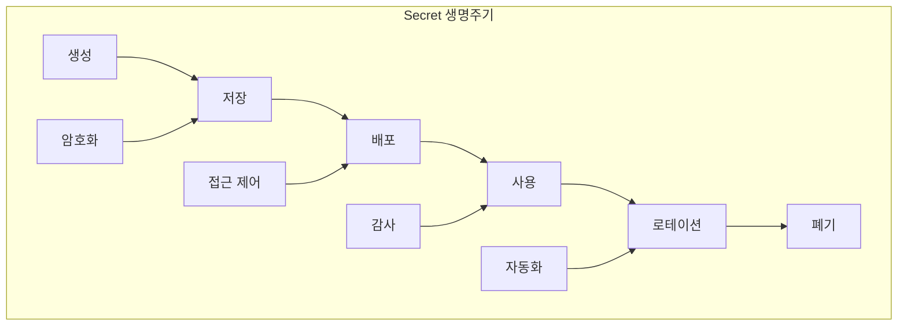
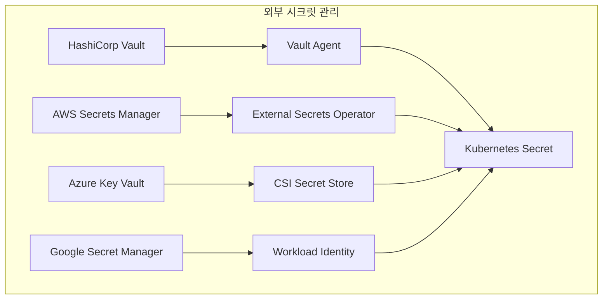
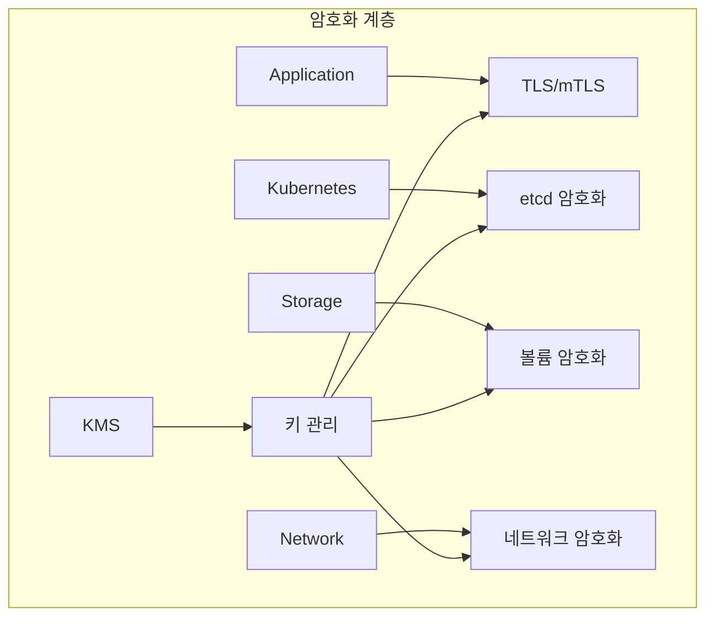
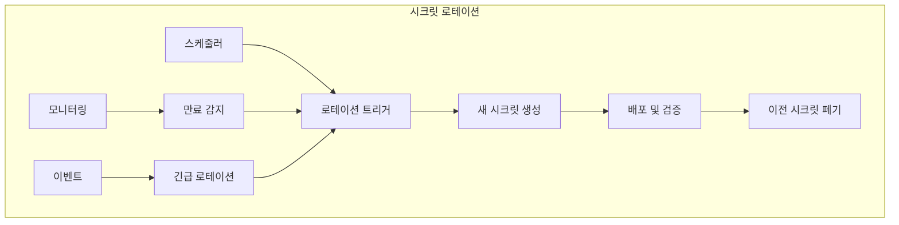

# Session 5: Secret 관리와 암호화 전략

## 📍 교과과정에서의 위치
이 세션은 **Week 3 > Day 2 > Session 5**로, Kubernetes의 Secret 관리와 암호화 전략을 학습합니다.

## 학습 목표 (5분)
- **Secret 생명주기** 관리와 **보안 모범 사례** 이해
- **외부 시크릿 관리** 시스템 통합 방법 학습
- **암호화 키 관리** (KMS 연동)와 **데이터 보호** 전략 파악
- **시크릿 로테이션**과 **자동화** 구현 방법 이해

## 1. Secret 생명주기 관리 (15분)

### Secret 관리 아키텍처



### Secret 관리 전략
```
Secret 생명주기 관리:

Secret 타입 및 용도:
   🔹 Opaque: 일반적인 시크릿
   🔹 kubernetes.io/service-account-token: 서비스 계정 토큰
   🔹 kubernetes.io/dockercfg: Docker 레지스트리 인증
   🔹 kubernetes.io/tls: TLS 인증서 및 키
   🔹 kubernetes.io/ssh-auth: SSH 인증 키
   🔹 kubernetes.io/basic-auth: 기본 인증 정보
   🔹 커스텀 타입: 애플리케이션별 시크릿

생성 및 저장:
   🔹 생성 방법:
      • kubectl create secret
      • YAML 매니페스트
      • 외부 도구 통합
      • CI/CD 파이프라인
      • 자동 생성 (cert-manager)
   🔹 저장 보안:
      • etcd 암호화
      • 전송 중 암호화
      • 접근 권한 제한
      • 백업 암호화
      • 감사 로깅
   🔹 데이터 형식:
   🔹 Base64 인코딩
   🔹 바이너리 데이터 지원
   🔹 키-값 쌍 구조
   🔹 메타데이터 포함
   🔹 라벨 및 어노테이션

배포 및 사용:
   🔹 마운트 방법:
      • 볼륨 마운트
      • 환경 변수
      • 파일 시스템 마운트
      • 메모리 기반 tmpfs
      • 프로젝션 볼륨
   🔹 접근 제어:
      • RBAC 권한 설정
      • 네임스페이스 격리
      • Pod 레벨 제한
      • 서비스 계정 기반
      • 네트워크 정책 적용
   🔹 보안 고려사항:
   🔹 최소 권한 원칙
   🔹 로그 노출 방지
   🔹 메모리 덤프 보호
   🔹 프로세스 격리
   🔹 컨테이너 보안
```

## 2. 외부 시크릿 관리 시스템 통합 (12분)

### 외부 시크릿 통합 아키텍처



### 외부 시스템 통합 전략
```
외부 시크릿 관리 시스템 통합:

HashiCorp Vault 통합:
   🔹 Vault Agent Injector:
      • 사이드카 패턴
      • 자동 시크릿 주입
      • 템플릿 기반 렌더링
      • 자동 갱신
      • 동적 시크릿 지원
   🔹 Vault CSI Provider:
      • CSI 드라이버 활용
      • 볼륨 마운트 방식
      • 파일 시스템 기반
      • 자동 로테이션
      • 다중 시크릿 지원
   🔹 External Secrets Operator:
   🔹 CRD 기반 관리
   🔹 다양한 백엔드 지원
   🔹 자동 동기화
   🔹 정책 기반 제어
   🔹 모니터링 통합

클라우드 시크릿 서비스:
   🔹 AWS Secrets Manager:
      • IAM 기반 인증
      • 자동 로테이션
      • 버전 관리
      • 교차 리전 복제
      • 감사 로깅
   🔹 Azure Key Vault:
      • Azure AD 통합
      • 하드웨어 보안 모듈
      • 인증서 관리
      • 키 관리
      • 액세스 정책
   🔹 Google Secret Manager:
   🔹 Workload Identity
   🔹 자동 암호화
   🔹 버전 관리
   🔹 감사 로깅
   🔹 IAM 통합
```

## 3. 암호화 키 관리와 KMS 연동 (10분)

### 암호화 아키텍처



### 암호화 전략
```
암호화 키 관리 및 KMS 연동:

etcd 암호화:
   🔹 저장 데이터 암호화:
      • AES-256 암호화
      • 키 래핑
      • 다중 키 지원
      • 키 로테이션
      • 성능 최적화
   🔹 KMS 통합:
      • AWS KMS
      • Azure Key Vault
      • Google Cloud KMS
      • HashiCorp Vault
      • 온프레미스 HSM
   🔹 설정 관리:
   🔹 EncryptionConfiguration
   🔹 키 계층 구조
   🔹 암호화 범위 설정
   🔹 성능 튜닝
   🔹 모니터링 설정

전송 중 암호화:
   🔹 클러스터 내부:
      • API 서버 TLS
      • etcd 클라이언트 TLS
      • kubelet TLS
      • 서비스 메시 mTLS
      • CNI 암호화
   🔹 외부 통신:
      • Ingress TLS
      • LoadBalancer TLS
      • 외부 서비스 연동
      • 클라우드 서비스 통신
      • 하이브리드 연결
   🔹 인증서 관리:
   🔹 cert-manager
   🔹 자동 갱신
   🔹 인증서 체인
   🔹 OCSP 검증
   🔹 인증서 모니터링
```

## 4. 시크릿 로테이션과 자동화 (10분)

### 자동화 워크플로우



### 자동화 구현
```
시크릿 로테이션 및 자동화:

자동 로테이션:
   🔹 스케줄 기반:
      • 정기적 로테이션
      • 만료 기반 갱신
      • 정책 기반 로테이션
      • 위험도 기반 조정
      • 비즈니스 요구사항 반영
   🔹 이벤트 기반:
      • 보안 사고 대응
      • 취약점 발견 시
      • 직원 퇴사 시
      • 시스템 침해 시
      • 컴플라이언스 요구
   🔹 자동화 도구:
   🔹 External Secrets Operator
   🔹 Vault Agent
   🔹 cert-manager
   🔹 커스텀 오퍼레이터
   🔹 CI/CD 통합

무중단 로테이션:
   🔹 블루-그린 전략:
      • 새 시크릿 준비
      • 점진적 전환
      • 검증 후 완전 전환
      • 이전 시크릿 정리
      • 롤백 계획
   🔹 카나리 전략:
      • 일부 인스턴스 먼저 적용
      • 모니터링 및 검증
      • 점진적 확산
      • 문제 시 즉시 롤백
      • 전체 적용 완료
   🔹 호환성 유지:
   🔹 다중 버전 지원
   🔹 점진적 마이그레이션
   🔹 하위 호환성
   🔹 의존성 관리
   🔹 통신 프로토콜 고려
```

## 💬 그룹 토론: 시크릿 관리 전략 선택 기준 (8분)

### 토론 주제
**"조직의 보안 요구사항과 운영 복잡도를 고려한 최적의 시크릿 관리 전략은?"**

### 토론 가이드라인

#### 보안 요구사항 (3분)
- **보안 수준**: 내장 Secret vs 외부 시크릿 관리 시스템
- **컴플라이언스**: 규제 요구사항에 따른 시크릿 관리
- **감사**: 시크릿 접근 및 사용 추적

#### 운영 복잡도 (3분)
- **관리 효율성**: 중앙집중식 vs 분산 관리
- **자동화**: 로테이션 및 배포 자동화 수준
- **통합**: 기존 시스템과의 통합 복잡도

#### 비용 효율성 (2분)
- **도구 비용**: 상용 vs 오픈소스 솔루션
- **운영 비용**: 관리 인력 및 시간
- **확장성**: 조직 성장에 따른 비용 증가

## 💡 핵심 개념 정리
- **Secret 생명주기**: 생성, 저장, 배포, 사용, 로테이션, 폐기
- **외부 통합**: Vault, 클라우드 시크릿 서비스와의 연동
- **암호화**: etcd 암호화, KMS 통합, 전송 중 암호화
- **자동화**: 시크릿 로테이션과 무중단 업데이트

## 📚 참고 자료
- [Secrets](https://kubernetes.io/docs/concepts/configuration/secret/)
- [Encrypting Secret Data at Rest](https://kubernetes.io/docs/tasks/administer-cluster/encrypt-data/)
- [External Secrets Operator](https://external-secrets.io/)
- [HashiCorp Vault](https://www.vaultproject.io/docs/platform/k8s)

## 다음 세션 준비
다음 세션에서는 **이미지 보안과 취약점 관리**에 대해 학습합니다. 컨테이너 이미지 보안 스캔과 취약점 관리 전략을 다룰 예정입니다.