# Session 5: Secret 관리와 암호화 전략

## 📍 교과과정에서의 위치
이 세션은 **Week 3 > Day 2 > Session 5**로, Kubernetes의 Secret 관리와 암호화 전략을 학습합니다.

## 학습 목표 (5분)
- **Secret 생명주기** 관리와 **보안 모범 사례** 이해
- **외부 시크릿 관리** 시스템 통합 방법 학습
- **암호화 키 관리** (KMS 연동)와 **데이터 보호** 전략 파악
- **시크릿 로테이션**과 **자동화** 구현 방법 이해

## 1. Secret 생명주기 관리 (15분)

### Secret 관리 아키텍처

```mermaid
graph TB
    subgraph "Secret 생명주기"
        A[생성] --> B[저장]
        B --> C[배포]
        C --> D[사용]
        D --> E[로테이션]
        E --> F[폐기]
        
        G[암호화] --> B
        H[접근 제어] --> C
        I[감사] --> D
        J[자동화] --> E
    end
```



### Secret 관리 전략
```
Secret 생명주기 관리:

Secret 타입 및 용도:
├── Opaque: 일반적인 시크릿
├── kubernetes.io/service-account-token: 서비스 계정 토큰
├── kubernetes.io/dockercfg: Docker 레지스트리 인증
├── kubernetes.io/tls: TLS 인증서 및 키
├── kubernetes.io/ssh-auth: SSH 인증 키
├── kubernetes.io/basic-auth: 기본 인증 정보
└── 커스텀 타입: 애플리케이션별 시크릿

생성 및 저장:
├── 생성 방법:
│   ├── kubectl create secret
│   ├── YAML 매니페스트
│   ├── 외부 도구 통합
│   ├── CI/CD 파이프라인
│   └── 자동 생성 (cert-manager)
├── 저장 보안:
│   ├── etcd 암호화
│   ├── 전송 중 암호화
│   ├── 접근 권한 제한
│   ├── 백업 암호화
│   └── 감사 로깅
└── 데이터 형식:
    ├── Base64 인코딩
    ├── 바이너리 데이터 지원
    ├── 키-값 쌍 구조
    ├── 메타데이터 포함
    └── 라벨 및 어노테이션

배포 및 사용:
├── 마운트 방법:
│   ├── 볼륨 마운트
│   ├── 환경 변수
│   ├── 파일 시스템 마운트
│   ├── 메모리 기반 tmpfs
│   └── 프로젝션 볼륨
├── 접근 제어:
│   ├── RBAC 권한 설정
│   ├── 네임스페이스 격리
│   ├── Pod 레벨 제한
│   ├── 서비스 계정 기반
│   └── 네트워크 정책 적용
└── 보안 고려사항:
    ├── 최소 권한 원칙
    ├── 로그 노출 방지
    ├── 메모리 덤프 보호
    ├── 프로세스 격리
    └── 컨테이너 보안
```

## 2. 외부 시크릿 관리 시스템 통합 (12분)

### 외부 시크릿 통합 아키텍처

```mermaid
graph TB
    subgraph "외부 시크릿 관리"
        A[HashiCorp Vault] --> B[Vault Agent]
        C[AWS Secrets Manager] --> D[External Secrets Operator]
        E[Azure Key Vault] --> F[CSI Secret Store]
        G[Google Secret Manager] --> H[Workload Identity]
        
        B --> I[Kubernetes Secret]
        D --> I
        F --> I
        H --> I
    end
```



### 외부 시스템 통합 전략
```
외부 시크릿 관리 시스템 통합:

HashiCorp Vault 통합:
├── Vault Agent Injector:
│   ├── 사이드카 패턴
│   ├── 자동 시크릿 주입
│   ├── 템플릿 기반 렌더링
│   ├── 자동 갱신
│   └── 동적 시크릿 지원
├── Vault CSI Provider:
│   ├── CSI 드라이버 활용
│   ├── 볼륨 마운트 방식
│   ├── 파일 시스템 기반
│   ├── 자동 로테이션
│   └── 다중 시크릿 지원
└── External Secrets Operator:
    ├── CRD 기반 관리
    ├── 다양한 백엔드 지원
    ├── 자동 동기화
    ├── 정책 기반 제어
    └── 모니터링 통합

클라우드 시크릿 서비스:
├── AWS Secrets Manager:
│   ├── IAM 기반 인증
│   ├── 자동 로테이션
│   ├── 버전 관리
│   ├── 교차 리전 복제
│   └── 감사 로깅
├── Azure Key Vault:
│   ├── Azure AD 통합
│   ├── 하드웨어 보안 모듈
│   ├── 인증서 관리
│   ├── 키 관리
│   └── 액세스 정책
└── Google Secret Manager:
    ├── Workload Identity
    ├── 자동 암호화
    ├── 버전 관리
    ├── 감사 로깅
    └── IAM 통합
```

## 3. 암호화 키 관리와 KMS 연동 (10분)

### 암호화 아키텍처

```mermaid
graph TB
    subgraph "암호화 계층"
        A[Application] --> B[TLS/mTLS]
        C[Kubernetes] --> D[etcd 암호화]
        E[Storage] --> F[볼륨 암호화]
        G[Network] --> H[네트워크 암호화]
        
        I[KMS] --> J[키 관리]
        J --> B
        J --> D
        J --> F
        J --> H
    end
```



### 암호화 전략
```
암호화 키 관리 및 KMS 연동:

etcd 암호화:
├── 저장 데이터 암호화:
│   ├── AES-256 암호화
│   ├── 키 래핑
│   ├── 다중 키 지원
│   ├── 키 로테이션
│   └── 성능 최적화
├── KMS 통합:
│   ├── AWS KMS
│   ├── Azure Key Vault
│   ├── Google Cloud KMS
│   ├── HashiCorp Vault
│   └── 온프레미스 HSM
└── 설정 관리:
    ├── EncryptionConfiguration
    ├── 키 계층 구조
    ├── 암호화 범위 설정
    ├── 성능 튜닝
    └── 모니터링 설정

전송 중 암호화:
├── 클러스터 내부:
│   ├── API 서버 TLS
│   ├── etcd 클라이언트 TLS
│   ├── kubelet TLS
│   ├── 서비스 메시 mTLS
│   └── CNI 암호화
├── 외부 통신:
│   ├── Ingress TLS
│   ├── LoadBalancer TLS
│   ├── 외부 서비스 연동
│   ├── 클라우드 서비스 통신
│   └── 하이브리드 연결
└── 인증서 관리:
    ├── cert-manager
    ├── 자동 갱신
    ├── 인증서 체인
    ├── OCSP 검증
    └── 인증서 모니터링
```

## 4. 시크릿 로테이션과 자동화 (10분)

### 자동화 워크플로우

```mermaid
graph TB
    subgraph "시크릿 로테이션"
        A[스케줄러] --> B[로테이션 트리거]
        B --> C[새 시크릿 생성]
        C --> D[배포 및 검증]
        D --> E[이전 시크릿 폐기]
        
        F[모니터링] --> G[만료 감지]
        G --> B
        
        H[이벤트] --> I[긴급 로테이션]
        I --> B
    end
```



### 자동화 구현
```
시크릿 로테이션 및 자동화:

자동 로테이션:
├── 스케줄 기반:
│   ├── 정기적 로테이션
│   ├── 만료 기반 갱신
│   ├── 정책 기반 로테이션
│   ├── 위험도 기반 조정
│   └── 비즈니스 요구사항 반영
├── 이벤트 기반:
│   ├── 보안 사고 대응
│   ├── 취약점 발견 시
│   ├── 직원 퇴사 시
│   ├── 시스템 침해 시
│   └── 컴플라이언스 요구
└── 자동화 도구:
    ├── External Secrets Operator
    ├── Vault Agent
    ├── cert-manager
    ├── 커스텀 오퍼레이터
    └── CI/CD 통합

무중단 로테이션:
├── 블루-그린 전략:
│   ├── 새 시크릿 준비
│   ├── 점진적 전환
│   ├── 검증 후 완전 전환
│   ├── 이전 시크릿 정리
│   └── 롤백 계획
├── 카나리 전략:
│   ├── 일부 인스턴스 먼저 적용
│   ├── 모니터링 및 검증
│   ├── 점진적 확산
│   ├── 문제 시 즉시 롤백
│   └── 전체 적용 완료
└── 호환성 유지:
    ├── 다중 버전 지원
    ├── 점진적 마이그레이션
    ├── 하위 호환성
    ├── 의존성 관리
    └── 통신 프로토콜 고려
```

## 💬 그룹 토론: 시크릿 관리 전략 선택 기준 (8분)

### 토론 주제
**"조직의 보안 요구사항과 운영 복잡도를 고려한 최적의 시크릿 관리 전략은?"**

### 토론 가이드라인

#### 보안 요구사항 (3분)
- **보안 수준**: 내장 Secret vs 외부 시크릿 관리 시스템
- **컴플라이언스**: 규제 요구사항에 따른 시크릿 관리
- **감사**: 시크릿 접근 및 사용 추적

#### 운영 복잡도 (3분)
- **관리 효율성**: 중앙집중식 vs 분산 관리
- **자동화**: 로테이션 및 배포 자동화 수준
- **통합**: 기존 시스템과의 통합 복잡도

#### 비용 효율성 (2분)
- **도구 비용**: 상용 vs 오픈소스 솔루션
- **운영 비용**: 관리 인력 및 시간
- **확장성**: 조직 성장에 따른 비용 증가

## 💡 핵심 개념 정리
- **Secret 생명주기**: 생성, 저장, 배포, 사용, 로테이션, 폐기
- **외부 통합**: Vault, 클라우드 시크릿 서비스와의 연동
- **암호화**: etcd 암호화, KMS 통합, 전송 중 암호화
- **자동화**: 시크릿 로테이션과 무중단 업데이트

## 📚 참고 자료
- [Secrets](https://kubernetes.io/docs/concepts/configuration/secret/)
- [Encrypting Secret Data at Rest](https://kubernetes.io/docs/tasks/administer-cluster/encrypt-data/)
- [External Secrets Operator](https://external-secrets.io/)
- [HashiCorp Vault](https://www.vaultproject.io/docs/platform/k8s)

## 다음 세션 준비
다음 세션에서는 **이미지 보안과 취약점 관리**에 대해 학습합니다. 컨테이너 이미지 보안 스캔과 취약점 관리 전략을 다룰 예정입니다.