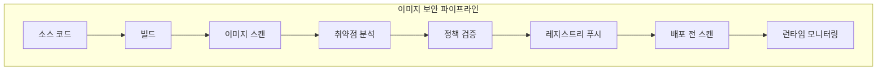
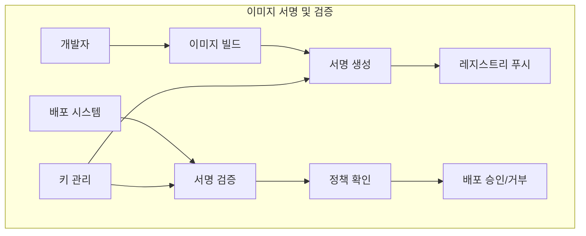
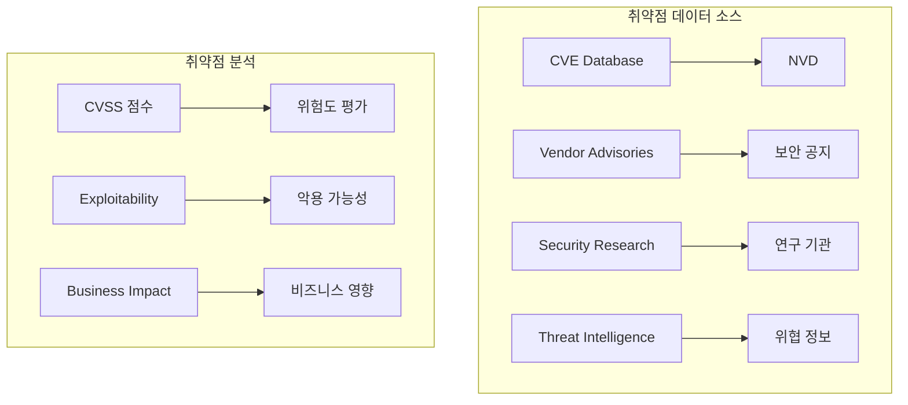
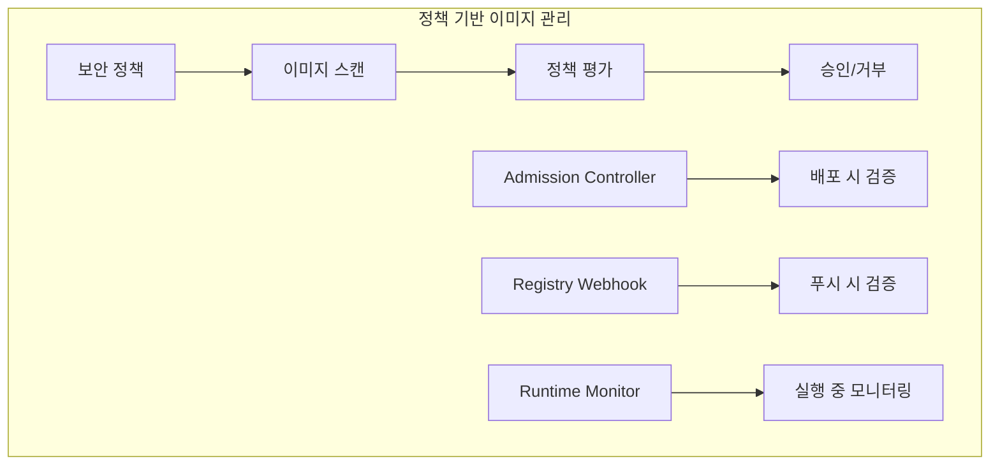

# Session 6: 이미지 보안과 취약점 관리

## 📍 교과과정에서의 위치
이 세션은 **Week 3 > Day 2 > Session 6**로, 컨테이너 이미지 보안과 취약점 관리 전략을 학습합니다.

## 학습 목표 (5분)
- **컨테이너 이미지** 보안 스캔과 **취약점 탐지** 방법 이해
- **이미지 서명**과 **검증** 메커니즘 학습
- **취약점 데이터베이스** 활용과 **위험도 평가** 방법 파악
- **보안 정책** 기반 이미지 관리와 **자동화** 전략 이해

## 1. 컨테이너 이미지 보안 스캔 (15분)

### 이미지 보안 파이프라인



### 이미지 스캔 전략
```
컨테이너 이미지 보안 스캔:

스캔 도구 및 기술:
   🔹 정적 분석 도구:
      • Trivy: 종합 취약점 스캐너
      • Clair: CoreOS 오픈소스 스캐너
      • Anchore: 정책 기반 분석
      • Snyk: 개발자 친화적 도구
      • Twistlock/Prisma: 엔터프라이즈 솔루션
   🔹 클라우드 네이티브 도구:
      • Amazon ECR 스캔
      • Google Container Analysis
      • Azure Container Registry 스캔
      • Harbor 내장 스캔
      • Quay 보안 스캔
   🔹 통합 플랫폼:
   🔹 GitLab Container Scanning
   🔹 GitHub Security
   🔹 Jenkins 플러그인
   🔹 CI/CD 파이프라인 통합
   🔹 Kubernetes Admission Controller

스캔 범위 및 대상:
   🔹 운영체제 취약점:
      • 베이스 이미지 취약점
      • 패키지 관리자 취약점
      • 시스템 라이브러리
      • 커널 취약점
      • 설정 오류
   🔹 애플리케이션 취약점:
      • 언어별 패키지 취약점
      • 의존성 라이브러리
      • 프레임워크 취약점
      • 커스텀 코드 분석
      • 설정 파일 검사
   🔹 시크릿 및 민감 정보:
      • 하드코딩된 패스워드
      • API 키 및 토큰
      • 인증서 및 키
      • 데이터베이스 연결 정보
      • 환경 변수 노출
   🔹 설정 및 정책:
   🔹 Dockerfile 모범 사례
   🔹 사용자 권한 설정
   🔹 포트 노출 검사
   🔹 볼륨 마운트 검사
   🔹 보안 컨텍스트 검증

스캔 시점 및 전략:
   🔹 빌드 시점 스캔:
      • CI/CD 파이프라인 통합
      • 빌드 실패 조건 설정
      • 취약점 임계값 설정
      • 자동 수정 제안
      • 보고서 생성
   🔹 레지스트리 스캔:
      • 푸시 시 자동 스캔
      • 정기적 재스캔
      • 새로운 취약점 탐지
      • 이미지 태그별 관리
      • 스캔 결과 메타데이터
   🔹 배포 전 스캔:
      • Admission Controller 통합
      • 정책 기반 배포 제어
      • 실시간 취약점 확인
      • 예외 처리 메커니즘
      • 감사 로깅
   🔹 런타임 스캔:
   🔹 실행 중 이미지 모니터링
   🔹 새로운 취약점 알림
   🔹 패치 가용성 확인
   🔹 자동 업데이트 트리거
   🔹 인시던트 대응 연동
```

## 2. 이미지 서명과 검증 메커니즘 (12분)

### 이미지 서명 아키텍처



### 서명 및 검증 전략
```
이미지 서명 및 검증:

서명 기술 및 표준:
   🔹 Docker Content Trust:
      • Notary 기반 서명
      • TUF (The Update Framework)
      • 계층적 키 관리
      • 역할 기반 서명
      • 오프라인 키 지원
   🔹 Cosign (Sigstore):
      • 간단한 서명 도구
      • OCI 표준 호환
      • 키리스 서명 지원
      • 투명성 로그 통합
      • OIDC 기반 인증
   🔹 클라우드 서명 서비스:
      • AWS Signer
      • Azure Code Signing
      • Google Binary Authorization
      • 관리형 키 서비스
      • 하드웨어 보안 모듈
   🔹 엔터프라이즈 솔루션:
   🔹 Red Hat 서명
   🔹 VMware 서명
   🔹 IBM 서명 서비스
   🔹 커스텀 PKI 통합
   🔹 하이브리드 솔루션

키 관리 전략:
   🔹 키 생성 및 저장:
      • 오프라인 루트 키
      • 온라인 서명 키
      • 하드웨어 보안 모듈
      • 클라우드 키 관리
      • 키 백업 및 복구
   🔹 키 로테이션:
      • 정기적 키 갱신
      • 침해 시 긴급 로테이션
      • 점진적 키 전환
      • 이전 서명 유효성
      • 자동화된 프로세스
   🔹 접근 제어:
      • 역할 기반 키 접근
      • 다중 서명 요구
      • 승인 워크플로우
      • 감사 로깅
      • 키 사용 모니터링
   🔹 키 폐기:
   🔹 키 만료 관리
   🔹 폐기 키 목록 관리
   🔹 서명 무효화
   🔹 알림 및 경고
   🔹 법적 요구사항 준수

검증 정책 및 시행:
   🔹 정책 정의:
      • 신뢰할 수 있는 서명자
      • 필수 서명 요구사항
      • 서명 유효성 검사
      • 예외 처리 규칙
      • 감사 요구사항
   🔹 시행 지점:
      • 레지스트리 레벨
      • Admission Controller
      • 런타임 검증
      • CI/CD 파이프라인
      • 개발자 도구
   🔹 검증 프로세스:
      • 서명 존재 확인
      • 서명자 신원 검증
      • 서명 무결성 확인
      • 정책 준수 검사
      • 결과 로깅
   🔹 예외 처리:
   🔹 긴급 배포 절차
   🔹 레거시 이미지 처리
   🔹 개발 환경 예외
   🔹 승인 워크플로우
   🔹 임시 정책 완화
```

## 3. 취약점 데이터베이스 활용 (10분)

### 취약점 관리 생태계



### 취약점 관리 전략
```
취약점 데이터베이스 활용:

주요 취약점 데이터베이스:
   🔹 CVE (Common Vulnerabilities and Exposures):
      • 표준 취약점 식별자
      • 글로벌 표준
      • 벤더 중립적
      • 공개 데이터베이스
      • 지속적 업데이트
   🔹 NVD (National Vulnerability Database):
      • NIST 운영
      • CVSS 점수 제공
      • 상세한 취약점 정보
      • 패치 정보 포함
      • API 접근 지원
   🔹 벤더별 보안 공지:
      • Red Hat Security Advisories
      • Ubuntu Security Notices
      • Debian Security Advisories
      • Alpine Security
      • 언어별 보안 공지
   🔹 상용 위협 인텔리전스:
   🔹 실시간 위협 정보
   🔹 제로데이 취약점
   🔹 악용 코드 정보
   🔹 공격 트렌드 분석
   🔹 맞춤형 위험 평가

위험도 평가 및 우선순위:
   🔹 CVSS (Common Vulnerability Scoring System):
      • 기본 점수 (Base Score)
      • 시간적 점수 (Temporal Score)
      • 환경적 점수 (Environmental Score)
      • 0-10 점수 체계
      • 심각도 분류
   🔹 비즈니스 영향 분석:
      • 자산 중요도
      • 데이터 민감도
      • 서비스 가용성
      • 컴플라이언스 영향
      • 재정적 손실
   🔹 악용 가능성 평가:
      • 공개된 익스플로잇
      • 공격 복잡도
      • 필요한 권한
      • 사용자 상호작용
      • 네트워크 접근성
   🔹 우선순위 매트릭스:
   🔹 높음: 즉시 패치
   🔹 중간: 계획된 패치
   🔹 낮음: 모니터링
   🔹 정보: 인지만 필요
   🔹 무시: 영향 없음

자동화된 취약점 관리:
   🔹 취약점 스캔 자동화:
      • 정기적 스캔 스케줄
      • 새로운 취약점 탐지
      • 델타 스캔 최적화
      • 대용량 이미지 처리
      • 클라우드 스케일링
   🔹 알림 및 보고:
      • 실시간 알림
      • 위험도별 에스컬레이션
      • 대시보드 시각화
      • 정기 보고서
      • 컴플라이언스 보고
   🔹 자동 수정:
      • 패치 가용성 확인
      • 자동 이미지 업데이트
      • 테스트 자동화
      • 점진적 배포
      • 롤백 메커니즘
   🔹 정책 기반 대응:
   🔹 위험도별 대응 정책
   🔹 SLA 기반 패치 일정
   🔹 비즈니스 규칙 적용
   🔹 예외 처리 워크플로우
   🔹 승인 프로세스 통합
```

## 4. 보안 정책 기반 이미지 관리 (10분)

### 정책 기반 관리 아키텍처



### 정책 관리 전략
```
보안 정책 기반 이미지 관리:

정책 정의 및 관리:
   🔹 보안 정책 유형:
      • 취약점 임계값 정책
      • 이미지 소스 정책
      • 서명 요구사항 정책
      • 라이선스 정책
      • 컴플라이언스 정책
   🔹 정책 적용 범위:
      • 글로벌 정책
      • 네임스페이스별 정책
      • 애플리케이션별 정책
      • 환경별 정책
      • 팀별 정책
   🔹 정책 우선순위:
      • 계층적 정책 구조
      • 상속 및 오버라이드
      • 예외 처리 규칙
      • 충돌 해결 메커니즘
      • 정책 검증
   🔹 정책 생명주기:
   🔹 정책 개발 및 테스트
   🔹 승인 및 배포
   🔹 모니터링 및 평가
   🔹 업데이트 및 개선
   🔹 폐기 및 아카이브

자동화된 정책 시행:
   🔹 Admission Controller:
      • ValidatingAdmissionWebhook
      • MutatingAdmissionWebhook
      • OPA Gatekeeper
      • Falco 통합
      • 커스텀 컨트롤러
   🔹 레지스트리 통합:
      • Harbor 정책 엔진
      • Quay 보안 스캔
      • ECR 스캔 결과
      • 웹훅 기반 검증
      • API 기반 통합
   🔹 CI/CD 통합:
      • 빌드 게이트
      • 품질 게이트
      • 보안 게이트
      • 승인 워크플로우
      • 자동 수정
   🔹 런타임 모니터링:
   🔹 실행 중 정책 검증
   🔹 새로운 취약점 탐지
   🔹 정책 위반 알림
   🔹 자동 격리
   🔹 인시던트 대응

예외 처리 및 거버넌스:
   🔹 예외 승인 프로세스:
      • 위험 평가
      • 비즈니스 정당성
      • 승인 권한자
      • 시간 제한
      • 모니터링 강화
   🔹 임시 정책 완화:
      • 긴급 상황 대응
      • 제한된 시간
      • 추가 보안 조치
      • 승인 추적
      • 자동 복원
   🔹 정책 위반 대응:
      • 자동 차단
      • 알림 발송
      • 에스컬레이션
      • 근본 원인 분석
      • 개선 조치
   🔹 컴플라이언스 관리:
   🔹 규제 요구사항 매핑
   🔹 감사 증적 관리
   🔹 정기적 검토
   🔹 보고서 생성
   🔹 외부 감사 지원
```

## 💬 그룹 토론: 이미지 보안 전략의 균형점 (8분)

### 토론 주제
**"개발 속도와 보안성을 균형있게 고려한 컨테이너 이미지 보안 전략은?"**

### 토론 가이드라인

#### 보안 vs 개발 속도 (3분)
- **스캔 시점**: 빌드 시 vs 배포 시 vs 런타임 스캔의 장단점
- **임계값 설정**: 취약점 차단 기준과 개발 생산성 영향
- **자동화 수준**: 완전 자동화 vs 수동 검토의 적절한 조합

#### 비용 vs 효과 (3분)
- **도구 선택**: 오픈소스 vs 상용 도구의 비용 대비 효과
- **인력 투입**: 보안 전문가 vs 개발자 교육의 효율성
- **인프라 비용**: 스캔 인프라와 스토리지 비용 고려

#### 실무 적용 (2분)
- **점진적 도입**: 기존 시스템에 보안 스캔 도입 전략
- **문화 변화**: 개발팀의 보안 의식 제고 방안
- **측정 지표**: 이미지 보안 개선 효과 측정 방법

## 💡 핵심 개념 정리
- **이미지 스캔**: 정적 분석을 통한 취약점 및 보안 이슈 탐지
- **이미지 서명**: 무결성과 출처 검증을 위한 디지털 서명
- **취약점 관리**: CVE 데이터베이스 활용과 위험도 기반 우선순위
- **정책 기반 관리**: 자동화된 보안 정책 시행과 예외 처리

## 📚 참고 자료
- [Container Image Security](https://kubernetes.io/docs/concepts/security/container-image-security/)
- [Trivy Documentation](https://aquasecurity.github.io/trivy/)
- [Cosign Documentation](https://docs.sigstore.dev/cosign/overview/)
- [OPA Gatekeeper](https://open-policy-agent.github.io/gatekeeper/)

## 다음 세션 준비
다음 세션에서는 **감사 로깅과 컴플라이언스**에 대해 학습합니다. Kubernetes 감사 로깅 구성과 규제 요구사항 대응 전략을 다룰 예정입니다.