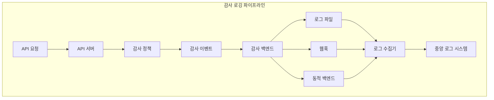
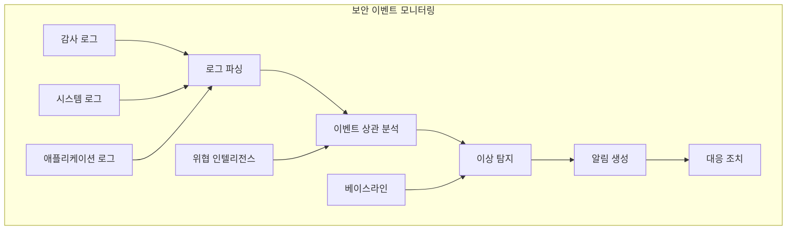
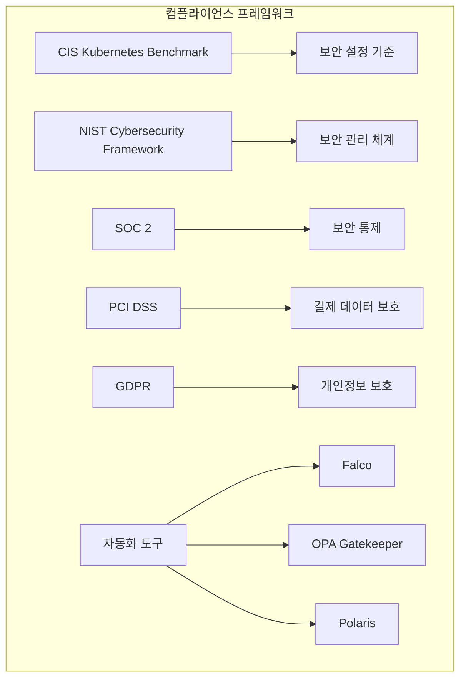
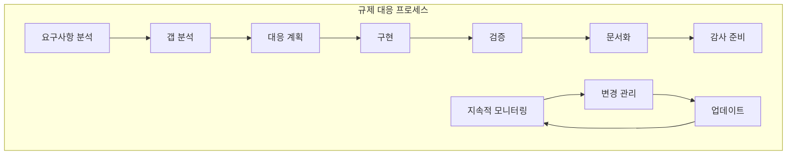

# Session 7: 감사 로깅과 컴플라이언스

## 📍 교과과정에서의 위치
이 세션은 **Week 3 > Day 2 > Session 7**로, Kubernetes의 감사 로깅과 컴플라이언스 관리를 학습합니다.

## 학습 목표 (5분)
- **Kubernetes 감사 로깅** 구성과 **보안 이벤트** 추적 방법 이해
- **컴플라이언스 프레임워크** (CIS, NIST)와 **규제 대응** 전략 학습
- **로그 분석**과 **이상 탐지**를 통한 **보안 모니터링** 구현 파악
- **감사 증적** 관리와 **보고서** 자동화 방법 이해

## 1. Kubernetes 감사 로깅 구성 (15분)

### 감사 로깅 아키텍처



### 감사 로깅 구성 전략
```
Kubernetes 감사 로깅:

감사 정책 설정:
   🔹 감사 레벨:
      • None: 감사하지 않음
      • Metadata: 요청 메타데이터만 기록
      • Request: 요청 본문 포함
      • RequestResponse: 요청과 응답 모두 기록
      • 성능 vs 상세도 트레이드오프
   🔹 감사 규칙:
      • 리소스별 규칙
      • 네임스페이스별 규칙
      • 사용자별 규칙
      • 동사별 규칙 (get, create, update, delete)
      • 조건부 규칙 적용
   🔹 필터링 전략:
      • 시스템 컴포넌트 제외
      • 읽기 전용 작업 제한
      • 민감한 리소스 집중
      • 노이즈 감소
      • 성능 최적화
   🔹 정책 예시:
   🔹 보안 중요 리소스 (secrets, roles)
   🔹 관리 작업 (create, update, delete)
   🔹 특권 사용자 활동
   🔹 실패한 요청
   🔹 정책 위반 시도

감사 백엔드 구성:
   🔹 로그 파일 백엔드:
      • 로컬 파일 시스템 저장
      • 로그 로테이션 설정
      • 압축 및 아카이브
      • 권한 및 접근 제어
      • 백업 및 복구
   🔹 웹훅 백엔드:
      • 외부 시스템 연동
      • 실시간 이벤트 전송
      • 배치 처리 지원
      • 재시도 메커니즘
      • 인증 및 암호화
   🔹 동적 백엔드:
      • 런타임 설정 변경
      • 다중 백엔드 지원
      • 조건부 라우팅
      • 로드 밸런싱
      • 장애 허용성
   🔹 성능 고려사항:
   🔹 버퍼링 및 배치 처리
   🔹 비동기 처리
   🔹 백프레셔 처리
   🔹 메모리 사용량 제한
   🔹 CPU 오버헤드 최소화

감사 이벤트 구조:
   🔹 기본 필드:
      • timestamp: 이벤트 발생 시간
      • level: 감사 레벨
      • stage: 요청 처리 단계
      • requestURI: 요청 URI
      • verb: HTTP 동사
   🔹 사용자 정보:
      • user: 사용자 정보
      • groups: 사용자 그룹
      • impersonatedUser: 가장 사용자
      • sourceIPs: 소스 IP 주소
      • userAgent: 클라이언트 정보
   🔹 리소스 정보:
      • namespace: 네임스페이스
      • resource: 리소스 타입
      • name: 리소스 이름
      • apiVersion: API 버전
      • resourceVersion: 리소스 버전
   🔹 요청/응답 데이터:
   🔹 requestObject: 요청 본문
   🔹 responseObject: 응답 본문
   🔹 responseStatus: 응답 상태
   🔹 requestReceivedTimestamp: 요청 수신 시간
   🔹 stageTimestamp: 단계별 타임스탬프
```

## 2. 보안 이벤트 모니터링 (12분)

### 보안 모니터링 아키텍처



### 보안 모니터링 전략
```
보안 이벤트 모니터링:

중요 보안 이벤트:
   🔹 인증 관련 이벤트:
      • 로그인 실패
      • 권한 상승 시도
      • 토큰 남용
      • 서비스 계정 오남용
      • 인증서 관련 오류
   🔹 권한 관련 이벤트:
      • RBAC 정책 위반
      • 금지된 리소스 접근
      • 권한 없는 작업 시도
      • 관리자 권한 사용
      • 정책 변경 시도
   🔹 리소스 관련 이벤트:
      • 시크릿 접근
      • 설정 변경
      • 중요 리소스 삭제
      • 대량 리소스 생성
      • 비정상적 리소스 사용
   🔹 네트워크 관련 이벤트:
      • 비정상적 트래픽 패턴
      • 외부 연결 시도
      • 포트 스캔 탐지
      • 네트워크 정책 위반
      • DNS 이상 쿼리
   🔹 시스템 관련 이벤트:
   🔹 컨테이너 탈출 시도
   🔹 호스트 파일 시스템 접근
   🔹 특권 컨테이너 실행
   🔹 시스템 호출 이상
   🔹 프로세스 이상 행동

이상 탐지 기법:
   🔹 규칙 기반 탐지:
      • 사전 정의된 패턴
      • 시그니처 기반 탐지
      • 임계값 기반 알림
      • 정규 표현식 매칭
      • 복합 조건 검사
   🔹 통계적 이상 탐지:
      • 베이스라인 설정
      • 표준 편차 기반
      • 시계열 분석
      • 계절성 고려
      • 트렌드 분석
   🔹 머신러닝 기반:
      • 비지도 학습
      • 클러스터링
      • 이상치 탐지
      • 딥러닝 모델
      • 행동 분석
   🔹 상관 분석:
      • 다중 이벤트 연관
      • 시간 기반 상관관계
      • 사용자 행동 패턴
      • 공격 체인 탐지
      • 위협 헌팅
   🔹 위협 인텔리전스:
   🔹 외부 위협 정보
   🔹 IOC (Indicators of Compromise)
   🔹 공격 패턴 데이터베이스
   🔹 실시간 위협 피드
   🔹 컨텍스트 정보 활용

실시간 모니터링 구현:
   🔹 로그 스트리밍:
      • 실시간 로그 수집
      • 스트림 처리
      • 이벤트 버퍼링
      • 백프레셔 처리
      • 장애 허용성
   🔹 대시보드 구성:
      • 실시간 보안 상태
      • 위협 레벨 표시
      • 이벤트 타임라인
      • 지리적 분포
      • 트렌드 분석
   🔹 알림 시스템:
      • 심각도별 알림
      • 에스컬레이션 정책
      • 다중 채널 알림
      • 알림 피로도 방지
      • 자동 티켓 생성
   🔹 자동 대응:
   🔹 자동 차단
   🔹 격리 조치
   🔹 임시 정책 적용
   🔹 증거 수집
   🔹 포렌식 준비
```

## 3. 컴플라이언스 프레임워크 (10분)

### 컴플라이언스 매핑



### 컴플라이언스 관리 전략
```
컴플라이언스 프레임워크:

CIS Kubernetes Benchmark:
   🔹 마스터 노드 보안:
      • API 서버 설정
      • 컨트롤러 매니저 설정
      • 스케줄러 설정
      • etcd 보안 설정
      • 일반적인 마스터 설정
   🔹 워커 노드 보안:
      • kubelet 설정
      • 컨테이너 런타임 설정
      • 네트워크 설정
      • 파일 권한 설정
      • 일반적인 워커 설정
   🔹 정책 설정:
      • RBAC 설정
      • Pod 보안 정책
      • 네트워크 정책
      • 감사 정책
      • 일반적인 정책
   🔹 자동화 도구:
   🔹 kube-bench: CIS 벤치마크 검사
   🔹 kube-hunter: 취약점 스캔
   🔹 Polaris: 모범 사례 검증
   🔹 Falco: 런타임 보안 모니터링
   🔹 커스텀 스크립트

NIST Cybersecurity Framework:
   🔹 Identify (식별):
      • 자산 관리
      • 비즈니스 환경
      • 거버넌스
      • 위험 평가
      • 위험 관리 전략
   🔹 Protect (보호):
      • 접근 제어
      • 인식 및 교육
      • 데이터 보안
      • 정보 보호 프로세스
      • 보호 기술
   🔹 Detect (탐지):
      • 이상 및 이벤트
      • 보안 지속 모니터링
      • 탐지 프로세스
      • 탐지 기술
   🔹 Respond (대응):
      • 대응 계획
      • 커뮤니케이션
      • 분석
      • 완화
      • 개선
   🔹 Recover (복구):
   🔹 복구 계획
   🔹 개선
   🔹 커뮤니케이션
   🔹 복구 기술

규제별 요구사항:
   🔹 SOC 2 (Service Organization Control 2):
      • 보안 통제
      • 가용성 통제
      • 처리 무결성
      • 기밀성 통제
      • 개인정보 보호
   🔹 PCI DSS (Payment Card Industry Data Security Standard):
      • 방화벽 및 라우터 설정
      • 시스템 패스워드 및 보안 매개변수
      • 저장된 카드 소지자 데이터 보호
      • 전송 중 카드 소지자 데이터 암호화
      • 취약점 관리 프로그램
   🔹 GDPR (General Data Protection Regulation):
      • 개인정보 처리 원칙
      • 개인정보 주체의 권리
      • 데이터 보호 영향 평가
      • 개인정보 보호 책임자
      • 개인정보 침해 신고
   🔹 HIPAA (Health Insurance Portability and Accountability Act):
   🔹 관리적 보호조치
   🔹 물리적 보호조치
   🔹 기술적 보호조치
   🔹 감사 통제
   🔹 접근 관리

자동화된 컴플라이언스:
   🔹 정책 as Code:
      • OPA (Open Policy Agent)
      • Gatekeeper 정책
      • Falco 규칙
      • 커스텀 Admission Controller
      • GitOps 기반 관리
   🔹 지속적 컴플라이언스:
      • 자동 검사
      • 실시간 모니터링
      • 편차 탐지
      • 자동 수정
      • 보고서 생성
   🔹 증거 수집:
      • 감사 로그 보존
      • 설정 스냅샷
      • 변경 이력 추적
      • 승인 기록
      • 테스트 결과
   🔹 보고 및 대시보드:
   🔹 컴플라이언스 상태
   🔹 위반 사항 추적
   🔹 개선 계획
   🔹 경영진 보고서
   🔹 감사자 지원
```

## 4. 규제 요구사항 대응 전략 (10분)

### 규제 대응 프로세스



### 규제 대응 구현
```
규제 요구사항 대응 전략:

요구사항 분석 및 매핑:
   🔹 규제 요구사항 식별:
      • 적용 가능한 규제 확인
      • 요구사항 상세 분석
      • 우선순위 설정
      • 영향도 평가
      • 타임라인 수립
   🔹 기술적 요구사항 매핑:
      • Kubernetes 기능 매핑
      • 보안 통제 매핑
      • 모니터링 요구사항
      • 데이터 보호 요구사항
      • 접근 제어 요구사항
   🔹 갭 분석:
      • 현재 상태 평가
      • 목표 상태 정의
      • 차이점 식별
      • 위험도 평가
      • 개선 우선순위
   🔹 대응 전략 수립:
   🔹 기술적 대응 방안
   🔹 프로세스 개선 방안
   🔹 조직적 대응 방안
   🔹 교육 및 인식 개선
   🔹 예산 및 리소스 계획

구현 및 운영:
   🔹 기술적 구현:
      • 보안 통제 구현
      • 모니터링 시스템 구축
      • 자동화 도구 도입
      • 정책 엔진 구성
      • 통합 테스트
   🔹 프로세스 구현:
      • 정책 및 절차 수립
      • 역할 및 책임 정의
      • 승인 워크플로우
      • 변경 관리 프로세스
      • 인시던트 대응 절차
   🔹 교육 및 훈련:
      • 직원 교육 프로그램
      • 역할별 맞춤 교육
      • 정기적 보안 교육
      • 컴플라이언스 인식 제고
      • 외부 교육 및 인증
   🔹 문서화:
   🔹 정책 및 절차 문서
   🔹 기술 문서
   🔹 운영 매뉴얼
   🔹 교육 자료
   🔹 감사 증적

지속적 컴플라이언스 관리:
   🔹 모니터링 및 측정:
      • 컴플라이언스 지표 정의
      • 자동화된 모니터링
      • 정기적 평가
      • 트렌드 분석
      • 벤치마킹
   🔹 변경 관리:
      • 규제 변경 모니터링
      • 영향도 분석
      • 대응 계획 수립
      • 구현 및 테스트
      • 문서 업데이트
   🔹 내부 감사:
      • 정기적 자체 점검
      • 독립적 검토
      • 개선 사항 도출
      • 시정 조치 계획
      • 경영진 보고
   🔹 외부 감사 지원:
   🔹 감사 준비
   🔹 증거 자료 제공
   🔹 감사자 지원
   🔹 발견 사항 대응
   🔹 개선 계획 수립

자동화 및 도구 활용:
   🔹 컴플라이언스 자동화:
      • 정책 자동 적용
      • 설정 드리프트 방지
      • 자동 수정
      • 예외 처리
      • 승인 워크플로우
   🔹 모니터링 도구:
      • Falco: 런타임 보안
      • OPA Gatekeeper: 정책 시행
      • Polaris: 모범 사례 검증
      • kube-bench: CIS 벤치마크
      • 커스텀 모니터링
   🔹 보고 도구:
      • 자동 보고서 생성
      • 대시보드 구성
      • 알림 시스템
      • 트렌드 분석
      • 경영진 보고
   🔹 통합 플랫폼:
   🔹 SIEM 통합
   🔹 GRC 플랫폼
   🔹 위험 관리 시스템
   🔹 감사 도구
   🔹 문서 관리 시스템
```

## 💬 그룹 토론: 컴플라이언스와 운영 효율성의 균형 (8분)

### 토론 주제
**"엄격한 컴플라이언스 요구사항과 운영 효율성을 동시에 만족하는 전략은?"**

### 토론 가이드라인

#### 자동화 vs 수동 제어 (3분)
- 자동화 범위: 어떤 컴플라이언스 요구사항을 자동화할 것인가
- 수동 검토: 인간의 판단이 필요한 영역 식별
- 예외 처리: 긴급 상황 시 컴플라이언스 완화 방안

#### 비용 vs 효과 (3분)
- 도구 투자: 컴플라이언스 도구 도입 비용 대비 효과
- 인력 배치: 전담 인력 vs 기존 팀 교육의 효율성
- 외부 지원: 컨설팅 vs 내부 역량 개발

#### 조직 문화 (2분)
- 문화 변화: 컴플라이언스 중심 문화 조성 방안
- 교육: 지속적인 교육과 인식 제고 프로그램
- 인센티브: 컴플라이언스 준수 동기 부여 방법

## 💡 핵심 개념 정리
- 감사 로깅: API 서버 활동 추적과 보안 이벤트 기록
- 보안 모니터링: 실시간 이상 탐지와 자동 대응 체계
- 컴플라이언스: CIS, NIST 등 표준 프레임워크 준수
- 자동화: 정책 기반 자동 검사와 지속적 컴플라이언스

## 📚 참고 자료
- [Auditing](https://kubernetes.io/docs/tasks/debug-application-cluster/audit/)
- [CIS Kubernetes Benchmark](https://www.cisecurity.org/benchmark/kubernetes)
- [NIST Cybersecurity Framework](https://www.nist.gov/cyberframework)
- [Falco Documentation](https://falco.org/docs/)

## 다음 세션 준비
다음 세션에서는 **보안 아키텍처 설계와 모범 사례**에 대해 학습합니다. Day 2에서 학습한 모든 보안 개념을 종합하여 실무 적용 방안을 다룰 예정입니다.