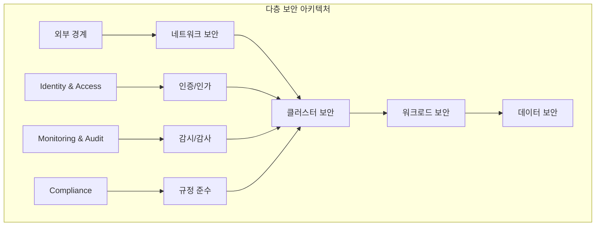
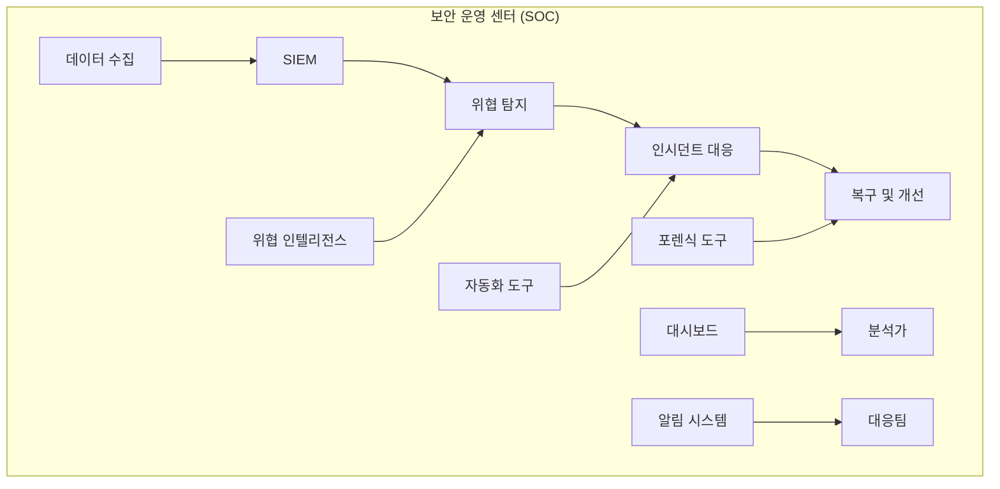
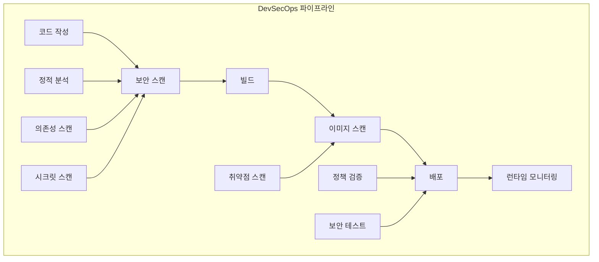
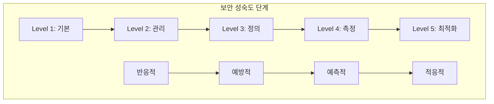

# Session 8: 보안 아키텍처 설계와 모범 사례

## 📍 교과과정에서의 위치
이 세션은 **Week 3 > Day 2 > Session 8**로, Day 2에서 학습한 모든 보안 개념을 종합하여 실무 보안 아키텍처 설계와 모범 사례를 학습합니다.

## 학습 목표 (5분)
- **종합적 보안 아키텍처** 설계 원칙과 **다층 방어** 전략 이해
- **보안 운영 센터** (SOC) 구축과 **인시던트 대응** 체계 학습
- **DevSecOps** 통합과 **보안 자동화** 구현 방법 파악
- **실무 적용** 시나리오와 **지속적 보안 개선** 전략 이해

## 1. 종합적 보안 아키텍처 설계 (15분)

### 다층 보안 아키텍처



### 보안 아키텍처 설계 원칙
```
종합적 보안 아키텍처 설계:

다층 방어 전략:
├── 1계층 - 외부 경계 보안:
│   ├── 클라우드 보안 그룹
│   ├── 웹 애플리케이션 방화벽 (WAF)
│   ├── DDoS 방어
│   ├── CDN 보안
│   └── DNS 보안
├── 2계층 - 네트워크 보안:
│   ├── 네트워크 분할
│   ├── 마이크로세그멘테이션
│   ├── 네트워크 정책
│   ├── 서비스 메시 보안
│   └── 트래픽 암호화
├── 3계층 - 클러스터 보안:
│   ├── API 서버 보안
│   ├── etcd 암호화
│   ├── RBAC 정책
│   ├── 노드 보안
│   └── 컨트롤 플레인 보안
├── 4계층 - 워크로드 보안:
│   ├── Pod 보안 표준
│   ├── 컨테이너 보안
│   ├── 이미지 보안
│   ├── 런타임 보안
│   └── 애플리케이션 보안
└── 5계층 - 데이터 보안:
    ├── 저장 데이터 암호화
    ├── 전송 데이터 암호화
    ├── 키 관리
    ├── 시크릿 관리
    └── 데이터 분류 및 보호

Zero Trust 아키텍처:
├── 핵심 원칙:
│   ├── 신뢰하지 않고 검증
│   ├── 최소 권한 접근
│   ├── 명시적 검증
│   ├── 지속적 모니터링
│   └── 동적 정책 적용
├── 구현 요소:
│   ├── 강력한 신원 확인
│   ├── 디바이스 검증
│   ├── 애플리케이션 검증
│   ├── 데이터 분류
│   └── 네트워크 마이크로세그멘테이션
├── Kubernetes 적용:
│   ├── mTLS everywhere
│   ├── 세밀한 RBAC
│   ├── 네트워크 정책
│   ├── 워크로드 신원
│   └── 지속적 검증
└── 모니터링 통합:
    ├── 모든 접근 로깅
    ├── 행동 분석
    ├── 이상 탐지
    ├── 실시간 대응
    └── 지속적 개선

보안 아키텍처 패턴:
├── 마이크로서비스 보안:
│   ├── 서비스별 보안 경계
│   ├── API 게이트웨이 보안
│   ├── 서비스 간 인증
│   ├── 분산 추적 보안
│   └── 데이터 일관성 보안
├── 멀티 테넌트 보안:
│   ├── 테넌트 격리
│   ├── 리소스 분리
│   ├── 네트워크 분리
│   ├── 데이터 분리
│   └── 감사 분리
├── 하이브리드 클라우드 보안:
│   ├── 일관된 보안 정책
│   ├── 통합 신원 관리
│   ├── 암호화된 연결
│   ├── 중앙집중식 모니터링
│   └── 규정 준수 관리
└── 엣지 컴퓨팅 보안:
    ├── 분산 보안 관리
    ├── 경량 보안 에이전트
    ├── 오프라인 보안
    ├── 디바이스 보안
    └── 데이터 동기화 보안
```

## 2. 보안 운영 센터 (SOC) 구축 (12분)

### SOC 아키텍처



### SOC 구축 전략
```
보안 운영 센터 (SOC) 구축:

SOC 구성 요소:
├── 데이터 수집 계층:
│   ├── 로그 수집기 (Fluentd, Logstash)
│   ├── 메트릭 수집기 (Prometheus)
│   ├── 네트워크 모니터링
│   ├── 엔드포인트 에이전트
│   └── 클라우드 API 통합
├── 데이터 처리 계층:
│   ├── SIEM (Security Information and Event Management)
│   ├── 로그 분석 엔진
│   ├── 상관 분석 엔진
│   ├── 머신러닝 플랫폼
│   └── 위협 인텔리전스 플랫폼
├── 분석 및 탐지 계층:
│   ├── 규칙 기반 탐지
│   ├── 행동 분석
│   ├── 이상 탐지
│   ├── 위협 헌팅
│   └── 취약점 관리
├── 대응 및 복구 계층:
│   ├── 인시던트 관리 시스템
│   ├── 자동화 도구 (SOAR)
│   ├── 포렌식 도구
│   ├── 복구 도구
│   └── 커뮤니케이션 도구
└── 관리 및 거버넌스:
    ├── 대시보드 및 리포팅
    ├── 정책 관리
    ├── 규정 준수 관리
    ├── 성과 측정
    └── 지속적 개선

Kubernetes SOC 특화:
├── 클러스터 모니터링:
│   ├── API 서버 감사 로그
│   ├── 컨트롤 플레인 메트릭
│   ├── 노드 상태 모니터링
│   ├── 네트워크 트래픽 분석
│   └── 리소스 사용률 추적
├── 워크로드 모니터링:
│   ├── 컨테이너 런타임 이벤트
│   ├── 애플리케이션 로그
│   ├── 시스템 호출 추적
│   ├── 네트워크 연결 모니터링
│   └── 파일 시스템 변경 감지
├── 보안 이벤트 탐지:
│   ├── 권한 상승 시도
│   ├── 컨테이너 탈출 시도
│   ├── 비정상적 네트워크 활동
│   ├── 악성 이미지 탐지
│   └── 정책 위반 탐지
└── 자동화된 대응:
    ├── Pod 격리
    ├── 네트워크 차단
    ├── 이미지 격리
    ├── 알림 발송
    └── 증거 수집

인시던트 대응 프로세스:
├── 1단계 - 탐지 및 분석:
│   ├── 이벤트 수집
│   ├── 초기 분석
│   ├── 심각도 평가
│   ├── 분류 및 우선순위
│   └── 에스컬레이션 결정
├── 2단계 - 격리 및 차단:
│   ├── 영향 범위 확인
│   ├── 격리 조치
│   ├── 추가 피해 방지
│   ├── 증거 보존
│   └── 이해관계자 알림
├── 3단계 - 제거 및 복구:
│   ├── 위협 제거
│   ├── 시스템 복구
│   ├── 데이터 복구
│   ├── 서비스 복원
│   └── 모니터링 강화
├── 4단계 - 사후 활동:
│   ├── 근본 원인 분석
│   ├── 교훈 학습
│   ├── 프로세스 개선
│   ├── 정책 업데이트
│   └── 보고서 작성
└── 지속적 개선:
    ├── 성과 지표 분석
    ├── 프로세스 최적화
    ├── 도구 개선
    ├── 교육 및 훈련
    └── 베스트 프랙티스 적용
```

## 3. DevSecOps 통합과 보안 자동화 (10분)

### DevSecOps 파이프라인



### DevSecOps 구현 전략
```
DevSecOps 통합 및 보안 자동화:

Shift-Left 보안:
├── 개발 단계 보안:
│   ├── 보안 코딩 가이드라인
│   ├── IDE 보안 플러그인
│   ├── 코드 리뷰 체크리스트
│   ├── 보안 교육 프로그램
│   └── 위협 모델링
├── 코드 분석:
│   ├── 정적 애플리케이션 보안 테스트 (SAST)
│   ├── 동적 애플리케이션 보안 테스트 (DAST)
│   ├── 대화형 애플리케이션 보안 테스트 (IAST)
│   ├── 소프트웨어 구성 분석 (SCA)
│   └── 시크릿 스캔
├── 빌드 단계 보안:
│   ├── 보안 빌드 환경
│   ├── 이미지 보안 스캔
│   ├── 의존성 취약점 검사
│   ├── 라이선스 검증
│   └── 보안 테스트 자동화
└── 배포 단계 보안:
    ├── 인프라 보안 스캔
    ├── 설정 보안 검증
    ├── 정책 준수 확인
    ├── 보안 승인 게이트
    └── 배포 후 검증

CI/CD 보안 통합:
├── 파이프라인 보안:
│   ├── 파이프라인 as Code
│   ├── 보안 게이트 구현
│   ├── 자동화된 보안 테스트
│   ├── 보안 승인 워크플로우
│   └── 감사 추적
├── 도구 통합:
│   ├── GitLab Security
│   ├── GitHub Advanced Security
│   ├── Jenkins Security Plugins
│   ├── Azure DevOps Security
│   └── 커스텀 보안 도구
├── 정책 자동화:
│   ├── OPA 정책 엔진
│   ├── Gatekeeper 통합
│   ├── Falco 규칙 자동화
│   ├── 커스텀 Admission Controller
│   └── 정책 as Code
└── 보안 메트릭:
    ├── 보안 테스트 커버리지
    ├── 취약점 발견 및 수정 시간
    ├── 보안 게이트 통과율
    ├── 정책 위반 빈도
    └── 보안 기술 부채

자동화된 보안 운영:
├── 자동 탐지:
│   ├── 이상 행동 탐지
│   ├── 위협 인텔리전스 연동
│   ├── 머신러닝 기반 탐지
│   ├── 규칙 기반 탐지
│   └── 상관 분석
├── 자동 대응:
│   ├── 자동 격리
│   ├── 자동 차단
│   ├── 자동 패치
│   ├── 자동 스케일링
│   └── 자동 복구
├── 자동 복구:
│   ├── 자동 롤백
│   ├── 자동 재배포
│   ├── 자동 설정 복원
│   ├── 자동 데이터 복구
│   └── 자동 서비스 복원
└── 자동 보고:
    ├── 실시간 대시보드
    ├── 자동 알림
    ├── 정기 보고서
    ├── 컴플라이언스 보고
    └── 경영진 보고
```

## 4. 실무 적용 시나리오와 지속적 개선 (10분)

### 보안 성숙도 모델



### 실무 적용 전략
```
실무 적용 시나리오 및 지속적 개선:

보안 성숙도 모델:
├── Level 1 - 기본 (Ad-hoc):
│   ├── 기본적인 보안 통제
│   ├── 반응적 보안 대응
│   ├── 수동적 보안 관리
│   ├── 제한적 가시성
│   └── 개별적 보안 도구
├── Level 2 - 관리 (Managed):
│   ├── 정책 기반 보안
│   ├── 중앙집중식 관리
│   ├── 기본적인 자동화
│   ├── 정기적 보안 평가
│   └── 표준화된 프로세스
├── Level 3 - 정의 (Defined):
│   ├── 통합된 보안 아키텍처
│   ├── 자동화된 보안 통제
│   ├── 지속적 모니터링
│   ├── 위험 기반 접근
│   └── 보안 메트릭 수집
├── Level 4 - 측정 (Measured):
│   ├── 데이터 기반 의사결정
│   ├── 예측적 보안 분석
│   ├── 지속적 개선
│   ├── 벤치마킹
│   └── ROI 측정
└── Level 5 - 최적화 (Optimized):
    ├── 자율적 보안 운영
    ├── 머신러닝 기반 최적화
    ├── 적응적 보안 정책
    ├── 혁신적 보안 기술
    └── 지속적 혁신

실무 구현 로드맵:
├── 1단계 - 기반 구축 (1-3개월):
│   ├── 현재 상태 평가
│   ├── 보안 정책 수립
│   ├── 기본 도구 도입
│   ├── 팀 구성 및 교육
│   └── 초기 모니터링 구축
├── 2단계 - 자동화 도입 (3-6개월):
│   ├── CI/CD 보안 통합
│   ├── 정책 자동화
│   ├── 모니터링 확장
│   ├── 인시던트 대응 체계
│   └── 컴플라이언스 자동화
├── 3단계 - 고도화 (6-12개월):
│   ├── 고급 위협 탐지
│   ├── 머신러닝 도입
│   ├── 제로 트러스트 구현
│   ├── 통합 보안 플랫폼
│   └── 성과 측정 체계
├── 4단계 - 최적화 (12개월+):
│   ├── 자율적 보안 운영
│   ├── 예측적 보안 분석
│   ├── 적응적 정책 관리
│   ├── 혁신 기술 도입
│   └── 지속적 개선
└── 지속적 활동:
    ├── 정기적 보안 평가
    ├── 위협 환경 모니터링
    ├── 기술 트렌드 분석
    ├── 교육 및 인식 제고
    └── 베스트 프랙티스 적용

성공 요인 및 KPI:
├── 기술적 지표:
│   ├── 보안 사고 감소율
│   ├── 취약점 발견 및 수정 시간
│   ├── 보안 테스트 커버리지
│   ├── 자동화 수준
│   └── 시스템 가용성
├── 프로세스 지표:
│   ├── 정책 준수율
│   ├── 인시던트 대응 시간
│   ├── 보안 교육 이수율
│   ├── 변경 관리 효율성
│   └── 감사 준비도
├── 비즈니스 지표:
│   ├── 보안 투자 ROI
│   ├── 비즈니스 연속성
│   ├── 고객 신뢰도
│   ├── 규제 준수 비용
│   └── 경쟁 우위
└── 조직 지표:
    ├── 보안 문화 성숙도
    ├── 팀 역량 수준
    ├── 협업 효율성
    ├── 혁신 수준
    └── 직원 만족도

지속적 개선 프로세스:
├── 정기적 평가:
│   ├── 분기별 보안 리뷰
│   ├── 연간 보안 평가
│   ├── 외부 보안 감사
│   ├── 벤치마킹 분석
│   └── 성과 지표 검토
├── 피드백 수집:
│   ├── 사용자 피드백
│   ├── 운영팀 피드백
│   ├── 개발팀 피드백
│   ├── 비즈니스 피드백
│   └── 외부 전문가 의견
├── 개선 계획:
│   ├── 우선순위 설정
│   ├── 개선 로드맵 수립
│   ├── 리소스 할당
│   ├── 일정 계획
│   └── 성공 지표 정의
└── 실행 및 모니터링:
    ├── 개선 사항 구현
    ├── 진행 상황 모니터링
    ├── 효과 측정
    ├── 조정 및 최적화
    └── 결과 공유
```

## 💬 그룹 토론: 보안 투자 우선순위 결정 (8분)

### 토론 주제
**"제한된 예산과 인력으로 최대의 보안 효과를 얻기 위한 투자 우선순위는?"**

### 토론 가이드라인

#### 위험 기반 우선순위 (3분)
- **위험 평가**: 비즈니스 영향도와 발생 가능성 기반 우선순위
- **빠른 승리**: 적은 투자로 큰 효과를 얻을 수 있는 영역
- **핵심 자산**: 가장 중요한 자산과 시스템 보호 우선

#### 자동화 vs 인력 (3분)
- **자동화 투자**: 도구와 플랫폼 투자 vs 인력 투자
- **기술 부채**: 기존 시스템 개선 vs 새로운 기술 도입
- **교육**: 기존 인력 교육 vs 전문가 채용

#### 단기 vs 장기 (2분)
- **즉시 효과**: 단기간에 보안 수준 향상 방안
- **장기 전략**: 지속 가능한 보안 아키텍처 구축
- **균형점**: 단기 성과와 장기 투자의 적절한 균형

## 💡 핵심 개념 정리
- **다층 방어**: 여러 보안 계층을 통한 종합적 보안 아키텍처
- **Zero Trust**: 신뢰하지 않고 검증하는 보안 모델
- **SOC**: 중앙집중식 보안 운영과 인시던트 대응 체계
- **DevSecOps**: 개발 프로세스에 보안을 통합한 자동화 접근

## 📚 참고 자료
- [Kubernetes Security Best Practices](https://kubernetes.io/docs/concepts/security/)
- [NIST Zero Trust Architecture](https://csrc.nist.gov/publications/detail/sp/800-207/final)
- [DevSecOps Practices](https://www.devsecops.org/)
- [Security Operations Center](https://www.sans.org/white-papers/2071/)

## Day 2 종합 정리
Day 2에서는 Kubernetes의 보안 모델과 정책 관리를 종합적으로 학습했습니다:
- **보안 모델**: 다층 보안 아키텍처와 AAA 프레임워크
- **RBAC**: 세밀한 권한 설계와 최소 권한 원칙
- **Pod 보안**: Security Context와 Pod Security Standards
- **네트워크 보안**: Network Policy와 마이크로세그멘테이션
- **시크릿 관리**: 생명주기 관리와 외부 시스템 통합
- **이미지 보안**: 취약점 스캔과 서명 검증
- **감사**: 로깅과 컴플라이언스 관리
- **보안 아키텍처**: 종합적 설계와 DevSecOps 통합

## 다음 Day 준비
Day 3에서는 **모니터링과 관찰 가능성**에 대해 학습합니다. Prometheus, Grafana, 로깅, 분산 추적 등 시스템 관찰과 분석에 필요한 모든 요소를 다룰 예정입니다.