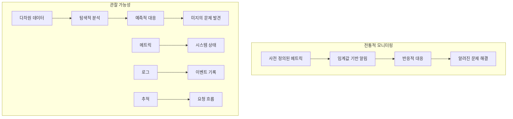
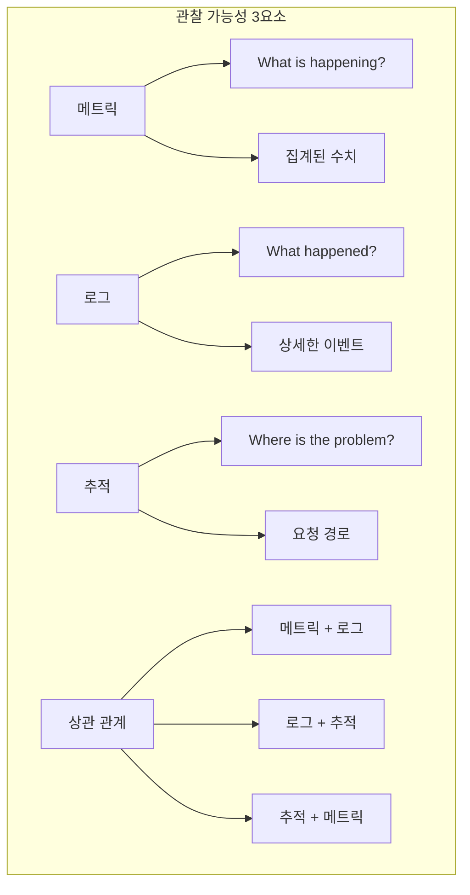
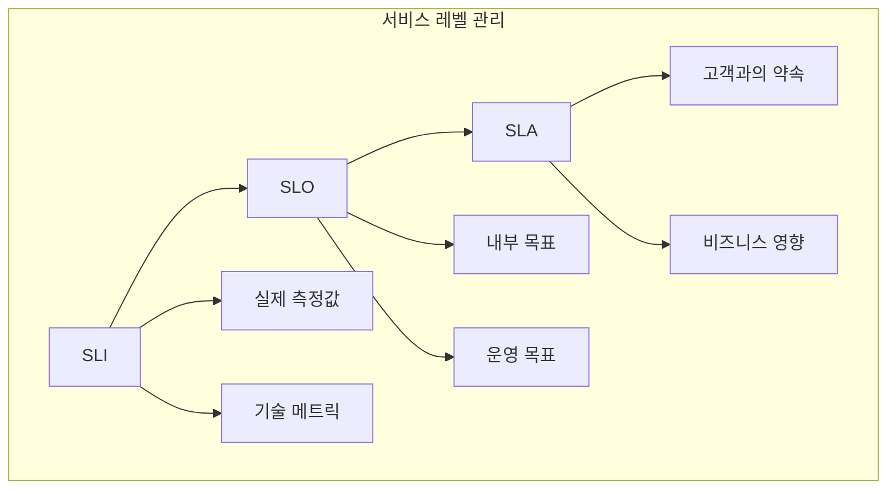
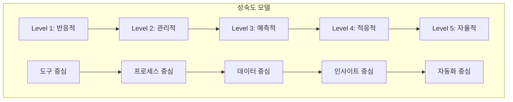

# Session 1: 관찰 가능성(Observability) 개념과 원칙

## 📍 교과과정에서의 위치
이 세션은 **Week 3 > Day 3 > Session 1**로, 관찰 가능성의 핵심 개념과 메트릭, 로그, 추적의 3요소를 학습합니다.

## 학습 목표 (5분)
- **관찰 가능성** 개념과 **모니터링**과의 차이점 이해
- **메트릭, 로그, 추적** 3요소의 역할과 상호 관계 학습
- **SLI, SLO, SLA** 정의와 측정 방법론 파악
- **관찰 가능성 성숙도** 모델과 구현 전략 이해

## 1. 관찰 가능성 vs 모니터링 (15분)

### 개념 비교



### 관찰 가능성 핵심 개념
```
관찰 가능성 (Observability) 개념:

정의 및 특성:
   🔹 시스템 내부 상태를 외부 출력으로 추론 가능한 정도
   🔹 복잡한 분산 시스템의 동작 이해
   🔹 미지의 문제 발견 및 해결 능력
   🔹 데이터 기반 의사결정 지원
   🔹 지속적 시스템 개선 기반

3가지 핵심 요소:
   🔹 메트릭 (Metrics):
      • 시간 기반 수치 데이터
      • 시스템 성능 지표
      • 집계 가능한 데이터
      • 대시보드 시각화
      • 알림 및 자동화 기준
   🔹 로그 (Logs):
      • 시간 순서 이벤트 기록
      • 구조화/비구조화 데이터
      • 컨텍스트 정보 포함
      • 디버깅 및 분석 도구
      • 감사 및 컴플라이언스
   🔹 추적 (Traces):
   🔹 요청 흐름 추적
   🔹 분산 시스템 가시성
   🔹 성능 병목 식별
   🔹 서비스 의존성 분석
   🔹 사용자 경험 분석

모니터링 vs 관찰 가능성:
   🔹 모니터링 특성:
      • 알려진 문제 감지
      • 사전 정의된 메트릭
      • 임계값 기반 알림
      • 반응적 접근
      • 시스템 상태 확인
   🔹 관찰 가능성 특성:
      • 미지의 문제 탐색
      • 다차원 데이터 분석
      • 탐색적 질의
      • 예측적 접근
      • 시스템 이해 증진
   🔹 상호 보완 관계:
      • 모니터링: 알려진 위험 관리
      • 관찰 가능성: 새로운 인사이트 발견
      • 통합적 접근 필요
      • 단계적 발전 과정
      • 조직 성숙도에 따른 적용
   🔹 구현 전략:
   🔹 모니터링 기반 시작
   🔹 점진적 관찰 가능성 확장
   🔹 도구 통합 및 표준화
   🔹 문화 및 프로세스 변화
   🔹 지속적 개선 및 학습
```

## 2. 메트릭, 로그, 추적 3요소 (12분)

### 3요소 상호 관계



### 3요소 상세 분석
```
관찰 가능성 3요소 상세:

메트릭 (Metrics):
   🔹 특성 및 용도:
      • 시간 기반 수치 데이터
      • 집계 및 통계 분석 가능
      • 효율적 저장 및 쿼리
      • 실시간 모니터링
      • 자동화 및 알림 기준
   🔹 메트릭 타입:
      • Counter: 누적 카운터 (요청 수, 에러 수)
      • Gauge: 현재 값 (CPU 사용률, 메모리 사용량)
      • Histogram: 분포 분석 (응답 시간, 요청 크기)
      • Summary: 분위수 분석 (95th percentile)
      • 커스텀 메트릭: 비즈니스 특화 지표
   🔹 수집 전략:
      • Pull 모델: Prometheus 스타일
      • Push 모델: StatsD 스타일
      • 하이브리드: 상황별 최적 선택
      • 샘플링: 고빈도 메트릭 최적화
      • 집계: 다양한 시간 단위
   🔹 활용 방안:
      • 성능 모니터링
      • 용량 계획
      • SLA 측정
      • 자동 스케일링
      • 비즈니스 인사이트
   🔹 모범 사례:
   🔹 의미 있는 메트릭 선택
   🔹 적절한 라벨링 전략
   🔹 카디널리티 관리
   🔹 메트릭 네이밍 규칙
   🔹 성능 최적화

로그 (Logs):
   🔹 특성 및 용도:
      • 시간 순서 이벤트 기록
      • 풍부한 컨텍스트 정보
      • 디버깅 및 문제 해결
      • 감사 및 컴플라이언스
      • 근본 원인 분석
   🔹 로그 타입:
      • 애플리케이션 로그: 비즈니스 로직 이벤트
      • 시스템 로그: OS 및 인프라 이벤트
      • 보안 로그: 인증, 인가, 감사 이벤트
      • 액세스 로그: HTTP 요청/응답
      • 에러 로그: 예외 및 오류 정보
   🔹 로그 구조:
      • 구조화된 로그 (JSON, XML)
      • 반구조화된 로그 (Key-Value)
      • 비구조화된 로그 (Plain Text)
      • 표준화된 필드
      • 메타데이터 포함
   🔹 수집 및 처리:
      • 중앙집중식 로그 수집
      • 실시간 스트림 처리
      • 로그 파싱 및 정규화
      • 인덱싱 및 검색
      • 보존 및 아카이빙
   🔹 분석 기법:
   🔹 텍스트 검색 및 필터링
   🔹 패턴 매칭 및 정규식
   🔹 통계 분석
   🔹 머신러닝 기반 분석
   🔹 상관 분석

추적 (Traces):
   🔹 특성 및 용도:
      • 분산 요청 흐름 추적
      • 서비스 간 의존성 분석
      • 성능 병목 식별
      • 에러 전파 경로 추적
      • 사용자 경험 분석
   🔹 추적 구성 요소:
      • Trace: 전체 요청 여정
      • Span: 개별 작업 단위
      • 부모-자식 관계
      • 태그 및 로그
      • 컨텍스트 전파
   🔹 샘플링 전략:
      • 확률적 샘플링
      • 적응적 샘플링
      • 우선순위 기반 샘플링
      • 에러 기반 샘플링
      • 비즈니스 규칙 기반
   🔹 표준 및 도구:
      • OpenTelemetry: 표준 계측
      • Jaeger: 분산 추적 시스템
      • Zipkin: 트위터 오픈소스
      • AWS X-Ray: 클라우드 서비스
      • Google Cloud Trace: GCP 서비스
   🔹 분석 활용:
   🔹 성능 최적화
   🔹 서비스 의존성 매핑
   🔹 에러 근본 원인 분석
   🔹 사용자 여정 분석
   🔹 아키텍처 개선

3요소 통합 활용:
   🔹 상관 분석:
      • 메트릭 이상 → 로그 분석
      • 로그 에러 → 추적 분석
      • 추적 지연 → 메트릭 확인
      • 통합 대시보드
      • 자동 상관 관계 탐지
   🔹 문제 해결 워크플로우:
      • 메트릭으로 문제 감지
      • 로그로 상세 정보 확인
      • 추적으로 근본 원인 분석
      • 통합 분석으로 해결책 도출
      • 개선 사항 적용 및 검증
   🔹 성능 최적화:
      • 메트릭으로 성능 트렌드 파악
      • 추적으로 병목 지점 식별
      • 로그로 에러 패턴 분석
      • 통합 분석으로 최적화 방안 도출
      • 효과 측정 및 검증
   🔹 비즈니스 인사이트:
   🔹 메트릭으로 비즈니스 KPI 측정
   🔹 로그로 사용자 행동 분석
   🔹 추적으로 사용자 여정 분석
   🔹 통합 분석으로 비즈니스 개선
   🔹 데이터 기반 의사결정
```

## 3. SLI, SLO, SLA 정의와 측정 (10분)

### SLI/SLO/SLA 관계



### SLI/SLO/SLA 구현
```
SLI, SLO, SLA 정의 및 측정:

SLI (Service Level Indicator):
   🔹 정의: 서비스 성능의 정량적 측정값
   🔹 주요 SLI 유형:
      • 가용성: 성공적인 요청 비율
      • 지연시간: 요청 처리 시간
      • 처리량: 단위 시간당 처리 요청 수
      • 에러율: 실패한 요청 비율
      • 품질: 정확성, 완전성 등
   🔹 측정 방법:
      • 클라이언트 측 측정
      • 서버 측 측정
      • 로드 밸런서 측정
      • 합성 모니터링
      • 실사용자 모니터링 (RUM)
   🔹 구현 고려사항:
   🔹 측정 정확성
   🔹 데이터 신뢰성
   🔹 측정 오버헤드
   🔹 실시간성
   🔹 히스토리 보존

SLO (Service Level Objective):
   🔹 정의: SLI에 대한 목표값 또는 범위
   🔹 설정 원칙:
      • 측정 가능한 목표
      • 달성 가능한 수준
      • 비즈니스 요구사항 반영
      • 사용자 경험 중심
      • 지속적 개선 가능
   🔹 일반적인 SLO:
      • 가용성: 99.9% (월 43분 다운타임)
      • 지연시간: 95%ile < 100ms
      • 에러율: < 0.1%
      • 처리량: > 1000 RPS
      • 데이터 내구성: 99.999999999%
   🔹 에러 버젯 (Error Budget):
      • 허용 가능한 실패 시간/횟수
      • 혁신과 안정성의 균형
      • 배포 속도 조절 기준
      • 위험 관리 도구
      • 팀 간 협업 기준
   🔹 SLO 관리:
   🔹 정기적 검토 및 조정
   🔹 비즈니스 변화 반영
   🔹 기술 발전 고려
   🔹 사용자 피드백 반영
   🔹 경쟁사 벤치마킹

SLA (Service Level Agreement):
   🔹 정의: 고객과의 서비스 수준 약속
   🔹 구성 요소:
      • 서비스 범위 정의
      • 성능 기준 명시
      • 측정 방법 합의
      • 보상 조건 설정
      • 예외 상황 정의
   🔹 비즈니스 영향:
      • 고객 만족도
      • 브랜드 신뢰도
      • 매출 영향
      • 법적 책임
      • 경쟁 우위
   🔹 관리 전략:
   🔹 보수적 SLA 설정
   🔹 SLO보다 낮은 수준
   🔹 충분한 에러 버젯 확보
   🔹 정기적 성과 리뷰
   🔹 고객 커뮤니케이션
```

## 4. 관찰 가능성 성숙도 모델 (10분)

### 성숙도 단계



### 성숙도 모델 구현
```
관찰 가능성 성숙도 모델:

Level 1 - 반응적 (Reactive):
   🔹 특성:
      • 문제 발생 후 대응
      • 기본적인 모니터링
      • 수동적 문제 해결
      • 사일로화된 도구
      • 제한적 가시성
   🔹 구현 요소:
      • 기본 메트릭 수집
      • 로그 파일 기반 분석
      • 단순한 알림 시스템
      • 수동 대시보드
      • 개별 도구 사용
   🔹 개선 방향:
   🔹 중앙집중식 로그 수집
   🔹 메트릭 표준화
   🔹 자동화된 알림
   🔹 통합 대시보드
   🔹 프로세스 문서화

Level 2 - 관리적 (Managed):
   🔹 특성:
      • 체계적인 모니터링
      • 표준화된 프로세스
      • 중앙집중식 관리
      • 기본적인 자동화
      • 정기적 리뷰
   🔹 구현 요소:
      • 통합 모니터링 플랫폼
      • 표준화된 메트릭
      • 중앙집중식 로깅
      • 자동화된 알림
      • SLI/SLO 정의
   🔹 개선 방향:
   🔹 분산 추적 도입
   🔹 고급 분석 도구
   🔹 예측적 분석
   🔹 자동화 확장
   🔹 문화 변화

Level 3 - 예측적 (Predictive):
   🔹 특성:
      • 문제 예측 및 예방
      • 데이터 기반 의사결정
      • 고급 분석 활용
      • 자동화된 대응
      • 지속적 개선
   🔹 구현 요소:
      • 머신러닝 기반 분석
      • 이상 탐지 시스템
      • 예측적 알림
      • 자동 스케일링
      • 성능 최적화
   🔹 개선 방향:
   🔹 AI/ML 고도화
   🔹 자율적 운영
   🔹 적응적 시스템
   🔹 실시간 최적화
   🔹 혁신적 접근

Level 4 - 적응적 (Adaptive):
   🔹 특성:
      • 환경 변화 자동 적응
      • 지능형 자동화
      • 자가 치유 시스템
      • 동적 최적화
      • 학습 기반 개선
   🔹 구현 요소:
      • 적응적 임계값
      • 동적 정책 조정
      • 자동 근본 원인 분석
      • 지능형 알림
      • 자동 복구 시스템
   🔹 개선 방향:
   🔹 완전 자율 운영
   🔹 혁신적 기술 도입
   🔹 생태계 통합
   🔹 비즈니스 가치 극대화
   🔹 지속적 혁신

Level 5 - 자율적 (Autonomous):
   🔹 특성:
      • 완전 자율 운영
      • 인간 개입 최소화
      • 지속적 자가 개선
      • 혁신적 문제 해결
      • 비즈니스 가치 창출
   🔹 구현 요소:
      • AGI 기반 운영
      • 자율적 의사결정
      • 창의적 문제 해결
      • 혁신적 최적화
      • 가치 창출 자동화
   🔹 미래 비전:
   🔹 인공지능 운영자
   🔹 자율적 시스템 진화
   🔹 예측 불가능한 문제 해결
   🔹 비즈니스 혁신 주도
   🔹 지속적 가치 창출

구현 로드맵:
   🔹 현재 상태 평가:
      • 성숙도 레벨 진단
      • 갭 분석
      • 우선순위 설정
      • 리소스 평가
      • 목표 설정
   🔹 단계별 발전 계획:
      • 3-6개월: 다음 레벨 달성
      • 6-12개월: 중기 목표
      • 1-2년: 장기 비전
      • 마일스톤 설정
      • 성과 측정 지표
   🔹 투자 우선순위:
      • 기반 인프라 구축
      • 도구 통합 및 표준화
      • 자동화 확장
      • 고급 분석 도입
      • 혁신 기술 실험
   🔹 조직 변화 관리:
   🔹 문화 변화 추진
   🔹 역량 개발 프로그램
   🔹 프로세스 개선
   🔹 성과 인센티브
   🔹 지속적 학습 체계
```

## 💬 그룹 토론: 관찰 가능성 구현 우선순위 (8분)

### 토론 주제
**"제한된 리소스로 관찰 가능성을 구현할 때 메트릭, 로그, 추적 중 어떤 순서로 도입해야 하는가?"**

### 토론 가이드라인

#### 도입 순서 (3분)
- **1단계 우선순위**: 즉시 효과를 볼 수 있는 요소
- **기반 구축**: 다른 요소의 기반이 되는 요소
- **비즈니스 가치**: 비즈니스에 직접적 영향을 주는 요소

#### 구현 복잡도 (3분)
- **기술적 복잡도**: 구현 난이도와 필요한 기술 역량
- **운영 복잡도**: 유지보수와 관리의 어려움
- **통합 복잡도**: 기존 시스템과의 통합 난이도

#### 투자 대비 효과 (2분)
- **초기 투자**: 도구 도입과 인프라 구축 비용
- **운영 비용**: 지속적인 운영과 관리 비용
- **효과 측정**: 투자 대비 얻을 수 있는 가치

## 💡 핵심 개념 정리
- **관찰 가능성**: 시스템 내부 상태를 외부 출력으로 이해하는 능력
- **3요소**: 메트릭(상태), 로그(이벤트), 추적(흐름)의 통합적 활용
- **SLI/SLO/SLA**: 서비스 품질 측정과 목표 설정 체계
- **성숙도 모델**: 반응적에서 자율적까지 단계적 발전 경로

## 📚 참고 자료
- [Observability Engineering](https://www.oreilly.com/library/view/observability-engineering/9781492076438/)
- [Site Reliability Engineering](https://sre.google/books/)
- [OpenTelemetry](https://opentelemetry.io/)
- [Prometheus Best Practices](https://prometheus.io/docs/practices/)

## 다음 세션 준비
다음 세션에서는 **Prometheus 아키텍처와 메트릭 수집**에 대해 학습합니다. Prometheus의 구조와 메트릭 수집 전략을 다룰 예정입니다.