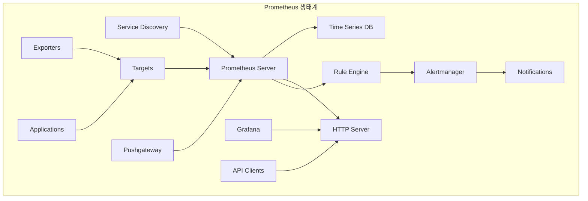
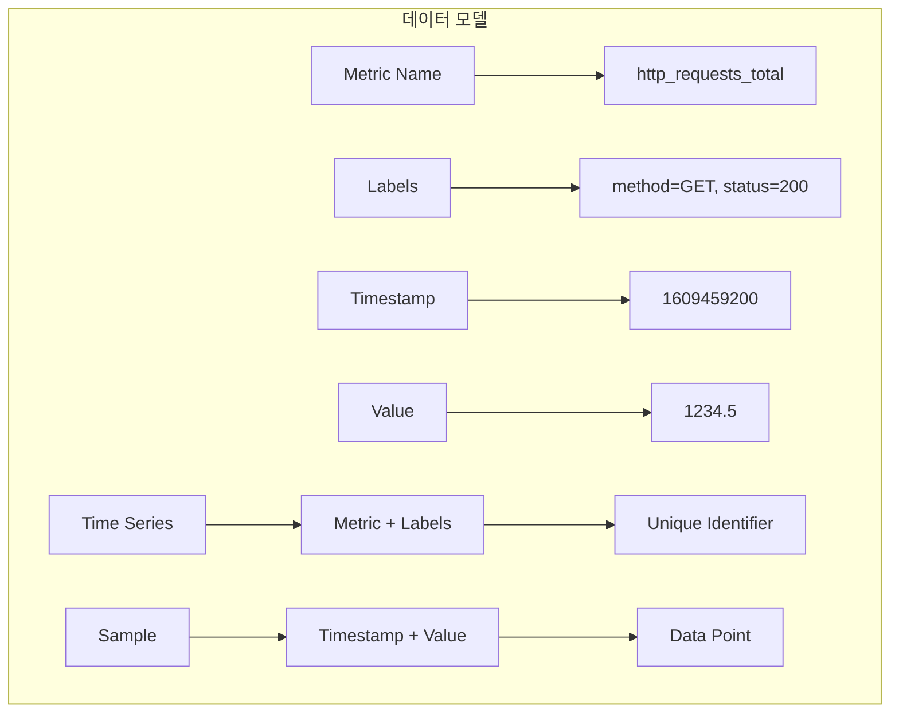
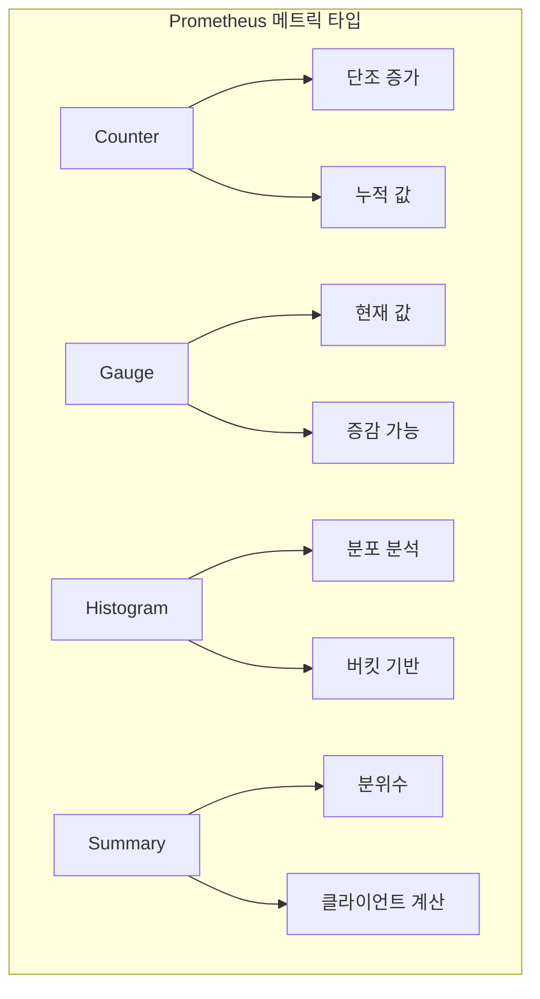
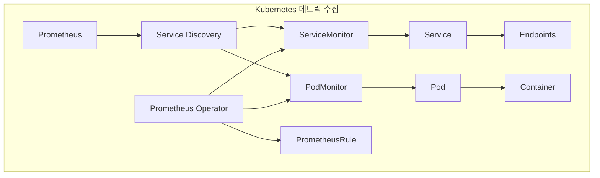

# Session 2: Prometheus 아키텍처와 메트릭 수집

## 📍 교과과정에서의 위치
이 세션은 **Week 3 > Day 3 > Session 2**로, Prometheus의 아키텍처와 메트릭 수집 전략을 학습합니다.

## 학습 목표 (5분)
- **Prometheus 아키텍처**와 **데이터 모델** 이해
- **메트릭 타입**과 **수집 전략** 학습
- **ServiceMonitor**와 **PodMonitor** 설정 방법 파악
- **PromQL** 쿼리 언어와 **알림 규칙** 작성 기법 습득

## 1. Prometheus 아키텍처와 데이터 모델 (15분)

### Prometheus 전체 아키텍처



### Prometheus 데이터 모델



### Prometheus 아키텍처 상세
```
Prometheus 아키텍처 및 구성 요소:

핵심 컴포넌트:
   🔹 Prometheus Server:
      • Time Series Database: 시계열 데이터 저장
      • HTTP Server: API 및 웹 UI 제공
      • Rule Engine: 알림 및 기록 규칙 처리
      • Service Discovery: 대상 자동 발견
      • Scraper: 메트릭 수집 엔진
   🔹 Alertmanager:
      • 알림 라우팅 및 그룹화
      • 중복 제거 및 억제
      • 다양한 알림 채널 지원
      • 알림 템플릿 관리
      • 사일런싱 기능
   🔹 Exporters:
      • Node Exporter: 시스템 메트릭
      • cAdvisor: 컨테이너 메트릭
      • Blackbox Exporter: 외부 서비스 모니터링
      • Custom Exporters: 애플리케이션별 메트릭
      • JMX Exporter: Java 애플리케이션
   🔹 Pushgateway:
      • 단기 실행 작업 메트릭 수집
      • 배치 작업 모니터링
      • 네트워크 제약 환경 지원
      • 메트릭 임시 저장
      • Pull 모델 보완
   🔹 Client Libraries:
   🔹 Go, Java, Python, .NET 지원
   🔹 커스텀 메트릭 생성
   🔹 자동 계측 기능
   🔹 성능 최적화
   🔹 표준 메트릭 제공

데이터 모델:
   🔹 메트릭 이름 (Metric Name):
      • 측정하는 대상의 일반적 기능
      • 네이밍 규칙: [namespace]_[subsystem]_[name]_[unit]
      • 예시: http_requests_total, cpu_usage_seconds
      • 소문자와 언더스코어 사용
      • 의미 있고 명확한 이름
   🔹 라벨 (Labels):
      • 메트릭의 차원 정보
      • 키-값 쌍으로 구성
      • 동적 필터링 및 그룹화
      • 카디널리티 고려 필요
      • 예시: {method="GET", status="200"}
   🔹 샘플 (Samples):
      • 타임스탬프와 값의 조합
      • 64비트 부동소수점 값
      • 밀리초 정밀도 타임스탬프
      • 시계열 데이터 포인트
      • 압축 저장 최적화
   🔹 시계열 (Time Series):
   🔹 메트릭 이름 + 라벨 조합
   🔹 고유한 식별자 역할
   🔹 독립적인 데이터 스트림
   🔹 효율적인 쿼리 지원
   🔹 자동 만료 및 정리

수집 모델:
   🔹 Pull 모델:
      • Prometheus가 대상에서 메트릭 수집
      • HTTP GET 요청으로 /metrics 엔드포인트 호출
      • 중앙집중식 제어
      • 네트워크 장애 감지 용이
      • 스케일링 및 로드 밸런싱 지원
   🔹 Service Discovery:
      • Kubernetes: Pod, Service, Endpoint 자동 발견
      • Consul: 서비스 레지스트리 통합
      • DNS: DNS-SD 기반 발견
      • File: 정적 설정 파일
      • Cloud Provider: AWS, GCP, Azure 통합
   🔹 스크래핑 설정:
      • scrape_interval: 수집 주기 (기본 15초)
      • scrape_timeout: 수집 타임아웃 (기본 10초)
      • metrics_path: 메트릭 엔드포인트 경로
      • scheme: HTTP/HTTPS 프로토콜
      • relabeling: 라벨 변환 규칙
   🔹 대상 관리:
   🔹 동적 대상 추가/제거
   🔹 헬스 체크 및 상태 관리
   🔹 메타데이터 수집
   🔹 라벨 자동 할당
   🔹 필터링 및 선택
```

## 2. 메트릭 타입과 수집 전략 (12분)

### 메트릭 타입 분류



### 메트릭 타입 상세 분석
```
Prometheus 메트릭 타입:

Counter (카운터):
   🔹 특성:
      • 단조 증가하는 누적 값
      • 재시작 시 0으로 리셋
      • 음수 값 불가
      • 속도 계산에 주로 사용
      • rate(), increase() 함수 활용
   🔹 사용 사례:
      • HTTP 요청 수: http_requests_total
      • 에러 발생 수: errors_total
      • 처리된 작업 수: jobs_processed_total
      • 네트워크 패킷 수: network_packets_total
      • 데이터베이스 쿼리 수: db_queries_total
   🔹 모범 사례:
      • _total 접미사 사용
      • 의미 있는 라벨 추가
      • 비즈니스 메트릭 포함
      • 에러 분류별 카운터
      • 사용자 행동 추적
   🔹 쿼리 예시:
   🔹 rate(http_requests_total[5m]): 5분간 평균 RPS
   🔹 increase(errors_total[1h]): 1시간 동안 증가량
   🔹 sum(rate(http_requests_total[5m])): 전체 RPS
   🔹 rate(http_requests_total[5m]) by (status): 상태별 RPS

Gauge (게이지):
   🔹 특성:
      • 현재 상태를 나타내는 값
      • 증가/감소 모두 가능
      • 스냅샷 값
      • 직접적인 값 해석
      • 임계값 알림에 적합
   🔹 사용 사례:
      • CPU 사용률: cpu_usage_percent
      • 메모리 사용량: memory_usage_bytes
      • 활성 연결 수: active_connections
      • 큐 크기: queue_size
      • 온도, 압력 등 물리적 측정값
   🔹 모범 사례:
      • 단위 명시 (bytes, percent, seconds)
      • 정규화된 값 사용 (0-1, 0-100)
      • 의미 있는 라벨링
      • 적절한 수집 주기
      • 임계값 기반 알림
   🔹 쿼리 예시:
   🔹 cpu_usage_percent > 80: CPU 사용률 80% 초과
   🔹 avg(memory_usage_bytes): 평균 메모리 사용량
   🔹 max(queue_size) by (instance): 인스턴스별 최대 큐 크기
   🔹 (memory_usage_bytes / memory_total_bytes) * 100: 메모리 사용률

Histogram (히스토그램):
   🔹 특성:
      • 관측값의 분포 측정
      • 사전 정의된 버킷 사용
      • 누적 카운터 형태
      • 분위수 계산 가능
      • 서버 측 집계
   🔹 구성 요소:
      • _bucket: 각 버킷별 카운트
      • _count: 전체 관측 수
      • _sum: 모든 관측값의 합
      • le 라벨: 버킷 상한값
      • +Inf 버킷: 모든 값 포함
   🔹 사용 사례:
      • 응답 시간 분포: http_request_duration_seconds
      • 요청 크기 분포: http_request_size_bytes
      • 처리 시간 분포: job_duration_seconds
      • 배치 크기 분포: batch_size
      • 지연 시간 분석
   🔹 버킷 설계:
      • 지수적 증가: 0.1, 0.25, 0.5, 1, 2.5, 5, 10
      • 선형 증가: 10, 20, 30, 40, 50
      • 비즈니스 요구사항 반영
      • SLA 기준점 포함
      • 충분한 해상도 확보
   🔹 쿼리 예시:
   🔹 histogram_quantile(0.95, http_request_duration_seconds_bucket): 95th percentile
   🔹 rate(http_request_duration_seconds_sum[5m]) / rate(http_request_duration_seconds_count[5m]): 평균 응답 시간
   🔹 sum(rate(http_request_duration_seconds_bucket{le="0.1"}[5m])): 100ms 이하 요청 비율
   🔹 increase(http_request_duration_seconds_count[1h]): 1시간 동안 총 요청 수

Summary (요약):
   🔹 특성:
      • 클라이언트 측 분위수 계산
      • 스트리밍 분위수 알고리즘
      • 설정 가능한 분위수
      • 시간 윈도우 기반
      • 메모리 효율적
   🔹 구성 요소:
      • _count: 관측 수
      • _sum: 관측값 합계
      • {quantile="0.5"}: 중앙값
      • {quantile="0.95"}: 95th percentile
      • {quantile="0.99"}: 99th percentile
   🔹 Histogram vs Summary:
      • Histogram: 서버 측 집계, 유연한 분위수
      • Summary: 클라이언트 측 계산, 정확한 분위수
      • Histogram: 집계 가능, 버킷 설계 필요
      • Summary: 집계 불가, 설정 간단
      • 일반적으로 Histogram 권장
   🔹 사용 사례:
      • 정확한 분위수가 중요한 경우
      • 클라이언트 리소스가 충분한 경우
      • 네트워크 대역폭이 제한적인 경우
      • 실시간 분위수 계산
      • 레거시 시스템 통합
   🔹 쿼리 예시:
   🔹 http_request_duration_seconds{quantile="0.95"}: 95th percentile
   🔹 rate(http_request_duration_seconds_sum[5m]) / rate(http_request_duration_seconds_count[5m]): 평균값
   🔹 sum(rate(http_request_duration_seconds_count[5m])): 총 요청률
   🔹 http_request_duration_seconds{quantile="0.99"} - http_request_duration_seconds{quantile="0.95"}: 분위수 차이

메트릭 수집 전략:
   🔹 수집 주기 최적화:
      • 기본 15초, 필요에 따라 조정
      • 빠른 변화: 5-10초
      • 느린 변화: 30-60초
      • 배치 작업: 작업 주기에 맞춤
      • 네트워크 및 저장소 고려
   🔹 라벨 전략:
      • 카디널리티 관리 (< 10만 시계열)
      • 의미 있는 차원만 포함
      • 동적 라벨 최소화
      • 표준화된 라벨 이름
      • 계층적 라벨 구조
   🔹 메트릭 네이밍:
      • 일관된 네이밍 규칙
      • 단위 명시 (seconds, bytes, ratio)
      • 네임스페이스 사용
      • 동사보다 명사 사용
      • 약어 최소화
   🔹 성능 최적화:
   🔹 불필요한 메트릭 제거
   🔹 집계 규칙 활용
   🔹 보존 정책 설정
   🔹 압축 최적화
   🔹 샤딩 고려
```

## 3. ServiceMonitor와 PodMonitor 설정 (10분)

### Kubernetes 메트릭 수집 아키텍처



### ServiceMonitor/PodMonitor 구성
```
ServiceMonitor와 PodMonitor 설정:

ServiceMonitor:
   🔹 개념 및 용도:
      • Kubernetes Service 기반 메트릭 수집
      • Prometheus Operator CRD
      • 서비스 디스커버리 자동화
      • 라벨 기반 대상 선택
      • 동적 구성 관리
   🔹 기본 구조:
      • selector: 대상 서비스 선택
      • endpoints: 메트릭 엔드포인트 정의
      • namespaceSelector: 네임스페이스 범위
      • jobLabel: 작업 라벨 설정
      • targetLabels: 추가 라벨 설정
   🔹 설정 예시:
│   ```yaml
│   apiVersion: monitoring.coreos.com/v1
│   kind: ServiceMonitor
│   metadata:
│     name: app-monitor
│     namespace: monitoring
│   spec:
│     selector:
│       matchLabels:
│         app: my-app
│     endpoints:
│     - port: metrics
│       interval: 30s
│       path: /metrics
│       scheme: http
│   ```
   🔹 고급 설정:
      • relabelings: 라벨 변환 규칙
      • metricRelabelings: 메트릭 라벨 변환
      • tlsConfig: TLS 설정
      • basicAuth: 기본 인증
      • bearerTokenSecret: 토큰 인증
   🔹 모범 사례:
   🔹 명확한 라벨 선택자
   🔹 적절한 수집 주기
   🔹 네임스페이스 격리
   🔹 보안 설정 적용
   🔹 문서화 및 주석

PodMonitor:
   🔹 개념 및 용도:
      • Pod 직접 메트릭 수집
      • Service 없이 Pod 모니터링
      • 사이드카 컨테이너 모니터링
      • 임시 Pod 모니터링
      • 세밀한 제어 가능
   🔹 ServiceMonitor vs PodMonitor:
      • ServiceMonitor: 안정적인 서비스 모니터링
      • PodMonitor: 동적 Pod 모니터링
      • ServiceMonitor: 로드 밸런싱 고려
      • PodMonitor: 개별 Pod 추적
      • 상황에 따른 선택
   🔹 설정 예시:
│   ```yaml
│   apiVersion: monitoring.coreos.com/v1
│   kind: PodMonitor
│   metadata:
│     name: pod-monitor
│     namespace: monitoring
│   spec:
│     selector:
│       matchLabels:
│         app: my-app
│     podMetricsEndpoints:
│     - port: metrics
│       interval: 15s
│       path: /metrics
│   ```
   🔹 특별한 사용 사례:
      • 사이드카 메트릭 수집
      • 배치 작업 모니터링
      • 개발 환경 디버깅
      • 임시 실험 모니터링
      • 레거시 애플리케이션
   🔹 주의사항:
   🔹 Pod 재시작 시 메트릭 손실
   🔹 네트워크 정책 고려
   🔹 리소스 사용량 모니터링
   🔹 카디널리티 관리
   🔹 보안 정책 준수

Prometheus Operator 통합:
   🔹 CRD 기반 관리:
      • Prometheus: Prometheus 인스턴스 정의
      • ServiceMonitor: 서비스 기반 수집
      • PodMonitor: Pod 기반 수집
      • PrometheusRule: 알림 및 기록 규칙
      • Alertmanager: 알림 관리자 설정
   🔹 자동 구성 관리:
      • 동적 설정 업데이트
      • 서비스 디스커버리 자동화
      • 라벨 기반 필터링
      • 네임스페이스 격리
      • RBAC 통합
   🔹 라벨 선택자:
      • serviceMonitorSelector: ServiceMonitor 선택
      • podMonitorSelector: PodMonitor 선택
      • ruleSelector: PrometheusRule 선택
      • 네임스페이스 기반 선택
      • 라벨 매칭 규칙
   🔹 운영 고려사항:
   🔹 리소스 할당 및 제한
   🔹 저장소 구성 및 보존
   🔹 네트워크 정책 설정
   🔹 보안 및 인증 설정
   🔹 백업 및 복구 계획

실제 구현 패턴:
   🔹 애플리케이션 메트릭:
      • /metrics 엔드포인트 노출
      • Prometheus 클라이언트 라이브러리 사용
      • 커스텀 메트릭 정의
      • 헬스 체크 통합
      • 성능 영향 최소화
   🔹 인프라 메트릭:
      • Node Exporter: 시스템 메트릭
      • cAdvisor: 컨테이너 메트릭
      • kube-state-metrics: Kubernetes 상태
      • 클러스터 컴포넌트 메트릭
      • 네트워크 및 스토리지 메트릭
   🔹 서드파티 통합:
      • 데이터베이스 Exporter
      • 메시지 큐 Exporter
      • 웹 서버 Exporter
      • 클라우드 서비스 통합
      • 커스텀 Exporter 개발
   🔹 모니터링 전략:
   🔹 계층별 메트릭 수집
   🔹 중요도 기반 우선순위
   🔹 비용 대비 효과 고려
   🔹 확장성 및 유지보수성
   🔹 팀별 책임 분담
```

## 💬 그룹 토론: 메트릭 수집 전략 설계 (8분)

### 토론 주제
**"마이크로서비스 환경에서 효과적인 메트릭 수집 전략을 설계할 때 고려해야 할 핵심 요소는 무엇인가?"**

### 토론 가이드라인

#### 메트릭 선택 기준 (3분)
- 비즈니스 가치: 비즈니스 목표와 직결되는 메트릭
- 기술적 중요도: 시스템 안정성과 성능에 중요한 메트릭
- 운영 효율성: 문제 해결과 최적화에 도움되는 메트릭

#### 수집 최적화 (3분)
- 카디널리티 관리: 라벨 수와 값의 조합 최적화
- 수집 주기: 메트릭 특성에 따른 적절한 주기 설정
- 저장소 효율성: 데이터 압축과 보존 정책

#### 조직적 고려사항 (2분)
- 팀 간 협업: 메트릭 표준화와 공유 방안
- 교육과 문화: 메트릭 기반 의사결정 문화 조성
- 도구 통합: 기존 도구와의 통합 전략

## 💡 핵심 개념 정리
- Prometheus 아키텍처: Pull 모델, 시계열 DB, 서비스 디스커버리
- 메트릭 타입: Counter(누적), Gauge(현재값), Histogram(분포), Summary(분위수)
- Kubernetes 통합: ServiceMonitor, PodMonitor를 통한 자동 수집
- 수집 전략: 카디널리티 관리, 적절한 라벨링, 성능 최적화

## 📚 참고 자료
- [Prometheus Documentation](https://prometheus.io/docs/)
- [Prometheus Operator](https://prometheus-operator.dev/)
- [Prometheus Best Practices](https://prometheus.io/docs/practices/)
- [Kubernetes Monitoring](https://kubernetes.io/docs/tasks/debug-application-cluster/resource-usage-monitoring/)

## 다음 세션 준비
다음 세션에서는 **Grafana 대시보드와 시각화 전략**에 대해 학습합니다. Grafana를 활용한 효과적인 데이터 시각화와 대시보드 설계 원칙을 다룰 예정입니다.