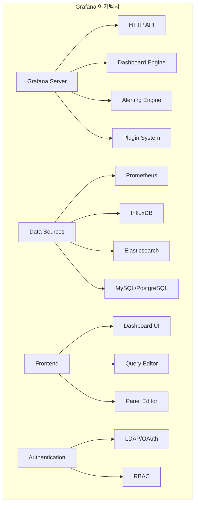
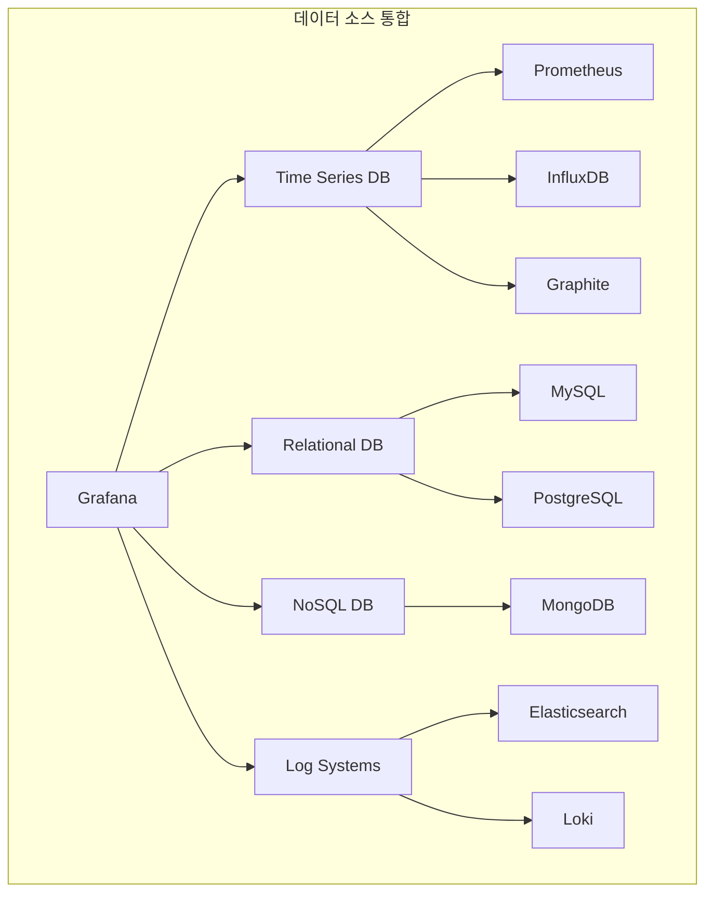
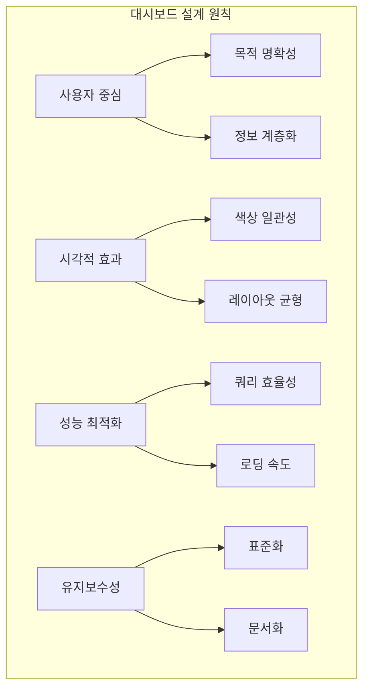
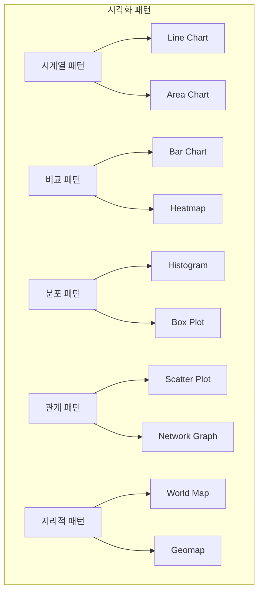
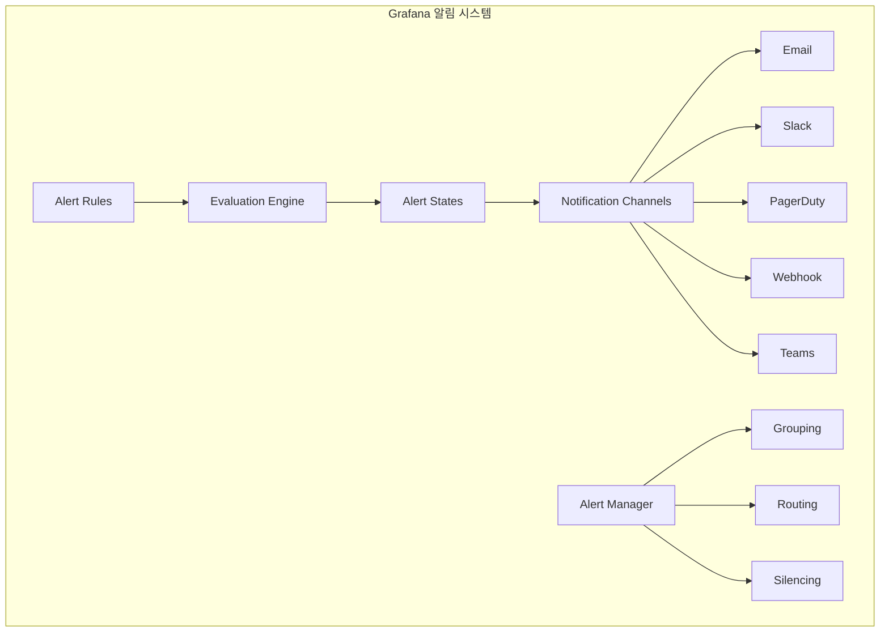

# Session 3: Grafana 대시보드와 시각화 전략

## 📍 교과과정에서의 위치
이 세션은 **Week 3 > Day 3 > Session 3**으로, Grafana를 활용한 효과적인 데이터 시각화와 대시보드 설계를 학습합니다.

## 학습 목표 (5분)
- **Grafana 아키텍처**와 **데이터 소스** 연동 방법 이해
- **대시보드 설계 원칙**과 **시각화 패턴** 학습
- **알림 채널**과 **알림 관리** 전략 파악
- **대시보드 자동화**와 **프로비저닝** 기법 습득

## 1. Grafana 아키텍처와 데이터 소스 연동 (15분)

### Grafana 전체 아키텍처



### 데이터 소스 통합 패턴



### Grafana 아키텍처 상세
```
Grafana 아키텍처 및 구성:

핵심 컴포넌트:
   🔹 Grafana Server:
      • HTTP API 서버
      • 웹 UI 제공
      • 사용자 인증 및 권한 관리
      • 대시보드 관리
      • 플러그인 시스템
   🔹 데이터 소스 관리:
      • 다양한 데이터베이스 지원
      • 쿼리 엔진 통합
      • 데이터 변환 및 처리
      • 캐싱 및 성능 최적화
      • 보안 연결 관리
   🔹 대시보드 엔진:
      • 패널 렌더링
      • 쿼리 실행 및 결과 처리
      • 시각화 라이브러리
      • 인터랙티브 기능
      • 반응형 레이아웃
   🔹 알림 시스템:
      • 알림 규칙 평가
      • 다양한 알림 채널
      • 알림 라우팅
      • 사일런싱 및 억제
      • 알림 히스토리
   🔹 플러그인 시스템:
   🔹 데이터 소스 플러그인
   🔹 패널 플러그인
   🔹 앱 플러그인
   🔹 커스텀 플러그인 개발
   🔹 플러그인 마켓플레이스

데이터 소스 연동:
   🔹 Time Series 데이터베이스:
      • Prometheus: 메트릭 데이터
      • InfluxDB: 시계열 데이터
      • Graphite: 메트릭 집계
      • OpenTSDB: 대용량 시계열
      • TimescaleDB: PostgreSQL 확장
   🔹 관계형 데이터베이스:
      • MySQL: 애플리케이션 데이터
      • PostgreSQL: 고급 쿼리 지원
      • Microsoft SQL Server: 엔터프라이즈 환경
      • Oracle: 대기업 환경
      • SQLite: 경량 데이터베이스
   🔹 NoSQL 데이터베이스:
      • MongoDB: 문서 데이터베이스
      • Cassandra: 분산 데이터베이스
      • Redis: 인메모리 데이터
      • DynamoDB: AWS 관리형 서비스
      • Cosmos DB: Azure 서비스
   🔹 로그 및 검색 시스템:
      • Elasticsearch: 로그 검색 및 분석
      • Loki: Grafana 로그 시스템
      • Splunk: 엔터프라이즈 로그 분석
      • Fluentd: 로그 수집 및 전송
      • Jaeger: 분산 추적 시스템
   🔹 클라우드 서비스:
   🔹 AWS CloudWatch: AWS 모니터링
   🔹 Google Cloud Monitoring: GCP 메트릭
   🔹 Azure Monitor: Azure 모니터링
   🔹 Datadog: SaaS 모니터링
   🔹 New Relic: APM 서비스

쿼리 및 데이터 처리:
   🔹 쿼리 언어 지원:
      • PromQL: Prometheus 쿼리
      • SQL: 관계형 데이터베이스
      • Flux: InfluxDB 2.0 쿼리
      • KQL: Kusto 쿼리 언어
      • 커스텀 쿼리 언어
   🔹 데이터 변환:
      • 시계열 데이터 정규화
      • 집계 및 그룹화
      • 필터링 및 정렬
      • 수학적 연산
      • 조인 및 병합
   🔹 캐싱 전략:
      • 쿼리 결과 캐싱
      • 대시보드 캐싱
      • 이미지 캐싱
      • TTL 기반 만료
      • 메모리 관리
   🔹 성능 최적화:
   🔹 쿼리 최적화
   🔹 인덱스 활용
   🔹 병렬 처리
   🔹 데이터 샘플링
   🔹 지연 로딩

인증 및 권한 관리:
   🔹 인증 방법:
      • 내장 사용자 관리
      • LDAP/Active Directory
      • OAuth 2.0 (Google, GitHub, etc.)
      • SAML 2.0
      • JWT 토큰 기반
   🔹 권한 관리 (RBAC):
      • 조직 (Organization) 단위
      • 팀 (Team) 기반 권한
      • 폴더 수준 권한
      • 대시보드 수준 권한
      • 데이터 소스 권한
   🔹 역할 정의:
      • Viewer: 읽기 전용
      • Editor: 편집 권한
      • Admin: 관리자 권한
      • 커스텀 역할 정의
      • 세밀한 권한 제어
   🔹 보안 기능:
   🔹 세션 관리
   🔹 CSRF 보호
   🔹 콘텐츠 보안 정책
   🔹 감사 로깅
   🔹 암호화 통신
```

## 2. 대시보드 설계 원칙과 시각화 패턴 (12분)

### 대시보드 설계 원칙



### 시각화 패턴 분류



### 대시보드 설계 및 시각화 전략
```
대시보드 설계 원칙:

사용자 경험 중심 설계:
   🔹 목적 기반 설계:
      • 명확한 사용 목적 정의
      • 대상 사용자 식별
      • 핵심 질문 도출
      • 의사결정 지원 정보
      • 액션 가능한 인사이트
   🔹 정보 계층화:
      • 가장 중요한 정보 상단 배치
      • 개요 → 상세 정보 순서
      • 논리적 그룹화
      • 시각적 가중치 적용
      • 스크롤 최소화
   🔹 인지 부하 최소화:
      • 한 화면에 7±2개 요소
      • 일관된 색상 체계
      • 명확한 라벨링
      • 불필요한 장식 제거
      • 직관적인 네비게이션
   🔹 반응형 설계:
   🔹 다양한 화면 크기 지원
   🔹 모바일 친화적 레이아웃
   🔹 적응형 패널 크기
   🔹 터치 인터페이스 고려
   🔹 접근성 준수

시각화 패턴 선택:
   🔹 시계열 데이터:
      • Line Chart: 트렌드 분석
      • Area Chart: 누적 데이터
      • Candlestick: 금융 데이터
      • Time Series: 다중 메트릭
      • Stat Panel: 현재 값 강조
   🔹 비교 분석:
      • Bar Chart: 카테고리 비교
      • Horizontal Bar: 긴 라벨
      • Pie Chart: 구성 비율 (제한적 사용)
      • Gauge: 목표 대비 현재 값
      • Table: 정확한 수치 비교
   🔹 분포 및 상관관계:
      • Histogram: 데이터 분포
      • Heatmap: 2차원 상관관계
      • Scatter Plot: 변수 간 관계
      • Box Plot: 통계적 분포
      • Violin Plot: 분포 형태
   🔹 지리적 데이터:
      • World Map: 글로벌 데이터
      • Geomap: 지역별 분석
      • Node Graph: 네트워크 토폴로지
      • Sankey: 플로우 분석
      • Treemap: 계층적 데이터
   🔹 상태 및 알림:
   🔹 Status Panel: 시스템 상태
   🔹 Alert List: 활성 알림
   🔹 News Panel: 공지사항
   🔹 Text Panel: 설명 및 문서
   🔹 Plugin Panels: 커스텀 시각화

색상 및 디자인 전략:
   🔹 색상 체계:
      • 브랜드 색상 활용
      • 색맹 친화적 팔레트
      • 의미 있는 색상 매핑
      • 일관된 색상 규칙
      • 대비 및 가독성 고려
   🔹 타이포그래피:
      • 읽기 쉬운 폰트 선택
      • 적절한 폰트 크기
      • 계층적 텍스트 스타일
      • 충분한 여백 확보
      • 다국어 지원 고려
   🔹 레이아웃 원칙:
      • 그리드 시스템 활용
      • 시각적 균형 유지
      • 여백의 효과적 활용
      • 일관된 패널 크기
      • 논리적 배치 순서
   🔹 인터랙션 설계:
   🔹 직관적인 드릴다운
   🔹 유용한 툴팁 정보
   🔹 효과적인 필터링
   🔹 시간 범위 선택
   🔹 데이터 내보내기

성능 최적화:
   🔹 쿼리 최적화:
      • 효율적인 쿼리 작성
      • 적절한 시간 범위
      • 필요한 데이터만 조회
      • 집계 함수 활용
      • 인덱스 활용
   🔹 캐싱 전략:
      • 쿼리 결과 캐싱
      • 적절한 새로고침 주기
      • 브라우저 캐싱 활용
      • CDN 활용
      • 이미지 최적화
   🔹 렌더링 최적화:
      • 가상화 기법 활용
      • 지연 로딩 구현
      • 패널 수 제한
      • 복잡한 시각화 최소화
      • 모바일 최적화
   🔹 모니터링:
   🔹 대시보드 로딩 시간 측정
   🔹 쿼리 성능 모니터링
   🔹 사용자 경험 추적
   🔹 오류 및 예외 처리
   🔹 성능 개선 지표

대시보드 유형별 패턴:
   🔹 운영 대시보드:
      • 실시간 상태 모니터링
      • 핵심 지표 중심
      • 알림 및 이상 상황 강조
      • 빠른 문제 식별
      • 액션 가능한 정보
   🔹 분석 대시보드:
      • 트렌드 및 패턴 분석
      • 비교 분석 기능
      • 드릴다운 기능
      • 다양한 시각화 활용
      • 인사이트 도출 지원
   🔹 경영진 대시보드:
      • 고수준 KPI 중심
      • 비즈니스 메트릭 강조
      • 간결하고 명확한 표현
      • 트렌드 및 목표 대비 현황
      • 전략적 의사결정 지원
   🔹 개발자 대시보드:
   🔹 기술적 메트릭 중심
   🔹 상세한 성능 정보
   🔹 디버깅 정보 포함
   🔹 코드 및 배포 관련 지표
   🔹 개발 프로세스 최적화
```

## 3. 알림 채널과 알림 관리 전략 (10분)

### 알림 시스템 아키텍처



### 알림 관리 전략
```
Grafana 알림 시스템:

알림 규칙 설계:
   🔹 알림 조건 정의:
      • 임계값 기반 알림
      • 변화율 기반 알림
      • 패턴 기반 알림
      • 복합 조건 알림
      • 시간 기반 조건
   🔹 알림 상태 관리:
      • OK: 정상 상태
      • Pending: 조건 확인 중
      • Alerting: 알림 발생
      • No Data: 데이터 없음
      • Error: 평가 오류
   🔹 평가 주기 설정:
      • 적절한 평가 간격
      • 데이터 지연 고려
      • 리소스 사용량 최적화
      • 실시간성 요구사항
      • 비용 효율성
   🔹 알림 메시지 구성:
   🔹 명확한 문제 설명
   🔹 영향도 및 심각도
   🔹 해결 방법 가이드
   🔹 관련 대시보드 링크
   🔹 담당자 정보

알림 채널 구성:
   🔹 이메일 알림:
      • SMTP 서버 설정
      • 수신자 그룹 관리
      • 이메일 템플릿 커스터마이징
      • 첨부 파일 및 이미지
      • 스팸 필터 고려
   🔹 Slack 통합:
      • Webhook URL 설정
      • 채널별 라우팅
      • 멘션 및 알림 설정
      • 메시지 포맷팅
      • 봇 권한 관리
   🔹 PagerDuty 연동:
      • 서비스 키 설정
      • 에스컬레이션 정책
      • 온콜 스케줄 연동
      • 인시던트 관리
      • 자동 해결 설정
   🔹 Microsoft Teams:
      • Webhook 커넥터 설정
      • 카드 형태 메시지
      • 액션 버튼 추가
      • 팀별 채널 분리
      • 알림 빈도 조절
   🔹 커스텀 Webhook:
   🔹 HTTP POST 요청
   🔹 JSON 페이로드 구성
   🔹 인증 및 보안 설정
   🔹 재시도 메커니즘
   🔹 외부 시스템 통합

알림 최적화 전략:
   🔹 알림 피로도 방지:
      • 적절한 임계값 설정
      • 알림 빈도 제한
      • 그룹화 및 집계
      • 사일런싱 기능 활용
      • 중요도 기반 필터링
   🔹 스마트 알림:
      • 머신러닝 기반 이상 탐지
      • 동적 임계값 조정
      • 컨텍스트 인식 알림
      • 예측적 알림
      • 자동 해결 기능
   🔹 알림 라우팅:
      • 심각도별 라우팅
      • 시간대별 라우팅
      • 팀별 책임 영역
      • 에스컬레이션 규칙
      • 백업 연락처
   🔹 성능 모니터링:
   🔹 알림 전송 성공률
   🔹 알림 지연 시간
   🔹 거짓 양성 비율
   🔹 알림 대응 시간
   🔹 시스템 리소스 사용량
```

## 💬 그룹 토론: 효과적인 대시보드 설계 전략 (8분)

### 토론 주제
**"다양한 이해관계자(개발자, 운영자, 경영진)를 위한 대시보드를 설계할 때 어떻게 각각의 요구사항을 만족시킬 수 있는가?"**

### 토론 가이드라인

#### 사용자별 요구사항 (3분)
- 개발자: 기술적 세부사항, 성능 메트릭, 디버깅 정보
- 운영자: 시스템 상태, 알림, 문제 해결 정보
- 경영진: 비즈니스 KPI, 고수준 트렌드, ROI 지표

#### 설계 접근법 (3분)
- 단일 대시보드: 모든 정보를 하나에 통합하는 방식
- 계층적 대시보드: 개요에서 상세로 드릴다운하는 방식
- 역할별 대시보드: 사용자 그룹별로 별도 대시보드 제공

#### 유지보수 고려사항 (2분)
- 표준화: 공통 컴포넌트와 템플릿 활용
- 자동화: 대시보드 프로비저닝과 업데이트 자동화
- 거버넌스: 대시보드 품질 관리와 승인 프로세스

## 💡 핵심 개념 정리
- Grafana 아키텍처: 다양한 데이터 소스 통합, 플러그인 시스템
- 시각화 패턴: 데이터 특성에 맞는 차트 타입 선택
- 설계 원칙: 사용자 중심, 정보 계층화, 성능 최적화
- 알림 관리: 스마트 알림, 피로도 방지, 효과적인 라우팅

## 📚 참고 자료
- [Grafana Documentation](https://grafana.com/docs/)
- [Dashboard Design Best Practices](https://grafana.com/docs/grafana/latest/best-practices/)
- [Grafana Alerting](https://grafana.com/docs/grafana/latest/alerting/)
- [Data Visualization Best Practices](https://www.tableau.com/learn/articles/data-visualization)

## 다음 세션 준비
다음 세션에서는 **로깅 아키텍처와 ELK 스택**에 대해 학습합니다. 중앙집중식 로깅 시스템 구축과 로그 분석 전략을 다룰 예정입니다.