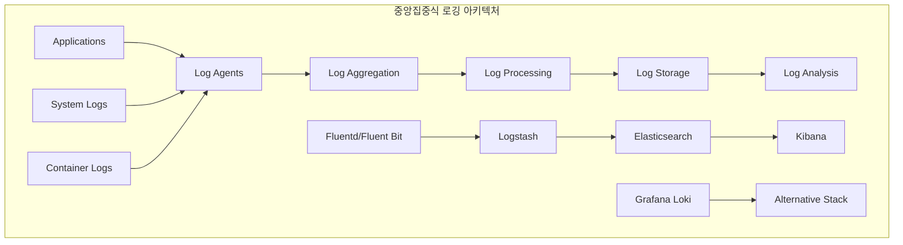
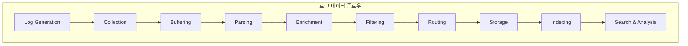
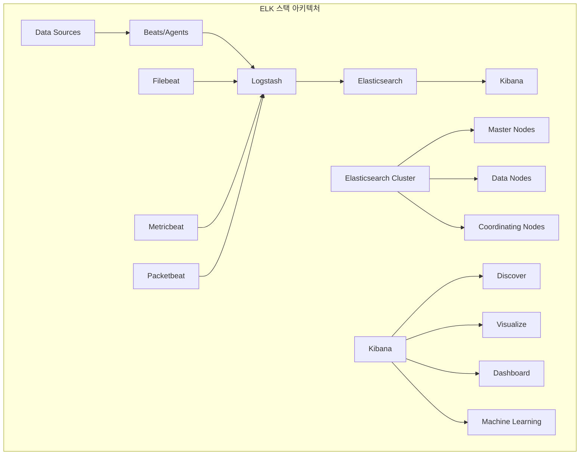
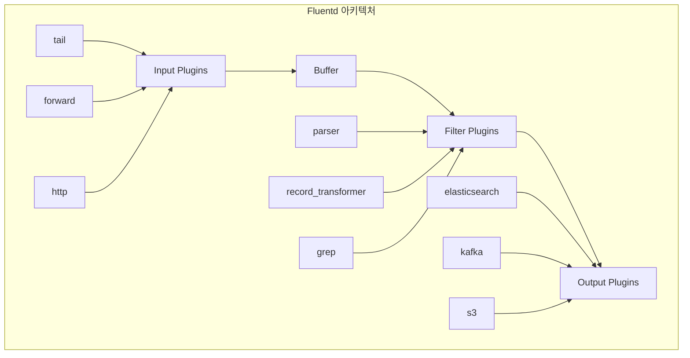
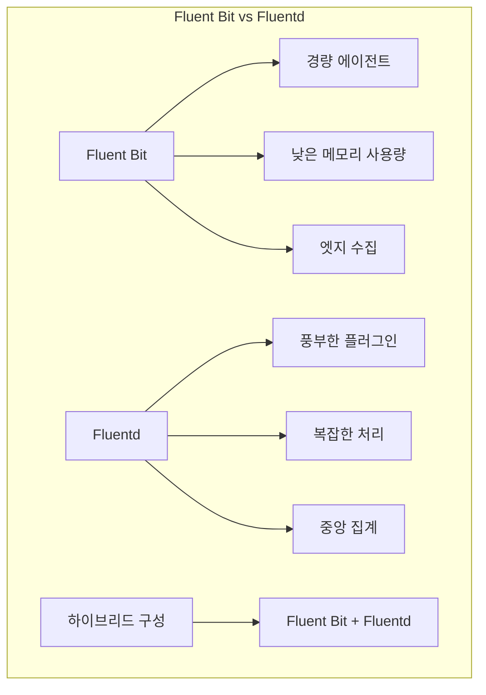

# Session 4: 로깅 아키텍처와 ELK 스택

## 📍 교과과정에서의 위치
이 세션은 **Week 3 > Day 3 > Session 4**로, 중앙집중식 로깅 아키텍처와 ELK 스택을 활용한 로그 관리를 학습합니다.

## 학습 목표 (5분)
- **중앙집중식 로깅** 아키텍처와 **설계 원칙** 이해
- **Elasticsearch, Logstash, Kibana** 구성과 **역할** 학습
- **Fluentd/Fluent Bit** 로그 수집 전략과 **구성** 방법 파악
- **로그 파싱, 필터링, 인덱싱** 최적화 기법 습득

## 1. 중앙집중식 로깅 아키텍처 (15분)

### 로깅 아키텍처 개요



### 로깅 데이터 플로우



### 중앙집중식 로깅 설계 원칙
```
중앙집중식 로깅 아키텍처:

설계 원칙:
├── 확장성 (Scalability):
│   ├── 수평적 확장 지원
│   ├── 로드 밸런싱 및 샤딩
│   ├── 자동 스케일링
│   ├── 처리량 기반 확장
│   └── 스토리지 확장성
├── 신뢰성 (Reliability):
│   ├── 고가용성 구성
│   ├── 데이터 복제 및 백업
│   ├── 장애 허용성
│   ├── 자동 복구 메커니즘
│   └── 데이터 무결성 보장
├── 성능 (Performance):
│   ├── 낮은 지연 시간
│   ├── 높은 처리량
│   ├── 효율적인 인덱싱
│   ├── 빠른 검색 성능
│   └── 리소스 최적화
├── 보안 (Security):
│   ├── 전송 중 암호화
│   ├── 저장 시 암호화
│   ├── 접근 제어 및 인증
│   ├── 감사 로깅
│   └── 데이터 마스킹
└── 운영성 (Operability):
    ├── 모니터링 및 알림
    ├── 자동화된 운영
    ├── 문제 해결 도구
    ├── 용량 계획
    └── 비용 최적화

아키텍처 구성 요소:
├── 로그 생성 (Log Generation):
│   ├── 애플리케이션 로그
│   ├── 시스템 로그
│   ├── 보안 로그
│   ├── 액세스 로그
│   └── 감사 로그
├── 로그 수집 (Log Collection):
│   ├── 에이전트 기반 수집
│   ├── 에이전트리스 수집
│   ├── 사이드카 패턴
│   ├── 로그 포워딩
│   └── API 기반 수집
├── 로그 전송 (Log Transport):
│   ├── 신뢰성 있는 전송
│   ├── 압축 및 배치 처리
│   ├── 백프레셔 처리
│   ├── 재시도 메커니즘
│   └── 로드 밸런싱
├── 로그 처리 (Log Processing):
│   ├── 파싱 및 구조화
│   ├── 필터링 및 변환
│   ├── 데이터 보강
│   ├── 정규화
│   └── 라우팅
├── 로그 저장 (Log Storage):
│   ├── 시계열 데이터베이스
│   ├── 검색 엔진
│   ├── 객체 스토리지
│   ├── 데이터 웨어하우스
│   └── 아카이브 스토리지
└── 로그 분석 (Log Analysis):
    ├── 실시간 검색
    ├── 대시보드 및 시각화
    ├── 알림 및 모니터링
    ├── 머신러닝 분석
    └── 보고서 생성

로깅 패턴:
├── 구조화된 로깅:
│   ├── JSON 형식 로그
│   ├── 표준화된 필드
│   ├── 스키마 정의
│   ├── 타입 안전성
│   └── 파싱 효율성
├── 컨텍스트 로깅:
│   ├── 요청 ID 추적
│   ├── 사용자 세션 정보
│   ├── 트랜잭션 컨텍스트
│   ├── 서비스 메타데이터
│   └── 환경 정보
├── 로그 레벨 관리:
│   ├── ERROR: 오류 상황
│   ├── WARN: 경고 상황
│   ├── INFO: 일반 정보
│   ├── DEBUG: 디버깅 정보
│   └── TRACE: 상세 추적 정보
├── 로그 샘플링:
│   ├── 확률적 샘플링
│   ├── 적응적 샘플링
│   ├── 중요도 기반 샘플링
│   ├── 오류 기반 샘플링
│   └── 비용 최적화
└── 로그 보존 정책:
    ├── 핫 데이터: 빠른 접근
    ├── 웜 데이터: 중간 접근
    ├── 콜드 데이터: 아카이브
    ├── 자동 삭제 정책
    └── 규정 준수 요구사항

Kubernetes 로깅 패턴:
├── 노드 레벨 로깅:
│   ├── kubelet 로그
│   ├── 컨테이너 런타임 로그
│   ├── 시스템 서비스 로그
│   ├── 커널 로그
│   └── 네트워크 로그
├── 클러스터 레벨 로깅:
│   ├── API 서버 로그
│   ├── 컨트롤러 매니저 로그
│   ├── 스케줄러 로그
│   ├── etcd 로그
│   └── 네트워크 플러그인 로그
├── 애플리케이션 로깅:
│   ├── stdout/stderr 로그
│   ├── 파일 기반 로그
│   ├── 사이드카 로그 수집
│   ├── 로그 볼륨 마운트
│   └── 로그 드라이버 설정
└── 로그 수집 전략:
    ├── DaemonSet 기반 수집
    ├── 사이드카 컨테이너
    ├── 로그 포워더
    ├── 중앙집중식 수집
    └── 하이브리드 접근
```

## 2. Elasticsearch, Logstash, Kibana 구성 (12분)

### ELK 스택 아키텍처



### ELK 스택 구성 요소
```
ELK 스택 구성 및 관리:

Elasticsearch:
├── 핵심 기능:
│   ├── 분산 검색 엔진
│   ├── 실시간 분석 엔진
│   ├── RESTful API 제공
│   ├── 스키마리스 JSON 문서
│   └── 수평적 확장 지원
├── 클러스터 구성:
│   ├── Master Node: 클러스터 관리
│   ├── Data Node: 데이터 저장 및 검색
│   ├── Coordinating Node: 요청 라우팅
│   ├── Ingest Node: 데이터 전처리
│   └── Machine Learning Node: ML 작업
├── 인덱스 관리:
│   ├── 인덱스 템플릿 설정
│   ├── 매핑 정의
│   ├── 샤드 및 복제본 설정
│   ├── 인덱스 라이프사이클 관리
│   └── 롤오버 정책
├── 성능 최적화:
│   ├── 샤드 크기 최적화
│   ├── 복제본 수 조정
│   ├── 리프레시 간격 설정
│   ├── 메모리 및 디스크 최적화
│   └── 쿼리 성능 튜닝
└── 보안 설정:
    ├── 인증 및 권한 부여
    ├── TLS/SSL 암호화
    ├── 역할 기반 접근 제어
    ├── 감사 로깅
    └── 필드 레벨 보안

Logstash:
├── 데이터 처리 파이프라인:
│   ├── Input: 데이터 수집
│   ├── Filter: 데이터 변환
│   ├── Output: 데이터 전송
│   ├── Codec: 데이터 인코딩/디코딩
│   └── 플러그인 아키텍처
├── 입력 플러그인:
│   ├── Beats: Elastic Beats 데이터
│   ├── File: 파일 기반 입력
│   ├── Syslog: 시스템 로그
│   ├── HTTP: HTTP 요청
│   └── Kafka: 메시지 큐
├── 필터 플러그인:
│   ├── Grok: 패턴 매칭 파싱
│   ├── Mutate: 필드 변환
│   ├── Date: 날짜 파싱
│   ├── GeoIP: 지리적 정보 추가
│   └── Ruby: 커스텀 스크립트
├── 출력 플러그인:
│   ├── Elasticsearch: ES 인덱싱
│   ├── File: 파일 출력
│   ├── Kafka: 메시지 큐 전송
│   ├── Email: 이메일 알림
│   └── HTTP: HTTP POST 요청
└── 성능 및 확장성:
    ├── 파이프라인 병렬 처리
    ├── 배치 크기 최적화
    ├── 메모리 관리
    ├── 백프레셔 처리
    └── 모니터링 및 메트릭

Kibana:
├── 데이터 탐색:
│   ├── Discover: 로그 검색 및 필터링
│   ├── 실시간 데이터 탐색
│   ├── 필드 기반 필터링
│   ├── 시간 범위 선택
│   └── 저장된 검색
├── 시각화:
│   ├── 다양한 차트 타입
│   ├── 지리적 시각화
│   ├── 시계열 시각화
│   ├── 메트릭 시각화
│   └── 커스텀 시각화
├── 대시보드:
│   ├── 시각화 조합
│   ├── 인터랙티브 필터
│   ├── 드릴다운 기능
│   ├── 시간 동기화
│   └── 공유 및 임베딩
├── 고급 기능:
│   ├── Machine Learning: 이상 탐지
│   ├── Canvas: 인포그래픽 생성
│   ├── Maps: 지리적 분석
│   ├── APM: 애플리케이션 성능 모니터링
│   └── SIEM: 보안 정보 및 이벤트 관리
└── 관리 기능:
    ├── 인덱스 관리
    ├── 사용자 및 역할 관리
    ├── 공간(Space) 관리
    ├── 설정 관리
    └── 모니터링

Beats 생태계:
├── Filebeat:
│   ├── 로그 파일 수집
│   ├── 다양한 로그 형식 지원
│   ├── 멀티라인 로그 처리
│   ├── 로그 파싱 모듈
│   └── 백프레셔 처리
├── Metricbeat:
│   ├── 시스템 메트릭 수집
│   ├── 서비스 메트릭 수집
│   ├── 클라우드 메트릭 수집
│   ├── 모듈 기반 구성
│   └── 경량 에이전트
├── Packetbeat:
│   ├── 네트워크 패킷 분석
│   ├── 애플리케이션 프로토콜 분석
│   ├── 성능 메트릭 추출
│   ├── 보안 분석
│   └── 실시간 모니터링
├── Winlogbeat:
│   ├── Windows 이벤트 로그
│   ├── 보안 이벤트 수집
│   ├── 시스템 이벤트 수집
│   ├── 애플리케이션 이벤트
│   └── 커스텀 이벤트 로그
└── Heartbeat:
    ├── 업타임 모니터링
    ├── 서비스 가용성 체크
    ├── 응답 시간 측정
    ├── 다양한 프로토콜 지원
    └── 알림 통합

운영 및 관리:
├── 클러스터 관리:
│   ├── 노드 추가/제거
│   ├── 샤드 재배치
│   ├── 인덱스 최적화
│   ├── 스냅샷 및 복원
│   └── 업그레이드 관리
├── 모니터링:
│   ├── 클러스터 상태 모니터링
│   ├── 성능 메트릭 추적
│   ├── 리소스 사용량 모니터링
│   ├── 알림 설정
│   └── 로그 분석
├── 보안 관리:
│   ├── 사용자 인증 설정
│   ├── 역할 기반 접근 제어
│   ├── API 키 관리
│   ├── 감사 로그 설정
│   └── 암호화 설정
└── 백업 및 복구:
    ├── 스냅샷 정책 설정
    ├── 자동 백업 스케줄
    ├── 크로스 클러스터 복제
    ├── 재해 복구 계획
    └── 데이터 마이그레이션
```

## 3. Fluentd/Fluent Bit 로그 수집 전략 (10분)

### Fluentd 아키텍처



### Fluent Bit vs Fluentd 비교



### Fluentd/Fluent Bit 구성 전략
```
Fluentd/Fluent Bit 로그 수집 전략:

Fluentd 특성 및 활용:
├── 핵심 특징:
│   ├── 통합 로깅 레이어
│   ├── 플러그인 기반 아키텍처
│   ├── 신뢰성 있는 데이터 전송
│   ├── 유연한 라우팅
│   └── JSON 기반 처리
├── 아키텍처 구성:
│   ├── Input: 데이터 수집
│   ├── Parser: 데이터 파싱
│   ├── Filter: 데이터 변환
│   ├── Buffer: 데이터 버퍼링
│   └── Output: 데이터 전송
├── 주요 플러그인:
│   ├── Input: tail, forward, http, syslog
│   ├── Parser: regexp, json, csv, apache2
│   ├── Filter: record_transformer, grep, parser
│   ├── Output: elasticsearch, kafka, s3, file
│   └── Buffer: memory, file
├── 설정 예시:
│   ```ruby
│   <source>
│     @type tail
│     path /var/log/app/*.log
│     pos_file /var/log/fluentd/app.log.pos
│     tag app.log
│     format json
│   </source>
│   
│   <filter app.log>
│     @type record_transformer
│     <record>
│       hostname ${hostname}
│       timestamp ${time}
│     </record>
│   </filter>
│   
│   <match app.log>
│     @type elasticsearch
│     host elasticsearch.example.com
│     port 9200
│     index_name app-logs
│   </match>
│   ```
└── 고급 기능:
    ├── 라벨 기반 라우팅
    ├── 다중 워커 지원
    ├── 플러그인 개발
    ├── 메트릭 수집
    └── 모니터링 통합

Fluent Bit 특성 및 활용:
├── 핵심 특징:
│   ├── 경량 로그 프로세서
│   ├── 낮은 메모리 사용량 (< 650KB)
│   ├── 높은 성능
│   ├── 컨테이너 친화적
│   └── 클라우드 네이티브
├── 사용 사례:
│   ├── 엣지 디바이스 로그 수집
│   ├── 컨테이너 로그 수집
│   ├── IoT 디바이스 로그
│   ├── 임베디드 시스템
│   └── 리소스 제약 환경
├── Kubernetes 통합:
│   ├── DaemonSet 배포
│   ├── 컨테이너 로그 자동 수집
│   ├── Kubernetes 메타데이터 추가
│   ├── 네임스페이스 기반 라우팅
│   └── 동적 구성 관리
├── 설정 예시:
│   ```ini
│   [INPUT]
│       Name tail
│       Path /var/log/containers/*.log
│       Parser docker
│       Tag kube.*
│       Refresh_Interval 5
│   
│   [FILTER]
│       Name kubernetes
│       Match kube.*
│       Kube_URL https://kubernetes.default.svc:443
│       Merge_Log On
│   
│   [OUTPUT]
│       Name es
│       Match *
│       Host elasticsearch.logging.svc.cluster.local
│       Port 9200
│       Index fluent-bit
│   ```
└── 성능 최적화:
    ├── 메모리 버퍼 최적화
    ├── 배치 처리 설정
    ├── 압축 활용
    ├── 백프레셔 처리
    └── 리소스 제한 설정

하이브리드 아키텍처:
├── Fluent Bit + Fluentd 조합:
│   ├── Fluent Bit: 엣지 수집
│   ├── Fluentd: 중앙 집계 및 처리
│   ├── 계층적 로그 수집
│   ├── 부하 분산 및 확장성
│   └── 장애 격리
├── 배포 패턴:
│   ├── 각 노드에 Fluent Bit DaemonSet
│   ├── 중앙에 Fluentd 클러스터
│   ├── 로드 밸런서를 통한 분산
│   ├── 버퍼링 및 재시도 메커니즘
│   └── 모니터링 및 알림
├── 데이터 플로우:
│   ├── 애플리케이션 → Fluent Bit
│   ├── Fluent Bit → Fluentd
│   ├── Fluentd → Elasticsearch
│   ├── 병렬 처리 및 라우팅
│   └── 백업 및 아카이브
└── 운영 고려사항:
    ├── 버전 호환성 관리
    ├── 설정 동기화
    ├── 성능 모니터링
    ├── 장애 대응 절차
    └── 업그레이드 전략

로그 수집 최적화:
├── 성능 튜닝:
│   ├── 버퍼 크기 최적화
│   ├── 플러시 간격 조정
│   ├── 워커 수 설정
│   ├── 메모리 사용량 제한
│   └── CPU 사용량 최적화
├── 신뢰성 향상:
│   ├── 재시도 메커니즘
│   ├── 백프레셔 처리
│   ├── 데드 레터 큐
│   ├── 체크포인트 관리
│   └── 장애 복구 절차
├── 보안 강화:
│   ├── TLS 암호화 통신
│   ├── 인증 및 권한 부여
│   ├── 민감 정보 마스킹
│   ├── 감사 로깅
│   └── 네트워크 보안
└── 모니터링:
    ├── 수집 성능 메트릭
    ├── 에러율 및 재시도 횟수
    ├── 버퍼 사용률
    ├── 네트워크 사용량
    └── 리소스 사용량
```

## 💬 그룹 토론: 로깅 전략 선택 기준 (8분)

### 토론 주제
**"ELK 스택 vs Grafana Loki vs 클라우드 로깅 서비스 중에서 조직의 요구사항에 맞는 로깅 솔루션을 선택하는 기준은 무엇인가?"**

### 토론 가이드라인

#### 기술적 고려사항 (3분)
- **데이터 볼륨**: 일일 로그 생성량과 보존 기간
- **검색 성능**: 실시간 검색 vs 배치 분석 요구사항
- **통합성**: 기존 모니터링 스택과의 통합 정도

#### 운영적 고려사항 (3분)
- **관리 복잡성**: 자체 운영 vs 관리형 서비스
- **확장성**: 트래픽 증가에 따른 확장 용이성
- **비용**: 초기 구축 비용 vs 운영 비용

#### 조직적 고려사항 (2분)
- **팀 역량**: 기술 스택에 대한 팀의 전문성
- **규정 준수**: 데이터 보존 및 보안 요구사항
- **벤더 종속성**: 오픈소스 vs 상용 솔루션 선호도

## 💡 핵심 개념 정리
- **중앙집중식 로깅**: 확장성, 신뢰성, 성능, 보안을 고려한 아키텍처 설계
- **ELK 스택**: Elasticsearch(저장/검색), Logstash(처리), Kibana(시각화)
- **Fluentd/Fluent Bit**: 유연한 로그 수집과 경량 에이전트의 조합
- **최적화 전략**: 성능, 신뢰성, 보안, 비용을 균형있게 고려

## 📚 참고 자료
- [Elasticsearch Documentation](https://www.elastic.co/guide/index.html)
- [Fluentd Documentation](https://docs.fluentd.org/)
- [Fluent Bit Documentation](https://docs.fluentbit.io/)
- [Kubernetes Logging Architecture](https://kubernetes.io/docs/concepts/cluster-administration/logging/)

## 다음 세션 준비
다음 세션에서는 **분산 추적과 Jaeger 패턴**에 대해 학습합니다. 마이크로서비스 환경에서의 요청 추적과 성능 분석 방법을 다룰 예정입니다.