# Session 4: 로깅 아키텍처와 ELK 스택

## 📍 교과과정에서의 위치
이 세션은 **Week 3 > Day 3 > Session 4**로, 중앙집중식 로깅 아키텍처와 ELK 스택을 활용한 로그 관리를 학습합니다.

## 학습 목표 (5분)
- **중앙집중식 로깅** 아키텍처와 **설계 원칙** 이해
- **Elasticsearch, Logstash, Kibana** 구성과 **역할** 학습
- **Fluentd/Fluent Bit** 로그 수집 전략과 **구성** 방법 파악
- **로그 파싱, 필터링, 인덱싱** 최적화 기법 습득

## 1. 중앙집중식 로깅 아키텍처 (15분)

### 로깅 아키텍처 개요

```mermaid
graph TB
    subgraph "중앙집중식 로깅 아키텍처"
        A[Applications] --> B[Log Agents]
        C[System Logs] --> B
        D[Container Logs] --> B
        
        B --> E[Log Aggregation]
        E --> F[Log Processing]
        F --> G[Log Storage]
        G --> H[Log Analysis]
        
        I[Fluentd/Fluent Bit] --> J[Logstash]
        J --> K[Elasticsearch]
        K --> L[Kibana]
        
        M[Grafana Loki] --> N[Alternative Stack]
    end
```



### 로깅 데이터 플로우

```mermaid
graph TB
    subgraph "로그 데이터 플로우"
        A[Log Generation] --> B[Collection]
        B --> C[Buffering]
        C --> D[Parsing]
        D --> E[Enrichment]
        E --> F[Filtering]
        F --> G[Routing]
        G --> H[Storage]
        H --> I[Indexing]
        I --> J[Search & Analysis]
    end
```



### 중앙집중식 로깅 설계 원칙
```
중앙집중식 로깅 아키텍처:

설계 원칙:
   🔹 확장성 (Scalability):
      • 수평적 확장 지원
      • 로드 밸런싱 및 샤딩
      • 자동 스케일링
      • 처리량 기반 확장
      • 스토리지 확장성
   🔹 신뢰성 (Reliability):
      • 고가용성 구성
      • 데이터 복제 및 백업
      • 장애 허용성
      • 자동 복구 메커니즘
      • 데이터 무결성 보장
   🔹 성능 (Performance):
      • 낮은 지연 시간
      • 높은 처리량
      • 효율적인 인덱싱
      • 빠른 검색 성능
      • 리소스 최적화
   🔹 보안 (Security):
      • 전송 중 암호화
      • 저장 시 암호화
      • 접근 제어 및 인증
      • 감사 로깅
      • 데이터 마스킹
   🔹 운영성 (Operability):
   🔹 모니터링 및 알림
   🔹 자동화된 운영
   🔹 문제 해결 도구
   🔹 용량 계획
   🔹 비용 최적화

아키텍처 구성 요소:
   🔹 로그 생성 (Log Generation):
      • 애플리케이션 로그
      • 시스템 로그
      • 보안 로그
      • 액세스 로그
      • 감사 로그
   🔹 로그 수집 (Log Collection):
      • 에이전트 기반 수집
      • 에이전트리스 수집
      • 사이드카 패턴
      • 로그 포워딩
      • API 기반 수집
   🔹 로그 전송 (Log Transport):
      • 신뢰성 있는 전송
      • 압축 및 배치 처리
      • 백프레셔 처리
      • 재시도 메커니즘
      • 로드 밸런싱
   🔹 로그 처리 (Log Processing):
      • 파싱 및 구조화
      • 필터링 및 변환
      • 데이터 보강
      • 정규화
      • 라우팅
   🔹 로그 저장 (Log Storage):
      • 시계열 데이터베이스
      • 검색 엔진
      • 객체 스토리지
      • 데이터 웨어하우스
      • 아카이브 스토리지
   🔹 로그 분석 (Log Analysis):
   🔹 실시간 검색
   🔹 대시보드 및 시각화
   🔹 알림 및 모니터링
   🔹 머신러닝 분석
   🔹 보고서 생성

로깅 패턴:
   🔹 구조화된 로깅:
      • JSON 형식 로그
      • 표준화된 필드
      • 스키마 정의
      • 타입 안전성
      • 파싱 효율성
   🔹 컨텍스트 로깅:
      • 요청 ID 추적
      • 사용자 세션 정보
      • 트랜잭션 컨텍스트
      • 서비스 메타데이터
      • 환경 정보
   🔹 로그 레벨 관리:
      • ERROR: 오류 상황
      • WARN: 경고 상황
      • INFO: 일반 정보
      • DEBUG: 디버깅 정보
      • TRACE: 상세 추적 정보
   🔹 로그 샘플링:
      • 확률적 샘플링
      • 적응적 샘플링
      • 중요도 기반 샘플링
      • 오류 기반 샘플링
      • 비용 최적화
   🔹 로그 보존 정책:
   🔹 핫 데이터: 빠른 접근
   🔹 웜 데이터: 중간 접근
   🔹 콜드 데이터: 아카이브
   🔹 자동 삭제 정책
   🔹 규정 준수 요구사항

Kubernetes 로깅 패턴:
   🔹 노드 레벨 로깅:
      • kubelet 로그
      • 컨테이너 런타임 로그
      • 시스템 서비스 로그
      • 커널 로그
      • 네트워크 로그
   🔹 클러스터 레벨 로깅:
      • API 서버 로그
      • 컨트롤러 매니저 로그
      • 스케줄러 로그
      • etcd 로그
      • 네트워크 플러그인 로그
   🔹 애플리케이션 로깅:
      • stdout/stderr 로그
      • 파일 기반 로그
      • 사이드카 로그 수집
      • 로그 볼륨 마운트
      • 로그 드라이버 설정
   🔹 로그 수집 전략:
   🔹 DaemonSet 기반 수집
   🔹 사이드카 컨테이너
   🔹 로그 포워더
   🔹 중앙집중식 수집
   🔹 하이브리드 접근
```

## 2. Elasticsearch, Logstash, Kibana 구성 (12분)

### ELK 스택 아키텍처

```mermaid
graph TB
    subgraph "ELK 스택 아키텍처"
        A[Data Sources] --> B[Beats/Agents]
        B --> C[Logstash]
        C --> D[Elasticsearch]
        D --> E[Kibana]
        
        F[Filebeat] --> C
        G[Metricbeat] --> C
        H[Packetbeat] --> C
        
        I[Elasticsearch Cluster] --> J[Master Nodes]
        I --> K[Data Nodes]
        I --> L[Coordinating Nodes]
        
        M[Kibana] --> N[Discover]
        M --> O[Visualize]
        M --> P[Dashboard]
        M --> Q[Machine Learning]
    end
```



### ELK 스택 구성 요소
```
ELK 스택 구성 및 관리:

Elasticsearch:
   🔹 핵심 기능:
      • 분산 검색 엔진
      • 실시간 분석 엔진
      • RESTful API 제공
      • 스키마리스 JSON 문서
      • 수평적 확장 지원
   🔹 클러스터 구성:
      • Master Node: 클러스터 관리
      • Data Node: 데이터 저장 및 검색
      • Coordinating Node: 요청 라우팅
      • Ingest Node: 데이터 전처리
      • Machine Learning Node: ML 작업
   🔹 인덱스 관리:
      • 인덱스 템플릿 설정
      • 매핑 정의
      • 샤드 및 복제본 설정
      • 인덱스 라이프사이클 관리
      • 롤오버 정책
   🔹 성능 최적화:
      • 샤드 크기 최적화
      • 복제본 수 조정
      • 리프레시 간격 설정
      • 메모리 및 디스크 최적화
      • 쿼리 성능 튜닝
   🔹 보안 설정:
   🔹 인증 및 권한 부여
   🔹 TLS/SSL 암호화
   🔹 역할 기반 접근 제어
   🔹 감사 로깅
   🔹 필드 레벨 보안

Logstash:
   🔹 데이터 처리 파이프라인:
      • Input: 데이터 수집
      • Filter: 데이터 변환
      • Output: 데이터 전송
      • Codec: 데이터 인코딩/디코딩
      • 플러그인 아키텍처
   🔹 입력 플러그인:
      • Beats: Elastic Beats 데이터
      • File: 파일 기반 입력
      • Syslog: 시스템 로그
      • HTTP: HTTP 요청
      • Kafka: 메시지 큐
   🔹 필터 플러그인:
      • Grok: 패턴 매칭 파싱
      • Mutate: 필드 변환
      • Date: 날짜 파싱
      • GeoIP: 지리적 정보 추가
      • Ruby: 커스텀 스크립트
   🔹 출력 플러그인:
      • Elasticsearch: ES 인덱싱
      • File: 파일 출력
      • Kafka: 메시지 큐 전송
      • Email: 이메일 알림
      • HTTP: HTTP POST 요청
   🔹 성능 및 확장성:
   🔹 파이프라인 병렬 처리
   🔹 배치 크기 최적화
   🔹 메모리 관리
   🔹 백프레셔 처리
   🔹 모니터링 및 메트릭

Kibana:
   🔹 데이터 탐색:
      • Discover: 로그 검색 및 필터링
      • 실시간 데이터 탐색
      • 필드 기반 필터링
      • 시간 범위 선택
      • 저장된 검색
   🔹 시각화:
      • 다양한 차트 타입
      • 지리적 시각화
      • 시계열 시각화
      • 메트릭 시각화
      • 커스텀 시각화
   🔹 대시보드:
      • 시각화 조합
      • 인터랙티브 필터
      • 드릴다운 기능
      • 시간 동기화
      • 공유 및 임베딩
   🔹 고급 기능:
      • Machine Learning: 이상 탐지
      • Canvas: 인포그래픽 생성
      • Maps: 지리적 분석
      • APM: 애플리케이션 성능 모니터링
      • SIEM: 보안 정보 및 이벤트 관리
   🔹 관리 기능:
   🔹 인덱스 관리
   🔹 사용자 및 역할 관리
   🔹 공간(Space) 관리
   🔹 설정 관리
   🔹 모니터링

Beats 생태계:
   🔹 Filebeat:
      • 로그 파일 수집
      • 다양한 로그 형식 지원
      • 멀티라인 로그 처리
      • 로그 파싱 모듈
      • 백프레셔 처리
   🔹 Metricbeat:
      • 시스템 메트릭 수집
      • 서비스 메트릭 수집
      • 클라우드 메트릭 수집
      • 모듈 기반 구성
      • 경량 에이전트
   🔹 Packetbeat:
      • 네트워크 패킷 분석
      • 애플리케이션 프로토콜 분석
      • 성능 메트릭 추출
      • 보안 분석
      • 실시간 모니터링
   🔹 Winlogbeat:
      • Windows 이벤트 로그
      • 보안 이벤트 수집
      • 시스템 이벤트 수집
      • 애플리케이션 이벤트
      • 커스텀 이벤트 로그
   🔹 Heartbeat:
   🔹 업타임 모니터링
   🔹 서비스 가용성 체크
   🔹 응답 시간 측정
   🔹 다양한 프로토콜 지원
   🔹 알림 통합

운영 및 관리:
   🔹 클러스터 관리:
      • 노드 추가/제거
      • 샤드 재배치
      • 인덱스 최적화
      • 스냅샷 및 복원
      • 업그레이드 관리
   🔹 모니터링:
      • 클러스터 상태 모니터링
      • 성능 메트릭 추적
      • 리소스 사용량 모니터링
      • 알림 설정
      • 로그 분석
   🔹 보안 관리:
      • 사용자 인증 설정
      • 역할 기반 접근 제어
      • API 키 관리
      • 감사 로그 설정
      • 암호화 설정
   🔹 백업 및 복구:
   🔹 스냅샷 정책 설정
   🔹 자동 백업 스케줄
   🔹 크로스 클러스터 복제
   🔹 재해 복구 계획
   🔹 데이터 마이그레이션
```

## 3. Fluentd/Fluent Bit 로그 수집 전략 (10분)

### Fluentd 아키텍처

```mermaid
graph TB
    subgraph "Fluentd 아키텍처"
        A[Input Plugins] --> B[Buffer]
        B --> C[Filter Plugins]
        C --> D[Output Plugins]
        
        E[tail] --> A
        F[forward] --> A
        G[http] --> A
        
        H[parser] --> C
        I[record_transformer] --> C
        J[grep] --> C
        
        K[elasticsearch] --> D
        L[kafka] --> D
        M[s3] --> D
    end
```



### Fluent Bit vs Fluentd 비교

```mermaid
graph TB
    subgraph "Fluent Bit vs Fluentd"
        A[Fluent Bit] --> B[경량 에이전트]
        A --> C[낮은 메모리 사용량]
        A --> D[엣지 수집]
        
        E[Fluentd] --> F[풍부한 플러그인]
        E --> G[복잡한 처리]
        E --> H[중앙 집계]
        
        I[하이브리드 구성] --> J[Fluent Bit + Fluentd]
    end
```



### Fluentd/Fluent Bit 구성 전략
```
Fluentd/Fluent Bit 로그 수집 전략:

Fluentd 특성 및 활용:
   🔹 핵심 특징:
      • 통합 로깅 레이어
      • 플러그인 기반 아키텍처
      • 신뢰성 있는 데이터 전송
      • 유연한 라우팅
      • JSON 기반 처리
   🔹 아키텍처 구성:
      • Input: 데이터 수집
      • Parser: 데이터 파싱
      • Filter: 데이터 변환
      • Buffer: 데이터 버퍼링
      • Output: 데이터 전송
   🔹 주요 플러그인:
      • Input: tail, forward, http, syslog
      • Parser: regexp, json, csv, apache2
      • Filter: record_transformer, grep, parser
      • Output: elasticsearch, kafka, s3, file
      • Buffer: memory, file
   🔹 설정 예시:
│   ```ruby
│   <source>
│     @type tail
│     path /var/log/app/*.log
│     pos_file /var/log/fluentd/app.log.pos
│     tag app.log
│     format json
│   </source>
│   <filter app.log>
│     @type record_transformer
│     <record>
│       hostname ${hostname}
│       timestamp ${time}
│     </record>
│   </filter>
│   <match app.log>
│     @type elasticsearch
│     host elasticsearch.example.com
│     port 9200
│     index_name app-logs
│   </match>
│   ```
   🔹 고급 기능:
   🔹 라벨 기반 라우팅
   🔹 다중 워커 지원
   🔹 플러그인 개발
   🔹 메트릭 수집
   🔹 모니터링 통합

Fluent Bit 특성 및 활용:
   🔹 핵심 특징:
      • 경량 로그 프로세서
      • 낮은 메모리 사용량 (< 650KB)
      • 높은 성능
      • 컨테이너 친화적
      • 클라우드 네이티브
   🔹 사용 사례:
      • 엣지 디바이스 로그 수집
      • 컨테이너 로그 수집
      • IoT 디바이스 로그
      • 임베디드 시스템
      • 리소스 제약 환경
   🔹 Kubernetes 통합:
      • DaemonSet 배포
      • 컨테이너 로그 자동 수집
      • Kubernetes 메타데이터 추가
      • 네임스페이스 기반 라우팅
      • 동적 구성 관리
   🔹 설정 예시:
│   ```ini
│   [INPUT]
│       Name tail
│       Path /var/log/containers/*.log
│       Parser docker
│       Tag kube.*
│       Refresh_Interval 5
│   [FILTER]
│       Name kubernetes
│       Match kube.*
│       Kube_URL https://kubernetes.default.svc:443
│       Merge_Log On
│   [OUTPUT]
│       Name es
│       Match *
│       Host elasticsearch.logging.svc.cluster.local
│       Port 9200
│       Index fluent-bit
│   ```
   🔹 성능 최적화:
   🔹 메모리 버퍼 최적화
   🔹 배치 처리 설정
   🔹 압축 활용
   🔹 백프레셔 처리
   🔹 리소스 제한 설정

하이브리드 아키텍처:
   🔹 Fluent Bit + Fluentd 조합:
      • Fluent Bit: 엣지 수집
      • Fluentd: 중앙 집계 및 처리
      • 계층적 로그 수집
      • 부하 분산 및 확장성
      • 장애 격리
   🔹 배포 패턴:
      • 각 노드에 Fluent Bit DaemonSet
      • 중앙에 Fluentd 클러스터
      • 로드 밸런서를 통한 분산
      • 버퍼링 및 재시도 메커니즘
      • 모니터링 및 알림
   🔹 데이터 플로우:
      • 애플리케이션 → Fluent Bit
      • Fluent Bit → Fluentd
      • Fluentd → Elasticsearch
      • 병렬 처리 및 라우팅
      • 백업 및 아카이브
   🔹 운영 고려사항:
   🔹 버전 호환성 관리
   🔹 설정 동기화
   🔹 성능 모니터링
   🔹 장애 대응 절차
   🔹 업그레이드 전략

로그 수집 최적화:
   🔹 성능 튜닝:
      • 버퍼 크기 최적화
      • 플러시 간격 조정
      • 워커 수 설정
      • 메모리 사용량 제한
      • CPU 사용량 최적화
   🔹 신뢰성 향상:
      • 재시도 메커니즘
      • 백프레셔 처리
      • 데드 레터 큐
      • 체크포인트 관리
      • 장애 복구 절차
   🔹 보안 강화:
      • TLS 암호화 통신
      • 인증 및 권한 부여
      • 민감 정보 마스킹
      • 감사 로깅
      • 네트워크 보안
   🔹 모니터링:
   🔹 수집 성능 메트릭
   🔹 에러율 및 재시도 횟수
   🔹 버퍼 사용률
   🔹 네트워크 사용량
   🔹 리소스 사용량
```

## 💬 그룹 토론: 로깅 전략 선택 기준 (8분)

### 토론 주제
**"ELK 스택 vs Grafana Loki vs 클라우드 로깅 서비스 중에서 조직의 요구사항에 맞는 로깅 솔루션을 선택하는 기준은 무엇인가?"**

### 토론 가이드라인

#### 기술적 고려사항 (3분)
- **데이터 볼륨**: 일일 로그 생성량과 보존 기간
- **검색 성능**: 실시간 검색 vs 배치 분석 요구사항
- **통합성**: 기존 모니터링 스택과의 통합 정도

#### 운영적 고려사항 (3분)
- **관리 복잡성**: 자체 운영 vs 관리형 서비스
- **확장성**: 트래픽 증가에 따른 확장 용이성
- **비용**: 초기 구축 비용 vs 운영 비용

#### 조직적 고려사항 (2분)
- **팀 역량**: 기술 스택에 대한 팀의 전문성
- **규정 준수**: 데이터 보존 및 보안 요구사항
- **벤더 종속성**: 오픈소스 vs 상용 솔루션 선호도

## 💡 핵심 개념 정리
- **중앙집중식 로깅**: 확장성, 신뢰성, 성능, 보안을 고려한 아키텍처 설계
- **ELK 스택**: Elasticsearch(저장/검색), Logstash(처리), Kibana(시각화)
- **Fluentd/Fluent Bit**: 유연한 로그 수집과 경량 에이전트의 조합
- **최적화 전략**: 성능, 신뢰성, 보안, 비용을 균형있게 고려

## 📚 참고 자료
- [Elasticsearch Documentation](https://www.elastic.co/guide/index.html)
- [Fluentd Documentation](https://docs.fluentd.org/)
- [Fluent Bit Documentation](https://docs.fluentbit.io/)
- [Kubernetes Logging Architecture](https://kubernetes.io/docs/concepts/cluster-administration/logging/)

## 다음 세션 준비
다음 세션에서는 **분산 추적과 Jaeger 패턴**에 대해 학습합니다. 마이크로서비스 환경에서의 요청 추적과 성능 분석 방법을 다룰 예정입니다.