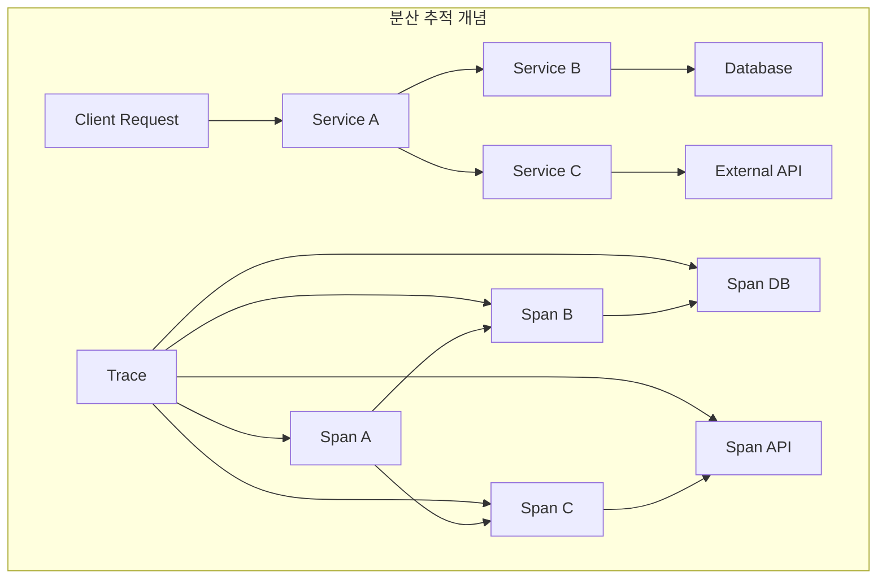
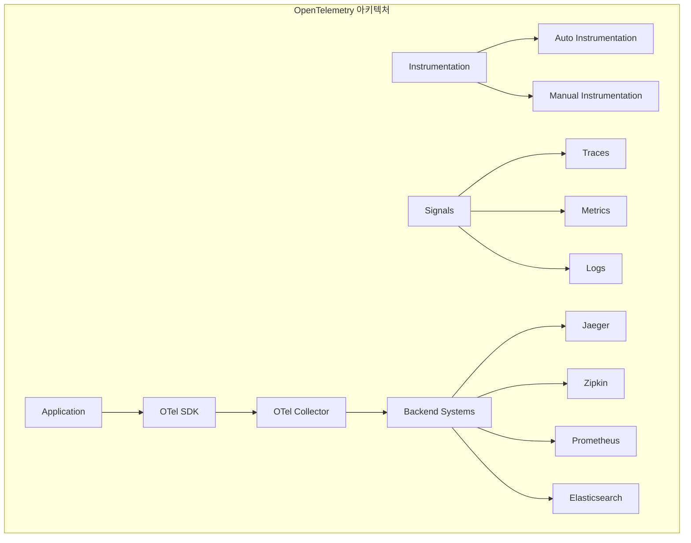
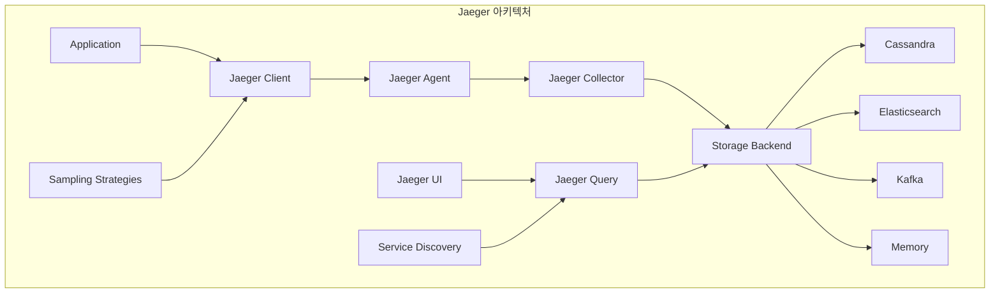
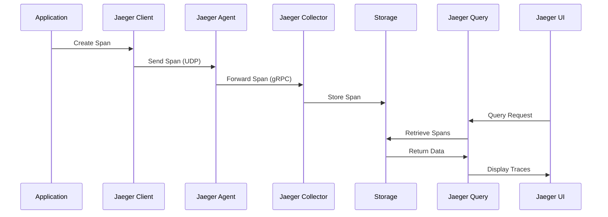
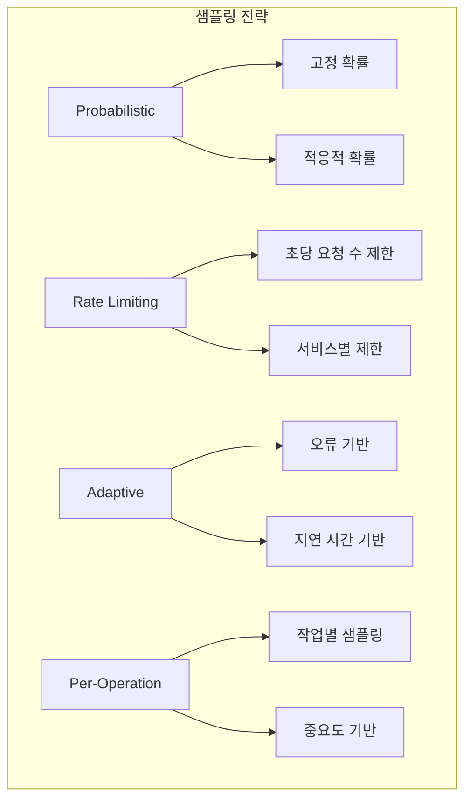

# Session 5: 분산 추적과 Jaeger 패턴

## 📍 교과과정에서의 위치
이 세션은 **Week 3 > Day 3 > Session 5**로, 분산 추적 개념과 Jaeger를 활용한 마이크로서비스 성능 분석을 학습합니다.

## 학습 목표 (5분)
- **분산 추적** 개념과 **OpenTelemetry** 표준 이해
- **Jaeger 아키텍처**와 **추적 데이터** 수집 방법 학습
- **추적 샘플링**과 **성능 최적화** 전략 파악
- **마이크로서비스 성능 분석**과 **병목 지점** 식별 기법 습득

## 1. 분산 추적 개념과 OpenTelemetry (15분)

### 분산 추적 개념



### OpenTelemetry 아키텍처



### 분산 추적 핵심 개념
```
분산 추적 (Distributed Tracing) 개념:

기본 개념:
   🔹 분산 추적의 필요성:
      • 마이크로서비스 복잡성 증가
      • 서비스 간 의존성 파악 어려움
      • 성능 병목 지점 식별 필요
      • 오류 전파 경로 추적
      • 사용자 요청 전체 여정 가시성
   🔹 핵심 구성 요소:
      • Trace: 전체 요청의 여정
      • Span: 개별 작업 단위
      • Context: 추적 정보 전파
      • Tags: 메타데이터 정보
      • Logs: 스팬 내 이벤트
   🔹 추적 데이터 모델:
      • Trace ID: 전체 요청 식별자
      • Span ID: 개별 작업 식별자
      • Parent Span ID: 부모-자식 관계
      • Operation Name: 작업 이름
      • Start/End Time: 시작/종료 시간
   🔹 컨텍스트 전파:
   🔹 HTTP 헤더를 통한 전파
   🔹 메시지 큐 메타데이터
   🔹 gRPC 메타데이터
   🔹 데이터베이스 연결 컨텍스트
   🔹 비동기 작업 컨텍스트

OpenTelemetry 표준:
   🔹 개요 및 목적:
      • 관찰 가능성 데이터 표준화
      • 벤더 중립적 접근
      • 다양한 언어 지원
      • 기존 도구와의 호환성
      • 커뮤니티 기반 개발
   🔹 신호 (Signals) 타입:
      • Traces: 분산 추적 데이터
      • Metrics: 시계열 메트릭
      • Logs: 구조화된 로그
      • Baggage: 컨텍스트 메타데이터
      • 통합 상관관계 분석
   🔹 SDK 및 API:
      • 언어별 SDK 제공
      • 자동 계측 라이브러리
      • 수동 계측 API
      • 플러그인 아키텍처
      • 설정 관리
   🔹 수집기 (Collector):
      • 데이터 수집 및 처리
      • 프로토콜 변환
      • 데이터 변환 및 필터링
      • 배치 처리 및 압축
      • 다중 백엔드 지원
   🔹 계측 (Instrumentation):
   🔹 자동 계측: 라이브러리 자동 추적
   🔹 수동 계측: 커스텀 스팬 생성
   🔹 세미 자동: 어노테이션 기반
   🔹 에이전트 기반: 바이트코드 조작
   🔹 사이드카 패턴: 프록시 기반

추적 데이터 구조:
   🔹 Trace 구조:
      • 고유한 Trace ID
      • 루트 스팬부터 시작
      • 계층적 스팬 구조
      • 시간 순서 정렬
      • 전체 요청 생명주기
   🔹 Span 속성:
      • Span ID: 고유 식별자
      • Operation Name: 작업 이름
      • Start/End Time: 시작/종료 시간
      • Duration: 실행 시간
      • Status: 성공/실패 상태
   🔹 Tags (속성):
      • 키-값 쌍 메타데이터
      • 서비스 정보 (service.name)
      • HTTP 정보 (http.method, http.status_code)
      • 데이터베이스 정보 (db.statement)
      • 커스텀 비즈니스 태그
   🔹 Logs (이벤트):
      • 스팬 내 특정 시점 이벤트
      • 타임스탬프 포함
      • 구조화된 데이터
      • 오류 정보 기록
      • 디버깅 정보
   🔹 관계 (References):
   🔹 ChildOf: 부모-자식 관계
   🔹 FollowsFrom: 순차적 관계
   🔹 비동기 작업 관계
   🔹 배치 처리 관계
   🔹 복잡한 워크플로우 표현

분산 추적 패턴:
   🔹 동기 호출 추적:
      • HTTP REST API 호출
      • gRPC 서비스 호출
      • 데이터베이스 쿼리
      • 외부 API 호출
      • 마이크로서비스 체인
   🔹 비동기 처리 추적:
      • 메시지 큐 처리
      • 이벤트 기반 아키텍처
      • 배치 작업 처리
      • 스케줄된 작업
      • 백그라운드 프로세스
   🔹 데이터베이스 추적:
      • SQL 쿼리 추적
      • NoSQL 작업 추적
      • 트랜잭션 추적
      • 연결 풀 모니터링
      • 성능 병목 식별
   🔹 캐시 추적:
      • Redis 작업 추적
      • Memcached 작업
      • 애플리케이션 캐시
      • CDN 캐시 히트/미스
      • 캐시 성능 분석
   🔹 외부 서비스 추적:
   🔹 써드파티 API 호출
   🔹 결제 서비스 연동
   🔹 인증 서비스 호출
   🔹 알림 서비스 연동
   🔹 클라우드 서비스 호출
```

## 2. Jaeger 아키텍처와 추적 데이터 수집 (12분)

### Jaeger 전체 아키텍처



### Jaeger 데이터 플로우



### Jaeger 구성 요소 상세
```
Jaeger 아키텍처 및 구성:

핵심 컴포넌트:
   🔹 Jaeger Client:
      • 애플리케이션 내 추적 라이브러리
      • 스팬 생성 및 관리
      • 컨텍스트 전파
      • 샘플링 결정
      • 로컬 버퍼링
   🔹 Jaeger Agent:
      • 네트워크 데몬 (사이드카 패턴)
      • UDP 포트로 스팬 수신
      • 배치 처리 및 압축
      • Collector로 전송
      • 서비스 디스커버리
   🔹 Jaeger Collector:
      • 스팬 데이터 수집 서비스
      • 데이터 검증 및 변환
      • 스토리지 백엔드에 저장
      • 수평적 확장 지원
      • 메트릭 및 헬스 체크
   🔹 Jaeger Query:
      • 추적 데이터 조회 서비스
      • REST API 제공
      • 검색 및 필터링
      • 집계 및 분석
      • UI 백엔드 역할
   🔹 Jaeger UI:
   🔹 웹 기반 사용자 인터페이스
   🔹 추적 시각화
   🔹 서비스 맵 표시
   🔹 성능 분석 도구
   🔹 검색 및 필터링

스토리지 백엔드:
   🔹 Cassandra:
      • 분산 NoSQL 데이터베이스
      • 높은 쓰기 성능
      • 수평적 확장성
      • 내결함성
      • 대용량 데이터 처리
   🔹 Elasticsearch:
      • 검색 및 분석 엔진
      • 풍부한 쿼리 기능
      • 실시간 검색
      • 집계 및 분석
      • 기존 ELK 스택 통합
   🔹 Kafka:
      • 스트리밍 플랫폼
      • 높은 처리량
      • 내구성 있는 저장
      • 실시간 처리
      • 다운스트림 처리
   🔹 Memory:
      • 인메모리 저장
      • 빠른 접근 속도
      • 개발 및 테스트 용도
      • 제한된 용량
      • 휘발성 데이터
   🔹 BadgerDB:
   🔹 임베디드 키-값 저장소
   🔹 단일 노드 배포
   🔹 낮은 운영 복잡성
   🔹 SSD 최적화
   🔹 중소 규모 환경

배포 패턴:
   🔹 All-in-One:
      • 단일 바이너리 배포
      • 개발 및 테스트 환경
      • 메모리 스토리지 사용
      • 간단한 설정
      • 제한된 확장성
   🔹 Production 배포:
      • 컴포넌트별 분리 배포
      • 고가용성 구성
      • 로드 밸런싱
      • 모니터링 통합
      • 백업 및 복구
   🔹 Kubernetes 배포:
      • Jaeger Operator 사용
      • 헬름 차트 배포
      • 사이드카 주입
      • 서비스 메시 통합
      • 자동 스케일링
   🔹 클라우드 배포:
   🔹 관리형 서비스 활용
   🔹 서버리스 아키텍처
   🔹 클라우드 스토리지 통합
   🔹 자동 확장
   🔹 비용 최적화

데이터 수집 전략:
   🔹 계측 방법:
      • 자동 계측: OpenTelemetry 에이전트
      • 수동 계측: SDK 직접 사용
      • 라이브러리 계측: 미들웨어 활용
      • 프록시 계측: 사이드카 패턴
      • 게이트웨이 계측: API 게이트웨이
   🔹 언어별 지원:
      • Java: OpenTracing, OpenTelemetry
      • Go: Jaeger Go Client
      • Python: jaeger-client-python
      • Node.js: jaeger-client-node
      • .NET: OpenTelemetry .NET
   🔹 프레임워크 통합:
      • Spring Boot: 자동 구성
      • Express.js: 미들웨어
      • Django: 미들웨어
      • Flask: 확장
      • Gin: 미들웨어
   🔹 인프라 통합:
   🔹 Kubernetes: 사이드카 주입
   🔹 Istio: 자동 추적
   🔹 Envoy: 프록시 추적
   🔹 NGINX: 모듈 기반
   🔹 HAProxy: 로그 기반

성능 및 확장성:
   🔹 처리량 최적화:
      • 배치 처리 설정
      • 압축 활용
      • 비동기 전송
      • 연결 풀링
      • 버퍼 크기 조정
   🔹 메모리 관리:
      • 스팬 버퍼 크기 제한
      • 가비지 컬렉션 최적화
      • 메모리 누수 방지
      • 리소스 해제
      • 메모리 프로파일링
   🔹 네트워크 최적화:
      • UDP vs gRPC 선택
      • 압축 알고리즘
      • 연결 재사용
      • 타임아웃 설정
      • 재시도 정책
   🔹 스토리지 최적화:
   🔹 인덱스 전략
   🔹 파티셔닝
   🔹 압축 설정
   🔹 TTL 정책
   🔹 아카이브 전략
```

## 3. 추적 샘플링과 성능 최적화 (10분)

### 샘플링 전략



### 샘플링 최적화 전략
```
추적 샘플링 및 성능 최적화:

샘플링 전략:
   🔹 확률적 샘플링 (Probabilistic):
      • 고정 확률 샘플링
      • 모든 요청에 동일한 확률 적용
      • 간단한 구현
      • 예측 가능한 오버헤드
      • 트래픽 패턴 무관
   🔹 속도 제한 샘플링 (Rate Limiting):
      • 초당 최대 추적 수 제한
      • 일정한 샘플링 속도 유지
      • 버스트 트래픽 대응
      • 리소스 사용량 예측 가능
      • 서비스별 개별 설정
   🔹 적응적 샘플링 (Adaptive):
      • 동적 샘플링 비율 조정
      • 서비스 성능 기반 조정
      • 오류율 기반 증가
      • 지연 시간 기반 조정
      • 머신러닝 기반 최적화
   🔹 작업별 샘플링 (Per-Operation):
      • 엔드포인트별 다른 비율
      • 중요도 기반 우선순위
      • 비즈니스 가치 반영
      • 성능 영향 최소화
      • 세밀한 제어 가능
   🔹 하이브리드 샘플링:
   🔹 여러 전략 조합
   🔹 계층적 샘플링
   🔹 조건부 샘플링
   🔹 컨텍스트 기반 샘플링
   🔹 동적 전략 전환

성능 최적화 기법:
   🔹 클라이언트 최적화:
      • 비동기 스팬 전송
      • 로컬 버퍼링
      • 배치 처리
      • 압축 활용
      • 연결 풀링
   🔹 에이전트 최적화:
      • UDP 수신 최적화
      • 배치 크기 조정
      • 압축 설정
      • 메모리 관리
      • CPU 사용량 최적화
   🔹 컬렉터 최적화:
      • 수평적 확장
      • 로드 밸런싱
      • 큐 관리
      • 백프레셔 처리
      • 스토리지 최적화
   🔹 스토리지 최적화:
      • 인덱스 전략
      • 샤딩 및 파티셔닝
      • 압축 설정
      • TTL 정책
      • 아카이브 전략
   🔹 네트워크 최적화:
   🔹 프로토콜 선택 (UDP vs gRPC)
   🔹 압축 알고리즘
   🔹 연결 재사용
   🔹 타임아웃 설정
   🔹 재시도 정책

오버헤드 최소화:
   🔹 계측 오버헤드:
      • 스팬 생성 비용 최소화
      • 태그 및 로그 최적화
      • 컨텍스트 전파 효율화
      • 메모리 할당 최소화
      • CPU 사용량 모니터링
   🔹 네트워크 오버헤드:
      • 데이터 압축
      • 배치 전송
      • 프로토콜 최적화
      • 연결 관리
      • 대역폭 사용량 모니터링
   🔹 스토리지 오버헤드:
      • 데이터 압축
      • 인덱스 최적화
      • 파티셔닝 전략
      • 보존 정책
      • 아카이브 자동화
   🔹 애플리케이션 영향:
   🔹 지연 시간 영향 측정
   🔹 처리량 영향 분석
   🔹 메모리 사용량 모니터링
   🔹 CPU 사용량 추적
   🔹 성능 회귀 감지

모니터링 및 관리:
   🔹 Jaeger 자체 모니터링:
      • 컴포넌트 헬스 체크
      • 처리량 메트릭
      • 지연 시간 메트릭
      • 오류율 추적
      • 리소스 사용량
   🔹 샘플링 효과 분석:
      • 샘플링 비율 추적
      • 커버리지 분석
      • 데이터 품질 평가
      • 비용 효과 분석
      • 조정 권고사항
   🔹 성능 영향 측정:
      • 애플리케이션 성능 비교
      • 인프라 리소스 사용량
      • 네트워크 사용량
      • 스토리지 사용량
      • 비용 분석
   🔹 알림 및 대응:
   🔹 성능 임계값 알림
   🔹 오류율 증가 알림
   🔹 리소스 부족 알림
   🔹 자동 스케일링 트리거
   🔹 장애 대응 절차
```

## 💬 그룹 토론: 분산 추적 도입 전략 (8분)

### 토론 주제
**"기존 마이크로서비스 환경에 분산 추적을 도입할 때 어떤 순서와 전략으로 진행해야 성공적으로 구현할 수 있는가?"**

### 토론 가이드라인

#### 도입 단계별 전략 (3분)
- **1단계**: 핵심 서비스부터 시작 vs 전체 동시 도입
- **계측 방법**: 자동 계측 vs 수동 계측의 장단점
- **샘플링**: 초기 높은 샘플링 vs 낮은 샘플링으로 시작

#### 기술적 고려사항 (3분)
- **성능 영향**: 애플리케이션 성능에 미치는 영향 최소화
- **데이터 볼륨**: 추적 데이터 저장 및 관리 전략
- **통합성**: 기존 모니터링 도구와의 통합 방안

#### 조직적 준비사항 (2분)
- **팀 교육**: 분산 추적 개념과 도구 사용법 교육
- **문화 변화**: 추적 데이터 기반 문제 해결 문화 조성
- **프로세스**: 추적 데이터를 활용한 운영 프로세스 개선

## 💡 핵심 개념 정리
- **분산 추적**: Trace, Span, Context를 통한 요청 여정 추적
- **OpenTelemetry**: 벤더 중립적 관찰 가능성 데이터 표준
- **Jaeger**: 분산 추적 시스템의 수집, 저장, 분석 플랫폼
- **샘플링**: 성능과 가시성의 균형을 위한 데이터 선별 전략

## 📚 참고 자료
- [Jaeger Documentation](https://www.jaegertracing.io/docs/)
- [OpenTelemetry Documentation](https://opentelemetry.io/docs/)
- [Distributed Tracing Best Practices](https://opentracing.io/docs/best-practices/)
- [Microservices Observability](https://microservices.io/patterns/observability/)

## 다음 세션 준비
다음 세션에서는 **알림과 인시던트 관리**에 대해 학습합니다. 효과적인 알림 설계와 인시던트 대응 프로세스를 다룰 예정입니다.