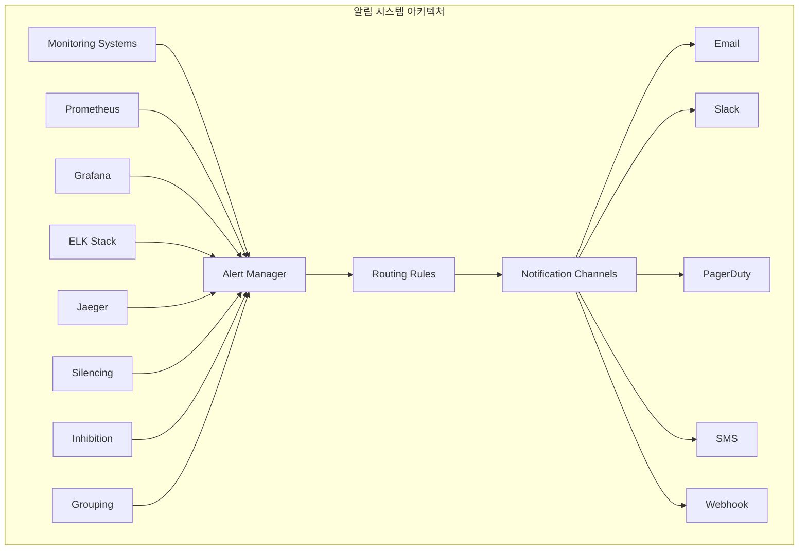
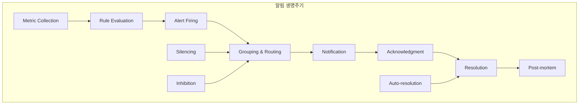
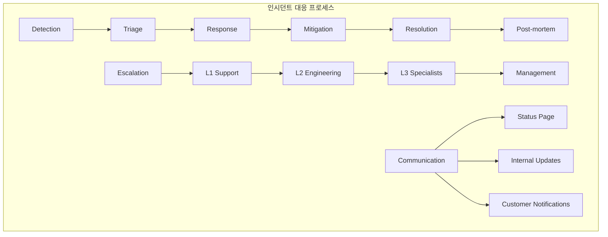
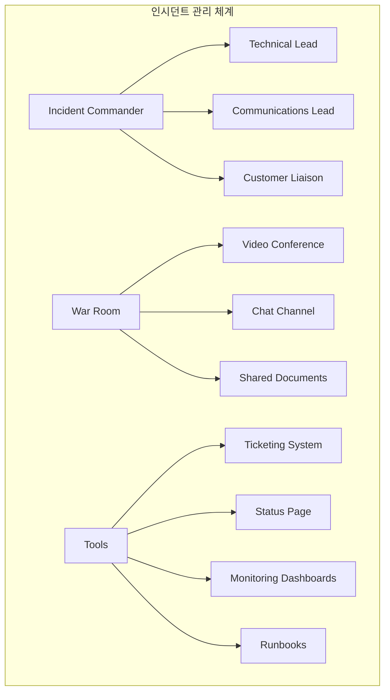
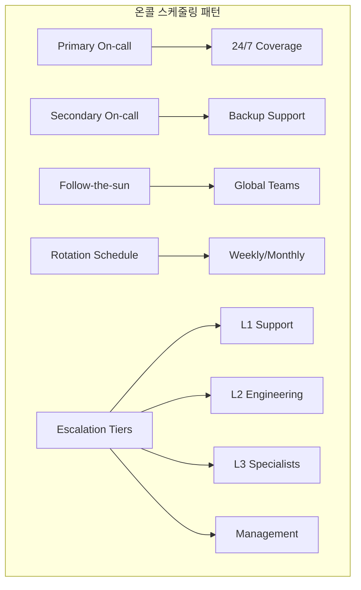

# Session 6: 알림과 인시던트 관리

## 📍 교과과정에서의 위치
이 세션은 **Week 3 > Day 3 > Session 6**으로, 효과적인 알림 설계와 체계적인 인시던트 관리 프로세스를 학습합니다.

## 학습 목표 (5분)
- **알림 설계 원칙**과 **피로도 방지** 전략 이해
- **인시던트 대응 프로세스**와 **에스컬레이션** 정책 학습
- **온콜 관리**와 **팀 운영** 방안 파악
- **사후 분석(Post-mortem)** 문화와 **지속적 개선** 방법 습득

## 1. 알림 설계 원칙과 피로도 방지 (15분)

### 알림 시스템 아키텍처



### 알림 생명주기



### 알림 설계 원칙
```
알림 설계 원칙 및 최적화:

알림 설계 기본 원칙:
├── 액션 가능성 (Actionable):
│   ├── 명확한 문제 정의
│   ├── 구체적인 해결 방법 제시
│   ├── 담당자 명시
│   ├── 우선순위 표시
│   └── 관련 문서 링크
├── 의미 있는 알림 (Meaningful):
│   ├── 비즈니스 영향도 기반
│   ├── 사용자 경험 중심
│   ├── SLA/SLO 기반 임계값
│   ├── 컨텍스트 정보 포함
│   └── 거짓 양성 최소화
├── 적시성 (Timely):
│   ├── 적절한 지연 시간
│   ├── 심각도별 차등 알림
│   ├── 에스컬레이션 타이밍
│   ├── 자동 해결 감지
│   └── 상태 변화 추적
├── 명확성 (Clear):
│   ├── 이해하기 쉬운 메시지
│   ├── 표준화된 형식
│   ├── 기술적 세부사항 적절히 포함
│   ├── 다국어 지원 고려
│   └── 시각적 구분 (색상, 아이콘)
└── 추적 가능성 (Traceable):
    ├── 고유한 알림 ID
    ├── 알림 히스토리 관리
    ├── 상관관계 분석
    ├── 메트릭 및 로그 연결
    └── 감사 추적

알림 피로도 방지 전략:
├── 스마트 그룹화:
│   ├── 관련 알림 묶음 처리
│   ├── 시간 기반 그룹화
│   ├── 서비스별 그룹화
│   ├── 심각도별 그룹화
│   └── 근본 원인 기반 그룹화
├── 지능형 억제 (Inhibition):
│   ├── 상위 레벨 알림이 하위 레벨 억제
│   ├── 의존성 기반 억제
│   ├── 연쇄 장애 방지
│   ├── 중복 알림 제거
│   └── 동적 억제 규칙
├── 적응형 임계값:
│   ├── 시간대별 동적 임계값
│   ├── 계절성 고려
│   ├── 트렌드 기반 조정
│   ├── 머신러닝 기반 예측
│   └── 자동 임계값 최적화
├── 사일런싱 관리:
│   ├── 계획된 유지보수 사일런싱
│   ├── 임시 문제 사일런싱
│   ├── 자동 만료 설정
│   ├── 승인 기반 사일런싱
│   └── 사일런싱 감사
└── 알림 품질 관리:
    ├── 거짓 양성률 추적
    ├── 알림 응답률 분석
    ├── 해결 시간 측정
    ├── 사용자 피드백 수집
    └── 지속적 개선

심각도 분류 체계:
├── Critical (P1):
│   ├── 서비스 완전 중단
│   ├── 데이터 손실 위험
│   ├── 보안 침해
│   ├── 즉시 대응 필요
│   └── 24/7 알림
├── High (P2):
│   ├── 주요 기능 장애
│   ├── 성능 심각한 저하
│   ├── 다수 사용자 영향
│   ├── 1시간 내 대응
│   └── 업무 시간 즉시 알림
├── Medium (P3):
│   ├── 부분적 기능 장애
│   ├── 성능 저하
│   ├── 일부 사용자 영향
│   ├── 4시간 내 대응
│   └── 업무 시간 알림
├── Low (P4):
│   ├── 경미한 문제
│   ├── 예방적 조치 필요
│   ├── 사용자 영향 최소
│   ├── 24시간 내 대응
│   └── 일일 요약 알림
└── Info (P5):
    ├── 정보성 알림
    ├── 트렌드 변화
    ├── 용량 계획 정보
    ├── 주간 검토
    └── 대시보드 표시만

알림 채널 전략:
├── 채널별 특성:
│   ├── Email: 상세 정보, 비동기
│   ├── Slack/Teams: 팀 협업, 실시간
│   ├── SMS: 긴급 상황, 즉시 도달
│   ├── PagerDuty: 온콜 관리, 에스컬레이션
│   └── Webhook: 자동화 통합
├── 라우팅 규칙:
│   ├── 심각도별 채널 선택
│   ├── 시간대별 라우팅
│   ├── 팀별 책임 영역
│   ├── 서비스별 담당자
│   └── 에스컬레이션 경로
├── 메시지 템플릿:
│   ├── 표준화된 형식
│   ├── 채널별 최적화
│   ├── 동적 콘텐츠 삽입
│   ├── 다국어 지원
│   └── 브랜딩 일관성
└── 전송 최적화:
    ├── 배치 처리
    ├── 속도 제한
    ├── 재시도 메커니즘
    ├── 전송 실패 처리
    └── 전송 상태 추적

알림 메트릭 및 분석:
├── 알림 품질 지표:
│   ├── 평균 해결 시간 (MTTR)
│   ├── 거짓 양성률
│   ├── 알림 응답률
│   ├── 에스컬레이션 비율
│   └── 사용자 만족도
├── 운영 효율성:
│   ├── 알림 볼륨 트렌드
│   ├── 채널별 효과성
│   ├── 시간대별 분포
│   ├── 팀별 워크로드
│   └── 자동화 효과
├── 비즈니스 영향:
│   ├── 다운타임 비용
│   ├── SLA 준수율
│   ├── 고객 만족도 영향
│   ├── 매출 영향
│   └── 브랜드 평판 영향
└── 지속적 개선:
    ├── 알림 규칙 최적화
    ├── 임계값 조정
    ├── 프로세스 개선
    ├── 도구 업그레이드
    └── 교육 및 훈련
```

## 2. 인시던트 대응 프로세스와 에스컬레이션 정책 (12분)

### 인시던트 대응 프로세스



### 인시던트 관리 체계



### 인시던트 대응 프로세스 상세
```
인시던트 대응 프로세스:

인시던트 생명주기:
├── 탐지 (Detection):
│   ├── 자동 모니터링 알림
│   ├── 사용자 신고
│   ├── 내부 발견
│   ├── 써드파티 알림
│   └── 정기 점검 발견
├── 분류 (Triage):
│   ├── 심각도 평가
│   ├── 영향 범위 분석
│   ├── 우선순위 결정
│   ├── 초기 담당자 배정
│   └── 에스컬레이션 필요성 판단
├── 대응 (Response):
│   ├── 인시던트 팀 구성
│   ├── 워룸 설정
│   ├── 초기 조사 시작
│   ├── 임시 해결책 모색
│   └── 커뮤니케이션 시작
├── 완화 (Mitigation):
│   ├── 임시 해결책 적용
│   ├── 서비스 복구
│   ├── 영향 최소화
│   ├── 모니터링 강화
│   └── 상황 안정화
├── 해결 (Resolution):
│   ├── 근본 원인 해결
│   ├── 영구 수정 적용
│   ├── 테스트 및 검증
│   ├── 모니터링 정상화
│   └── 인시던트 종료
└── 사후 분석 (Post-mortem):
    ├── 타임라인 정리
    ├── 근본 원인 분석
    ├── 개선 사항 도출
    ├── 액션 아이템 생성
    └── 지식 공유

역할 및 책임:
├── 인시던트 커맨더 (Incident Commander):
│   ├── 전체 대응 조율
│   ├── 의사결정 권한
│   ├── 리소스 할당
│   ├── 에스컬레이션 결정
│   └── 대외 커뮤니케이션 승인
├── 기술 리드 (Technical Lead):
│   ├── 기술적 조사 주도
│   ├── 해결책 설계
│   ├── 엔지니어링 팀 조율
│   ├── 기술적 의사결정
│   └── 구현 감독
├── 커뮤니케이션 리드 (Communications Lead):
│   ├── 내부 커뮤니케이션
│   ├── 상태 페이지 업데이트
│   ├── 고객 알림
│   ├── 미디어 대응
│   └── 문서화
├── 고객 연락 담당 (Customer Liaison):
│   ├── 고객 문의 대응
│   ├── 영향 고객 식별
│   ├── 보상 정책 적용
│   ├── 고객 만족도 관리
│   └── 피드백 수집
└── 주제 전문가 (Subject Matter Expert):
    ├── 전문 지식 제공
    ├── 기술적 자문
    ├── 특수 도구 활용
    ├── 벤더 연락
    └── 복잡한 문제 해결

에스컬레이션 정책:
├── 자동 에스컬레이션:
│   ├── 시간 기반 에스컬레이션
│   ├── 심각도 기반 즉시 에스컬레이션
│   ├── 응답 없음 시 에스컬레이션
│   ├── 해결 실패 시 에스컬레이션
│   └── 비즈니스 영향 기반
├── 수동 에스컬레이션:
│   ├── 복잡성 증가 시
│   ├── 전문 지식 필요 시
│   ├── 리소스 부족 시
│   ├── 정치적 민감성
│   └── 고객 요청
├── 에스컬레이션 경로:
│   ├── L1 → L2 → L3 → Management
│   ├── 기술적 에스컬레이션
│   ├── 관리적 에스컬레이션
│   ├── 비즈니스 에스컬레이션
│   └── 외부 에스컬레이션
└── 에스컬레이션 기준:
    ├── 시간 임계값 (15분, 1시간, 4시간)
    ├── 영향 범위 (사용자 수, 매출 영향)
    ├── 복잡도 (시스템 수, 의존성)
    ├── 전문성 요구 (특수 기술, 벤더)
    └── 비즈니스 중요도

커뮤니케이션 전략:
├── 내부 커뮤니케이션:
│   ├── 인시던트 채널 생성
│   ├── 정기적 상황 업데이트
│   ├── 의사결정 기록
│   ├── 액션 아이템 추적
│   └── 경영진 보고
├── 외부 커뮤니케이션:
│   ├── 상태 페이지 업데이트
│   ├── 고객 이메일 알림
│   ├── 소셜 미디어 대응
│   ├── 미디어 성명서
│   └── 파트너 알림
├── 커뮤니케이션 원칙:
│   ├── 투명성과 정직성
│   ├── 적시성
│   ├── 일관성
│   ├── 공감과 사과
│   └── 해결 의지 표명
└── 템플릿 및 도구:
    ├── 상황별 메시지 템플릿
    ├── 자동화된 알림 시스템
    ├── 다국어 지원
    ├── 브랜드 가이드라인 준수
    └── 법적 검토 프로세스

도구 및 플랫폼:
├── 인시던트 관리 도구:
│   ├── PagerDuty: 온콜 및 에스컬레이션
│   ├── Opsgenie: 알림 및 스케줄링
│   ├── VictorOps: 협업 및 대응
│   ├── ServiceNow: ITSM 통합
│   └── 커스텀 솔루션
├── 커뮤니케이션 도구:
│   ├── Slack/Teams: 실시간 협업
│   ├── Zoom/Meet: 화상 회의
│   ├── 상태 페이지: 고객 커뮤니케이션
│   ├── 이메일 시스템: 공식 알림
│   └── 소셜 미디어 관리
├── 문서화 도구:
│   ├── 위키 시스템: 런북 및 절차
│   ├── 티켓 시스템: 추적 및 기록
│   ├── 타임라인 도구: 사건 순서
│   ├── 화이트보드: 협업 및 브레인스토밍
│   └── 스크린샷/녹화: 증거 수집
└── 모니터링 도구:
    ├── 대시보드: 실시간 상황 파악
    ├── 로그 분석: 근본 원인 조사
    ├── 추적 시스템: 요청 흐름 분석
    ├── 성능 모니터링: 영향 측정
    └── 비즈니스 메트릭: 비즈니스 영향 평가
```

## 3. 온콜 관리와 팀 운영 방안 (10분)

### 온콜 스케줄링 패턴



### 온콜 관리 전략
```
온콜 관리 및 팀 운영:

온콜 스케줄링 전략:
├── 로테이션 패턴:
│   ├── 주간 로테이션: 1주일 단위
│   ├── 격주 로테이션: 2주일 단위
│   ├── 월간 로테이션: 1개월 단위
│   ├── Follow-the-sun: 시간대별 팀
│   └── 하이브리드: 조합 패턴
├── 커버리지 모델:
│   ├── Primary/Secondary: 주/부 담당자
│   ├── 계층적 에스컬레이션: L1/L2/L3
│   ├── 전문 영역별: 서비스/기술별
│   ├── 지역별 분산: 글로벌 팀
│   └── 하이브리드 모델
├── 공정성 보장:
│   ├── 균등한 부담 분배
│   ├── 휴가 및 병가 고려
│   ├── 시간대 공정성
│   ├── 워크로드 밸런싱
│   └── 보상 체계
└── 스케줄 관리:
    ├── 자동화된 스케줄링
    ├── 교체 요청 시스템
    ├── 긴급 변경 프로세스
    ├── 휴가 계획 통합
    └── 알림 및 리마인더

온콜 준비 및 교육:
├── 온보딩 프로그램:
│   ├── 시스템 아키텍처 교육
│   ├── 런북 및 절차 숙지
│   ├── 도구 사용법 교육
│   ├── 에스컬레이션 경로 학습
│   └── 실습 및 시뮬레이션
├── 지속적 교육:
│   ├── 정기적 지식 업데이트
│   ├── 새로운 시스템 교육
│   ├── 인시던트 사례 학습
│   ├── 도구 업데이트 교육
│   └── 크로스 트레이닝
├── 런북 관리:
│   ├── 표준화된 절차서
│   ├── 단계별 가이드
│   ├── 의사결정 트리
│   ├── 연락처 정보
│   └── 지속적 업데이트
└── 시뮬레이션 훈련:
    ├── 정기적 훈련 실시
    ├── 다양한 시나리오
    ├── 팀워크 향상
    ├── 절차 검증
    └── 개선점 도출

온콜 품질 관리:
├── 성과 지표:
│   ├── 응답 시간 (Time to Acknowledge)
│   ├── 해결 시간 (Time to Resolution)
│   ├── 에스컬레이션 비율
│   ├── 고객 만족도
│   └── 재발 방지 효과
├── 워크로드 분석:
│   ├── 알림 빈도 분석
│   ├── 시간대별 분포
│   ├── 심각도별 분포
│   ├── 개인별 부담 측정
│   └── 번아웃 위험 평가
├── 품질 개선:
│   ├── 알림 품질 향상
│   ├── 자동화 확대
│   ├── 런북 개선
│   ├── 도구 최적화
│   └── 프로세스 간소화
└── 피드백 시스템:
    ├── 정기적 회고
    ├── 개선 제안 수집
    ├── 만족도 조사
    ├── 스트레스 관리
    └── 경력 개발 지원

팀 웰빙 및 지속가능성:
├── 번아웃 방지:
│   ├── 적절한 휴식 보장
│   ├── 워크로드 모니터링
│   ├── 스트레스 관리 프로그램
│   ├── 정신 건강 지원
│   └── 유연한 근무 환경
├── 보상 및 인정:
│   ├── 온콜 수당 지급
│   ├── 추가 휴가 제공
│   ├── 성과 인정 프로그램
│   ├── 경력 개발 기회
│   └── 팀 빌딩 활동
├── 업무 환경 개선:
│   ├── 원격 온콜 지원
│   ├── 필요 도구 제공
│   ├── 편안한 작업 공간
│   ├── 24시간 지원 체계
│   └── 가족 친화적 정책
└── 경력 개발:
    ├── 기술 역량 향상
    ├── 리더십 개발
    ├── 인증 및 교육 지원
    ├── 멘토링 프로그램
    └── 내부 이동 기회
```

## 💬 그룹 토론: 효과적인 온콜 문화 구축 (8분)

### 토론 주제
**"건강한 온콜 문화를 구축하면서도 높은 서비스 품질을 유지하기 위한 핵심 요소는 무엇인가?"**

### 토론 가이드라인

#### 문화적 요소 (3분)
- **책임감**: 개인의 책임감과 팀의 지원 체계 균형
- **학습 문화**: 실수를 통한 학습과 비난 없는 문화
- **투명성**: 문제 공유와 지식 전파 문화

#### 운영적 요소 (3분)
- **자동화**: 반복 작업 자동화를 통한 부담 경감
- **도구**: 효과적인 도구와 프로세스 구축
- **교육**: 지속적인 교육과 역량 개발

#### 조직적 지원 (2분)
- **리더십**: 경영진의 온콜 문화에 대한 이해와 지원
- **보상**: 적절한 보상과 인정 체계
- **지속가능성**: 장기적으로 지속 가능한 온콜 운영 방안

## 💡 핵심 개념 정리
- **알림 설계**: 액션 가능하고 의미 있는 알림, 피로도 방지
- **인시던트 대응**: 체계적인 프로세스와 명확한 역할 분담
- **온콜 관리**: 공정한 스케줄링과 팀 웰빙 고려
- **지속적 개선**: 사후 분석을 통한 프로세스 개선

## 📚 참고 자료
- [Site Reliability Engineering](https://sre.google/books/)
- [Incident Response Best Practices](https://response.pagerduty.com/)
- [On-Call Management Guide](https://www.atlassian.com/incident-management/on-call)
- [Alert Fatigue Prevention](https://www.datadoghq.com/blog/alert-fatigue/)

## 다음 세션 준비
다음 세션에서는 **성능 모니터링과 최적화**에 대해 학습합니다. 애플리케이션 성능 모니터링(APM)과 시스템 최적화 전략을 다룰 예정입니다.