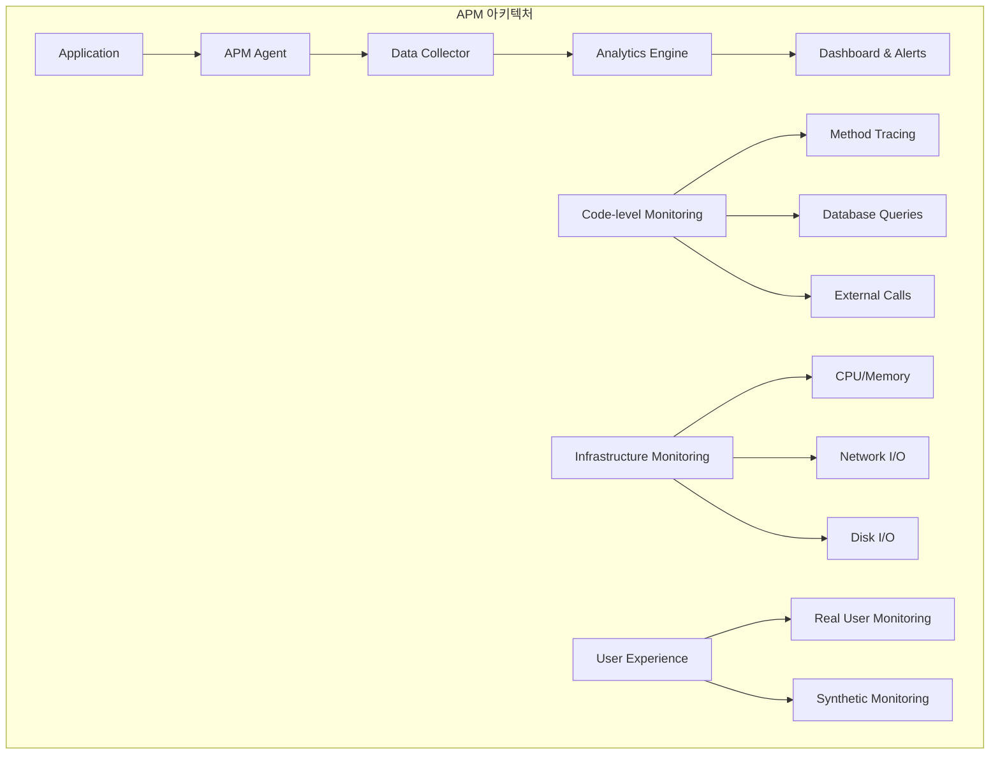
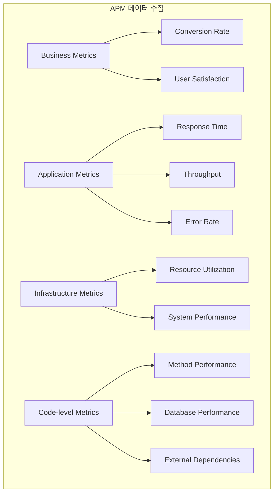
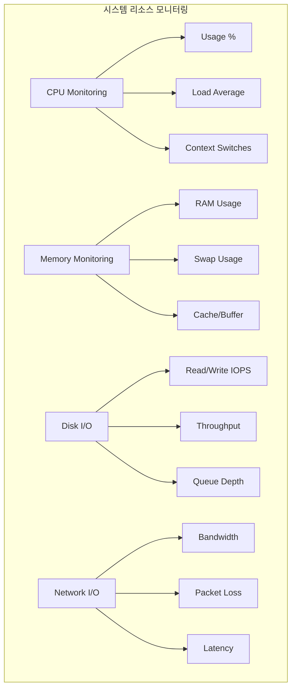
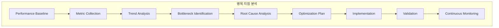
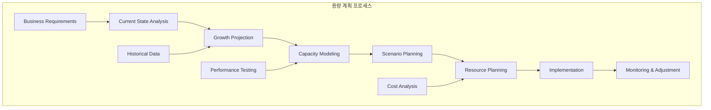
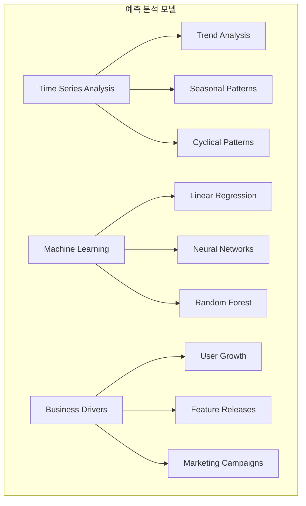

# Session 7: 성능 모니터링과 최적화

## 📍 교과과정에서의 위치
이 세션은 **Week 3 > Day 3 > Session 7**로, 애플리케이션 성능 모니터링(APM)과 시스템 최적화 전략을 학습합니다.

## 학습 목표 (5분)
- **애플리케이션 성능 모니터링(APM)** 개념과 **구현 방법** 이해
- **리소스 사용률 분석**과 **병목 지점** 식별 기법 학습
- **용량 계획**과 **예측 분석**을 통한 **확장성** 관리 방법 파악
- **성능 최적화** 전략과 **지속적 개선** 프로세스 습득

## 1. 애플리케이션 성능 모니터링(APM) (15분)

### APM 아키텍처



### APM 데이터 수집 계층



### APM 구현 전략
```
애플리케이션 성능 모니터링 (APM):

APM 핵심 개념:
├── 성능 모니터링 범위:
│   ├── 애플리케이션 코드 레벨
│   ├── 데이터베이스 성능
│   ├── 외부 서비스 호출
│   ├── 인프라 리소스 사용률
│   └── 사용자 경험 메트릭
├── 모니터링 계층:
│   ├── 비즈니스 메트릭: 전환율, 매출, 사용자 만족도
│   ├── 애플리케이션 메트릭: 응답시간, 처리량, 오류율
│   ├── 시스템 메트릭: CPU, 메모리, 네트워크, 디스크
│   ├── 코드 메트릭: 메서드 성능, 호출 스택, 메모리 사용
│   └── 사용자 경험: 페이지 로드 시간, 상호작용 지연
├── 데이터 수집 방법:
│   ├── 에이전트 기반: 애플리케이션 내 에이전트 설치
│   ├── 에이전트리스: 네트워크 트래픽 분석
│   ├── 코드 계측: 수동/자동 코드 계측
│   ├── 로그 분석: 애플리케이션 로그 파싱
│   └── 합성 모니터링: 인공적 트랜잭션 생성
└── 분석 및 시각화:
    ├── 실시간 대시보드
    ├── 트렌드 분석
    ├── 이상 탐지
    ├── 근본 원인 분석
    └── 성능 비교 분석

주요 APM 도구:
├── 상용 솔루션:
│   ├── New Relic: 클라우드 기반 APM
│   ├── Dynatrace: AI 기반 자동 분석
│   ├── AppDynamics: 엔터프라이즈 APM
│   ├── Datadog: 통합 모니터링 플랫폼
│   └── Splunk APM: 로그 기반 분석
├── 오픈소스 솔루션:
│   ├── Jaeger: 분산 추적
│   ├── Zipkin: 마이크로서비스 추적
│   ├── Pinpoint: 대용량 분산 시스템
│   ├── SkyWalking: 클라우드 네이티브 APM
│   └── Elastic APM: ELK 스택 통합
├── 클라우드 네이티브:
│   ├── AWS X-Ray: AWS 서비스 통합
│   ├── Google Cloud Trace: GCP 통합
│   ├── Azure Application Insights: Azure 통합
│   ├── OpenTelemetry: 표준 기반 계측
│   └── Prometheus + Grafana: 메트릭 기반
└── 특화 도구:
    ├── 프론트엔드: Google Analytics, Hotjar
    ├── 데이터베이스: pganalyze, VividCortex
    ├── 네트워크: ThousandEyes, Catchpoint
    ├── 모바일: Firebase Performance, Bugsnag
    └── 보안: Snyk, Veracode

성능 메트릭 분류:
├── 골든 시그널 (Golden Signals):
│   ├── Latency: 요청 처리 지연 시간
│   ├── Traffic: 시스템 처리 요청 수
│   ├── Errors: 실패한 요청 비율
│   ├── Saturation: 시스템 리소스 포화도
│   └── 모든 서비스에 적용 가능한 핵심 지표
├── RED 메트릭:
│   ├── Rate: 초당 요청 수 (RPS)
│   ├── Errors: 오류율 (Error Rate)
│   ├── Duration: 응답 시간 (Response Time)
│   ├── 마이크로서비스에 특화
│   └── 서비스 간 비교 용이
├── USE 메트릭:
│   ├── Utilization: 리소스 사용률
│   ├── Saturation: 리소스 포화도
│   ├── Errors: 오류 발생률
│   ├── 인프라 모니터링에 특화
│   └── 병목 지점 식별에 효과적
└── 비즈니스 메트릭:
    ├── 전환율 (Conversion Rate)
    ├── 사용자 참여도 (Engagement)
    ├── 매출 영향 (Revenue Impact)
    ├── 고객 만족도 (CSAT)
    └── 비즈니스 가치 연결

코드 레벨 모니터링:
├── 메서드 성능 추적:
│   ├── 실행 시간 측정
│   ├── 호출 빈도 분석
│   ├── 메모리 사용량 추적
│   ├── CPU 사용률 모니터링
│   └── 병목 메서드 식별
├── 데이터베이스 모니터링:
│   ├── 쿼리 성능 분석
│   ├── 슬로우 쿼리 탐지
│   ├── 연결 풀 모니터링
│   ├── 트랜잭션 추적
│   └── 인덱스 사용률 분석
├── 외부 의존성 추적:
│   ├── API 호출 성능
│   ├── 써드파티 서비스 응답시간
│   ├── 네트워크 지연 분석
│   ├── 타임아웃 및 재시도 추적
│   └── 의존성 장애 영향 분석
├── 메모리 및 가비지 컬렉션:
│   ├── 힙 메모리 사용량
│   ├── GC 빈도 및 시간
│   ├── 메모리 누수 탐지
│   ├── 객체 생성 패턴
│   └── 메모리 최적화 기회
└── 스레드 및 동시성:
    ├── 스레드 풀 사용률
    ├── 동시성 병목 지점
    ├── 데드락 탐지
    ├── 경쟁 조건 분석
    └── 비동기 처리 성능

사용자 경험 모니터링:
├── Real User Monitoring (RUM):
│   ├── 실제 사용자 데이터 수집
│   ├── 페이지 로드 시간
│   ├── 상호작용 지연시간
│   ├── 자바스크립트 오류
│   └── 사용자 세션 분석
├── Synthetic Monitoring:
│   ├── 인공적 트랜잭션 생성
│   ├── 정기적 성능 체크
│   ├── 다양한 지역에서 테스트
│   ├── 24/7 가용성 모니터링
│   └── 성능 기준선 설정
├── Core Web Vitals:
│   ├── LCP (Largest Contentful Paint)
│   ├── FID (First Input Delay)
│   ├── CLS (Cumulative Layout Shift)
│   ├── SEO 및 사용자 경험 영향
│   └── Google 검색 순위 요소
└── 모바일 성능:
    ├── 앱 시작 시간
    ├── 화면 전환 시간
    ├── 배터리 사용량
    ├── 네트워크 사용량
    └── 크래시 및 ANR 추적
```

## 2. 리소스 사용률 분석과 병목 지점 식별 (12분)

### 시스템 리소스 모니터링



### 병목 지점 분석 프로세스



### 리소스 분석 및 최적화 전략
```
리소스 사용률 분석 및 병목 지점 식별:

시스템 리소스 모니터링:
├── CPU 성능 분석:
│   ├── CPU 사용률 (%user, %system, %idle)
│   ├── 로드 애버리지 (1분, 5분, 15분)
│   ├── 컨텍스트 스위치 빈도
│   ├── 인터럽트 처리 시간
│   └── CPU 큐 길이 및 대기 시간
├── 메모리 사용률 분석:
│   ├── 물리 메모리 사용률
│   ├── 스왑 메모리 사용률
│   ├── 캐시 및 버퍼 사용률
│   ├── 메모리 누수 탐지
│   └── 가상 메모리 매핑
├── 디스크 I/O 성능:
│   ├── IOPS (Input/Output Operations Per Second)
│   ├── 처리량 (Throughput - MB/s)
│   ├── 응답 시간 (Response Time)
│   ├── 큐 깊이 (Queue Depth)
│   └── 디스크 사용률 (Utilization %)
├── 네트워크 I/O 성능:
│   ├── 대역폭 사용률 (Bandwidth Utilization)
│   ├── 패킷 손실률 (Packet Loss)
│   ├── 네트워크 지연시간 (Latency)
│   ├── 연결 수 및 상태
│   └── 네트워크 오류율
└── 파일 시스템 모니터링:
    ├── 디스크 공간 사용률
    ├── 아이노드 사용률
    ├── 파일 시스템 성능
    ├── 마운트 포인트 상태
    └── 파일 핸들 사용률

병목 지점 식별 방법론:
├── 성능 기준선 설정:
│   ├── 정상 상태 메트릭 수집
│   ├── 피크 시간대 패턴 분석
│   ├── 계절성 및 트렌드 고려
│   ├── SLA/SLO 기준 설정
│   └── 벤치마크 테스트 수행
├── 다차원 분석:
│   ├── 시간 축 분석 (시간대별 패턴)
│   ├── 서비스 축 분석 (서비스별 성능)
│   ├── 사용자 축 분석 (사용자 그룹별)
│   ├── 지역 축 분석 (지리적 분포)
│   └── 디바이스 축 분석 (디바이스별 성능)
├── 상관관계 분석:
│   ├── 메트릭 간 상관관계
│   ├── 비즈니스 이벤트와 성능 연관성
│   ├── 배포와 성능 변화 연관성
│   ├── 외부 요인 영향 분석
│   └── 다변량 분석 기법 활용
├── 병목 지점 우선순위:
│   ├── 비즈니스 영향도 평가
│   ├── 개선 용이성 평가
│   ├── 비용 대비 효과 분석
│   ├── 위험도 평가
│   └── 우선순위 매트릭스 작성
└── 근본 원인 분석:
    ├── 5 Whys 기법 적용
    ├── 피시본 다이어그램
    ├── 장애 트리 분석
    ├── 통계적 분석 기법
    └── 전문가 판단 및 경험

애플리케이션 레벨 병목:
├── 코드 성능 병목:
│   ├── 비효율적 알고리즘
│   ├── 불필요한 반복문
│   ├── 메모리 누수
│   ├── 동기화 문제
│   └── 리소스 경합
├── 데이터베이스 병목:
│   ├── 슬로우 쿼리
│   ├── 인덱스 부족
│   ├── 테이블 락
│   ├── 연결 풀 부족
│   └── 트랜잭션 경합
├── 네트워크 병목:
│   ├── 대역폭 부족
│   ├── 높은 지연시간
│   ├── 패킷 손실
│   ├── DNS 해석 지연
│   └── 로드 밸런서 병목
├── 캐시 성능 문제:
│   ├── 캐시 미스율 높음
│   ├── 캐시 만료 정책 부적절
│   ├── 캐시 크기 부족
│   ├── 캐시 키 설계 문제
│   └── 캐시 무효화 문제
└── 외부 의존성 병목:
    ├── 써드파티 API 지연
    ├── 외부 서비스 장애
    ├── 네트워크 연결 문제
    ├── 인증/권한 지연
    └── 데이터 동기화 지연

성능 프로파일링 기법:
├── CPU 프로파일링:
│   ├── 함수별 CPU 사용시간
│   ├── 호출 스택 분석
│   ├── 핫스팟 식별
│   ├── 컴파일러 최적화 효과
│   └── 멀티스레딩 효율성
├── 메모리 프로파일링:
│   ├── 힙 메모리 사용 패턴
│   ├── 메모리 할당/해제 추적
│   ├── 메모리 누수 탐지
│   ├── 가비지 컬렉션 분석
│   └── 메모리 단편화 분석
├── I/O 프로파일링:
│   ├── 파일 I/O 패턴 분석
│   ├── 네트워크 I/O 추적
│   ├── 데이터베이스 I/O 분석
│   ├── 블로킹 I/O 탐지
│   └── 비동기 I/O 효율성
└── 동시성 프로파일링:
    ├── 스레드 경합 분석
    ├── 락 대기 시간 측정
    ├── 데드락 탐지
    ├── 스레드 풀 효율성
    └── 비동기 처리 성능

모니터링 도구 및 기법:
├── 시스템 모니터링 도구:
│   ├── top/htop: 실시간 프로세스 모니터링
│   ├── iostat: I/O 통계
│   ├── vmstat: 가상 메모리 통계
│   ├── netstat: 네트워크 연결 상태
│   └── sar: 시스템 활동 리포터
├── 애플리케이션 프로파일러:
│   ├── Java: JProfiler, YourKit, VisualVM
│   ├── .NET: PerfView, JetBrains dotTrace
│   ├── Python: cProfile, py-spy
│   ├── Go: pprof, go tool trace
│   └── Node.js: clinic.js, 0x
├── 분산 추적 도구:
│   ├── Jaeger: 마이크로서비스 추적
│   ├── Zipkin: 분산 시스템 추적
│   ├── AWS X-Ray: 클라우드 서비스 추적
│   ├── Google Cloud Trace: GCP 추적
│   └── OpenTelemetry: 표준 기반 추적
└── 통합 모니터링 플랫폼:
    ├── Datadog: 통합 모니터링
    ├── New Relic: APM 및 인프라
    ├── Dynatrace: AI 기반 분석
    ├── Prometheus + Grafana: 오픈소스
    └── ELK Stack: 로그 기반 분석
```

## 3. 용량 계획과 예측 분석 (10분)

### 용량 계획 프로세스



### 예측 분석 모델



### 용량 계획 및 예측 전략
```
용량 계획 및 예측 분석:

용량 계획 방법론:
├── 현재 상태 분석:
│   ├── 리소스 사용률 현황
│   ├── 성능 기준선 설정
│   ├── 병목 지점 식별
│   ├── 비용 구조 분석
│   └── SLA/SLO 준수 현황
├── 성장 예측 모델링:
│   ├── 사용자 증가율 예측
│   ├── 트래픽 증가 패턴
│   ├── 데이터 증가율
│   ├── 기능 확장 계획
│   └── 비즈니스 성장 시나리오
├── 용량 모델링:
│   ├── 리소스 요구사항 계산
│   ├── 확장성 한계 분석
│   ├── 성능 임계점 식별
│   ├── 아키텍처 확장 방안
│   └── 비용 효율성 분석
└── 구현 계획:
    ├── 단계별 확장 로드맵
    ├── 예산 및 일정 계획
    ├── 위험 관리 계획
    ├── 모니터링 체계 구축
    └── 지속적 최적화 프로세스

예측 분석 기법:
├── 시계열 분석:
│   ├── 트렌드 분석: 장기적 증가/감소 패턴
│   ├── 계절성 분석: 주기적 변동 패턴
│   ├── 순환성 분석: 비정기적 주기 패턴
│   ├── 불규칙성 분석: 예측 불가능한 변동
│   └── ARIMA, 지수평활법 등 활용
├── 머신러닝 기반 예측:
│   ├── 선형 회귀: 단순한 선형 관계
│   ├── 다항 회귀: 비선형 관계 모델링
│   ├── 랜덤 포레스트: 복잡한 패턴 학습
│   ├── 신경망: 딥러닝 기반 예측
│   └── 앙상블 방법: 여러 모델 조합
├── 비즈니스 드라이버 기반:
│   ├── 사용자 증가율과 리소스 사용량 상관관계
│   ├── 마케팅 캠페인 영향 분석
│   ├── 신기능 출시 영향 예측
│   ├── 경쟁사 동향 반영
│   └── 시장 환경 변화 고려
└── 시나리오 기반 계획:
    ├── 낙관적 시나리오: 높은 성장률
    ├── 현실적 시나리오: 예상 성장률
    ├── 비관적 시나리오: 낮은 성장률
    ├── 위기 시나리오: 급격한 변화
    └── 각 시나리오별 대응 계획

리소스 확장 전략:
├── 수직 확장 (Scale Up):
│   ├── CPU 업그레이드
│   ├── 메모리 증설
│   ├── 스토리지 확장
│   ├── 네트워크 대역폭 증가
│   └── 단일 서버 성능 향상
├── 수평 확장 (Scale Out):
│   ├── 서버 인스턴스 추가
│   ├── 로드 밸런싱 구성
│   ├── 데이터베이스 샤딩
│   ├── 캐시 클러스터 확장
│   └── 분산 아키텍처 구성
├── 자동 확장 (Auto Scaling):
│   ├── 메트릭 기반 자동 확장
│   ├── 예측 기반 사전 확장
│   ├── 스케줄 기반 확장
│   ├── 비용 최적화 고려
│   └── 확장/축소 정책 설정
└── 하이브리드 접근:
    ├── 기본 용량 + 버스트 용량
    ├── 온프레미스 + 클라우드
    ├── 예약 인스턴스 + 스팟 인스턴스
    ├── 다중 클라우드 전략
    └── 비용 효율성 극대화

성능 테스트 및 검증:
├── 부하 테스트:
│   ├── 예상 부하 수준 테스트
│   ├── 점진적 부하 증가
│   ├── 지속적 부하 테스트
│   ├── 성능 기준선 검증
│   └── 병목 지점 식별
├── 스트레스 테스트:
│   ├── 시스템 한계점 탐색
│   ├── 장애 지점 식별
│   ├── 복구 능력 검증
│   ├── 성능 저하 패턴 분석
│   └── 용량 한계 확인
├── 스파이크 테스트:
│   ├── 급격한 부하 증가 대응
│   ├── 자동 확장 검증
│   ├── 시스템 안정성 확인
│   ├── 복구 시간 측정
│   └── 사용자 경험 영향 평가
└── 내구성 테스트:
    ├── 장시간 안정성 검증
    ├── 메모리 누수 탐지
    ├── 리소스 고갈 시나리오
    ├── 성능 저하 추세 분석
    └── 유지보수 영향 평가
```

## 💬 그룹 토론: 성능 최적화 우선순위 결정 (8분)

### 토론 주제
**"제한된 리소스로 성능 최적화를 진행할 때, 어떤 기준으로 우선순위를 정하고 투자 대비 효과를 극대화할 수 있는가?"**

### 토론 가이드라인

#### 우선순위 결정 기준 (3분)
- **비즈니스 영향**: 매출, 사용자 경험, 브랜드 이미지에 미치는 영향
- **기술적 영향**: 시스템 안정성, 확장성, 유지보수성 개선 효과
- **구현 복잡도**: 개발 시간, 위험도, 필요한 전문성

#### 투자 대비 효과 분석 (3분)
- **Quick Wins**: 낮은 비용으로 높은 효과를 얻을 수 있는 개선사항
- **전략적 투자**: 장기적 관점에서 필요한 대규모 개선사항
- **위험 관리**: 성능 문제로 인한 잠재적 손실 방지

#### 측정 및 검증 방법 (2분)
- **성과 지표**: 개선 효과를 측정할 수 있는 구체적 지표
- **A/B 테스트**: 개선 효과를 객관적으로 검증하는 방법
- **지속적 모니터링**: 개선 효과의 지속성과 부작용 모니터링

## 💡 핵심 개념 정리
- **APM**: 애플리케이션 전체 스택의 성능을 종합적으로 모니터링
- **병목 분석**: 시스템 리소스와 애플리케이션 레벨의 성능 제약 요소 식별
- **용량 계획**: 데이터 기반 예측을 통한 체계적인 확장 계획 수립
- **지속적 최적화**: 모니터링-분석-개선의 반복적 프로세스

## 📚 참고 자료
- [Application Performance Monitoring Best Practices](https://www.dynatrace.com/news/blog/what-is-apm-2/)
- [Capacity Planning Guide](https://www.atlassian.com/incident-management/kpis-metrics/capacity-planning)
- [Performance Testing Strategy](https://martinfowler.com/articles/practical-test-pyramid.html)
- [Site Reliability Engineering - Capacity Planning](https://sre.google/sre-book/software-engineering-in-sre/)

## 다음 세션 준비
다음 세션에서는 **모니터링 전략 수립과 운영 방안**에 대해 학습합니다. 종합적인 모니터링 전략 설계와 효과적인 운영 방법을 다룰 예정입니다.