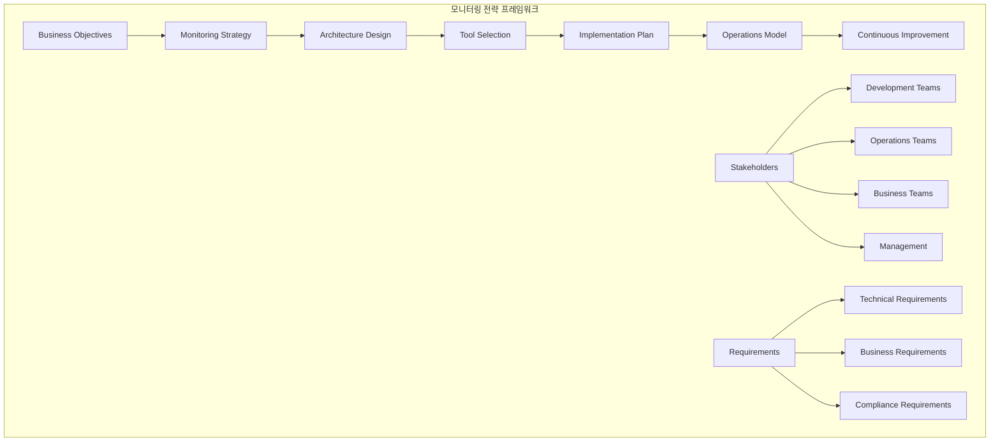
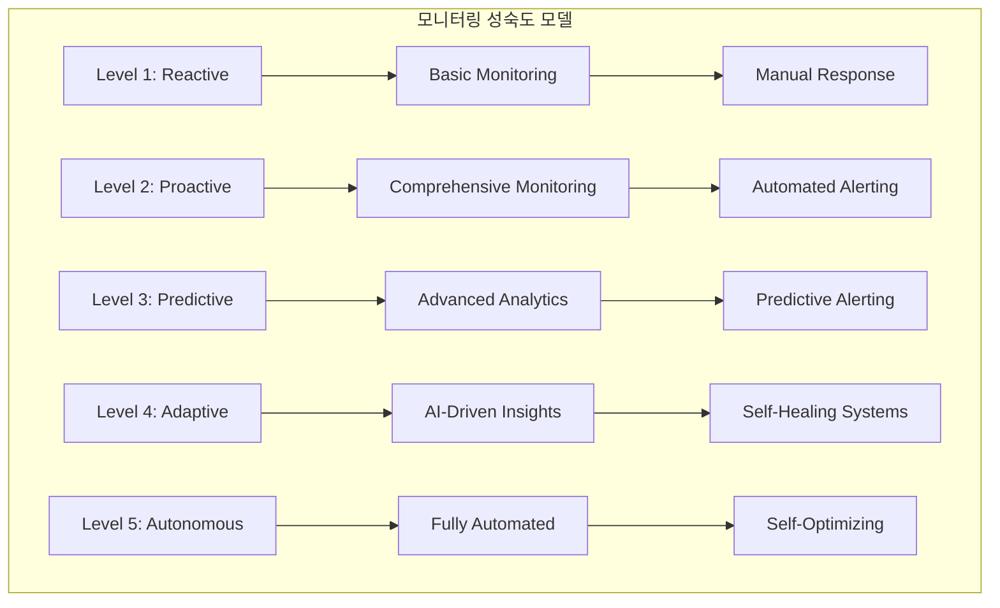
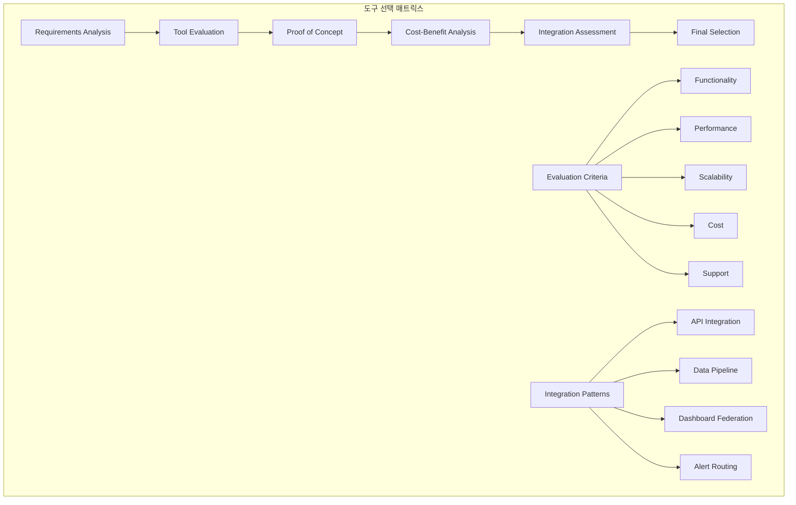
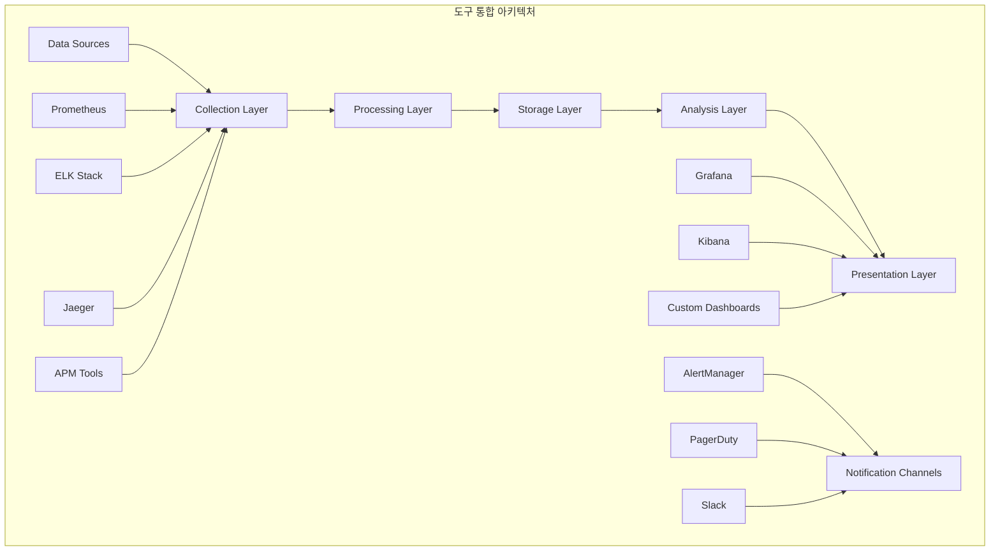
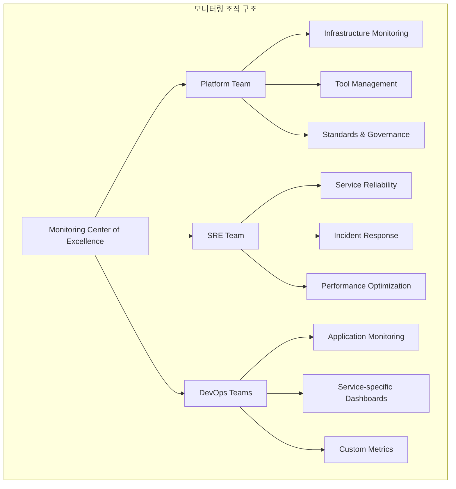

# Session 8: 모니터링 전략 수립과 운영 방안

## 📍 교과과정에서의 위치
이 세션은 **Week 3 > Day 3 > Session 8**로, 종합적인 모니터링 전략 설계와 효과적인 운영 방법을 학습합니다.

## 학습 목표 (5분)
- **종합적 모니터링 전략** 설계와 **통합 아키텍처** 구성 방법 이해
- **모니터링 도구 선택**과 **통합** 기준 및 방법론 학습
- **운영 팀 조직**과 **역할 분담** 체계 구축 방안 파악
- **지속적 개선**과 **최적화** 프로세스 수립 방법 습득

## 1. 종합적 모니터링 전략 설계 (15분)

### 모니터링 전략 프레임워크



### 모니터링 성숙도 모델



### 모니터링 전략 설계 방법론
```
종합적 모니터링 전략 설계:

전략 수립 프레임워크:
   🔹 비즈니스 목표 정렬:
      • 비즈니스 KPI와 기술 메트릭 연결
      • SLA/SLO 기반 모니터링 목표 설정
      • 고객 경험 중심 메트릭 정의
      • 비용 효율성 고려
      • 규정 준수 요구사항 반영
   🔹 이해관계자 요구사항:
      • 개발팀: 성능 최적화, 디버깅 지원
      • 운영팀: 안정성, 가용성, 문제 해결
      • 비즈니스팀: 비즈니스 메트릭, ROI 측정
      • 경영진: 고수준 대시보드, 비용 관리
      • 고객: 서비스 품질, 투명성
   🔹 기술적 요구사항:
      • 확장성: 데이터 볼륨 증가 대응
      • 성능: 낮은 지연시간, 높은 처리량
      • 신뢰성: 고가용성, 데이터 무결성
      • 보안: 데이터 보호, 접근 제어
      • 통합성: 기존 시스템과의 호환성
   🔹 운영 요구사항:
   🔹 사용 편의성: 직관적 인터페이스
   🔹 자동화: 반복 작업 자동화
   🔹 확장성: 팀 성장에 따른 확장
   🔹 교육: 학습 곡선 최소화
   🔹 지원: 벤더 지원, 커뮤니티

모니터링 아키텍처 설계:
   🔹 계층별 모니터링:
      • 인프라 계층: 서버, 네트워크, 스토리지
      • 플랫폼 계층: 컨테이너, 오케스트레이션
      • 애플리케이션 계층: 서비스, API, 데이터베이스
      • 비즈니스 계층: 사용자 경험, 비즈니스 프로세스
      • 보안 계층: 보안 이벤트, 컴플라이언스
   🔹 데이터 파이프라인:
      • 수집: 다양한 소스에서 데이터 수집
      • 전송: 안정적이고 효율적인 데이터 전송
      • 처리: 실시간 및 배치 데이터 처리
      • 저장: 확장 가능한 데이터 저장소
      • 분석: 실시간 분석 및 시각화
   🔹 통합 아키텍처:
      • 중앙집중식: 단일 모니터링 플랫폼
      • 분산형: 도메인별 전문 도구
      • 하이브리드: 중앙 집중 + 전문 도구
      • 페더레이션: 여러 시스템 연합
      • 마이크로서비스: 서비스별 모니터링
   🔹 데이터 거버넌스:
   🔹 데이터 품질 관리
   🔹 메타데이터 관리
   🔹 데이터 보존 정책
   🔹 접근 권한 관리
   🔹 개인정보 보호

모니터링 전략 유형:
   🔹 반응적 모니터링 (Reactive):
      • 문제 발생 후 대응
      • 임계값 기반 알림
      • 수동적 문제 해결
      • 기본적인 대시보드
      • 제한적인 자동화
   🔹 예방적 모니터링 (Proactive):
      • 문제 예방 중심
      • 트렌드 분석 기반 예측
      • 용량 계획 및 최적화
      • 포괄적인 모니터링
      • 자동화된 대응
   🔹 예측적 모니터링 (Predictive):
      • 머신러닝 기반 예측
      • 이상 탐지 알고리즘
      • 동적 임계값 조정
      • 예측적 스케일링
      • 지능형 알림
   🔹 적응적 모니터링 (Adaptive):
   🔹 자가 학습 시스템
   🔹 동적 모니터링 조정
   🔹 컨텍스트 인식 분석
   🔹 자동 최적화
   🔹 자율적 운영

성공 지표 및 KPI:
   🔹 기술적 KPI:
      • 시스템 가용성 (Uptime %)
      • 평균 복구 시간 (MTTR)
      • 평균 장애 간격 (MTBF)
      • 알림 정확도 (False Positive Rate)
      • 모니터링 커버리지 (Coverage %)
   🔹 운영 KPI:
      • 인시던트 대응 시간
      • 문제 해결률
      • 자동화 비율
      • 팀 생산성
      • 교육 및 역량 개발
   🔹 비즈니스 KPI:
      • 고객 만족도 (CSAT)
      • 서비스 품질 (SLA 준수율)
      • 비용 효율성 (ROI)
      • 시장 출시 시간 (Time to Market)
      • 비즈니스 연속성
   🔹 혁신 KPI:
   🔹 새로운 기술 도입률
   🔹 프로세스 개선 건수
   🔹 자동화 확대 범위
   🔹 데이터 기반 의사결정 비율
   🔹 지속적 학습 문화 지표

모니터링 전략 구현 로드맵:
   🔹 Phase 1 - 기반 구축 (3-6개월):
      • 핵심 인프라 모니터링
      • 기본 애플리케이션 모니터링
      • 중앙집중식 로깅
      • 기본 대시보드 구축
      • 알림 시스템 구축
   🔹 Phase 2 - 확장 및 통합 (6-12개월):
      • 분산 추적 도입
      • 고급 분석 기능
      • 자동화 확대
      • 보안 모니터링 강화
      • 비즈니스 메트릭 통합
   🔹 Phase 3 - 최적화 및 지능화 (12-18개월):
      • 머신러닝 기반 분석
      • 예측적 모니터링
      • 자동 복구 시스템
      • 성능 최적화 자동화
      • 고급 시각화
   🔹 Phase 4 - 혁신 및 자율화 (18개월+):
   🔹 AI 기반 운영
   🔹 자율적 시스템 관리
   🔹 지속적 혁신 프로세스
   🔹 생태계 통합
   🔹 미래 기술 실험
```

## 2. 모니터링 도구 선택과 통합 기준 (12분)

### 도구 선택 매트릭스



### 도구 통합 아키텍처



### 도구 선택 및 통합 전략
```
모니터링 도구 선택 및 통합:

도구 선택 기준:
   🔹 기능적 요구사항:
      • 모니터링 범위: 인프라, 애플리케이션, 비즈니스
      • 데이터 타입: 메트릭, 로그, 추적, 이벤트
      • 실시간 처리: 지연시간, 처리량 요구사항
      • 분석 기능: 쿼리, 집계, 시각화, 알림
      • 통합 기능: API, 플러그인, 커넥터
   🔹 비기능적 요구사항:
      • 성능: 응답시간, 처리량, 리소스 사용량
      • 확장성: 수평/수직 확장, 데이터 볼륨 처리
      • 가용성: 고가용성, 장애 허용성, 백업/복구
      • 보안: 인증, 권한, 암호화, 감사
      • 사용성: 학습곡선, UI/UX, 문서화
   🔹 운영적 요구사항:
      • 배포 및 설치: 복잡성, 자동화 지원
      • 구성 관리: 설정 복잡성, 버전 관리
      • 유지보수: 업그레이드, 패치, 백업
      • 모니터링: 자체 모니터링, 헬스체크
      • 문제해결: 디버깅, 로그, 지원 도구
   🔹 비즈니스 요구사항:
   🔹 비용: 라이선스, 인프라, 운영 비용
   🔹 벤더: 안정성, 지원 품질, 로드맵
   🔹 커뮤니티: 활성도, 생태계, 플러그인
   🔹 규정준수: 보안 인증, 컴플라이언스
   🔹 전략적 적합성: 기술 스택, 장기 계획

도구 카테고리별 선택 가이드:
   🔹 메트릭 모니터링:
      • Prometheus: 오픈소스, 쿠버네티스 친화적
      • InfluxDB: 시계열 전문, 고성능
      • Datadog: SaaS, 통합 플랫폼
      • New Relic: APM 통합, 사용 편의성
      • CloudWatch: AWS 네이티브, 관리형
   🔹 로그 관리:
      • ELK Stack: 오픈소스, 유연성
      • Splunk: 엔터프라이즈, 강력한 분석
      • Fluentd: 경량, 플러그인 생태계
      • Loki: Grafana 통합, 비용 효율적
      • 클라우드 로깅: 관리형, 확장성
   🔹 분산 추적:
      • Jaeger: 오픈소스, CNCF 프로젝트
      • Zipkin: 트위터 오픈소스, 성숙도
      • AWS X-Ray: AWS 통합, 관리형
      • Datadog APM: 통합 플랫폼
      • OpenTelemetry: 표준 기반, 벤더 중립
   🔹 시각화 및 대시보드:
      • Grafana: 오픈소스, 다양한 데이터소스
      • Kibana: ELK 통합, 로그 분석 특화
      • Tableau: 비즈니스 인텔리전스
      • Power BI: 마이크로소프트 생태계
      • 커스텀 대시보드: 특화된 요구사항
   🔹 알림 및 인시던트 관리:
   🔹 AlertManager: Prometheus 통합
   🔹 PagerDuty: 온콜 관리, 에스컬레이션
   🔹 Opsgenie: Atlassian 생태계
   🔹 VictorOps: 협업 중심
   🔹 ServiceNow: ITSM 통합

통합 패턴 및 전략:
   🔹 데이터 통합:
      • ETL/ELT 파이프라인: 배치 데이터 통합
      • 스트리밍: 실시간 데이터 통합
      • API 통합: RESTful API, GraphQL
      • 메시지 큐: Kafka, RabbitMQ
      • 데이터 레이크: 중앙집중식 데이터 저장
   🔹 시각화 통합:
      • 대시보드 페더레이션: 여러 도구 통합 뷰
      • 임베딩: 기존 시스템에 차트 임베딩
      • 단일 창구: 통합 포털 구축
      • 컨텍스트 전환: 도구 간 매끄러운 이동
      • 일관된 UX: 통일된 사용자 경험
   🔹 알림 통합:
      • 중앙집중식 알림: 단일 알림 엔진
      • 알림 라우팅: 규칙 기반 라우팅
      • 중복 제거: 동일 이벤트 중복 방지
      • 에스컬레이션: 계층적 알림 전달
      • 피드백 루프: 알림 품질 개선
   🔹 워크플로우 통합:
   🔹 자동화: 반복 작업 자동화
   🔹 오케스트레이션: 복잡한 워크플로우 관리
   🔹 승인 프로세스: 변경 관리 통합
   🔹 티켓 시스템: ITSM 도구 연동
   🔹 ChatOps: 채팅 기반 운영

통합 아키텍처 패턴:
   🔹 중앙집중식 아키텍처:
      • 단일 모니터링 플랫폼
      • 모든 데이터 중앙 수집
      • 통일된 인터페이스
      • 간단한 관리
      • 벤더 종속성 위험
   🔹 분산형 아키텍처:
      • 도메인별 전문 도구
      • 각 도구 최적화
      • 유연성 및 확장성
      • 복잡한 통합
      • 일관성 유지 어려움
   🔹 하이브리드 아키텍처:
      • 중앙 집중 + 전문 도구
      • 핵심 기능 중앙화
      • 특화 기능 분산
      • 균형잡힌 접근
      • 복잡성 관리 필요
   🔹 마이크로서비스 아키텍처:
   🔹 서비스별 모니터링
   🔹 독립적 도구 선택
   🔹 서비스 자율성
   🔹 표준화 필요
   🔹 전체 가시성 확보 어려움

도구 평가 및 선택 프로세스:
   🔹 요구사항 정의:
      • 기능 요구사항 명세
      • 비기능 요구사항 정의
      • 제약사항 식별
      • 우선순위 설정
      • 성공 기준 정의
   🔹 시장 조사 및 후보 선정:
      • 시장 동향 분석
      • 벤더 평가
      • 커뮤니티 활성도 조사
      • 레퍼런스 확인
      • 후보 도구 선정
   🔹 개념 증명 (PoC):
      • 테스트 환경 구축
      • 핵심 기능 검증
      • 성능 테스트
      • 통합 테스트
      • 사용성 평가
   🔹 비용 편익 분석:
      • 총 소유 비용 (TCO) 계산
      • 투자 대비 효과 (ROI) 분석
      • 위험 평가
      • 대안 비교
      • 재무적 정당성 확보
   🔹 최종 선택 및 계획:
   🔹 평가 결과 종합
   🔹 이해관계자 합의
   🔹 구현 계획 수립
   🔹 위험 관리 계획
   🔹 성공 지표 설정
```

## 3. 운영 팀 조직과 역할 분담 체계 (10분)

### 모니터링 조직 구조



### 운영 모델 및 역할 분담
```
운영 팀 조직 및 역할 분담:

조직 모델:
   🔹 중앙집중형 모델:
      • 전담 모니터링 팀
      • 표준화된 도구 및 프로세스
      • 일관된 서비스 품질
      • 전문성 집중
      • 확장성 제한 가능
   🔹 분산형 모델:
      • 팀별 자율적 모니터링
      • 서비스별 특화 모니터링
      • 빠른 의사결정
      • 높은 유연성
      • 일관성 유지 어려움
   🔹 하이브리드 모델:
      • 중앙 플랫폼 + 팀별 운영
      • 표준화 + 유연성
      • 전문성 + 자율성
      • 효율성 + 혁신
      • 복잡한 조율 필요
   🔹 CoE (Center of Excellence) 모델:
   🔹 모니터링 우수성 센터
   🔹 표준 및 가이드라인 제공
   🔹 도구 평가 및 선정
   🔹 교육 및 지원
   🔹 지속적 개선 주도

역할 및 책임:
   🔹 모니터링 플랫폼 팀:
      • 모니터링 인프라 구축 및 운영
      • 도구 설치, 구성, 업그레이드
      • 데이터 파이프라인 관리
      • 성능 최적화 및 확장
      • 보안 및 백업 관리
   🔹 SRE (Site Reliability Engineering) 팀:
      • 서비스 신뢰성 목표 설정
      • SLI/SLO/SLA 정의 및 관리
│   ���── 인시던트 대응 및 사후 분석
      • 용량 계획 및 성능 최적화
      • 자동화 및 도구 개발
   🔹 DevOps 팀:
      • 애플리케이션별 모니터링 구현
      • 커스텀 메트릭 및 대시보드
      • 배포 파이프라인 모니터링
      • 개발-운영 협업 촉진
      • 지속적 개선 실행
   🔹 보안 팀:
      • 보안 모니터링 및 분석
      • 위협 탐지 및 대응
      • 컴플라이언스 모니터링
      • 보안 정책 수립 및 시행
      • 보안 인시던트 관리
   🔹 비즈니스 분석 팀:
   🔹 비즈니스 메트릭 정의
   🔹 비즈니스 대시보드 구축
   🔹 데이터 분석 및 인사이트
   🔹 비즈니스 영향 분석
   🔹 의사결정 지원

운영 프로세스:
   🔹 일상 운영:
      • 시스템 헬스 체크
      • 알림 모니터링 및 대응
      • 성능 트렌드 분석
      • 용량 사용률 검토
      • 일일 운영 리포트
   🔹 주간 운영:
      • 주간 성능 리뷰
      • 인시던트 분석 및 개선
      • 용량 계획 업데이트
      • 도구 및 프로세스 개선
      • 팀 간 협업 회의
   🔹 월간 운영:
      • 월간 서비스 리뷰
      • SLA/SLO 성과 평가
      • 비용 분석 및 최적화
      • 도구 업그레이드 계획
      • 교육 및 역량 개발
   🔹 분기별 운영:
   🔹 전략적 리뷰 및 계획
   🔹 도구 및 아키텍처 평가
   🔹 예산 계획 및 승인
   🔹 조직 및 프로세스 개선
   🔹 벤치마킹 및 업계 동향 분석
```

## 💬 그룹 토론: 모니터링 조직의 미래 (8분)

### 토론 주제
**"AI와 자동화 기술의 발전으로 모니터링 조직과 역할이 어떻게 변화할 것이며, 이에 대비하기 위한 전략은 무엇인가?"**

### 토론 가이드라인

#### 기술 변화의 영향 (3분)
- AI/ML 도입: 이상 탐지, 예측 분석, 자동 대응의 확산
- 자동화 확대: 반복 작업의 자동화, 인간 개입 최소화
- 클라우드 네이티브: 서버리스, 컨테이너, 마이크로서비스 환경

#### 조직 및 역할 변화 (3분)
- 새로운 역할: AI 엔지니어, 데이터 사이언티스트, 자동화 전문가
- 기존 역할 진화: 운영자 → 플랫폼 엔지니어, 분석가 → 인사이트 전문가
- 스킬 요구사항: 코딩 능력, 데이터 분석, 비즈니스 이해

#### 대비 전략 (2분)
- 교육 및 재교육: 지속적 학습, 새로운 기술 습득
- 조직 문화: 실험 문화, 실패 허용, 지속적 개선
- 파트너십: 벤더, 커뮤니티, 학계와의 협력

## 💡 핵심 개념 정리
- 전략적 접근: 비즈니스 목표와 정렬된 종합적 모니터링 전략
- 도구 통합: 기능, 성능, 비용을 고려한 체계적 도구 선택과 통합
- 조직 운영: 역할 분담과 프로세스를 통한 효과적 운영 체계
- 지속적 개선: 변화하는 환경에 적응하는 진화하는 모니터링

## 📚 참고 자료
- [Monitoring Strategy Guide](https://www.atlassian.com/incident-management/kpis-metrics/monitoring-strategy)
- [SRE Workbook - Monitoring](https://sre.google/workbook/monitoring/)
- [CNCF Observability Whitepaper](https://github.com/cncf/tag-observability/blob/main/whitepaper.md)
- [Monitoring and Observability Best Practices](https://www.oreilly.com/library/view/monitoring-and-observability/9781492033431/)

## Day 3 마무리
오늘 학습한 관찰 가능성과 모니터링을 통해 Kubernetes 환경에서의 시스템 상태를 효과적으로 파악하고 분석하는 방법을 이해했습니다. 다음 Day 4에서는 **Service Mesh와 마이크로서비스 통신**에 대해 학습할 예정입니다.