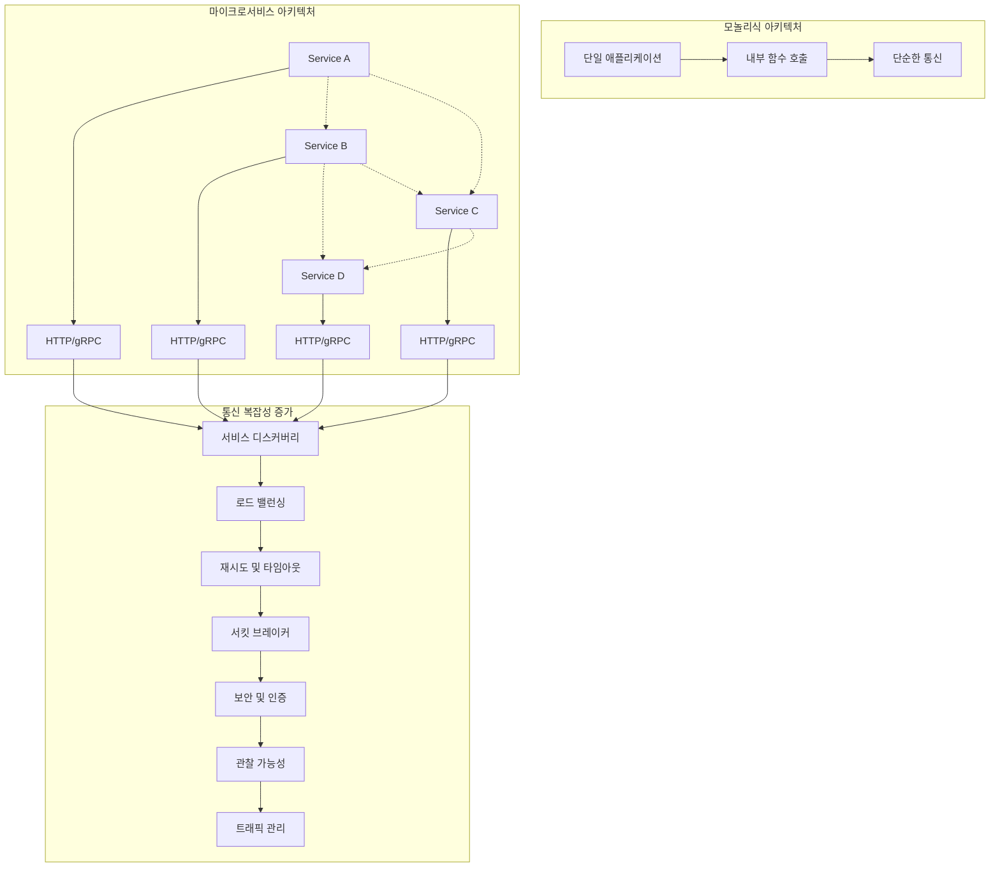
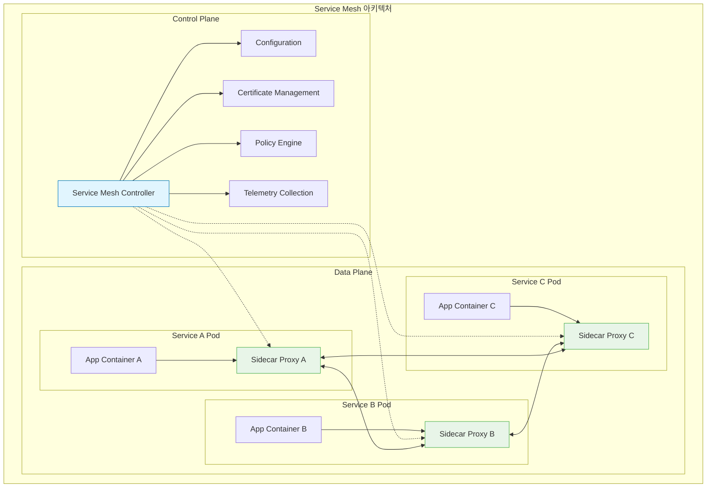
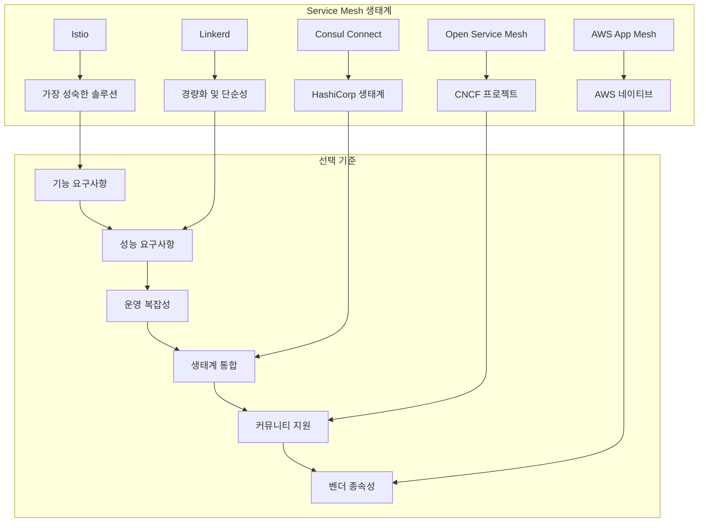
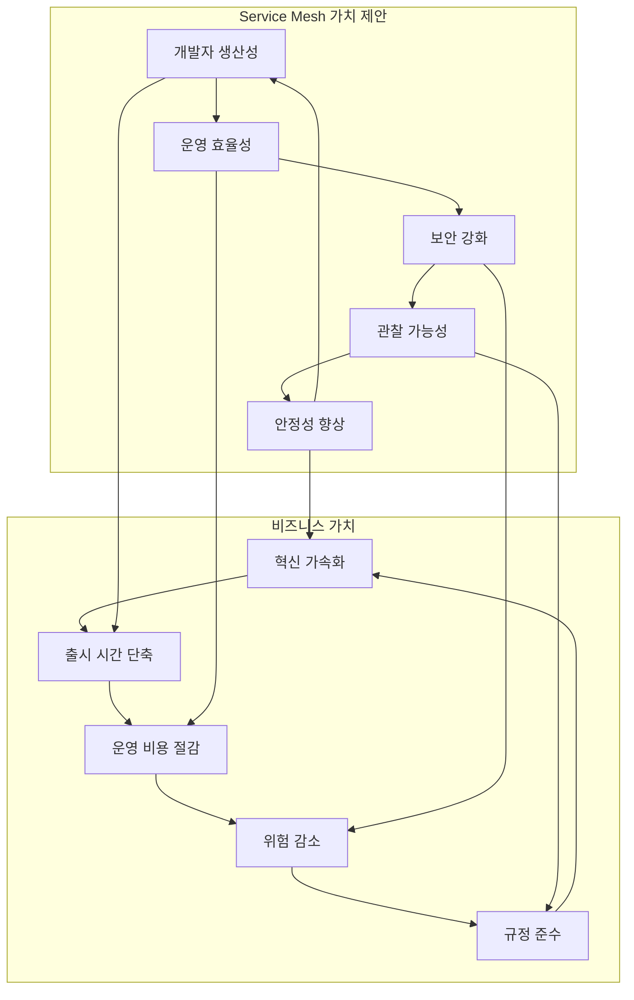

# Session 1: Service Mesh 개념과 아키텍처

## 📍 교과과정에서의 위치
이 세션은 **Week 3 > Day 4 > Session 1**로, 현대 마이크로서비스 아키텍처의 핵심인 Service Mesh 개념을 학습합니다. Week 2에서 학습한 Kubernetes 네트워킹과 Week 3에서 다룬 고급 워크로드 관리를 바탕으로, 복잡한 서비스 간 통신 문제를 해결하는 Service Mesh의 필요성과 아키텍처를 이해합니다.

## 학습 목표 (5분)
- **Service Mesh** 등장 배경과 **마이크로서비스 통신 문제** 완전 이해
- **사이드카 패턴**과 **데이터 플레인/컨트롤 플레인** 아키텍처 학습
- **주요 Service Mesh 솔루션** 비교와 **선택 기준** 파악
- **Service Mesh**가 해결하는 **핵심 문제**와 **가치 제안** 이해

## 1. Service Mesh 등장 배경과 마이크로서비스 통신 문제 (15분)

### 마이크로서비스 아키텍처의 통신 복잡성



### 마이크로서비스 통신 문제점 분석
```
마이크로서비스 통신의 핵심 문제:

1. 서비스 디스커버리 복잡성:
   🔹 동적 서비스 위치 관리:
      • 서비스 인스턴스의 동적 생성/삭제
      • IP 주소와 포트의 지속적 변경
      • 다중 환경(dev, staging, prod) 관리
      • 클라우드 환경에서의 자동 스케일링
      • 장애 시 서비스 인스턴스 교체
   🔹 서비스 레지스트리 관리:
      • 중앙화된 서비스 목록 유지
      • 헬스 체크를 통한 가용성 확인
      • 메타데이터 관리 (버전, 태그, 속성)
      • 서비스 의존성 추적
      • 네트워크 분할 시 일관성 보장
   🔹 클라이언트 사이드 로직:
   🔹 각 서비스에 디스커버리 로직 구현
   🔹 캐싱 및 새로고침 메커니즘
   🔹 장애 처리 및 폴백 로직
   🔹 로드 밸런싱 알고리즘 선택
   🔹 언어별 라이브러리 의존성

2. 로드 밸런싱과 트래픽 관리:
   🔹 로드 밸런싱 전략:
      • 라운드 로빈, 가중치, 최소 연결
      • 지연 시간 기반 라우팅
      • 지리적 위치 기반 분산
      • 헬스 상태 기반 트래픽 제어
      • 동적 가중치 조정
   🔹 트래픽 분할:
      • 카나리 배포를 위한 트래픽 분할
      • A/B 테스트 트래픽 라우팅
      • 블루-그린 배포 지원
      • 점진적 롤아웃 제어
      • 사용자 기반 라우팅
   🔹 고급 라우팅:
   🔹 헤더 기반 라우팅
   🔹 경로 기반 라우팅
   🔹 쿼리 매개변수 기반 라우팅
   🔹 사용자 에이전트 기반 라우팅
   🔹 지역 기반 라우팅

3. 장애 처리와 복원력:
   🔹 재시도 메커니즘:
      • 지수 백오프 재시도
      • 재시도 횟수 제한
      • 재시도 가능한 오류 분류
      • 재시도 지터 추가
      • 재시도 예산 관리
   🔹 서킷 브레이커:
      • 장애 서비스 자동 차단
      • 반개방 상태 관리
      • 장애 임계값 설정
      • 복구 감지 메커니즘
      • 폴백 응답 제공
   🔹 타임아웃 관리:
      • 연결 타임아웃 설정
      • 읽기 타임아웃 설정
      • 전체 요청 타임아웃
      • 계층적 타임아웃 전략
      • 적응형 타임아웃 조정
   🔹 벌크헤드 패턴:
   🔹 리소스 격리
   🔹 스레드 풀 분리
   🔹 연결 풀 분리
   🔹 장애 전파 방지
   🔹 부분 서비스 가용성 보장

4. 보안과 인증:
   🔹 서비스 간 인증:
      • 상호 TLS (mTLS) 구현
      • JWT 토큰 기반 인증
      • API 키 관리
      • OAuth 2.0 / OpenID Connect
      • 서비스 계정 관리
   🔹 권한 부여:
      • RBAC (역할 기반 접근 제어)
      • ABAC (속성 기반 접근 제어)
      • 세밀한 권한 정책
      • 동적 권한 평가
      • 감사 로깅
   🔹 데이터 보호:
      • 전송 중 암호화
      • 저장 시 암호화
      • 키 관리 및 로테이션
      • 민감 데이터 마스킹
      • 데이터 분류 및 보호
   🔹 네트워크 보안:
   🔹 네트워크 분할
   🔹 방화벽 규칙 관리
   🔹 침입 탐지 시스템
   🔹 DDoS 보호
   🔹 취약점 스캔

5. 관찰 가능성과 모니터링:
   🔹 분산 추적:
      • 요청 경로 추적
      • 지연 시간 분석
      • 병목 지점 식별
      • 오류 전파 추적
      • 성능 프로파일링
   🔹 메트릭 수집:
      • 비즈니스 메트릭
      • 시스템 메트릭
      • 네트워크 메트릭
      • 애플리케이션 메트릭
      • 사용자 경험 메트릭
   🔹 로깅:
      • 구조화된 로깅
      • 상관 관계 ID
      • 로그 집계 및 검색
      • 로그 레벨 관리
      • 로그 보존 정책
   🔹 알림 및 대시보드:
   🔹 실시간 알림 시스템
   🔹 SLA/SLO 모니터링
   🔹 비즈니스 대시보드
   🔹 운영 대시보드
   🔹 인시던트 관리

전통적 해결 방법의 한계:
   🔹 애플리케이션 레벨 구현:
      • 각 서비스에 중복 로직 구현
      • 언어별 라이브러리 의존성
      • 일관성 없는 구현
      • 유지보수 복잡성 증가
      • 개발자 생산성 저하
   🔹 인프라 레벨 해결책:
      • 로드 밸런서의 제한된 기능
      • API 게이트웨이의 중앙 집중화
      • 네트워크 장비의 복잡성
      • 클라우드 서비스 종속성
      • 확장성 및 유연성 제한
   🔹 운영 복잡성:
   🔹 다양한 도구와 플랫폼 관리
   🔹 설정 불일치 문제
   🔹 디버깅 및 문제 해결 어려움
   🔹 팀 간 협업 복잡성
   🔹 기술 부채 누적
```

## 2. 사이드카 패턴과 Service Mesh 아키텍처 (12분)

### Service Mesh 아키텍처 개요



### Service Mesh 핵심 구성 요소
```
Service Mesh 아키텍처 구성:

1. 데이터 플레인 (Data Plane):
   🔹 사이드카 프록시:
      • 모든 네트워크 트래픽 가로채기
      • 로드 밸런싱 및 라우팅 수행
      • 보안 정책 적용 (mTLS)
      • 텔레메트리 데이터 수집
      • 장애 처리 및 복원력 제공
      • 트래픽 제어 및 정책 적용
   🔹 프록시 기능:
      • L4/L7 로드 밸런싱
      • 서비스 디스커버리 통합
      • 헬스 체크 및 장애 감지
      • 메트릭 및 로그 생성
      • 분산 추적 지원
      • 동적 구성 업데이트
   🔹 사이드카 주입:
      • 자동 사이드카 주입
      • 수동 사이드카 구성
      • 선택적 서비스 적용
      • 네임스페이스 기반 정책
      • 어노테이션 기반 제어
   🔹 네트워크 투명성:
   🔹 애플리케이션 코드 변경 없음
   🔹 기존 서비스와 호환성
   🔹 점진적 도입 가능
   🔹 언어 독립적 구현
   🔹 레거시 시스템 통합

2. 컨트롤 플레인 (Control Plane):
   🔹 구성 관리:
      • 서비스 메시 정책 정의
      • 라우팅 규칙 관리
      • 보안 정책 배포
      • 트래픽 관리 규칙
      • 동적 구성 업데이트
   🔹 서비스 디스커버리:
      • 서비스 레지스트리 통합
      • 엔드포인트 자동 발견
      • 헬스 상태 추적
      • 로드 밸런싱 정보 제공
      • 서비스 메타데이터 관리
   🔹 인증서 관리:
      • 자동 인증서 발급
      • 인증서 로테이션
      • mTLS 구성 자동화
      • 루트 CA 관리
      • 인증서 유효성 검증
   🔹 정책 엔진:
      • 접근 제어 정책
      • 트래픽 정책 적용
      • 보안 정책 시행
      • 규정 준수 확인
      • 정책 위반 감지
   🔹 텔레메트리:
   🔹 메트릭 수집 및 집계
   🔹 분산 추적 데이터 처리
   🔹 로그 수집 및 분석
   🔹 성능 모니터링
   🔹 알림 및 대시보드

3. 사이드카 패턴의 장점:
   🔹 관심사 분리:
      • 비즈니스 로직과 인프라 로직 분리
      • 개발팀과 플랫폼팀 역할 분담
      • 독립적인 업데이트 및 배포
      • 기술 스택 독립성
      • 재사용 가능한 인프라 컴포넌트
   🔹 투명성:
      • 애플리케이션 코드 변경 불필요
      • 기존 서비스와의 호환성
      • 점진적 마이그레이션 지원
      • 다양한 언어 및 프레임워크 지원
      • 레거시 시스템 통합 용이
   🔹 일관성:
      • 모든 서비스에 동일한 기능 제공
      • 표준화된 정책 적용
      • 중앙집중식 관리
      • 일관된 보안 및 모니터링
      • 통합된 운영 경험
   🔹 확장성:
   🔹 수평적 확장 지원
   🔹 동적 구성 업데이트
   🔹 플러그인 아키텍처
   🔹 커스텀 정책 지원
   🔹 다중 클러스터 지원

4. 사이드카 패턴의 고려사항:
   🔹 성능 오버헤드:
      • 추가 네트워크 홉
      • 프록시 처리 지연
      • 메모리 및 CPU 사용량 증가
      • 네트워크 대역폭 사용
      • 처리량 영향 분석
   🔹 운영 복잡성:
      • 추가 컴포넌트 관리
      • 디버깅 복잡성 증가
      • 장애 지점 증가
      • 모니터링 범위 확대
      • 전문 지식 요구
   🔹 리소스 사용량:
      • 각 Pod에 추가 컨테이너
      • 메모리 오버헤드
      • CPU 사용량 증가
      • 스토리지 요구사항
      • 네트워크 리소스 사용
   🔹 보안 고려사항:
   🔹 사이드카 보안 강화
   🔹 권한 최소화 원칙
   🔹 네트워크 정책 적용
   🔹 이미지 보안 스캔
   🔹 런타임 보안 모니터링
```

## 3. 주요 Service Mesh 솔루션 비교 (10분)

### Service Mesh 솔루션 비교 매트릭스



### Service Mesh 솔루션 상세 비교
```
주요 Service Mesh 솔루션 비교:

1. Istio:
   🔹 장점:
      • 가장 성숙하고 기능이 풍부한 솔루션
      • 강력한 트래픽 관리 및 보안 기능
      • 광범위한 생태계 통합
      • 활발한 커뮤니티와 기업 지원
      • 다양한 배포 모델 지원
      • 풍부한 문서와 학습 자료
   🔹 단점:
      • 높은 복잡성과 학습 곡선
      • 리소스 사용량이 상대적으로 높음
      • 설정 및 관리 복잡성
      • 업그레이드 복잡성
      • 오버엔지니어링 위험
   🔹 적합한 환경:
      • 대규모 엔터프라이즈 환경
      • 복잡한 마이크로서비스 아키텍처
      • 고급 트래픽 관리 요구사항
      • 강력한 보안 정책 필요
      • 다양한 클라우드 환경
   🔹 핵심 기능:
   🔹 Envoy 기반 데이터 플레인
   🔹 강력한 트래픽 관리
   🔹 자동 mTLS 및 보안 정책
   🔹 풍부한 텔레메트리
   🔹 다중 클러스터 지원

2. Linkerd:
   🔹 장점:
      • 경량화되고 성능 최적화
      • 간단한 설치 및 관리
      • 낮은 리소스 사용량
      • 우수한 관찰 가능성
      • 빠른 시작과 학습 용이성
      • 안정적이고 신뢰할 수 있는 구현
   🔹 단점:
      • 상대적으로 제한된 기능
      • 생태계 통합 범위 제한
      • 고급 트래픽 관리 기능 부족
      • 커스터마이징 옵션 제한
      • 엔터프라이즈 기능 부족
   🔹 적합한 환경:
      • 중소규모 마이크로서비스
      • 성능이 중요한 환경
      • 단순함을 선호하는 팀
      • 리소스 제약이 있는 환경
      • 빠른 도입이 필요한 프로젝트
   🔹 핵심 기능:
   🔹 Rust 기반 경량 프록시
   🔹 자동 mTLS
   🔹 실시간 메트릭 및 대시보드
   🔹 트래픽 분할
   🔹 간단한 정책 관리

3. Consul Connect:
   🔹 장점:
      • HashiCorp 생태계 통합
      • 다양한 플랫폼 지원 (K8s, VM, 컨테이너)
      • 강력한 서비스 디스커버리
      • 네이티브 Consul 통합
      • 하이브리드 클라우드 지원
      • 기존 Consul 사용자에게 친숙
   🔹 단점:
      • Kubernetes 네이티브 기능 제한
      • 상대적으로 작은 커뮤니티
      • 학습 자료 부족
      • 복잡한 멀티 플랫폼 관리
      • 벤더 종속성
   🔹 적합한 환경:
      • HashiCorp 도구 사용 조직
      • 하이브리드 클라우드 환경
      • VM과 컨테이너 혼재 환경
      • 기존 Consul 인프라 보유
      • 다중 플랫폼 지원 필요
   🔹 핵심 기능:
   🔹 서비스 디스커버리 및 구성
   🔹 자동 mTLS
   🔹 의도 기반 네트워킹
   🔹 다중 데이터센터 지원
   🔹 Envoy 프록시 통합

4. AWS App Mesh:
   🔹 장점:
      • AWS 서비스와 네이티브 통합
      • 관리형 서비스로 운영 부담 감소
      • AWS 보안 모델 통합
      • 자동 스케일링 및 고가용성
      • AWS 생태계 최적화
      • 엔터프라이즈 지원
   🔹 단점:
      • AWS 플랫폼 종속성
      • 멀티 클라우드 지원 제한
      • 커스터마이징 옵션 제한
      • 오픈소스 생태계 통합 제한
      • 벤더 락인 위험
   🔹 적합한 환경:
      • AWS 중심 인프라
      • 관리형 서비스 선호
      • AWS 네이티브 통합 필요
      • 엔터프라이즈 지원 요구
      • 운영 복잡성 최소화
   🔹 핵심 기능:
   🔹 Envoy 기반 데이터 플레인
   🔹 AWS 서비스 통합
   🔹 자동 인증서 관리
   🔹 CloudWatch 통합
   🔹 X-Ray 분산 추적

5. Open Service Mesh (OSM):
   🔹 장점:
      • CNCF 프로젝트로 벤더 중립성
      • SMI (Service Mesh Interface) 준수
      • 경량화된 구현
      • 오픈소스 생태계 통합
      • 표준화된 API
      • 커뮤니티 기반 개발
   🔹 단점:
      • 상대적으로 새로운 프로젝트
      • 제한된 기능과 성숙도
      • 작은 커뮤니티
      • 엔터프라이즈 지원 부족
      • 프로덕션 사례 부족
   🔹 적합한 환경:
      • 벤더 중립성 중요시
      • 표준 기반 솔루션 선호
      • 오픈소스 생태계 활용
      • 실험적 프로젝트
      • 커뮤니티 기여 의향
   🔹 핵심 기능:
   🔹 SMI 표준 준수
   🔹 Envoy 기반 프록시
   🔹 자동 mTLS
   🔹 트래픽 정책
   🔹 관찰 가능성

선택 기준 매트릭스:
   🔹 기능 요구사항:
      • 고급 트래픽 관리: Istio > Consul > Linkerd
      • 보안 정책: Istio > App Mesh > Linkerd
      • 관찰 가능성: Linkerd > Istio > OSM
      • 확장성: Istio > App Mesh > Consul
   🔹 성능 요구사항:
      • 지연 시간: Linkerd > OSM > Istio
      • 처리량: Linkerd > Consul > Istio
      • 리소스 사용량: Linkerd > OSM > Istio
      • 확장성: Istio > App Mesh > Linkerd
   🔹 운영 복잡성:
      • 설치 용이성: Linkerd > OSM > App Mesh > Istio
      • 관리 복잡성: App Mesh > Linkerd > OSM > Istio
      • 업그레이드: Linkerd > App Mesh > OSM > Istio
      • 디버깅: Linkerd > OSM > Consul > Istio
   🔹 생태계 통합:
   🔹 Kubernetes 네이티브: Istio > Linkerd > OSM
   🔹 클라우드 통합: App Mesh > Istio > Consul
   🔹 모니터링 도구: Istio > Linkerd > Consul
   🔹 CI/CD 통합: Istio > OSM > Linkerd
```

## 4. Service Mesh가 해결하는 핵심 문제와 가치 제안 (10분)

### Service Mesh 가치 제안 분석



### Service Mesh 핵심 가치 분석
```
Service Mesh의 핵심 가치 제안:

1. 개발자 생산성 향상:
   🔹 인프라 로직 추상화:
      • 비즈니스 로직에 집중 가능
      • 네트워킹 복잡성 숨김
      • 보안 구현 자동화
      • 모니터링 로직 분리
      • 언어 독립적 구현
   🔹 개발 속도 향상:
      • 공통 기능 재사용
      • 표준화된 패턴
      • 자동화된 구성
      • 빠른 프로토타이핑
      • 테스트 환경 구축 용이
   🔹 코드 품질 개선:
      • 관심사 분리 원칙 적용
      • 중복 코드 제거
      • 일관된 오류 처리
      • 표준화된 로깅
      • 재사용 가능한 컴포넌트
   🔹 학습 곡선 완화:
   🔹 분산 시스템 복잡성 숨김
   🔹 표준화된 API
   🔹 풍부한 문서와 예제
   🔹 커뮤니티 지원
   🔹 모범 사례 내장

2. 운영 효율성 증대:
   🔹 중앙집중식 관리:
      • 통합된 정책 관리
      • 일관된 구성 적용
      • 중앙화된 모니터링
      • 통합 대시보드
      • 자동화된 운영 작업
   🔹 운영 가시성 향상:
      • 실시간 메트릭 수집
      • 분산 추적 지원
      • 서비스 토폴로지 시각화
      • 성능 병목 지점 식별
      • 용량 계획 데이터 제공
   🔹 자동화된 운영:
      • 자동 서비스 디스커버리
      • 동적 로드 밸런싱
      • 자동 장애 복구
      • 인증서 자동 관리
      • 정책 자동 적용
   🔹 운영 표준화:
   🔹 일관된 운영 절차
   🔹 표준화된 메트릭
   🔹 통합된 로깅 형식
   🔹 공통 알림 규칙
   🔹 표준 대시보드

3. 보안 강화:
   🔹 제로 트러스트 아키텍처:
      • 기본적으로 모든 통신 암호화
      • 서비스 간 상호 인증
      • 세밀한 접근 제어
      • 최소 권한 원칙 적용
      • 지속적인 보안 검증
   🔹 자동화된 보안:
      • 자동 인증서 발급 및 갱신
      • 정책 기반 접근 제어
      • 자동 보안 패치 적용
      • 실시간 위협 탐지
      • 자동 보안 정책 적용
   🔹 규정 준수:
      • 감사 로그 자동 생성
      • 데이터 보호 정책 적용
      • 접근 기록 추적
      • 보안 표준 준수
      • 컴플라이언스 보고서 생성
   🔹 보안 가시성:
   🔹 보안 이벤트 모니터링
   🔹 위협 인텔리전스 통합
   🔹 보안 메트릭 수집
   🔹 보안 대시보드
   🔹 인시던트 대응 지원

4. 안정성 및 복원력:
   🔹 장애 격리:
      • 서킷 브레이커 패턴
      • 벌크헤드 격리
      • 타임아웃 관리
      • 재시도 메커니즘
      • 폴백 응답
   🔹 트래픽 관리:
      • 지능형 로드 밸런싱
      • 트래픽 분할
      • 카나리 배포
      • 블루-그린 배포
      • A/B 테스트
   🔹 자동 복구:
      • 헬스 체크 기반 복구
      • 자동 재시작
      • 장애 서비스 우회
      • 동적 라우팅 조정
      • 자동 스케일링
   🔹 성능 최적화:
   🔹 지연 시간 최적화
   🔹 처리량 향상
   🔹 리소스 효율성
   🔹 캐싱 전략
   🔹 연결 풀링

5. 비즈니스 가치:
   🔹 출시 시간 단축:
      • 빠른 개발 사이클
      • 자동화된 배포
      • 안전한 실험
      • 빠른 롤백
      • 지속적 배포
   🔹 비용 절감:
      • 운영 인력 절약
      • 인프라 효율성
      • 자동화를 통한 비용 절감
      • 장애 비용 감소
      • 개발 생산성 향상
   🔹 위험 관리:
      • 보안 위험 감소
      • 운영 위험 최소화
      • 규정 준수 위험 관리
      • 기술 부채 감소
      • 벤더 종속성 관리
   🔹 혁신 가속화:
   🔹 새로운 기능 빠른 실험
   🔹 마이크로서비스 아키텍처 활용
   🔹 클라우드 네이티브 전환
   🔹 데이터 기반 의사결정
   🔹 지속적 개선 문화
```

## 💬 그룹 토론: Service Mesh 도입 시점과 고려사항 (8분)

### 토론 주제
**"조직에서 Service Mesh를 도입해야 하는 시점은 언제이며, 도입 시 가장 중요하게 고려해야 할 요소는 무엇인가?"**

### 토론 가이드라인

#### 도입 시점 판단 기준 (3분)
- 서비스 규모: 마이크로서비스 개수와 복잡성
- 통신 복잡성: 서비스 간 통신 패턴과 요구사항
- 보안 요구사항: 규정 준수와 보안 정책 필요성

#### 도입 고려사항 (3분)
- 기술적 준비도: 팀의 기술 역량과 학습 의지
- 운영 복잡성: 추가적인 운영 부담과 관리 복잡성
- 성능 영향: 지연 시간과 리소스 오버헤드

#### 성공 요인 (2분)
- 점진적 도입: 단계적 마이그레이션 전략
- 팀 교육: 충분한 학습과 실습 기회
- 모니터링: 도입 효과 측정과 지속적 개선

## 💡 핵심 개념 정리
- Service Mesh: 마이크로서비스 간 통신을 관리하는 인프라 계층
- 사이드카 패턴: 애플리케이션과 분리된 프록시를 통한 투명한 기능 제공
- 데이터/컨트롤 플레인: 트래픽 처리와 정책 관리의 분리된 아키텍처
- 가치 제안: 개발 생산성, 운영 효율성, 보안 강화, 안정성 향상

## 📚 참고 자료
- [Service Mesh Patterns](https://www.manning.com/books/service-mesh-patterns)
- [CNCF Service Mesh Landscape](https://landscape.cncf.io/card-mode?category=service-mesh)
- [Service Mesh Comparison](https://servicemesh.es/)
- [Istio Documentation](https://istio.io/latest/docs/)

## 다음 세션 준비
다음 세션에서는 **Istio 구조와 핵심 컴포넌트**에 대해 학습합니다. Istio의 아키텍처, Envoy 프록시, 그리고 주요 컴포넌트들의 역할과 상호작용을 상세히 분석할 예정입니다.