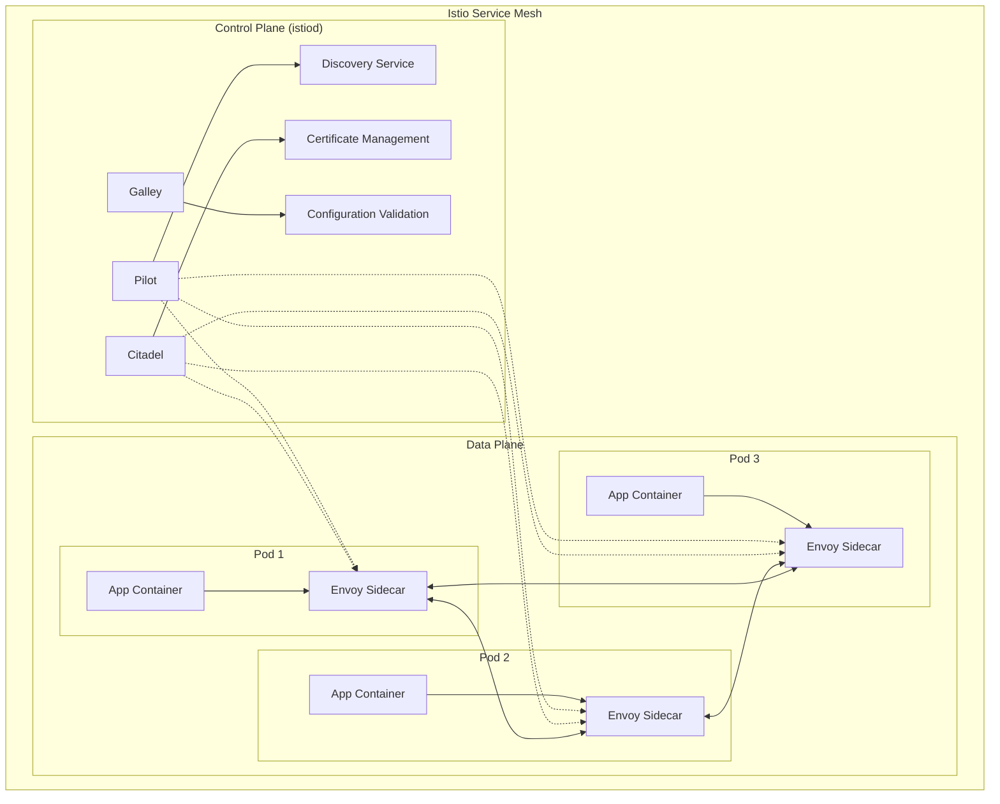
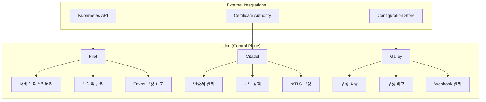
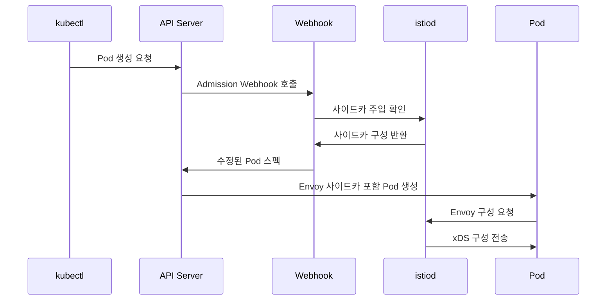

# Session 2: Istio 구조와 핵심 컴포넌트

## 📍 교과과정에서의 위치
이 세션은 **Week 3 > Day 4 > Session 2**로, Istio의 구체적인 아키텍처와 핵심 컴포넌트를 학습합니다.

## 학습 목표 (5분)
- **Istio 아키텍처**와 **설계 원칙** 완전 이해
- **Envoy 프록시**와 **사이드카 주입** 메커니즘 학습
- **Pilot, Citadel, Galley** 컴포넌트 역할 파악
- **Istio 설치**와 **구성 관리** 방법 이해
# Session 2: Istio 구조와 핵심 컴포넌트

## 📍 교과과정에서의 위치
이 세션은 **Week 3 > Day 4 > Session 2**로, Istio의 구체적인 아키텍처와 핵심 컴포넌트를 학습합니다.

## 학습 목표 (5분)
- **Istio 아키텍처**와 **설계 원칙** 완전 이해
- **Envoy 프록시**와 **사이드카 주입** 메커니즘 학습
- **Pilot, Citadel, Galley** 컴포넌트 역할 파악
- **Istio 설치**와 **구성 관리** 방법 이해

## 1. Istio 아키텍처와 설계 원칙 (15분)

### Istio 전체 아키텍처


### Istio 설계 원칙 분석
```
Istio 아키텍처 설계 원칙:

1. 투명성 (Transparency):
   🔹 애플리케이션 코드 변경 없음
   🔹 기존 서비스와 완전 호환
   🔹 점진적 도입 가능
   🔹 언어 독립적 구현
   🔹 레거시 시스템 통합 지원

2. 확장성 (Extensibility):
   🔹 플러그인 아키텍처
   🔹 커스텀 정책 지원
   🔹 다양한 백엔드 통합
   🔹 오픈 API 제공
   🔹 커뮤니티 확장 가능

3. 이식성 (Portability):
   🔹 다양한 환경 지원 (클라우드, 온프레미스)
   🔹 멀티 클러스터 지원
   🔹 하이브리드 클라우드 대응
   🔹 표준 기반 구현
   🔹 벤더 중립성 유지

4. 정책 중심 (Policy-driven):
   🔹 선언적 정책 정의
   🔹 중앙집중식 정책 관리
   🔹 동적 정책 적용
   🔹 세밀한 제어 가능
   🔹 감사 및 컴플라이언스 지원
```
## 2. Envoy 프록시와 사이드카 주입 메커니즘 (12분)

### Envoy 프록시 아키텍처

```mermaid
graph TB
    subgraph "Envoy Proxy"
        A[Listeners] --> B[Filter Chains]
        B --> C[HTTP Connection Manager]
        C --> D[Route Configuration]
        D --> E[Clusters]
        E --> F[Endpoints]
        
        G[Admin Interface] --> H[Stats & Metrics]
        I[Access Logs] --> J[Distributed Tracing]
    end
    
    subgraph "Configuration Sources"
        K[Static Config] --> A
        L[Dynamic Config (xDS)] --> A
        M[Pilot (Control Plane)] --> L
    end
```

### Envoy 핵심 기능
```
Envoy 프록시 핵심 기능:

1. L4/L7 프록시 기능:
   🔹 HTTP/1.1, HTTP/2, gRPC 지원
   🔹 TCP 프록시 및 로드 밸런싱
   🔹 TLS 종료 및 상호 TLS
   🔹 웹소켓 지원
   🔹 다양한 프로토콜 지원

2. 고급 로드 밸런싱:
   🔹 라운드 로빈, 가중치, 최소 요청
   🔹 일관된 해싱
   🔹 지역 인식 라우팅
   🔹 우선순위 기반 라우팅
   🔹 헬스 체크 통합

3. 관찰 가능성:
   🔹 풍부한 메트릭 수집
   🔹 분산 추적 지원
   🔹 접근 로그 생성
   🔹 실시간 통계 제공
   🔹 관리 인터페이스

4. 복원력 패턴:
   🔹 서킷 브레이커
   🔹 재시도 및 타임아웃
   🔹 속도 제한
   🔹 아웃라이어 감지
   🔹 장애 주입
```
## 3. Istio 컨트롤 플레인 컴포넌트 (10분)

### istiod 통합 컴포넌트



### 컴포넌트별 상세 기능
```
Istio 컨트롤 플레인 컴포넌트:

1. Pilot (트래픽 관리):
   🔹 서비스 디스커버리:
      • Kubernetes 서비스 자동 발견
      • 외부 서비스 등록 지원
      • 서비스 엔드포인트 추적
      • 헬스 상태 모니터링
   🔹 트래픽 관리:
      • Virtual Service 구성
      • Destination Rule 적용
      • Gateway 설정 관리
      • 라우팅 규칙 배포
   🔹 Envoy 구성:
   🔹 xDS API를 통한 동적 구성
   🔹 클러스터 및 엔드포인트 관리
   🔹 리스너 및 라우트 구성
   🔹 실시간 구성 업데이트

2. Citadel (보안 관리):
   🔹 인증서 관리:
      • 자동 인증서 발급
      • 인증서 로테이션
      • 루트 CA 관리
      • 중간 CA 체인 구성
   🔹 보안 정책:
      • 인증 정책 적용
      • 권한 부여 정책
      • RBAC 통합
      • JWT 검증
   🔹 mTLS 구성:
   🔹 자동 mTLS 활성화
   🔹 보안 모드 설정
   🔹 인증서 배포
   🔹 보안 통신 보장

3. Galley (구성 관리):
   🔹 구성 검증:
      • CRD 스키마 검증
      • 구성 문법 확인
      • 의존성 검증
      • 충돌 감지
   🔹 구성 배포:
      • Kubernetes API 통합
      • 구성 변환 및 배포
      • 버전 관리
      • 롤백 지원
   🔹 Webhook 관리:
   🔹 Admission Webhook
   🔹 Validation Webhook
   🔹 Mutation Webhook
   🔹 사이드카 주입 제어
```
## 4. 사이드카 주입과 Istio 설치 (10분)

### 사이드카 주입 메커니즘



### Istio 설치 및 구성
```
Istio 설치 및 구성 관리:

1. 설치 방법:
   🔹 istioctl 도구 사용:
      • 간단한 설치 명령
      • 프로파일 기반 설치
      • 커스텀 구성 지원
      • 업그레이드 관리
   🔹 Helm 차트:
      • 패키지 관리자 통합
      • 버전 관리
      • 의존성 관리
      • 템플릿 기반 구성
   🔹 Operator 패턴:
      • 선언적 관리
      • 자동 운영
      • 업그레이드 자동화
      • 상태 관리
   🔹 수동 설치:
   🔹 YAML 매니페스트
   🔹 세밀한 제어
   🔹 커스터마이징
   🔹 디버깅 용이

2. 사이드카 주입 설정:
   🔹 자동 주입:
      • 네임스페이스 라벨링
      • istio-injection=enabled
      • 모든 Pod에 자동 적용
      • 기본 구성 사용
   🔹 수동 주입:
      • istioctl kube-inject
      • 선택적 적용
      • 커스텀 구성
      • 테스트 환경 적합
   🔹 선택적 주입:
      • Pod 어노테이션 사용
      • sidecar.istio.io/inject
      • 세밀한 제어
      • 점진적 도입
   🔹 주입 제외:
   🔹 시스템 Pod 제외
   🔹 레거시 애플리케이션
   🔹 성능 민감 워크로드
   🔹 특수 요구사항

3. 구성 관리:
   🔹 IstioOperator CRD:
      • 선언적 구성
      • 버전 관리
      • 검증 및 적용
      • 상태 추적
   🔹 프로파일 관리:
      • default, demo, minimal
      • 환경별 최적화
      • 리소스 할당
      • 기능 활성화/비활성화
   🔹 컴포넌트 구성:
      • istiod 설정
      • Gateway 구성
      • 애드온 관리
      • 보안 설정
   🔹 업그레이드 전략:
   🔹 카나리 업그레이드
   🔹 인플레이스 업그레이드
   🔹 롤백 계획
   🔹 호환성 확인
```
## 💬 그룹 토론: Istio 도입 시 고려해야 할 아키텍처 결정사항 (8분)

### 토론 주제
**"Istio를 프로덕션 환경에 도입할 때 가장 중요한 아키텍처 결정사항은 무엇이며, 각각의 트레이드오프는 무엇인가?"**

### 토론 가이드라인

#### 아키텍처 결정사항 (3분)
- **사이드카 주입 전략**: 자동 vs 수동 vs 선택적 주입
- **컨트롤 플레인 구성**: 단일 vs 다중 클러스터
- **보안 모드**: Permissive vs Strict mTLS

#### 트레이드오프 분석 (3분)
- **성능 vs 기능**: 리소스 사용량과 제공 기능의 균형
- **복잡성 vs 제어**: 관리 복잡성과 세밀한 제어의 균형
- **표준 vs 커스텀**: 기본 설정과 맞춤 구성의 선택

#### 실무 고려사항 (2분)
- **점진적 도입**: 기존 시스템과의 통합 전략
- **운영 준비**: 모니터링, 로깅, 디버깅 체계
- **팀 역량**: 필요한 기술 역량과 교육 계획

## 💡 핵심 개념 정리
- **Istio 아키텍처**: 컨트롤 플레인(istiod)과 데이터 플레인(Envoy) 분리
- **Envoy 프록시**: L4/L7 프록시, 고급 로드 밸런싱, 관찰 가능성
- **istiod 컴포넌트**: Pilot(트래픽), Citadel(보안), Galley(구성)
- **사이드카 주입**: 자동/수동 주입, Admission Webhook 활용

## 📚 참고 자료
- [Istio Architecture](https://istio.io/latest/docs/ops/deployment/architecture/)
- [Envoy Proxy Documentation](https://www.envoyproxy.io/docs/)
- [Istio Installation Guide](https://istio.io/latest/docs/setup/install/)
- [Sidecar Injection](https://istio.io/latest/docs/setup/additional-setup/sidecar-injection/)

## 다음 세션 준비
다음 세션에서는 **트래픽 관리와 라우팅 전략**에 대해 학습합니다. Virtual Service, Destination Rule을 활용한 고급 트래픽 제어 방법을 다룰 예정입니다.