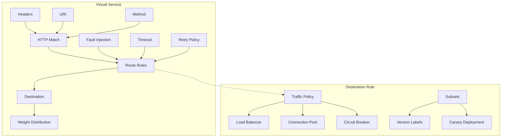
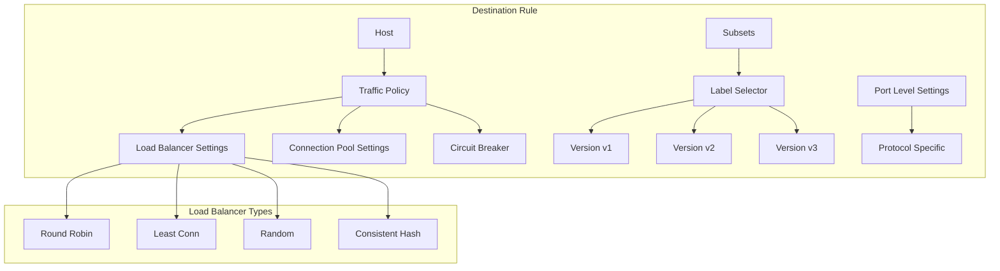
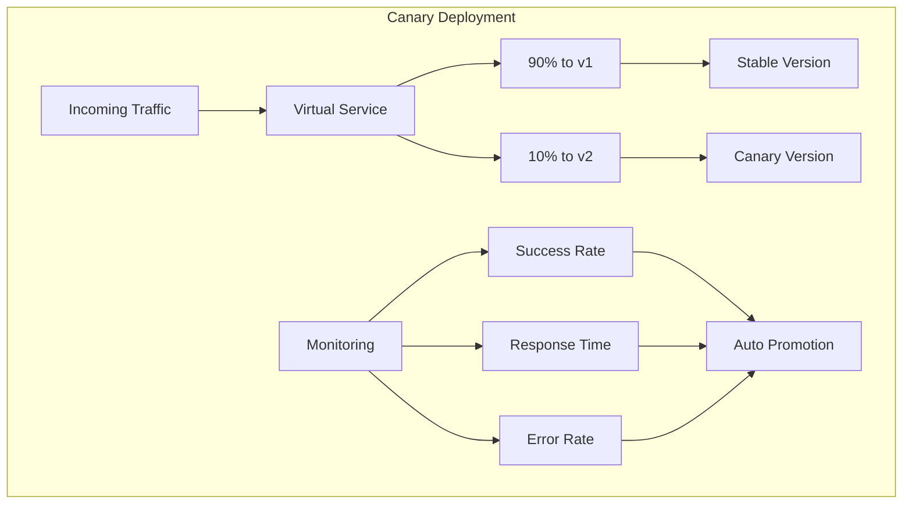
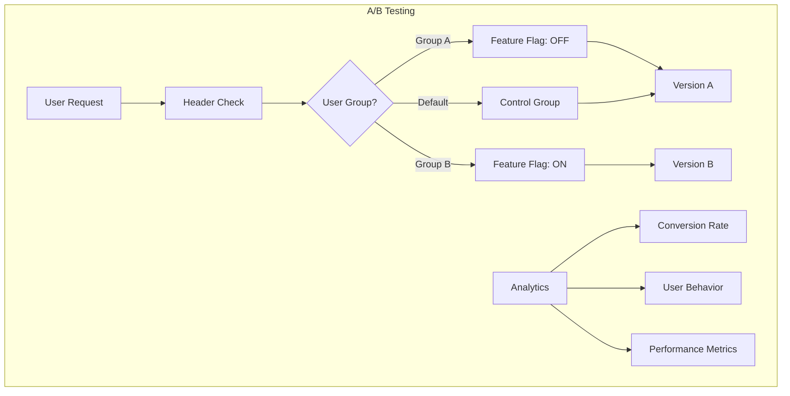

# Session 3: 트래픽 관리와 라우팅 전략

## 📍 교과과정에서의 위치
이 세션은 **Week 3 > Day 4 > Session 3**으로, Istio를 활용한 고급 트래픽 관리와 라우팅 전략을 학습합니다.

## 학습 목표 (5분)
- **Virtual Service**와 **Destination Rule**의 역할과 구성 방법 이해
- **가중치 기반 라우팅**과 **헤더 기반 라우팅** 전략 학습
- **서킷 브레이커**와 **재시도 정책** 구현 방법 파악
- **타임아웃**과 **부하 분산** 고급 설정 기법 습득

## 1. Virtual Service와 Destination Rule 핵심 개념 (15분)

### Virtual Service 아키텍처



### Virtual Service 상세 구성
```yaml
# Virtual Service 예제 구조
apiVersion: networking.istio.io/v1beta1
kind: VirtualService
metadata:
  name: productpage
spec:
  hosts:
  - productpage
  http:
  - match:
    - headers:
        end-user:
          exact: jason
    route:
    - destination:
        host: reviews
        subset: v2
  - route:
    - destination:
        host: reviews
        subset: v1
      weight: 90
    - destination:
        host: reviews
        subset: v3
      weight: 10
```

### Virtual Service 핵심 기능 분석
```
Virtual Service 트래픽 라우팅 기능:

1. 매칭 조건 (Match Conditions):
├── HTTP 헤더 매칭:
│   ├── exact: 정확한 값 매칭
│   ├── prefix: 접두사 매칭
│   ├── regex: 정규식 매칭
│   └── 대소문자 구분 설정
├── URI 경로 매칭:
│   ├── 경로 기반 라우팅
│   ├── 쿼리 파라미터 매칭
│   ├── 와일드카드 지원
│   └── 경로 재작성 기능
├── HTTP 메서드 매칭:
│   ├── GET, POST, PUT, DELETE
│   ├── 메서드별 다른 라우팅
│   ├── RESTful API 지원
│   └── 보안 정책 연동
└── 사용자 정의 헤더:
    ├── 인증 토큰 기반
    ├── 사용자 그룹별 라우팅
    ├── 지역별 라우팅
    └── 실험 그룹 분할

2. 라우팅 규칙 (Route Rules):
├── 가중치 기반 라우팅:
│   ├── 트래픽 비율 조정
│   ├── 카나리 배포 지원
│   ├── A/B 테스트 구현
│   └── 점진적 롤아웃
├── 대상 서비스 지정:
│   ├── 호스트 이름 기반
│   ├── 서브셋 선택
│   ├── 포트 지정
│   └── 네임스페이스 간 라우팅
├── 헤더 조작:
│   ├── 요청 헤더 추가/제거
│   ├── 응답 헤더 수정
│   ├── 인증 정보 전달
│   └── 추적 정보 주입
└── URI 재작성:
    ├── 경로 변환
    ├── 쿼리 파라미터 조작
    ├── 리다이렉션
    └── 프록시 설정

3. 고급 트래픽 제어:
├── 장애 주입 (Fault Injection):
│   ├── 지연 주입 (Delay)
│   ├── 중단 주입 (Abort)
│   ├── 확률적 장애
│   └── 카오스 엔지니어링
├── 타임아웃 설정:
│   ├── 요청별 타임아웃
│   ├── 서비스별 기본값
│   ├── 동적 타임아웃
│   └── 백프레셔 처리
├── 재시도 정책:
│   ├── 재시도 횟수 제한
│   ├── 백오프 전략
│   ├── 재시도 조건 설정
│   └── 서킷 브레이커 연동
└── 미러링 (Traffic Mirroring):
    ├── 프로덕션 트래픽 복사
    ├── 테스트 환경 검증
    ├── 성능 테스트
    └── 데이터 분석
```

## 2. Destination Rule과 트래픽 정책 (12분)

### Destination Rule 아키텍처



### Destination Rule 상세 구성
```yaml
# Destination Rule 예제
apiVersion: networking.istio.io/v1beta1
kind: DestinationRule
metadata:
  name: reviews-destination
spec:
  host: reviews
  trafficPolicy:
    loadBalancer:
      simple: LEAST_CONN
    connectionPool:
      tcp:
        maxConnections: 100
      http:
        http1MaxPendingRequests: 50
        maxRequestsPerConnection: 2
    circuitBreaker:
      consecutiveErrors: 3
      interval: 30s
      baseEjectionTime: 30s
      maxEjectionPercent: 50
  subsets:
  - name: v1
    labels:
      version: v1
  - name: v2
    labels:
      version: v2
    trafficPolicy:
      loadBalancer:
        simple: ROUND_ROBIN
```

### 트래픽 정책 상세 분석
```
Destination Rule 트래픽 정책:

1. 로드 밸런싱 알고리즘:
├── ROUND_ROBIN:
│   ├── 순차적 요청 분배
│   ├── 균등한 부하 분산
│   ├── 단순하고 예측 가능
│   └── 기본 설정으로 적합
├── LEAST_CONN:
│   ├── 최소 연결 수 기준
│   ├── 불균등한 요청 처리 시간 대응
│   ├── 동적 부하 분산
│   └── 성능 최적화
├── RANDOM:
│   ├── 무작위 선택
│   ├── 간단한 구현
│   ├── 핫스팟 방지
│   └── 캐시 효율성 고려
└── CONSISTENT_HASH:
    ├── 해시 기반 일관성
    ├── 세션 어피니티
    ├── 캐시 지역성
    └── 스케일링 시 안정성

2. 연결 풀 설정:
├── TCP 연결 관리:
│   ├── maxConnections: 최대 연결 수
│   ├── connectTimeout: 연결 타임아웃
│   ├── tcpKeepalive: Keep-alive 설정
│   └── 리소스 효율성
├── HTTP 연결 관리:
│   ├── http1MaxPendingRequests: 대기 요청 수
│   ├── http2MaxRequests: HTTP/2 최대 요청
│   ├── maxRequestsPerConnection: 연결당 요청 수
│   └── idleTimeout: 유휴 타임아웃
├── 연결 재사용:
│   ├── Keep-alive 최적화
│   ├── 연결 풀링
│   ├── 오버헤드 감소
│   └── 성능 향상
└── 백프레셔 처리:
    ├── 큐 관리
    ├── 흐름 제어
    ├── 메모리 보호
    └── 안정성 확보

3. 서킷 브레이커 패턴:
├── 장애 감지:
│   ├── consecutiveErrors: 연속 오류 임계값
│   ├── 응답 시간 모니터링
│   ├── 오류율 추적
│   └── 헬스 체크 통합
├── 격리 및 복구:
│   ├── baseEjectionTime: 기본 격리 시간
│   ├── maxEjectionPercent: 최대 격리 비율
│   ├── interval: 분석 간격
│   └── 점진적 복구
├── 폴백 메커니즘:
│   ├── 대체 서비스 라우팅
│   ├── 캐시된 응답 반환
│   ├── 기본값 제공
│   └── 우아한 성능 저하
└── 모니터링 및 알림:
    ├── 서킷 상태 추적
    ├── 메트릭 수집
    ├── 알림 시스템 연동
    └── 대시보드 시각화
```

## 3. 고급 라우팅 패턴과 전략 (10분)

### 카나리 배포 패턴



### A/B 테스트 구현 패턴



### 고급 라우팅 전략
```
고급 트래픽 라우팅 전략:

1. 카나리 배포 (Canary Deployment):
├── 점진적 트래픽 증가:
│   ├── 5% → 10% → 25% → 50% → 100%
│   ├── 자동화된 프로모션
│   ├── 메트릭 기반 의사결정
│   └── 롤백 자동화
├── 위험 최소화:
│   ├── 소규모 사용자 영향
│   ├── 빠른 문제 감지
│   ├── 즉시 롤백 가능
│   └── 프로덕션 검증
├── 모니터링 통합:
│   ├── 성공률 추적
│   ├── 응답 시간 비교
│   ├── 오류율 모니터링
│   └── 비즈니스 메트릭 분석
└── 자동화 파이프라인:
    ├── CI/CD 통합
    ├── 승인 프로세스
    ├── 알림 시스템
    └── 문서화 자동화

2. A/B 테스트 (A/B Testing):
├── 사용자 세그멘테이션:
│   ├── 헤더 기반 분할
│   ├── 쿠키 기반 분할
│   ├── IP 기반 분할
│   └── 사용자 ID 기반 분할
├── 실험 설계:
│   ├── 대조군 설정
│   ├── 실험군 정의
│   ├── 성공 지표 설정
│   └── 통계적 유의성 확보
├── 트래픽 분할:
│   ├── 50/50 분할
│   ├── 다중 변형 테스트
│   ├── 점진적 노출
│   └── 세밀한 제어
└── 결과 분석:
    ├── 전환율 비교
    ├── 사용자 행동 분석
    ├── 성능 영향 평가
    └── 비즈니스 임팩트 측정

3. 블루-그린 배포:
├── 환경 분리:
│   ├── 완전히 독립된 환경
│   ├── 동일한 인프라 구성
│   ├── 데이터베이스 동기화
│   └── 네트워크 격리
├── 즉시 전환:
│   ├── DNS 기반 전환
│   ├── 로드 밸런서 전환
│   ├── 제로 다운타임
│   └── 즉시 롤백
├── 검증 프로세스:
│   ├── 스모크 테스트
│   ├── 통합 테스트
│   ├── 성능 테스트
│   └── 보안 검증
└── 리소스 관리:
    ├── 이중 리소스 필요
    ├── 비용 고려사항
    ├── 효율적 활용
    └── 자동화 필요성

4. 지역 기반 라우팅:
├── 지리적 분산:
│   ├── 대륙별 라우팅
│   ├── 국가별 라우팅
│   ├── 도시별 라우팅
│   └── 데이터 센터별 분산
├── 지연 시간 최적화:
│   ├── 가장 가까운 엔드포인트
│   ├── 네트워크 지연 측정
│   ├── 동적 라우팅
│   └── 성능 모니터링
├── 규정 준수:
│   ├── 데이터 주권 요구사항
│   ├── 지역별 법규 준수
│   ├── 개인정보 보호
│   └── 감사 요구사항
└── 장애 복구:
    ├── 지역 간 페일오버
    ├── 자동 복구
    ├── 트래픽 재분산
    └── 서비스 연속성
```

## 💬 그룹 토론: 트래픽 라우팅 전략 선택 기준 (8분)

### 토론 주제
**"마이크로서비스 환경에서 카나리 배포, A/B 테스트, 블루-그린 배포 중 어떤 전략을 언제 선택해야 하며, 각각의 장단점은 무엇인가?"**

### 토론 가이드라인

#### 배포 전략별 특성 분석 (3분)
- **카나리 배포**: 점진적 위험 관리, 실시간 모니터링 중요성
- **A/B 테스트**: 비즈니스 가설 검증, 사용자 경험 최적화
- **블루-그린 배포**: 제로 다운타임, 즉시 롤백 가능성

#### 선택 기준과 고려사항 (3분)
- **서비스 특성**: 사용자 영향도, 비즈니스 중요도, 기술적 복잡성
- **조직 역량**: 모니터링 체계, 자동화 수준, 팀 경험
- **인프라 제약**: 리소스 가용성, 비용 고려사항, 기술 스택

#### 실무 적용 시나리오 (2분)
- **전자상거래**: 결제 시스템 vs 추천 시스템
- **금융 서비스**: 핵심 거래 vs 부가 서비스
- **미디어 플랫폼**: 콘텐츠 전송 vs 사용자 인터페이스

## 💡 핵심 개념 정리
- **Virtual Service**: HTTP 라우팅 규칙, 매칭 조건, 트래픽 분할
- **Destination Rule**: 로드 밸런싱, 연결 풀, 서킷 브레이커
- **카나리 배포**: 점진적 트래픽 증가, 위험 최소화
- **A/B 테스트**: 사용자 세그멘테이션, 실험 기반 개발

## 📚 참고 자료
- [Istio Traffic Management](https://istio.io/latest/docs/concepts/traffic-management/)
- [Virtual Service Reference](https://istio.io/latest/docs/reference/config/networking/virtual-service/)
- [Destination Rule Reference](https://istio.io/latest/docs/reference/config/networking/destination-rule/)
- [Canary Deployments with Istio](https://istio.io/latest/blog/2017/0.1-canary/)

## 다음 세션 준비
다음 세션에서는 **보안 정책과 mTLS 구현**에 대해 학습합니다. 제로 트러스트 보안 모델과 상호 TLS를 통한 서비스 간 보안 통신을 다룰 예정입니다.