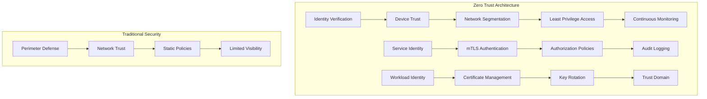
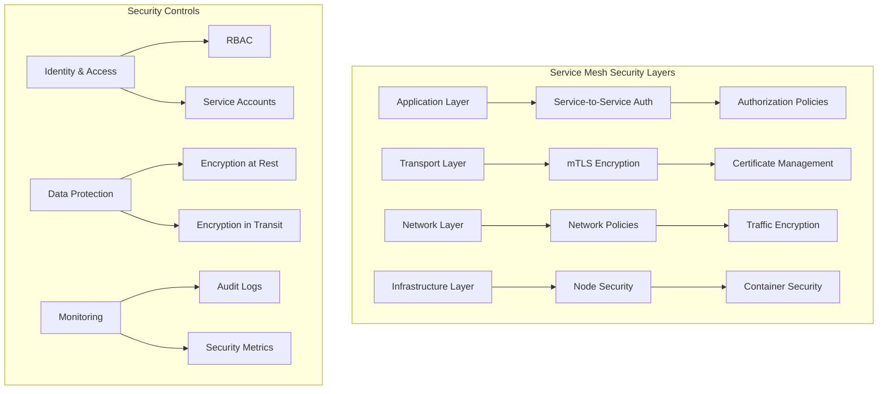
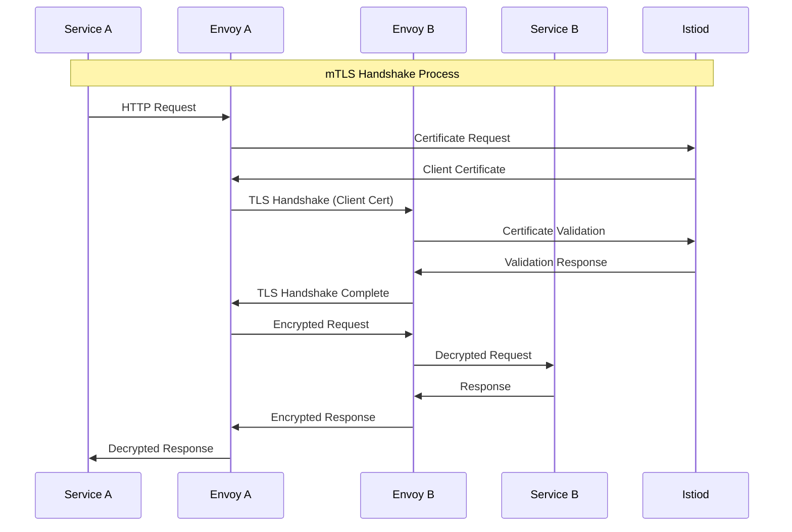
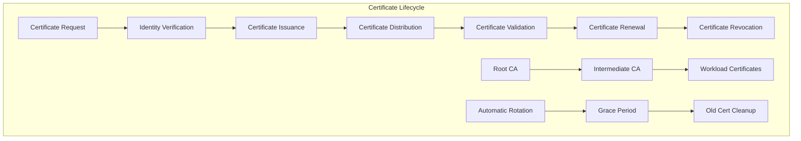
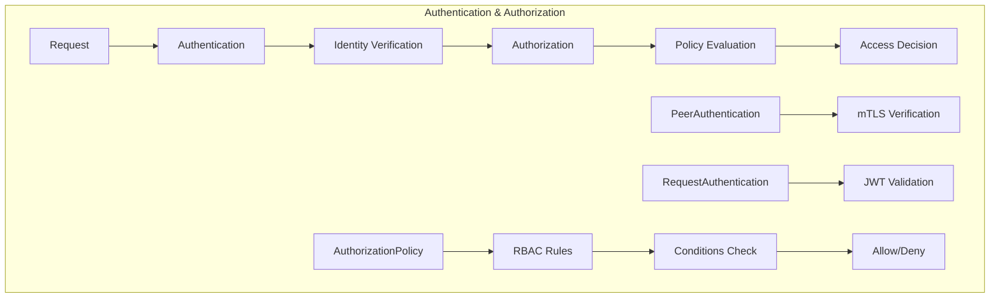

# Session 4: 보안 정책과 mTLS 구현

## 📍 교과과정에서의 위치
이 세션은 **Week 3 > Day 4 > Session 4**로, Istio를 활용한 제로 트러스트 보안 모델과 mTLS 구현을 학습합니다.

## 학습 목표 (5분)
- **제로 트러스트 보안 모델**과 **Service Mesh 보안** 원칙 이해
- **상호 TLS(mTLS)** 자동 구성과 **인증서 관리** 방법 학습
- **인증 정책**과 **권한 부여 정책** 설계 및 구현 방법 파악
- **보안 네임스페이스**와 **워크로드 격리** 전략 습득

## 1. 제로 트러스트 보안 모델과 Service Mesh (15분)

### 제로 트러스트 아키텍처



### Service Mesh 보안 계층



### 제로 트러스트 보안 원칙
```
제로 트러스트 보안 모델 핵심 원칙:

1. 신뢰하지 않고 검증 (Never Trust, Always Verify):
├── 모든 통신 검증:
│   ├── 서비스 간 인증 필수
│   ├── 요청별 권한 확인
│   ├── 지속적인 신뢰 평가
│   └── 동적 접근 제어
├── 네트워크 위치 무관:
│   ├── 내부 네트워크도 신뢰하지 않음
│   ├── 마이크로 세그멘테이션
│   ├── 서비스별 격리
│   └── 최소 권한 원칙
├── 강력한 신원 확인:
│   ├── 서비스 아이덴티티 기반
│   ├── 암호화된 통신
│   ├── 인증서 기반 인증
│   └── 단기 인증서 사용
└── 지속적인 모니터링:
    ├── 실시간 위협 탐지
    ├── 행동 분석
    ├── 이상 징후 감지
    └── 자동 대응 체계

2. 최소 권한 접근 (Least Privilege Access):
├── 서비스별 권한 분리:
│   ├── 필요한 최소 권한만 부여
│   ├── 역할 기반 접근 제어
│   ├── 시간 제한 접근
│   └── 조건부 접근 제어
├── 네트워크 세그멘테이션:
│   ├── 마이크로 세그멘테이션
│   ├── 서비스별 네트워크 정책
│   ├── 트래픽 격리
│   └── 측면 이동 방지
├── 데이터 접근 제어:
│   ├── 데이터 분류 기반
│   ├── 암호화 키 관리
│   ├── 접근 로그 기록
│   └── 데이터 유출 방지
└── 동적 권한 관리:
    ├── 컨텍스트 기반 접근
    ├── 위험 기반 인증
    ├── 적응형 보안
    └── 자동 권한 조정

3. 포괄적 보안 모니터링:
├── 전체 트래픽 가시성:
│   ├── 모든 통신 로깅
│   ├── 메타데이터 수집
│   ├── 성능 메트릭 추적
│   └── 보안 이벤트 기록
├── 실시간 위협 탐지:
│   ├── 이상 행동 감지
│   ├── 패턴 분석
│   ├── 머신러닝 기반 탐지
│   └── 자동 알림 시스템
├── 보안 분석 및 대응:
│   ├── 위협 인텔리전스 통합
│   ├── 포렌식 분석 지원
│   ├── 인시던트 대응 자동화
│   └── 복구 절차 실행
└── 컴플라이언스 지원:
    ├── 규정 준수 모니터링
    ├── 감사 로그 관리
    ├── 보고서 자동 생성
    └── 증거 보전
```

## 2. mTLS 자동 구성과 인증서 관리 (12분)

### mTLS 아키텍처



### 인증서 생명주기 관리



### mTLS 구성과 관리
```
mTLS (Mutual TLS) 구성 및 관리:

1. 자동 mTLS 구성:
├── Istio 기본 설정:
│   ├── 자동 인증서 발급
│   ├── 사이드카 간 mTLS 활성화
│   ├── 투명한 암호화
│   └── 애플리케이션 코드 변경 불필요
├── 인증서 자동 관리:
│   ├── 단기 인증서 (기본 24시간)
│   ├── 자동 갱신 (만료 전 갱신)
│   ├── 키 로테이션
│   └── 인증서 배포 자동화
├── 보안 모드 설정:
│   ├── PERMISSIVE: mTLS와 평문 모두 허용
│   ├── STRICT: mTLS만 허용
│   ├── DISABLE: mTLS 비활성화
│   └── 점진적 마이그레이션 지원
└── 신뢰 도메인 관리:
    ├── 클러스터별 신뢰 도메인
    ├── 멀티 클러스터 신뢰
    ├── 외부 서비스 통합
    └── 신뢰 체인 검증

2. 인증서 관리 체계:
├── 루트 CA 관리:
│   ├── 자체 서명 루트 CA
│   ├── 외부 CA 통합
│   ├── 하드웨어 보안 모듈 (HSM)
│   └── 키 보안 및 백업
├── 중간 CA 구조:
│   ├── 계층적 CA 구조
│   ├── 역할별 중간 CA
│   ├── 지역별 CA 분산
│   └── 장애 격리
├── 워크로드 인증서:
│   ├── 서비스 아이덴티티 기반
│   ├── SPIFFE ID 사용
│   ├── 네임스페이스별 격리
│   └── 서비스 계정 연동
└── 인증서 검증:
    ├── 체인 검증
    ├── 만료 시간 확인
    ├── 폐기 목록 (CRL) 확인
    └── OCSP 검증

3. 보안 정책 통합:
├── PeerAuthentication:
│   ├── 네임스페이스 수준 정책
│   ├── 워크로드 수준 정책
│   ├── 포트별 mTLS 설정
│   └── 선택적 mTLS 적용
├── DestinationRule 통합:
│   ├── TLS 모드 설정
│   ├── 인증서 검증 옵션
│   ├── SNI 설정
│   └── 암호화 스위트 선택
├── 외부 서비스 연동:
│   ├── ServiceEntry 설정
│   ├── 외부 mTLS 구성
│   ├── 인증서 관리
│   └── 보안 게이트웨이
└── 모니터링 및 알림:
    ├── 인증서 만료 알림
    ├── mTLS 연결 모니터링
    ├── 보안 이벤트 로깅
    └── 성능 영향 추적

4. 문제 해결 및 디버깅:
├── 인증서 문제 진단:
│   ├── 인증서 체인 검증
│   ├── 만료 시간 확인
│   ├── 키 매칭 검증
│   └── 권한 문제 해결
├── mTLS 연결 문제:
│   ├── 핸드셰이크 실패 분석
│   ├── 암호화 스위트 불일치
│   ├── 프로토콜 버전 문제
│   └── 네트워크 연결성 확인
├── 성능 최적화:
│   ├── TLS 세션 재사용
│   ├── 인증서 캐싱
│   ├── 암호화 오버헤드 최소화
│   └── 하드웨어 가속 활용
└── 보안 감사:
    ├── 인증서 사용 추적
    ├── 접근 로그 분석
    ├── 보안 정책 준수 확인
    └── 취약점 스캔
```

## 3. 인증 정책과 권한 부여 정책 (10분)

### 인증 및 권한 부여 아키텍처



### 보안 정책 구성 예제
```yaml
# PeerAuthentication 예제
apiVersion: security.istio.io/v1beta1
kind: PeerAuthentication
metadata:
  name: default
  namespace: production
spec:
  mtls:
    mode: STRICT

---
# RequestAuthentication 예제
apiVersion: security.istio.io/v1beta1
kind: RequestAuthentication
metadata:
  name: jwt-auth
  namespace: production
spec:
  selector:
    matchLabels:
      app: productpage
  jwtRules:
  - issuer: "https://auth.example.com"
    jwksUri: "https://auth.example.com/.well-known/jwks.json"
    audiences:
    - "productpage-service"

---
# AuthorizationPolicy 예제
apiVersion: security.istio.io/v1beta1
kind: AuthorizationPolicy
metadata:
  name: productpage-policy
  namespace: production
spec:
  selector:
    matchLabels:
      app: productpage
  rules:
  - from:
    - source:
        principals: ["cluster.local/ns/production/sa/frontend"]
    to:
    - operation:
        methods: ["GET", "POST"]
        paths: ["/api/v1/*"]
    when:
    - key: request.headers[user-role]
      values: ["admin", "user"]
```

### 보안 정책 상세 분석
```
Istio 보안 정책 체계:

1. PeerAuthentication (피어 인증):
├── mTLS 모드 설정:
│   ├── STRICT: mTLS 필수
│   ├── PERMISSIVE: mTLS 선택적
│   ├── DISABLE: mTLS 비활성화
│   └── UNSET: 상위 정책 상속
├── 적용 범위:
│   ├── 메시 전체 (istio-system)
│   ├── 네임스페이스 수준
│   ├── 워크로드 수준
│   └── 포트별 설정
├── 선택자 기반 적용:
│   ├── 라벨 셀렉터
│   ├── 서비스 계정 기반
│   ├── 네임스페이스 기반
│   └── 조건부 적용
└── 점진적 마이그레이션:
    ├── PERMISSIVE로 시작
    ├── 호환성 확인
    ├── STRICT로 전환
    └── 모니터링 및 검증

2. RequestAuthentication (요청 인증):
├── JWT 토큰 검증:
│   ├── 발급자 (Issuer) 검증
│   ├── 서명 검증 (JWKS)
│   ├── 만료 시간 확인
│   └── 대상 (Audience) 검증
├── 다중 인증 제공자:
│   ├── 여러 JWT 발급자 지원
│   ├── 우선순위 기반 검증
│   ├── 폴백 메커니즘
│   └── 제공자별 설정
├── 토큰 위치 설정:
│   ├── Authorization 헤더
│   ├── 커스텀 헤더
│   ├── 쿼리 파라미터
│   └── 쿠키
└── 검증 실패 처리:
    ├── 401 Unauthorized 반환
    ├── 커스텀 오류 응답
    ├── 로깅 및 모니터링
    └── 재시도 정책

3. AuthorizationPolicy (권한 부여):
├── RBAC 기반 접근 제어:
│   ├── 역할 기반 권한 관리
│   ├── 세밀한 권한 제어
│   ├── 조건부 접근 제어
│   └── 동적 권한 평가
├── 규칙 구성 요소:
│   ├── FROM: 요청 소스 (principals, namespaces)
│   ├── TO: 대상 리소스 (operations, paths)
│   ├── WHEN: 조건 (headers, IP, time)
│   └── ACTION: 허용/거부 결정
├── 다층 보안 정책:
│   ├── 메시 수준 기본 정책
│   ├── 네임스페이스 수준 정책
│   ├── 워크로드 수준 정책
│   └── 정책 우선순위 관리
└── 고급 조건 설정:
    ├── 시간 기반 접근 제어
    ├── IP 주소 기반 제한
    ├── 헤더 기반 라우팅
    └── 사용자 속성 기반 제어

4. 보안 정책 모범 사례:
├── 기본 거부 원칙:
│   ├── 명시적 허용만 적용
│   ├── 최소 권한 원칙
│   ├── 정기적 권한 검토
│   └── 불필요한 권한 제거
├── 계층적 정책 설계:
│   ├── 상위 정책에서 기본 규칙
│   ├── 하위 정책에서 세부 규칙
│   ├── 정책 상속 관계 명확화
│   └── 충돌 해결 규칙 정의
├── 모니터링 및 감사:
│   ├── 접근 로그 수집
│   ├── 정책 위반 알림
│   ├── 보안 메트릭 추적
│   └── 정기적 보안 검토
└── 테스트 및 검증:
    ├── 정책 시뮬레이션
    ├── 단계적 배포
    ├── 영향도 분석
    └── 롤백 계획 수립
```

## 💬 그룹 토론: 제로 트러스트 보안 구현 전략 (8분)

### 토론 주제
**"기존 마이크로서비스 환경에서 제로 트러스트 보안 모델을 도입할 때, 어떤 순서로 진행해야 하며 각 단계에서 고려해야 할 핵심 요소는 무엇인가?"**

### 토론 가이드라인

#### 도입 단계별 전략 (3분)
- **1단계**: 가시성 확보 - 현재 통신 패턴 파악
- **2단계**: mTLS 도입 - PERMISSIVE 모드로 시작
- **3단계**: 정책 적용 - 점진적 권한 제한

#### 기술적 고려사항 (3분)
- **성능 영향**: mTLS 오버헤드, 인증서 관리 부하
- **운영 복잡성**: 정책 관리, 문제 해결, 모니터링
- **호환성**: 레거시 시스템, 외부 서비스 연동

#### 조직적 준비사항 (2분)
- **팀 역량**: 보안 전문성, 운영 경험, 교육 계획
- **프로세스**: 보안 정책 수립, 인시던트 대응, 감사 체계
- **도구**: 모니터링 시스템, 자동화 도구, 대시보드

## 💡 핵심 개념 정리
- **제로 트러스트**: 신뢰하지 않고 검증, 최소 권한, 지속적 모니터링
- **mTLS**: 상호 인증, 자동 인증서 관리, 투명한 암호화
- **인증 정책**: PeerAuthentication, RequestAuthentication
- **권한 부여**: AuthorizationPolicy, RBAC, 조건부 접근 제어

## 📚 참고 자료
- [Istio Security](https://istio.io/latest/docs/concepts/security/)
- [Zero Trust Architecture](https://www.nist.gov/publications/zero-trust-architecture)
- [mTLS in Istio](https://istio.io/latest/docs/concepts/security/#mutual-tls-authentication)
- [Authorization Policy](https://istio.io/latest/docs/reference/config/security/authorization-policy/)

## 다음 세션 준비
다음 세션에서는 **관찰 가능성과 분산 추적**에 대해 학습합니다. Jaeger를 통한 분산 추적과 Kiali를 통한 서비스 메시 시각화를 다룰 예정입니다.