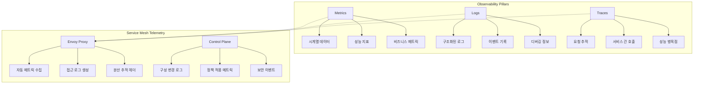
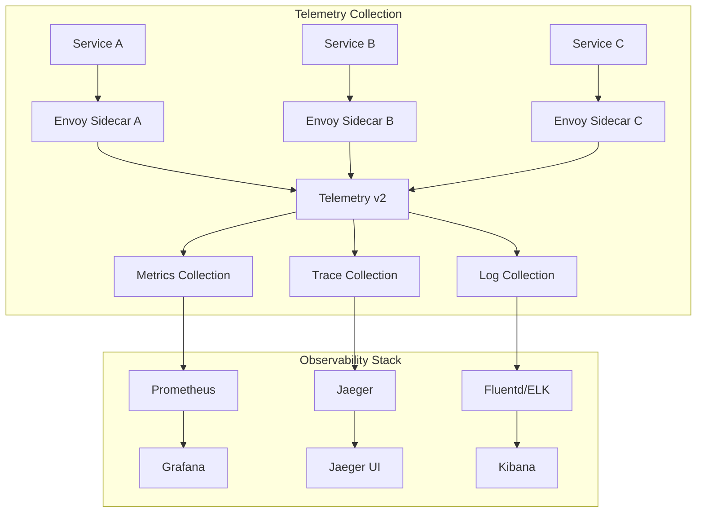
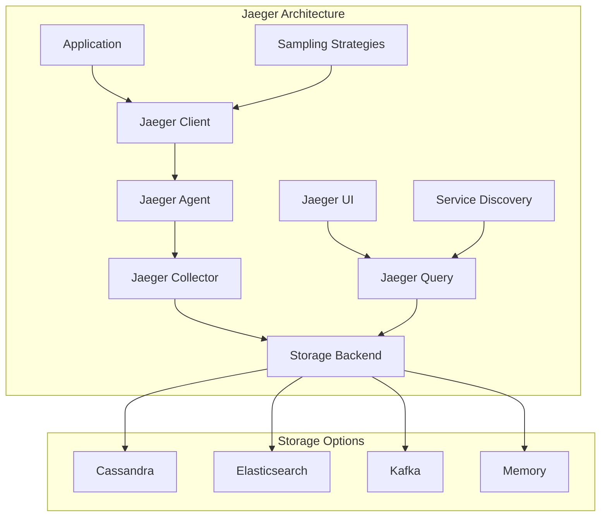
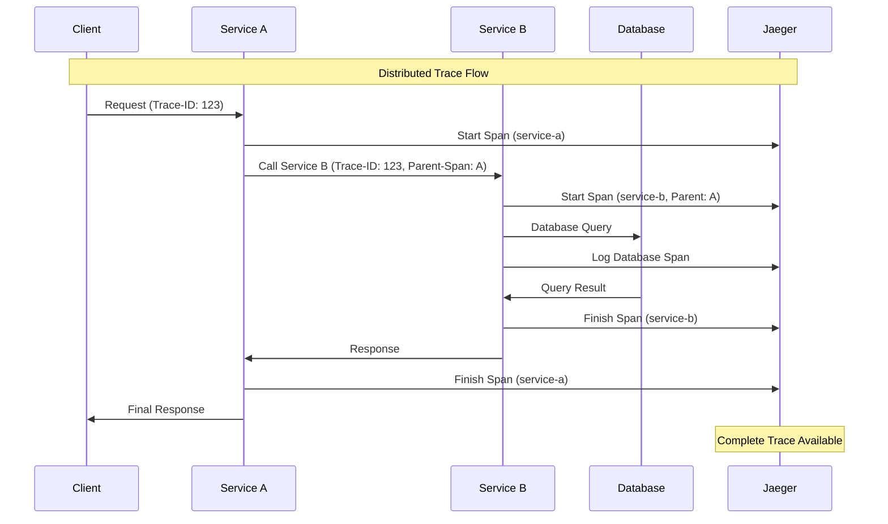
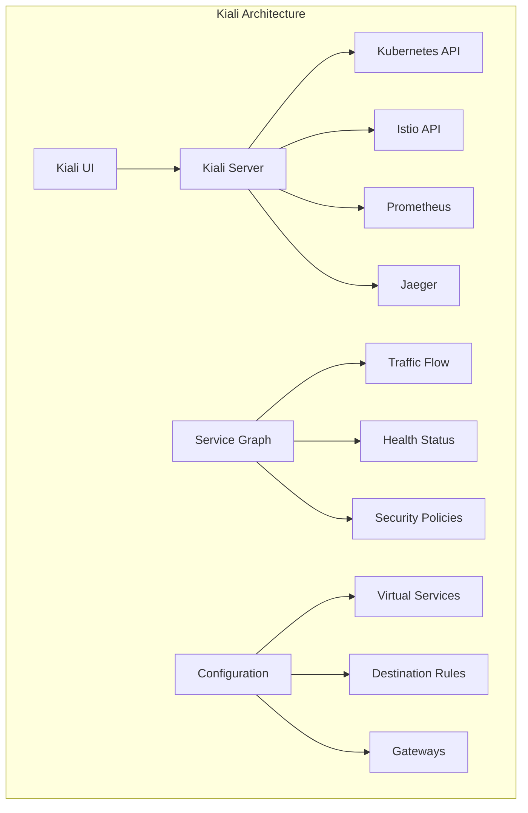
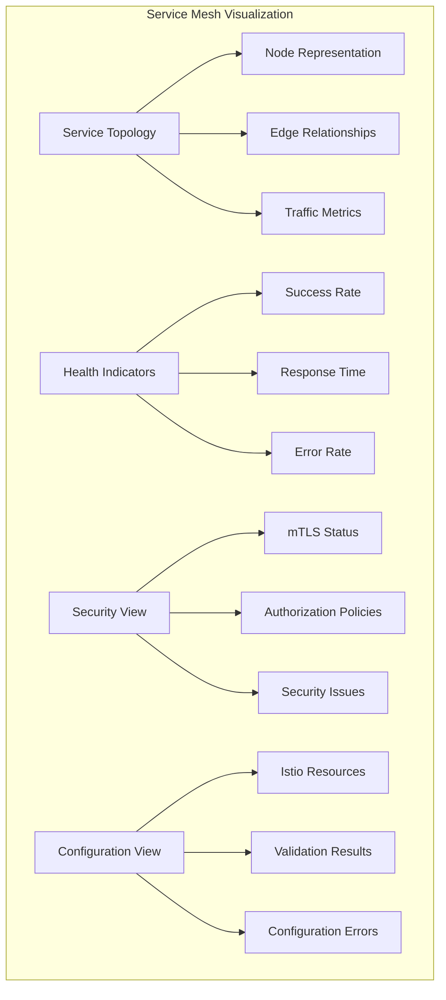

# Session 5: 관찰 가능성과 분산 추적

## 📍 교과과정에서의 위치
이 세션은 **Week 3 > Day 4 > Session 5**로, Service Mesh 환경에서의 관찰 가능성과 분산 추적 구현을 학습합니다.

## 학습 목표 (5분)
- **관찰 가능성(Observability)** 3요소와 **Service Mesh 텔레메트리** 이해
- **Jaeger**를 통한 **분산 추적** 구현과 **성능 분석** 방법 학습
- **Kiali**를 통한 **서비스 메시 시각화**와 **토폴로지 분석** 기법 파악
- **Prometheus**와 **Grafana** 연동을 통한 **메트릭 수집** 및 **모니터링** 체계 구축

## 1. 관찰 가능성과 Service Mesh 텔레메트리 (15분)

### 관찰 가능성 3요소



### Service Mesh 텔레메트리 아키텍처



### 관찰 가능성 구현 전략
```
Service Mesh 관찰 가능성 구현:

1. 메트릭 (Metrics) 수집:
   🔹 자동 메트릭 생성:
      • 요청 수 (Request Count)
      • 응답 시간 (Response Time)
      • 오류율 (Error Rate)
      • 처리량 (Throughput)
   🔹 서비스 수준 메트릭:
      • P50, P95, P99 지연 시간
      • 성공률 (Success Rate)
      • 가용성 (Availability)
      • 포화도 (Saturation)
   🔹 인프라 메트릭:
      • CPU 사용률
      • 메모리 사용률
      • 네트워크 I/O
      • 디스크 I/O
   🔹 비즈니스 메트릭:
   🔹 사용자 세션 수
   🔹 거래 완료율
   🔹 수익 관련 지표
   🔹 사용자 만족도

2. 로그 (Logs) 관리:
   🔹 구조화된 로깅:
      • JSON 형식 로그
      • 표준화된 필드
      • 컨텍스트 정보 포함
      • 검색 가능한 형태
   🔹 접근 로그 (Access Logs):
      • HTTP 요청/응답 정보
      • 클라이언트 IP 주소
      • 사용자 에이전트
      • 응답 코드 및 크기
   🔹 애플리케이션 로그:
      • 비즈니스 로직 이벤트
      • 오류 및 예외 정보
      • 디버깅 정보
      • 보안 관련 이벤트
   🔹 시스템 로그:
   🔹 컨테이너 로그
   🔹 쿠버네티스 이벤트
   🔹 인프라 로그
   🔹 보안 감사 로그

3. 분산 추적 (Distributed Tracing):
   🔹 추적 컨텍스트:
      • Trace ID (전체 요청 추적)
      • Span ID (개별 작업 추적)
      • Parent Span 관계
      • 추적 헤더 전파
   🔹 스팬 정보:
      • 작업 이름 및 시간
      • 태그 및 어노테이션
      • 오류 정보
      • 메타데이터
   🔹 샘플링 전략:
      • 확률적 샘플링
      • 적응형 샘플링
      • 오류 기반 샘플링
      • 성능 영향 최소화
   🔹 추적 분석:
   🔹 서비스 의존성 맵
   🔹 성능 병목점 식별
   🔹 오류 전파 경로
   🔹 최적화 기회 발견

4. 텔레메트리 최적화:
   🔹 데이터 볼륨 관리:
      • 샘플링 비율 조정
      • 메트릭 집계
      • 로그 필터링
      • 스토리지 최적화
   🔹 성능 영향 최소화:
      • 비동기 데이터 전송
      • 배치 처리
      • 압축 및 직렬화
      • 백프레셔 처리
   🔹 데이터 품질 보장:
      • 스키마 검증
      • 데이터 정합성 확인
      • 중복 제거
      • 오류 데이터 처리
   🔹 보안 및 프라이버시:
   🔹 민감 정보 마스킹
   🔹 데이터 암호화
   🔹 접근 권한 관리
   🔹 데이터 보존 정책
```

## 2. Jaeger를 통한 분산 추적 구현 (12분)

### Jaeger 아키텍처



### 분산 추적 구현 패턴



### Jaeger 구현 및 분석
```
Jaeger 분산 추적 구현:

1. Jaeger 컴포넌트 구성:
   🔹 Jaeger Agent:
      • 애플리케이션과 함께 배포
      • UDP 프로토콜로 스팬 수집
      • 로컬 버퍼링 및 배치 전송
      • 네트워크 오버헤드 최소화
   🔹 Jaeger Collector:
      • Agent로부터 스팬 수집
      • 데이터 검증 및 변환
      • 스토리지 백엔드에 저장
      • 확장 가능한 아키텍처
   🔹 Jaeger Query:
      • 스토리지에서 추적 데이터 조회
      • REST API 제공
      • 검색 및 필터링 기능
      • UI와 연동
   🔹 Jaeger UI:
   🔹 웹 기반 사용자 인터페이스
   🔹 추적 시각화
   🔹 서비스 맵 표시
   🔹 성능 분석 도구

2. 추적 데이터 모델:
   🔹 Trace (추적):
      • 전체 요청의 생명주기
      • 고유한 Trace ID
      • 여러 Span으로 구성
      • 서비스 간 호출 관계
   🔹 Span (스팬):
      • 개별 작업 단위
      • 고유한 Span ID
      • 시작/종료 시간
      • 부모-자식 관계
   🔹 Tags (태그):
      • 키-값 쌍 메타데이터
      • 검색 및 필터링 기준
      • 서비스 정보
      • 비즈니스 컨텍스트
   🔹 Logs (로그):
   🔹 스팬 내 이벤트 기록
   🔹 타임스탬프 포함
   🔹 구조화된 데이터
   🔹 디버깅 정보

3. 샘플링 전략:
   🔹 확률적 샘플링:
      • 고정 비율 샘플링
      • 트래픽 볼륨에 따른 조정
      • 성능 영향 최소화
      • 통계적 대표성 확보
   🔹 적응형 샘플링:
      • 서비스별 동적 조정
      • 오류율 기반 증가
      • 성능 임계값 기반
      • 자동 최적화
   🔹 우선순위 기반 샘플링:
      • 중요한 트랜잭션 우선
      • 오류 발생 시 100% 샘플링
      • 새로운 서비스 높은 비율
      • 비즈니스 중요도 반영
   🔹 커스텀 샘플링:
   🔹 사용자 정의 규칙
   🔹 헤더 기반 샘플링
   🔹 조건부 샘플링
   🔹 실험적 기능 추적

4. 성능 분석 및 최적화:
   🔹 지연 시간 분석:
      • 서비스별 응답 시간
      • 병목점 식별
      • 의존성 체인 분석
      • 최적화 우선순위
   🔹 오류 추적:
      • 오류 전파 경로
      • 실패 지점 식별
      • 오류 패턴 분석
      • 근본 원인 분석
   🔹 서비스 의존성:
      • 서비스 맵 생성
      • 호출 빈도 분석
      • 의존성 깊이 측정
      • 아키텍처 최적화
   🔹 용량 계획:
   🔹 트래픽 패턴 분석
   🔹 리소스 사용량 추적
   🔹 확장성 요구사항
   🔹 성능 예측 모델
```

## 3. Kiali를 통한 서비스 메시 시각화 (10분)

### Kiali 대시보드 아키텍처



### 서비스 메시 시각화 기능



### Kiali 기능 및 활용
```
Kiali 서비스 메시 시각화:

1. 서비스 그래프 (Service Graph):
   🔹 토폴로지 시각화:
      • 서비스 노드 표시
      • 트래픽 플로우 화살표
      • 프로토콜별 구분 (HTTP, gRPC, TCP)
      • 네임스페이스별 그룹화
   🔹 실시간 메트릭:
      • 요청 처리량 (RPS)
      • 응답 시간 (P50, P95, P99)
      • 성공률 및 오류율
      • 트래픽 분산 비율
   🔹 헬스 상태 표시:
      • 색상 코딩 (녹색/노란색/빨간색)
      • 성능 임계값 기반
      • 오류율 기반 상태
      • 가용성 지표
   🔹 필터링 및 검색:
   🔹 네임스페이스 필터
   🔹 서비스 이름 검색
   🔹 시간 범위 선택
   🔹 메트릭 임계값 설정

2. 애플리케이션 뷰:
   🔹 애플리케이션별 그룹화:
      • 관련 서비스 묶음
      • 버전별 구분
      • 워크로드 상태
      • 배포 정보
   🔹 트래픽 분석:
      • 인바운드/아웃바운드 트래픽
      • 프로토콜별 분석
      • 소스/대상 분석
      • 트래픽 패턴 식별
   🔹 성능 메트릭:
      • 애플리케이션 수준 메트릭
      • 서비스별 성능 비교
      • 버전별 성능 분석
      • 시간대별 트렌드
   🔹 배포 추적:
   🔹 카나리 배포 모니터링
   🔹 A/B 테스트 시각화
   🔹 롤아웃 진행 상황
   🔹 배포 영향 분석

3. 워크로드 뷰:
   🔹 파드 수준 정보:
      • 파드 상태 및 헬스
      • 리소스 사용량
      • 로그 및 이벤트
      • 사이드카 상태
   🔹 서비스 메시 구성:
      • 사이드카 주입 상태
      • 프록시 구성 정보
      • mTLS 설정 상태
      • 정책 적용 현황
   🔹 네트워킹 정보:
      • 서비스 엔드포인트
      • 포트 및 프로토콜
      • 로드 밸런싱 설정
      • 트래픽 정책
   🔹 보안 설정:
   🔹 인증 정책 상태
   🔹 권한 부여 규칙
   🔹 보안 위반 사항
   🔹 인증서 정보

4. 구성 관리 및 검증:
   🔹 Istio 리소스 관리:
      • Virtual Service 편집
      • Destination Rule 설정
      • Gateway 구성
      • 정책 리소스 관리
   🔹 구성 검증:
      • YAML 문법 검사
      • 의미적 검증
      • 충돌 감지
      • 모범 사례 확인
   🔹 변경 사항 추적:
      • 구성 변경 이력
      • 영향도 분석
      • 롤백 지원
      • 변경 승인 워크플로우
   🔹 문제 진단:
   🔹 구성 오류 식별
   🔹 연결성 문제 진단
   🔹 성능 병목점 분석
   🔹 보안 설정 검증

5. 분산 추적 통합:
   🔹 Jaeger 연동:
      • 추적 데이터 시각화
      • 서비스 그래프와 연결
      • 성능 분석 통합
      • 오류 추적 연계
   🔹 추적 분석:
      • 요청 플로우 시각화
      • 지연 시간 분석
      • 오류 전파 경로
      • 의존성 분석
   🔹 성능 최적화:
      • 병목점 식별
      • 최적화 기회 발견
      • 캐싱 효과 분석
      • 리소스 사용 최적화
   🔹 문제 해결:
   🔹 오류 근본 원인 분석
   🔹 성능 저하 원인 추적
   🔹 서비스 의존성 문제
   🔹 네트워크 연결 이슈
```

## 💬 그룹 토론: 관찰 가능성 구현 우선순위 (8분)

### 토론 주제
**"Service Mesh 환경에서 관찰 가능성을 구현할 때, 메트릭, 로그, 분산 추적 중 어떤 것부터 우선적으로 구현해야 하며, 각각의 구현 복잡도와 비즈니스 가치는 어떻게 평가할 수 있는가?"**

### 토론 가이드라인

#### 구현 우선순위 분석 (3분)
- 메트릭: 구현 용이성, 즉시 가치 제공, 알림 시스템 연동
- 로그: 디버깅 필수, 규정 준수, 스토리지 비용 고려
- 분산 추적: 복잡한 문제 해결, 성능 최적화, 높은 구현 복잡도

#### 비즈니스 가치 평가 (3분)
- 운영 효율성: 문제 해결 시간 단축, 자동화 가능성
- 사용자 경험: 성능 개선, 가용성 향상, 오류 감소
- 비용 최적화: 리소스 사용 최적화, 인프라 비용 절감

#### 구현 전략 수립 (2분)
- 단계적 접근: 기본 메트릭 → 구조화된 로그 → 분산 추적
- 도구 선택: 오픈소스 vs 상용 솔루션, 클라우드 서비스 활용
- 팀 역량: 필요한 기술 스킬, 교육 계획, 외부 지원

## 💡 핵심 개념 정리
- 관찰 가능성: 메트릭, 로그, 분산 추적의 통합적 접근
- Jaeger: 분산 추적 구현, 성능 분석, 문제 해결 도구
- Kiali: 서비스 메시 시각화, 구성 관리, 헬스 모니터링
- 텔레메트리: 자동 데이터 수집, 샘플링 전략, 성능 최적화

## 📚 참고 자료
- [Istio Observability](https://istio.io/latest/docs/concepts/observability/)
- [Jaeger Documentation](https://www.jaegertracing.io/docs/)
- [Kiali Documentation](https://kiali.io/docs/)
- [OpenTelemetry](https://opentelemetry.io/docs/)

## 다음 세션 준비
다음 세션에서는 **카나리 배포와 A/B 테스트**에 대해 학습합니다. 트래픽 분할을 통한 안전한 배포 전략과 실험 기반 개발 방법론을 다룰 예정입니다.