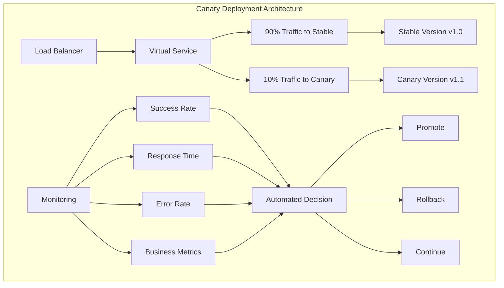
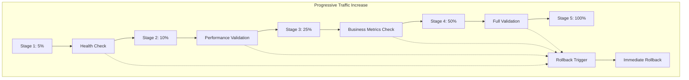
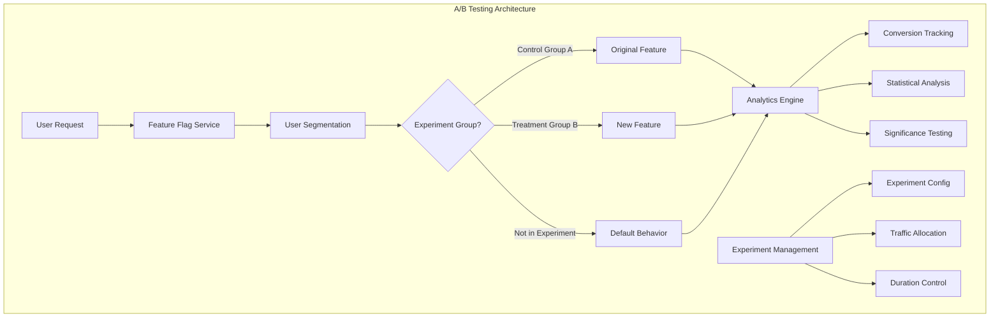
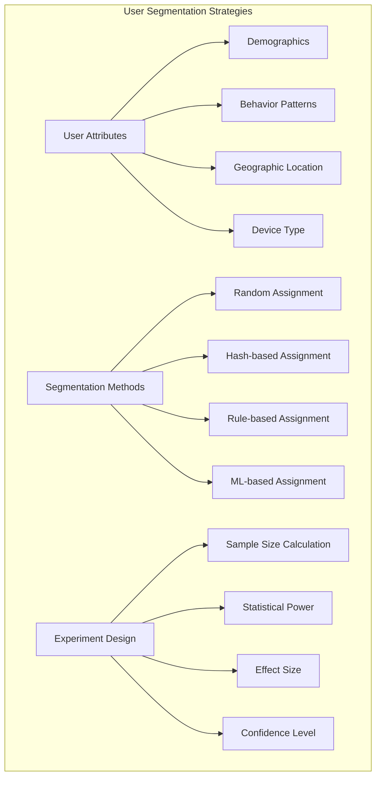
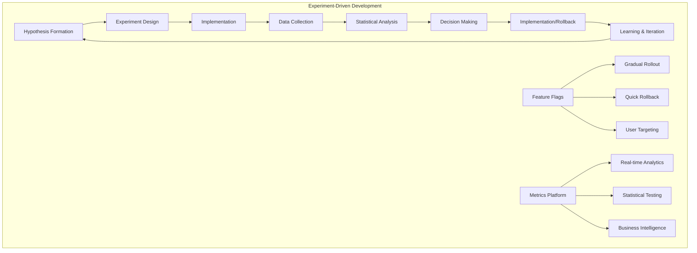
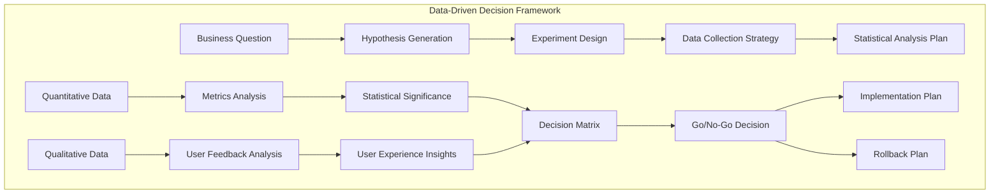

# Session 6: 카나리 배포와 A/B 테스트

## 📍 교과과정에서의 위치
이 세션은 **Week 3 > Day 4 > Session 6**으로, Service Mesh를 활용한 고급 배포 전략과 실험 기반 개발 방법론을 학습합니다.

## 학습 목표 (5분)
- **카나리 배포** 패턴과 **점진적 롤아웃** 전략 이해
- **A/B 테스트** 구현과 **사용자 세그멘테이션** 기법 학습
- **트래픽 분할** 메커니즘과 **자동화된 배포** 파이프라인 구축 방법 파악
- **실험 기반 개발**과 **데이터 기반 의사결정** 프로세스 습득

## 1. 카나리 배포 패턴과 구현 전략 (15분)

### 카나리 배포 아키텍처



### 점진적 트래픽 증가 패턴



### 카나리 배포 구현 상세
```
카나리 배포 (Canary Deployment) 구현:

1. 카나리 배포 전략:
├── 점진적 트래픽 증가:
│   ├── 5% → 10% → 25% → 50% → 100%
│   ├── 각 단계별 검증 기간 설정
│   ├── 자동화된 승진 조건
│   └── 수동 승인 게이트 포함
├── 위험 최소화:
│   ├── 소규모 사용자 영향
│   ├── 빠른 문제 감지
│   ├── 즉시 롤백 가능
│   └── 비즈니스 연속성 보장
├── 검증 메트릭:
│   ├── 기술적 메트릭 (오류율, 응답시간)
│   ├── 비즈니스 메트릭 (전환율, 수익)
│   ├── 사용자 경험 메트릭 (만족도)
│   └── 인프라 메트릭 (리소스 사용량)
└── 자동화 수준:
    ├── 완전 자동화 (메트릭 기반)
    ├── 반자동화 (승인 필요)
    ├── 수동 제어 (단계별 승인)
    └── 하이브리드 접근

2. Virtual Service 구성:
├── 가중치 기반 라우팅:
│   ├── 트래픽 비율 동적 조정
│   ├── 실시간 가중치 변경
│   ├── 세밀한 비율 제어
│   └── 즉시 적용 가능
├── 헤더 기반 라우팅:
│   ├── 내부 테스터 우선 노출
│   ├── 베타 사용자 그룹
│   ├── 지역별 점진적 배포
│   └── 사용자 속성 기반 라우팅
├── 조건부 라우팅:
│   ├── 시간 기반 배포
│   ├── 사용자 세그먼트별 배포
│   ├── 디바이스 타입별 배포
│   └── 지리적 위치 기반 배포
└── 장애 격리:
    ├── 카나리 버전 격리
    ├── 오류 전파 방지
    ├── 독립적인 롤백
    └── 안정 버전 보호

3. 모니터링 및 관찰:
├── 실시간 메트릭 수집:
│   ├── 응답 시간 비교
│   ├── 오류율 추적
│   ├── 처리량 모니터링
│   └── 리소스 사용량 분석
├── 비즈니스 메트릭:
│   ├── 전환율 변화
│   ├── 사용자 참여도
│   ├── 수익 영향 분석
│   └── 고객 만족도 지표
├── 사용자 피드백:
│   ├── 실시간 피드백 수집
│   ├── 오류 리포트 분석
│   ├── 성능 불만 추적
│   └── 기능 사용성 평가
└── 알림 및 대응:
    ├── 임계값 기반 알림
    ├── 이상 징후 감지
    ├── 자동 롤백 트리거
    └── 에스컬레이션 프로세스

4. 자동화 파이프라인:
├── CI/CD 통합:
│   ├── 빌드 파이프라인 연동
│   ├── 테스트 자동화
│   ├── 배포 자동화
│   └── 검증 자동화
├── GitOps 워크플로우:
│   ├── Git 기반 구성 관리
│   ├── 선언적 배포 정의
│   ├── 버전 관리 통합
│   └── 감사 추적 가능
├── 승인 프로세스:
│   ├── 자동 승인 조건
│   ├── 수동 승인 게이트
│   ├── 다단계 승인
│   └── 권한 기반 승인
└── 롤백 자동화:
    ├── 자동 롤백 조건
    ├── 즉시 롤백 실행
    ├── 상태 복원
    └── 사후 분석 자동화
```

## 2. A/B 테스트 구현과 사용자 세그멘테이션 (12분)

### A/B 테스트 아키텍처



### 사용자 세그멘테이션 전략



### A/B 테스트 구현 방법론
```
A/B 테스트 구현 및 관리:

1. 실험 설계 (Experiment Design):
├── 가설 수립:
│   ├── 명확한 가설 정의
│   ├── 측정 가능한 목표 설정
│   ├── 성공 지표 정의
│   └── 예상 효과 크기 추정
├── 실험 그룹 설계:
│   ├── 대조군 (Control Group) 설정
│   ├── 실험군 (Treatment Group) 정의
│   ├── 다변량 테스트 (MVT) 고려
│   └── 교차 오염 방지
├── 샘플 크기 계산:
│   ├── 통계적 검정력 (Power) 설정
│   ├── 유의수준 (Alpha) 결정
│   ├── 효과 크기 (Effect Size) 추정
│   └── 최소 감지 가능 효과 계산
└── 실험 기간 설정:
    ├── 계절성 고려
    ├── 비즈니스 사이클 반영
    ├── 충분한 데이터 수집 기간
    └── 외부 요인 최소화

2. 사용자 세그멘테이션:
├── 무작위 할당 (Random Assignment):
│   ├── 진정한 무작위성 보장
│   ├── 편향 최소화
│   ├── 균등한 그룹 분배
│   └── 재현 가능한 할당
├── 해시 기반 할당:
│   ├── 사용자 ID 해시 활용
│   ├── 일관된 그룹 할당
│   ├── 세션 간 일관성
│   └── 확장 가능한 방법
├── 규칙 기반 할당:
│   ├── 사용자 속성 기반
│   ├── 행동 패턴 기반
│   ├── 지리적 위치 기반
│   └── 디바이스 특성 기반
└── 계층화 샘플링:
    ├── 중요 변수별 층화
    ├── 균형잡힌 그룹 구성
    ├── 분산 감소 효과
    └── 대표성 향상

3. 트래픽 라우팅 구현:
├── 헤더 기반 라우팅:
│   ├── 실험 그룹 헤더 주입
│   ├── 사용자 식별자 활용
│   ├── 세션 쿠키 기반
│   └── JWT 토큰 활용
├── 가중치 기반 분할:
│   ├── 정확한 트래픽 비율
│   ├── 동적 비율 조정
│   ├── 실시간 변경 가능
│   └── 점진적 노출 증가
├── 조건부 라우팅:
│   ├── 복합 조건 설정
│   ├── 다중 변수 고려
│   ├── 시간 기반 제어
│   └── 컨텍스트 인식 라우팅
└── 격리 및 보안:
    ├── 실험 그룹 간 격리
    ├── 데이터 오염 방지
    ├── 개인정보 보호
    └── 보안 정책 준수

4. 데이터 수집 및 분석:
├── 이벤트 추적:
│   ├── 사용자 행동 추적
│   ├── 전환 이벤트 기록
│   ├── 퍼널 분석 데이터
│   └── 세션 데이터 수집
├── 메트릭 계산:
│   ├── 전환율 (Conversion Rate)
│   ├── 클릭률 (Click-through Rate)
│   ├── 이탈률 (Bounce Rate)
│   └── 평균 주문 가치 (AOV)
├── 통계적 분석:
│   ├── 가설 검정 (Hypothesis Testing)
│   ├── 신뢰구간 계산
│   ├── p-value 산출
│   └── 효과 크기 측정
└── 결과 해석:
    ├── 통계적 유의성 확인
    ├── 실용적 유의성 평가
    ├── 비즈니스 영향 분석
    └── 의사결정 권고사항

5. 실험 관리 플랫폼:
├── 실험 구성 관리:
│   ├── 실험 메타데이터 관리
│   ├── 버전 관리
│   ├── 구성 검증
│   └── 배포 자동화
├── 실시간 모니터링:
│   ├── 실험 상태 추적
│   ├── 메트릭 대시보드
│   ├── 이상 징후 감지
│   └── 알림 시스템
├── 결과 분석 도구:
│   ├── 통계 분석 엔진
│   ├── 시각화 도구
│   ├── 리포트 생성
│   └── 인사이트 추출
└── 협업 기능:
    ├── 팀 간 공유
    ├── 승인 워크플로우
    ├── 코멘트 및 토론
    └── 지식 관리
```

## 3. 실험 기반 개발과 데이터 기반 의사결정 (10분)

### 실험 기반 개발 프로세스



### 데이터 기반 의사결정 프레임워크



### 실험 기반 개발 방법론
```
실험 기반 개발 (Experiment-Driven Development):

1. 가설 중심 개발:
├── 가설 수립 프로세스:
│   ├── 비즈니스 문제 정의
│   ├── 사용자 니즈 분석
│   ├── 데이터 기반 인사이트
│   └── 측정 가능한 가설 형성
├── 가설 검증 방법:
│   ├── A/B 테스트 설계
│   ├── 다변량 테스트 (MVT)
│   ├── 사용자 인터뷰
│   └── 정성적 피드백 수집
├── 실패 학습 문화:
│   ├── 실패를 학습 기회로 인식
│   ├── 빠른 실패, 빠른 학습
│   ├── 실험 결과 공유
│   └── 지속적 개선 마인드셋
└── 반복적 개선:
    ├── 짧은 실험 사이클
    ├── 점진적 기능 개선
    ├── 사용자 피드백 반영
    └── 데이터 기반 우선순위

2. 기능 플래그 (Feature Flags) 활용:
├── 기능 토글 관리:
│   ├── 런타임 기능 제어
│   ├── 사용자별 기능 활성화
│   ├── 점진적 기능 롤아웃
│   └── 즉시 기능 비활성화
├── 배포와 릴리스 분리:
│   ├── 코드 배포 vs 기능 릴리스
│   ├── 안전한 배포 전략
│   ├── 독립적인 기능 제어
│   └── 위험 최소화
├── 사용자 타겟팅:
│   ├── 베타 사용자 그룹
│   ├── 내부 직원 우선 테스트
│   ├── 지역별 점진적 출시
│   └── 사용자 속성 기반 타겟팅
└── 기능 생명주기 관리:
    ├── 기능 플래그 생성
    ├── 실험 및 검증
    ├── 전체 롤아웃
    └── 플래그 제거 및 정리

3. 메트릭 기반 의사결정:
├── 핵심 성과 지표 (KPI):
│   ├── 비즈니스 목표와 연계
│   ├── 측정 가능한 지표
│   ├── 실행 가능한 인사이트
│   └── 정기적 검토 및 업데이트
├── 실시간 모니터링:
│   ├── 대시보드 구축
│   ├── 알림 시스템 설정
│   ├── 이상 징후 감지
│   └── 자동화된 대응
├── 통계적 엄밀성:
│   ├── 적절한 샘플 크기
│   ├── 통계적 유의성 확인
│   ├── 다중 비교 보정
│   └── 효과 크기 고려
└── 비즈니스 컨텍스트:
    ├── 통계적 vs 실용적 유의성
    ├── 비용-편익 분석
    ├── 장기적 영향 고려
    └── 전략적 목표 정렬

4. 조직 문화 및 프로세스:
├── 데이터 문화 구축:
│   ├── 데이터 기반 의사결정 문화
│   ├── 실험 마인드셋 확산
│   ├── 학습 조직 구축
│   └── 투명한 결과 공유
├── 크로스 펑셔널 협업:
│   ├── 제품, 엔지니어링, 데이터 팀 협업
│   ├── 공통 목표 설정
│   ├── 정기적 리뷰 미팅
│   └── 지식 공유 세션
├── 실험 거버넌스:
│   ├── 실험 승인 프로세스
│   ├── 윤리적 가이드라인
│   ├── 데이터 프라이버시 준수
│   └── 품질 관리 체계
└── 역량 개발:
    ├── 통계 지식 교육
    ├── 실험 설계 교육
    ├── 도구 사용법 교육
    └── 모범 사례 공유

5. 도구 및 플랫폼:
├── 실험 플랫폼:
│   ├── 실험 설계 도구
│   ├── 트래픽 분할 엔진
│   ├── 통계 분석 엔진
│   └── 결과 시각화 도구
├── 데이터 파이프라인:
│   ├── 실시간 데이터 수집
│   ├── 데이터 품질 관리
│   ├── 데이터 웨어하우스 통합
│   └── 분석 도구 연동
├── 모니터링 및 알림:
│   ├── 실시간 대시보드
│   ├── 자동 알림 시스템
│   ├── 이상 징후 감지
│   └── 성능 모니터링
└── 협업 도구:
    ├── 실험 문서화 도구
    ├── 결과 공유 플랫폼
    ├── 토론 및 피드백 시스템
    └── 지식 관리 시스템
```

## 💬 그룹 토론: 실험 기반 개발의 조직적 도전과제 (8분)

### 토론 주제
**"실험 기반 개발을 조직에 도입할 때 직면하는 주요 도전과제는 무엇이며, 이를 극복하기 위한 전략은 무엇인가?"**

### 토론 가이드라인

#### 조직적 도전과제 (3분)
- **문화적 저항**: 직관 기반 vs 데이터 기반 의사결정
- **기술적 복잡성**: 실험 인프라 구축, 통계적 전문성 부족
- **비즈니스 압박**: 빠른 결과 요구 vs 충분한 실험 기간

#### 극복 전략 (3분)
- **점진적 도입**: 작은 실험부터 시작, 성공 사례 축적
- **교육 및 훈련**: 통계 지식, 실험 설계, 도구 사용법
- **도구 및 프로세스**: 사용하기 쉬운 플랫폼, 표준화된 프로세스

#### 성공 요인 (2분)
- **리더십 지원**: 경영진의 실험 문화 지지
- **크로스 펑셔널 팀**: 다양한 역할의 협업
- **지속적 개선**: 실험 프로세스 자체의 개선

## 💡 핵심 개념 정리
- **카나리 배포**: 점진적 트래픽 증가, 위험 최소화, 자동화된 롤백
- **A/B 테스트**: 사용자 세그멘테이션, 통계적 검증, 데이터 기반 의사결정
- **실험 기반 개발**: 가설 중심, 기능 플래그, 반복적 개선
- **데이터 기반 의사결정**: KPI 중심, 실시간 모니터링, 비즈니스 컨텍스트

## 📚 참고 자료
- [Canary Deployments with Istio](https://istio.io/latest/blog/2017/0.1-canary/)
- [A/B Testing Best Practices](https://www.optimizely.com/optimization-glossary/ab-testing/)
- [Feature Flags Best Practices](https://launchdarkly.com/blog/feature-flag-best-practices/)
- [Experiment-Driven Development](https://www.microsoft.com/en-us/research/group/experimentation-platform-exp/)

## 다음 세션 준비
다음 세션에서는 **서비스 메시 운영과 문제 해결**에 대해 학습합니다. 실제 운영 환경에서 발생할 수 있는 문제들과 해결 방법, 성능 최적화 전략을 다룰 예정입니다.