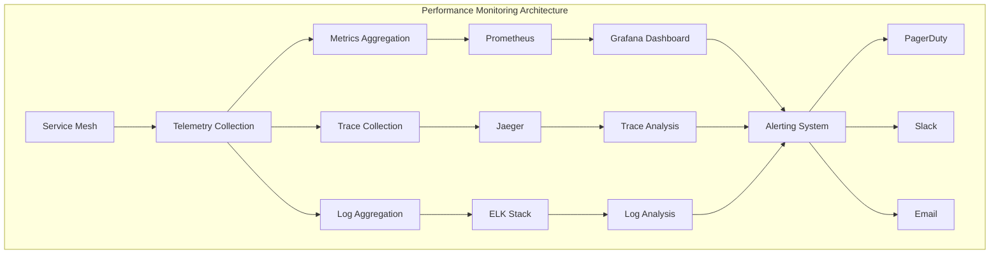
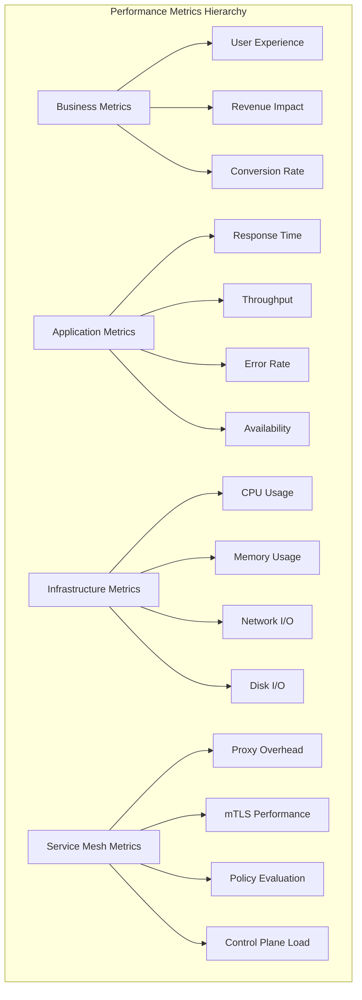
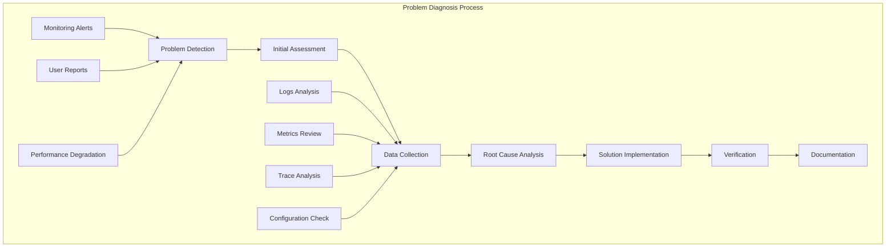
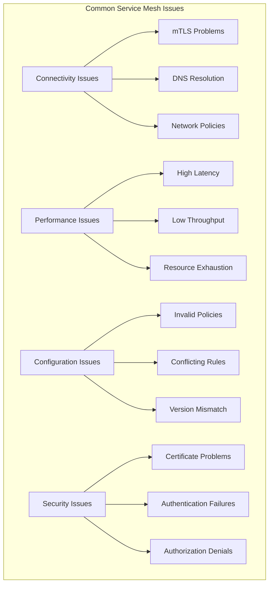
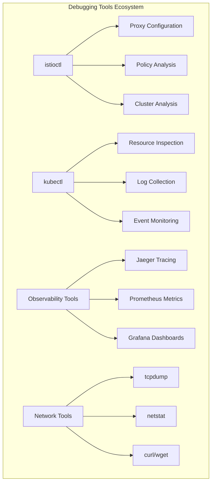
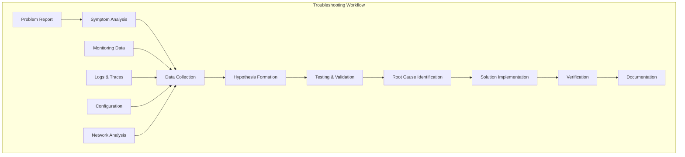

# Session 7: 서비스 메시 운영과 문제 해결

## 📍 교과과정에서의 위치
이 세션은 **Week 3 > Day 4 > Session 7**로, 실제 운영 환경에서의 Service Mesh 관리와 문제 해결 방법론을 학습합니다.

## 학습 목표 (5분)
- **서비스 메시 성능 모니터링**과 **최적화** 전략 이해
- **일반적인 운영 문제**와 **체계적인 해결 방법** 학습
- **디버깅 도구**와 **트러블슈팅** 기법 습득
- **운영 모범 사례**와 **성능 최적화** 방법론 파악

## 1. 서비스 메시 성능 모니터링과 최적화 (15분)

### 성능 모니터링 아키텍처



### 성능 메트릭 계층



### 성능 모니터링 및 최적화 전략
```
서비스 메시 성능 모니터링 및 최적화:

1. 핵심 성능 지표 (Key Performance Indicators):
   🔹 응답 시간 메트릭:
      • P50, P95, P99 지연 시간
      • 평균 응답 시간
      • 최대 응답 시간
      • 지연 시간 분포 분석
   🔹 처리량 메트릭:
      • 초당 요청 수 (RPS)
      • 초당 트랜잭션 수 (TPS)
      • 대역폭 사용량
      • 동시 연결 수
   🔹 오류율 메트릭:
      • HTTP 4xx/5xx 오류율
      • 타임아웃 오류율
      • 연결 실패율
      • 서킷 브레이커 활성화율
   🔹 가용성 메트릭:
   🔹 서비스 가동 시간
   🔹 SLA/SLO 준수율
   🔹 MTTR (평균 복구 시간)
   🔹 MTBF (평균 장애 간격)

2. 서비스 메시 오버헤드 분석:
   🔹 프록시 오버헤드:
      • Envoy 프록시 CPU 사용량
      • 메모리 사용량 증가
      • 네트워크 지연 추가
      • 처리량 영향 분석
   🔹 mTLS 성능 영향:
      • TLS 핸드셰이크 오버헤드
      • 암호화/복호화 CPU 사용량
      • 인증서 검증 시간
      • 세션 재사용 효과
   🔹 정책 평가 비용:
      • 인증 정책 처리 시간
      • 권한 부여 정책 평가
      • 트래픽 정책 적용 비용
      • 복잡한 규칙의 성능 영향
   🔹 텔레메트리 수집 비용:
   🔹 메트릭 수집 오버헤드
   🔹 분산 추적 샘플링 영향
   🔹 로그 생성 비용
   🔹 데이터 전송 대역폭

3. 성능 최적화 기법:
   🔹 프록시 최적화:
      • Envoy 구성 튜닝
      • 연결 풀 최적화
      • 버퍼 크기 조정
      • 워커 스레드 수 최적화
   🔹 네트워크 최적화:
      • Keep-alive 설정 최적화
      • TCP 소켓 옵션 튜닝
      • 네트워크 버퍼 크기 조정
      • 압축 설정 최적화
   🔹 보안 최적화:
      • TLS 세션 재사용
      • 암호화 스위트 최적화
      • 인증서 캐싱
      • 하드웨어 가속 활용
   🔹 리소스 최적화:
   🔹 CPU 및 메모리 할당 최적화
   🔹 가비지 컬렉션 튜닝
   🔹 캐시 전략 최적화
   🔹 배치 처리 최적화

4. 모니터링 도구 및 대시보드:
   🔹 Grafana 대시보드:
      • 서비스 메시 개요 대시보드
      • 서비스별 성능 대시보드
      • 인프라 모니터링 대시보드
      • 비즈니스 메트릭 대시보드
   🔹 알림 시스템:
      • 임계값 기반 알림
      • 이상 징후 감지 알림
      • SLA 위반 알림
      • 에스컬레이션 정책
   🔹 성능 분석 도구:
      • 프로파일링 도구
      • 부하 테스트 도구
      • 벤치마킹 도구
      • 용량 계획 도구
   🔹 자동화된 최적화:
   🔹 자동 스케일링
   🔹 동적 구성 조정
   🔹 적응형 로드 밸런싱
   🔹 자동 튜닝 시스템
```

## 2. 일반적인 운영 문제와 해결 방법 (12분)

### 문제 진단 프로세스



### 일반적인 문제 유형



### 운영 문제 해결 방법론
```
서비스 메시 운영 문제 해결:

1. 연결성 문제 (Connectivity Issues):
   🔹 mTLS 관련 문제:
      • 증상: 503 Service Unavailable, TLS 핸드셰이크 실패
      • 원인: 인증서 만료, 잘못된 CA, 모드 불일치
      • 진단: istioctl proxy-config cluster, openssl 검증
      • 해결: 인증서 갱신, PeerAuthentication 수정
   🔹 DNS 해상도 문제:
      • 증상: 서비스 발견 실패, NXDOMAIN 오류
      • 원인: CoreDNS 설정, 서비스 등록 문제
      • 진단: nslookup, dig 명령어 사용
      • 해결: DNS 설정 수정, 서비스 재등록
   🔹 네트워크 정책 문제:
      • 증상: 트래픽 차단, 연결 거부
      • 원인: 잘못된 NetworkPolicy, 방화벽 규칙
      • 진단: kubectl describe networkpolicy
      • 해결: 정책 수정, 포트 및 프로토콜 확인
   🔹 사이드카 주입 문제:
   🔹 증상: 사이드카 없는 파드, 메시 외부 통신
   🔹 원인: 주입 설정 오류, 네임스페이스 라벨 누락
   🔹 진단: kubectl get pods -o wide, 어노테이션 확인
   🔹 해결: 라벨 추가, 파드 재시작

2. 성능 문제 (Performance Issues):
   🔹 높은 지연 시간:
      • 증상: 응답 시간 증가, 타임아웃 발생
      • 원인: 프록시 오버헤드, 네트워크 지연, 리소스 부족
      • 진단: 분산 추적, 메트릭 분석, 프로파일링
      • 해결: 리소스 증설, 구성 최적화, 캐싱 적용
   🔹 낮은 처리량:
      • 증상: RPS 감소, 큐잉 지연
      • 원인: 연결 풀 제한, CPU 병목, 메모리 부족
      • 진단: 리소스 사용량 모니터링, 프로파일링
      • 해결: 연결 풀 확장, 스케일링, 최적화
   🔹 리소스 고갈:
      • 증상: OOMKilled, CPU 스로틀링
      • 원인: 메모리 누수, 무한 루프, 과도한 로깅
      • 진단: 리소스 모니터링, 힙 덤프 분석
      • 해결: 리소스 한계 조정, 코드 최적화
   🔹 서킷 브레이커 활성화:
   🔹 증상: 503 오류 증가, 요청 차단
   🔹 원인: 연속 오류 임계값 초과, 잘못된 설정
   🔹 진단: 서킷 브레이커 상태 확인, 오류 패턴 분석
   🔹 해결: 임계값 조정, 근본 원인 해결

3. 구성 문제 (Configuration Issues):
   🔹 잘못된 정책 구성:
      • 증상: 예상과 다른 라우팅, 정책 적용 실패
      • 원인: YAML 문법 오류, 잘못된 셀렉터
      • 진단: istioctl analyze, kubectl describe
      • 해결: 구성 검증, 문법 수정, 테스트
   🔹 충돌하는 규칙:
      • 증상: 일관성 없는 동작, 간헐적 오류
      • 원인: 여러 정책 간 충돌, 우선순위 문제
      • 진단: 정책 우선순위 분석, 규칙 매칭 확인
      • 해결: 정책 통합, 우선순위 명확화
   🔹 버전 불일치:
      • 증상: 호환성 문제, 기능 동작 안함
      • 원인: Istio 버전 불일치, API 버전 차이
      • 진단: 버전 확인, 호환성 매트릭스 검토
      • 해결: 버전 통일, 점진적 업그레이드
   🔹 리소스 한계 초과:
   🔹 증상: 정책 적용 실패, 성능 저하
   🔹 원인: 너무 많은 규칙, 복잡한 정책
   🔹 진단: 리소스 사용량 모니터링, 정책 복잡도 분석
   🔹 해결: 정책 단순화, 리소스 증설

4. 보안 문제 (Security Issues):
   🔹 인증서 관련 문제:
      • 증상: TLS 오류, 인증 실패
      • 원인: 인증서 만료, 잘못된 CN/SAN
      • 진단: 인증서 유효성 검사, 체인 검증
      • 해결: 인증서 갱신, CA 설정 수정
   🔹 인증 실패:
      • 증상: 401 Unauthorized, JWT 검증 실패
      • 원인: 잘못된 토큰, 만료된 토큰, 잘못된 발급자
      • 진단: 토큰 디코딩, 발급자 확인, 시간 동기화
      • 해결: 토큰 갱신, 발급자 설정 수정
   🔹 권한 부여 거부:
      • 증상: 403 Forbidden, 접근 거부
      • 원인: 잘못된 RBAC 규칙, 누락된 권한
      • 진단: AuthorizationPolicy 분석, 권한 추적
      • 해결: 정책 수정, 권한 추가
   🔹 보안 정책 위반:
   🔹 증상: 보안 스캔 실패, 컴플라이언스 위반
   🔹 원인: 약한 암호화, 불안전한 설정
   🔹 진단: 보안 스캔, 정책 검토
   🔹 해결: 보안 강화, 정책 업데이트
```

## 3. 디버깅 도구와 트러블슈팅 기법 (10분)

### 디버깅 도구 생태계



### 트러블슈팅 워크플로우



### 디버깅 도구 및 기법
```
서비스 메시 디버깅 도구 및 기법:

1. istioctl 디버깅 명령어:
   🔹 프록시 구성 분석:
      • istioctl proxy-config cluster: 클러스터 구성 확인
      • istioctl proxy-config listener: 리스너 구성 확인
      • istioctl proxy-config route: 라우팅 규칙 확인
      • istioctl proxy-config endpoint: 엔드포인트 상태 확인
   🔹 정책 분석:
      • istioctl analyze: 구성 문제 자동 분석
      • istioctl authz check: 권한 부여 정책 검증
      • istioctl experimental describe: 리소스 상세 분석
      • istioctl experimental config-dump: 전체 구성 덤프
   🔹 트래픽 분석:
      • istioctl proxy-status: 프록시 동기화 상태
      • istioctl experimental envoy-stats: Envoy 통계
      • istioctl experimental metrics: 메트릭 수집
      • istioctl experimental wait: 구성 동기화 대기
   🔹 진단 정보 수집:
   🔹 istioctl bug-report: 종합 진단 리포트
   🔹 istioctl version: 버전 정보 확인
   🔹 istioctl experimental precheck: 사전 검사
   🔹 istioctl experimental internal-debug: 내부 디버그 정보

2. kubectl 디버깅 기법:
   🔹 리소스 상태 확인:
      • kubectl get pods -o wide: 파드 상태 및 위치
      • kubectl describe pod: 파드 상세 정보
      • kubectl get events: 클러스터 이벤트
      • kubectl get svc,ep: 서비스 및 엔드포인트
   🔹 로그 수집 및 분석:
      • kubectl logs -f: 실시간 로그 스트리밍
      • kubectl logs --previous: 이전 컨테이너 로그
      • kubectl logs -c istio-proxy: 사이드카 로그
      • kubectl exec -it: 컨테이너 내부 접근
   🔹 네트워크 디버깅:
      • kubectl port-forward: 포트 포워딩
      • kubectl exec -- netstat: 네트워크 연결 상태
      • kubectl exec -- nslookup: DNS 해상도 테스트
      • kubectl exec -- curl: HTTP 연결 테스트
   🔹 구성 검증:
   🔹 kubectl apply --dry-run: 구성 검증
   🔹 kubectl diff: 변경 사항 비교
   🔹 kubectl explain: 리소스 스키마 확인
   🔹 kubectl api-resources: 사용 가능한 리소스

3. 네트워크 디버깅 도구:
   🔹 패킷 캡처 및 분석:
      • tcpdump: 네트워크 패킷 캡처
      • wireshark: 패킷 분석 도구
      • tshark: 명령줄 패킷 분석
      • netstat: 네트워크 연결 상태
   🔹 연결성 테스트:
      • curl/wget: HTTP 요청 테스트
      • telnet: TCP 연결 테스트
      • nc (netcat): 네트워크 연결 도구
      • ping/traceroute: 네트워크 경로 추적
   🔹 TLS/SSL 디버깅:
      • openssl s_client: TLS 연결 테스트
      • openssl x509: 인증서 분석
      • openssl verify: 인증서 체인 검증
      • gnutls-cli: TLS 핸드셰이크 분석
   🔹 DNS 디버깅:
   🔹 nslookup: DNS 쿼리 도구
   🔹 dig: 고급 DNS 조회
   🔹 host: 간단한 DNS 조회
   🔹 systemd-resolve: systemd DNS 해상도

4. 관찰 가능성 도구 활용:
   🔹 분산 추적 분석:
      • Jaeger UI: 추적 시각화
      • 추적 검색 및 필터링
      • 서비스 의존성 분석
      • 성능 병목점 식별
   🔹 메트릭 분석:
      • Prometheus 쿼리: PromQL 활용
      • Grafana 대시보드: 시각화
      • 알림 규칙 설정
      • 이상 징후 감지
   🔹 로그 분석:
      • ELK Stack: 로그 검색 및 분석
      • 구조화된 로그 쿼리
      • 로그 상관관계 분석
      • 오류 패턴 식별
   🔹 통합 분석:
   🔹 메트릭-로그-추적 상관관계
   🔹 시간 기반 분석
   🔹 다차원 분석
   🔹 근본 원인 분석

5. 자동화된 디버깅:
   🔹 헬스 체크 자동화:
      • 정기적인 연결성 테스트
      • 서비스 가용성 모니터링
      • 성능 기준선 비교
      • 자동 알림 시스템
   🔹 구성 검증 자동화:
      • CI/CD 파이프라인 통합
      • 정책 검증 자동화
      • 드리프트 감지
      • 자동 수정 제안
   🔹 성능 프로파일링:
      • 지속적인 성능 모니터링
      • 자동 벤치마킹
      • 성능 회귀 감지
      • 최적화 권고사항
   🔹 인시던트 대응 자동화:
   🔹 자동 진단 스크립트
   🔹 런북 자동화
   🔹 자동 복구 액션
   🔹 에스컬레이션 자동화
```

## 💬 그룹 토론: 서비스 메시 운영 성숙도 모델 (8분)

### 토론 주제
**"서비스 메시 운영 성숙도를 평가하는 기준은 무엇이며, 각 성숙도 단계에서 우선적으로 개선해야 할 영역은 무엇인가?"**

### 토론 가이드라인

#### 성숙도 단계별 특성 (3분)
- **초기 단계**: 기본 설치, 수동 운영, 반응적 문제 해결
- **발전 단계**: 모니터링 체계, 표준화된 프로세스, 예방적 관리
- **성숙 단계**: 자동화, 예측적 분석, 지속적 최적화

#### 평가 기준과 지표 (3분)
- **기술적 성숙도**: 자동화 수준, 모니터링 커버리지, 문제 해결 시간
- **프로세스 성숙도**: 표준화, 문서화, 교육 체계
- **조직적 성숙도**: 역량, 문화, 거버넌스

#### 개선 우선순위 (2분)
- **단기 개선**: 모니터링 강화, 알림 시스템, 문서화
- **중기 개선**: 자동화 도입, 프로세스 표준화, 교육
- **장기 개선**: 예측적 분석, 자동 최적화, 혁신 문화

## 💡 핵심 개념 정리
- **성능 모니터링**: 다층 메트릭, 실시간 분석, 자동화된 알림
- **문제 해결**: 체계적 진단, 근본 원인 분석, 예방적 조치
- **디버깅 도구**: istioctl, kubectl, 관찰 가능성 도구 활용
- **운영 성숙도**: 단계적 발전, 지속적 개선, 자동화 확대

## 📚 참고 자료
- [Istio Troubleshooting Guide](https://istio.io/latest/docs/ops/common-problems/)
- [Envoy Administration Interface](https://www.envoyproxy.io/docs/envoy/latest/operations/admin)
- [Service Mesh Performance](https://smp-spec.io/)
- [Kubernetes Troubleshooting](https://kubernetes.io/docs/tasks/debug-application-cluster/)

## 다음 세션 준비
다음 세션에서는 **Service Mesh 도입 전략과 모범 사례**에 대해 학습합니다. 점진적 도입 방법론과 실무 적용 사례를 통한 성공적인 Service Mesh 구현 전략을 다룰 예정입니다.