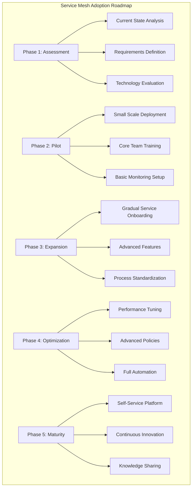
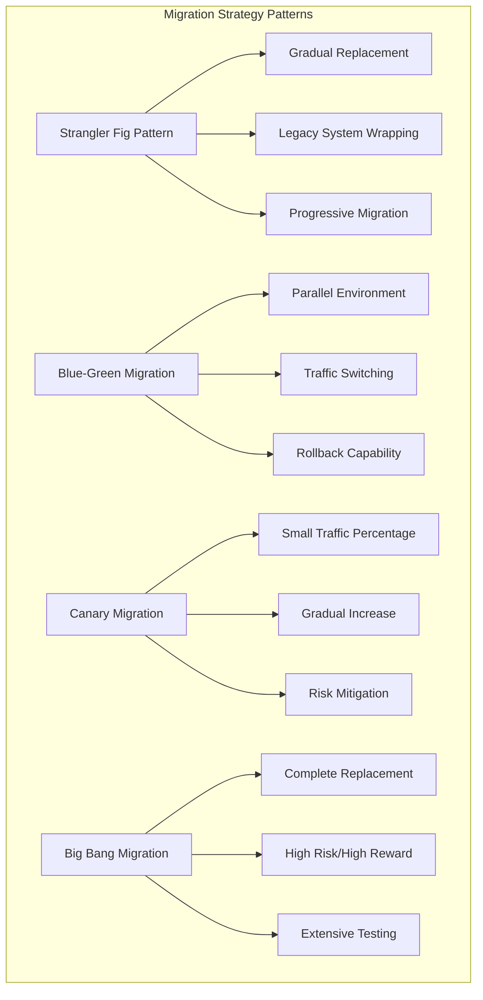
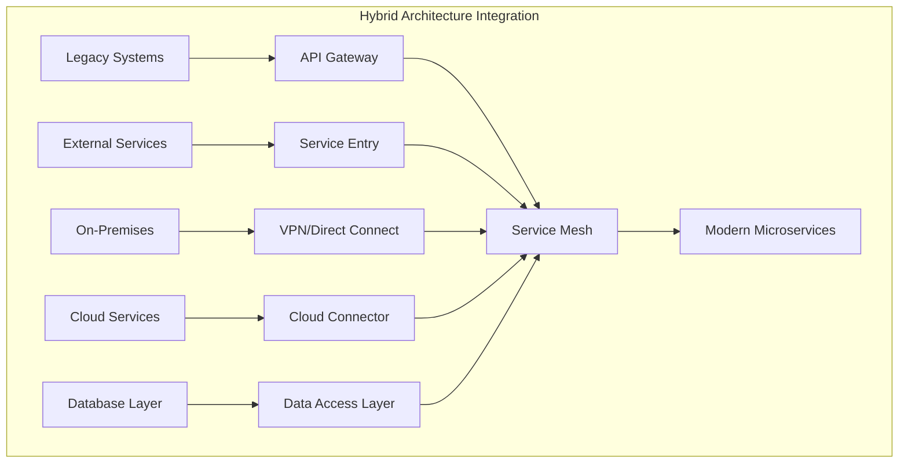
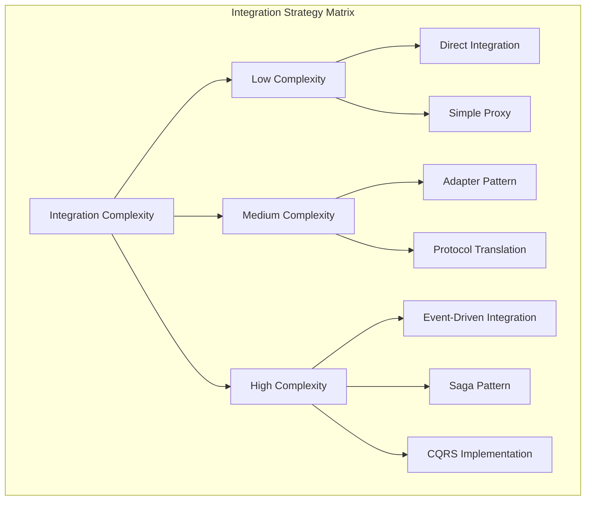
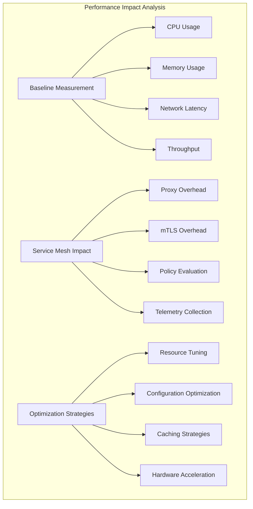
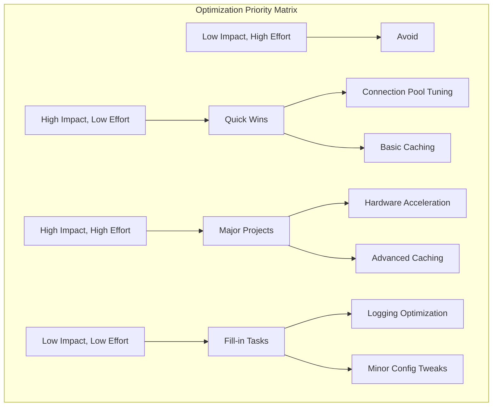

# Session 8: Service Mesh 도입 전략과 모범 사례

## 📍 교과과정에서의 위치
이 세션은 **Week 3 > Day 4 > Session 8**로, Service Mesh의 성공적인 도입 전략과 실무 적용 모범 사례를 학습합니다.

## 학습 목표 (5분)
- **점진적 도입 전략**과 **마이그레이션** 방법론 이해
- **기존 시스템과의 통합** 방안과 **호환성** 고려사항 학습
- **성능 영향 분석**과 **최적화** 전략 수립 방법 파악
- **실무 적용 사례**와 **교훈**을 통한 성공 요인 습득

## 1. 점진적 도입 전략과 마이그레이션 방법론 (15분)

### Service Mesh 도입 로드맵



### 마이그레이션 전략 패턴



### 점진적 도입 전략 상세
```
Service Mesh 점진적 도입 전략:

1. 사전 평가 및 준비 (Assessment & Preparation):
   🔹 현재 상태 분석:
      • 기존 아키텍처 평가
      • 마이크로서비스 성숙도 측정
      • 네트워크 토폴로지 분석
      • 보안 요구사항 식별
   🔹 비즈니스 케이스 구축:
      • ROI 분석 및 비용 효과
      • 위험 평가 및 완화 계획
      • 성공 지표 정의
      • 타임라인 및 마일스톤 설정
   🔹 기술 평가:
      • Service Mesh 솔루션 비교
      • 기존 인프라와의 호환성
      • 성능 영향 분석
      • 운영 복잡성 평가
   🔹 팀 준비:
   🔹 필요 역량 식별
   🔹 교육 계획 수립
   🔹 조직 구조 검토
   🔹 변화 관리 전략

2. 파일럿 프로젝트 (Pilot Project):
   🔹 적절한 서비스 선택:
      • 비즈니스 영향도가 낮은 서비스
      • 개발팀의 협조가 용이한 서비스
      • 마이크로서비스 패턴이 잘 적용된 서비스
      • 명확한 성공 기준을 설정할 수 있는 서비스
   🔹 최소 기능 구현:
      • 기본 사이드카 주입
      • 트래픽 관리 기본 기능
      • 기본 보안 정책 적용
      • 모니터링 및 관찰 가능성
   🔹 학습 및 검증:
      • 성능 영향 측정
      • 운영 복잡성 평가
      • 개발자 경험 평가
      • 문제점 및 개선사항 도출
   🔹 성공 기준 평가:
   🔹 기술적 목표 달성도
   🔹 비즈니스 가치 실현
   🔹 팀 만족도 및 수용성
   🔹 다음 단계 준비도

3. 점진적 확장 (Gradual Expansion):
   🔹 서비스 온보딩 전략:
      • 의존성 기반 우선순위
      • 팀별 준비도 고려
      • 비즈니스 중요도 반영
      • 기술적 복잡성 고려
   🔹 기능 단계별 도입:
      • 1단계: 기본 연결성 및 관찰 가능성
      • 2단계: 트래픽 관리 및 라우팅
      • 3단계: 보안 정책 및 mTLS
      • 4단계: 고급 기능 (카나리, A/B 테스트)
   🔹 위험 관리:
      • 단계별 롤백 계획
      • 성능 모니터링 강화
      • 장애 대응 프로세스
      • 에스컬레이션 절차
   🔹 지속적 개선:
   🔹 피드백 수집 및 분석
   🔹 프로세스 개선
   🔹 도구 및 자동화 개선
   🔹 지식 공유 및 문서화

4. 마이그레이션 패턴 적용:
   🔹 Strangler Fig 패턴:
      • 레거시 시스템을 점진적으로 대체
      • 새로운 기능은 Service Mesh에서 구현
      • 기존 기능을 하나씩 마이그레이션
      • 최종적으로 레거시 시스템 제거
   🔹 병렬 실행 패턴:
      • 기존 시스템과 새 시스템 병렬 운영
      • 트래픽을 점진적으로 새 시스템으로 이동
      • 비교 분석을 통한 검증
      • 확신 후 완전 전환
   🔹 데이터베이스 마이그레이션:
      • 데이터 동기화 전략
      • 트랜잭션 일관성 보장
      • 데이터 검증 및 무결성 확인
      • 롤백 시나리오 준비
   🔹 외부 의존성 관리:
   🔹 외부 API 연동 방식 변경
   🔹 써드파티 서비스 통합
   🔹 레거시 시스템과의 연동
   🔹 하이브리드 환경 관리

5. 성공 요인 및 모범 사례:
   🔹 조직적 요인:
      • 경영진의 강력한 지원
      • 전담 팀 구성 및 역할 명확화
      • 크로스 펑셔널 협업 체계
      • 변화 관리 및 커뮤니케이션
   🔹 기술적 요인:
      • 충분한 테스트 및 검증
      • 자동화된 배포 파이프라인
      • 포괄적인 모니터링 체계
      • 문서화 및 지식 관리
   🔹 프로세스 요인:
      • 명확한 거버넌스 체계
      • 표준화된 운영 프로세스
      • 정기적인 검토 및 개선
      • 위험 관리 및 대응 체계
   🔹 문화적 요인:
   🔹 학습 및 실험 문화
   🔹 실패에 대한 관용적 태도
   🔹 지속적 개선 마인드셋
   🔹 지식 공유 및 협업 문화
```

## 2. 기존 시스템과의 통합 방안 (12분)

### 하이브리드 아키텍처 패턴



### 통합 전략 매트릭스



### 기존 시스템 통합 방안
```
기존 시스템과의 통합 전략:

1. 레거시 시스템 통합:
   🔹 API Gateway 패턴:
      • 레거시 시스템을 API로 노출
      • 프로토콜 변환 및 어댑터 구현
      • 인증 및 권한 부여 통합
      • 트래픽 제어 및 모니터링
   🔹 프록시 패턴:
      • 레거시 시스템 앞에 프록시 배치
      • Service Mesh와 레거시 간 브릿지 역할
      • 점진적 기능 이전 지원
      • 트래픽 라우팅 및 로드 밸런싱
   🔹 어댑터 패턴:
      • 레거시 인터페이스를 현대적 API로 변환
      • 데이터 형식 변환 및 매핑
      • 비즈니스 로직 캡슐화
      • 버전 관리 및 호환성 유지
   🔹 이벤트 기반 통합:
   🔹 메시지 큐를 통한 비동기 통신
   🔹 이벤트 소싱 및 CQRS 패턴
   🔹 데이터 일관성 및 동기화
   🔹 장애 격리 및 복구

2. 외부 서비스 통합:
   🔹 ServiceEntry 활용:
      • 외부 서비스를 메시에 등록
      • 트래픽 정책 적용
      • 보안 정책 및 mTLS 설정
      • 모니터링 및 관찰 가능성
   🔹 Egress Gateway:
      • 외부 트래픽의 중앙 집중 관리
      • 보안 정책 및 접근 제어
      • 트래픽 모니터링 및 로깅
      • 네트워크 정책 적용
   🔹 프로토콜 지원:
      • HTTP/HTTPS, gRPC 지원
      • TCP 프록시 기능
      • 데이터베이스 프로토콜 지원
      • 커스텀 프로토콜 확장
   🔹 서비스 디스커버리:
   🔹 외부 서비스 자동 발견
   🔹 헬스 체크 및 상태 관리
   🔹 로드 밸런싱 및 장애 조치
   🔹 동적 구성 업데이트

3. 클라우드 및 멀티 클라우드 통합:
   🔹 멀티 클러스터 메시:
      • 클러스터 간 서비스 통신
      • 통합된 서비스 디스커버리
      • 크로스 클러스터 로드 밸런싱
      • 통합 보안 정책 관리
   🔹 하이브리드 클라우드:
      • 온프레미스와 클라우드 연결
      • 네트워크 연결성 (VPN, Direct Connect)
      • 데이터 주권 및 컴플라이언스
      • 지연 시간 최적화
   🔹 클라우드 네이티브 서비스 통합:
      • 관리형 데이터베이스 연동
      • 클라우드 스토리지 통합
      • 서버리스 함수 연동
      • AI/ML 서비스 통합
   🔹 재해 복구 및 백업:
   🔹 멀티 리전 배포
   🔹 데이터 복제 및 동기화
   🔹 장애 조치 자동화
   🔹 비즈니스 연속성 계획

4. 데이터 통합 전략:
   🔹 데이터베이스 통합:
      • 데이터베이스 프록시 패턴
      • 읽기/쓰기 분리
      • 샤딩 및 파티셔닝
      • 캐싱 전략
   🔹 데이터 동기화:
      • 실시간 데이터 복제
      • 배치 데이터 동기화
      • 이벤트 기반 데이터 전파
      • 데이터 일관성 보장
   🔹 데이터 변환:
      • ETL/ELT 파이프라인
      • 스키마 변환 및 매핑
      • 데이터 품질 관리
      • 메타데이터 관리
   🔹 데이터 거버넌스:
   🔹 데이터 보안 및 프라이버시
   🔹 접근 권한 관리
   🔹 감사 및 컴플라이언스
   🔹 데이터 생명주기 관리

5. 보안 통합:
   🔹 인증 통합:
      • 기존 IAM 시스템 연동
      • SSO (Single Sign-On) 구현
      • 다중 인증 제공자 지원
      • 토큰 변환 및 매핑
   🔹 권한 부여 통합:
      • RBAC 정책 통합
      • 속성 기반 접근 제어 (ABAC)
      • 동적 권한 평가
      • 정책 동기화
   🔹 네트워크 보안:
      • 방화벽 규칙 통합
      • 네트워크 세그멘테이션
      • 침입 탐지 시스템 연동
      • 보안 모니터링 통합
   🔹 컴플라이언스:
   🔹 규정 준수 요구사항 매핑
   🔹 감사 로그 통합
   🔹 보안 정책 자동화
   🔹 위험 평가 및 관리
```

## 3. 성능 영향 분석과 최적화 전략 (10분)

### 성능 영향 분석 프레임워크



### 최적화 우선순위 매트릭스



### 성능 최적화 전략
```
Service Mesh 성능 최적화 전략:

1. 성능 영향 분석:
   🔹 베이스라인 측정:
      • Service Mesh 도입 전 성능 측정
      • 응답 시간, 처리량, 리소스 사용량
      • 다양한 부하 조건에서의 측정
      • 성능 프로파일 생성
   🔹 Service Mesh 오버헤드 측정:
      • 프록시 추가로 인한 지연 시간 증가
      • CPU 및 메모리 사용량 증가
      • 네트워크 대역폭 사용량 변화
      • 처리량 감소 정도 측정
   🔹 컴포넌트별 영향 분석:
      • Envoy 프록시 오버헤드
      • mTLS 암호화/복호화 비용
      • 정책 평가 시간
      • 텔레메트리 수집 비용
   🔹 비즈니스 영향 평가:
   🔹 사용자 경험에 미치는 영향
   🔹 SLA/SLO 준수 여부
   🔹 비즈니스 메트릭 변화
   🔹 비용 대비 효과 분석

2. 프록시 최적화:
   🔹 Envoy 구성 튜닝:
      • 워커 스레드 수 최적화
      • 연결 풀 설정 조정
      • 버퍼 크기 최적화
      • 타임아웃 설정 조정
   🔹 리소스 할당 최적화:
      • CPU 및 메모리 리소스 적절 할당
      • JVM 힙 크기 조정 (해당 시)
      • 가비지 컬렉션 튜닝
      • NUMA 토폴로지 고려
   🔹 네트워크 최적화:
      • TCP 소켓 옵션 튜닝
      • Keep-alive 설정 최적화
      • 네트워크 버퍼 크기 조정
      • 압축 설정 최적화
   🔹 캐싱 전략:
   🔹 연결 재사용 최대화
   🔹 DNS 캐싱 최적화
   🔹 라우팅 캐시 활용
   🔹 정책 캐싱 구현

3. 보안 최적화:
   🔹 mTLS 성능 최적화:
      • TLS 세션 재사용 활성화
      • 암호화 스위트 최적화
      • 인증서 캐싱 구현
      • 하드웨어 가속 활용
   🔹 인증서 관리 최적화:
      • 인증서 생명주기 최적화
      • 자동 갱신 프로세스 개선
      • 인증서 배포 최적화
      • 검증 프로세스 간소화
   🔹 정책 평가 최적화:
      • 정책 복잡도 최소화
      • 정책 캐싱 구현
      • 조건부 평가 최적화
      • 정책 우선순위 최적화
   🔹 보안 모니터링 최적화:
   🔹 로그 레벨 최적화
   🔹 샘플링 비율 조정
   🔹 배치 처리 구현
   🔹 압축 및 직렬화 최적화

4. 텔레메트리 최적화:
   🔹 메트릭 수집 최적화:
      • 메트릭 샘플링 비율 조정
      • 불필요한 메트릭 비활성화
      • 메트릭 집계 최적화
      • 배치 전송 구현
   🔹 분산 추적 최적화:
      • 추적 샘플링 전략 최적화
      • 스팬 데이터 최소화
      • 비동기 전송 구현
      • 압축 및 직렬화 최적화
   🔹 로그 최적화:
      • 로그 레벨 적절 설정
      • 구조화된 로그 사용
      • 로그 필터링 구현
      • 비동기 로깅 활용
   🔹 데이터 파이프라인 최적화:
   🔹 데이터 압축 및 직렬화
   🔹 배치 처리 및 버퍼링
   🔹 백프레셔 처리 구현
   🔹 데이터 품질 관리

5. 인프라 최적화:
   🔹 하드웨어 최적화:
      • CPU 아키텍처 고려 (x86, ARM)
      • 네트워크 카드 성능 최적화
      • 스토리지 I/O 최적화
      • 메모리 대역폭 최적화
   🔹 컨테이너 최적화:
      • 컨테이너 이미지 최적화
      • 리소스 제한 적절 설정
      • 컨테이너 런타임 최적화
      • 노드 배치 최적화
   🔹 쿠버네티스 최적화:
      • 스케줄링 정책 최적화
      • 네트워크 플러그인 선택
      • 스토리지 클래스 최적화
      • 리소스 쿼터 관리
   🔹 클라우드 최적화:
   🔹 인스턴스 타입 최적화
   🔹 네트워크 성능 최적화
   🔹 스토리지 성능 최적화
   🔹 비용 최적화 전략

6. 모니터링 및 지속적 최적화:
   🔹 성능 모니터링:
      • 실시간 성능 대시보드
      • 성능 임계값 알림
      • 성능 트렌드 분석
      • 성능 회귀 감지
   🔹 자동화된 최적화:
      • 자동 스케일링 구현
      • 동적 구성 조정
      • 적응형 로드 밸런싱
      • 자동 튜닝 시스템
   🔹 성능 테스트 자동화:
      • 지속적인 성능 테스트
      • 성능 회귀 테스트
      • 부하 테스트 자동화
      • 성능 벤치마킹
   🔹 최적화 피드백 루프:
   🔹 성능 데이터 분석
   🔹 최적화 기회 식별
   🔹 개선 사항 구현
   🔹 효과 측정 및 검증
```

## 💬 그룹 토론: Service Mesh 도입 성공 요인 (8분)

### 토론 주제
**"Service Mesh 도입 프로젝트의 성공과 실패를 가르는 핵심 요인은 무엇이며, 각 요인의 상대적 중요도는 어떻게 평가할 수 있는가?"**

### 토론 가이드라인

#### 성공 요인 분석 (3분)
- 기술적 요인: 아키텍처 적합성, 성능 최적화, 안정성
- 조직적 요인: 리더십 지원, 팀 역량, 변화 관리
- 프로세스 요인: 점진적 도입, 표준화, 자동화

#### 실패 요인 분석 (3분)
- 과도한 복잡성: 한 번에 너무 많은 기능 도입
- 성능 문제: 충분하지 않은 성능 테스트와 최적화
- 조직 저항: 변화에 대한 저항과 교육 부족

#### 중요도 평가 기준 (2분)
- 비즈니스 영향: ROI, 사용자 경험, 운영 효율성
- 위험도: 기술적 위험, 조직적 위험, 일정 위험
- 지속가능성: 장기적 유지보수, 확장성, 혁신 가능성

## 💡 핵심 개념 정리
- 점진적 도입: 단계적 접근, 위험 최소화, 지속적 학습
- 통합 전략: 하이브리드 아키텍처, 레거시 시스템 연동
- 성능 최적화: 체계적 분석, 다층 최적화, 지속적 개선
- 성공 요인: 기술적 준비, 조직적 지원, 프로세스 표준화

## 📚 참고 자료
- [Service Mesh Adoption Guide](https://www.cncf.io/blog/2020/03/06/service-mesh-adoption/)
- [Istio Best Practices](https://istio.io/latest/docs/ops/best-practices/)
- [Service Mesh Performance](https://smp-spec.io/)
- [Enterprise Service Mesh Architecture](https://www.redhat.com/en/topics/microservices/what-is-a-service-mesh)

## Day 4 마무리
오늘 학습한 Service Mesh와 Istio를 통해 현대적인 마이크로서비스 아키텍처에서의 통신 관리, 보안, 관찰 가능성을 체계적으로 구현하는 방법을 이해했습니다. 다음 Day 5에서는 **고급 네트워킹과 보안**에 대해 더 깊이 있게 학습할 예정입니다.