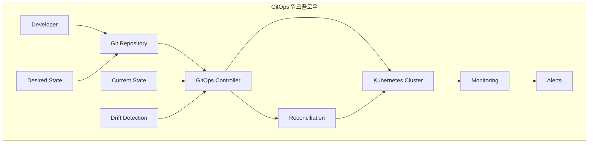
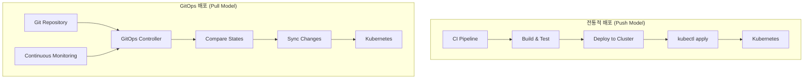
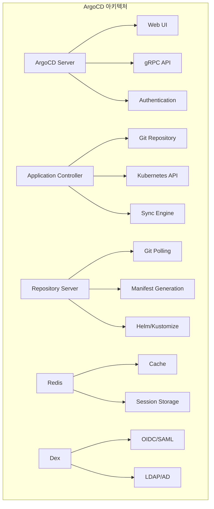
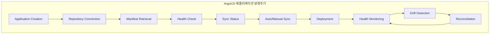
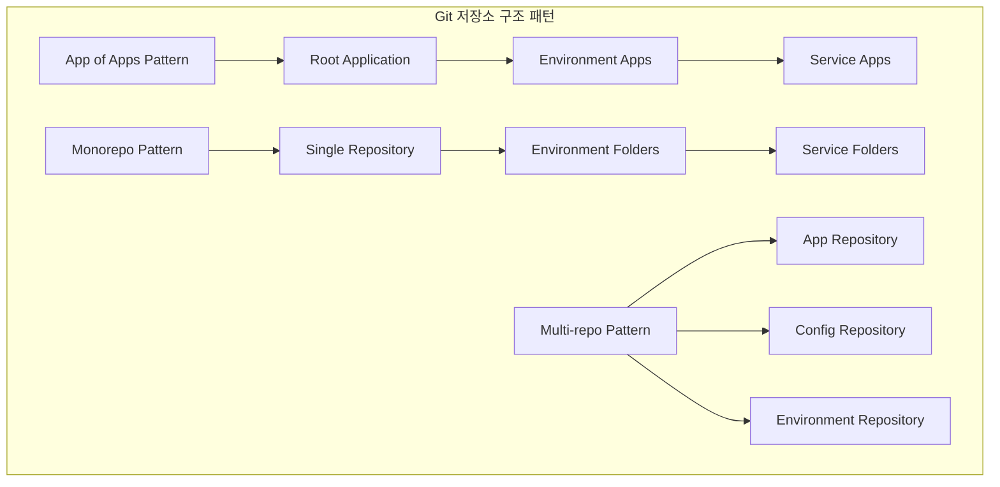
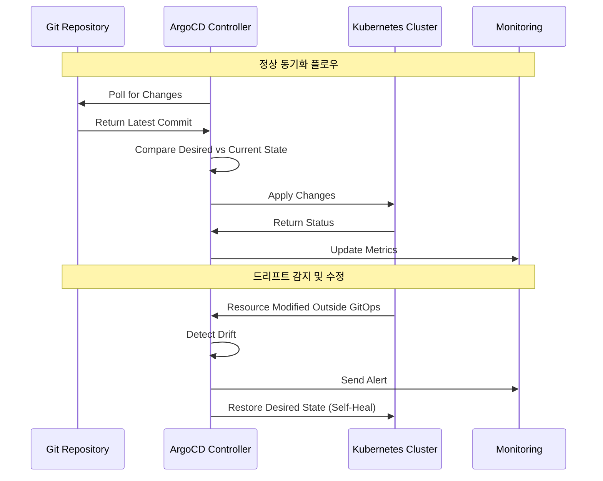

# Session 1: GitOps 개념과 ArgoCD 아키텍처

## 📍 교과과정에서의 위치
이 세션은 **Week 3 > Day 5 > Session 1**로, GitOps 개념과 ArgoCD를 활용한 선언적 배포 모델을 학습합니다.

## 학습 목표 (5분)
- **GitOps 원칙**과 **선언적 배포** 모델 이해
- **ArgoCD 아키텍처**와 **핵심 구성 요소** 학습
- **Git 기반 설정 관리**와 **동기화** 메커니즘 파악
- **멀티 클러스터 GitOps** 전략과 **확장성** 고려사항 습득

## 1. GitOps 원칙과 선언적 배포 모델 (12분)

### GitOps 개념과 원칙



### 전통적 배포 vs GitOps 배포



### GitOps 핵심 개념
```
GitOps 원칙과 선언적 배포:

GitOps 4가지 핵심 원칙:
   🔹 선언적 (Declarative):
      • 시스템의 원하는 상태를 선언적으로 정의
      • YAML 매니페스트로 모든 설정 표현
      • 인프라와 애플리케이션을 코드로 관리
      • 버전 관리 가능한 형태로 저장
      • 재현 가능하고 일관된 배포
   🔹 버전 관리 (Versioned and Immutable):
      • Git을 단일 진실 공급원(Single Source of Truth)으로 사용
      • 모든 변경사항이 Git 히스토리에 기록
      • 불변성을 통한 안정성 확보
      • 브랜치 전략을 통한 환경 분리
      • 태그를 통한 릴리스 관리
   🔹 자동 적용 (Automatically Applied):
      • Git 저장소 변경 시 자동으로 클러스터에 반영
      • 지속적인 동기화 및 드리프트 감지
      • 인간의 개입 없는 자동화된 배포
      • 실시간 상태 모니터링
      • 자동 복구 메커니즘
   🔹 지속적 모니터링 (Continuously Monitored):
   🔹 실제 상태와 원하는 상태 지속적 비교
   🔹 드리프트 감지 및 알림
   🔹 자동 수정 또는 알림 발생
   🔹 감사 추적 및 컴플라이언스
   🔹 성능 및 보안 모니터링

GitOps vs 전통적 배포:
   🔹 배포 모델 차이:
      • Push Model (전통적): CI/CD가 클러스터에 직접 배포
      • Pull Model (GitOps): 클러스터가 Git에서 변경사항 가져옴
      • 보안 관점: 클러스터 외부에서 접근 불필요
      • 네트워크 관점: 아웃바운드 연결만 필요
      • 권한 관리: 클러스터 내부 권한만 관리
   🔹 장점:
      • 보안성: 클러스터 접근 권한 최소화
      • 가시성: Git을 통한 모든 변경사항 추적
      • 안정성: 선언적 상태 관리
      • 복구성: Git 히스토리를 통한 롤백
      • 확장성: 멀티 클러스터 관리 용이
   🔹 도전과제:
      • 학습 곡선: 새로운 패러다임 적응
      • 도구 복잡성: GitOps 도구 설정 및 관리
      • 디버깅: 문제 발생 시 원인 추적 복잡
      • 초기 설정: 초기 구축 비용
      • 문화 변화: 조직 내 프로세스 변경
   🔹 적용 시나리오:
   🔹 마이크로서비스 아키텍처
   🔹 멀티 클러스터 환경
   🔹 규제 준수가 중요한 환경
   🔹 높은 가용성이 요구되는 시스템
   🔹 대규모 개발 팀 환경

선언적 배포 모델:
   🔹 상태 기반 관리:
      • 원하는 상태(Desired State) 정의
      • 현재 상태(Current State) 모니터링
      • 차이점(Drift) 감지 및 수정
      • 수렴(Convergence) 보장
      • 멱등성(Idempotency) 확보
   🔹 Git 워크플로우:
      • Feature Branch: 기능 개발
      • Pull Request: 코드 리뷰 및 승인
      • Main Branch: 프로덕션 배포
      • Tag: 릴리스 버전 관리
      • Rollback: 이전 버전으로 복구
   🔹 환경 관리:
      • 환경별 브랜치 전략
      • 환경별 설정 분리
      • 프로모션 파이프라인
      • 환경 간 일관성 보장
      • 환경별 접근 권한 관리
   🔹 보안 및 컴플라이언스:
   🔹 모든 변경사항 감사 추적
   🔹 승인 프로세스 강제
   🔹 정책 기반 배포 제어
   🔹 보안 스캔 통합
   🔹 컴플라이언스 자동 검증

GitOps 도구 생태계:
   🔹 GitOps 컨트롤러:
      • ArgoCD: 가장 인기 있는 GitOps 도구
      • Flux: CNCF 프로젝트, 경량화
      • Jenkins X: CI/CD 통합 GitOps
      • Tekton: Kubernetes 네이티브 CI/CD
      • Rancher Fleet: 멀티 클러스터 특화
   🔹 Git 저장소:
      • GitHub: 가장 널리 사용
      • GitLab: 통합 DevOps 플랫폼
      • Bitbucket: Atlassian 생태계
      • Azure DevOps: Microsoft 생태계
      • 온프레미스 Git 서버
   🔹 패키지 관리:
      • Helm: Kubernetes 패키지 매니저
      • Kustomize: 네이티브 설정 관리
      • Jsonnet: 설정 템플릿 언어
      • Kapitan: 복잡한 설정 관리
      • 커스텀 템플릿 도구
   🔹 보안 및 정책:
   🔹 OPA Gatekeeper: 정책 엔진
   🔹 Falco: 런타임 보안
   🔹 Twistlock/Prisma: 컨테이너 보안
   🔹 Aqua Security: 종합 보안 플랫폼
   🔹 커스텀 정책 도구
```

## 2. ArgoCD 아키텍처와 핵심 구성 요소 (10분)

### ArgoCD 아키텍처



### ArgoCD 애플리케이션 생명주기



### ArgoCD 구성 요소 상세
```
ArgoCD 아키텍처 및 구성 요소:

핵심 컴포넌트:
   🔹 ArgoCD Server:
      • 웹 UI 및 API 서버 역할
      • gRPC/REST API 제공
      • 사용자 인증 및 권한 관리
      • 애플리케이션 관리 인터페이스
      • 대시보드 및 모니터링 기능
   🔹 Application Controller:
      • Kubernetes 컨트롤러 패턴 구현
      • Git 저장소와 클러스터 상태 비교
      • 동기화 및 헬스 체크 수행
      • 자동 동기화 및 자가 치유
      • 멀티 클러스터 관리
   🔹 Repository Server:
      • Git 저장소 연결 및 폴링
      • 매니페스트 생성 및 캐싱
      • Helm, Kustomize, Jsonnet 지원
      • 플러그인 시스템 지원
      • 보안 스캔 통합
   🔹 Redis:
      • 캐시 저장소 역할
      • 세션 정보 저장
      • 애플리케이션 상태 캐싱
      • 성능 최적화
      • 고가용성 구성 지원
   🔹 Dex (선택적):
   🔹 OIDC 프로바이더 역할
   🔹 다양한 인증 백엔드 지원
   🔹 SSO 통합
   🔹 RBAC 연동
   🔹 감사 로깅

애플리케이션 모델:
   🔹 Application CRD:
      • Git 저장소 정보
      • 대상 클러스터 및 네임스페이스
      • 동기화 정책 설정
      • 헬스 체크 설정
      • 리소스 필터링 규칙
   🔹 Project:
      • 애플리케이션 그룹화
      • 접근 권한 관리
      • 허용된 저장소 및 클러스터
      • 리소스 제한 정책
      • 역할 기반 접근 제어
   🔹 Repository:
      • Git 저장소 연결 정보
      • 인증 정보 (SSH 키, 토큰)
      • 웹훅 설정
      • 폴링 간격 설정
      • 브랜치 및 경로 설정
   🔹 Cluster:
   🔹 대상 Kubernetes 클러스터
   🔹 클러스터 접근 정보
   🔹 네임스페이스 권한
   🔹 리소스 할당량
   🔹 보안 정책

동기화 메커니즘:
   🔹 동기화 전략:
      • Manual Sync: 수동 동기화
      • Auto Sync: 자동 동기화
      • Self Heal: 자가 치유
      • Prune: 불필요한 리소스 정리
      • Replace: 리소스 교체
   🔹 동기화 정책:
      • Sync Policy: 동기화 규칙
      • Sync Options: 동기화 옵션
      • Retry Policy: 재시도 정책
      • Rollback Policy: 롤백 정책
      • Notification Policy: 알림 정책
   🔹 헬스 체크:
      • Resource Health: 리소스 상태 확인
      • Custom Health: 커스텀 헬스 체크
      • Readiness Probe: 준비 상태 확인
      • Liveness Probe: 생존 상태 확인
      • Startup Probe: 시작 상태 확인
   🔹 상태 관리:
   🔹 Synced: 동기화 완료
   🔹 OutOfSync: 동기화 필요
   🔹 Unknown: 상태 불명
   🔹 Healthy: 정상 상태
   🔹 Degraded: 성능 저하

보안 및 권한 관리:
   🔹 인증 (Authentication):
      • 로컬 사용자 계정
      • OIDC/OAuth2 통합
      • SAML 2.0 지원
      • LDAP/Active Directory
      • GitHub/GitLab OAuth
   🔹 권한 부여 (Authorization):
      • RBAC (Role-Based Access Control)
      • 프로젝트 기반 권한
      • 애플리케이션별 권한
      • 클러스터별 권한
      • 네임스페이스별 권한
   🔹 보안 기능:
      • TLS 암호화 통신
      • 시크릿 관리 통합
      • 이미지 스캔 통합
      • 정책 엔진 연동
      • 감사 로깅
   🔹 네트워크 보안:
   🔹 네트워크 정책 지원
   🔹 서비스 메시 통합
   🔹 Ingress 보안 설정
   🔹 방화벽 규칙 관리
   🔹 VPN 연결 지원
```

## 3. Git 기반 설정 관리와 동기화 메커니즘 (15분)

### Git 저장소 구조 패턴



### 동기화 및 드리프트 감지



### Git 기반 설정 관리 전략
```
Git 기반 설정 관리 및 동기화:

Git 저장소 구조 패턴:
   🔹 App of Apps 패턴:
      • 루트 애플리케이션이 다른 애플리케이션들을 관리
      • 계층적 애플리케이션 구조
      • 환경별 애플리케이션 분리
      • 중앙집중식 관리
      • 확장성과 유지보수성 향상
   🔹 Monorepo 패턴:
      • 단일 저장소에 모든 설정 관리
      • 환경별 폴더 구조
      • 공통 설정 재사용
      • 원자적 변경 가능
      • 단순한 버전 관리
   🔹 Multi-repo 패턴:
      • 애플리케이션별 별도 저장소
      • 설정 전용 저장소 분리
      • 팀별 독립적 관리
      • 세밀한 접근 권한 제어
      • 복잡한 의존성 관리
   🔹 하이브리드 패턴:
   🔹 패턴들의 조합 활용
   🔹 조직 구조에 맞는 최적화
   🔹 단계적 마이그레이션 지원
   🔹 유연한 확장성
   🔹 복잡성 관리 필요

브랜치 전략:
   🔹 GitFlow 기반:
      • main: 프로덕션 환경
      • develop: 개발 환경
      • feature/*: 기능 개발
      • release/*: 릴리스 준비
      • hotfix/*: 긴급 수정
   🔹 GitHub Flow:
      • main: 항상 배포 가능한 상태
      • feature/*: 기능 브랜치
      • Pull Request 기반 리뷰
      • 자동 배포 파이프라인
      • 단순하고 빠른 배포
   🔹 환경별 브랜치:
      • production: 프로덕션 환경
      • staging: 스테이징 환경
      • development: 개발 환경
      • 환경별 독립적 관리
      • 프로모션 파이프라인
   🔹 태그 기반 릴리스:
   🔹 시맨틱 버저닝 (v1.2.3)
   🔹 릴리스 노트 자동 생성
   🔹 롤백 지원
   🔹 변경 이력 추적
   🔹 컴플라이언스 지원

동기화 메커니즘:
   🔹 폴링 기반 동기화:
      • 정기적인 Git 저장소 확인
      • 설정 가능한 폴링 간격
      • 네트워크 효율성 고려
      • 지연 시간 존재
      • 안정적이고 예측 가능
   🔹 웹훅 기반 동기화:
      • Git 이벤트 기반 즉시 동기화
      • 실시간 반영
      • 네트워크 효율성
      • 웹훅 설정 필요
      • 네트워크 연결성 의존
   🔹 하이브리드 동기화:
      • 웹훅 + 폴링 조합
      • 웹훅 실패 시 폴링 백업
      • 최적의 성능과 안정성
      • 복잡한 설정
      • 운영 오버헤드 증가
   🔹 수동 동기화:
   🔹 사용자 트리거 기반
   🔹 승인 프로세스 통합
   🔹 위험 최소화
   🔹 느린 배포 속도
   🔹 인적 오류 가능성

드리프트 감지 및 처리:
   🔹 드리프트 유형:
      • 설정 드리프트: 리소스 설정 변경
      • 상태 드리프트: 리소스 상태 변경
      • 스케일 드리프트: 복제본 수 변경
      • 이미지 드리프트: 컨테이너 이미지 변경
      • 네트워크 드리프트: 네트워크 설정 변경
   🔹 감지 메커니즘:
      • 지속적인 상태 비교
      • 리소스 해시 비교
      • 메타데이터 검증
      • 어노테이션 기반 추적
      • 커스텀 헬스 체크
   🔹 처리 전략:
      • 자동 수정 (Self-Heal)
      • 알림 발송
      • 수동 승인 후 수정
      • 드리프트 허용
      • 감사 로그 기록
   🔹 예외 처리:
   🔹 허용된 드리프트 정의
   🔹 임시 변경 허용
   🔹 긴급 상황 대응
   🔹 유지보수 모드
   🔹 규정 준수 고려

설정 템플릿화:
   🔹 Helm 차트:
      • 매개변수화된 템플릿
      • 값 파일 기반 설정
      • 의존성 관리
      • 패키지 버전 관리
      • 커뮤니티 차트 활용
   🔹 Kustomize:
      • 오버레이 기반 설정
      • 패치 및 변환
      • 네이티브 Kubernetes 지원
      • 선언적 설정 관리
      • 간단한 디렉토리 구조
   🔹 Jsonnet:
      • 프로그래밍 언어 기반
      • 복잡한 로직 구현 가능
      • 코드 재사용성
      • 타입 안전성
      • 학습 곡선 존재
   🔹 커스텀 도구:
   🔹 조직 특화 요구사항
   🔹 기존 도구 통합
   🔹 특수한 템플릿 로직
   🔹 레거시 시스템 지원
   🔹 유지보수 부담
```

## 💬 그룹 토론: GitOps 도입 전략 (8분)

### 토론 주제
**"기존 CI/CD 파이프라인을 운영 중인 조직에서 GitOps로 전환할 때 고려해야 할 핵심 요소와 단계적 접근 방법은 무엇인가?"**

### 토론 가이드라인

#### 전환 전략 (3분)
- **점진적 전환**: 일부 서비스부터 시작하여 단계적 확대
- **병렬 운영**: 기존 파이프라인과 GitOps 동시 운영 후 전환
- **전면 전환**: 한 번에 모든 시스템을 GitOps로 전환

#### 기술적 고려사항 (3분)
- **도구 선택**: ArgoCD vs Flux vs 기타 GitOps 도구
- **저장소 구조**: Monorepo vs Multi-repo 전략
- **보안**: 기존 보안 정책과의 통합 방안

#### 조직적 준비사항 (2분)
- **팀 교육**: GitOps 개념과 도구 사용법 교육
- **프로세스 변경**: 기존 배포 프로세스 개선
- **문화 변화**: 선언적 사고방식과 Git 중심 워크플로우 적응

## 💡 핵심 개념 정리
- **GitOps 원칙**: 선언적, 버전 관리, 자동 적용, 지속적 모니터링
- **ArgoCD 아키텍처**: Server, Controller, Repository Server, Redis
- **동기화 메커니즘**: 폴링, 웹훅, 드리프트 감지, 자가 치유
- **Git 전략**: 브랜치 전략, 저장소 구조, 템플릿 관리

## 📚 참고 자료
- [ArgoCD Documentation](https://argo-cd.readthedocs.io/)
- [GitOps Principles](https://www.gitops.tech/)
- [CNCF GitOps Working Group](https://github.com/cncf/tag-app-delivery/tree/main/gitops-wg)
- [GitOps Best Practices](https://www.weave.works/technologies/gitops/)

## 다음 세션 준비
다음 세션에서는 **Helm과 Kustomize 패키지 관리**에 대해 학습합니다. Kubernetes 애플리케이션 패키징과 설정 관리 전략을 다룰 예정입니다.