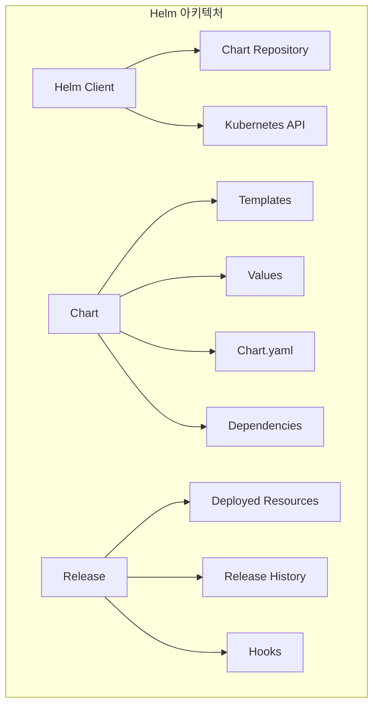
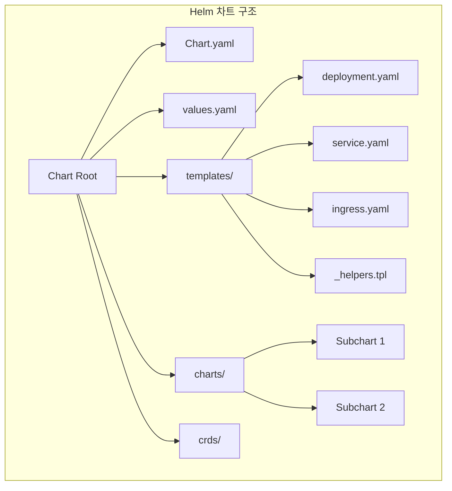
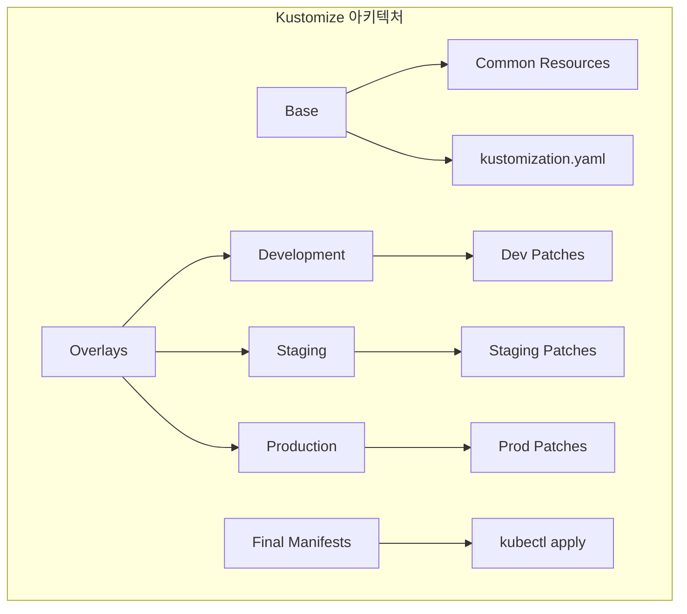
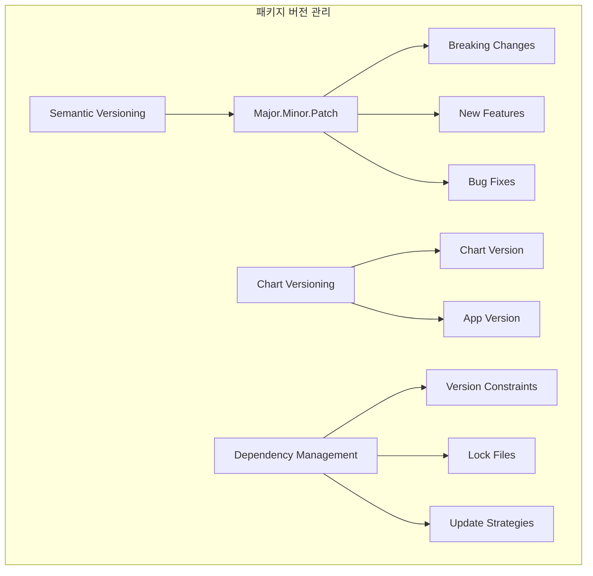
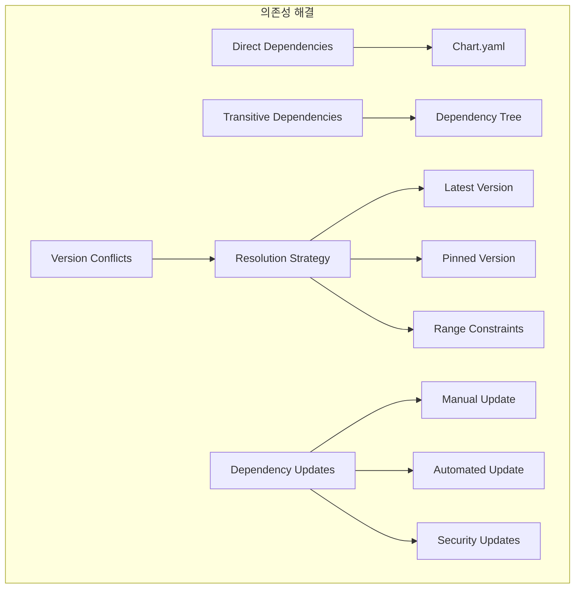

# Session 2: Helm과 Kustomize 패키지 관리

## 📍 교과과정에서의 위치
이 세션은 **Week 3 > Day 5 > Session 2**로, Helm과 Kustomize를 활용한 Kubernetes 패키지 관리와 설정 템플릿 전략을 학습합니다.

## 학습 목표 (5분)
- **Helm 차트** 설계와 **템플릿 패턴** 이해
- **Kustomize 오버레이**와 **패치 전략** 학습
- **패키지 버전 관리**와 **의존성 해결** 방법 파악
- **하이브리드 패키지 관리** 접근법과 **모범 사례** 습득

## 1. Helm 차트 설계와 템플릿 패턴 (12분)

### Helm 아키텍처



### Helm 차트 구조



### Helm 차트 설계 전략
```
Helm 차트 설계 및 템플릿 패턴:

Helm 핵심 개념:
   🔹 Chart (차트):
      • Kubernetes 애플리케이션 패키지
      • 템플릿과 기본값의 집합
      • 메타데이터 및 의존성 정보
      • 재사용 가능한 구성 요소
      • 버전 관리 및 배포 단위
   🔹 Release (릴리스):
      • 클러스터에 설치된 차트 인스턴스
      • 고유한 릴리스 이름
      • 설치 히스토리 관리
      • 업그레이드 및 롤백 지원
      • 네임스페이스별 격리
   🔹 Repository (저장소):
      • 차트 컬렉션 저장소
      • HTTP 기반 차트 배포
      • 인덱스 파일 관리
      • 버전 관리 및 검색
      • 공개/비공개 저장소 지원
   🔹 Values (값):
   🔹 차트 매개변수화
   🔹 환경별 설정 분리
   🔹 기본값 및 오버라이드
   🔹 중첩된 구조 지원
   🔹 타입 검증 가능

차트 구조 모범 사례:
   🔹 디렉토리 구조:
      • Chart.yaml: 차트 메타데이터
      • values.yaml: 기본 설정값
      • templates/: Kubernetes 매니페스트 템플릿
      • charts/: 의존성 차트 (선택적)
      • crds/: 커스텀 리소스 정의 (선택적)
   🔹 템플릿 파일 구성:
      • deployment.yaml: 애플리케이션 배포
      • service.yaml: 서비스 노출
      • ingress.yaml: 외부 접근 (선택적)
      • configmap.yaml: 설정 데이터
      • secret.yaml: 민감한 데이터
   🔹 헬퍼 템플릿:
      • _helpers.tpl: 공통 템플릿 함수
      • 라벨 표준화
      • 이름 생성 규칙
      • 셀렉터 정의
      • 어노테이션 관리
   🔹 문서화:
   🔹 README.md: 차트 사용법
   🔹 NOTES.txt: 설치 후 안내
   🔹 values.yaml 주석
   🔹 예제 설정 파일
   🔹 변경 이력 관리

템플릿 패턴:
   🔹 조건부 렌더링:
      • if/else 구문 활용
      • 기능 토글 구현
      • 환경별 리소스 생성
      • 선택적 구성 요소
      • 호환성 처리
   🔹 반복 구조:
      • range 구문 활용
      • 동적 리소스 생성
      • 다중 환경 설정
      • 배열 데이터 처리
      • 키-값 쌍 반복
   🔹 변수 및 함수:
      • 지역 변수 정의
      • 전역 변수 활용
      • 내장 함수 사용
      • 커스텀 함수 정의
      • 파이프라인 연산
   🔹 데이터 검증:
   🔹 required 함수 활용
   🔹 타입 검증
   🔹 범위 검증
   🔹 형식 검증
   🔹 의존성 검증

고급 Helm 기능:
   🔹 차트 의존성:
      • Chart.yaml dependencies 섹션
      • 서브차트 관리
      • 버전 제약 조건
      • 조건부 의존성
      • 의존성 업데이트
   🔹 훅 (Hooks):
      • pre-install: 설치 전 실행
      • post-install: 설치 후 실행
      • pre-upgrade: 업그레이드 전 실행
      • post-upgrade: 업그레이드 후 실행
      • pre-delete: 삭제 전 실행
   🔹 테스트:
      • helm test 명령어
      • 테스트 파드 정의
      • 애플리케이션 검증
      • 연결성 테스트
      • 기능 테스트
   🔹 라이브러리 차트:
   🔹 공통 템플릿 라이브러리
   🔹 재사용 가능한 구성 요소
   🔹 조직 표준화
   🔹 모범 사례 공유
   🔹 유지보수 효율성
```

## 2. Kustomize 오버레이와 패치 전략 (10분)

### Kustomize 아키텍처



### Kustomize 패치 전략

```mermaid
graph TB
    subgraph "Kustomize 패치 전략"
        A[Strategic Merge] --> B[Object Merge]
        A --> C[Array Merge]
        
        D[JSON Patch] --> E[Add Operation]
        D --> F[Remove Operation]
        D --> G[Replace Operation]
        
        H[Patch Types] --> I[patchesStrategicMerge]
        H --> J[patchesJson6902]
        H --> K[patches (inline)]
    end
```

### Kustomize 구성 전략
```
Kustomize 오버레이 및 패치 전략:

Kustomize 핵심 개념:
   🔹 Base (베이스):
      • 공통 Kubernetes 리소스 정의
      • 환경에 무관한 기본 설정
      • 재사용 가능한 구성 요소
      • kustomization.yaml 파일 포함
      • 다른 베이스 참조 가능
   🔹 Overlay (오버레이):
      • 환경별 특화 설정
      • 베이스 위에 적용되는 변경사항
      • 패치 및 변환 규칙
      • 환경별 디렉토리 구조
      • 계층적 오버레이 지원
   🔹 Patch (패치):
      • 기존 리소스 수정
      • Strategic Merge Patch
      • JSON Patch (RFC 6902)
      • 인라인 패치 지원
      • 조건부 패치 적용
   🔹 Transformer (변환기):
   🔹 리소스 변환 규칙
   🔹 이름 접두사/접미사
   🔹 라벨 및 어노테이션 추가
   🔹 네임스페이스 변경
   🔹 이미지 태그 변경

디렉토리 구조 패턴:
   🔹 환경별 오버레이:
      • base/: 공통 리소스
      • overlays/dev/: 개발 환경
      • overlays/staging/: 스테이징 환경
      • overlays/prod/: 프로덕션 환경
      • 각 환경별 kustomization.yaml
   🔹 컴포넌트 기반:
      • components/: 재사용 가능한 구성 요소
      • apps/: 애플리케이션별 설정
      • infrastructure/: 인프라 리소스
      • 모듈화된 구조
      • 의존성 관리
   🔹 계층적 구조:
      • 다단계 오버레이
      • 공통 → 환경 → 서비스
      • 상속 관계 명확화
      • 설정 재사용 극대화
      • 복잡성 관리
   🔹 하이브리드 구조:
   🔹 조직 요구사항에 맞는 조합
   🔹 팀별 독립성 보장
   🔹 표준화와 유연성 균형
   🔹 점진적 마이그레이션 지원
   🔹 확장성 고려

패치 전략:
   🔹 Strategic Merge Patch:
      • Kubernetes 네이티브 병합 전략
      • 객체 수준 병합
      • 배열 병합 전략 지원
      • 직관적이고 사용하기 쉬움
      • 대부분의 사용 사례 커버
   🔹 JSON Patch (RFC 6902):
      • 정확한 경로 기반 수정
      • add, remove, replace 연산
      • 복잡한 변경사항 처리
      • 배열 인덱스 기반 수정
      • 세밀한 제어 가능
   🔹 인라인 패치:
      • kustomization.yaml 내 직접 정의
      • 간단한 변경사항에 적합
      • 별도 파일 불필요
      • 가독성 향상
      • 유지보수 용이
   🔹 조건부 패치:
   🔹 특정 조건에서만 적용
   🔹 환경별 선택적 적용
   🔹 기능 토글 구현
   🔹 복잡한 로직 처리
   🔹 동적 구성 지원

변환기 활용:
   🔹 이름 변환:
      • namePrefix: 이름 접두사
      • nameSuffix: 이름 접미사
      • 환경별 리소스 구분
      • 충돌 방지
      • 일관된 명명 규칙
   🔹 라벨 및 어노테이션:
      • commonLabels: 공통 라벨
      • commonAnnotations: 공통 어노테이션
      • 메타데이터 표준화
      • 셀렉터 자동 업데이트
      • 추적 및 관리 용이
   🔹 이미지 변환:
      • images: 이미지 태그 변경
      • 환경별 이미지 버전
      • 레지스트리 변경
      • 태그 전략 지원
      • 보안 스캔 통합
   🔹 네임스페이스 변환:
   🔹 namespace: 대상 네임스페이스
   🔹 환경별 네임스페이스 분리
   🔹 멀티 테넌시 지원
   🔹 리소스 격리
   🔹 권한 관리 연동
```

## 3. 패키지 버전 관리와 의존성 해결 (15분)

### 버전 관리 전략



### 의존성 해결 패턴



### 패키지 관리 전략
```
패키지 버전 관리 및 의존성 해결:

버전 관리 전략:
   🔹 시맨틱 버저닝 (Semantic Versioning):
      • MAJOR.MINOR.PATCH 형식
      • MAJOR: 호환성 깨지는 변경
      • MINOR: 하위 호환 기능 추가
      • PATCH: 하위 호환 버그 수정
      • 사전 릴리스 및 빌드 메타데이터
   🔹 Helm 차트 버전 관리:
      • Chart Version: 차트 자체 버전
      • App Version: 애플리케이션 버전
      • 독립적 버전 관리
      • 차트 변경과 앱 변경 분리
      • 호환성 매트릭스 관리
   🔹 Kustomize 버전 관리:
      • Git 태그 기반 버전 관리
      • 브랜치 기반 환경 관리
      • 커밋 해시 기반 추적
      • 설정 변경 이력 관리
      • 롤백 지원
   🔹 릴리스 전략:
   🔹 릴리스 브랜치 전략
   🔹 태그 기반 릴리스
   🔹 자동화된 릴리스 파이프라인
   🔹 릴리스 노트 자동 생성
   🔹 변경 이력 추적

의존성 관리:
   🔹 Helm 의존성:
      • Chart.yaml dependencies 섹션
      • 버전 제약 조건 (^, ~, =)
      • 조건부 의존성 (condition, tags)
      • 저장소 별칭 관리
      • 의존성 업데이트 (helm dependency update)
   🔹 의존성 해결 전략:
      • 최신 버전 우선
      • 고정 버전 사용
      • 범위 제약 조건
      • 충돌 해결 규칙
      • 보안 업데이트 우선
   🔹 순환 의존성 처리:
      • 의존성 그래프 분석
      • 순환 참조 감지
      • 아키텍처 재설계
      • 인터페이스 분리
      • 의존성 역전
   🔹 의존성 보안:
   🔹 취약점 스캔
   🔹 보안 업데이트 모니터링
   🔹 라이선스 호환성 검사
   🔹 공급망 보안
   🔹 SBOM (Software Bill of Materials)

패키지 저장소 관리:
   🔹 Helm 저장소:
      • 공개 저장소 (Artifact Hub)
      • 비공개 저장소 (Harbor, ChartMuseum)
      • OCI 기반 저장소
      • 저장소 인덱스 관리
      • 접근 권한 제어
   🔹 저장소 전략:
      • 중앙집중식 저장소
      • 팀별 분산 저장소
      • 환경별 저장소 분리
      • 하이브리드 접근법
      • 미러링 및 캐싱
   🔹 패키지 배포:
      • CI/CD 파이프라인 통합
      • 자동화된 패키징
      • 품질 게이트 적용
      • 승인 프로세스
      • 배포 추적
   🔹 메타데이터 관리:
   🔹 패키지 설명 및 문서
   🔹 키워드 및 카테고리
   🔹 유지보수자 정보
   🔹 라이선스 정보
   🔹 사용 통계

업데이트 전략:
   🔹 수동 업데이트:
      • 계획된 업데이트 주기
      • 변경 영향도 분석
      • 테스트 및 검증
      • 단계적 롤아웃
      • 롤백 계획
   🔹 자동 업데이트:
      • 보안 패치 자동 적용
      • 마이너 버전 자동 업데이트
      • 테스트 자동화 필수
      • 모니터링 강화
      • 자동 롤백 메커니즘
   🔹 업데이트 정책:
      • 보안 업데이트 우선
      • 호환성 검증 필수
      • 테스트 환경 선행 적용
      • 점진적 프로덕션 적용
      • 모니터링 및 검증
   🔹 업데이트 도구:
   🔹 Renovate: 자동 의존성 업데이트
   🔹 Dependabot: GitHub 통합 업데이트
   🔹 커스텀 스크립트
   🔹 CI/CD 파이프라인 통합
   🔹 알림 및 리포팅
```

## 💬 그룹 토론: Helm vs Kustomize 선택 기준 (8분)

### 토론 주제
**"프로젝트 특성에 따라 Helm과 Kustomize 중 어떤 도구를 선택해야 하며, 두 도구를 함께 사용하는 하이브리드 접근법의 장단점은 무엇인가?"**

### 토론 가이드라인

#### 도구별 특성 비교 (3분)
- Helm: 템플릿 기반, 패키지 관리, 복잡한 로직 처리
- Kustomize: 오버레이 기반, 네이티브 지원, 간단한 패치
- 사용 사례: 각 도구가 적합한 프로젝트 특성

#### 선택 기준 (3분)
- 팀 역량: 템플릿 언어 vs YAML 패치 선호도
- 프로젝트 복잡도: 단순한 설정 vs 복잡한 로직
- 운영 환경: 단일 환경 vs 다중 환경 관리

#### 하이브리드 접근법 (2분)
- 통합 전략: Helm + Kustomize 조합 사용
- 장점: 각 도구의 강점 활용
- 단점: 복잡성 증가, 학습 비용

## 💡 핵심 개념 정리
- Helm: 템플릿 기반 패키지 관리, 차트 저장소, 릴리스 관리
- Kustomize: 오버레이 기반 설정 관리, 패치 전략, 네이티브 지원
- 버전 관리: 시맨틱 버저닝, 의존성 해결, 업데이트 전략
- 하이브리드: 두 도구의 장점을 결합한 통합 접근법

## 📚 참고 자료
- [Helm Documentation](https://helm.sh/docs/)
- [Kustomize Documentation](https://kustomize.io/)
- [Helm Best Practices](https://helm.sh/docs/chart_best_practices/)
- [Kustomize Best Practices](https://kubectl.docs.kubernetes.io/guides/introduction/kustomize/)

## 다음 세션 준비
다음 세션에서는 **CI/CD 파이프라인 통합 전략**에 대해 학습합니다. Kubernetes 네이티브 CI/CD 도구와 파이프라인 보안을 다룰 예정입니다.