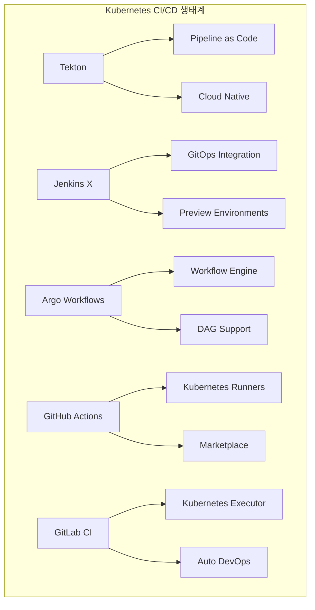
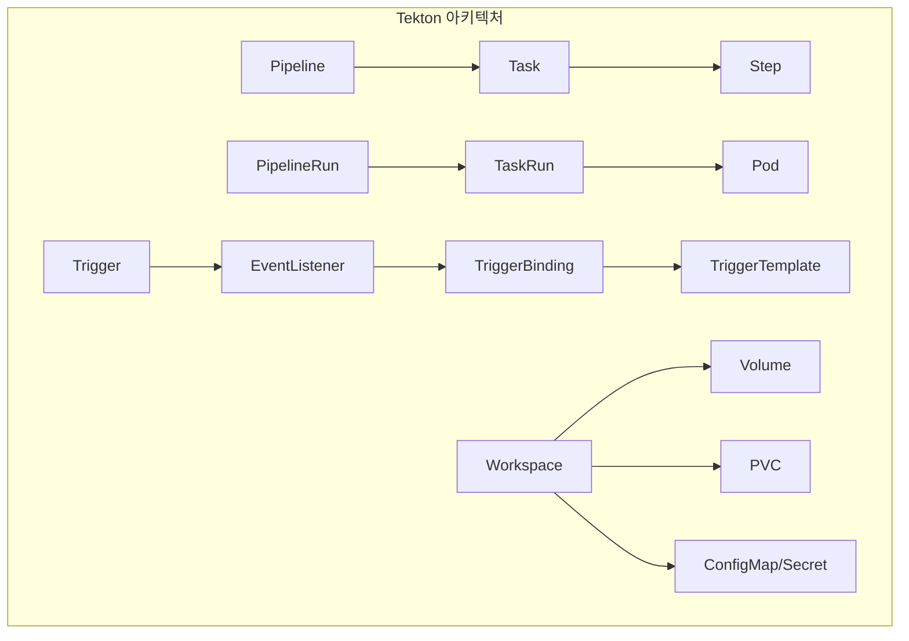
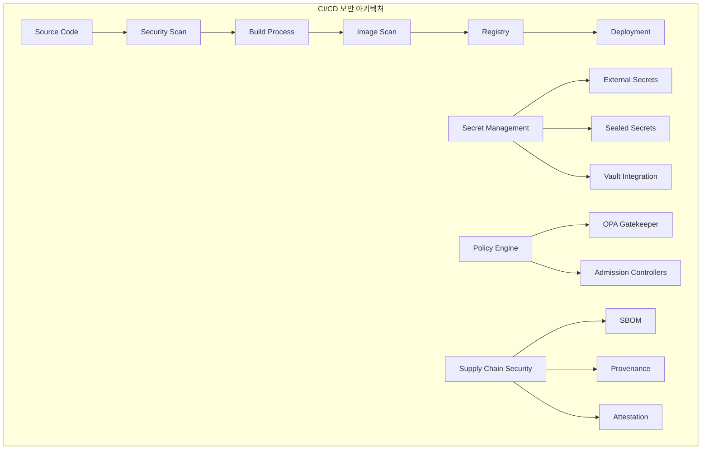
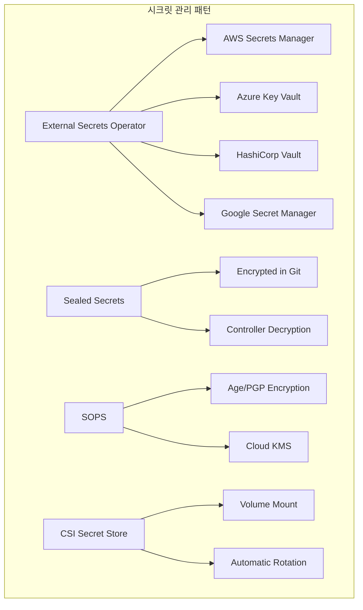
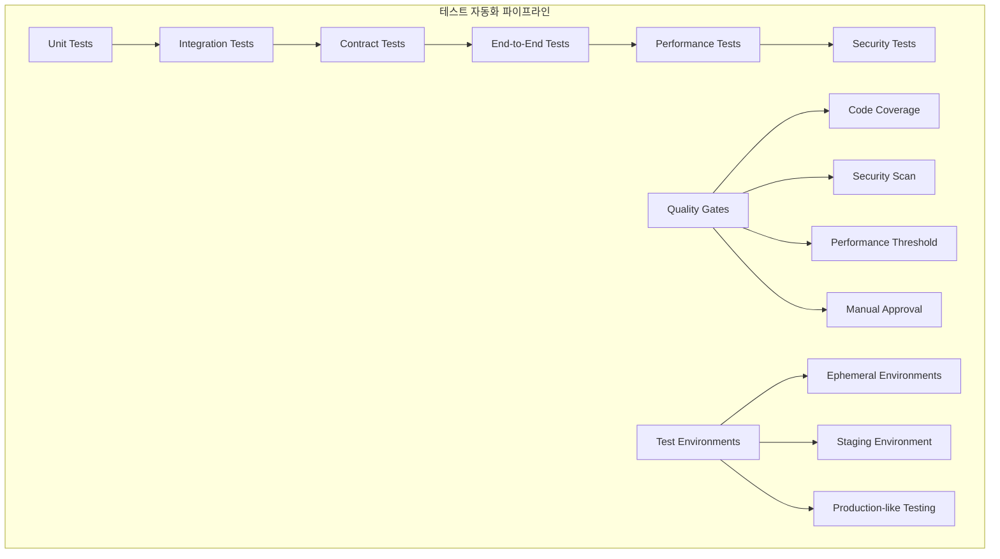

# Session 3: CI/CD 파이프라인 통합 전략

## 📍 교과과정에서의 위치
이 세션은 **Week 3 > Day 5 > Session 3**으로, Kubernetes 네이티브 CI/CD 도구와 파이프라인 보안 전략을 학습합니다.

## 학습 목표 (5분)
- **Kubernetes 네이티브 CI/CD** 도구와 **아키텍처** 이해
- **파이프라인 보안**과 **시크릿 관리** 전략 학습
- **테스트 자동화**와 **품질 게이트** 구현 방법 파악
- **배포 전략**과 **롤백 메커니즘** 설계 기법 습득

## 1. Kubernetes 네이티브 CI/CD 도구 (12분)

### Kubernetes CI/CD 생태계



### Tekton 아키텍처


### Kubernetes 네이티브 CI/CD 전략
```
Kubernetes 네이티브 CI/CD 도구:

Tekton 파이프라인:
   🔹 핵심 개념:
      • Task: 재사용 가능한 작업 단위
         • 컨테이너 기반 실행
         • 입력/출력 매개변수
         • 단계별 명령 정의
         • 리소스 요구사항 설정
      • Pipeline: Task들의 조합
         • DAG (Directed Acyclic Graph) 구조
         • 병렬 및 순차 실행
         • 조건부 실행 지원
         • 매개변수 전달
      • PipelineRun: Pipeline 실행 인스턴스
         • 실제 파이프라인 실행
         • 매개변수 값 제공
         • 실행 상태 추적
         • 결과 및 로그 수집
      • TaskRun: Task 실행 인스턴스
         • 개별 Task 실행
         • Pod로 실행
         • 리소스 할당
         • 실행 결과 저장
      • Workspace: 데이터 공유 공간
      • Task 간 데이터 공유
      • PVC, ConfigMap, Secret 지원
      • 임시 볼륨 사용
      • 파일 시스템 마운트
   🔹 장점:
      • Kubernetes 네이티브 실행
         • CRD 기반 정의
         • kubectl로 관리
         • RBAC 통합
         • 네임스페이스 격리
      • 컨테이너 기반 격리
         • 각 단계별 독립 실행
         • 이미지 기반 환경
         • 보안 격리
         • 리소스 제한
      • 확장성과 병렬 처리
         • 수평적 확장
         • 병렬 Task 실행
         • 클러스터 리소스 활용
         • 동적 스케일링
      • 재사용 가능한 컴포넌트
         • Task 라이브러리
         • 커뮤니티 카탈로그
         • 버전 관리
         • 매개변수화
      • 클라우드 중립적
      • 멀티 클라우드 지원
      • 온프레미스 실행
      • 하이브리드 환경
      • 표준 기반 구현
   🔹 구성 요소:
      • Tekton Pipelines: 핵심 엔진
         • CRD 정의 (Task, Pipeline 등)
         • 컨트롤러 구현
         • 실행 엔진
         • 상태 관리
      • Tekton Triggers: 이벤트 기반 실행
         • EventListener: 웹훅 수신
         • TriggerBinding: 이벤트 데이터 매핑
         • TriggerTemplate: 리소스 생성 템플릿
         • Interceptor: 이벤트 필터링
      • Tekton Dashboard: 웹 UI
         • 파이프라인 시각화
         • 실행 상태 모니터링
         • 로그 조회
         • 리소스 관리
      • Tekton Catalog: 재사용 가능한 Task
         • 공식 Task 라이브러리
         • 커뮤니티 기여
         • 버전 관리
         • 문서화
      • Tekton Chains: 공급망 보안
      • 아티팩트 서명
      • 프로베넌스 생성
      • SLSA 준수
      • 보안 감사
   🔹 사용 사례:
   🔹 클라우드 네이티브 애플리케이션
      • 컨테이너 이미지 빌드
      • Kubernetes 배포
      • 헬름 차트 패키징
      • 마이크로서비스 CI/CD
   🔹 마이크로서비스 아키텍처
      • 서비스별 독립 파이프라인
      • 의존성 관리
      • 통합 테스트
      • 서비스 메시 배포
   🔹 멀티 클라우드 환경
      • 클라우드 간 배포
      • 환경별 구성 관리
      • 재해 복구
      • 비용 최적화
   🔹 컨테이너 기반 워크로드
      • Docker 이미지 빌드
      • 보안 스캔
      • 레지스트리 푸시
      • 취약점 관리
   🔹 GitOps 워크플로우
   🔹 Git 기반 트리거
   🔹 자동 동기화
   🔹 설정 관리
   🔹 감사 추적

Jenkins X:
   🔹 특징:
      • Kubernetes 전용 Jenkins
         • 클라우드 네이티브 설계
         • 컨테이너 기반 실행
         • 동적 에이전트 생성
         • 자동 스케일링
      • GitOps 기본 통합
         • Git 기반 설정 관리
         • 자동 동기화
         • 버전 관리
         • 감사 추적
      • Preview Environment 자동 생성
         • PR별 환경 생성
         • 자동 정리
         • 격리된 테스트
         • 협업 지원
      • Tekton 기반 파이프라인
         • 클라우드 네이티브 실행
         • 재사용 가능한 Task
         • 병렬 처리
         • 확장성
      • 자동화된 프로모션
      • 환경 간 자동 배포
      • 승인 프로세스
      • 롤백 지원
      • 모니터링 통합
   🔹 아키텍처:
      • jx-git-operator: GitOps 컨트롤러
         • Git 저장소 모니터링
         • 변경 사항 감지
         • 자동 동기화
         • 상태 관리
      • jx-preview: Preview Environment 관리
         • PR 기반 환경 생성
         • 리소스 할당
         • 네트워킹 설정
         • 자동 정리
      • jx-promote: 환경 간 프로모션
         • 자동 프로모션 규칙
         • 승인 워크플로우
         • 버전 관리
         • 롤백 지원
      • Lighthouse: Webhook 처리
         • Git 이벤트 수신
         • 파이프라인 트리거
         • 상태 업데이트
         • 알림 발송
      • Tekton: 파이프라인 실행
      • Task 실행
      • 리소스 관리
      • 로그 수집
      • 상태 추적
   🔹 워크플로우:
      • 코드 커밋 → 자동 빌드
         • Git 푸시 감지
         • 파이프라인 트리거
         • 빌드 및 테스트
         • 아티팩트 생성
      • PR 생성 → Preview Environment
         • PR 이벤트 감지
         • 임시 환경 생성
         • 애플리케이션 배포
         • 테스트 실행
      • 머지 → 스테이징 배포
         • 메인 브랜치 머지
         • 스테이징 환경 배포
         • 통합 테스트
         • 품질 게이트 검증
      • 승인 → 프로덕션 프로모션
         • 수동/자동 승인
         • 프로덕션 배포
         • 모니터링 활성화
         • 알림 발송
      • 모니터링 및 피드백
      • 성능 메트릭 수집
      • 오류 추적
      • 사용자 피드백
      • 개선 사항 도출
   🔹 장점:
   🔹 완전 자동화된 워크플로우
      • 수동 개입 최소화
      • 일관된 프로세스
      • 오류 감소
      • 효율성 향상
   🔹 GitOps 모범 사례 적용
      • Git 기반 진실 공급원
      • 선언적 설정
      • 버전 관리
      • 감사 추적
   🔹 Preview Environment 지원
      • 조기 피드백
      • 협업 향상
      • 위험 감소
      • 품질 향상
   🔹 멀티 클러스터 관리
      • 환경별 클러스터
      • 중앙집중식 관리
      • 일관된 배포
      • 확장성
   🔹 보안 및 컴플라이언스
   🔹 RBAC 통합
   🔹 보안 스캔
   🔹 정책 적용
   🔹 감사 로깅
```

## 2. 파이프라인 보안과 시크릿 관리 (10분)

### CI/CD 보안 아키텍처


### 시크릿 관리 패턴



## 3. 테스트 자동화와 품질 게이트 (15분)

### 테스트 자동화 파이프라인



## 💬 그룹 토론: CI/CD 파이프라인 보안 우선순위 (8분)

### 토론 주제
**"CI/CD 파이프라인에서 보안을 강화할 때 성능과 개발 속도를 해치지 않으면서도 효과적인 보안 조치를 구현하는 우선순위는 무엇인가?"**

### 토론 가이드라인

#### 보안 vs 성능 트레이드오프 (3분)
- 필수 보안 조치: 절대 타협할 수 없는 보안 요구사항
- 선택적 보안 조치: 상황에 따라 조정 가능한 보안 기능
- 성능 영향: 각 보안 조치가 파이프라인 성능에 미치는 영향

#### 구현 우선순위 (3분)
- 1단계: 즉시 구현해야 할 기본 보안 조치
- 2단계: 점진적으로 강화할 보안 기능
- 3단계: 고도화된 보안 기능과 자동화

#### 조직별 고려사항 (2분)
- 규제 환경: 금융, 의료 등 규제가 엄격한 업계
- 팀 성숙도: 보안 전문성과 DevSecOps 문화 수준
- 리소스: 보안 도구 도입과 운영에 필요한 예산과 인력

## 💡 핵심 개념 정리
- Kubernetes 네이티브: Tekton, Jenkins X, Argo Workflows 등 클라우드 네이티브 도구
- 파이프라인 보안: 시크릿 관리, 보안 스캔, 정책 엔진 통합
- 테스트 자동화: 테스트 피라미드, 품질 게이트, 임시 환경
- 통합 전략: 도구 선택, 보안 강화, 품질 보장의 균형

## 📚 참고 자료
- [Tekton Documentation](https://tekton.dev/docs/)
- [Jenkins X Documentation](https://jenkins-x.io/docs/)
- [Argo Workflows Documentation](https://argoproj.github.io/argo-workflows/)
- [CNCF CI/CD Best Practices](https://github.com/cncf/tag-app-delivery/blob/main/cicd-best-practices/README.md)

## 다음 세션 준비
다음 세션에서는 **클러스터 운영과 유지보수**에 대해 학습합니다. 클러스터 업그레이드 전략과 노드 관리 방법을 다룰 예정입니다.