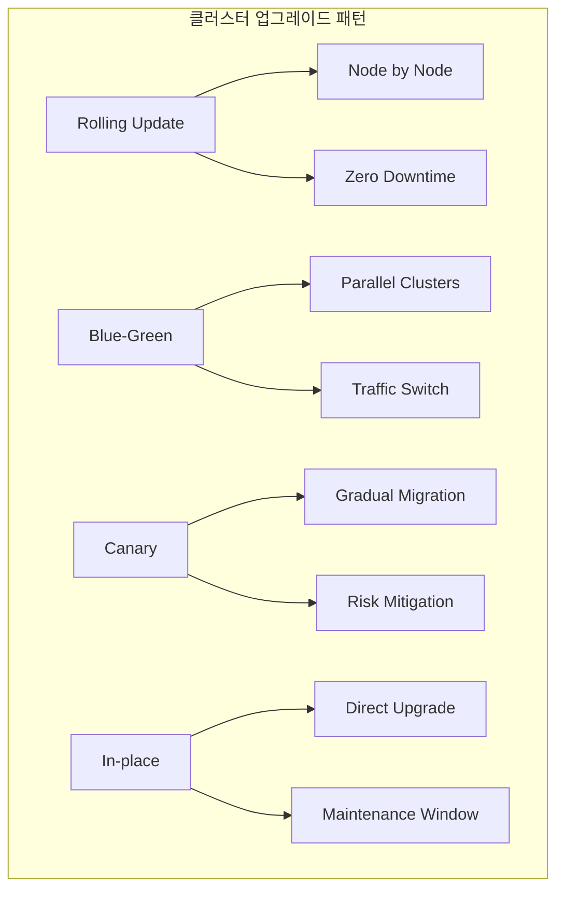
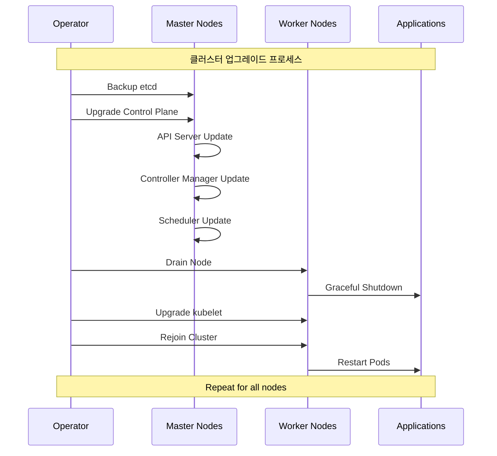

# Session 4: 클러스터 운영과 유지보수

## 📍 교과과정에서의 위치
이 세션은 **Week 3 > Day 5 > Session 4**로, Kubernetes 클러스터의 운영과 유지보수 전략을 학습합니다.

## 학습 목표 (5분)
- **클러스터 업그레이드** 전략과 **무중단 업그레이드** 방법 이해
- **노드 관리**와 **오토스케일링** 구성 및 운영 방법 학습
- **백업 및 재해 복구** 계획 수립과 **복구 절차** 파악
- **용량 계획**과 **리소스 최적화** 전략 습득

## 1. 클러스터 업그레이드 전략 (12분)

### 클러스터 업그레이드 패턴



### 업그레이드 전략 상세 분석

```
클러스터 업그레이드 전략:

1. Rolling Update (롤링 업데이트):
├── 개념:
│   ├── 한 번에 하나씩 노드를 업그레이드
│   ├── 서비스 중단 없이 점진적 업그레이드
│   ├── 가장 일반적이고 안전한 방법
│   └── Kubernetes 기본 업그레이드 방식
├── 장점:
│   ├── 무중단 서비스 (Zero Downtime)
│   │   ├── 애플리케이션 서비스 지속
│   │   ├── 사용자 영향 최소화
│   │   ├── 비즈니스 연속성 보장
│   │   └── SLA 준수 가능
│   ├── 위험 최소화
│   │   ├── 문제 발생 시 즉시 중단 가능
│   │   ├── 영향 범위 제한
│   │   ├── 단계별 검증 가능
│   │   └── 롤백 용이성
│   ├── 리소스 효율성
│   │   ├── 기존 클러스터 활용
│   │   ├── 추가 인프라 불필요
│   │   ├── 비용 효율적
│   │   └── 리소스 낭비 방지
│   └── 운영 편의성
│       ├── 표준 도구 사용
│       ├── 자동화 가능
│       ├── 모니터링 용이
│       └── 문서화된 프로세스
├── 단점:
│   ├── 업그레이드 시간 길어짐
│   │   ├── 노드별 순차 처리
│   │   ├── 검증 시간 포함
│   │   ├── 대규모 클러스터에서 오래 걸림
│   │   └── 유지보수 창 연장
│   ├── 버전 혼재 상황
│   │   ├── 업그레이드 중 다양한 버전 공존
│   │   ├── 호환성 문제 가능성
│   │   ├── 일시적 불일치 상태
│   │   └── 복잡한 상태 관리
│   └── 리소스 부족 위험
│       ├── 노드 제거 시 용량 부족
│       ├── Pod 재배치 실패 가능
│       ├── 성능 저하 위험
│       └── 스케줄링 문제
├── 구현 단계:
│   ├── 1단계: 사전 준비
│   │   ├── 백업 수행 (etcd, 설정)
│   │   ├── 업그레이드 계획 수립
│   │   ├── 롤백 계획 준비
│   │   └── 모니터링 설정
│   ├── 2단계: Control Plane 업그레이드
│   │   ├── API Server 업그레이드
│   │   ├── Controller Manager 업그레이드
│   │   ├── Scheduler 업그레이드
│   │   └── etcd 업그레이드 (필요시)
│   ├── 3단계: Worker Node 업그레이드
│   │   ├── 노드 Drain (Pod 안전 제거)
│   │   ├── kubelet 업그레이드
│   │   ├── kube-proxy 업그레이드
│   │   └── 노드 Uncordon (재활성화)
│   ├── 4단계: 검증 및 확인
│   │   ├── 클러스터 상태 확인
│   │   ├── 애플리케이션 동작 검증
│   │   ├── 성능 모니터링
│   │   └── 로그 분석
│   └── 5단계: 문서화
│       ├── 업그레이드 결과 기록
│       ├── 발생한 이슈 문서화
│       ├── 개선사항 도출
│       └── 다음 업그레이드 계획 수립
└── 모범 사례:
    ├── 테스트 환경에서 먼저 검증
    ├── 업그레이드 전 완전한 백업
    ├── 단계별 검증 포인트 설정
    ├── 자동화 도구 활용
    ├── 모니터링 강화
    ├── 롤백 계획 준비
    ├── 팀 간 소통 강화
    └── 문서화 철저히 수행

2. Blue-Green 업그레이드:
├── 개념:
│   ├── 두 개의 동일한 환경 운영
│   ├── Blue (현재), Green (새 버전)
│   ├── 트래픽 스위칭으로 전환
│   └── 즉시 롤백 가능
├── 장점:
│   ├── 즉시 전환 가능
│   │   ├── 트래픽 스위치만으로 전환
│   │   ├── 다운타임 최소화
│   │   ├── 사용자 영향 없음
│   │   └── 빠른 배포 완료
│   ├── 완전한 격리
│   │   ├── 새 환경에서 완전 테스트
│   │   ├── 기존 환경 영향 없음
│   │   ├── 독립적 검증 가능
│   │   └── 안전한 실험 환경
│   ├── 즉시 롤백
│   │   ├── 문제 발생 시 즉시 복구
│   │   ├── 트래픽만 다시 스위치
│   │   ├── 복구 시간 최소화
│   │   └── 비즈니스 영향 최소화
│   └── 검증 시간 충분
│       ├── 프로덕션 트래픽 전 완전 테스트
│       ├── 성능 검증 가능
│       ├── 보안 검증 수행
│       └── 품질 보장
├── 단점:
│   ├── 리소스 비용 2배
│   │   ├── 동일한 환경 두 개 필요
│   │   ├── 인프라 비용 증가
│   │   ├── 관리 복잡성 증가
│   │   └── 운영 오버헤드
│   ├── 데이터 동기화 복잡
│   │   ├── 상태 저장 애플리케이션 어려움
│   │   ├── 데이터베이스 마이그레이션 복잡
│   │   ├── 일관성 보장 어려움
│   │   └── 동기화 지연 문제
│   └── 네트워크 설정 복잡
│       ├── 로드 밸런서 설정
│       ├── DNS 관리
│       ├── 트래픽 라우팅 규칙
│       └── 모니터링 설정
├── 적용 시나리오:
│   ├── 중요한 프로덕션 시스템
│   ├── 다운타임 허용 불가 서비스
│   ├── 대규모 업그레이드
│   ├── 위험도가 높은 변경
│   └── 규제 요구사항이 엄격한 환경
└── 구현 고려사항:
    ├── 로드 밸런서 설정
    ├── 헬스체크 구성
    ├── 모니터링 대시보드
    ├── 자동화 스크립트
    ├── 롤백 절차
    └── 팀 교육 및 훈련

3. Canary 업그레이드:
├── 개념:
│   ├── 소수 노드부터 점진적 업그레이드
│   ├── 트래픽 일부만 새 버전으로 라우팅
│   ├── 단계적 확산 (5% → 25% → 50% → 100%)
│   └── 위험 최소화 전략
├── 장점:
│   ├── 위험 최소화
│   │   ├── 소규모부터 시작
│   │   ├── 문제 조기 발견
│   │   ├── 영향 범위 제한
│   │   └── 점진적 확신 구축
│   ├── 실시간 검증
│   │   ├── 실제 트래픽으로 테스트
│   │   ├── 성능 모니터링
│   │   ├── 사용자 피드백 수집
│   │   └── 지표 기반 의사결정
│   ├── 유연한 제어
│   │   ├── 트래픽 비율 조정 가능
│   │   ├── 단계별 중단 가능
│   │   ├── 세밀한 제어
│   │   └── 동적 조정
│   └── 학습 기회
│       ├── 단계별 경험 축적
│       ├── 문제 해결 능력 향상
│       ├── 모니터링 역량 강화
│       └── 팀 역량 개발
├── 단점:
│   ├── 복잡한 트래픽 관리
│   │   ├── 정교한 라우팅 규칙
│   │   ├── 세션 관리 복잡
│   │   ├── 상태 일관성 문제
│   │   └── 모니터링 복잡성
│   ├── 긴 업그레이드 시간
│   │   ├── 단계별 검증 시간
│   │   ├── 모니터링 대기 시간
│   │   ├── 의사결정 시간
│   │   └── 전체 완료까지 오래 걸림
│   └── 버전 혼재 기간 연장
│       ├── 다양한 버전 동시 운영
│       ├── 호환성 관리 복잡
│       ├── 디버깅 어려움
│       └── 운영 복잡성 증가
├── 구현 요소:
│   ├── 트래픽 분할 메커니즘
│   │   ├── Ingress Controller 설정
│   │   ├── Service Mesh 활용
│   │   ├── 로드 밸런서 규칙
│   │   └── Feature Flag 시스템
│   ├── 모니터링 시스템
│   │   ├── 실시간 메트릭 수집
│   │   ├── 알람 설정
│   │   ├── 대시보드 구성
│   │   └── 자동 분석 도구
│   ├── 자동화 도구
│   │   ├── 트래픽 비율 자동 조정
│   │   ├── 이상 감지 시 자동 롤백
│   │   ├── 단계별 자동 진행
│   │   └── 알림 자동 발송
│   └── 의사결정 기준
│       ├── 성공 지표 정의
│       ├── 실패 임계값 설정
│       ├── 진행 조건 명시
│       └── 롤백 조건 정의
└── 모범 사례:
    ├── 명확한 성공 기준 정의
    ├── 자동화된 모니터링
    ├── 빠른 롤백 메커니즘
    ├── 팀 간 소통 체계
    ├── 문서화된 절차
    └── 정기적인 훈련

4. In-place 업그레이드:
├── 개념:
│   ├── 기존 노드에서 직접 업그레이드
│   ├── 서비스 중단 시간 발생
│   ├── 유지보수 창 필요
│   └── 가장 간단한 방법
├── 장점:
│   ├── 리소스 효율성
│   │   ├── 추가 인프라 불필요
│   │   ├── 비용 최소화
│   │   ├── 기존 환경 활용
│   │   └── 관리 포인트 최소화
│   ├── 구현 단순성
│   │   ├── 복잡한 트래픽 관리 불필요
│   │   ├── 간단한 절차
│   │   ├── 도구 요구사항 최소
│   │   └── 학습 곡선 낮음
│   └── 빠른 완료
│       ├── 전체 업그레이드 시간 단축
│       ├── 의사결정 지점 최소
│       ├── 검증 단계 단순
│       └── 관리 오버헤드 최소
├── 단점:
│   ├── 서비스 중단
│   │   ├── 다운타임 발생 불가피
│   │   ├── 사용자 영향 발생
│   │   ├── 비즈니스 손실 가능
│   │   └── SLA 위반 위험
│   ├── 높은 위험도
│   │   ├── 실패 시 전체 시스템 영향
│   │   ├── 롤백 시간 오래 걸림
│   │   ├── 복구 복잡성
│   │   └── 데이터 손실 위험
│   └── 제한된 검증 기회
│       ├── 프로덕션 환경에서만 검증
│       ├── 문제 발견 시 이미 늦음
│       ├── 사전 테스트 제한적
│       └── 예상치 못한 문제 발생 가능
├── 적용 시나리오:
│   ├── 개발/테스트 환경
│   ├── 다운타임 허용 가능한 시스템
│   ├── 소규모 클러스터
│   ├── 긴급 보안 패치
│   └── 리소스 제약이 심한 환경
└── 주의사항:
    ├── 철저한 백업 필수
    ├── 롤백 계획 수립
    ├── 유지보수 창 확보
    ├── 사전 테스트 최대한 수행
    ├── 모니터링 강화
    └── 긴급 대응 체계 준비
```

### 업그레이드 프로세스

