# Session 4: 클러스터 운영과 유지보수

## 📍 교과과정에서의 위치
이 세션은 **Week 3 > Day 5 > Session 4**로, Kubernetes 클러스터의 운영과 유지보수 전략을 학습합니다.

## 학습 목표 (5분)
- **클러스터 업그레이드** 전략과 **무중단 업그레이드** 방법 이해
- **노드 관리**와 **오토스케일링** 구성 및 운영 방법 학습
- **백업 및 재해 복구** 계획 수립과 **복구 절차** 파악
- **용량 계획**과 **리소스 최적화** 전략 습득

## 1. 클러스터 업그레이드 전략 (12분)

### 클러스터 업그레이드 패턴

```mermaid
graph TB
    subgraph "클러스터 업그레이드 패턴"
        A[Rolling Update] --> B[Node by Node]
        A --> C[Zero Downtime]
        
        D[Blue-Green] --> E[Parallel Clusters]
        D --> F[Traffic Switch]
        
        G[Canary] --> H[Gradual Migration]
        G --> I[Risk Mitigation]
        
        J[In-place] --> K[Direct Upgrade]
        J --> L[Maintenance Window]
    end
```



### 업그레이드 전략 상세 분석

```
클러스터 업그레이드 전략:

1. Rolling Update (롤링 업데이트):
   🔹 개념:
      • 한 번에 하나씩 노드를 업그레이드
      • 서비스 중단 없이 점진적 업그레이드
      • 가장 일반적이고 안전한 방법
      • Kubernetes 기본 업그레이드 방식
   🔹 장점:
      • 무중단 서비스 (Zero Downtime)
         • 애플리케이션 서비스 지속
         • 사용자 영향 최소화
         • 비즈니스 연속성 보장
         • SLA 준수 가능
      • 위험 최소화
         • 문제 발생 시 즉시 중단 가능
         • 영향 범위 제한
         • 단계별 검증 가능
         • 롤백 용이성
      • 리소스 효율성
         • 기존 클러스터 활용
         • 추가 인프라 불필요
         • 비용 효율적
         • 리소스 낭비 방지
      • 운영 편의성
      • 표준 도구 사용
      • 자동화 가능
      • 모니터링 용이
      • 문서화된 프로세스
   🔹 단점:
      • 업그레이드 시간 길어짐
         • 노드별 순차 처리
         • 검증 시간 포함
         • 대규모 클러스터에서 오래 걸림
         • 유지보수 창 연장
      • 버전 혼재 상황
         • 업그레이드 중 다양한 버전 공존
         • 호환성 문제 가능성
         • 일시적 불일치 상태
         • 복잡한 상태 관리
      • 리소스 부족 위험
      • 노드 제거 시 용량 부족
      • Pod 재배치 실패 가능
      • 성능 저하 위험
      • 스케줄링 문제
   🔹 구현 단계:
      • 1단계: 사전 준비
         • 백업 수행 (etcd, 설정)
         • 업그레이드 계획 수립
         • 롤백 계획 준비
         • 모니터링 설정
      • 2단계: Control Plane 업그레이드
         • API Server 업그레이드
         • Controller Manager 업그레이드
         • Scheduler 업그레이드
         • etcd 업그레이드 (필요시)
      • 3단계: Worker Node 업그레이드
         • 노드 Drain (Pod 안전 제거)
         • kubelet 업그레이드
         • kube-proxy 업그레이드
         • 노드 Uncordon (재활성화)
      • 4단계: 검증 및 확인
         • 클러스터 상태 확인
         • 애플리케이션 동작 검증
         • 성능 모니터링
         • 로그 분석
      • 5단계: 문서화
      • 업그레이드 결과 기록
      • 발생한 이슈 문서화
      • 개선사항 도출
      • 다음 업그레이드 계획 수립
   🔹 모범 사례:
   🔹 테스트 환경에서 먼저 검증
   🔹 업그레이드 전 완전한 백업
   🔹 단계별 검증 포인트 설정
   🔹 자동화 도구 활용
   🔹 모니터링 강화
   🔹 롤백 계획 준비
   🔹 팀 간 소통 강화
   🔹 문서화 철저히 수행

2. Blue-Green 업그레이드:
   🔹 개념:
      • 두 개의 동일한 환경 운영
      • Blue (현재), Green (새 버전)
      • 트래픽 스위칭으로 전환
      • 즉시 롤백 가능
   🔹 장점:
      • 즉시 전환 가능
         • 트래픽 스위치만으로 전환
         • 다운타임 최소화
         • 사용자 영향 없음
         • 빠른 배포 완료
      • 완전한 격리
         • 새 환경에서 완전 테스트
         • 기존 환경 영향 없음
         • 독립적 검증 가능
         • 안전한 실험 환경
      • 즉시 롤백
         • 문제 발생 시 즉시 복구
         • 트래픽만 다시 스위치
         • 복구 시간 최소화
         • 비즈니스 영향 최소화
      • 검증 시간 충분
      • 프로덕션 트래픽 전 완전 테스트
      • 성능 검증 가능
      • 보안 검증 수행
      • 품질 보장
   🔹 단점:
      • 리소스 비용 2배
         • 동일한 환경 두 개 필요
         • 인프라 비용 증가
         • 관리 복잡성 증가
         • 운영 오버헤드
      • 데이터 동기화 복잡
         • 상태 저장 애플리케이션 어려움
         • 데이터베이스 마이그레이션 복잡
         • 일관성 보장 어려움
         • 동기화 지연 문제
      • 네트워크 설정 복잡
      • 로드 밸런서 설정
      • DNS 관리
      • 트래픽 라우팅 규칙
      • 모니터링 설정
   🔹 적용 시나리오:
      • 중요한 프로덕션 시스템
      • 다운타임 허용 불가 서비스
      • 대규모 업그레이드
      • 위험도가 높은 변경
      • 규제 요구사항이 엄격한 환경
   🔹 구현 고려사항:
   🔹 로드 밸런서 설정
   🔹 헬스체크 구성
   🔹 모니터링 대시보드
   🔹 자동화 스크립트
   🔹 롤백 절차
   🔹 팀 교육 및 훈련

3. Canary 업그레이드:
   🔹 개념:
      • 소수 노드부터 점진적 업그레이드
      • 트래픽 일부만 새 버전으로 라우팅
      • 단계적 확산 (5% → 25% → 50% → 100%)
      • 위험 최소화 전략
   🔹 장점:
      • 위험 최소화
         • 소규모부터 시작
         • 문제 조기 발견
         • 영향 범위 제한
         • 점진적 확신 구축
      • 실시간 검증
         • 실제 트래픽으로 테스트
         • 성능 모니터링
         • 사용자 피드백 수집
         • 지표 기반 의사결정
      • 유연한 제어
         • 트래픽 비율 조정 가능
         • 단계별 중단 가능
         • 세밀한 제어
         • 동적 조정
      • 학습 기회
      • 단계별 경험 축적
      • 문제 해결 능력 향상
      • 모니터링 역량 강화
      • 팀 역량 개발
   🔹 단점:
      • 복잡한 트래픽 관리
         • 정교한 라우팅 규칙
         • 세션 관리 복잡
         • 상태 일관성 문제
         • 모니터링 복잡성
      • 긴 업그레이드 시간
         • 단계별 검증 시간
         • 모니터링 대기 시간
         • 의사결정 시간
         • 전체 완료까지 오래 걸림
      • 버전 혼재 기간 연장
      • 다양한 버전 동시 운영
      • 호환성 관리 복잡
      • 디버깅 어려움
      • 운영 복잡성 증가
   🔹 구현 요소:
      • 트래픽 분할 메커니즘
         • Ingress Controller 설정
         • Service Mesh 활용
         • 로드 밸런서 규칙
         • Feature Flag 시스템
      • 모니터링 시스템
         • 실시간 메트릭 수집
         • 알람 설정
         • 대시보드 구성
         • 자동 분석 도구
      • 자동화 도구
         • 트래픽 비율 자동 조정
         • 이상 감지 시 자동 롤백
         • 단계별 자동 진행
         • 알림 자동 발송
      • 의사결정 기준
      • 성공 지표 정의
      • 실패 임계값 설정
      • 진행 조건 명시
      • 롤백 조건 정의
   🔹 모범 사례:
   🔹 명확한 성공 기준 정의
   🔹 자동화된 모니터링
   🔹 빠른 롤백 메커니즘
   🔹 팀 간 소통 체계
   🔹 문서화된 절차
   🔹 정기적인 훈련

4. In-place 업그레이드:
   🔹 개념:
      • 기존 노드에서 직접 업그레이드
      • 서비스 중단 시간 발생
      • 유지보수 창 필요
      • 가장 간단한 방법
   🔹 장점:
      • 리소스 효율성
         • 추가 인프라 불필요
         • 비용 최소화
         • 기존 환경 활용
         • 관리 포인트 최소화
      • 구현 단순성
         • 복잡한 트래픽 관리 불필요
         • 간단한 절차
         • 도구 요구사항 최소
         • 학습 곡선 낮음
      • 빠른 완료
      • 전체 업그레이드 시간 단축
      • 의사결정 지점 최소
      • 검증 단계 단순
      • 관리 오버헤드 최소
   🔹 단점:
      • 서비스 중단
         • 다운타임 발생 불가피
         • 사용자 영향 발생
         • 비즈니스 손실 가능
         • SLA 위반 위험
      • 높은 위험도
         • 실패 시 전체 시스템 영향
         • 롤백 시간 오래 걸림
         • 복구 복잡성
         • 데이터 손실 위험
      • 제한된 검증 기회
      • 프로덕션 환경에서만 검증
      • 문제 발견 시 이미 늦음
      • 사전 테스트 제한적
      • 예상치 못한 문제 발생 가능
   🔹 적용 시나리오:
      • 개발/테스트 환경
      • 다운타임 허용 가능한 시스템
      • 소규모 클러스터
      • 긴급 보안 패치
      • 리소스 제약이 심한 환경
   🔹 주의사항:
   🔹 철저한 백업 필수
   🔹 롤백 계획 수립
   🔹 유지보수 창 확보
   🔹 사전 테스트 최대한 수행
   🔹 모니터링 강화
   🔹 긴급 대응 체계 준비
```

### 업그레이드 프로세스

```mermaid
sequenceDiagram
    participant O as Operator
    participant M as Master Nodes
    participant W as Worker Nodes
    participant A as Applications
    
    Note over O,A: 클러스터 업그레이드 프로세스
    
    O->>M: Backup etcd
    O->>M: Upgrade Control Plane
    M->>M: API Server Update
    M->>M: Controller Manager Update
    M->>M: Scheduler Update
    
    O->>W: Drain Node
    W->>A: Graceful Shutdown
    O->>W: Upgrade kubelet
    O->>W: Rejoin Cluster
    W->>A: Restart Pods
    
    Note over O,A: Repeat for all nodes
```

